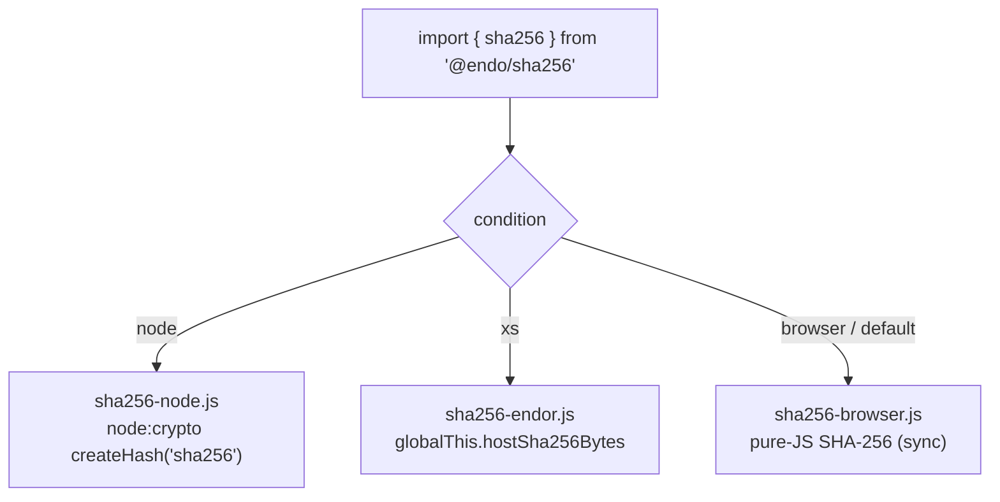

# Platform-neutral SHA-256 (`@endo/sha256`) to unblock the XS daemon bundle

| | |
|---|---|
| **Created** | 2026-07-22 |
| **Updated** | 2026-08-12 |
| **Author** | Kris Kowal (prompted) |
| **Status** | In Progress |

## Problem

`bundle-bus-daemon-endor.js` cannot generate `daemon_bootstrap.js` because a
module in the daemon's compartment graph statically imports **`node:crypto`**,
which the SES/XS bundler (`@endo/compartment-mapper/bundle.js`) cannot resolve.
The named blocker is `@endo/platform/fs/extended/shared/blobref.js`:

```js
import { createHash } from 'node:crypto';
// ...
const hashBytes = createHash('sha256').update(captured).digest();
```

`blobref.js` is reached from `@endo/platform/fs/extended` (via
`wrap-backend.js` → `makeBlobRefExo`). The package filter has been removed, and
the unfiltered graph confirms that the daemon's content-addressed blob handling
genuinely depends on this module, so its host dependencies must be selected by
package export conditions or supplied as injected powers rather than elided. The
Rust engine itself is healthy (82/82 cargo tests, ~2750 dual-run oracle tests,
stage-5 byte-identity met); the blocker is purely this static host-crypto import
in the bundle graph, which blocks `test:rust` and full endor daemon integration
(`endojs/endo-but-for-bots#600`).

## What crypto is actually needed on the XS bundle path

A survey of every `createHash(...)` and `node:crypto` importer in the tree
(excluding tests) establishes the real surface:

| Site | Algorithm | Shape | On XS bundle path? |
|---|---|---|---|
| `platform/.../shared/blobref.js` | sha256 | one-shot, `bytes → raw digest` | **Yes — the blocker** |
| `git/src/native-git-backend.js` (×2) | sha256 | one-shot, `bytes → raw digest` | Only until git is made injectable (see below) |
| `platform/src/fs-node/content-store-powers.js` | sha256 | streaming `makeSha256().update/digestHex` | No — `fs-node` is excluded |
| `platform/src/fs-node/local-blob.js` | sha256 | one-shot | No — `fs-node` excluded |
| `daemon/src/manager-node-powers.js` | sha256 | streaming (injected power) | No — Node-only, excluded |
| `check-bundle/index.js`, `compartment-mapper/src/node-powers.js` | **sha512** | streaming | No — not on daemon graph / `compartment-mapper` excluded |

Two conclusions drive the whole design:

1. **The needed digest is SHA-256 only, one-shot, over arbitrary binary
   (`Uint8Array`).** SHA-512 appears only in `check-bundle` and
   `compartment-mapper`, both off the XS daemon bundle graph, so **no
   `@endo/sha512` is required now.** (Leave the naming room for one later; do not
   build it.)
2. **Streaming SHA-256 is already solved and is *not* a bundler blocker.** The
   runtime `CryptoPowers` on the XS daemon is *injected* and already backed by
   Rust host functions. The bundler never sees `node:crypto` for those, because
   nothing *statically imports* it. The blocker is specifically the
   **module-scope static import** in modules that hash inline instead of
   receiving an injected power — today just `blobref.js` (and `native-git-backend`
   secondarily).

So the fix is narrow: replace the *static* `node:crypto` import in `blobref.js`
with a static import of a small platform-neutral package whose **xs** condition
resolves — through conditional exports the bundler *does* honor — to a module
backed by the host SHA-256 that already exists.

## Package: `@endo/sha256`

A small, dependency-light, buffer-oriented package. It does not carry the `exo-`
prefix — it exports plain functions, not passable interfaces over CapTP.

### API (synchronous, buffer-oriented)

```js
/**
 * One-shot SHA-256 over binary input, returning the raw 32-byte digest.
 * @param {Uint8Array} bytes
 * @returns {Uint8Array}  // length 32
 */
export const sha256 = bytes => { /* ... */ };

/**
 * Bring-your-own-buffer variant: write the 32-byte digest into `out`
 * at `offset` and return the number of bytes written (32). Throws
 * RangeError if `out.length - offset < 32`.
 * @param {Uint8Array} out
 * @param {Uint8Array} bytes
 * @param {number} [offset=0]
 * @returns {number}
 */
export const sha256Into = (out, bytes, offset = 0) => { /* ... */ };
```

- **Byte types:** input and output are `Uint8Array` — never Node `Buffer`,
  never strings. Callers that hash text encode it first (`@endo/bytes`
  `bytesFromText`), matching the existing daemon convention.
- **Digest form:** raw bytes, not hex and not base64. Encoding is the caller's
  choice via `@endo/base64` / `@endo/hex`, exactly as `blobref.js` already does
  (`encodeBase64(hashBytes)`). Keeping the primitive in raw bytes avoids baking
  an encoding into the package and keeps it one FFI round-trip on XS.
- **Synchronous:** the contract is sync because the sole in-graph consumer
  (`makeBlobRefExo`) computes the hash sync at construction. See *Open questions*
  for the WebCrypto tension this creates.
- **Errors:** non-`Uint8Array` input throws `TypeError`; `sha256Into` with an
  undersized buffer throws `RangeError`. No silent coercion.
- **Streaming is out of scope** for this package: the streaming shape is already
  served by the injected `CryptoPowers.makeSha256`. If a future static-import
  site needs streaming, add `makeSha256Hasher()` here then; do not build it
  speculatively.

## Conditional exports (`package.json`)

```jsonc
{
  "name": "@endo/sha256",
  "type": "module",
  "exports": {
    ".": {
      "xs": "./src/sha256-endor.js",
      "browser": "./src/sha256-browser.js",
      "node": "./src/sha256-node.js",
      "default": "./src/sha256-browser.js"
    },
    "./package.json": "./package.json"
  }
}
```



- **node** → `node:crypto`: `createHash('sha256').update(bytes).digest()`,
  returned as a plain `Uint8Array` (copy off the `Buffer`).
- **browser / default** → **pure-JS synchronous** SHA-256. Prior art already
  exists in-tree: `packages/chat/node-crypto-shim.js` is a 216-line synchronous
  pure-JS SHA-256 (`rotr`-based, sha256-only) written precisely as the browser
  stand-in that `@endo/platform/fs/extended` reaches through Vite's `node:crypto`
  alias. `@endo/sha256`'s JS implementation is the canonical home for that code;
  the chat shim should then re-export from here rather than carry its own copy.
- **xs** -> the **Endor host contract** (next section). This is the condition
  the current Endor/XS bundler follows. The target is named `sha256-endor.js`
  because the same contract applies when Endor runs IronHorse.

The `default` maps to the pure-JS build so the package is safe under any
bundler/condition that does not set `node`/`xs`/`browser` (and so `test:rust`'s
own Node-side tests can compare the pure-JS output against `node:crypto`).

## Endor host interface contract

Endor provides `hostSha256Bytes(bytes) -> ArrayBuffer` on `globalThis` before
application modules evaluate. The contract belongs to Endor, not to XS:
Endor/XS registers it from `rust/endo/xsnap/src/powers/crypto.rs`, and
Endor/IronHorse provides the same global at its engine boundary.

**`sha256-endor.js`:**

```js
export const sha256 = bytes => {
  const digest = globalThis.hostSha256Bytes(bytes);
  return new Uint8Array(digest).slice();
};

export const sha256Into = (out, bytes, offset = 0) => {
  const d = sha256(bytes);
  if (out.length - offset < 32) throw RangeError('sha256Into: output too small');
  out.set(d, offset);
  return 32;
};
```

The implementation validates the input and the host's result, including the
32-byte digest length. It has no pure-JavaScript or streaming fallback:
selecting the Endor build without this host contract is a configuration error.

The XS host adds the one-shot binary function as follows:

- **Rust:** `host_sha256_bytes(the: *mut XsMachine)` in
  `powers/crypto.rs` — read the argument `Uint8Array` as a byte slice, compute
  `Sha256::digest(slice)`, return the 32 raw bytes as an `ArrayBuffer`
  (preferred: no hex string allocation). Append it to `CALLBACKS` in registration
  order and add the snapshot-table entry.
- **Global:** expose as `globalThis.hostSha256Bytes`; declare it in
  `bus-xs-host-globals.d.ts`.
- **JS:** `sha256-endor.js` requires `hostSha256Bytes`.

Registration-order and snapshot-table discipline (the `CALLBACKS` array) is the
one sharp edge: a new callback must be appended (never inserted) so existing
snapshot tables stay valid — mirror how `host_sha256_update_bytes` was itself
added after `host_sha256_update`.

## `blobref.js` refactor (and the git note)

The refactor is a one-line import swap plus a base64 spelling that already holds:

```diff
-import { createHash } from 'node:crypto';
+import { sha256 } from '@endo/sha256';
 // ...
-  const hashBytes = createHash('sha256').update(captured).digest();
+  const hashBytes = sha256(captured);
   const info = harden({
     algorithm: 'sha256',
     hash: encodeBase64(hashBytes), // unchanged: raw bytes → base64
     size: BigInt(captured.length),
   });
```

`encodeBase64` already operates over a `Uint8Array` (the comment in `blobref.js`
notes it deliberately avoids `Buffer.prototype.toString('base64')`), so switching
the digest source from a `Buffer` to a plain `Uint8Array` is behavior-preserving.
Add `@endo/sha256` to `@endo/platform`'s `dependencies`.

Byte-for-byte equivalence is verifiable in Node: `sha256(bytes)` (pure-JS and
`node:crypto` paths) must equal `createHash('sha256').update(bytes).digest()` for
the existing `blobref.test.js` / `local-blob.test.js` vectors, which already
assert against `node:crypto`.

**The git backend is a separate lever, not part of this package's critical
path.** `rust/endo/README.md` records that `@endo/git`'s `makeNativeGitBackend`
(imported eagerly in `daemon.js`) is *also* a bundle blocker, but its fix is to
make the git backend **injectable** (as `better-sqlite3` already is) and select a
non-Node implementation through package export conditions —
`native-git-backend.js` also uses `child_process` to spawn `git`, which cannot
run under XS regardless. Migrating its two `createHash` sites to
`@endo/sha256` is a worthwhile consistency follow-up (tracked separately; to be
filed against `endojs/endo-but-for-bots`), **not** a prerequisite for generating
`daemon_bootstrap.js`.

## Phased build plan

1. **`@endo/sha256` package, browser + node + Endor builds.** Author
   `sha256-browser.js` (lift `node-crypto-shim.js`'s pure-JS core), `sha256-node.js`,
   and `sha256-endor.js` (one-shot `hostSha256Bytes`). Unit tests cross-check
   all three against `node:crypto` vectors. **This alone unblocks the bundle**
   once step 2 lands. *First buildable increment.*
2. **Point `blobref.js` at `@endo/sha256`;** add the dependency; run
   `blobref.test.js` / `local-blob.test.js`.
3. **Regenerate the bundle:** `node
   packages/daemon/scripts/bundle-bus-daemon-endor.js` now passes the
   blobref/`fs/extended` leg. (Resolve the `@endo/git` exclusion in parallel per
   the README; the two are independent legs of the same "no `node:` builtins in
   the graph" fix.) Then `yarn --cwd packages/daemon test:rust`.
4. **Fold `packages/chat/node-crypto-shim.js` into `@endo/sha256`** — chat
   re-exports the browser build; delete the duplicate pure-JS SHA-256.
5. Add the `host_sha256_bytes` Rust host function; migrate
   `native-git-backend.js`'s two sites.

The follow-on implementation wants the **dedicated builder** the topic-11 xs2rust
press has been recommending, not the hourly press.

## Alternatives considered

- **Make `blobref` hashing an injected power (like `content-store-powers`).**
  Rejected: `makeBlobRefExo` is a synchronous exo factory called in synchronous
  contexts across three `Filesystem` implementations; threading a power through
  every call site is a far larger, more invasive change than a static-import swap
  — and the injected-power path is already covered for the *streaming* consumers.
- **Restore a package filter to drop `fs/extended`.** Rejected: the daemon's
  blob handling actually executes `makeBlobRefExo` at runtime, so filtering it
  would mask a real platform dependency rather than make the bundle viable.
- **Ship an `@endo/sha512` alongside.** Rejected as premature: no SHA-512 site is
  on the XS daemon bundle graph. Reserve the name; do not build it.

## Implementation status

All five phases land in
[#903](https://github.com/endojs/endo-but-for-bots/pull/903). The Endor build
requires `hostSha256Bytes`, and `native-git-backend.js` uses the package for
both of its SHA-256 sites.

Two things the survey above did not anticipate, both found by running the
bundler and both fixed in the same pull request, because `@endo/sha256` alone
left the bundle failing on fifteen further `node:` imports:

- `@endo/exo-git` reached `readOnly` and `wrapBackend` through the
  `@endo/platform/fs/extended` **index**, which also re-exports
  `makeNodeFilesystem` / `makeNodeFsBackend` and so pulled `node:fs`,
  `node:fs/promises`, and `node:path` onto the graph. It now imports those two
  modules by their own specifiers.
- The `@endo/git` exclusion this document deferred turned out to be a
  prerequisite after all, together with `@endo/host-spawner`: both are
  statically imported by `manager.js` / `host.js`. They are now injected as
  `DaemonicPowers.hostTools`, mirroring the injected `better-sqlite3`
  `Database`, and both packages are excluded from the bundle.

The bundler also now passes the `xs` condition. Without it `@endo/sha256`
resolves its `default` arm, so the bundle would have carried the pure-JS digest
rather than binding to the Rust host.

## Resolved questions

- **How should the WebCrypto async shape be reconciled with the sync API?**
  The charter asked the browser condition to use `crypto.subtle.digest`, which
  is async (`Promise<ArrayBuffer>`) and cannot back a synchronous
  `sha256(bytes) -> bytes`. *Resolved as this design proposed:* the browser
  build is synchronous pure JS, and a WebCrypto `sha256Async` is left as a
  separately named future export rather than built speculatively. Making the
  core API async would have rippled through every `Filesystem` implementation
  that mints a `BlobRef`.
- **One-shot binary host function now or later?** *Resolved: now.* Endor's
  platform contract exposes `hostSha256Bytes` regardless of whether XS or
  IronHorse executes the JavaScript.
- **`native-git-backend.js` migration scope?** *Resolved: included.* Its two
  `createHash` sites now use `@endo/sha256`; text is encoded with
  `@endo/bytes`'s `bytesFromText`.
