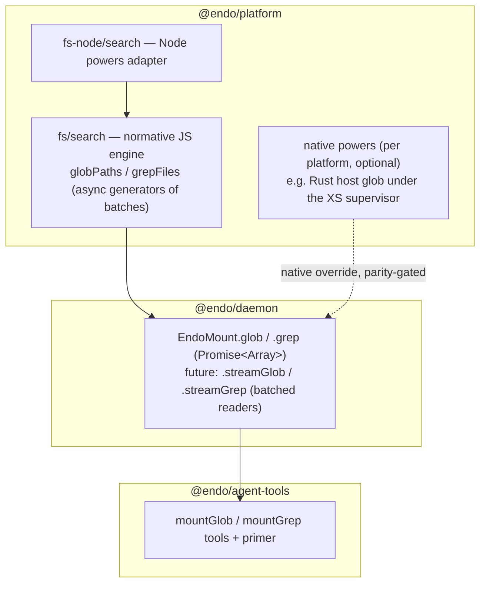

# Platform Search Pushdown: glob and grep in `@endo/platform`

| | |
|---|---|
| **Created** | 2026-07-10 |
| **Author** | Kris Kowal (prompted) |
| **Status** | Not Started |
| **Source** | Maintainer directive on the PR #127 reconstruction stack (orchestration `orch-endo-glob-grep-pushdown`); supersedes the streaming surface of [mount-stream-glob-grep](mount-stream-glob-grep.md) |

## What is the Problem Being Solved?

The PR #127 reconstruction stack ([mount-extensions-reconstruction](mount-extensions-reconstruction.md))
gives `EndoMount` a `glob()` (PR #653) and a `grep()` (PR #655) implemented as
plain JavaScript inside `packages/daemon/src/mount.js`. That code is working
and normative, but the shape has three tensions the maintainer has directed
this design to resolve:

1. **Implementation altitude.** The walker lives in the daemon, so nothing
   else (the extended capability filesystem, genie's hand-rolled glob in
   `packages/genie/src/tools/filesystem.js`, a future Rust-native walk) can
   share it, and no platform can substitute a faster native implementation.
   The implementation should be **pushed down into `@endo/platform`** and
   **revealed at the daemon layer**, as far down as each platform allows,
   case by case.
2. **Streaming-forward interface.** `Promise<Array>` is the right present-day
   surface — it reveals little machinery — but it must be one case of a
   design that also accommodates future exo-stream variants. The exo-stream
   protocol carries **one element per CapTP message** regardless of its
   `buffer` pipelining depth (see `packages/exo-stream/DESIGN.md`), so a
   stream of individual matches would perform very poorly. The streaming
   design must make **batching intrinsic**: the stream element type is a
   *group* of results, never a single result.
3. **Coupling.** PR #655's `grep(pattern, { glob })` embeds glob as an option
   of grep. The two must **decompose so they compose**: glob is an
   independent producer of paths (an array today, a stream tomorrow), and
   grep is a consumer of paths (`Array`, `Promise<Array>`, later a stream),
   so a glob file-stream pipelines into grep instead of grep owning glob.

## Design



### The pushdown seam: `@endo/platform/fs/search`

A new platform-agnostic module, `packages/platform/src/fs/search.js`,
exported as `@endo/platform/fs/search`, following the factoring precedent of
`makeWatchDirectory` (PR #592): a **factory over narrowed powers**, no
ambient authority, consumed by the daemon through a dedicated subpath.

```js
/**
 * makeSearch(powers) -> Search
 *
 * powers — the narrow read contract the engine walks with:
 *   readDirectory(path) -> Promise<string[]>       // names, one level
 *   isDirectory(path)   -> Promise<boolean>
 *   readFileText(path)  -> Promise<string>         // may reject; grep skips
 *   joinPath(...segments) -> string
 *   maybeRealPath(path) -> Promise<string | undefined>  // confinement + cycle checks
 *                       // (already in @endo/platform/fs/extended/shared/helpers.js)
 *
 * Search:
 *   globPaths(root, pattern, options) -> AsyncGenerator<string[]>
 *   grepFiles(root, regexSource, paths, options) -> AsyncGenerator<GrepMatch[]>
 *     // paths: Iterable<string> | AsyncIterable<string[]> | undefined
 *     // (an array, or a stream of path batches; omitted = every file under root)
 */
```

- **The generators yield batches** (`string[]` of mount-relative paths;
  `GrepMatch[]` of `{ file, line, text }` records). Batching is intrinsic to
  the normative engine, not an optimization added at the stream layer: the
  eager Array surface is a flatten-and-cap collector over the same
  generators, and the future stream surface is `readerFromIterator` over
  them, so the two surfaces cannot drift.
- **Enforcement inputs are declarative data, not callbacks.** `options`
  carries `{ deniedSegments: string[], batchSize?: number }` (glob adds
  `includeDirectories`, grep adds `maxResults`); the engine applies denial
  *during* the walk (a denied directory is never descended into) and never
  follows a path out of `root` (symlinks are not traversed; confinement by
  construction, matching PR #653's semantics). Declarative inputs are what
  lets the same contract cross a native seam as plain data — a callback per
  directory entry would pin the walk to JavaScript forever.
- **The pattern dialects are unchanged** from the reconstruction plan
  ([mount-extensions-reconstruction](mount-extensions-reconstruction.md)
  § PR B, § PR C): glob's only metacharacters are `*` (within-segment, dot
  matching) and whole-segment `**`; everything else is literal; results sort
  lexicographically by UTF-16 code unit. Grep patterns are ECMA-262 regular
  expression sources evaluated flagless. The engine is the single normative
  definition; `packages/daemon/src/mount.js` deletes its private walker.
  PR #653's implementation moves down intact: `parseGlobPattern`,
  `compileGlobSegment` (which stays the linear two-pointer scan, deliberately
  not a `RegExp`, so caller-controlled patterns cannot trigger catastrophic
  backtracking), the `visited`-memoized `**` walk, and the sort-then-cap
  discipline. `mount-glob-contract.json` (the machine-readable rules contract
  PR #653 introduced) moves with the engine and is asserted against its
  exported constants, so code and contract cannot drift.
- **Ordering and batch boundaries.** The *flattened* sequence order is
  normative (sorted, deterministic, identical to the eager result). Batch
  boundaries are **not** semantic: consumers must not depend on how results
  group, and producers may flush early (e.g. a smaller first batch for
  time-to-first-result). Parity tests always compare flattened sequences.

The Node adapter, `packages/platform/src/fs-node/search.js`, exports
`makeNodeSearchPowers(fs)` (narrowed to `readdir`/`stat`/`readFile`), with
`./fs/node/search` and `./fs/search` subpath exports added to
`packages/platform/package.json` alongside the barrel re-exports, exactly as
the watch-directory factoring did.

### Native pushdown, case by case

The daemon selects an implementation through one seam:

```js
// @endo/platform/fs/search
provideSearch(filePowers) -> Search
// uses filePowers.search when the platform powers supply one,
// else makeSearch over the generic read powers
```

`FilePowers` (in `packages/daemon/src/types.d.ts`, per-platform
implementations in `daemon-node-powers.js` and
`bus-daemon-rust-xs-powers.js`) gains an **optional** `search` member with
the `Search` shape above. Where absent, the normative JS engine over the
existing `readDirectory`/`readFileText` powers *is* the implementation.

| Platform | glob | grep | How far down |
|---|---|---|---|
| Node (V8) | Normative JS engine. Node's `fs.promises.glob` (22+) was considered and rejected: the repo's engine floor is `node >=16`, and its POSIX-ish dialect (`?`, `[]` active, dot-hiding) mismatches ours (`*`/`**` only, everything else literal), so it could serve only as a candidate enumerator behind an authoritative re-filter — no win over the JS walk, which is syscall-bound. | Normative JS engine; `RegExp` is already native V8. A subprocess `rg` fast path via `@endo/platform/proc` (`systemCapture` + `whichProg`) is named but deferred: it reintroduces ambient authority and a third regex dialect. | The JS engine over `node:fs` powers is the floor and the implementation. |
| XS under the Rust supervisor | **The pushdown case that pays.** A `hostGlob` host function in `rust/endo/xsnap/src/powers/fs.rs` (cap-std `Dir` walk + a hand-rolled matcher — the dialect is two metacharacters, so an exact native match is small and auditable), surfaced as `filePowers.search.globPaths` in `bus-daemon-rust-xs-powers.js`. The PR #654 `rust/mount_parity` crate already mirrors the matcher, walker, UTF-16 ordering, and deny set in Rust against the shared case tables; the follow-up promotes that test-only mirror into the live host function. Wins: the walk stops crossing the XS↔Rust boundary once per directory, and no XS JS executes per entry. | Case-by-case at the *pattern* level: a `hostGrepFiles` (Rust `regex` crate) serves patterns inside a conservative syntactic subset (literals, character classes, anchors, alternation, bounded quantifiers — the subset the parity case tables already restrict to); `provideSearch` inspects the pattern (`isConservativeRegex(source)`, exported by `fs/search`) and falls back to the JS engine on XS for anything outside it, because Rust `regex` is not ECMA-262 (no backreferences or lookaround, different corner semantics). Content reads stay on the Rust side; only match records cross. | Glob fully native; grep native for the conservative subset, normative JS otherwise. A named follow-up layer (not in this stack), gated on the case-table parity runner (PR #654) **and on the conservative-regex-subset design (a dedicated `@endo/regexp`-style project, PR #675 review) that `isConservativeRegex` takes a dependency on** — see Resolved decisions below. |
| Go host (`daemon-go.js`) | Node-fs-backed powers today → JS engine. | Same. | Nothing extra until a Go-native powers set exists. |
| Browser (reserved `"browser"` condition) | JS engine over whatever read powers the host grants. | Same. | The powers-parameterized engine is the browser story; no native facility exists. |
| Extended capability FS / genie | The engine's powers contract is satisfiable by an `FsBackend` adapter, so `@endo/platform/fs/extended` and genie's `listDirectory` glob can consolidate onto the one normative engine. | Same. | Named follow-up (to be filed); genie's inline glob-to-regex is the duplication this retires. |

### The Array surface (committed shape)

- `glob(pattern, options?) -> Promise<string[]>` — externally unchanged from
  PR #653; internally a collector over `globPaths`. On reaching
  `GLOB_MAX_RESULTS` it **throws by default**; a caller opts into a capped,
  non-throwing result with `options.truncate`. Throwing is the unsurprising
  default (a silently short list misleads); truncation is a deliberate
  opt-in, and the streaming surface is the durable answer for large result
  sets.
- `grep(pattern, paths?, options?) -> Promise<Array<{ file, line, text }>>`
  — **revised from PR #655**, which is `grep(pattern, { glob, maxResults })`:
  - `paths` is `string[] | Promise<string[]>`. The method guard moves from
    `M.call` to `M.callWhen(M.string()).optional(M.await(M.arrayOf(M.string())), …)`
    so the exo layer awaits and shape-checks the argument (`M.await` is the
    `@endo/patterns` awaited-argument guard, legal only under `M.callWhen`).
    Passing the promise from `glob` composes and pipelines over CapTP:
    `E(mount).grep('TODO', E(mount).glob('src/**/*.js'))`.
  - `paths` omitted defaults to every file under the mount face's root.
    This is a domain default, not glob coupling: no pattern option exists on
    grep. (`options.glob` is deleted.)
  - Each supplied path is resolved against the face's confinement root and
    deny set; a path that is denied, escaping, a directory, or unreadable is
    **skipped silently** — the same failure envelope grep already applies to
    unreadable files, and the behavior that makes glob-produced and
    hand-supplied paths uniform.
  - `options` keeps `maxResults` (default 1,000).

The Array case and the streaming case are deliberately parallel: array of
paths in, array of matches out today; stream of path batches in, stream of
match batches out tomorrow; glob is an independent producer of either.

### The streaming surface (forward design; supersedes [mount-stream-glob-grep](mount-stream-glob-grep.md))

Not implemented in this stack. Designed here so the engine seam it needs is
what the builder lands now, and so the earlier streaming design's
one-element-per-message shape does not get built.

```
streamGlob(pattern, options?) -> PassableReader<string[]>
streamGrep(pattern, paths?, options?) -> PassableReader<Array<{ file, line, text }>>
  where paths: string[] | Promise<string[]> | ERef<PassableReader<string[]>>
```

- **Intrinsic batching.** The stream element is a hardened *batch* — the
  same batches the engine generators yield —
  so `readPattern` is `M.arrayOf(M.string())` (glob) /
  `M.arrayOf(harden({ file: M.string(), line: M.number(), text: M.string() }))`
  (grep). One CapTP message carries one batch; the exo-stream `buffer`
  option then counts batches in flight, multiplying rather than substituting
  for batching. `options.batchSize` is clamped (default 64, ceiling 1,024);
  there is no `maxResults` — the consumer bounds the stream by closing it,
  which stops the walk (unchanged from the prior streaming design, as are
  per-step `assertLive()` revocation, deny/confinement parity by shared
  walker, and sorted deterministic order).
- **The pipeline seam.** `streamGrep` accepts a **reader of path batches**
  where the eager method accepts an array, so
  `E(mount).streamGrep('TODO', E(mount).streamGlob('src/**'))` pipelines
  glob into grep with no intermediate materialization. Closing the grep
  stream closes the paths reader (`return()`), which stops the glob walk —
  cancellation propagates down the pipeline.
- **Small exo-stream additions** (one module, `batching.js`, in
  `@endo/exo-stream`): `batchIterator(iterable, batchSize)` (producer-side
  regrouping) and `iterateBatchedReader(readerRef, options)` (consumer-side
  flattening, so `for await (const match of iterateBatchedReader(r))` reads
  naturally). Both are thin, reusable idioms rather than protocol changes;
  `followNameChanges` and future watchers can adopt the same shape.
- Implementation lands as its own layer after the Array stack merges (see
  the map below). The prior streaming design PR (#647) should be updated to
  point here rather than merged as written; its test plan (parity,
  incrementality, backpressure, cancellation, mid-stream revocation) carries
  over with elements replaced by batches.

### Daemon reveal

Search is revealed where the mount already is: `EndoMount` methods, built by
`makeMountExo` delegating to `provideSearch(filePowers)` with each face's
own confinement root and deny set (a `subView`'s glob/grep see only its
sub-root; the revocation `ctx` gate wraps every call). No new formula type:
mounts reach consumers through the existing `mount`/`scratch-mount`
formulas, and search rides the mount. The conformance allowlist
(`ENDOMOUNT_EXTENSIONS` in
`packages/daemon/test/mount-platform-fs-conformance.test.js`) keeps `glob`
and `grep` (streaming methods join it when they land); interface guards and
`help-text-data.js` entries update for the revised grep signature, with the
help text teaching the composition idiom.

### Agent tool surface and primer

This fills the empty **Search** group of
[daemon-agent-tools](daemon-agent-tools.md), resolving its Open Question 2
(capability-backed search, not allowlisted shell `grep`).

- **Tools** (`packages/agent-tools/src/mount-search.js`, per the `makeTool`
  conventions of [endo-agent-tools](endo-agent-tools.md)):
  `makeMountGlobTool` / `makeMountGrepTool` / composite
  `makeMountSearchTools`, closing over
  `MountSearchToolCapability = Pick<EndoMount, 'glob' | 'grep'>` (smallest
  slice, locally typed to avoid a circular `@endo/daemon` dependency, per the
  `git-mount-tool.js` precedent). Names are `mountGlob` / `mountGrep`,
  matching the `mount*` file-tool namespace. Both are `scope: 'read'` and
  survive `readOnly` composition. Considered and deferred: binding
  `ERef<Filesystem>` like the other mount-fs tools, which requires the
  extended capability filesystem to grow engine-backed search first — that is
  the consolidation follow-up, and the tools can rebind then without any
  schema change.
- **Tool schemas.** Patterns and paths are plain strings authenticated at
  the mount boundary, never petnames (per the daemon-agent-tools petname
  rule for high-cardinality data).
  - `mountGlob { pattern: string, maxResults?: number }` →
    `{ paths: string[], truncated: boolean }`.
  - `mountGrep { pattern: string, filesGlob?: string = '**/*', maxResults?: number }`
    → `{ matches: Array<{ file, line, text }>, truncated: boolean }`.
    The tool-level `filesGlob` parameter is deliberate sugar: an LLM calling
    two tools would pay a round trip *and* the token cost of ferrying a path
    list through its context, so the tool handler performs the composition —
    `E(mount).grep(pattern, E(mount).glob(filesGlob))` — demonstrating the
    pipeline seam while the *capabilities* stay decoupled.
  - `truncated` follows the Shell tool's flag-not-error precedent: the tool
    handler passes `options.truncate` down to the capability, so the agent
    surface gets a capped result plus a flag rather than the capability's
    default throw. The descriptions tell the model results are capped and how
    to narrow.
- **Code mode**: `declare const` entries for both tools in
  `packages/agentry/src/execute/fs-types.js` via the existing
  `formatGlobalDeclarations` pipeline.
- **Primer copy** (`packages/lal/primer/tools.md`, verbatim target for the
  builder):

  > **mountGlob(pattern, maxResults?)** — find files by name under a mount.
  > Pattern metacharacters: `*` (within one path segment, matches dot-files)
  > and `**` (a whole segment, any depth); everything else is literal, so
  > `?`, `[`, `{` need no escaping. Returns sorted mount-relative paths and
  > a `truncated` flag. Use it to discover structure before reading files.
  >
  > **mountGrep(pattern, filesGlob?, maxResults?)** — search file contents
  > under a mount. `pattern` is a JavaScript regular expression (no flags);
  > `filesGlob` narrows which files are searched (default every file).
  > Returns `{ file, line, text }` matches and a `truncated` flag.
  >
  > Compose them: `mountGlob` finds files by *name*; `mountGrep` finds
  > *content* within files selected by name. Prefer one `mountGrep` with a
  > `filesGlob` over `mountGlob` followed by many reads; when `truncated` is
  > true, narrow the pattern or the glob rather than paging. Both respect
  > the mount's confinement and denied names (`.ssh`, `.env`, …): denied
  > paths simply never appear.

## Per-layer implementation map (the #127 stack)

The stack today: #650 (A, revocation — merging) → #653 (B, glob) →
#655 (C, grep) → #657 (D, JSON). B and C are open, un-merged, bot-owned
branches, so they are **revised in place** rather than stacked over and
refactored later — the maintainer has already redirected their shape.
Considered and rejected: merge the stack as-is, refactor after. Reason: it
knowingly merges a grep surface (`options.glob`) this design deletes.

| Layer | PR / branch | Change |
|---|---|---|
| A | #650 `feat/mount-revocation` | **Untouched** (merging now); the deny-set and revocation `ctx` are inputs to everything below. |
| **P (new)** | `feat/platform-search`, based on A's head (or `llm` once A merges) | `@endo/platform/fs/search` normative engine (batch generators, `isConservativeRegex`, dialect spec as JSDoc), `fs-node/search` adapter, subpath exports, changeset. The mount fixture manifest and glob/grep case tables become platform-level test assets (canonical copies under `packages/platform/test/`), exercised here against the engine directly. |
| B′ | #653 `feat/mount-glob`, rebased onto P | `mount.js` deletes its private walker; `glob()` = capped collector over `provideSearch(filePowers).globPaths` with the face's root + deny set. Case tables re-run at mount level (two-level parity: engine and mount). External surface unchanged. |
| C′ | #655 `feat/mount-grep`, rebased onto B′ | Grep decoupled: `grep(pattern, paths?, options?)` with `M.await` path guard, `options.glob` deleted, delegation to `grepFiles`, help text teaching composition. |
| D | #657 `feat/mount-json` | Rebase only; out of scope otherwise. |
| **T (new)** | `feat/agent-tools-mount-search`, after C′ | `mountGlob`/`mountGrep` tools, agentry declarations, primer copy, daemon-agent-tools Search-group status update. |
| S (follow-up, to be filed on this design's acceptance) | — | Streaming variants + `@endo/exo-stream` `batching.js`; update or close design PR #647 per § streaming above. |
| R (follow-up, to be filed) | — | Rust-native `hostGlob`/`hostGrepFiles` in `rust/endo/xsnap/src/powers/fs.rs`, `filePowers.search` wiring in `bus-daemon-rust-xs-powers.js`, promoting the PR #654 `rust/mount_parity` mirror from test-only to live and adding its pending grep mirror. |

The per-layer gauntlet runs P, B′, C′, D, T bottom-up.

## Dependencies

| Artifact | Relationship |
|---|---|
| [mount-extensions-reconstruction](mount-extensions-reconstruction.md) | Defines the stack, the dialects, the fixture/case-table strategy this design inherits unchanged |
| [mount-stream-glob-grep](mount-stream-glob-grep.md) (PR #647) | **Superseded** in its surface (single-element stream, `streamGrep({ glob })`); its producer-laziness, cancellation, revocation, and test analysis carry forward |
| [platform-fs](platform-fs.md), [fs-interface-consolidation](fs-interface-consolidation.md) | The lite/node split, guard-record idiom, and `NameOrPathShape` conventions the search module follows |
| PR #592 (`makeWatchDirectory`) | The factoring precedent: powers-narrowed factory, dedicated subpath, graceful degradation |
| PR #654 (`rust/mount_parity`) | The Rust glob mirror + case-table runner the native-pushdown follow-up promotes to a live host function |
| [daemon-agent-tools](daemon-agent-tools.md), [endo-agent-tools](endo-agent-tools.md) | The tool-group map (Search group) and `ToolRecord` conventions the tools follow |
| `@endo/exo-stream` `DESIGN.md` | The syn/ack protocol whose one-element-per-message economics force intrinsic batching |

## Design Decisions

1. **Normative engine in `@endo/platform`, powers-parameterized, ambient-free** — the same "hoist it to platform" move as the guard records and `makeWatchDirectory`; the daemon reveals, the platform implements.
2. **Generators of batches as the one normative core.** Eager = flatten+cap; streaming = `readerFromIterator`. Batching cannot be retrofitted at the stream layer without a second walker or a protocol change; making the engine yield batches makes it intrinsic.
3. **Declarative enforcement inputs** (root, denied segments) rather than per-entry callbacks, so the identical contract crosses the native seam as data and denial still prunes the walk (a denied directory is never entered — a post-filter would be both slower and a confinement leak risk).
4. **`grep(pattern, paths?, …)` with `paths` defaulting to the whole tree**; `options.glob` deleted. Array/promise/reader of paths keeps the eager and streaming cases parallel and glob independent.
5. **Native pushdown is parity-gated and pattern-granular**: glob's two-metacharacter dialect pushes down whole; grep pushes down only the conservative regex subset, JS otherwise — "as far down as each platform allows, case by case" made concrete.
6. **Tool-layer composition sugar (`filesGlob`) is allowed; capability-layer coupling is not.** The round trip and context cost live at the tool layer, so that is where the convenience belongs.
7. **Batch boundaries are not semantic**; only the flattened order is. Producers may resize batches freely (early first flush), and parity tests compare flattened sequences, keeping native implementations free to batch as their I/O prefers.

## Test Plan

- **Engine (platform, new)**: the existing `mount-fixture-manifest.json` +
  `mount-glob-cases.json` + `mount-grep-cases.json` +
  `mount-glob-contract.json` run directly against `makeSearch` over Node
  powers — same data, one level lower. Batch-shape tests: flatten(batches)
  equals the case-table expectation for several `batchSize` values including
  1 and larger-than-result-set.
- **Mount (daemon, revised in B′/C′)**: case tables re-run through
  `EndoMount.glob`/`grep` (deny, confinement, `subView` scoping, revocation
  unchanged from the reconstruction plan); new grep-composition tests:
  `grep(p, glob(g))` promise form, hand-built path arrays, denied/escaping/
  missing paths silently skipped, paths-omitted default.
- **Tools (T)**: schema-shape, `filesGlob` default, truncation flags,
  read-only composition.
- **Parity**: the case tables remain the Rust/Node contract; the PR #654
  runner consumes the same JSON against the future native implementations.

## Resolved decisions (maintainer review, PR #675)

The open questions this design carried are resolved by the maintainer's
review; recorded here as decisions:

- **`grep` `paths` defaults to the whole tree** (not required). The common
  agent call stays one argument; glob→grep composition remains available but
  optional. This confirms the shape this design already committed.
- **Fixtures live at `packages/platform/test/`.** Once the engine owns the
  semantics, the fixture manifest and glob/grep case tables become
  platform-level test assets there; the daemon re-consumes them rather than
  duplicating. No cross-package duplication.
- **`batchSize` default 64, ceiling 1,024 stand.** Fine defaults; revisit
  after a benchmark rather than tuning speculatively now.
- **`glob()` throws at `GLOB_MAX_RESULTS` by default; truncation is opt-in.**
  Throwing is the sensible, unsurprising default; a caller opts into a capped
  result with `options.truncate`. The streaming surface is the durable answer
  for large result sets, and the *agent tools* opt into truncation so their
  surface keeps the flag-not-error shape (`truncated`). This **reverses** this
  design's earlier "it truncates" resolution.
- **The conservative-regex subset gets its own design, and this pushdown
  takes a dependency on it.** `isConservativeRegex` cannot stay an
  implementation-defined allowlist: confidence in it requires tackling the
  Rust implementation, and the Rust and JS engines must reach **parity**.
  That is a project on its own — a ReDoS-mitigating regex subset in the
  spirit of RE2, potentially `@endo/regexp` — to be **dispatched to a
  designer**; the native `hostGrepFiles` pushdown (grep's conservative
  subset) is gated on its result. Until it lands, the normative JS engine
  remains the floor and the sole grep implementation; the native subset does
  not ship without the parity design.
