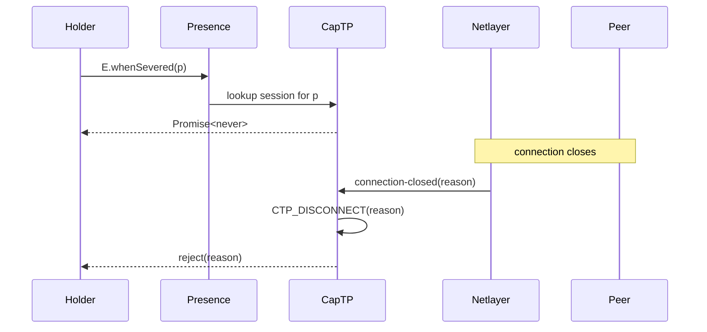

# Presence Severance Observation

| | |
|---|---|
| **Created** | 2026-06-17 |
| **Updated** | 2026-06-17 |
| **Author** | Kris Kowal (prompted) |
| **Status** | Not Started |

## What is the Problem Being Solved?

A presence is the local object that stands in for a remote target reached through `@endo/eventual-send`, typically over CapTP or OCapN.
The local holder of a presence has no first-class way to observe when that presence is **severed** from its remote target: when the underlying CapTP session aborts, when the netlayer reports the connection closed, when the remote peer revokes the export, or when the host revokes the import.
Holders that want to release resources, cancel pending UI, surface an error to a user, or transition to a "remote gone" state have to:

- Wait for a method call to reject with a connection-closed error (latency-bound to the next call, may never happen for read-only holders).
- Reach inside `@endo/captp` for `abort` (the local entry point, not an observer), or wait for `CTP_DISCONNECT` (a wire message, not a presence-scoped event).
- Re-implement partition-handling per call site, the way [`designs/chat-slot-slash-commands.md` § Release Exo lifetime and captp partition](chat-slot-slash-commands.md#release-exo-lifetime-and-captp-partition) prescribes for a single Exo.

That section calls the missing surface out explicitly: it names a "per-Exo cancellation promise" obtained via "the standard CapTP partition-handler mechanism", flags that the surface "may not yet be exposed in the form this design needs", and prescribes adding "the minimum surface required".
This design picks up that thread and generalizes it: a presence-scoped observer that any holder can use, with one consistent shape across CapTP, OCapN, and any future transport.

## Scope

In scope:

- The **severance event** as a first-class concept on a local presence.
- A small `@endo/eventual-send` surface (`E.whenSevered`) that exposes that event as a `Promise<never>`, composed from existing handler-protocol primitives.
- The `@endo/captp` wiring that produces the per-presence severance signal from the existing `CTP_DISCONNECT` path.
- The OCapN binding (`op:abort` on the wire, netlayer connection-closed event on the inbound side).

Out of scope:

- Re-binding or reconnection semantics.
  The peer-side reconnect posture in [`designs/daemon-cross-peer-gc.md` § Crash and reconnect semantics](daemon-cross-peer-gc.md#crash-and-reconnect-semantics) treats reconnect as a fresh snapshot, which implies the post-reconnect presence is a new object rather than a rebound old one.
  This design inherits that posture (see Open questions).
- Persistence of severance across daemon restart.
  A presence is a runtime object; restart drops the presence and any observer attached to it.
- A general-purpose connection-health probe.
  Severance is binary and one-shot, not a liveness signal.

## The severance event

A presence is **severed** when the local CapTP / OCapN session machinery determines that the remote target is no longer reachable through this presence's binding.
Severance is one-shot, monotonic, and per-presence: once a presence is severed, it stays severed.

Three sub-cases, all reduced to the same observable event:

| Sub-case | Origin | Existing vocabulary |
|---|---|---|
| **Transport-level** | Netlayer reports the connection closed; CapTP session aborts. | "partition" ([`captp-bounded-transient-pin`](chat-slot-slash-commands.md#release-exo-lifetime-and-captp-partition)), `op:abort` ([OCapN](https://github.com/ocapn/ocapn) §operations). |
| **Object-level** | Remote peer drops the export (Exo revoke, formula GC, explicit `release`). | "remote disconnected" ([chat-slot-slash-commands § Release Exo lifetime](chat-slot-slash-commands.md#release-exo-lifetime-and-captp-partition)). |
| **Permission-revoked** | Local host revokes the import (membrane drop, capability filesystem unmount). | none yet — falls under the same observer. |

**Vocabulary choice: adopt "severance" as the umbrella term.**
The corpus today uses "partition" for the transport sub-case (see `concepts/captp-bounded-transient-pin`), "abort" for the captp local entry point, and "disconnect" for the wire message.
None of those words covers the object-level and permission-revoked sub-cases.
"Severance" is the umbrella: the *event* the holder observes, regardless of which layer originated it.
The existing terms remain valid for their layer-specific meaning; severance is the holder-facing name.
A future librarian pass should lift `concepts/presence-severance.md` with partition / abort / disconnect as cross-references.

## HandledPromise primitives

Verified handler-protocol method set (from `packages/eventual-send/src/handled-promise.js`, lines 152, 158, 179):

- `get(target, prop, returnedP)`
- `applyMethod(target, prop, args, returnedP)`
- `applyFunction(target, args, returnedP)`
- `getSendOnly`, `applyMethodSendOnly`, `applyFunctionSendOnly` (the sendOnly siblings).

No `has` or `delete` operation exists on the handler protocol; an earlier prompt of this design imagined them.
The presence is registered as a handler value in the `presenceToHandler` WeakMap (`handled-promise.js:60`), with the corresponding promise tracked in `presenceToPromise` (`handled-promise.js:62`).
Severance attaches at the handler value: when the underlying transport determines the presence is severed, it settles a per-presence promise that `E.whenSevered` exposes.

The design does **not** extend the handler protocol with a new operation.
The hook is a property on the handler object the captp layer (or any future transport) installs alongside the existing methods.
`@endo/eventual-send` reads it through a small helper that walks the same `promiseToPresence` / `presenceToHandler` indirection that the existing dispatch path uses.

## CapTP / OCapN binding

`@endo/captp` already has every primitive this design needs; what is missing is the observer surface and the per-presence fan-out.

Verified primitives (from `packages/captp/src/captp.js`):

- `CTP_DISCONNECT` wire message with a `reason` field (line 812).
- `abort(reason)` local entry point (line 881).
- `importExportTables.didDisconnect()` clears import / export tables on disconnect (line 822).
- `settlers` map of in-flight question promise IDs rejected with the disconnect reason (lines 823–825).

What this design adds:

1. **Per-session severance promise.** `makeCapTP` exposes a `whenAborted: Promise<never>` on its return triple alongside the existing `{ abort, dispatch, getBootstrap }`.
   When `CTP_DISCONNECT` fires (locally via `abort(reason)` or remotely from the peer), the promise rejects with that reason.
   `whenAborted` already does not exist in `packages/captp/src/captp.js` (grep confirms no occurrence); this design lands it as a new field on the return value.
2. **Per-presence fan-out.** The captp `getImport` path that produces a local presence for a remote slot registers the presence-to-session mapping in a per-session WeakMap.
   `E.whenSevered(presence)` resolves the presence to its session via this map and returns the session's `whenAborted` promise.
   For object-level severance (the remote peer drops the export specifically), the existing `CTP_DROP` import-side path adds a presence-scoped settler that rejects the same shape of promise.
3. **OCapN connection-closed delivery.** Per [`designs/ocapn-network-transport-separation.md` § Design conceptual model](ocapn-network-transport-separation.md#new-conceptual-model), the netlayer is the layer that reports connection-closed events.
   The network's session machinery translates that into an `op:abort` on the inbound side, which surfaces in the existing captp `CTP_DISCONNECT` handler.
   No new wire shape; the netlayer already promises connection-closed delivery as part of its reliability contract.

The `CTP_DISCONNECT.reason` shape stays as-is.
The "error-path-cannot-depend-on-error-path" constraint flagged in [`designs/unhandled-rejection-display.md`](unhandled-rejection-display.md) (marshal tables may already be partially torn down when severance fires) applies: the severance promise's rejection reason must be self-contained, not lazily-serialized through the connection that just severed.



## Observer API

**Chosen: (a) `E.whenSevered(presence) → Promise<never>`.**

```js
import { E } from '@endo/eventual-send';

const severed = E.whenSevered(remote);
severed.catch(reason => {
  // remote is severed; release UI, fail pending operations, etc.
});
```

Rationale:

- Aligns with the **`Promise<never>` cancellation-promise convention** already used in [`designs/cli-http-client.md` § cancellation](cli-http-client.md) (where `cancellation: Promise<never>` is the platform-neutral cancellation token on `request`).
- Composes with `Promise.race` for "do X until severed" patterns without inventing a new combinator.
- Attaches to the existing `E` namespace, so a holder that already imports `E` for sends does not import a second module.
- Sits on `E` rather than on `HandledPromise`: holders work with `E(presence).method()`, not directly with the `HandledPromise` constructor, so the observer belongs at the same surface.

**Considered and rejected: (b) new `HandledPromise.whenSevered` static method.**
Reason: `HandledPromise` is a lower-level surface; consumers reach for `E` first.
A `HandledPromise.whenSevered` would still need an `E.whenSevered` wrapper for ergonomic use, doubling the surface for no gain.

**Considered and rejected: (c) Exo-style facet returned from the presence.**
Reason: requires every presence to carry an extra method (`presence.severance()` or similar), which forces every Exo author to opt in.
Severance is a property of the *binding*, not of the *target*, so the observer belongs on the holder side, not the target side.

## Cross-design coordination

- [`designs/chat-slot-slash-commands.md` § Release Exo lifetime and captp partition](chat-slot-slash-commands.md#release-exo-lifetime-and-captp-partition) — **prior art.**
  Names the "per-Exo cancellation promise" obtained via the captp partition-handler mechanism and explicitly flags the API gap.
  This design fills that gap with `E.whenSevered`; the chat-slot design's Exo wires its `release()` to `E.whenSevered(holderPresence)` rather than reaching into captp directly.
- [`designs/daemon-cross-peer-gc.md` § Crash and reconnect semantics](daemon-cross-peer-gc.md#crash-and-reconnect-semantics) — **sister design.**
  Treats reconnect as a fresh snapshot rather than a re-bound old presence.
  This design inherits that posture: a severed presence stays severed; reconnection produces a new presence.
- [`designs/ocapn-network-transport-separation.md` § Design conceptual model](ocapn-network-transport-separation.md#new-conceptual-model) — **netlayer connection-closed event surface.**
  The netlayer reports connection-closed; the network's session machinery translates that into the captp disconnect path this design hooks.
- [`designs/daemon-message-streaming.md` § Persistence model](daemon-message-streaming.md#4-persistence) — **graceful-end vs abort distinction.**
  Streaming distinguishes `end()` (graceful, durable, final state persisted) from `abort()` (partial, error reason persisted).
  Severance is the *unilateral* form of abort: the remote did not signal abort, the connection simply went away.
  A streaming consumer can compose `E.whenSevered(streamPresence)` with the existing `end` / `abort` futures to handle all three terminations uniformly.

## Related work

MetaMask / ocap-kernel ([`docs/glossary.md`](https://github.com/MetaMask/ocap-kernel/blob/main/docs/glossary.md)) defines `rref` as a "remote reference that does not survive the channel".
The vocabulary is sibling: `rref` names the *kind of reference*, severance names the *event* that ends it.
A future Related Work expansion could cross-reference the ocap-kernel implementation if it lands an analogous observer.

## Phased implementation

1. **Land `whenAborted` on `makeCapTP` return triple.**
   Single field added to `packages/captp/src/captp.js`, settled by the existing `CTP_DISCONNECT` path.
   No behaviour change for callers that ignore the field.
2. **Land per-presence fan-out in `@endo/captp`.**
   WeakMap from presence to session, populated in the import path.
   Plus a per-presence settler hooked off the existing import-table teardown for object-level severance.
3. **Land `E.whenSevered` in `@endo/eventual-send`.**
   Reads the per-presence handler-side hook (a property on the handler, installed by whoever produced the presence).
   Default for handlers that do not provide a hook: a never-settling `Promise<never>` (the holder never sees severance, which is the safe pre-existing behaviour).
4. **Migrate `chat-slot-slash-commands` to use `E.whenSevered`.**
   Replace the design's "captp partition-handler mechanism" placeholder with the now-landed observer.

## Open questions

- **Severance is an alias for partition in the corpus.**
  "Severance" (the holder-facing name introduced in this design) and "partition" (the existing corpus term for the transport sub-case) name the same underlying event.
  A librarian pass after this design merges should extend the existing `concepts/captp-bounded-transient-pin` concept page to note the alias rather than creating a separate `concepts/presence-severance.md`.
  No new top-level concept is needed; the alias entry is a cross-reference within the existing page.
- **Re-binding / reconnection semantics: out of scope.**
  A severed presence stays severed; reconnection produces a new presence (per [`daemon-cross-peer-gc` reconnect-as-fresh-snapshot](daemon-cross-peer-gc.md#crash-and-reconnect-semantics)).
  Forgetting a severed presence after partition is a garbage collection feature, not an API surface this design provides.
- **Session continuity across physical connections.**
  If the network layer needs to survive physical connection drops without exposing severance to the holder, that concern belongs in the network transport layer rather than in the presence-observer API.
  The transport layer can prolong the duration of a logical session to straddle multiple physical sessions, or can synthesize a session from a sessionless transport.
  Once the transport layer provides a stable logical session, this design's severance signal fires only when the logical session ends, not on transient physical interruptions.
  This design does not address session continuity; that is a transport-layer abstraction.
- **Cleanup ownership.**
  Returning a promise is sufficient.
  The holder is responsible for handling the returned `Promise<never>` via `.catch` or `await`; the library does not silently swallow unhandled rejections.

## Prompt

> Please dispatch a designer to propose a way to use HandledPromise and eventual-send to observe when a presence is severed from its target, as occurs when it is a presence for a remote object through OCapN or CapTP.
