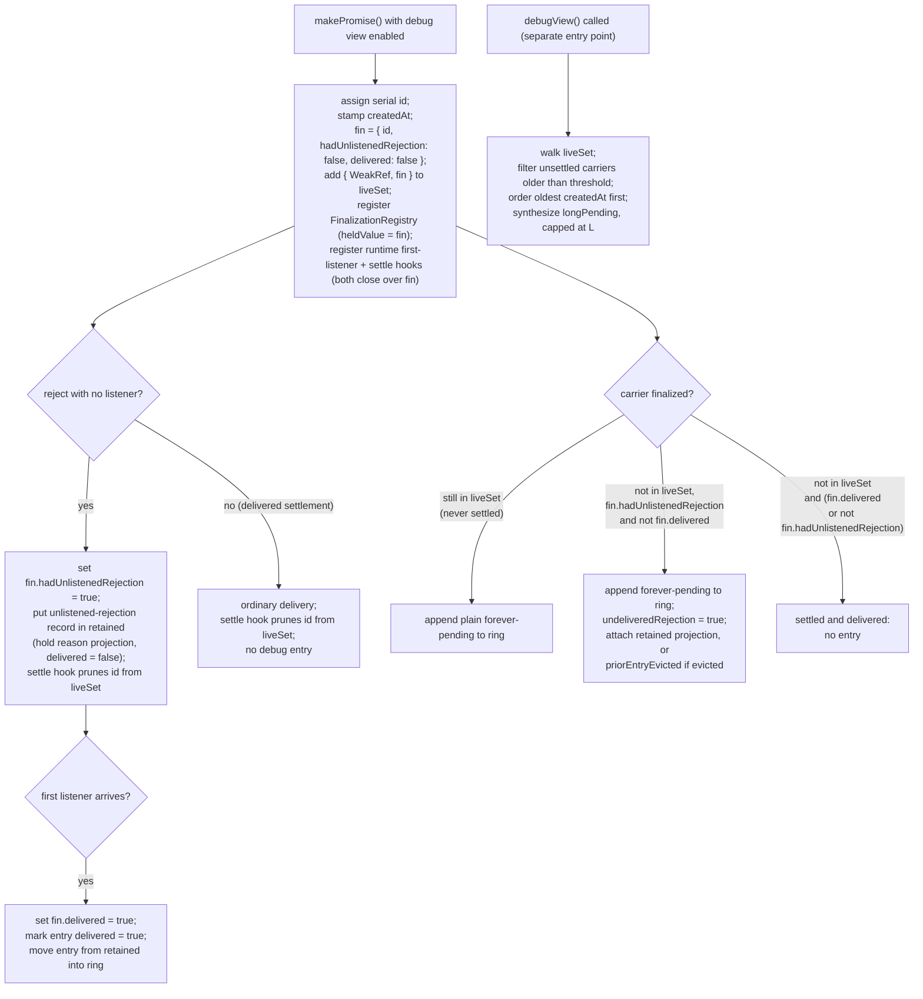

# Promise Debug View

| | |
|---|---|
| **Created** | 2026-07-12 |
| **Author** | Kris Kowal (prompted) |
| **Status** | Not Started |
| **Source** | [endojs/endo-but-for-bots#169 review](https://github.com/endojs/endo-but-for-bots/pull/169#pullrequestreview-4680376639) (inline comment on `designs/pass-style-promise.md`); tracked by [endojs/endo-but-for-bots#716](https://github.com/endojs/endo-but-for-bots/issues/716) |

## What is the Problem Being Solved?

The [pass-style-promise](pass-style-promise.md) design establishes a
rejection-retention principle.
When a producer rejects a pass-style promise that no listener has
attached to yet, the rejection is **retained on the producer's record**
and delivered to the first listener that arrives, rather than either
eagerly thrown to the host's unhandled-rejection path or silently
swallowed.
Both of the obvious answers are wrong: eager surfacing produces spurious
noise for a promise still in transit, and swallowing produces silent
failures.

Borrowed vocabulary, from the parent design and used unchanged here:

- A **carrier** is a pass-style promise.
- The **producer** is the party that holds the carrier's private
  `resolver` and alone may settle it.
- `makePromise(options)` is the parent's constructor that returns the
  `{ promise, resolver }` kit for one carrier.
  Everything in this design hangs off it: it is where a serial `id` is
  assigned, a creation stamp is taken, and (when the debug view is
  enabled) the runtime hooks are registered.
- A **listener** attaches to the carrier through `HandledPromise.listen`,
  `HandledPromise.settle`, or `E.when` to receive the settlement.
- **Retention** is the parent's rule that a rejection with no listener
  yet is held on the producer's record until the first listener arrives.
- **Authority** is the ocap sense: the ability to cause effects, carried
  by object references (handles). A value that carries no handle transfers
  no authority. This design's safety argument turns on the **authority**
  axis (what a projected value can *do*) being separable from the
  **confidentiality** axis (whether the value's *content* may be read
  across a boundary), which is left to Open Question 1.
- A **cap boundary** (capability boundary) is the edge between two
  compartments across which only explicitly granted references pass;
  "no authority leak" means no handle crosses it.

This recap is a reader's aid only.
The [pass-style-promise](pass-style-promise.md) design is the authority
for each term.

Retention is the right runtime behavior, but it opens an observability
gap.
A rejection that is retained and then **never delivered** (because a
listener never arrives, or the carrier is dropped in transit) is now
invisible.
By design there is no production log line, so a real bug that would
previously have shown up as an unhandled rejection leaves no trace.
Two neighboring conditions that retention never addressed share the same
need for in-transit visibility:

- **Long-pending** promises: a carrier that has stayed unsettled far
  longer than expected (a producer that forgot to resolve, a chain
  waiting on a hop that will not come).
- **Forever-pending** promises: a carrier that is garbage-collected
  without ever delivering a settlement, so it provably can never be
  observed to settle.
  This is the same never-settles idiom as `new Promise(() => {})` used as
  a token, now expressed as a dropped pass-style carrier.
  **Phase-1 scope caveat:** `forever-pending` (and the `undeliveredRejection`
  composite built on it) fires only once **both** the carrier and the
  producer record holding its resolver are unreachable, so in the parent
  design's canonical deployment (the resolver kept in a long-lived producer
  table for the vat's whole session) a forgotten-but-still-live producer's
  carrier is reported through **`long-pending`**, not `forever-pending`,
  until Open Question 6 is resolved. The headline claim above is full
  closure only for a producer-collected carrier; the in-transit workhorse
  signal for real liveSlots usage is `long-pending`. This is elaborated in
  the weak-reachability constraint below.

A debugger needs to see all three conditions **in transit**, without
reintroducing the per-hop noise the retention principle exists to avoid.
This design specifies a bounded, opt-in **debug-view ring buffer** that
makes the "neither swallow nor eagerly throw" state observable to a
debugger while staying invisible and near-zero-cost in production.

This is the forward-looking follow-up recorded under "Out of Scope,
Future Work -> Debug view for long-pending and unlistened-rejection
promises" in [pass-style-promise](pass-style-promise.md), promoted to its
own design per the maintainer's request on the PR #169 review ("And we
should post a plan to create that design").
It **layers on** the retention contract specified there; it does not
restate or modify it.

### Prior art in this repository

Endo already implements diagnostic machinery of exactly this shape for
native promises.
`packages/ses/src/error/unhandled-rejection.js` keeps a monotonic id, an
`id` to `reason` `Map`, a promise to `id` `WeakMap`, and a
`FinalizationRegistry`, gated by lockdown's `unhandledRejectionTrapping`
option (`packages/ses/src/lockdown.js`).
This design reuses that structure where it can and deliberately differs
in one respect: the gate here is an `@endo/env-options` flag rather than
a lockdown option, so the debug view can be turned on for a running
process without changing the lockdown profile, and it targets pass-style
carriers rather than native promises.
The implementation should share the id-allocation and finalization
plumbing with the existing tracker rather than reinventing it.

## Design

### What the debug view observes

The debug view records carriers that enter one of three diagnostic
conditions.
Two are **recorded events**, appended at the moment they happen and
stored in the buffer.
The third is a **derived query**, computed fresh from the live-set each
time a debugger inspects, and never stored.

| Category | Kind | Condition | Signal source |
|---|---|---|---|
| `unlistened-rejection` | recorded | `resolver.reject(reason)` was called while the carrier had no listener. | The retention path already records this on the producer record; the debug view mirrors it. |
| `forever-pending` | recorded | The carrier was finalized (garbage-collected) without ever delivering a settlement to a listener. | A `FinalizationRegistry` callback, GC-driven, no timer. |
| `long-pending` | derived | The carrier is still unsettled at inspection time and older than a threshold age. | Computed lazily at inspection time from a creation timestamp, not stored and not from a background timer. |

The `forever-pending` condition covers two cases that a debugger reads
differently, so the entry names which one it is:

- The carrier was finalized having **never been settled at all** (a
  producer that forgot to resolve and was itself collected; while the
  producer is still alive this shows up as `long-pending` instead; see the
  weak-reachability constraint below).
- The carrier was finalized after an `unlistened-rejection` whose reason
  **was never delivered to a listener**.
  This composite is the highest-signal bug the view can report: a
  rejection that was retained and can now never be delivered.
  The `forever-pending` entry carries `undeliveredRejection: true` and
  the retained reason projection (below) so the reader sees the
  conclusion directly, without re-joining two records by hand.
  This "highest-signal" value is conditional on Open Question 6: because
  `forever-pending` fires only once **both** the carrier and the producer
  record holding its resolver are unreachable (see the weak-reachability
  constraint), in the parent design's canonical deployment (the resolver
  kept in a long-lived producer table for the vat's whole session) this
  composite rarely or never fires until Open Question 6 is resolved, and
  the workhorse signal for a forgotten-but-live producer there is
  `long-pending` instead.

**Note on the term *settled*.**
A carrier is *settled*, in the parent design's vocabulary, once its
producer has called `resolve` or `reject`, whether or not any listener
observed the outcome.
A `forever-pending` carrier is therefore one finalized without ever
*delivering* an observed settlement, which is why the
rejected-but-never-listened case belongs here even though that carrier
was, strictly, settled.

The design deliberately introduces **no periodic sweep and no timer**.
Each recorded category is fed by an event that already happens (a reject
call, a GC finalization); the derived category is computed on demand when
a debugger asks.
Nothing wakes the process up on the debug view's behalf, so an idle
production process pays nothing for it beyond the disabled-path guard
below.

### Retained-reason projection

The one value the debug view holds for an `unlistened-rejection` is a
**diagnostic projection** of the rejection reason, not the reason object
itself.
The projection is computed at record time and consists of plain strings.
For an `Error` reason it captures three things read at record time: the
reason's `name`, its `message` string, and (only through the
start-compartment-privileged `getStackString`
(`packages/ses/src/permits.js`, entry `%InitialGetStackString%`), never a
wider accessor) a stack rendering.
For a non-`Error` reason (an arbitrary producer-authored value: a string,
number, record, or remotable) it captures a single bounded string
rendering and no stack.
The projection reads only these top-level, value-shaped strings; it never
walks the reason's own enumerable properties or its `cause` chain, and it
never captures a handle to the reason object, so nothing wider than a flat
string ever enters the buffer.

This projection does **not** apply any message redaction, and the design
does not claim it does.
SES's `redactedDetails` (`packages/ses/src/error/assert.js`) is the
construction-time `assert.details` template tag: it hides unquoted
substitution values only for errors *built through* `assert.details`, and
it cannot be run over an already-constructed, producer-authored reason at
record time.
The existing unhandled-rejection path
(`packages/ses/src/error/unhandled-rejection.js`) confirms this: it holds
the raw reason and hands it to `reportReason` with no redaction step.
So a producer's `new Error(secret)` projects its message **verbatim**.
The projection therefore settles the **authority** axis only (plain
strings carry no handles); it makes no confidentiality guarantee, and the
whole confidentiality question is carried by Open Question 1 (placement),
not by any redaction claimed here.

Holding a projection rather than the reason graph is load-bearing for
three separate invariants, so it is stated once here and referred to
elsewhere:

- **Weak-carrier invariant.**
  A rejection reason is an arbitrary producer-authored value.
  An `Error` can transitively reference the carrier or its producer
  through its `cause` chain, its own properties, or closed-over stack
  frames.
  If the buffer held such a reason strongly it could keep alive exactly
  the carrier whose finalization the view exists to observe, so
  `forever-pending` would never fire for the carriers that matter.
  A projection of plain strings cannot reach back into the object graph,
  so the buffer cannot resurrect a carrier.
- **Harden transitivity.**
  The inspection surface returns a hardened snapshot, and `harden` is
  transitive.
  Holding the reason graph would deep-freeze arbitrary application error
  objects irreversibly.
  Freezing a record of strings freezes only the record shell.
- **No authority leak.**
  A projection of strings carries no handles, so no authority crosses a
  cap boundary (Design Decision 5).
  This is an **authority** property only: whether the projected strings
  are themselves *confidential* across compartments is a separate axis,
  held open by Open Question 1. The projection makes no redaction claim
  (see "Retained-reason projection"); a producer-authored message projects
  verbatim, so confidentiality rests entirely on placement.

### Weak-reachability constraint (implementation invariant)

The `forever-pending` signal depends on garbage collection observing that
a carrier has become unreachable.
It therefore requires that **every edge the runtime and the debug view
add from a live structure to a carrier is weak or value-only**.
This is an implementation constraint the debug view imposes on itself and
on the surfaces it hooks:

- The live-set holds carriers only through `WeakRef` (below).
- The `FinalizationRegistry` registration holds the carrier weakly by
  construction; its `heldValue` is a small **value-only record**
  `{ id, hadUnlistenedRejection, delivered }` (a number and two booleans),
  never the carrier. See "Structures and entry shape" for why this record,
  rather than the bare `id`, is the held value.
- The debug view's own first-listener hook (see "First-listener arrival
  plumbing") must be registered **without** a strong runtime-to-carrier
  edge, or it would itself pin every carrier and defeat `forever-pending`.
  This is a new instance of the hazard, called out so Phase 2 discharges
  it explicitly.
- The retained-reason projection is value-only strings, per above.

If any runtime-to-carrier edge outside this list is strong (for example a
producer record that outlives the carrier and strongly references it),
finalization fires only once that whole graph dies, so a carrier stays
observable-as-live for exactly as long as its producer does.

This design does **not** inherit a weak producer-to-carrier edge from the
parent, and must not claim to.
The [pass-style-promise](pass-style-promise.md) design states no weakness
or GC property about a carrier at all; its canonical usage does the
opposite, keeping the `resolver` in a long-lived producer table
(`rememberResolver(kref, resolver)`), and the resolver must reach the
carrier's fire-once listener list to deliver a settlement.
So a live producer that constructed a carrier and forgot to resolve it
plausibly **pins** its own carrier, and `forever-pending` does not fire
for that carrier while the producer is alive.
This is a real dependency on a parent invariant the parent does not yet
state, tracked as Open Question 6, not a property discharged here.

Because of that, `forever-pending` is scoped to what GC can actually
observe: a carrier is reported `forever-pending` only once **both it and
the producer record holding its resolver have become unreachable**.
The headline composite (`undeliveredRejection`) inherits this scope.
Its highest-signal instance was "a retained rejection whose carrier was
dropped"; under this scope it is "a retained rejection whose carrier
**and producer** are both gone".
That is the "dropped in transit, nobody left who could ever deliver it"
bug. GC can prove that bug; it cannot prove "producer still alive, forgot
to resolve", which is why the scope excludes it.
No signal is lost by this scoping, but the surface that carries each case
differs:

- The **undelivered rejection itself** is recorded at reject time and
  lives in `retained` (reported through `entries`) the whole time,
  independent of finalization. It is never routed to `long-pending`,
  because a reject is a settlement that prunes the carrier from `liveSet`.
  The scope only governs whether it *also* earns the `forever-pending`
  composite once its producer is collected.
- The still-alive **"producer forgot to resolve"** carrier (never settled,
  so never pruned from `liveSet`) is surfaced by the **`long-pending`**
  category, derived from `liveSet` at inspection time with no finalization.
  Until Open Question 6 is resolved, this is where that case is classified
  rather than `forever-pending`.

### Structures and entry shape

The debug view maintains three structures keyed on the serial `id`, plus a
small per-carrier finalization record threaded through the
`FinalizationRegistry`:

- **`retained`**: an `id`-keyed map of undelivered `unlistened-rejection`
  records, the half the view exists to report.
  An entry enters `retained` when a reject with no listener is observed
  and leaves it when the carrier's first listener arrives (the reason was
  delivered) or when the carrier is finalized (the reason can never be
  delivered).
  `retained` is bounded by its own capacity `R` and evicts its oldest
  entry only when `R` is exceeded; see eviction below.
- **`ring`**: a fixed-capacity FIFO of the most recent `N` **terminal**
  recorded events: delivered `unlistened-rejection` entries and
  `forever-pending` entries.
  When full, adding an entry evicts the oldest.
- **`liveSet`**: a map from `id` to a small record
  `{ ref, fin }`, where `ref` is a `WeakRef` of a carrier that is
  registered, not yet settled, and not yet finalized, and `fin` is that
  carrier's value-only finalization record (below).
  It is the source for the derived `long-pending` query (walked through
  `ref`).
  Entries are pruned by the settle hook (on settlement, which for an
  unlistened rejection is the reject itself) and by the
  `FinalizationRegistry` callback (on finalization), so the map holds no
  strong carrier edge and does not itself grow without bound past the
  count of live unsettled carriers.
  The `long-pending` walk **always** drops any entry whose `ref` no longer
  dereferences, **regardless of whether `FinalizationRegistry` is
  available**. This dead-`ref` guard is unconditional because GC and the
  finalizer callback are not ordered: per the ECMAScript spec a
  `FinalizationRegistry` callback fires at an unspecified, arbitrarily later
  time after its target becomes unreachable (and is not guaranteed to fire
  before process exit at all), so even on the normal path a carrier can be
  collected (with `ref.deref()` already returning `undefined`) while its
  `fin` callback has not yet run to prune `liveSet`. Walking without the guard
  would synthesize a bogus `long-pending` entry (or fault) for such an
  already-collected carrier. On the degraded path with no
  `FinalizationRegistry` the settle hook is the only other prune, so there
  the same guard is additionally what keeps `liveSet` bounded by live
  unsettled carriers.

- **the value-only finalization record `fin`**: for each registered
  carrier, a plain record `{ id, hadUnlistenedRejection, delivered }`
  created at `makePromise()` time with both bits `false`.
  It is the `FinalizationRegistry`'s `heldValue`, so it survives the
  carrier's collection and is delivered to the finalization callback.
  It is reachable by `id` through `liveSet` (as `fin`) while the carrier is
  live, and independently through the per-carrier hooks that close over it
  (both registered at `makePromise()` time): the reject path sets its
  `hadUnlistenedRejection` bit at reject time, and the first-listener hook
  sets its `delivered` bit at first-listener arrival, the one later
  transition that invalidates an earlier `hadUnlistenedRejection`. That
  second write is what keeps the headline composite sound. Because the
  first-listener hook closes over `fin`, the `delivered` write lands even
  after the reject has pruned the carrier's `id` from `liveSet`; after
  finalization the record persists only inside the registry until the
  callback reads it.
  Both bits are value-only, so `fin` holds no carrier edge and does not
  defeat `forever-pending`.

Each recorded entry (in `retained` or `ring`) is a plain record:

| Field | Value |
|---|---|
| `id` | A monotonic serial identifier assigned at `makePromise()` time. It is the entry's correlation key and survives the carrier's collection. |
| `category` | `unlistened-rejection` or `forever-pending` (the two recorded kinds). |
| `createdAt` | Turn counter or wall-clock stamp captured at `makePromise()` time. |
| `recordedAt` | When the entry was appended (reject time for `unlistened-rejection`, finalization time for `forever-pending`). Every recorded entry has one, because every recorded entry entered a structure at a definite time. |
| `label` | An optional producer-supplied diagnostic string. Absent when the producer supplied none, never back-filled with a generated value, so a reader can always tell producer text from the system `id`. |
| `reason` | For `unlistened-rejection` (and for a `forever-pending` entry that carries `undeliveredRejection`): the retained-reason **projection**, plain strings, per "Retained-reason projection". Absent otherwise. |
| `delivered` | For `unlistened-rejection`: `false` on record, set `true` once the first listener arrives and the reason is delivered. |
| `undeliveredRejection` | For `forever-pending`: `true` when the finalized carrier had an unlistened rejection that was never delivered (the headline composite), from the `fin` record's `hadUnlistenedRejection && !delivered` at finalization. A carrier whose rejection was later delivered has `fin.delivered === true` and earns **no** `forever-pending` entry at all (it is already recorded as a delivered `unlistened-rejection` in `ring`). Otherwise absent. |
| `priorEntryEvicted` | For `forever-pending`: `true` when `undeliveredRejection` holds but the carrier's `unlistened-rejection` entry (and its reason projection) is no longer in `retained`, so it was evicted under memory pressure. The rejection is **known** to have happened (from the `fin` bit); only its projection was lost. Otherwise absent. |

The record is the **internal** shape.
The snapshot the debugger reads is a copy of it that never carries a
carrier reference of any kind (there is no `carrierRef` field on the
record: liveness is answered by `liveSet`, and correlation by `id`, so a
per-entry carrier reference would be a field no consumer reads).

`id` is the stable identity the view correlates on across a carrier's
whole lifetime.
It rides on the value-only finalization record `fin` (the
`FinalizationRegistry` `heldValue`) and is stored on every entry, so the
finalization callback can find a carrier's earlier `unlistened-rejection`
entry by `id` without dereferencing a `WeakRef` that no longer resolves
once the carrier is collected.
The `fin` record's two bits are the load-bearing part: together they are
the per-carrier history a collected carrier's finalization callback can
still read to tell three states apart: "this carrier had a retained
rejection whose record is now gone" (`hadUnlistenedRejection && !delivered`,
a real lost correlation), "this carrier's rejection was delivered before
collection" (`delivered`, no loss, no entry), and "this carrier never had a
retained rejection at all" (`!hadUnlistenedRejection`, the common case).
`hadUnlistenedRejection` alone cannot separate the first two: it is written
once at reject time and would still read `true` for a rejection that was
later delivered, so without the `delivered` bit the callback would
misreport every delivered-then-collected rejection as an undelivered loss.
The two recorded bits are what make `undeliveredRejection` and
`priorEntryEvicted` sound; see "Eviction policy".

### Eviction policy

The buffer's whole purpose is to report the half of a correlated pair
that arrives first (an `unlistened-rejection`) so it is still present when
the second half arrives (finalization).
A naive recency FIFO over all categories defeats that: because the parent
contract makes unlistened rejection a **normal, high-volume** case (a
carrier may travel several hops before any consumer listens), a single
FIFO would routinely evict the undelivered entry long before its carrier
is finalized, and the flagship signal would be lost silently.

So eviction protects the undelivered half:

- Undelivered `unlistened-rejection` entries live in `retained`, which is
  **not** subject to the recency FIFO.
  They are evicted only among themselves, and only when `retained`
  exceeds its own capacity `R`, oldest first.
  A `retained` eviction drops the entry **and its reason projection** but
  does **not** lose the fact that the rejection happened: that fact lives
  on the carrier's value-only finalization record `fin`
  (`hadUnlistenedRejection: true`, and `delivered: false` while it stays
  undelivered), which the reject path set and which survives to the
  finalization callback.
  So a later `forever-pending` finalization whose `fin` says
  `hadUnlistenedRejection && !delivered` but whose `id` is no longer in
  `retained` is **known-evicted** in `O(1)` (a plain `retained` membership
  test), and its entry gets `undeliveredRejection: true` plus
  `priorEntryEvicted: true`, so a lost correlation is **visible** in the
  snapshot rather than silently absent.
  This discrimination is **sound in both directions**: it never reports a
  loss that did not happen (the `undeliveredRejection` branch requires both
  an actual reject with no listener **and** `!delivered`, so a delivered
  rejection whose entry left `retained` for `ring` is not mistaken for an
  eviction) and never misses one (the bits outlive the entry).
  The recorded bit, not a watermark over the `id` space, is what makes
  this sound. A scalar "smallest id still in `retained`" watermark cannot
  do this job: ids below it also include every carrier that never had a
  retained rejection (the common case) and every one whose rejection was
  delivered, so such a watermark fires `priorEntryEvicted` on carriers that
  never lost anything. The design carries no watermark; the per-carrier
  `fin` bit is the whole mechanism.
- These two loss channels mean different things (losing a `retained`
  entry destroys a correlation's *projection*, losing a `ring` entry loses
  only recency), so the `evicted` counter is **split per structure**,
  reported as `{ retained, ring }`, not collapsed into one scalar.
  A `retained` eviction increments `evicted.retained`; a `ring` eviction
  increments `evicted.ring`.
- The recency FIFO (`ring`) holds only terminal, lower-signal events
  (a delivered rejection, a `forever-pending`).

This bounds memory honestly: it is `O(R)` retained projections plus `N`
ring entries plus `O(live unsettled carriers)` in `liveSet` (each holding a
`WeakRef` and a two-field `fin` record), not `N` overall.
The snapshot reports `capacity`, `retainedCapacity`, both `evicted`
counters, and the thresholds (below) so a debugger can tell an empty
result apart from a saturated one.

### When entries are recorded



- **At `makePromise()`** (only when the flag is enabled): assign a serial
  `id`, stamp `createdAt`, build the value-only finalization record
  `fin = { id, hadUnlistenedRejection: false, delivered: false }`, add
  `{ ref, fin }` to `liveSet`, register the carrier with a
  `FinalizationRegistry` whose `heldValue` is `fin`, and register the
  runtime's own first-listener and settle hooks, both closing over `fin`.
  No visible entry yet.
- **At `resolver.reject(reason)` with no listener**: while the carrier is
  still in `liveSet`, set `fin.hadUnlistenedRejection = true`; the
  retention logic (already specified in the parent design) records the
  reason on the producer record; the debug view additionally puts an
  `unlistened-rejection` record, carrying the reason projection and
  `delivered: false`, into `retained`.
  Because a reject is a settlement, the settle hook then prunes the
  carrier's `id` from `liveSet`, so an undelivered retained rejection is
  reported through `retained` (the `entries` array), never through
  `long-pending`.
- **At first-listener arrival**: the first-listener hook sets
  `fin.delivered = true` (through its closure over `fin`), marks the
  `retained` entry `delivered: true`, and moves it from `retained` into
  `ring`. Setting `fin.delivered` here is the write that keeps the headline
  composite sound: it is the one later transition that supersedes the
  `hadUnlistenedRejection` bit fixed at reject time, so a rejection that is
  delivered before its carrier is collected can no longer be misread as an
  undelivered loss at finalization.
  This correlation is not free; see "First-listener arrival plumbing".
- **At settlement** (resolve or reject): the settle hook prunes the
  carrier's `id` from `liveSet` so it can no longer be classified
  `long-pending`.
- **At finalization**: the `FinalizationRegistry` callback receives the
  carrier's `fin` record. It reads `liveSet` membership and `fin` to
  classify, in three exhaustive cases:
  - **`id` still in `liveSet`** (the settle hook never ran, so the carrier
    was **never settled**): prune `liveSet` and append a plain
    `forever-pending` entry to `ring`. This is the "producer forgot to
    resolve, and both are now gone" case (scoped by the weak-reachability
    constraint / Open Question 6). Both `fin` bits are necessarily `false`
    here, since a reject would have pruned `liveSet`.
  - **`id` not in `liveSet`, `fin.hadUnlistenedRejection`, and not
    `fin.delivered`** (settled by a reject with no listener, never
    delivered): append a `forever-pending` entry with
    `undeliveredRejection: true` (the headline composite). If `retained`
    still holds the `unlistened-rejection` entry, attach its reason
    projection; else it was evicted, so also set `priorEntryEvicted: true`
    (the projection is gone but the rejection is known).
  - **`id` not in `liveSet` and (`fin.delivered` or not
    `fin.hadUnlistenedRejection`)** (settled and delivered normally,
    including a rejection that was later delivered to its first listener):
    append **no** entry. This is the common case, and it is why the
    `delivered` bit is required: a delivered-then-collected rejection still
    has `fin.hadUnlistenedRejection === true`, so gating on that bit alone
    would flood `ring` with a spurious `undeliveredRejection`
    `forever-pending` (doubly recorded, since the same carrier already sits
    in `ring` as a delivered `unlistened-rejection`) for every ordinary
    delivered rejection whose carrier is later collected. The `delivered`
    bit routes that case here instead.
- **At inspection time**: `long-pending` is computed by walking `liveSet`,
  dropping any entry whose `ref` no longer dereferences (unconditionally,
  per the `liveSet` bullet above, since a carrier may already be collected
  while its finalizer callback has not yet run), keeping the still-live
  carriers whose `createdAt` is older than the threshold, ordering them
  **oldest `createdAt` first**, and synthesizing derived entries capped at a
  limit `L` (so a truncation drops the youngest, keeping the oldest and most
  suspicious). Nothing is recorded or stored for this category.

### First-listener arrival plumbing

Marking an `unlistened-rejection` entry `delivered` requires the debug
view to learn when the *first* listener attaches to a carrier.
The parent design's `onFirstListen` is **not** an always-on runtime signal
the view can pick up for free: it is an optional, single callback the
producer supplies in `makePromise()`'s options bag, invoked only if the
producer registered one, and the options bag has room for exactly one
(the parent's single fire-once producer-scoped slot).
Relying on it would mark `delivered` on only the subset of entries whose
producer happened to pass `onFirstListen`, missing every other
`unlistened-rejection` entry.

So when the debug view is enabled, the runtime registers **its own**
first-listener hook per carrier at `makePromise()` time, alongside (and
independent of) any producer-supplied `onFirstListen`.
Both fire on the same first-listener transition the resolver already
tracks internally.
The debug view's hook is additional plumbing the runtime owns, not a free
ride on the producer's optional callback, and it composes with a
producer-supplied `onFirstListen` rather than displacing it (the
producer's callback still fires with its documented fire-once,
producer-scoped contract).
The hook closes over the carrier's `fin` record (created in the same
`makePromise()` call), so on the first-listener transition it sets
`fin.delivered = true` in addition to marking and moving the `retained`
entry. Closing over the value-only `fin` (not the carrier) is what lets it
supersede `hadUnlistenedRejection` after the reject has already pruned the
carrier from `liveSet`, without which the finalization callback could not
tell a delivered rejection from an undelivered one.
Per the weak-reachability constraint above, this hook must not introduce a
strong runtime-to-carrier edge (closing over `fin` does not: `fin` holds no
carrier reference).
This added hook is why Phase 2 below is sized **M**, not **S**.

**When the `retained` entry was already evicted before delivery.**
`retained` has its own capacity `R` and evicts its oldest entry under
pressure, and a retained rejection can sit unlistened for an unbounded time
before a listener arrives, so eviction-before-delivery is a real case, not a
corner one. When the first listener arrives for a carrier whose
`unlistened-rejection` entry has already left `retained`, the hook still sets
`fin.delivered = true` through its closure (so finalization-time
classification stays sound: the carrier routes to the settled-and-delivered,
no-entry branch, never to `undeliveredRejection`), but there is **no**
`retained` entry to mark and move, so **no `ring` entry is produced** for
that delivery. That delivery is therefore not individually visible in the
snapshot; the loss is not silent, because the `retained` eviction that
dropped it already incremented `evicted.retained`, which the snapshot
reports. The delivery's fact survives on `fin`; only its per-entry record
was the price of the earlier eviction.

### Inspection surface

A debugger reads the buffer through a diagnostic accessor that returns a
**frozen snapshot**: a hardened record carrying the enabled state, the
buffer's own bounds, a hardened array of recorded entries, and a
separately bounded array of derived long-pending entries.
It never returns the live buffer and never returns a resolver or carrier.

```js
/**
 * Returns a hardened snapshot:
 *   {
 *     enabled,               // false when ENDO_PROMISE_DEBUG_VIEW is off
 *     capacity,              // ring capacity N
 *     retainedCapacity,      // retained-map capacity R
 *     longPendingLimit,      // derived-query cap L
 *     longPendingThreshold,  // the age applied to classify long-pending
 *     evicted,               // records dropped, reported per structure:
 *                            //   { retained, ring }. A retained eviction
 *                            //   drops a reason projection but not the
 *                            //   fact of the rejection, which survives on
 *                            //   the carrier's finalization record and
 *                            //   later surfaces as priorEntryEvicted
 *     entries,               // union of the still-undelivered records in
 *                            //   retained (delivered: false) and the
 *                            //   terminal events in ring, merged and
 *                            //   sorted by recordedAt ascending (most
 *                            //   recent last):
 *                            //   { id, category, createdAt, recordedAt,
 *                            //     label?, reason?, delivered?,
 *                            //     undeliveredRejection?,
 *                            //     priorEntryEvicted? }
 *     longPending,           // derived at read time, oldest createdAt
 *                            //   first, then capped at L (so the cap drops
 *                            //   the youngest, keeping the most suspicious):
 *                            //   { id, category: 'long-pending',
 *                            //     createdAt, observedAt, label? }
 *   }
 * `entries` and `longPending` are disjoint: recorded events versus a
 * query evaluated now. No carrier, resolver, or listener handle escapes;
 * each entry is a plain copy. When the debug view is disabled, `enabled`
 * is false and both arrays are empty, so a caller can distinguish
 * "turned off" from "on and nothing to report".
 */
HandledPromise.debugView = () => { /* ... */ };
```

Recorded events and the derived query are kept in **separate fields**
because only recorded events have a record time and an eviction policy.
The `entries` array projects **both** recorded structures into one view:
the still-undelivered `unlistened-rejection` records held in `retained`
(these carry `delivered: false` and are the half the view exists to
report) and the terminal events in `ring` (delivered rejections and
`forever-pending` entries).
The two are merged and sorted by `recordedAt` ascending so the most
recent is last; a reader distinguishes the two structures by the
`delivered` field, not by position.
A `long-pending` member is computed now, so it carries `observedAt` (the
inspection time) rather than `recordedAt`, and it is never merged into
`entries`, so it can never consume ring capacity nor evict a retained
reason.
The snapshot's own bounds (`capacity`, `retainedCapacity`,
`longPendingLimit`, `longPendingThreshold`) and both loss counters
(`evicted.retained`, `evicted.ring`) are reported alongside the entries so
a debugger who sees no record for a promise they suspect can tell "did not
happen" from "evicted" (a nonzero `evicted.retained`, corroborated
per-carrier by `priorEntryEvicted` on the matching `forever-pending`),
one who sees exactly `L` long-pending entries can tell "that is all" from
"truncated", and one who sees no `long-pending` can tell what age was
applied.

The accessor is a **host-side diagnostic power**, not a passable
capability.
It is not marshaled, does not cross a cap boundary, and exposes only
copies and labels.
It is reachable by whoever holds the `HandledPromise` intrinsic in the
debugging realm, the same audience that holds `listen`/`settle`.
Where it lives, and whether it is gated behind the same permit machinery
as the parent design's new `HandledPromise` methods, is Open Question 1.

The producer may attach a `label` when it constructs the carrier so that
entries are legible in the snapshot:

```js
const { promise, resolver } = makePromise({ label: 'kref:p-42' });
```

The option is named `label`, the same name it reads back as in the
snapshot, so the round trip through `debugView()` is consistent.
It is inert when the debug view is disabled and is the only addition this
design makes to the `makePromise()` options bag.

### Production cost and gating

The debug view is **opt-in and off by default**, following the same
`@endo/env-options` pattern the parent design uses for
`ENDO_PROMISE_DELEGATES` (and that `TRACK_TURNS`, `DEBUG`, and the marshal
message-breakpoints options use):

```js
import { getEnvironmentOption } from '@endo/env-options';

const PROMISE_DEBUG_VIEW =
  /** @type {'disabled' | 'enabled'} */
  (getEnvironmentOption(
    'ENDO_PROMISE_DEBUG_VIEW',
    'disabled',
    ['enabled'],
  )) === 'enabled';
```

The bounds are read from their own env-options, each with a documented
default, so the "configurable" claim resolves to named variables:

| Env option | Controls | Default |
|---|---|---|
| `ENDO_PROMISE_DEBUG_VIEW` | on/off (`disabled` \| `enabled`) | `disabled` |
| `ENDO_PROMISE_DEBUG_VIEW_CAPACITY` | ring capacity `N` | Open Question 2 |
| `ENDO_PROMISE_DEBUG_VIEW_RETAINED_CAPACITY` | retained-map capacity `R` | Open Question 2 |
| `ENDO_PROMISE_DEBUG_VIEW_THRESHOLD` | long-pending age threshold (unit follows `createdAt`, Open Question 5) | Open Question 2 |
| `ENDO_PROMISE_DEBUG_VIEW_LONG_PENDING_LIMIT` | derived-query cap `L` | Open Question 2 |

The four numeric bounds need parsing that `@endo/env-options` does not
provide today: `getEnvironmentOption` returns a **string** and validates
only against an enumerated allowed-value list
(`packages/env-options/src/env-options.js`), with no numeric coercion, so
`ENDO_PROMISE_DEBUG_VIEW_CAPACITY=abc` would otherwise become `NaN`
silently. The implementation reads each numeric option as a string, parses
it, and on a malformed or non-positive value **falls back to the documented
default and emits one diagnostic** rather than running with `NaN` bounds;
it never throws at load, since a bad debug-only knob must not break a
process. Whether `@endo/env-options` should grow a first-class numeric
option shape is left to the implementation PR.

When `PROMISE_DEBUG_VIEW` is `disabled`:

- `makePromise()` does not assign a serial id, does not stamp a timestamp,
  does not register a `FinalizationRegistry` entry, does not register the
  first-listener or settle hooks, and does not touch `liveSet`,
  `retained`, or `ring`.
- The reject path's **retention behavior is unchanged** (that is the
  parent design's always-on contract); only the *extra* buffer append is
  skipped.
- `HandledPromise.debugView()` returns a disabled snapshot with empty
  `entries` and `longPending`.

The guard is a single boolean read on the hot paths, so the disabled cost
is a branch, not an allocation.
This is what "inspectable while debugging without producing noise in
production" means concretely: the signal goes into bounded in-memory
structures a debugger reads on demand, never onto the host's console or
unhandled-rejection path, and those structures are not even populated
unless the flag is set.

### When `FinalizationRegistry` is unavailable

Endo already treats `FinalizationRegistry` as optional
(`packages/ses/src/error/unhandled-rejection.js`,
`packages/ses/src/commons.js`).
When it is absent, the debug view degrades rather than failing to load:
`unlistened-rejection` recording and the derived `long-pending` query
still work, but `forever-pending` (and therefore the
`undeliveredRejection` composite) cannot be produced.
The snapshot signals this so a debugger does not read a missing
`forever-pending` as "did not happen".
The concrete signal (a `forever-pending: 'unsupported'` flag on the
snapshot, or similar) is settled on the implementation PR.

### Native promises

Full fidelity is available only for **pass-style promises**, because the
three signals depend on producer-side machinery the platform does not
expose for native promises: there is no producer-side listener-arrival
hook on a native `Promise`, and its resolver is closed over at
construction.
Native promises are covered **opportunistically**: a native promise (or
`HandledPromise`) that flows through `HandledPromise.listen` /
`HandledPromise.settle` is visible at that point and may be registered for
`long-pending` / `forever-pending` tracking there.
Native rejections that are eagerly thrown are already covered by the
host's own unhandled-rejection tooling and are out of scope here.
The precise extent of native-promise coverage is Open Question 3.
This opportunistic tracking is **stated as design intent, not scheduled
baseline**: no phase in "Phased Implementation" below builds or tests it,
because its extent is blocked on Open Question 3. A reader should not
mistake the described behavior for decided, phased work; it lands (and
gains a phase) only once Open Question 3 fixes where the line falls.

## Reconciliation with the Pass-Style Promise Contract

This design **layers on** [pass-style-promise](pass-style-promise.md); it
re-specifies none of that contract.
The load-bearing reuses:

- **Rejection retention** (parent's "do not surface rejections to
  unlistened promises"): the debug view is the *observability* layer over
  the retention state that already exists.
  It reads the same retained-reason record and does not change the rule
  that a rejection with no listener is held, not thrown and not swallowed.
  The debug view never causes an eager throw and never suppresses a
  delivery.
- **First-listener transition** (parent's "Producer-side first-listen
  notification"): the debug view marks an `unlistened-rejection` entry
  `delivered` on the same once-per-carrier first-listener transition the
  resolver already tracks internally, through its own runtime-owned hook
  (see "First-listener arrival plumbing"), not the producer's optional
  `onFirstListen`.
- **Fire-once settlement** (parent's Resolved Decision 3, *Fire-once
  listener lifecycle*): because settlement is final, an entry's lifecycle
  is monotonic (pending to settled/delivered, or pending to finalized), so
  the buffer never has to reconcile a resettled carrier.

## Dependencies

| Design or issue | Relationship |
|---|---|
| [pass-style-promise](pass-style-promise.md) | Parent design. This one implements the "Debug view" future-work item and layers on its rejection-retention and first-listener contracts. Not tracked as blocked-by, but sequenced after the parent's Phase 3: the retention path and the `listen`/first-listener transition it reads must exist first. |
| [endojs/endo#1312](https://github.com/endojs/endo/issues/1312) | The `new Promise(() => {})` never-settling token idiom the `forever-pending` category makes visible once expressed as a dropped pass-style carrier. |
| [endojs/endo#1652](https://github.com/endojs/endo/issues/1652) | Source of the `listen`/`settle` primitives whose first-listener transition the `delivered` marking rides. |
| [endojs/endo-but-for-bots#172](https://github.com/endojs/endo-but-for-bots/issues/172) | The `Promise[Symbol.for('delegate')]` follow-up; if the debug view is exposed as a delegate-adjacent op, it should compose with that surface rather than duplicate it (Open Question 1). |
| [`packages/ses/src/error/unhandled-rejection.js`](../packages/ses/src/error/unhandled-rejection.js) | Existing in-repo tracker of the same shape (monotonic `id`, `id`-to-`reason` `Map`, promise-to-`id` `WeakMap`, `FinalizationRegistry`). Reuse candidate for id allocation and finalization plumbing, and gating precedent (it uses a lockdown option; this design uses an env-option, deliberately). |

## Phased Implementation

The debug view sequences after the parent design's Phase 3 (eventual-send
integration), because the retention path and the `listen`/first-listener
transition it reads must exist first.

1. **Buffers and env-options (S).**
   The `ring` FIFO, the `retained` map with its bounded eviction, the
   `ENDO_PROMISE_DEBUG_VIEW` gate and the four bound options, the
   disabled-path guards, the serial id allocator (shared with the existing
   unhandled-rejection tracker), and `HandledPromise.debugView()` returning
   the frozen snapshot.
   Unit tests for ring capacity, retained-map eviction incrementing
   `evicted.retained`, the disabled no-op, the `enabled` flag, and the
   malformed-bound fallback specified under "Production cost and gating"
   (`ENDO_PROMISE_DEBUG_VIEW_CAPACITY=abc` and other non-positive/NaN
   inputs must fall back to the documented default and emit one diagnostic,
   never store `NaN` or throw).
2. **Unlistened-rejection recording (M).**
   Append on `resolver.reject` with no listener into `retained`; register
   the runtime's own first-listener hook per carrier with no strong
   carrier edge (composing with any producer-supplied `onFirstListen`) and
   mark `delivered`, moving the entry into `ring`, on first-listener
   arrival.
   Test the retained-reason projection (strings only, no reference to the
   reason graph), the delivered transition against the parent's retention
   tests, and that `delivered` is marked even when the producer supplied
   no `onFirstListen`.
   Test the **promise-forwarding chain** case explicitly. It is the parent
   design's own canonical illustration of the retention principle this
   view observes (`a.resolver.resolve(b.promise); b.resolver.reject(...)`,
   [pass-style-promise](pass-style-promise.md)), where `b`'s "unlistened"
   window and its eventual `delivered` transition happen through a
   re-listen forwarded from `a`'s consumer, not a direct `listen(b, ...)`
   written by application code: the intermediate carrier `b` must record
   exactly one `unlistened-rejection` entry (no double-recording) and must
   mark `delivered` only when the forwarded listen actually reaches it, so
   its `retained` entry does not outlive its true delivery even though the
   chain walk spans multiple turns. This is the scenario where a naive
   per-carrier bookkeeping scheme is most likely to misfire.
3. **Long-pending classification (XS).**
   `liveSet` walk at inspection time with the configurable threshold and
   the `L` cap, pruned by the settle hook.
   No timer, nothing stored.
4. **Forever-pending via FinalizationRegistry (S).**
   **Scope of this phase's claim (explicit downgrade, pending Open Question
   6):** in the parent design's canonical liveSlots deployment the resolver
   is kept in a long-lived producer table, so a live producer pins its own
   carrier and the flagship `undeliveredRejection` composite fires only once
   the producer record is *also* collected. This phase therefore delivers
   the composite verifiably only under a lab `gc()` harness that collects
   both, not in a running vat with a live producer; there the in-transit
   signal is `long-pending` (Phase 3), not `forever-pending`. The claim is
   downgraded to that scope here rather than left implied, and full
   still-live-producer coverage waits on Open Question 6.
   Register at `makePromise()` with the value-only `fin` record
   (`{ id, hadUnlistenedRejection, delivered }`) as `heldValue`, set
   `hadUnlistenedRejection` on a reject with no listener and `delivered` in
   the first-listener hook, and on finalization classify by `liveSet`
   membership and `fin`: append a plain `forever-pending` for a
   never-settled carrier, set `undeliveredRejection` (plus
   `priorEntryEvicted` from a `retained` lookup) for an undelivered
   rejection (`hadUnlistenedRejection && !delivered`), and append nothing
   for a settled-and-delivered carrier (`delivered` or
   `!hadUnlistenedRejection`).
   Test the composite headline case explicitly: an `unlistened-rejection`
   entry whose carrier is GC'd before any listener arrives must, on
   finalization, produce a `forever-pending` entry with
   `undeliveredRejection: true` and the retained reason, the highest-signal
   bug the view exists to report.
   Test the delivered-then-finalized case explicitly (the one the
   `delivered` bit exists to get right): an `unlistened-rejection` whose
   first listener arrives (so `fin.delivered` is set and the entry moves
   into `ring`) and whose carrier is only then GC'd must produce **no**
   second `forever-pending` entry, and in particular must **not** be
   reported `undeliveredRejection` or `priorEntryEvicted`. This is the
   common delivered-then-collected case that `hadUnlistenedRejection` alone
   misclassifies.
   Test the negative case (the one a scalar id-watermark test gets wrong):
   a carrier that never had an unlistened rejection, finalized after a
   `retained` eviction, must produce **no** `priorEntryEvicted` (and, if
   settled-and-delivered, no entry at all).
   Test `priorEntryEvicted` directly: an undelivered rejection whose
   `retained` entry is evicted, whose carrier is then finalized, must
   produce `undeliveredRejection: true` with `priorEntryEvicted: true`.
   Also test the degraded path where `FinalizationRegistry` is absent.
   GC-driven tests are inherently non-deterministic; gate them behind an
   explicit `gc()` harness where available, else document as best-effort.
5. **SES permit (XS).**
   If `HandledPromise.debugView` lands on the `HandledPromise` intrinsic,
   add it to the `HandledPromise` permit entry in
   `packages/ses/src/permits.js`, the same two-line shape the parent
   design's Phase 3.5 uses for `listen`/`settle`.
   Resolving Open Question 1 decides whether this phase applies.
6. **Docs (XS).**
   A `NEWS.md` note and a short "debugging retained rejections" section
   cross-linked from the parent design.

## Design Decisions

1. **No background timer or sweep.**
   Every recorded category is event-driven (reject, finalization) and the
   derived category is computed on demand (long-pending at inspection).
   This keeps an idle production process at zero incremental cost and
   honors "without producing noise in production" literally: nothing
   periodic runs.
2. **Weak carrier references, stable serial id for correlation.**
   The structures must not keep carriers alive (that would mask
   `forever-pending` and leak memory), so carriers are held via `WeakRef`
   and the weak-reachability constraint governs every edge.
   A `WeakRef` cannot be dereferenced once the carrier is collected, which
   is exactly when the finalization callback needs to find that carrier's
   earlier entry.
   So correlation across a carrier's lifetime is keyed on a monotonic
   serial `id` carried on a value-only finalization record that is the
   `FinalizationRegistry` `heldValue`, not on the reference; that record
   also carries the two bits of per-carrier history the callback needs
   (`hadUnlistenedRejection` and `delivered`).
3. **Undelivered rejections are protected from eviction.**
   The buffer exists to correlate a rejection with its later finalization,
   so the recency FIFO may not evict the undelivered half.
   Undelivered `unlistened-rejection` records live in `retained` with its
   own bound, and any loss under pressure is surfaced through `evicted`
   and `priorEntryEvicted` rather than hidden.
4. **Recorded events and derived queries are separate.**
   The snapshot splits `entries` (recorded, with a record time and an
   eviction policy) from `longPending` (computed at read time, with an
   `observedAt` and its own cap), so neither braids into the other's
   bound.
5. **Reason projection, not reason graph.**
   The buffer holds a value-only projection of a rejection reason, which
   preserves the weak-carrier invariant, keeps `harden` from freezing
   foreign application graphs, and, because a projection of strings
   carries no handle, leaks no **authority** across a cap boundary.
   This decision settles the authority axis only.
   The *confidentiality* of the projected strings themselves is a separate
   axis, held open by Open Question 1. The projection applies no redaction
   (see "Retained-reason projection"): a producer-authored message projects
   verbatim, so confidentiality is governed by where the accessor lives,
   not by any transformation at record time.
6. **Producer `label` and system `id` are separate fields.**
   A producer-supplied diagnostic string (`label`) and the
   system-generated correlation identifier (`id`) never share one field or
   value space, so a snapshot reader always knows whether a value is
   free-form producer text or a generated id.
7. **Snapshot, not live buffer.**
   The inspection surface returns hardened copies so a debugger cannot
   mutate runtime state or reach a resolver, listener, or carrier through
   the debug view.
8. **Diagnostic power, not passable capability.**
   `debugView()` is host-side and never marshaled; it exposes labels and
   copied reason projections, never handles that would leak authority
   across a cap boundary.
9. **Off by default, opt-in via env-option.**
   Reuses the parent design's `@endo/env-options` idiom for consistency
   and for a diagnosable on/off toggle.
10. **`delivered` is written at exactly one site, though it is read from
    two.**
    "Delivered" is read from two structures: the value-only `fin` record
    (read by the finalization callback, which must outlive `retained`
    eviction and therefore cannot read the entry) and the `retained`/`ring`
    entry's own `delivered` field (read by the snapshot). These are kept
    separate on purpose. `fin` must stay value-only and durable so it can
    reach the finalization callback after the carrier and its entry are
    gone, while the entry must carry the reason projection that `fin`
    deliberately does not hold (so a `retained` eviction can free the
    projection). Collapsing them into one shared record would pin the reason
    projection on the durable `fin` until GC and defeat the `retained`
    memory bound, so the design keeps two locations and instead contains the
    drift risk of one fact in two places with a **single write site**: the
    first-listener hook (see "First-listener arrival plumbing") is the
    *only* code that transitions "delivered", and it performs all three
    coordinated mutations (`fin.delivered = true`, `entry.delivered = true`,
    and moving the entry from `retained` into `ring`) together.
    No other site writes `delivered`, so the two reads cannot diverge. A
    future read-site (for example a metrics hook) must read, never write,
    through this one transition.

## Open Questions

1. **Where do the debug view's structures and surface live, and what
   package owns them?**
   The parent design makes the `@endo/pass-style` versus
   `@endo/eventual-send` split a first-class decision, and this feature is
   fed from both sides (`makePromise`/`reject` in pass-style,
   `listen`/`settle`/first-listener in eventual-send), so the owning
   package for the buffer, the id allocator, and `liveSet` is as
   load-bearing as where the accessor is exposed.
   Does the accessor live at `HandledPromise.debugView` (paired with
   `listen`/`settle`, permit-gated the same way), as a separate
   `@endo/pass-style` debug export, or as a devtools-only global adjacent
   to the `Promise[Symbol.for('delegate')]` direction in
   [endojs/endo-but-for-bots#172](https://github.com/endojs/endo-but-for-bots/issues/172)?
   The deciding criterion is **confidentiality across compartments**, not
   symmetry with `listen`/`settle`: a diagnostic on a shared intrinsic
   hands any confined holder other subgraphs' labels, reason projections,
   and timings, plus a GC-observability side channel that
   `packages/captp/src/finalize.js` documents as a determinism-breaker for
   replay and consensus.
   That hazard should govern the placement.
2. **What are the default bounds?**
   What default ring capacity `N`, retained capacity `R`, long-pending age
   threshold, and long-pending cap `L` are useful without making an
   enabled process a memory concern?
   Each is named as an env-option above; the question is only the default.
3. **How far does native-promise coverage go?**
   Opportunistic tracking when a native promise passes through
   `listen`/`settle` is cheap; registering every native promise the
   process creates is not feasible and is the host tooling's job.
   Where exactly is the line, and does the design need a
   `HandledPromise.debugTrack(nativePromise, label)` opt-in for native
   promises a debugger cares about?
   If such an op lands, its name should follow the same convention as
   `debugView` (both read as `debug<Noun>`, or both recast to
   `debug<Verb>`) rather than pairing a noun-styled query with a
   verb-styled command.
4. **Should `forever-pending` entries fan out to a host hook?**
   The `FinalizationRegistry` signal for "a rejection was retained and can
   now never be delivered" is the highest-value bug the view surfaces.
   Is a buffer entry sufficient, or should an *enabled* debug view also
   offer an opt-in callback (still off in production) so a test harness can
   fail loudly on a provably undeliverable retained rejection?
   This must not become the eager-throw the retention principle rejects;
   it would be a debug-only, explicitly armed hook.
5. **Should `createdAt` be a turn counter or wall-clock?**
   A turn counter is deterministic and reproducible across replays;
   wall-clock is more legible to a human reading a snapshot.
   Should the buffer carry both?
6. **Does the parent guarantee a weak (or state-mediated) producer-to-carrier
   edge?**
   `forever-pending` can only fire once a carrier is unreachable, but the
   parent design keeps the `resolver` in a long-lived producer table and
   the resolver reaches the carrier's listener list, so a live producer
   that forgot to resolve pins its carrier (see the weak-reachability
   constraint section).
   Should [pass-style-promise](pass-style-promise.md) be amended to state
   that the resolver holds its carrier weakly or through value-only state,
   so `forever-pending` can classify a still-live-producer carrier?
   Until it is, this design scopes `forever-pending` to carriers whose
   producer is also collected and routes the still-live case to
   `long-pending`.
   This is the one parent-contract change the debug view would benefit
   from; it does not make that change unilaterally.

## Prompt

Requested by kriskowal in the PR #169 review
([pullrequestreview-4680376639](https://github.com/endojs/endo-but-for-bots/pull/169#pullrequestreview-4680376639)),
as an inline comment on `designs/pass-style-promise.md` at the
future-directions paragraph:

> And we should post a plan to create that design.

The "that design" is the future-work item recorded in
[pass-style-promise](pass-style-promise.md) under "Out of Scope, Future
Work -> Debug view for long-pending and unlistened-rejection promises":

> Per the rejection-retention principle in the Listening section, the
> right answer to "rejections in transit before any listener" is neither
> swallow nor eagerly throw. A future debug-view direction is a ring
> buffer of recent long-pending, forever-pending, and unlistened-rejection
> promises, inspectable while debugging without producing noise in
> production. This is its own design and is not blocked by the present
> one.
