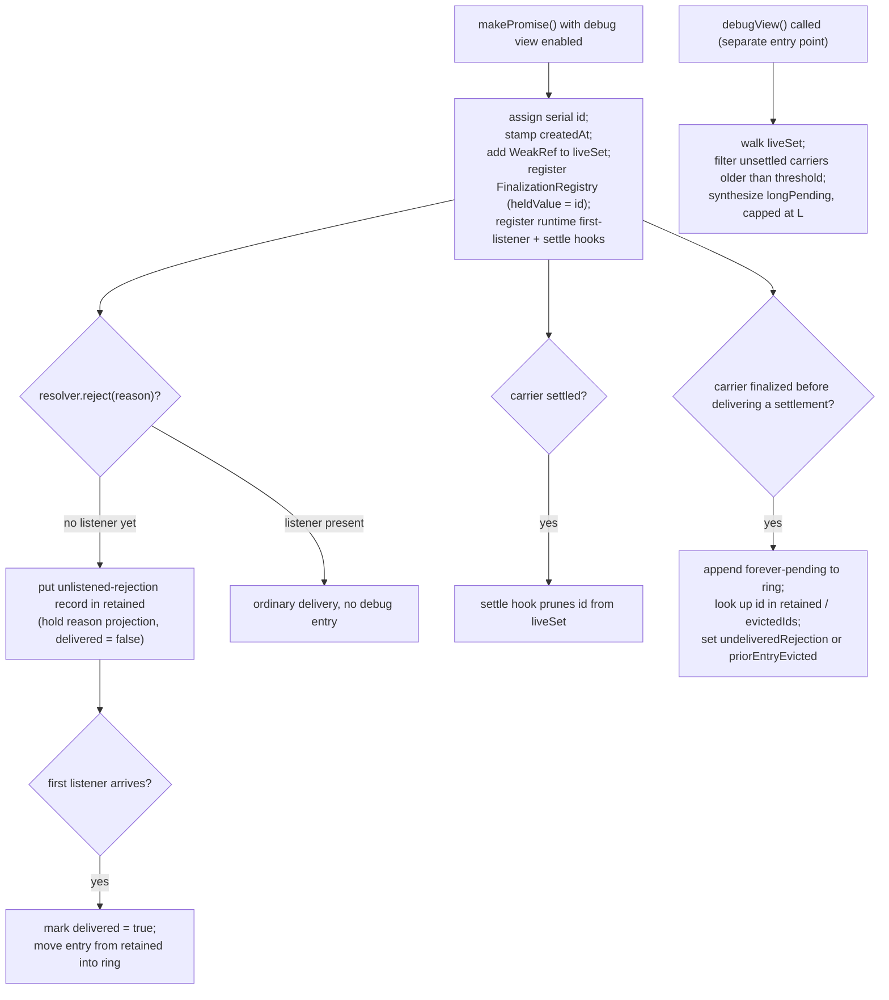

# Promise Debug View

| | |
|---|---|
| **Created** | 2026-07-12 |
| **Author** | Kris Kowal (prompted) |
| **Status** | Not Started |
| **Source** | [endojs/endo-but-for-bots#169 review](https://github.com/endojs/endo-but-for-bots/pull/169#pullrequestreview-4680376639) (inline comment on `designs/pass-style-promise.md`); tracked by [endojs/endo-but-for-bots#716](https://github.com/endojs/endo-but-for-bots/issues/716) |

## What is the Problem Being Solved?

The [pass-style-promise](pass-style-promise.md) design establishes a
rejection-retention principle.
When a producer rejects a pass-style promise that no listener has
attached to yet, the rejection is **retained on the producer's record**
and delivered to the first listener that arrives, rather than either
eagerly thrown to the host's unhandled-rejection path or silently
swallowed.
Both of the obvious answers are wrong: eager surfacing produces spurious
noise for a promise still in transit, and swallowing produces silent
failures.

Borrowed vocabulary, from the parent design and used unchanged here:

- A **carrier** is a pass-style promise.
- The **producer** is the party that holds the carrier's private
  `resolver` and alone may settle it.
- `makePromise(options)` is the parent's constructor that returns the
  `{ promise, resolver }` kit for one carrier.
  Everything in this design hangs off it: it is where a serial `id` is
  assigned, a creation stamp is taken, and (when the debug view is
  enabled) the runtime hooks are registered.
- A **listener** attaches to the carrier through `HandledPromise.listen`,
  `HandledPromise.settle`, or `E.when` to receive the settlement.
- **Retention** is the parent's rule that a rejection with no listener
  yet is held on the producer's record until the first listener arrives.

This recap is a reader's aid only.
The [pass-style-promise](pass-style-promise.md) design is the authority
for each term.

Retention is the right runtime behavior, but it opens an observability
gap.
A rejection that is retained and then **never delivered** (because a
listener never arrives, or the carrier is dropped in transit) is now
invisible.
By design there is no production log line, so a real bug that would
previously have shown up as an unhandled rejection leaves no trace.
Two neighboring conditions that retention never addressed share the same
need for in-transit visibility:

- **Long-pending** promises: a carrier that has stayed unsettled far
  longer than expected (a producer that forgot to resolve, a chain
  waiting on a hop that will not come).
- **Forever-pending** promises: a carrier that is garbage-collected
  without ever delivering a settlement, so it provably can never be
  observed to settle.
  This is the same never-settles idiom as `new Promise(() => {})` used as
  a token, now expressed as a dropped pass-style carrier.

A debugger needs to see all three conditions **in transit**, without
reintroducing the per-hop noise the retention principle exists to avoid.
This design specifies a bounded, opt-in **debug-view ring buffer** that
makes the "neither swallow nor eagerly throw" state observable to a
debugger while staying invisible and near-zero-cost in production.

This is the forward-looking follow-up recorded under "Out of Scope,
Future Work -> Debug view for long-pending and unlistened-rejection
promises" in [pass-style-promise](pass-style-promise.md), promoted to its
own design per the maintainer's request on the PR #169 review ("And we
should post a plan to create that design").
It **layers on** the retention contract specified there; it does not
restate or modify it.

### Prior art in this repository

Endo already implements diagnostic machinery of exactly this shape for
native promises.
`packages/ses/src/error/unhandled-rejection.js` keeps a monotonic id, an
`id` to `reason` `Map`, a promise to `id` `WeakMap`, and a
`FinalizationRegistry`, gated by lockdown's `unhandledRejectionTrapping`
option (`packages/ses/src/lockdown.js`).
This design reuses that structure where it can and deliberately differs
in one respect: the gate here is an `@endo/env-options` flag rather than
a lockdown option, so the debug view can be turned on for a running
process without changing the lockdown profile, and it targets pass-style
carriers rather than native promises.
The implementation should share the id-allocation and finalization
plumbing with the existing tracker rather than reinventing it.

## Design

### What the debug view observes

The debug view records carriers that enter one of three diagnostic
conditions.
Two are **recorded events**, appended at the moment they happen and
stored in the buffer.
The third is a **derived query**, computed fresh from the live-set each
time a debugger inspects, and never stored.

| Category | Kind | Condition | Signal source |
|---|---|---|---|
| `unlistened-rejection` | recorded | `resolver.reject(reason)` was called while the carrier had no listener. | The retention path already records this on the producer record; the debug view mirrors it. |
| `forever-pending` | recorded | The carrier was finalized (garbage-collected) without ever delivering a settlement to a listener. | A `FinalizationRegistry` callback, GC-driven, no timer. |
| `long-pending` | derived | The carrier is still unsettled at inspection time and older than a threshold age. | Computed lazily at inspection time from a creation timestamp, not stored and not from a background timer. |

The `forever-pending` condition covers two cases that a debugger reads
differently, so the entry names which one it is:

- The carrier was finalized having **never been settled at all** (a
  producer that forgot to resolve).
- The carrier was finalized after an `unlistened-rejection` whose reason
  **was never delivered to a listener**.
  This composite is the highest-signal bug the view can report: a
  rejection that was retained and can now never be delivered.
  The `forever-pending` entry carries `undeliveredRejection: true` and
  the retained reason projection (below) so the reader sees the
  conclusion directly, without re-joining two records by hand.

Note on the term *settled*.
A carrier is *settled*, in the parent design's vocabulary, once its
producer has called `resolve` or `reject`, whether or not any listener
observed the outcome.
A `forever-pending` carrier is therefore one finalized without ever
*delivering* an observed settlement, which is why the rejected-but-never
-listened case belongs here even though that carrier was, strictly,
settled.

The design deliberately introduces **no periodic sweep and no timer**.
Each recorded category is fed by an event that already happens (a reject
call, a GC finalization); the derived category is computed on demand when
a debugger asks.
Nothing wakes the process up on the debug view's behalf, so an idle
production process pays nothing for it beyond the disabled-path guard
below.

### Retained-reason projection

The one value the debug view holds for an `unlistened-rejection` is a
**diagnostic projection** of the rejection reason, not the reason object
itself.
The projection is computed at record time and consists of plain strings:
the reason's `message`, its `name`, and a `q()`-quoted or stack rendering
suitable for a snapshot.

Holding a projection rather than the reason graph is load-bearing for
three separate invariants, so it is stated once here and referred to
elsewhere:

- **Weak-carrier invariant.**
  A rejection reason is an arbitrary producer-authored value.
  An `Error` can transitively reference the carrier or its producer
  through its `cause` chain, its own properties, or closed-over stack
  frames.
  If the buffer held such a reason strongly it could keep alive exactly
  the carrier whose finalization the view exists to observe, so
  `forever-pending` would never fire for the carriers that matter.
  A projection of plain strings cannot reach back into the object graph,
  so the buffer cannot resurrect a carrier.
- **Harden transitivity.**
  The inspection surface returns a hardened snapshot, and `harden` is
  transitive.
  Holding the reason graph would deep-freeze arbitrary application error
  objects irreversibly.
  Freezing a record of strings freezes only the record shell.
- **No authority leak.**
  A projection of strings carries no handles, so Design Decision 5's "no
  authority crosses a cap boundary" holds by construction.

### Weak-reachability constraint (implementation invariant)

The `forever-pending` signal depends on garbage collection observing that
a carrier has become unreachable.
It therefore requires that **every edge the runtime and the debug view
add from a live structure to a carrier is weak or value-only**.
This is an implementation constraint the debug view imposes on itself and
on the surfaces it hooks:

- The live-set holds carriers only through `WeakRef` (below).
- The `FinalizationRegistry` registration holds the carrier weakly by
  construction; its `heldValue` is the serial `id`, a number, never the
  carrier.
- The debug view's own first-listener hook (see "First-listener arrival
  plumbing") must be registered **without** a strong runtime-to-carrier
  edge, or it would itself pin every carrier and defeat `forever-pending`.
  This is a new instance of the hazard, called out so Phase 2 discharges
  it explicitly.
- The retained-reason projection is value-only strings, per above.

If any runtime-to-carrier edge outside this list is strong (for example a
producer record that outlives the carrier and strongly references it),
finalization fires only once that whole graph dies, and the headline case
(producer alive, forgot to resolve) never fires.
The parent design states that its runtime edges to a carrier are weak;
this design depends on that and does not weaken it.

### Structures and entry shape

The debug view maintains three structures, all keyed on the serial `id`:

- **`retained`**: an `id`-keyed map of undelivered `unlistened-rejection`
  records, the half the view exists to report.
  An entry enters `retained` when a reject with no listener is observed
  and leaves it when the carrier's first listener arrives (the reason was
  delivered) or when the carrier is finalized (the reason can never be
  delivered).
  `retained` is bounded by its own capacity `R` and evicts its oldest
  entry only when `R` is exceeded; see eviction below.
- **`ring`**: a fixed-capacity FIFO of the most recent `N` **terminal**
  recorded events: delivered `unlistened-rejection` entries and
  `forever-pending` entries.
  When full, adding an entry evicts the oldest.
- **`liveSet`**: a map from `id` to a `WeakRef` of a carrier that is
  registered, not yet settled, and not yet finalized.
  It is the source for the derived `long-pending` query.
  Entries are pruned by the settle hook (on settlement) and by the
  `FinalizationRegistry` callback (on finalization), so the map holds no
  strong carrier edge and does not itself grow without bound past the
  count of live unsettled carriers.

Each recorded entry (in `retained` or `ring`) is a plain record:

| Field | Value |
|---|---|
| `id` | A monotonic serial identifier assigned at `makePromise()` time. It is the entry's correlation key and survives the carrier's collection. |
| `category` | `unlistened-rejection` or `forever-pending` (the two recorded kinds). |
| `createdAt` | Turn counter or wall-clock stamp captured at `makePromise()` time. |
| `recordedAt` | When the entry was appended (reject time for `unlistened-rejection`, finalization time for `forever-pending`). Every recorded entry has one, because every recorded entry entered a structure at a definite time. |
| `label` | An optional producer-supplied diagnostic string. Absent when the producer supplied none, never back-filled with a generated value, so a reader can always tell producer text from the system `id`. |
| `reason` | For `unlistened-rejection` (and for a `forever-pending` entry that carries `undeliveredRejection`): the retained-reason **projection**, plain strings, per "Retained-reason projection". Absent otherwise. |
| `delivered` | For `unlistened-rejection`: `false` on record, set `true` once the first listener arrives and the reason is delivered. |
| `undeliveredRejection` | For `forever-pending`: `true` when the finalized carrier had an undelivered `unlistened-rejection` (the headline composite), otherwise absent. |
| `priorEntryEvicted` | For `forever-pending`: `true` when the carrier's prior `unlistened-rejection` entry was evicted from `retained` under memory pressure, so the correlation is known to have been lost rather than absent. Otherwise absent. |

The record is the **internal** shape.
The snapshot the debugger reads is a copy of it that never carries a
carrier reference of any kind (there is no `carrierRef` field on the
record: liveness is answered by `liveSet`, and correlation by `id`, so a
per-entry carrier reference would be a field no consumer reads).

`id` is the stable identity the view correlates on across a carrier's
whole lifetime.
It is threaded as the `FinalizationRegistry` `heldValue` and stored on
every entry, so the finalization callback can find a carrier's earlier
`unlistened-rejection` entry by `id` without dereferencing a `WeakRef`
that no longer resolves once the carrier is collected.

### Eviction policy

The buffer's whole purpose is to report the half of a correlated pair
that arrives first (an `unlistened-rejection`) so it is still present when
the second half arrives (finalization).
A naive recency FIFO over all categories defeats that: because the parent
contract makes unlistened rejection a **normal, high-volume** case (a
carrier may travel several hops before any consumer listens), a single
FIFO would routinely evict the undelivered entry long before its carrier
is finalized, and the flagship signal would be lost silently.

So eviction protects the undelivered half:

- Undelivered `unlistened-rejection` entries live in `retained`, which is
  **not** subject to the recency FIFO.
  They are evicted only among themselves, and only when `retained`
  exceeds its own capacity `R`, oldest first.
- Every such eviction increments an `evicted` counter **and** records the
  evicted `id` in a small bounded `evictedIds` set.
  A later `forever-pending` finalization for an evicted `id` then sets
  `priorEntryEvicted: true` on its entry, so a lost correlation is
  **visible** in the snapshot rather than silently absent.
- The recency FIFO (`ring`) holds only terminal, lower-signal events
  (a delivered rejection, a `forever-pending`).
  Its evictions also increment `evicted`.

This bounds memory honestly: it is `O(R)` retained projections plus `N`
ring entries plus `O(live unsettled carriers)` `WeakRef`s in `liveSet`,
not `N` overall.
The snapshot reports `capacity`, `evicted`, and the thresholds (below) so
a debugger can tell an empty result apart from a saturated one.

### When entries are recorded



- **At `makePromise()`** (only when the flag is enabled): assign a serial
  `id`, stamp `createdAt`, add a `WeakRef` to `liveSet`, register the
  carrier with a `FinalizationRegistry` whose `heldValue` is the `id`, and
  register the runtime's own first-listener and settle hooks.
  No visible entry yet.
- **At `resolver.reject(reason)` with no listener**: the retention logic
  (already specified in the parent design) records the reason on the
  producer record; the debug view additionally puts an
  `unlistened-rejection` record, carrying the reason projection and
  `delivered: false`, into `retained`.
- **At first-listener arrival**: the entry is marked `delivered: true` and
  moved from `retained` into `ring`.
  This correlation is not free; see "First-listener arrival plumbing".
- **At settlement**: the settle hook prunes the carrier's `id` from
  `liveSet` so it can no longer be classified `long-pending`.
- **At finalization** of a carrier that never delivered a settlement: the
  `FinalizationRegistry` callback (which receives the carrier's `id` as
  its `heldValue`) prunes `liveSet` and appends a `forever-pending` entry
  to `ring`.
  It then looks the `id` up: if `retained` still holds an undelivered
  `unlistened-rejection` for it, the entry gets `undeliveredRejection:
  true` plus that reason projection (the headline case); if the `id` is in
  `evictedIds`, the entry gets `priorEntryEvicted: true`; otherwise it is a
  plain never-settled `forever-pending`.
- **At inspection time**: `long-pending` is computed by walking `liveSet`,
  keeping still-live carriers whose `createdAt` is older than the
  threshold, and synthesizing derived entries capped at a limit `L`.
  Nothing is recorded or stored for this category.

### First-listener arrival plumbing

Marking an `unlistened-rejection` entry `delivered` requires the debug
view to learn when the *first* listener attaches to a carrier.
The parent design's `onFirstListen` is **not** an always-on runtime signal
the view can pick up for free: it is an optional, single callback the
producer supplies in `makePromise()`'s options bag, invoked only if the
producer registered one, and the options bag has room for exactly one
(the parent's single fire-once producer-scoped slot).
Relying on it would mark `delivered` on only the subset of entries whose
producer happened to pass `onFirstListen`, missing every other
`unlistened-rejection` entry.

So when the debug view is enabled, the runtime registers **its own**
first-listener hook per carrier at `makePromise()` time, alongside (and
independent of) any producer-supplied `onFirstListen`.
Both fire on the same first-listener transition the resolver already
tracks internally.
The debug view's hook is additional plumbing the runtime owns, not a free
ride on the producer's optional callback, and it composes with a
producer-supplied `onFirstListen` rather than displacing it (the
producer's callback still fires with its documented fire-once,
producer-scoped contract).
Per the weak-reachability constraint above, this hook must not introduce a
strong runtime-to-carrier edge.
This added hook is why Phase 2 below is sized **M**, not **S**.

### Inspection surface

A debugger reads the buffer through a diagnostic accessor that returns a
**frozen snapshot**: a hardened record carrying the enabled state, the
buffer's own bounds, a hardened array of recorded entries, and a
separately bounded array of derived long-pending entries.
It never returns the live buffer and never returns a resolver or carrier.

```js
/**
 * Returns a hardened snapshot:
 *   {
 *     enabled,               // false when ENDO_PROMISE_DEBUG_VIEW is off
 *     capacity,              // ring capacity N
 *     retainedCapacity,      // retained-map capacity R
 *     evicted,               // count of records dropped by either bound
 *     longPendingThreshold,  // the age applied to classify long-pending
 *     entries,               // recorded events, most recent last:
 *                            //   { id, category, createdAt, recordedAt,
 *                            //     label?, reason?, delivered?,
 *                            //     undeliveredRejection?,
 *                            //     priorEntryEvicted? }
 *     longPending,           // derived at read time, capped at L:
 *                            //   { id, category: 'long-pending',
 *                            //     createdAt, observedAt, label? }
 *   }
 * `entries` and `longPending` are disjoint: recorded events versus a
 * query evaluated now. No carrier, resolver, or listener handle escapes;
 * each entry is a plain copy. When the debug view is disabled, `enabled`
 * is false and both arrays are empty, so a caller can distinguish
 * "turned off" from "on and nothing to report".
 */
HandledPromise.debugView = () => { /* ... */ };
```

Recorded events and the derived query are kept in **separate fields**
because only recorded events have a record time and an eviction policy.
A `long-pending` member is computed now, so it carries `observedAt` (the
inspection time) rather than `recordedAt`, and it is never spliced into
the `entries` ring, so it can never consume ring capacity nor evict a
retained reason.
The snapshot's own bounds (`capacity`, `retainedCapacity`, `evicted`,
`longPendingThreshold`) are reported alongside the entries so a debugger
who sees no record for a promise they suspect can tell "did not happen"
from "evicted", and one who sees no `long-pending` can tell what age was
applied.

The accessor is a **host-side diagnostic power**, not a passable
capability.
It is not marshaled, does not cross a cap boundary, and exposes only
copies and labels.
It is reachable by whoever holds the `HandledPromise` intrinsic in the
debugging realm, the same audience that holds `listen`/`settle`.
Where it lives, and whether it is gated behind the same permit machinery
as the parent design's new `HandledPromise` methods, is Open Question 1.

The producer may attach a `label` when it constructs the carrier so that
entries are legible in the snapshot:

```js
const { promise, resolver } = makePromise({ label: 'kref:p-42' });
```

The option is named `label`, the same name it reads back as in the
snapshot, so the round trip through `debugView()` is consistent.
It is inert when the debug view is disabled and is the only addition this
design makes to the `makePromise()` options bag.

### Production cost and gating

The debug view is **opt-in and off by default**, following the same
`@endo/env-options` pattern the parent design uses for
`ENDO_PROMISE_DELEGATES` (and that `TRACK_TURNS`, `DEBUG`, and the marshal
message-breakpoints options use):

```js
import { getEnvironmentOption } from '@endo/env-options';

const PROMISE_DEBUG_VIEW =
  /** @type {'disabled' | 'enabled'} */
  (getEnvironmentOption(
    'ENDO_PROMISE_DEBUG_VIEW',
    'disabled',
    ['enabled'],
  )) === 'enabled';
```

The bounds are read from their own env-options, each with a documented
default, so the "configurable" claim resolves to named variables:

| Env option | Controls | Default |
|---|---|---|
| `ENDO_PROMISE_DEBUG_VIEW` | on/off (`disabled` \| `enabled`) | `disabled` |
| `ENDO_PROMISE_DEBUG_VIEW_CAPACITY` | ring capacity `N` | Open Question 2 |
| `ENDO_PROMISE_DEBUG_VIEW_RETAINED` | retained-map capacity `R` | Open Question 2 |
| `ENDO_PROMISE_DEBUG_VIEW_THRESHOLD` | long-pending age threshold | Open Question 2 |
| `ENDO_PROMISE_DEBUG_VIEW_LONG_PENDING_LIMIT` | derived-query cap `L` | Open Question 2 |

When `PROMISE_DEBUG_VIEW` is `disabled`:

- `makePromise()` does not assign a serial id, does not stamp a timestamp,
  does not register a `FinalizationRegistry` entry, does not register the
  first-listener or settle hooks, and does not touch `liveSet`,
  `retained`, or `ring`.
- The reject path's **retention behavior is unchanged** (that is the
  parent design's always-on contract); only the *extra* buffer append is
  skipped.
- `HandledPromise.debugView()` returns a disabled snapshot with empty
  `entries` and `longPending`.

The guard is a single boolean read on the hot paths, so the disabled cost
is a branch, not an allocation.
This is what "inspectable while debugging without producing noise in
production" means concretely: the signal goes into bounded in-memory
structures a debugger reads on demand, never onto the host's console or
unhandled-rejection path, and those structures are not even populated
unless the flag is set.

### When `FinalizationRegistry` is unavailable

Endo already treats `FinalizationRegistry` as optional
(`packages/ses/src/error/unhandled-rejection.js`,
`packages/ses/src/commons.js`).
When it is absent, the debug view degrades rather than failing to load:
`unlistened-rejection` recording and the derived `long-pending` query
still work, but `forever-pending` (and therefore the
`undeliveredRejection` composite) cannot be produced.
The snapshot signals this so a debugger does not read a missing
`forever-pending` as "did not happen".
The concrete signal (a `forever-pending: 'unsupported'` flag on the
snapshot, or similar) is settled on the implementation PR.

### Native promises

Full fidelity is available only for **pass-style promises**, because the
three signals depend on producer-side machinery the platform does not
expose for native promises: there is no producer-side listener-arrival
hook on a native `Promise`, and its resolver is closed over at
construction.
Native promises are covered **opportunistically**: a native promise (or
`HandledPromise`) that flows through `HandledPromise.listen` /
`HandledPromise.settle` is visible at that point and may be registered for
`long-pending` / `forever-pending` tracking there.
Native rejections that are eagerly thrown are already covered by the
host's own unhandled-rejection tooling and are out of scope here.
The precise extent of native-promise coverage is Open Question 3.

## Reconciliation with the Pass-Style Promise Contract

This design **layers on** [pass-style-promise](pass-style-promise.md); it
re-specifies none of that contract.
The load-bearing reuses:

- **Rejection retention** (parent's "do not surface rejections to
  unlistened promises"): the debug view is the *observability* layer over
  the retention state that already exists.
  It reads the same retained-reason record and does not change the rule
  that a rejection with no listener is held, not thrown and not swallowed.
  The debug view never causes an eager throw and never suppresses a
  delivery.
- **First-listener transition** (parent's "Producer-side first-listen
  notification"): the debug view marks an `unlistened-rejection` entry
  `delivered` on the same once-per-carrier first-listener transition the
  resolver already tracks internally, through its own runtime-owned hook
  (see "First-listener arrival plumbing"), not the producer's optional
  `onFirstListen`.
- **Fire-once settlement** (parent's Open Question 3 resolution): because
  settlement is final, an entry's lifecycle is monotonic (pending to
  settled/delivered, or pending to finalized), so the buffer never has to
  reconcile a resettled carrier.

## Dependencies

| Design or issue | Relationship |
|---|---|
| [pass-style-promise](pass-style-promise.md) | Parent design. This one implements the "Debug view" future-work item and layers on its rejection-retention and first-listener contracts. Not tracked as blocked-by, but sequenced after the parent's Phase 3: the retention path and the `listen`/first-listener transition it reads must exist first. |
| [endojs/endo#1312](https://github.com/endojs/endo/issues/1312) | The `new Promise(() => {})` never-settling token idiom the `forever-pending` category makes visible once expressed as a dropped pass-style carrier. |
| [endojs/endo#1652](https://github.com/endojs/endo/issues/1652) | Source of the `listen`/`settle` primitives whose first-listener transition the `delivered` marking rides. |
| [endojs/endo-but-for-bots#172](https://github.com/endojs/endo-but-for-bots/issues/172) | The `Promise[Symbol.for('delegate')]` follow-up; if the debug view is exposed as a delegate-adjacent op, it should compose with that surface rather than duplicate it (Open Question 1). |
| [packages/ses/src/error/unhandled-rejection.js](https://github.com/endojs/endo/blob/master/packages/ses/src/error/unhandled-rejection.js) | Existing in-repo tracker of the same shape (monotonic id, id-to-reason map, promise-to-id weakmap, `FinalizationRegistry`). Reuse candidate for id allocation and finalization plumbing, and gating precedent (it uses a lockdown option; this design uses an env-option, deliberately). |

## Phased Implementation

The debug view sequences after the parent design's Phase 3 (eventual-send
integration), because the retention path and the `listen`/first-listener
transition it reads must exist first.

1. **Buffers and env-options (S).**
   The `ring` FIFO, the `retained` map with its bounded eviction and
   `evictedIds` marker, the `ENDO_PROMISE_DEBUG_VIEW` gate and the four
   bound options, the disabled-path guards, the serial id allocator
   (shared with the existing unhandled-rejection tracker), and
   `HandledPromise.debugView()` returning the frozen snapshot.
   Unit tests for ring capacity, retained-map eviction incrementing
   `evicted` and setting `priorEntryEvicted` on a later finalization, the
   disabled no-op, and the `enabled` flag.
2. **Unlistened-rejection recording (M).**
   Append on `resolver.reject` with no listener into `retained`; register
   the runtime's own first-listener hook per carrier with no strong
   carrier edge (composing with any producer-supplied `onFirstListen`) and
   mark `delivered`, moving the entry into `ring`, on first-listener
   arrival.
   Test the retained-reason projection (strings only, no reference to the
   reason graph), the delivered transition against the parent's retention
   tests, and that `delivered` is marked even when the producer supplied
   no `onFirstListen`.
3. **Long-pending classification (XS).**
   `liveSet` walk at inspection time with the configurable threshold and
   the `L` cap, pruned by the settle hook.
   No timer, nothing stored.
4. **Forever-pending via FinalizationRegistry (S).**
   Register at `makePromise()` with the serial `id` as `heldValue`, append
   on finalization of a carrier that never delivered a settlement, and set
   `undeliveredRejection` / `priorEntryEvicted` from the `retained` /
   `evictedIds` lookup.
   Test the composite headline case explicitly: an `unlistened-rejection`
   entry whose carrier is GC'd before any listener arrives must, on
   finalization, produce a `forever-pending` entry with
   `undeliveredRejection: true` and the retained reason, the highest-signal
   bug the view exists to report.
   Also test the degraded path where `FinalizationRegistry` is absent.
   GC-driven tests are inherently non-deterministic; gate them behind an
   explicit `gc()` harness where available, else document as best-effort.
5. **SES permit (XS).**
   If `HandledPromise.debugView` lands on the `HandledPromise` intrinsic,
   add it to the `HandledPromise` permit entry in
   `packages/ses/src/permits.js`, the same two-line shape the parent
   design's Phase 3.5 uses for `listen`/`settle`.
   Resolving Open Question 1 decides whether this phase applies.
6. **Docs (XS).**
   A `NEWS.md` note and a short "debugging retained rejections" section
   cross-linked from the parent design.

## Design Decisions

1. **No background timer or sweep.**
   Every recorded category is event-driven (reject, finalization) and the
   derived category is computed on demand (long-pending at inspection).
   This keeps an idle production process at zero incremental cost and
   honors "without producing noise in production" literally: nothing
   periodic runs.
2. **Weak carrier references, stable serial id for correlation.**
   The structures must not keep carriers alive (that would mask
   `forever-pending` and leak memory), so carriers are held via `WeakRef`
   and the weak-reachability constraint governs every edge.
   Because a `WeakRef` cannot be dereferenced once the carrier is
   collected, exactly when the finalization callback needs to find that
   carrier's earlier entry, correlation across a carrier's lifetime is
   keyed on a monotonic serial `id` (threaded as the `FinalizationRegistry`
   `heldValue`), not on the reference.
3. **Undelivered rejections are protected from eviction.**
   The buffer exists to correlate a rejection with its later finalization,
   so the recency FIFO may not evict the undelivered half.
   Undelivered `unlistened-rejection` records live in `retained` with its
   own bound, and any loss under pressure is surfaced through `evicted`
   and `priorEntryEvicted` rather than hidden.
4. **Recorded events and derived queries are separate.**
   The snapshot splits `entries` (recorded, with a record time and an
   eviction policy) from `longPending` (computed at read time, with an
   `observedAt` and its own cap), so neither braids into the other's
   bound.
5. **Reason projection, not reason graph.**
   The buffer holds a value-only projection of a rejection reason, which
   preserves the weak-carrier invariant, keeps `harden` from freezing
   foreign application graphs, and leaks no authority across a cap
   boundary.
6. **Producer `label` and system `id` are separate fields.**
   A producer-supplied diagnostic string (`label`) and the
   system-generated correlation identifier (`id`) never share one field or
   value space, so a snapshot reader always knows whether a value is
   free-form producer text or a generated id.
7. **Snapshot, not live buffer.**
   The inspection surface returns hardened copies so a debugger cannot
   mutate runtime state or reach a resolver, listener, or carrier through
   the debug view.
8. **Diagnostic power, not passable capability.**
   `debugView()` is host-side and never marshaled; it exposes labels and
   copied reason projections, never handles that would leak authority
   across a cap boundary.
9. **Off by default, opt-in via env-option.**
   Reuses the parent design's `@endo/env-options` idiom for consistency
   and for a diagnosable on/off toggle.

## Open Questions

1. **Where do the debug view's structures and surface live, and what
   package owns them?**
   The parent design makes the `@endo/pass-style` versus
   `@endo/eventual-send` split a first-class decision, and this feature is
   fed from both sides (`makePromise`/`reject` in pass-style,
   `listen`/`settle`/first-listener in eventual-send), so the owning
   package for the buffer, the id allocator, and `liveSet` is as
   load-bearing as where the accessor is exposed.
   Does the accessor live at `HandledPromise.debugView` (paired with
   `listen`/`settle`, permit-gated the same way), as a separate
   `@endo/pass-style` debug export, or as a devtools-only global adjacent
   to the `Promise[Symbol.for('delegate')]` direction in
   [endojs/endo-but-for-bots#172](https://github.com/endojs/endo-but-for-bots/issues/172)?
   The deciding criterion is **confidentiality across compartments**, not
   symmetry with `listen`/`settle`: a diagnostic on a shared intrinsic
   hands any confined holder other subgraphs' labels, reason projections,
   and timings, plus a GC-observability side channel that
   `packages/captp/src/finalize.js` documents as a determinism-breaker for
   replay and consensus.
   That hazard should govern the placement.
2. **What are the default bounds?**
   What default ring capacity `N`, retained capacity `R`, long-pending age
   threshold, and long-pending cap `L` are useful without making an
   enabled process a memory concern?
   Each is named as an env-option above; the question is only the default.
3. **How far does native-promise coverage go?**
   Opportunistic tracking when a native promise passes through
   `listen`/`settle` is cheap; registering every native promise the
   process creates is not feasible and is the host tooling's job.
   Where exactly is the line, and does the design need a
   `HandledPromise.debugTrack(nativePromise, label)` opt-in for native
   promises a debugger cares about?
   If such an op lands, its name should follow the same convention as
   `debugView` (both read as `debug<Noun>`, or both recast to
   `debug<Verb>`) rather than pairing a noun-styled query with a
   verb-styled command.
4. **Should `forever-pending` entries fan out to a host hook?**
   The `FinalizationRegistry` signal for "a rejection was retained and can
   now never be delivered" is the highest-value bug the view surfaces.
   Is a buffer entry sufficient, or should an *enabled* debug view also
   offer an opt-in callback (still off in production) so a test harness can
   fail loudly on a provably undeliverable retained rejection?
   This must not become the eager-throw the retention principle rejects;
   it would be a debug-only, explicitly armed hook.
5. **Should `createdAt` be a turn counter or wall-clock?**
   A turn counter is deterministic and reproducible across replays;
   wall-clock is more legible to a human reading a snapshot.
   Should the buffer carry both?

## Prompt

Requested by kriskowal in the PR #169 review
([pullrequestreview-4680376639](https://github.com/endojs/endo-but-for-bots/pull/169#pullrequestreview-4680376639)),
as an inline comment on `designs/pass-style-promise.md` at the
future-directions paragraph:

> And we should post a plan to create that design.

The "that design" is the future-work item recorded in
[pass-style-promise](pass-style-promise.md) under "Out of Scope, Future
Work -> Debug view for long-pending and unlistened-rejection promises":

> Per the rejection-retention principle in the Listening section, the
> right answer to "rejections in transit before any listener" is neither
> swallow nor eagerly throw. A future debug-view direction is a ring
> buffer of recent long-pending, forever-pending, and unlistened-rejection
> promises, inspectable while debugging without producing noise in
> production. This is its own design and is not blocked by the present
> one.
