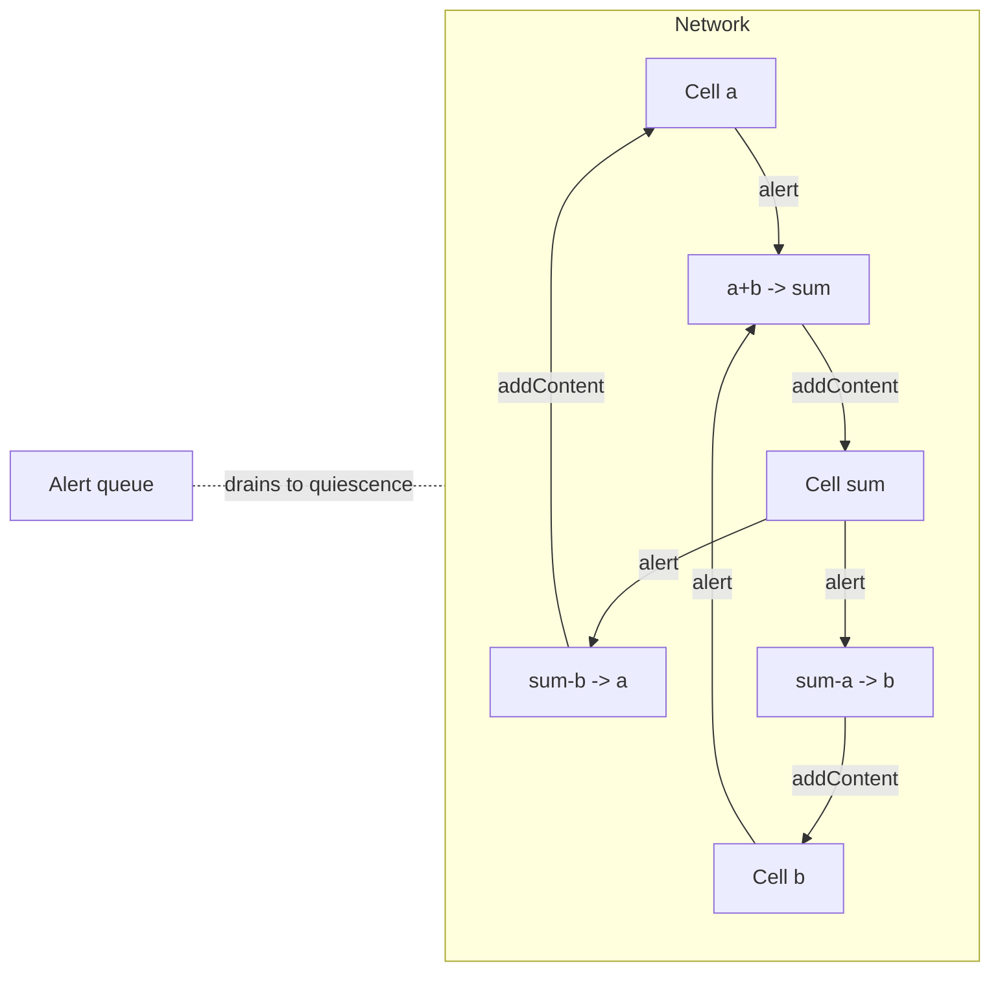
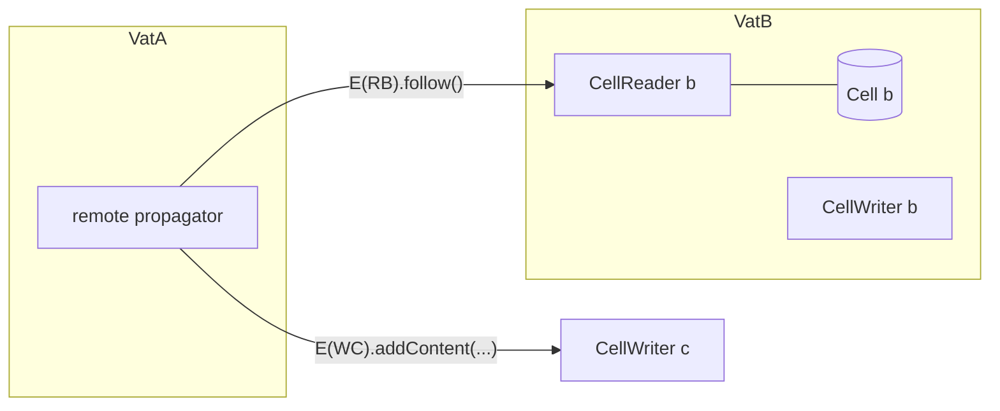

# Propagator Cells at the Endo and Exo Layers

| | |
|---|---|
| **Created** | 2026-06-25 |
| **Author** | endolinbot (prompted) |
| **Status** | Not Started |

## What is the Problem Being Solved?

The garden's change-propagation scholarship maps a family of consistency
mechanisms in the Endo corpus: synchronous in-process bindings (`kriskowal/frb`),
asynchronous current-value streams (the agoric notifier / `@endo/pubsub`
"latest" topic), and order-significant delta streams (the "changes" topic).
One member of the classical family is present only as external lineage and has
no Endo grounding: the **propagator** of Radul and Sussman, the
*multidirectional* member, where information flows in every direction a
constraint permits rather than from a source to a target.

This document designs that member: a propagator network at the plain **Endo**
layer (in-process, hardened, no ambient authority) and its lift to **passable,
remotable Exo objects** so a network can span vats and agents, with merge
remaining monotone so that the asynchronous, possibly-reordered,
possibly-duplicated delivery across a membrane still converges.
The through-line that ties it to the rest of the family is **idempotent
convergence**: a propagator cell is the change-propagation primitive whose
accumulator is a lattice join, which is exactly a state-based CRDT, which is
exactly why eventual cross-vat merge is sound.

External lineage (cited, not in-corpus):
Alexey Radul and Gerald Jay Sussman, *The Art of the Propagator*, MIT CSAIL
Technical Report MIT-CSAIL-TR-2009-002 (2009);
Alexey Radul, *Propagation Networks: A Flexible and Expressive Substrate for
Computation*, PhD thesis, MIT (2009).
The model summary below is drawn from those sources.

## The Model (Radul / Sussman)

- A **cell** holds **partial information** about a value: a point in a lattice,
  not a single assignment.
  A cell accumulates content through a **merge** that is the lattice join, so it
  is **commutative, associative, and idempotent**, and **monotone** (content only
  ever moves up the lattice).
  The bottom element is "no information" (Radul's `nothing`); the top element is
  **contradiction**, reached when two incomparable contents are merged.
- A **propagator** is a monotone agent that watches some input cells and, when an
  input gains information, adds information to its output cells.
  A relation is realized by **several** primitive propagators, one per direction:
  the constraint `sum = a + b` is the three propagators `a + b -> sum`,
  `sum - b -> a`, `sum - a -> b`.
  Propagation is therefore **multidirectional**: a constraint, not a function.
- A **scheduler** runs an alert queue to **quiescence**.
  Adding content to a cell alerts its neighbor propagators; running a propagator
  may add content to further cells; the network settles at a fixed point.
  Monotonicity over a bounded-height lattice guarantees the fixed point exists
  and is reached.
- **Truth maintenance** (provenance, retraction, nogood tracking) is *optional*
  in the model.
  This design includes it only as a **seam**, not as a v1 feature.

## In-Corpus Precedent: FRB Two-Way Bindings

The one multidirectional-constraint instance already in the corpus is the FRB
two-way binding operator `<->`
(topic [`reactive-bindings`], section
[`frb--readme--reference-semantics`]).
The propagator generalizes it on three axes, and naming the generalization keeps
the new vocabulary anchored to the old:

| FRB `<->` | Propagator network |
|---|---|
| Binary: exactly two properties. | N-ary: any number of cells per constraint. |
| Total values only; a property holds one value. | Partial information; a cell holds a lattice point. |
| Direction realized by a converter / reverter pair, often by **automatic algebraic inversion** of the expression. | Direction realized by one primitive propagator per direction; algebraic inversion is the binary, value-lattice special case of generating the reverse propagator. |
| `null` / `undefined` operand **suppresses the update** so an invalid source never corrupts its target. | That suppression *is* the lattice `nothing` (bottom): absence contributes no information and never corrupts. The propagator makes it first-class for every domain, not just the two-point present-or-absent lattice. |
| Synchronous, in-process, consistency restored in the same statement. | Scheduler runs a fixed-point queue; the Exo lift (below) makes it asynchronous and cross-vat. |

In one sentence: FRB's `<->` is the binary, total-value, algebraically-inverted
special case of a propagator constraint, and FRB's null-suppression is the
bottom element of its (degenerate) lattice.

## Endo Layer (the implementation)

Package `@endo/propagator` (no `exo-` prefix: this layer exports no passable
interface over CapTP; the prefix rule is in `designs/CLAUDE.md` style lineage and
the designer naming norm).
Everything is hardened; the network is created by a factory that takes its
lattice as an explicit argument, so there is no ambient authority and no global
state.

```js
// @ts-check
import { makePropagatorNetwork } from '@endo/propagator';

const network = makePropagatorNetwork(valueLattice);
const a = network.makeCell();
const b = network.makeCell();
const sum = network.makeCell();
network.makeAdder(a, b, sum); // installs the three directional propagators
a.addContent(3);
sum.addContent(7);
network.run(); // to quiescence
b.getContent(); // 4, inferred backward
```

### The lattice contract (the plug-in seam)

A domain plugs in by supplying a lattice.
This is the single extension point and the reason the core carries no
domain knowledge:

```js
/**
 * @template T
 * @typedef {object} Lattice
 * @property {T} bottom                 // "no information"
 * @property {(a: T, b: T) => MergeResult<T>} merge   // the join; total
 * @property {(a: T, b: T) => boolean} equal          // has content changed?
 */
/**
 * @template T
 * @typedef {{ content: T, contradiction: boolean }} MergeResult
 */
```

`merge` is **total**: incomparable inputs return `{ contradiction: true }`
rather than throwing, so contradiction is a lattice value (the top), never an
exception.
This is the load-bearing defensive choice against untrusted callers.

Reference lattices shipped or sketched:

| Lattice | `bottom` | `merge` | Top / contradiction |
|---|---|---|---|
| nothing / value (the classic) | `NOTHING` | equal values agree; unequal values contradict | distinct values |
| interval (numeric) | `(-inf, +inf)` | intersection of ranges | empty intersection |
| set | `everything` or `{}` per direction | union or intersection | disjoint where agreement is required |

### Cell and propagator interfaces

```js
// Cell
const cell = harden({
  getContent: () => content,              // current lattice point
  addContent: (increment) => { /* merge; if changed, alert neighbors */ },
  addNeighbor: (propagator) => { /* register for alerts */ },
  dispose: () => { /* unlink neighbors; see teardown */ },
});

// Propagator: input cells, output cells, an activation that reads inputs
// and adds content to outputs. Registers itself as a neighbor of each input.
const propagator = harden({
  activate: () => { /* read inputs, compute, addContent to outputs */ },
  dispose: () => { /* drop input/output references */ },
});
```

### Scheduler

`addContent` that changes a cell's content enqueues every neighbor propagator on
the network's alert queue.
`run()` drains the queue until empty (quiescence).
A reentrancy guard makes an `addContent` issued *during* a propagator's
activation enqueue rather than recurse, so activation order cannot blow the
stack and cannot make convergence depend on call nesting.
Monotonicity over a bounded-height lattice guarantees termination; an
unbounded-height lattice (open intervals) needs a fairness or bound argument,
recorded under Open Questions.



### Hardening

- `harden` on every export and every returned facet, per the root
  `CLAUDE.md` hardened-JavaScript conventions and the
  [`hardened-javascript`] topic.
- **No ambient authority**: the lattice is injected; cells and propagators exist
  only through the network factory; nothing reads a global.
- **Defensive against untrusted callers**: `addContent` validates its increment
  against the lattice; `merge` is total and yields contradiction rather than
  throwing; the reentrancy guard bounds activation.
- **Teardown / GC of the neighbor graph**: a cell holds its propagators and a
  propagator holds its cells, so the neighbor graph is a **reference cycle** that
  a naive design leaks.
  v1 uses **explicit `dispose()`**: disposing a cell or a subnetwork unlinks the
  neighbor sets in both directions so the cycle is broken deterministically.
  A WeakRef + `FinalizationRegistry` scheme that lets an unreachable subnetwork
  be collected is deferred (Phase 5), because GC-driven teardown of a constraint
  graph is subtle: a propagator can be the only thing keeping an output cell's
  content fresh, so reachability is not a safe proxy for liveness.
  This is the same cross-graph-GC hazard the daemon faces in
  [`daemon-cross-peer-gc`]; we reuse its discipline rather than re-derive it.

## Exo Layer (lift to passable)

Package `@endo/exo-propagator` (the `exo-` prefix is required by the designer
naming norm: its primary surface is passable interfaces exchanged over CapTP).
A cell becomes a multi-facet Exo so that *which* authority a holder receives is
chosen by *which facet* is handed out, never by ambient access.

### Facets (the ocap split)

Built with `defineExoClassKit` so the facets share one cohort of state
(exo taxonomy: `this.facets`; sections
[`endo--pkg-exo-docs-exo-taxonomy--make-vs-define`],
[`endo--pkg-exo-docs-exo-taxonomy--heap-virtual-durable`]):

| Facet | Methods | Authority granted |
|---|---|---|
| `CellReader` | `getContent()`, `follow()`, `subscribe(watcher)` | observe content; no write |
| `CellWriter` | `addContent(increment)` | inject information; no read |
| `CellAdmin` | `dispose()`, `getReader()`, `getWriter()` | own the cell |

Each facet is `makeExo`-style with an `M.interface()` guard, so the boundary is
type-checked and a holder of `CellReader` provably cannot write.
A cell reference is thus an **attenuable capability**, not ambient authority: a
vat can affect only the cells whose writer facet it was handed, and observe only
those whose reader facet it was handed.



### Async eventual merge across vats (the convergence argument)

A propagator in vat A that watches a cell in vat B subscribes with
`E(readerB).follow()` and, on each new content, does
`E(writerC).addContent(increment)` (eventual-send; topic [`eventual-send`]).
Because `merge` is a lattice **join** (commutative, associative, idempotent) and
content is **monotone**, the cell's content is the join of every increment it has
ever received, *independent of the order they arrive and independent of
duplicates*.
That is precisely the **strong eventual consistency** of a state-based CRDT
(CvRDT): the cell *is* a CRDT whose join is the lattice merge.

This is also why the right cross-vat delivery discipline is **"latest"
(lossy, convergent)** and not **"changes" (lossless, order-significant)**.
Per the notifier lossiness analysis
(section [`agoric-sdk--pkg-notifier-readme--type-differences--lossiness`]):
a "latest" stream may drop intermediate values, delivering only a later one,
and that is *safe here* because the cell's content already equals the join of
all prior increments, so a dropped intermediate is subsumed by the value that
replaces it.
A "changes" stream would be wasteful and is unnecessary for a monotone cell.
The propagator cell is therefore the **idempotent-convergence** member of the
change-propagation family, sitting beside *latest* (convergent current value,
last-write-wins) and *changes* (order-significant deltas):

| Family member | Accumulator | Tolerates reorder? | Tolerates duplicate? | Tolerates loss? |
|---|---|---|---|---|
| `changes` (delta stream) | append | no | no | no |
| `latest` (current value) | last-write-wins | partly (must end on latest) | yes | yes (intermediates) |
| **propagator cell** | **lattice join** | **yes** | **yes** | **yes (intermediates)** |
| FRB `<->` observer | synchronous re-eval | n/a (in-process) | n/a | n/a |

The contrast with the [`crdt-in-formula-persistence`] concept is deliberate and
worth stating: cross-peer retention *abandoned* a merge because authority was
asymmetric and there was "no shared truth to converge on."
A propagator cell is the opposite case: there **is** a shared truth (the join),
so the merge is exactly the right primitive.
Naming both poles keeps a future reader from reaching for a CRDT where authority
is asymmetric, or for a retention-set where a join is available.

### Contradiction across the membrane

Contradiction is a passable value (a marked record), so it crosses the membrane
like any other content: a remote merge that yields contradiction sets the cell's
content to the contradiction, and remote `follow()` observers see it.
Without truth maintenance, a contradicted cell is **terminal** (it stays
contradicted); recovery requires the `CellAdmin` facet, which only the owner
holds.
With the TMS seam (below), the contradiction carries **provenance**: the set of
premises (themselves far-refs to source cells) that justified the conflicting
contents, so a higher authority can retract one premise.
Cross-membrane provenance is then itself an ocap story, since a premise is a
capability.

### Durability

Cells may be heap, virtual, or durable Exos (exo taxonomy
[`endo--pkg-exo-docs-exo-taxonomy--heap-virtual-durable`]).
A durable cell stores its content (a passable lattice element) and survives a vat
upgrade.
Which lattices are durably storable (their elements must be passable) versus
heap-only is an Open Question.

## Dependencies

| Design / source | Relationship |
|---|---|
| [`reactive-bindings`] topic, FRB `<->` | The in-corpus precedent this generalizes. |
| `@endo/pubsub` "latest" / "changes" topics | Sibling family members; the cell's cross-vat stream is a "latest" topic. |
| [`daemon-cross-peer-gc`] | The neighbor-graph teardown reuses its cross-graph GC discipline. |
| [`eventual-send`] topic | The cross-vat merge mechanism (`E().follow()`, `E().addContent()`). |
| exo taxonomy | Facet split (`defineExoClassKit`) and heap/virtual/durable storage. |

## Phased Implementation

1. **`@endo/propagator` core.**
   Cell, propagator, scheduler, the `Lattice` contract, the value lattice and an
   interval lattice, explicit `dispose()` teardown, hardened throughout.
   Tests: Radul's canonical examples (adder/multiplier constraint, the
   Fahrenheit/Celsius/Kelvin temperature network), plus a quiescence test and a
   contradiction-detection test.
2. **Richer lattices and a constraint builder.**
   Set lattice; a helper that generates the multidirectional propagator set from
   a relation (the n-ary generalization of FRB's automatic algebraic inversion).
3. **`@endo/exo-propagator` lift.**
   `CellReader` / `CellWriter` / `CellAdmin` facets via `defineExoClassKit` with
   `M.interface()` guards; a cross-vat propagator using `E().follow()`;
   contradiction-as-passable.
   Tests: a randomized-delivery convergence test (shuffle and duplicate the
   increment stream across a simulated membrane; assert the cell converges to the
   same join every run).
4. **Truth-maintenance seam.**
   Provenance-carrying contents, premise retraction, nogood tracking; additive,
   off by default.
5. **Durability and WeakRef GC.**
   Durable-zone cells; a WeakRef + `FinalizationRegistry` teardown for long-lived
   cross-vat subnetworks, behind the liveness caveat from Phase 1.

## Design Decisions

1. **The lattice is an injected parameter, not baked in.**
   One extension seam, no domain knowledge in the core, and no ambient authority.
2. **`merge` is total and returns contradiction; it never throws.**
   Contradiction is the lattice top, a value, so untrusted callers cannot drive
   control flow through exceptions and cross-vat contradiction is just content.
3. **Explicit `dispose()` for v1; WeakRef GC deferred.**
   Deterministic teardown of the cyclic neighbor graph beats reachability-driven
   collection, because a propagator may be the sole keeper of a cell's freshness.
4. **`@endo/propagator` (no prefix) for in-process; `@endo/exo-propagator`
   (`exo-` prefix) for the CapTP-passable layer.**
   Per the designer naming norm: the prefix marks the package whose primary
   surface is passable interfaces over CapTP.
5. **Cross-vat delivery is "latest" (lossy convergent), not "changes".**
   A monotone cell's content is the join of all increments, so dropped
   intermediates are subsumed; lossless delivery would be wasted effort.
6. **Truth maintenance is a seam, not a v1 feature.**
   The base model converges without provenance; retraction is additive.

## Open Questions

- Does the scheduler need a fairness rule or a quiescence bound for
  unbounded-height lattices (open intervals), where monotone content can move up
  forever without reaching top?
- Without a TMS, is a contradicted cross-vat cell strictly terminal, or should
  `CellAdmin` expose a guarded reset, and who legitimately holds that authority?
- Should the cell's `follow()` stream reuse `@endo/pubsub`'s `makeLatestTopic`
  directly, or a bespoke notifier?
  The `makeLatestTopic` / `makeChangeTopic` vocabulary is the notifier-to-pubsub
  migration vocabulary and is flagged in the library keywords as load-bearing but
  not yet curated in the corpus; the builder confirms the exported surface before
  depending on it.
- Which lattices are durably storable (elements passable) versus heap-only, and
  does a durable cell need its lattice re-injected on revival?
- Is WeakRef + `FinalizationRegistry` GC of a subnetwork ever safe given that a
  propagator can be the only reference keeping an output cell's content current,
  or must long-lived networks always be torn down explicitly?

## Prompt

> Design a propagator in the Sussman/Radul model, implemented at the Endo layer
> and lifted to passable at the Exo layer, as hardened modules.
> Cells hold partial information (a lattice point) merged monotonically;
> propagators are monotone multidirectional agents run to a fixed point by a
> scheduler; optional dependency tracking / truth maintenance.
> At Endo: the cell interface, the propagator interface, the scheduler, and the
> merge / partial-information lattice contract, hardened (SES `harden`, no ambient
> authority, defensive against untrusted callers, clean teardown of the
> cell/propagator neighbor graph), relating it to FRB two-way (`<->`) bindings as
> the in-corpus multidirectional precedent.
> At Exo: cells and propagators as passable / remotable exo objects so propagation
> spans vats, with async eventual merge that stays monotone (order- and
> duplication-tolerant: idempotent convergence), contradiction across the
> membrane, and ocap discipline (a cell reference is an attenuable capability).
> Situate it in the change-propagation family: the lattice-merge is the
> idempotent-convergence face; relate to *latest* vs *changes*, to FRB observers,
> and to `@endo/pubsub` topics, propagators being the multidirectional member.
> Open as a DRAFT PR on `endojs/endo-but-for-bots` `llm` for maintainer review.
</content>
</invoke>
