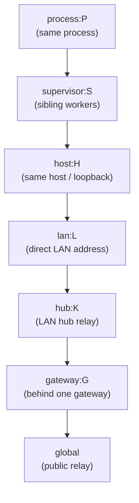

# Relative Routing for CapTP/OCapN Locator Hints

| | |
|---|---|
| **Created** | 2026-08-17 |
| **Updated** | 2026-09-04 |
| **Author** | Kriscendo Bot (prompted by Kris Kowal) |
| **Status** | Not Started |

## What is the Problem Being Solved?

A locator names a peer by a durable identity (its Ed25519 public key) and
carries a set of ephemeral connection hints describing where that peer
can currently be reached (see [daemon-locator-reference](daemon-locator-reference.md)
and [ocapn-noise-network](ocapn-noise-network.md)). This is the concrete form
of *relative routing*: a session is established by choosing a route from a
candidate set, not by dialing one fixed absolute address.

Routing has two halves: advertising a candidate set of hints, which a locator
already does, and choosing among them, which nothing does today. That choosing
half is missing: nothing filters a peer's hints by whether they are *reachable
from here*, and nothing ranks them cheapest-first. Two
consequences:

1. **Correctness.** A hint like `ws://127.0.0.1:8920` means "me" only to a
   peer on the same host. To a peer on a different host, `127.0.0.1` names
   *that machine's own loopback*, a different computer. A domain-socket path
   or an internal `10.x` address is meaningless off the boundary it belongs
   to. Trying such a hint is not just wasteful: it can connect somewhere
   wrong.
2. **Cost.** Two daemons on the same LAN, or two workers under one supervisor,
   should reach each other directly (a LAN address, a domain socket) rather
   than hopping out through NAT to a public relay. Without a locality signal
   the connector cannot tell the cheap local route from the expensive global
   one.

The missing piece is a notion of **where the receiver is**, its own local
scope, that it can compare against each hint's claimed scope, so it can drop
hints that cannot work from here and prefer the closest route that can. This
design specifies that scope model, how a hint carries its reachability scope,
how the connector filters and ranks, and what a scope boundary does and does
not authorize.

## Cases in Scope

The "Shared scope tag" column uses the `<kind>:<id>` scope-tag shape defined in
§ 1.

| # | Case | Shared scope tag | Route the tag selects |
|---|------|------------------|-----------------------|
| 1 | Same-LAN peers | `lan:<L>` | Direct LAN address, no NAT/relay hop |
| 2 | Workers under a shared supervisor | `supervisor:<S>` | Domain socket / named-pipe introduction, no network stack |
| 3 | Daemons on a host behind a shared gateway | `host:<H>` or `gateway:<G>` | Host-local socket / loopback, or gateway-local introduction |
| 4 | Loopback / same-host (or same-process) | `host:<H>` (`process:<P>`) | `127.0.0.1` route; in-process loopback when `process:<P>` also matches |
| 5 | Home hub on the local network | `lan:<L>` + `hub:<K>` | Direct LAN address first, then the LAN hub relay, both ranked cheaper than the public relay |
| 6 | A gateway's children, reached through the gateway | `dest=gateway:<G>` on a `via=` hint (a *destination* marker the relay names, **not** a receiver-held `scope=` tag; see § 3) | Compound `via=<gateway-locator>` introduction hint, always kept |

The mechanism is deliberately open: `<kind>` is an extensible enumeration, so
new locality kinds (a container/mount namespace, a VPN overlay, a mesh subnet)
are added without a redesign.

## Design

### 1. Scope Tags: Expressing "Where a Hint Is Reachable From"

A **scope tag** is a structured, comparable token with two fields, `kind` and
`id`:

- `kind` names a locality boundary: `process`, `host`, `supervisor`,
  `hub`, `lan`, `gateway` (extensible). It is the classification key that
  `costOf` (§ 4) reads to rank a hint.
- `id` is an opaque identifier for a *specific* instance of that boundary:
  a per-process nonce, a host-scoped nonce, a supervisor-issued nonce, a
  gateway or hub public key. It is compared for equality only, never parsed.

Two scope tags are equal when both `kind` and `id` are equal. The wire form is
the string `<kind>:<id>`; it parses by splitting on the **first** colon.
`<kind>` never contains a colon, and `<id>` may (a base64/hex public key can),
so everything after the first colon is the opaque `id`. Keeping `kind` a
first-class field (rather than re-parsing an "opaque" string at each `costOf`
call) is why the type is `{ kind, id }` and not a bare string: classification
(the ranking lookup) and identity (the equality test) are separate concerns
sharing one value.

The essential property: **the `<id>` is established by the boundary's own
authority and distributed out-of-band to the peers inside it, never derived
from or asserted by the locator.** The supervisor injects `<S>` into each
child it spawns; a host publishes `<H>` to co-located daemons through a
well-known host-local path; a gateway or hub is named by its public key.
Because a receiver only ever holds a scope tag it was independently given,
a tag it does not hold cannot be conjured by a peer that merely writes it into
a hint (see [Security](#security)).

### 2. The Local Scope: Expressing "Where I Am"

Each vat/daemon maintains a **local scope**: the unordered set of scope tags it
currently sits inside. Only membership matters: ranking is not read from tag
order but from `costOf` (§ 4), so `makeLocalScope` need not order its tags.

```typescript
type ScopeTag = {
  kind: string;   // classification key, say "supervisor" (read by costOf)
  id: string;     // opaque instance id, compared for equality only
};
// wire form "<kind>:<id>", split on the FIRST colon; equality is (kind, id).
// keyOf(tag) = `${tag.kind}:${tag.id}` is that same wire string; it is the
// native-comparable key wherever a tag needs Map/Set membership, so structural
// (kind, id) equality (never JS referential equality) is what compares.

type LocalityOrder = Record<string, number>;  // <kind> -> cost; read by costOf (§ 4)

// A ScopeSnapshot is an IMMUTABLE, point-in-time value: the set of tags this vat
// sits inside at one instant. It is what selectRoutes (§ 4) consumes, so
// selectRoutes is a pure value-to-value function: the same snapshot always yields
// the same routes, and a log or test can name exactly which membership set
// produced a given route list.
type ScopeSnapshot = {
  // Keyed by the `<kind>:<id>` wire string so native Map lookups honor the
  // structural (kind, id) equality above. A raw `Set<ScopeTag>` is deliberately
  // NOT exposed: two independently built tags with equal fields are never
  // `===`-equal, so a caller reaching for `set.has(tag)` would get a silent
  // false-negative (a local route dropped as unreachable). Iterate
  // `tags.values()` for the tags themselves.
  tags: Map<string, ScopeTag>;       // every boundary this vat is inside (unordered)
  has: (tag: ScopeTag) => boolean;   // membership test (structural kind+id equality) used by selectRoutes
};

// A LocalScope is the identity-over-time: it holds the CURRENT snapshot and emits
// successive immutable snapshots as tags are learned. process/host/supervisor
// tags are present in the first snapshot; lan/hub/gateway are learned
// asynchronously, each learned tag producing a NEW snapshot. Separating the live
// identity (LocalScope) from the immutable value (ScopeSnapshot) is the design
// decision the async-discovery race in Open Questions turns on: a connection
// attempt already in flight over a global relay is preempted by RE-RUNNING
// selectRoutes over the next snapshot, not by mutating a value under it, so no
// caller ever observes membership changing mid-selection.
type LocalScope = {
  current: () => ScopeSnapshot;          // the membership value right now
  onChange: (listener: (snapshot: ScopeSnapshot) => void) => () => void;
                                         // successive snapshots; returns unsubscribe

  // makeLocalScope(): LocalScope discovers the tags for the boundaries this vat
  // sits inside (process/host/supervisor eagerly; lan/hub/gateway as they are
  // learned) from each boundary's own authority (see the source table below).
  // It carries NO locality order: locality is a fact (where I am), ranking is a
  // policy (what a deployment considers cheap), so the `LocalityOrder` is a
  // parameter of `selectRoutes` (§ 4) alone and has exactly one home. Order of
  // discovery does not affect ranking.
};
```

Tags are discovered from the environment, each from the authority that owns
the boundary:

| Tag | Source |
|-----|--------|
| `process:<P>` | Random nonce minted at process start |
| `host:<H>` | Host-scoped nonce at a well-known host-local path, readable by all co-located daemons (same file, same `<H>`) |
| `supervisor:<S>` | Injected by the supervisor at spawn (spawn handshake / inherited descriptor / environment) |
| `lan:<L>` | Derived from a LAN-stable signal (default-gateway public key, an mDNS-advertised LAN nonce); least crisp, see [Open Questions](#open-questions) |
| `hub:<K>` / `gateway:<G>` | Public key of a hub/gateway the daemon uses or was introduced through |

The local scope is the receiver-side complement of the per-agent
`AgentConnectionHints` policy from
[daemon-agent-network-identity](daemon-agent-network-identity.md):
`AgentConnectionHints` governs what a persona *advertises and requires* for
inbound connections; the local scope governs how the connector *chooses* among
a peer's advertised hints for outbound. `preferredTransports`, the connector's
own ordered list of transport schemes it prefers (`unix` before `tcp` before
`ws-relay`, say), carried on that same `AgentConnectionHints` policy, remains
the tiebreaker within an equal scope rank.

### 3. Encoding: A Scope Claim on Each Hint

A hint's reachability scope is one optional field on the hint:

```
scope = "<kind>:<id>"        // absent => globally reachable (e.g., a public relay)
```

The primary substrate is the daemon's live `ConnectionHint`, the URI-string
hints that ride the `@`-delimited locator path today
(`packages/daemon/src/locator.js`, encoding per
[daemon-locator-terminology](daemon-locator-terminology.md)). There the scope
is a URL **fragment** on the hint's transport-locator, before that locator is
`encodeURIComponent`-encoded into its `@`-delimited path segment:

```
endo://{peerKey}/{formulaAddress}@{hint1}@{hint2}?type={formulaType}

# a hint with a scope claim, before URL-encoding of the segment:
tcp+netstring+captp0://127.0.0.1:9000#scope=host:9f3c...
unix+captp0:///run/endo/9f3c/worker-3.sock#scope=supervisor:9f3c...
ws-relay+captp0://hub.local:8920#scope=lan:2b7a...
ws-relay+captp0://relay.example.com:443           # no fragment => global
```

The fragment binds each scope to exactly one hint (the pairing a parallel
query-parameter list could not preserve; see [Alternatives Considered](#alternatives-considered))
and round-trips through the existing
`encodeURIComponent` path encoding untouched. A scope-blind (older) parser
that ignores the fragment still recovers a working transport-locator and
behaves exactly as it does today, no worse, and the Noise handshake still
gates the result (see [Security](#security)).

The [ocapn-noise-network](ocapn-noise-network.md) transport keeps a flat
`Record<string,string>` of prefixed keys (`ws:host`, `tcp:port`, ...) as its
internal dialable-hint shape, but that record is **not** the `ConnectionHint`
`selectRoutes` sees. At the layer selection runs on, the ocapn-noise hint is a
single URI string like any other, with the flat record nested inside a `loc=`
parameter and unpacked only in the transport's `connect()`, after a route is
already chosen:

```
ocapn+noise+tcp://host:port/?node=<nodeId>&loc=<encodeURIComponent(JSON.stringify(location))>
```

(`packages/daemon/src/networks/ocapn.js`). This form is **live, not
aspirational**: `makeOcapnNoiseNetwork` builds that `OcapnNetwork` and publishes
that URI today. Because the `ConnectionHint` is a URI, its scope rides as a
`#scope=` fragment on the outer address, exactly like every other hint. Scope has
a **single encoding surface**, the `#scope=` fragment on the `ConnectionHint`
URI; a `scope` key written *inside* the nested `loc=` record would be invisible,
because `selectRoutes` parses the URI string and never unpacks `loc=` (that
happens in `connect()`, past selection). The `ScopeTag` value and the
`selectRoutes` logic below are therefore one code path for every transport, and
`selectRoutes` reads the scope from the one place it lives, the hint's `#scope=`
fragment.

**Granularity: one scope per hint, not per address.** A `#scope=` fragment binds
to the whole `ConnectionHint`. Both shipped multi-address hint forms bundle
several routes under one hint: an iroh hint is
`iroh+captp0:///<nodeId>?relay=...&addr=...&addr=...`, a set of private direct
addresses plus a public relay in one hint
(`packages/daemon/src/networks/iroh-address.js`), and the ocapn-noise transport
aggregates every listening transport into one `OcapnLocation` and publishes it as
a **single** `ConnectionHint` URI (`aggregatedHints` / `buildLocationFor`,
`packages/ocapn-noise/src/network.js`). One `#scope=` fragment classifies every
address in that bundle at one cost and keeps or drops them together. This design
does **not** add per-`addr=`/per-transport-key sub-hint scoping, and it forfeits
the mixed-scope-bundle case: a single hint whose addresses straddle more than one
locality boundary (a private `addr=` and a public `relay=` together, or a
loopback `tcp:` listener and a public `ws:` listener in one aggregated
ocapn-noise location) cannot be split by scope at the receiver.

For the iroh and daemon-URI forms a producer that wants per-boundary receiver
filtering can sidestep the forfeit by emitting one `ConnectionHint` per boundary.
That escape hatch is **not available on the ocapn-noise substrate**, which emits
exactly one aggregated location per daemon: there the forfeit fully applies, and a
daemon listening on both a private and a public transport must carry one `#scope=`
that fits the whole aggregate (in practice, no scope, so global) until the
per-transport-key sub-hint scoping left to a follow-on lands (see
[Open Questions](#open-questions)). Producer-side address-class narrowing is a
partial, transport-specific mitigation, not a substitute: the iroh transport
blanket-omits private/loopback/link-local direct addresses from *all* published
hints unless an env flag re-enables them for same-host tests
(`isPublishableDirectAddress`, § Security). That omission is audience-blind (it
drops the private `addr=` for co-located and remote audiences alike), so it does
not generalize to the non-address boundaries (`supervisor:`, `hub:`) the scope
tag exists for.

Case 6 (reach a peer only through its gateway) uses a **compound hint** whose
payload is the gateway's own locator plus the inner target. It carries the
destination boundary under a distinct key, `dest=gateway:<id>` (*not* the
ordinary `scope=` key), precisely because its match semantics are the opposite
of `scope=`'s. The one destination kind this design settles is `gateway`, so the
key is written literally as `dest=gateway:<id>` and § 4 ranks every `via=` hint
at a fixed `gateway` cost. Generalizing `dest=` to other destination boundary
kinds (a `via=` hint bridging into a `hub:` or other boundary) is left to the
gateway-relayed introduction follow-on (see [Open Questions](#open-questions));
that follow-on would also generalize the ranking to `costOf(h.dest.kind)`:

```
via+captp0://{gatewayLocator}?target={innerFormulaAddress}#dest=gateway:9f3c...
```

`scope=` on any ordinary hint is a receiver-side filter: keep the hint only if
the connector *holds* that tag. `dest=` on a `via=` hint is the reverse: it
names the *destination* boundary the relay bridges into, a tag the connector is
expected **not** to hold (the audience for case 6 is precisely a connector
*outside* `gateway:<G>`). Because the two are distinct keys, `selectRoutes`
branches on schema, not on tribal knowledge of what `scope=` means on a `via=`
hint: a `via=` hint has no `scope=` filter tag at all, so it is never dropped;
it is always kept and ranked at `gateway` cost (via its `dest=` kind), and its
outer reachability is the embedded gateway locator, whose own hints are
filtered recursively by the same `selectRoutes`.

The gateway-mediated introduction protocol this hint invokes is deferred to a
follow-on design (see [Open Questions](#open-questions)); this document settles
only the shared scope/encoding/filtering model it rides on.

### 4. Filtering and Ranking: Choosing the Route

Given a locator's hints and a `ScopeSnapshot` of the connector's local scope
(§ 2), `selectRoutes` returns a `{ hint, cost }[]`, each kept hint in its
original wire form paired
with its resolved `cost`, sorted cheapest-first. The `cost` is returned rather
than discarded because the very next thing the caller does with the list is
rank-sensitive: § 4 tells it to try hints closest-first with fallback and to
race the hints *within one cost rank* concurrently (`preferredTransports` the
tiebreaker), and a bare `ConnectionHint[]` would give it no way to see where one
rank ends and the next begins short of re-running `parseHint` and `costOf` over
every returned string to rebuild the grouping this function just computed.
Callers that ignore rank read `.hint` and get the same cheapest-first order.

**The parse boundary.** A `ConnectionHint` is a bare URI string
(`packages/daemon/src/types.d.ts`, `type ConnectionHint = string`); the scope
lives in its `#scope=` fragment, not as a field on a struct. `selectRoutes`
therefore begins by parsing each raw hint **once** into an internal
`{ h, scope }` pair (`h` the original untouched `ConnectionHint` string that
crosses the return boundary as the `.hint` of each returned pair, `scope` a
`ScopeTag | undefined` recovered by splitting the hint URI's `#scope=` fragment
on its first colon per § 1, the single encoding surface every transport shares
per § 3). This `parseHint` step is the one
place the string<->struct boundary is crossed; every branch below reads the parsed
`scope`, while `h` stays an untouched `ConnectionHint` throughout, so the input
type is `ConnectionHint[]` and the output type is `{ hint: ConnectionHint, cost:
number }[]`. The parsed `scope` never leaks into the public shape; only the
resolved cost does. `parseHint` classifies each hint into one of three
dispositions:

- **absent** (no `#scope=` fragment): a global route, *unless* the hint's
  dialable transport address is a loopback/private/link-local literal, which
  takes the transition rule below (ranked last, never a cheap same-host claim).
- **well-formed** (`#scope=<kind>:<id>` with a non-empty `<kind>` and `<id>`):
  a scoped hint, filtered by membership.
- **malformed** (a `#scope=` fragment that does not split into a non-empty
  `<kind>` and `<id>`): **fail-safe dropped**, never promoted to global. A tag
  that cannot be structurally parsed cannot be shown to match the connector's
  scope, and § Security's fail-safe framing requires the un-comparable case
  resolve to "not reachable," not to the always-kept global tail. The
  malformed fragment is logged.

The `{ h, cost }` records below are the ranked scratch list; after the sort each
survives as a returned `{ hint: h, cost }` pair, so the caller reads the same
rank the sort used (the same-rank race consumes it) without re-deriving it:

```
# input: raw ConnectionHint[]; output: { hint, cost }[] (kept, cheapest-first)
selectRoutes(hints, snapshot, order = defaultLocalityOrder):   # snapshot: immutable ScopeSnapshot
  ranked = []
  for raw in hints:
    (h, scope) = parseHint(raw)                 # scope: ScopeTag | undefined;
                                                #   a malformed #scope= fragment
                                                #   is dropped inside parseHint
    if h is a via= compound hint:               # gateway relay: dest= names the
      ranked.push({ h, cost: costOf("gateway", order) })  # far boundary, not a
                                                #   receiver-held tag, so it is
                                                #   never dropped; the embedded
                                                #   gateway locator's own hints
                                                #   are filtered recursively
    elif scope is absent:
      if addressOf(h) is loopback/private/link-local:  # unscoped legacy hint,
        ranked.push({ h, cost: unscopedLocalCost(order) })  #   remote-supplied:
                                                #   ranked LAST (after global),
                                                #   never ahead of a scoped or
                                                #   global route — no steering
      else:
        ranked.push({ h, cost: costOf("global", order) })  # global route
    elif snapshot.has(scope):                   # shared boundary => reachable
      ranked.push({ h, cost: costOf(scope.kind, order) })
    else:
      drop h                                     # not reachable from here
  # unscopedLocalCost(order) = max(order.values()) + 1: strictly the last rank.
  return [ { hint: r.h, cost: r.cost }
           for r in ranked sorted by r.cost ascending ]   # closest-first, unscoped-local last
```

`costOf(kind, order)` takes a bare `<kind>` string at every call site; the
`via=` and global branches pass a literal (`"gateway"`, `"global"`) while the
ordinary branch passes `scope.kind`. `order` is the **configurable locality
order**, a `LocalityOrder` (`Record<string, number>`, `<kind>` -> cost) threaded
in as a parameter of `selectRoutes` alone (its single configuration home; the
LAN-client-isolation example above reconfigures it here, not on
`makeLocalScope`). A supplied `order` is **merged onto** the default below, not a
replacement: a partial override such as `{ lan: 1 }` retunes only the named
kinds; every unnamed kind (including the `global` entry the unknown-kind
fail-closed rule depends on) keeps its default cost. Its default:

```
process(0) < supervisor(1) < host(2) < lan(3) < hub(4) < gateway(5) < global(6)
```

**Unknown kind fails closed to `global` cost.** `<kind>` is an "extensible
enumeration" (§ 1), so a hint (or a matched local-scope tag) may carry a
`<kind>` this connector's `order` has no entry for (a newer peer's kind this
receiver has not been configured for). `costOf` returns the `global` cost for any
unranked kind rather than crashing, silently dropping, or misranking on an
`undefined` cost: fail closed to the always-reachable tail. This is the fallback
the § 1 extensibility promise requires, and it keeps the "sorted cheapest-first"
invariant total over every kind.

**Unscoped loopback/private hints are ranked last, never first (transition
rule).** Every `ConnectionHint` minted before this design ships, or by a
not-yet-upgraded producer, carries no `#scope=` fragment at all, including a
bare `127.0.0.1` loopback address, a domain-socket path, or an internal `10.x`
address, the design's own motivating examples. Two failure modes bracket this
address class, and the rule must avoid both. Classifying such a hint as `global`
(the "fallback that works from anywhere") is false: off its host, `127.0.0.1`
names the *connector's own* loopback, a different machine. But classifying it at
a cheap `host` cost is worse, because the hint is *remote-supplied*: a locator
arrives from an unauthenticated peer, so a hostile producer could hand the
connector `tcp+netstring+captp0://127.0.0.1:<port>` and, at a cheap rank, have it
**tried first** at every connector: a steered local connect (local-port probing
by connect timing, poking connection-reactive local services) the Noise
handshake does not prevent, because the harm is in the dial itself.

So `selectRoutes` keeps an absent-scope loopback/private/link-local hint but
ranks it **last** (`unscopedLocalCost`, strictly after every scoped and global
route), never at `host` cost and never as the trusted works-anywhere tail. It is
a best-effort last resort: a genuine same-host peer is still reached (after the
scoped and global routes are exhausted), while an attacker-chosen local endpoint
is never tried ahead of a legitimate route and, when reached at all, the residual
cost is one handshake-gated wrong-endpoint attempt (§ Security: a misrouted dial
fails the Noise handshake against the absent peer, so this is a wasted connect,
never a wrong connection). The heuristic is bounded and retired once producers
**annotate** their private hints with `scope=` (§ Phased Implementation step 3;
§ Security, "Produce for the audience's scope"), *not* by omitting them:
`isPublishableDirectAddress`-style omission would drop the cheap same-host route
this design exists to prefer for cases 1 and 4. An annotated private hint is
filtered by membership like any scoped hint, so a receiver that holds the tag
dials it at its scoped cost and the un-annotated transition rule never fires on
it; the rule persists only for the legacy un-annotated address, and only until a
producer annotates it. `addressOf(h)` inspects the hint's
*dialable* transport address (the loopback/private literal a dial would actually
open), never an outer authority a transport documents as informational (the
ocapn-noise record's outer `host:port`, `packages/daemon/src/networks/ocapn.js`).
A scope-annotated hint needs no such heuristic; this rule covers only the
un-annotated legacy address.

Throughout this design **cheaper than** is the one direction word for rank: a
hint ranked cheaper than another has a lower `costOf` and is tried before it
("closest-first"). `lan` (a direct address on the LAN) ranks **cheaper than**
`hub` (a relay hop through a LAN hub) on purpose: a direct link to the peer is
by construction no costlier than routing through an intermediary on the same
LAN, so "closest-first" must prefer it. A deployment where the direct address is less reliable than the hub
(LAN client isolation, say) reconfigures the order; the default ranks the
direct route cheaper. Kept hints are tried closest-first with fallback down the
list; a global relay
hint, always kept, is the fallback tail that works from anywhere. Within one
cost rank, equally-local hints may be tried concurrently (a happy-eyeballs
race) with `preferredTransports` as the tiebreaker. Hints whose scope the
connector does not share are **dropped, never tried**: this is what keeps a
cross-host connector from dialing its own `127.0.0.1`.

**An empty result is a first-class outcome, not an error.** A locator whose hints
are all narrow-scope tags the connector does not hold, with no global or `via=`
tail, filters to `[]`. `selectRoutes` returns the empty list: it is neither an
exception nor a signal to retry, but the fact that *no advertised route is
reachable from here*. The caller reports the peer unreachable from this connector
(the same disposition as exhausting a non-empty list without a successful
handshake) rather than falling through to an unfiltered dial. A producer that
wants a peer reachable from arbitrary connectors is responsible for advertising a
global or `via=` hint; the filter never invents one.



A hint is reachable from the connector when the connector's local scope
contains the hint's tag. The diagram's nesting is the default *cost order*
(innermost cheapest), not a claim that the connector sits at a single ring:
membership is tested per tag independently (`snapshot.has(h.scope)`), so a
connector may hold `gateway:<G>` without `host:<H>` (case 3), and each hint is
kept or dropped on its own tag. A global hint and a `via=` gateway-relay hint
are always kept regardless of local scope.

### Worked Example (Case 2)

Worker A and worker B are spawned by supervisor S, which injects
`supervisor:9f3c` into both. A's locator for a formula advertises three hints:
`unix+captp0:///run/endo/9f3c/A.sock#scope=supervisor:9f3c`,
`tcp+captp0://10.0.0.4:9000#scope=lan:2b7a`, and a global
`ws-relay+captp0://relay.example.com:443`. B's local scope holds
`{process:..., supervisor:9f3c, host:..., lan:2b7a}`. `selectRoutes` keeps all
three (B shares `supervisor:9f3c` and `lan:2b7a`, and the relay is global),
ranks the domain socket first (supervisor, cost 1), the LAN address second
(lan, cost 3), the relay last, and B connects over the domain socket without
touching the network stack. A worker on a different host, lacking
`supervisor:9f3c` and `lan:2b7a`, drops the first two and reaches A through
the relay.

## Security

**A scope boundary filters reachability; it does not authorize.** Authority is
always the peer keypair, established by the OCapN-Noise IK handshake. Being
able to reach an address never confers a capability: reaching the address only
opens a channel on which the handshake must still succeed against the intended
public key. A scope match is evidence of co-location, never of permission.

**An adversarial hint producer cannot steer a connector to a cheap local dial.**
Locator hints arrive from an unauthenticated remote peer, so the producer of a
hint is part of the threat model, not just its audience. The lever such a
producer would reach for is an absent-scope loopback/private literal
(`127.0.0.1:<port>`, a `10.x` address, a socket path): if the connector dialed it
early, the producer would have a steered local connect (probing the connector's
own local ports and connection-reactive services by dial timing), a primitive the
Noise handshake does not stop, because the harm is in the dial, not the session.
The transition rule (§ 4) closes this by ranking every absent-scope private
literal **last** (`unscopedLocalCost`), so a remote-supplied local hint is never
tried ahead of a scoped or global route and is reached only as an exhausted last
resort, where the handshake still fails against the absent peer. A *scoped* local
hint is not a lever either: it is dialed only when the connector independently
holds the matching tag, which a producer cannot forge (below).

**A narrow-scope hint confers no reach by traveling.** Because filtering is
receiver-side and the handshake still gates, a hint scoped to `supervisor:` or
`lan:` included in a locator that travels beyond that boundary grants an outsider
nothing. The outsider lacks the matching tag, so it drops the hint; even a
scope-blind peer that tries the raw address either cannot route to it or lands
on its own unrelated local endpoint, where the handshake fails against the
absent peer.

**What a narrow-scope hint *does* leak is information**: an internal socket
path, an internal IP, the existence of a supervisor. Two mitigations:

- **Produce for the audience's scope.** Locators are already reconstructed
  fresh from the durable key plus current hints at share time
  ([daemon-locator-terminology](daemon-locator-terminology.md)). A producer
  that knows a locator is bound for a peer outside a boundary SHOULD omit that
  boundary's hints. Production-side scope filtering is the mirror of the
  receiver-side filtering above. The iroh transport already ships a blunter,
  **audience-blind** approximation of this SHOULD: `isPublishableDirectAddress`
  (`packages/daemon/src/networks/iroh-address.js`) blanket-excludes
  loopback/private/link-local direct addresses from published hints for *every*
  audience (re-enabled only behind an env flag for same-host tests), rather than
  omitting a boundary's hints only for a peer known to be outside it. It is thus
  not an instance of the receiver-relative rule but a coarser guard that forfeits
  the cheap same-host route to co-located peers too; the audience-aware version is
  a producer that annotates or omits by the reader's scope. The scope model **complements it
  at a different granularity**: `isPublishableDirectAddress` filters individual
  `addr=` entries *inside* one hint, whereas a scope tag attaches to a whole
  hint, so the two are not the same mechanism at two sizes: the scope model
  cannot express the per-`addr=` drop the iroh check performs, and the iroh check
  cannot express a non-address boundary (`supervisor:`, `hub:`). Where they
  overlap (the whole-hint loopback/private case) the scope model offers a
  general, per-`<kind>`, receiver-relative producer rule (omit a hint when the
  audience lacks its boundary tag; see
  [Alternatives Considered](#alternatives-considered)); the existing iroh check
  remains valid as a transport-specific fast path for the sub-hint
  loopback/private case and is not obsoleted by this design.
- **Keep scope ids opaque.** A `<kind>:<id>` should be a nonce or public key,
  not a literal internal address, so the tag itself reveals no topology.

**Scope tags are not forgeable into reach.** A peer can *write* any tag into a
hint, but the tag only matches at a receiver that *independently holds* the
same `<id>` in its own local scope, obtained from the boundary's authority
(the supervisor, the host, the gateway), not from the locator. A tag the
receiver was never given simply fails to match and the hint is dropped. This
is why §1 requires scope ids to be distributed out-of-band by the boundary
owner and never derived from a locator.

## Alternatives Considered

- **Producer-fixed priority numbers (ICE candidate priority / DNS SRV
  weight).** A numeric metric the *producer* stamps on each hint cannot
  express "cheap from *here*," because the producer does not know the
  receiver's location. Relative routing is receiver-relative by nature. The
  try-order-with-fallback mechanics are borrowed; the fixed priority is not.
- **Probe every hint and race, with no scope model (pure happy-eyeballs).**
  Racing is a good *tiebreaker within* a scope rank, but as the sole mechanism
  it probes hints that are meaningless or wrong from the connector (a
  cross-host connector dialing `127.0.0.1`), wasting connects and risking a
  wrong-endpoint attempt. Scope filtering first, race within a rank second.
- **A parallel scope list in query parameters** instead of a per-hint
  fragment. Rejected: a scope must bind to exactly one hint; a parallel list
  breaks the pairing and the "hints live on the path" grouping.
- **Full hop-by-hop source routing (the erights `donorPath :String[]`
  literally being a sequence).** More than these cases need. Scope tags plus a
  single compound `via=<gateway>` hint cover the introduced-through-gateway
  case without mandating multi-hop source routing; a genuine multi-relay path
  is left to a follow-on if a case demands it.
- **Producer-side address-class exclusion alone (the shipped
  `isPublishableDirectAddress`).** The iroh transport already omits
  loopback/private/link-local addresses from published hints
  (`packages/daemon/src/networks/iroh-address.js`), which solves the
  loopback/private half of the case-1 correctness problem *for that transport
  by address class*. Rejected as the whole answer, kept as a fast path: a fixed
  address-class blacklist cannot express "cheap from *here*" (the cost half),
  cannot rank a supervisor domain socket ahead of a LAN address, and cannot
  cover non-address boundaries (`supervisor:`, `hub:`, `gateway:`) whose
  reachability is not visible in an IP literal at all. The scope model
  complements it at a different granularity (the general, receiver-relative,
  per-`<kind>`, whole-hint case) while the iroh check stays as a
  transport-specific producer-side guard at the finer per-`addr=` granularity
  the scope tag cannot express (see § Security, "Produce for the audience's
  scope").

## Dependencies

| Design | Relationship |
|--------|--------------|
| [daemon-locator-reference](daemon-locator-reference.md) | Extends the locator hint format this design annotates with scope |
| [daemon-locator-terminology](daemon-locator-terminology.md) | The `@`-delimited hint path encoding the scope fragment rides on |
| [ocapn-noise-network](ocapn-noise-network.md) | The transport-plugin `connect(hints)` surface that consumes selected routes (`makeOcapnNoiseNetwork` builds an `OcapnNetwork` and reads `localLocation.hints` today); its `ConnectionHint` is the outer `ocapn+noise+tcp://...?loc=...` URI, so the scope rides as a `#scope=` fragment on that URI like every other hint, not as a key inside the nested `loc=` record `selectRoutes` never unpacks (§ 3) |
| [daemon-agent-network-identity](daemon-agent-network-identity.md) | `AgentConnectionHints` is the inbound-policy complement to this outbound scope model |
| [ocapn-network-transport-separation](ocapn-network-transport-separation.md) | The network/transport layering `selectRoutes` slots into |

## Phased Implementation

1. **Scope tag + local scope.** `ScopeTag`, `LocalScope`, `makeLocalScope`
   with `process`/`host`/`supervisor` discovery. Domain-socket and loopback
   cases (2, 4) are reachable with these three tag kinds alone.
2. **Hint scope encoding.** The `scope` field on the hint struct and its
   `#scope=` URL projection; a scope-aware, scope-blind-tolerant parse.
3. **`selectRoutes` filter/rank, and producer-side annotation.** The
   configurable locality order, drop behavior, and same-rank race, wired into the
   network's transport selection. This step also owns the **producer** side that
   retires the transition rule: hint producers (`packages/daemon/src/locator.js`
   and each network's hint builder) annotate a private/loopback hint with its
   `scope=` tag rather than omitting it, so a receiver holding the tag dials it at
   its scoped cost. Annotation, not omission, is the retirement condition (§ 4);
   omission would drop the cheap same-host route cases 1 and 4 depend on.
4. **LAN and gateway kinds.** `lan:` discovery and the `hub:` route (cases 1,
   5); the compound `via=<gateway>` hint's introduction protocol (case 6) as
   its own follow-on design.

## Test Plan

Mirroring the test-plan sections of the sibling milestone designs this doc's
Dependencies table cites ([ocapn-noise-network](ocapn-noise-network.md),
[ocapn-network-transport-separation](ocapn-network-transport-separation.md)),
each "Cases in Scope" row maps to a `selectRoutes` unit test, plus the
cross-cutting security and parse-tolerance tests. All are unit tests over
`selectRoutes`/`parseHint`/`makeLocalScope` with a synthetic `ScopeSnapshot`,
except where noted as deferred to the follow-on that owns the mechanism.

| Coverage | Test |
|----------|------|
| Case 1, same-LAN | Connector holding `lan:<L>` keeps and ranks a `#scope=lan:<L>` direct hint cheaper than a global relay; a connector lacking `lan:<L>` drops it. |
| Case 2, shared supervisor | Connector holding `supervisor:<S>` ranks a `#scope=supervisor:<S>` domain-socket hint first (cost 1), the LAN hint second, the relay last; the worked example is this test. |
| Case 3, shared gateway/host | Connector holding `gateway:<G>` but **not** `host:<H>` keeps the `gateway:`-scoped hint and drops the `host:`-scoped one (per-tag independence). |
| Case 4, loopback/same-host | Connector holding `host:<H>` keeps a `#scope=host:<H>` `127.0.0.1` hint; a connector without it drops the scoped form. |
| Case 5, home hub | Connector holding `lan:<L>` + `hub:<K>` ranks the direct LAN address cheaper than the hub relay, both cheaper than global. |
| Case 6, gateway's children | A `via=`/`dest=gateway:<G>` compound hint is always kept and ranked at `gateway` cost regardless of local scope; its embedded gateway locator's hints are filtered recursively. (Introduction-protocol behavior itself deferred to the gateway-relayed-introduction follow-on.) |
| Nested ocapn-noise hint (§ 3) | An `ocapn+noise+tcp://host:port/?node=...&loc=...#scope=host:<H>` hint is classified by the `#scope=` fragment on the outer URI (kept/dropped by membership on `host:<H>`); a `scope` key written *inside* the `loc=` record is **ignored**, confirming the single encoding surface reads only the URI fragment and never unpacks `loc=`. |
| § 3 scope-blind tolerance | A scope-blind parser fed a `#scope=...` hint recovers the same working transport-locator it would today (fragment ignored, no worse). |
| Unscoped-loopback transition (§ 4) | An **absent-scope** `127.0.0.1`/`10.x`/domain-socket hint is kept but ranked **last** (`unscopedLocalCost`, after every scoped and global route), never at `host` cost and never ahead of a scoped local route; an absent-scope public address stays `global`. |
| Unknown-kind fallback (§ 4) | A hint carrying a `<kind>` absent from the connector's `order` costs the `global` cost (fail closed), and the cheapest-first sort stays total. |
| Malformed scope fail-safe (§ 4) | A hint with a `#scope=` fragment that does not split into non-empty `<kind>:<id>` is dropped, never promoted to global. |
| ScopeTag equality (§§ 1-2) | Two independently-built tags with equal `kind`/`id` compare equal through `snapshot.has` and the wire-string-keyed `tags` map (no referential-equality false-negative). |
| Security, no reach by travel | A narrow-scope hint reaching a connector without the tag is dropped; the co-location->authority separation is asserted at the design level and verified structurally on the eventual implementation PR (handshake gating is out of `selectRoutes`' unit scope). |

The async-discovery re-rank (a tag learned after `selectRoutes` ran arrives on the
next `ScopeSnapshot`, re-running `selectRoutes` promotes a now-cheaper local
route) is called out in Open Questions and its test belongs to whichever
resolution Phase 4 lands.

## Open Questions

- What makes a crisp, low-forgery `lan:<L>` tag? Default-gateway public key
  versus an mDNS-advertised LAN nonce versus a subnet fingerprint each trade off
  stability against forgeability. This likely needs its own follow-on design
  ("LAN scope identity"); the socket/loopback/supervisor cases do not block on
  it.
- What is the gateway-mediated introduction protocol behind the compound
  `via=<gateway>` hint (case 6): how the gateway authenticates the connector,
  applies policy, and bridges to its child? This is the one case that needs
  its own protocol document once the shared scope model here is accepted; a
  follow-on design "gateway-relayed introduction" is to be filed.
- Interaction with third-party handoffs (the CapTP `desc:handoff-give` /
  `desc:handoff-receive` descriptors, OCapN CapTP Specification,
  "Third-party handoffs"): when the Receiver opens its own session to the
  Exporter it applies `selectRoutes` to the Exporter's hints, but are the
  Gifter's scope tags meaningful to the Receiver? They match only where the
  Receiver independently shares them, else it falls to a global route. Worth a
  dedicated note, possibly a follow-on.
- Per-`addr=` sub-hint scoping for the multi-address hint forms (§ 3). Both the
  iroh hint (`?relay=...&addr=...&addr=...`) and the ocapn-noise record bundle
  several routes under one `ConnectionHint`, and one `scope` scopes the whole
  bundle. This design filters such a hint at the producer (omit private
  addresses for out-of-scope audiences) rather than adding a per-address `scope`.
  A general receiver-side per-`addr=`/per-transport-key sub-hint scope, if a case
  demands it, is a follow-on that would extend the encoding without changing the
  `ScopeTag` value or `selectRoutes` semantics settled here.
- Exact mechanics of `host:<H>` and `supervisor:<S>` id distribution, the
  well-known host-local path and the spawn-handshake field, are an
  implementation follow-on, not settled here.
- Discovery/selection race for the async-learned tags (`lan`, `hub`,
  `gateway`). § 2 discovers these tags "as they are learned," not eagerly like
  `process`/`host`/`supervisor`, yet a `ScopeSnapshot` (via `LocalScope.current()`)
  is a synchronous membership test over one instant. If `selectRoutes` runs over a
  snapshot taken before LAN/hub/gateway discovery completes, a not-yet-learned
  shared tag looks identical to "not shared": the connector drops a cheap local
  hint it should have kept and falls through to the costly global relay, defeating
  the cost half of the design's own motivation for exactly cases 1 and 5, the ones
  that most need async discovery. The *value model* is settled (§ 2 splits the
  immutable `ScopeSnapshot` value that `selectRoutes` consumes from the live
  `LocalScope` identity that emits successive snapshots, precisely so the second
  shape below is expressible), but the *policy* is deferred to implementation, one
  of: delay the first connection attempt for a bounded discovery window before
  ranking; or re-run `selectRoutes` on each new snapshot (`onChange`, a scope-tag
  arrival) and promote a cheaper route mid-flight (racing the newly-eligible local
  hint against the global attempt already in progress). The eagerly-discovered
  tags do not have this race, so the socket/loopback/supervisor cases are
  unaffected.
- Default policy for scope-blind peers: should a producer omit narrow-scope
  hints entirely from a locator bound for a peer of unknown scope-awareness,
  or tolerate the occasional mis-try? Leaning toward omit-when-out-of-scope
  per [Security](#security).

## Prompt

> Design relative routing for CapTP/OCapN locator hints. Today a locator
> carries connection hints, but nothing filters them by whether they are
> reachable from here. A vat/daemon needs some notion of where it is, its own
> local context/scope, so it can filter a peer's hints down to the ones that
> are locally applicable, and prefer the cheapest/closest route that actually
> works over a hop through a public relay. Cover at least: same-LAN peers,
> workers under a shared supervisor (domain socket / named pipe), daemons on a
> host behind a shared gateway, loopback / same-host recognition, a home hub on
> the local network, and routing to a remote gateway's children through the
> gateway. Specify how a vat expresses where it is, how routes are encoded in
> connection hints (extending Endo's `@hint`/`at=` encoding), how hints are
> filtered/ranked, and the security implications of a scope boundary. Where a
> case needs its own follow-on design once the shared scope/filtering model
> settles, say so in Open Questions.
