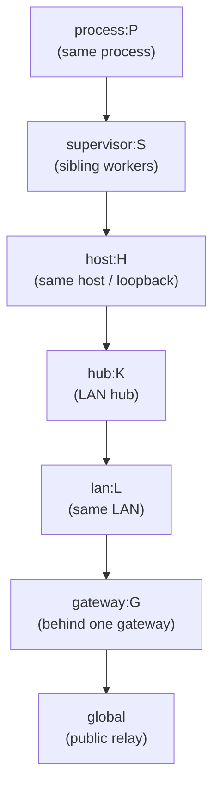

# Relative Routing for CapTP/OCapN Locator Hints

| | |
|---|---|
| **Created** | 2026-08-17 |
| **Author** | Kris Kowal (prompted) |
| **Status** | Not Started |

## What is the Problem Being Solved?

A locator names a peer by a durable identity (its Ed25519 public key) and
carries a plural set of ephemeral connection hints describing where that peer
can currently be reached (see [daemon-locator-reference](daemon-locator-reference.md)
and [ocapn-noise-network](ocapn-noise-network.md)). This is the concrete form
of *relative routing*: a session is established by choosing a route from a
candidate set, not by dialing one fixed absolute address.

Today the choosing half is missing. Nothing filters a peer's hints by whether
they are *reachable from here*, and nothing ranks them cheapest-first. Two
consequences:

1. **Correctness.** A hint like `ws://127.0.0.1:8920` means "me" only to a
   peer on the same host. To a peer on a different host, `127.0.0.1` names
   *that machine's own loopback*, a different computer. A domain-socket path
   or an internal `10.x` address is meaningless off the boundary it belongs
   to. Trying such a hint is not just wasteful, it can connect somewhere
   wrong.
2. **Cost.** Two daemons on the same LAN, or two workers under one supervisor,
   should reach each other directly (a LAN address, a domain socket) rather
   than hopping out through NAT to a public relay. Without a locality signal
   the connector cannot tell the cheap local route from the expensive global
   one.

The missing piece is a notion of **where the receiver is**, its own local
scope, that it can compare against each hint's claimed scope, so it can drop
hints that cannot work from here and prefer the closest route that can. This
design specifies that scope model, how a hint carries its reachability scope,
how the connector filters and ranks, and what a scope boundary does and does
not authorize.

## Cases in Scope

| # | Case | Shared scope tag | Route the tag selects |
|---|------|------------------|-----------------------|
| 1 | Same-LAN peers | `lan:<L>` | Direct LAN address, no NAT/relay hop |
| 2 | Workers under a shared supervisor | `supervisor:<S>` | Domain socket / named-pipe introduction, no network stack |
| 3 | Daemons on a host behind a shared gateway | `host:<H>` or `gateway:<G>` | Host-local socket / loopback, or gateway-local introduction |
| 4 | Loopback / same-host (or same-process) | `host:<H>` (`process:<P>`) | `127.0.0.1` route; in-process loopback when `process:<P>` also matches |
| 5 | Home hub on the local network | `lan:<L>` + `hub:<K>` | LAN hub relay, ranked above the public relay |
| 6 | A gateway's children, reached through the gateway | `gateway:<G>` (destination boundary the relay names, not a receiver-held tag) | Compound `via=<gateway-locator>` introduction hint, always kept |

The mechanism is deliberately open: `<kind>` is an extensible enumeration, so
new locality kinds (a container/mount namespace, a VPN overlay, a mesh subnet)
are added without a redesign.

## Design

### 1. Scope tags: expressing "where a hint is reachable from"

A **scope tag** is an opaque, comparable token `<kind>:<id>`:

- `<kind>` names a locality boundary: `process`, `host`, `supervisor`,
  `hub`, `lan`, `gateway` (extensible).
- `<id>` is an opaque identifier for a *specific* instance of that boundary:
  a per-process nonce, a host-scoped nonce, a supervisor-issued nonce, a
  gateway or hub public key. Comparison is exact string match on the whole
  `<kind>:<id>`.

The essential property: **the `<id>` is established by the boundary's own
authority and distributed out-of-band to the peers inside it, never derived
from or asserted by the locator.** The supervisor injects `<S>` into each
child it spawns; a host publishes `<H>` to co-located daemons through a
well-known host-local path; a gateway or hub is named by its public key.
Because a receiver only ever holds a scope tag it was independently given,
a tag it does not hold cannot be conjured by a peer that merely writes it into
a hint (see [Security](#security)).

### 2. The local scope: expressing "where I am"

Each vat/daemon maintains a **local scope**: the unordered set of scope tags it
currently sits inside. Only membership matters: ranking is not read from tag
order but from `costOf` (§ 4), so `makeLocalScope` need not order its tags.

```typescript
type ScopeTag = string;              // "<kind>:<id>", e.g. "supervisor:9f3c..."

type LocalScope = {
  tags: Set<ScopeTag>;               // every boundary this vat is inside (unordered)
  has: (tag: ScopeTag) => boolean;   // membership test used by selectRoutes

  // makeLocalScope(): LocalScope, discovers the tags for the boundaries this
  // vat sits inside (process/host/supervisor eagerly; lan/hub/gateway as they
  // are learned) from each boundary's own authority (see the source table
  // below). Order of discovery does not affect ranking.
};
```

Tags are discovered from the environment, each from the authority that owns
the boundary:

| Tag | Source |
|-----|--------|
| `process:<P>` | Random nonce minted at process start |
| `host:<H>` | Host-scoped nonce at a well-known host-local path, readable by all co-located daemons (same file, same `<H>`) |
| `supervisor:<S>` | Injected by the supervisor at spawn (spawn handshake / inherited descriptor / environment) |
| `lan:<L>` | Derived from a LAN-stable signal (default-gateway public key, an mDNS-advertised LAN nonce); least crisp, see [Open Questions](#open-questions) |
| `hub:<K>` / `gateway:<G>` | Public key of a hub/gateway the daemon uses or was introduced through |

The local scope is the receiver-side complement of the per-agent
`AgentConnectionHints` policy from
[daemon-agent-network-identity](daemon-agent-network-identity.md):
`AgentConnectionHints` governs what a persona *advertises and requires* for
inbound connections; the local scope governs how the connector *chooses* among
a peer's advertised hints for outbound. `preferredTransports` remains the
tiebreaker within an equal scope rank.

### 3. Encoding: a scope claim on each hint

A hint's reachability scope is a field on the hint, projected into the locator
URL. Canonically (in the Syrup hint struct that
[ocapn-noise-network](ocapn-noise-network.md) already carries as a
`Record<string,string>`), the hint gains one optional key:

```
scope = "<kind>:<id>"        // absent => globally reachable (e.g. a public relay)
```

In the URL projection, the scope is a fragment on the hint's transport-locator
before it is `encodeURIComponent`-encoded into its `@`-delimited path segment
(the existing hint encoding from
[daemon-locator-terminology](daemon-locator-terminology.md)):

```
endo://{peerKey}/{formulaAddress}@{hint1}@{hint2}?type={formulaType}

# a hint with a scope claim, before URL-encoding of the segment:
tcp+netstring+captp0://127.0.0.1:9000#scope=host:9f3c...
unix+captp0:///run/endo/9f3c/worker-3.sock#scope=supervisor:9f3c...
ws-relay+captp0://hub.local:8920#scope=lan:2b7a...
ws-relay+captp0://relay.example.com:443           # no fragment => global
```

The fragment binds each scope to exactly one hint (the pairing a parallel
query-parameter list could not preserve) and round-trips through the existing
`encodeURIComponent` path encoding untouched. A scope-blind (older) parser
that ignores the fragment still recovers a working transport-locator and
behaves exactly as it does today, no worse, and the Noise handshake still
gates the result (see [Security](#security)).

Case 6 (reach a peer only through its gateway) uses a **compound hint** whose
payload is the gateway's own locator plus the inner target, tagged
`scope=gateway:<G>`:

```
via+captp0://{gatewayLocator}?target={innerFormulaAddress}#scope=gateway:9f3c...
```

The `scope=gateway:<G>` on a `via=` hint is not an ordinary receiver-side
filter tag. It names the *destination* boundary the relay bridges into, not a
tag the connector is expected to hold, so `selectRoutes` does not match it
against the local scope (see § 4): the audience for case 6 is precisely a
connector *outside* `gateway:<G>`, which would drop the hint if the tag were
matched the ordinary way. Instead a `via=` hint is always kept and ranked at
`gateway` cost; its outer reachability is the embedded gateway locator, whose
own hints are filtered recursively by the same `selectRoutes`.

The gateway-mediated introduction protocol this hint invokes is deferred to a
follow-on design (see [Open Questions](#open-questions)); this document settles
only the shared scope/encoding/filtering model it rides on.

### 4. Filtering and ranking: choosing the route

Given a locator's hints and the connector's `LocalScope`, route selection is:

```
selectRoutes(hints, localScope):
  kept = []
  for h in hints:
    if h is a via= compound hint:               # gateway relay: the scope tag
      kept.push({ h, cost: costOf(GATEWAY) })   #   names the far boundary, not a
                                                #   receiver-held tag, so it is
                                                #   never dropped; the embedded
                                                #   gateway locator's own hints
                                                #   are filtered recursively
    elif h.scope is absent:                     # global route
      kept.push({ h, cost: GLOBAL })
    elif localScope.has(h.scope):               # shared boundary => reachable
      kept.push({ h, cost: costOf(h.scope) })
    else:
      drop h                                     # not reachable from here
  return kept sorted by cost ascending           # closest first, global last
```

`costOf` reads a configurable **locality order** keyed by `<kind>`, default:

```
process(0) < supervisor(1) < host(2) < hub(3) < lan(4) < gateway(5) < GLOBAL(6)
```

Kept hints are tried closest-first with fallback down the list; a global relay
hint, always kept, is the fallback tail that works from anywhere. Within one
cost rank, equally-local hints may be tried concurrently (a happy-eyeballs
race) with `preferredTransports` as the tiebreaker. Hints whose scope the
connector does not share are **dropped, never tried**: this is what keeps a
cross-host connector from dialing its own `127.0.0.1`.



A hint is reachable from the connector when the connector's local scope
contains the hint's tag. The diagram's nesting is the default *cost order*
(innermost cheapest), not a claim that the connector sits at a single ring:
membership is tested per tag independently (`localScope.has(h.scope)`), so a
connector may hold `gateway:<G>` without `host:<H>` (case 3), and each hint is
kept or dropped on its own tag. A global hint and a `via=` gateway-relay hint
are always kept regardless of local scope.

### Worked example (case 2)

Worker A and worker B are spawned by supervisor S, which injected
`supervisor:9f3c` into both. A's locator for a formula advertises three hints:
`unix+captp0:///run/endo/9f3c/A.sock#scope=supervisor:9f3c`,
`tcp+captp0://10.0.0.4:9000#scope=lan:2b7a`, and a global
`ws-relay+captp0://relay.example.com:443`. B's local scope holds
`{process:..., supervisor:9f3c, host:..., lan:2b7a}`. `selectRoutes` keeps all
three (B shares `supervisor:9f3c` and `lan:2b7a`, and the relay is global),
ranks the domain socket first (supervisor, cost 1), the LAN address second
(lan, cost 4), the relay last, and B connects over the domain socket without
touching the network stack. A worker on a different host, lacking
`supervisor:9f3c` and `lan:2b7a`, drops the first two and reaches A through
the relay.

## Security

**A scope boundary filters reachability; it does not authorize.** Authority is
always the peer keypair, established by the OCapN-Noise IK handshake. Being
able to reach an address never confers a capability: reaching the address only
opens a channel on which the handshake must still succeed against the intended
public key. A scope match is evidence of co-location, never of permission.

**A narrow-scope hint confers no reach by traveling.** Because filtering is
receiver-side and the handshake still gates, a `supervisor:`- or `lan:`-scoped
hint included in a locator that travels beyond that boundary grants an outsider
nothing: the outsider lacks the matching tag, so it drops the hint; even a
scope-blind peer that tries the raw address either cannot route to it or lands
on its own unrelated local endpoint, where the handshake fails against the
absent peer.

**What a narrow-scope hint *does* leak is information**: an internal socket
path, an internal IP, the existence of a supervisor. Two mitigations:

- **Produce for the audience's scope.** Locators are already reconstructed
  fresh from the durable key plus current hints at share time
  ([daemon-locator-terminology](daemon-locator-terminology.md)). A producer
  that knows a locator is bound for a peer outside a boundary SHOULD omit that
  boundary's hints. Production-side scope filtering is the mirror of the
  receiver-side filtering above.
- **Keep scope ids opaque.** A `<kind>:<id>` should be a nonce or public key,
  not a literal internal address, so the tag itself reveals no topology.

**Scope tags are not forgeable into reach.** A peer can *write* any tag into a
hint, but the tag only matches at a receiver that *independently holds* the
same `<id>` in its own local scope, obtained from the boundary's authority
(the supervisor, the host, the gateway), not from the locator. A tag the
receiver was never given simply fails to match and the hint is dropped. This
is why §1 requires scope ids to be distributed out-of-band by the boundary
owner and never derived from a locator.

## Alternatives Considered

- **Producer-fixed priority numbers (ICE candidate priority / DNS SRV
  weight).** A numeric metric the *producer* stamps on each hint cannot
  express "cheap from *here*," because the producer does not know the
  receiver's location. Relative routing is receiver-relative by nature. The
  try-order-with-fallback mechanics are borrowed; the fixed priority is not.
- **Probe every hint and race, with no scope model (pure happy-eyeballs).**
  Racing is a good *tiebreaker within* a scope rank, but as the sole mechanism
  it probes hints that are meaningless or wrong from the connector (a
  cross-host connector dialing `127.0.0.1`), wasting connects and risking a
  wrong-endpoint attempt. Scope filtering first, race within a rank second.
- **A parallel scope list in query parameters** instead of a per-hint
  fragment. Rejected: a scope must bind to exactly one hint; a parallel list
  breaks the pairing and the "hints live on the path" grouping.
- **Full hop-by-hop source routing (the erights `donorPath :String[]`
  literally being a sequence).** More than these cases need. Scope tags plus a
  single compound `via=<gateway>` hint cover the introduced-through-gateway
  case without mandating multi-hop source routing; a genuine multi-relay path
  is left to a follow-on if a case demands it.

## Dependencies

| Design | Relationship |
|--------|--------------|
| [daemon-locator-reference](daemon-locator-reference.md) | Extends the locator hint format this design annotates with scope |
| [daemon-locator-terminology](daemon-locator-terminology.md) | The `@`-delimited hint path encoding the scope fragment rides on |
| [ocapn-noise-network](ocapn-noise-network.md) | The transport-plugin `connect(hints)` surface that consumes selected routes; hints are its `Record<string,string>` struct |
| [daemon-agent-network-identity](daemon-agent-network-identity.md) | `AgentConnectionHints` is the inbound-policy complement to this outbound scope model |
| [ocapn-network-transport-separation](ocapn-network-transport-separation.md) | The network/transport layering `selectRoutes` slots into |

## Phased Implementation

1. **Scope tag + local scope.** `ScopeTag`, `LocalScope`, `makeLocalScope`
   with `process`/`host`/`supervisor` discovery. Domain-socket and loopback
   cases (2, 4) are reachable with these three tag kinds alone.
2. **Hint scope encoding.** Add the `scope` field to the hint struct and its
   `#scope=` URL projection; make parse scope-aware and scope-blind-tolerant.
3. **`selectRoutes` filter/rank.** The configurable locality order, drop
   behavior, and same-rank race, wired into the network's transport selection.
4. **LAN and gateway kinds.** `lan:` discovery and the `hub:` route (cases 1,
   5); the compound `via=<gateway>` hint's introduction protocol (case 6) as
   its own follow-on design.

## Open Questions

- What makes a crisp, low-forgery `lan:<L>` tag? Default-gateway public key vs
  an mDNS-advertised LAN nonce vs a subnet fingerprint each trade off
  stability against forgeability. This likely needs its own follow-on design
  ("LAN scope identity"); the socket/loopback/supervisor cases do not block on
  it.
- What is the gateway-mediated introduction protocol behind the compound
  `via=<gateway>` hint (case 6): how the gateway authenticates the connector,
  applies policy, and bridges to its child? This is the one case that needs
  its own protocol document once the shared scope model here is accepted; a
  follow-on design "gateway-relayed introduction" is to be filed.
- Interaction with third-party handoffs (the CapTP `desc:handoff-give` /
  `desc:handoff-receive` descriptors, OCapN CapTP Specification,
  "Third-party handoffs"): when the Receiver opens its own session to the
  Exporter it applies `selectRoutes` to the Exporter's hints, but are the
  Gifter's scope tags meaningful to the Receiver? They match only where the
  Receiver independently shares them, else it falls to a global route. Worth a
  dedicated note, possibly a follow-on.
- Exact mechanics of `host:<H>` and `supervisor:<S>` id distribution, the
  well-known host-local path and the spawn-handshake field, are an
  implementation follow-on, not settled here.
- Default policy for scope-blind peers: should a producer omit narrow-scope
  hints entirely from a locator bound for a peer of unknown scope-awareness,
  or tolerate the occasional mis-try? Leaning toward omit-when-out-of-scope
  per [Security](#security).

## Prompt

> Design relative routing for CapTP/OCapN locator hints. Today a locator
> carries connection hints, but nothing filters them by whether they are
> reachable from here. A vat/daemon needs some notion of where it is, its own
> local context/scope, so it can filter a peer's hints down to the ones that
> are locally applicable, and prefer the cheapest/closest route that actually
> works over a hop through a public relay. Cover at least: same-LAN peers,
> workers under a shared supervisor (domain socket / named pipe), daemons on a
> host behind a shared gateway, loopback / same-host recognition, a home hub on
> the local network, and routing to a remote gateway's children through the
> gateway. Specify how a vat expresses where it is, how routes are encoded in
> connection hints (extending Endo's `@hint`/`at=` encoding), how hints are
> filtered/ranked, and the security implications of a scope boundary. Where a
> case needs its own follow-on design once the shared scope/filtering model
> settles, say so in Open Questions.
