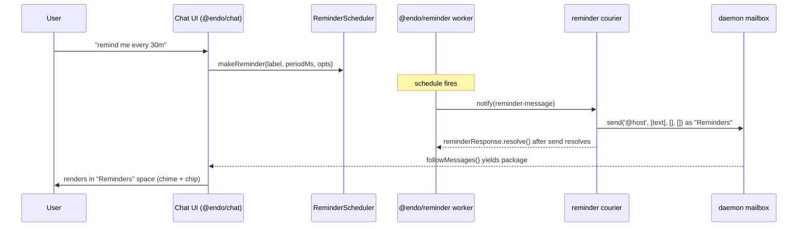
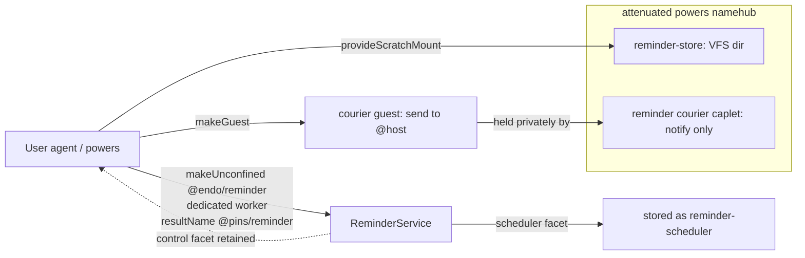

# Integrating `@endo/reminder` into Chat

| | |
|---|---|
| **Created** | 2026-08-06 |
| **Author** | Kris Kowal (prompted) |
| **Status** | Not Started |
| **Parent** | [endo-reminder](endo-reminder.md) |

## What is the Problem Being Solved?

Maintainer review of the `@endo/reminder` build
([PR #721](https://github.com/endojs/endo-but-for-bots/pull/721), 2026-07-15,
[review 4701251219](https://github.com/endojs/endo-but-for-bots/pull/721#pullrequestreview-4701251219))
asked for plans to follow up with integration of the plugin into **Chat**,
**Familiar**, and **minion.town**. This is the Chat plan; the other two are
sibling designs.

`@endo/reminder` ([design](endo-reminder.md), now **merged** to `llm`) is an
unconfined message-scheduler plugin. It fires a message on a start-to-start
schedule to one recipient capability, resolved by name, and persists its
reminders on a virtual-file-system directory so they survive a daemon restart.
Chat has no scheduling primitive today; a user cannot ask Chat to remind them of
anything. This design works out what a reminder *means* in Chat — who schedules
it, who receives the fired message, how it surfaces, and how it survives a
restart — and how the plugin's `notify`-shaped delivery meets Chat's mailbox.

## Which "Chat"

**Chat is `@endo/chat`** — the web-based chat application shell (a Vite app; all
source is flat in `packages/chat/*.js`, there is no `src/`). Its default
message-list view is the confined `@endo/space-chat` package (`InboxRoot`), a
*view of* Chat, not a separate target. Two neighbours are **not** this target:

- `@endo/goblin-chat` is a standalone OCapN/Goblins chat-protocol library plus an
  Ink TUI, interoperable with Spritely's `goblin-chat`. It has its own state
  store and does **not** touch the Endo daemon mailbox. Out of scope.
- `chat-network-view` does not exist as a package (the review's parenthetical
  named it, but there is no such directory); the network/graph view is
  `chat/outliner-component.js` + `@endo/space-inventory-graph`, internal to
  `@endo/chat`.

So "integrate into Chat" = integrate into `@endo/chat` and, where a rendering
change is needed, `@endo/space-chat`.

## The integration seam

Chat is a thin CapTP-over-WebSocket front-end. The powers object it holds is an
`EndoHost`/`EndoGuest` — the user's **agent** — and *all* message state lives in
the daemon mailbox (`@endo/daemon/src/mail.js`). Sending is
`E(powers).send(to, strings, edgeNames, petNames)`, which builds a `package`
envelope and delivers it; every inbound message flows through `deliver` onto the
`messagesTopic`; the UI subscribes with `followMessages()` and `InboxRoot`
renders each new message (with a chime and a sender chip). **Anything that
reaches `followMessages` surfaces in the UI with no front-end change.**

The reminder plugin, however, does not speak the mailbox. It delivers each
message by `E(recipient).notify(message)` on a subscriber capability resolved as
`reminder-recipient` (design Phase 2 baseline). **There is no `notify` method
anywhere in the agent/mailbox interface.** The only inbound hook is a sender
calling the recipient's `receive(envelope, fromId)`, and a `package` message
carries its capabilities *by stored `FormulaIdentifier`*, not as live exos.

The bridge is one small caplet — the **reminder courier** — bound to
`reminder-recipient`. It exposes `notify(message)`, and on each firing formats
the message and injects it into the user's inbox as an ordinary `package`
message from a distinct "Reminders" party. This is exactly the
[proactive-messages](endoclaw-proactive-messages.md) pattern, which looks up the
host and calls `E(host).send('@host', summary)`
([endoclaw-proactive-messages.md:31](endoclaw-proactive-messages.md)) — i.e. it
delivers to **`@host`**, the user's own handle, never `@self`. `@self` is the
*sender's* own handle (for a guest, `packages/daemon/src/guest.js:96`; for a
host, `host.js:484`), so a courier that sends to `@self` deposits every reminder
in its own mailbox and the user never sees it. The courier must send to `@host`
(the user's handle in the courier's namespace). The scheduling half is now the
external `@endo/reminder` plugin rather than an in-process `Timer` callback, so
the courier is the piece that holds the send authority the plugin deliberately
does not.

The `send` guard takes **four required arguments** —
`(recipient, strings, edgeNames, petNamesOrPaths)`, with only
`replyToMessageNumber` optional (`packages/daemon/src/interfaces.js:203-210`) —
so the courier always calls `send('@host', [text], [], [])`.

Because `@endo/space-chat` is a *recipient-filtered single-sender* inbox view,
the distinct "Reminders" sender (the courier guest, a different handle from the
user) *can* have its own single-sender space/conversation. But a space is **not**
derived automatically from the arrival of a new sender: spaces are explicit
configs created only through `addSpace` / the modal and persisted under the
`spaces` pet-store directory (`packages/chat/spaces-gutter.js:410`), and
`InboxRoot` takes an explicit `conversationId` / `conversationPetName`
(`packages/space-chat/src/inbox.js:1386`). So `setup-reminder.js` (§ What
changes) must **provision the "Reminders" space config**; until it does, reminder
messages surface only in the unfiltered `home` view (`chat/chat.js`). The one
thing that would silently *fail* is self-to-self delivery — a message whose
sender is the user's own handle is dropped from every named conversation view
(`inbox.js`) — which is exactly why the courier must be a **distinct** party
sending to `@host`, not the user reminding itself.

## What a reminder means in Chat

- **Who schedules:** the Chat user, through a scheduling affordance that calls
  `E(scheduler).makeReminder(label, periodMs, opts)` on the `ReminderScheduler`
  facet. `label` becomes the reminder text; `periodMs` the cadence;
  `firstDelayMs` a lead time.
- **Who receives:** the same user — the first cut is **self-reminders**. The
  courier is a distinct party bound to send to `@host` (the user's own handle in
  the courier's namespace), so a reminder is a note the user schedules for their
  future self, arriving from the "Reminders" party into a dedicated "Reminders"
  conversation. (Delivery to `@self` would land in the courier's *own* mailbox,
  never the user's — see § The integration seam.) Reminding *another* party is a
  later extension (§ Open questions): bind the courier to `send` to that peer,
  which is proactive messaging to others and carries its own consent/policy
  questions.
- **How it survives a restart:** the reminder *service* is pinned in `@pins`, its
  VFS store persists each reminder and the config, and on the next boot
  `revivePins()` re-incarnates the worker, whose `make()` runs recovery
  (coalesce/skip missed messages per `catchUpPolicy`) and re-arms the timers. The
  courier and the store must be re-resolvable *by name* so `make()` re-obtains
  them; the browser re-derives all message state by re-subscribing to
  `followMessages`. In-flight one-shot responses are in-memory and do **not**
  survive a restart — recovery re-delivers instead.

## Provisioning

The service is provisioned once, per the plugin's `makeUnconfined` recipe, and
the `ReminderScheduler` facet is stored under a pet name the UI can `lookup`.
`makeUnconfined` is host-side (`E(host).makeUnconfined(worker, '@endo/reminder',
...)` over CapTP; the daemon's Node worker resolves the specifier), so the browser
can drive it, but the running UI does not call `makeUnconfined` today — only the
`setup-lal` / `setup-llm-provider` scripts do (`endo run --UNCONFINED ... --powers
@agent`). The plan follows that precedent with a **`setup-reminder.js`** script
(§ What changes), leaving an in-UI "enable reminders" affordance as a later
convenience. Provision the service in a **dedicated named worker** (an explicit
`workerName`), not the shared `@node` worker: `makeUnconfined` grants the plugin
ambient Node authority in its worker, and defaulting `workerName` (`host.js`)
would co-locate the reminder plugin's ambient authority with every other
unconfined caplet (`setup-lal`'s provider among them) in one process.

The powers namehub the plugin resolves must carry exactly two names:

- **`reminder-store`** — a writable `@endo/platform/fs/extended` directory. The
  agent mints one with `E(host).provideScratchMount('reminder-store')` (preferred
  — a top-level `provideMount(mountPath, 'reminder-store')` is resolvable back to
  a host path by any host holder, so it leaks more authority). This is the
  "daemon mount" backing the plugin README anticipates. **Contract note (resolves
  open question 3):** the store does not use the flat `EndoMount.list(): string[]`
  shape — it calls `E(directory).list()` to get a **cursor**, `toArray()`s it, and
  destructures `{ name, kind }` entries (`packages/reminder/src/store.js:105-110`),
  and `makeDirectory(name, {})` with two arguments (`store.js:45`). That is the
  `@endo/platform/fs/extended` `Directory` cursor contract, which is what
  `provideScratchMount` must yield; verify the mount handed by a live daemon
  satisfies it before building. The store also depends on `write` / `remove` /
  atomic within-directory `move`. This seam is unchecked at the type level today
  because `ReminderStoreDirectory` is aliased to `any`
  (`packages/reminder/src/types.d.ts:82`); tightening that alias to the extended-fs
  `Directory` type is named integration work.
- **`reminder-recipient`** — the reminder courier caplet (below), a durable
  formula reachable by that name so revival re-resolves it.

Initial `maxActive` / `minPeriodMs` arrive via `env`; thereafter the store is
authoritative. The service is pinned with `resultName: ['@pins', 'reminder']`.
The integration retains the `ReminderControl` facet (pause / resume / revoke /
limits); the UI holds only `ReminderScheduler`. For that split to be real, the
`reminder-store` mount must be reachable **only** through the plugin's powers
namehub — not also handed to the UI-side agent. The store, not `env`, is
authoritative for the limits, and `readConfig` (`packages/reminder/src/store.js:87`)
is deliberately **not** corruption-tolerant (unlike the entries path); a UI agent
that could write the store's `config.json` directly would bypass `ReminderControl`
and, on one out-of-range write, make the pinned service throw at revival —
silently killing *all* reminders (`scheduler.js:129-146`).

## What has to change on each side

**Reminder side (`@endo/reminder`): nothing** for the baseline. The plugin's
Phase 2/3 surface — `notify`-to-recipient delivery, VFS store, `@pins` revival —
is exactly what this uses, unchanged. The one capability the baseline cannot
carry (an *actionable* response inside the delivered message) is the plugin's own
gated Phase 4 (below), not a change this plan requests.

**Mailbox retention (Chat-side follow-up).** Every firing persists a `package`
message that the daemon mailbox never prunes, and the default cadence band
(`minPeriodMs = 30_000`) permits a high message rate that is replayed through
`followMessages` on every reconnect. A recurring reminder therefore grows the
mailbox without bound. The baseline can ship without a retention story, but the
"Reminders" conversation needs a pruning/coalescing policy (or a bounded
retention window) before recurring reminders are used in earnest; name it as a
follow-up rather than leaving it unstated.

**Deployment side (the daemon Chat connects to):** `@endo/reminder` must be
resolvable by the daemon's Node worker for `makeUnconfined('@endo/reminder')`. It
is currently a dependency of nothing. Whoever owns the deployment (the Familiar
app or the online Gateway — the designated future owners of reminder retention)
must add it to the daemon's resolution root. This is the load-bearing shared
dependency with the sibling plans.

**Chat side (`@endo/chat`):**

1. **The reminder courier caplet** — the one genuinely new object. It is a
   hardened exo (`makeExo` + an `M.interface` guard exposing exactly
   `notify(message)`, validating the `reminder-message` shape rather than trusting
   the sender's record). It **closes over** a guest privately; that held guest —
   never itself reachable from the powers namehub — is the trust boundary. This
   distinction is load-bearing: a bare guest is **not** "send-to-self only".
   `makeGuest` yields the full `GuestInterface` — the whole name-hub read *and
   mutation* surface, directory file I/O, the entire mailbox (`request`, `adopt`,
   `dismissAll`, `listMessages`/`followMessages`), and `send` to *any* name
   (`packages/daemon/src/interfaces.js:160-260`) — so a guest handed out directly
   could read and erase the user's whole inbox. The attenuation is therefore
   *structural*: the courier exposes only `notify`, and the guest's broad
   authority is denied by never being exported, not by convention.

   On each `notify`, the courier formats the reminder (label, cadence, and — when
   `missedMessages > 0` — the coalesced `annotation`; note `annotation` is present
   on *every* message and `annotation: 'timestamps'` yields a list, not a count,
   so the formatter must handle both shapes) into markdown and delivers it via the
   held guest's `send('@host', [text], [], [])`. **The label must be delivered as
   one opaque `strings` element with empty `edgeNames`/`petNames`** — it must *not*
   be run back through `message-parse.js`. Chat's `parseMessage`
   (`packages/chat/message-parse.js:3`) lifts every `@name` out of message text
   into `petNames`, and `mail.js` then throws `Unknown pet name` for any that does
   not resolve — so an ordinary label like `ping @alice about lunch` would
   schedule fine and then **fail at every firing** (visible only as plugin
   backoff). Passing the label opaquely also closes the authority leg where a
   resolvable `@name` in the courier's namespace would attach a live capability to
   the outgoing envelope. The markdown/annotation the courier composes must be
   rendered as plain (escaped) text by `InboxRoot`, not as trusted "Reminders"
   markup.

   Only after the `send` promise resolves does the courier resolve the one-shot
   response (auto-ack; a proactive reminder needs no reply). **On a `send`
   rejection the courier calls `reminderResponse.reschedule()`**, so a failed
   delivery is retried by the plugin's backoff rather than silently counted as
   delivered (a broad `try`/`catch` that auto-acks anyway would drop the reminder
   and suppress the plugin's retry). Do not resolve before the send is confirmed.
2. **`setup-reminder.js`** — an `endo run --UNCONFINED ... --powers @agent` script
   that mints the store mount, makes the courier guest and mutual pet names,
   composes the `reminder-store` + `reminder-recipient` powers namehub,
   `makeUnconfined`s the service pinned into `@pins`, and stores the
   `ReminderScheduler` facet as `reminder-scheduler`. Mirrors `setup-lal.js`.
3. **A scheduling affordance** — minimal first cut: a chat-bar command
   (`/remind <period> <label>`) that looks up `reminder-scheduler` and calls
   `makeReminder`. The command is parsed by its **own** parser (or the existing
   `command-registry.js` slash-command surface — `packages/spaces-util/src/command-registry.js`),
   **not** by `message-parse.js`: the `<label>` remainder is taken verbatim as the
   reminder text (see the opaque-label requirement above), so a label containing
   `@name` is preserved rather than lifted into pet-name references. The affordance
   must (a) parse `<period>` and reject anything outside the plugin's cadence band
   — **1 s (`ABSOLUTE_MIN_PERIOD_MS`) to 24 h (`MAX_PERIOD_MS = 86_400_000`)**,
   both `periodMs` and `firstDelayMs` capped there (`scheduler.js:47`; the 24 h cap
   is deliberate, tied to the `setTimeout` ~24.8-day ceiling, so it will not simply
   be relaxed) — surfacing an out-of-band or unparseable duration as chat-bar
   feedback, since `assertValidPeriod` (`scheduler.js`) throws a `TypeError` on a
   non-numeric or out-of-range value and an unhandled rejection would otherwise be
   silent. Absolute cadences ("tomorrow at 9am", weekly) are **not** expressible
   within this band and are out of scope for the first cut. A richer form UI is a
   follow-up. **Delivery needs no UI change** — a reminder that lands as a
   `package` message renders through the existing `InboxRoot` path automatically.

## The interactive-response gap (dependency on #721 shape)

Each fired message carries a one-shot `reminderResponse` exo (`resolve()` /
`reschedule()`) — a possible hook for "snooze this reminder", but a constrained
one. **`reschedule()` is the delivery-*failure* retry path, not a user snooze:**
it increments `consecutiveFailures` and re-arms via a jittered exponential backoff
whose ceiling is `messageTimeoutMs` (`packages/reminder/src/scheduler.js`;
`interfaces.js:5-15` documents it as retry). Recruiting it as snooze hands the
user a backoff delay they did not choose and poisons the failure streak. The
response is also **auto-resolved at `messageTimeoutMs`** (default `periodMs / 2`),
after which *every* later call — `resolve` or `reschedule` — is silently inert
(`interfaces.js:9-11`); and `resolve()` is what arms the next period, so a courier
that *retains* the response un-resolved to "hold it open for snooze" delays the
next firing and then degrades to a silent auto-ack timeout (emitting a
`console.warn`). Any snooze design must state all three constraints. How far a
snooze reaches into Chat is bounded by what #721 built:

- **Auto-ack (baseline, available now):** the courier resolves on delivery (after
  `send` confirms). Reminders fire and appear; no snooze. Ships on
  `@endo/reminder` as merged.
- **Live snooze (available now, Chat-side only, bounded):** a snooze that re-arms
  a reminder sooner cannot use `reschedule()` (backoff-only) and cannot outlive
  `messageTimeoutMs`; within that window the courier can retain the live response
  and re-drive the schedule. If retained, it must be keyed by
  **`(reminderId, messageNumber)`**, not `reminderId` alone — a redelivery re-uses
  the same `reminderId` under a fresh `messageNumber` (carried on the message), so
  a `reminderId`-only map either clobbers the retained response (which then never
  resolves, stalling the schedule and firing the timeout) or grows unbounded.
  Authority to snooze must be a **capability, not a bearer token**: `reminderId`
  is `makeRandomHexId` — `Math.random()`, not a CSPRNG (`index.js:61-69`) — and is
  published in the mailbox, so `E(courier).snooze(id)` would make "knows a
  guessable string" sufficient. Pass a per-message ack/snooze *facet* to the UI
  instead. This also means splitting the courier into a **recipient facet**
  (`notify`, held by the plugin as `reminder-recipient`) and a **control facet**
  (snooze/ack, held by the UI): one combined exo would let the plugin snooze and,
  worse, let the UI `notify` — i.e. forge arbitrary "Reminders" messages into the
  inbox. Works while the daemon is up; a response is lost on restart (recovery
  re-fires, so no reminder is dropped). Needs no #721 change — the response never
  has to be stored — but it adds the control facet and a small UI affordance.
- **Native in-message action (blocked on #721 Phase 4):** surfacing the response
  as a first-class message attachment, so the inbox's existing reply/resolve
  affordances drive snooze durably, requires the response to be a *storable*
  value (`send` + `storeValue`). That is precisely the reminder **Phase 4**
  mailbox-delivery upgrade, gated on SturdyRef modelling and **not built** on
  #721. Do not plan the durable-actionable path against the current API; it may
  not survive that review.

**Recommendation:** ship auto-ack first, add live snooze as a fast follow, and
defer native in-message actions until reminder Phase 4 lands. None of the three
blocks the others.

## Test strategy

- **Courier unit test:** a `notify(reminder-message)` produces one mailbox
  `package` delivery observable through a mailbox stub / `followMessages`, sent to
  `@host`, with the expected text as one opaque `strings` element (empty
  `edgeNames`/`petNames`), "Reminders" sender, and `annotation` rendering for both
  the `count` and `timestamps` shapes; it resolves the response only after `send`
  resolves, and calls `reschedule()` when the stub `send` rejects.
- **Opaque-label test:** a label containing `@name` round-trips verbatim (is
  *not* lifted into `petNames`) and delivery does not throw `Unknown pet name`.
- **Clock seam:** the plugin's injectable `setTimeout` / `now` seam is on
  `makeReminderService`'s powers, but the unconfined entry point (`make()`,
  `index.js:111-121`) forwards only `store` / `makeId` / `onMessage` / limits /
  `paused` — it does **not** forward a clock. So the timing test must drive
  `makeReminderService` directly (or add an `env`/powers clock seam); an
  end-to-end test through `makeUnconfined` runs on the real clock.
- **End-to-end against a daemon:** provision the service with
  `reminder-recipient` = courier bound to a test agent's inbox, schedule a
  short reminder, and assert a `package` message appears in `followMessages`.
- **Revival:** pin, schedule, simulate a daemon restart, assert recovery
  re-fires per `catchUpPolicy` (`coalesce` produces one catch-up with the right
  `missedMessages`; `skip` drops stale). Pin the revival assertion on the
  injected `now` seam rather than elapsed sleeping — `missedMessages` derives from
  wall-clock `Date.now()` (`scheduler.js:99`), so a real clock is nondeterministic
  across the simulated downtime. Reuses the plugin's own recovery tests as the
  lower layer.
- **Space provisioning:** assert `setup-reminder.js` creates the "Reminders"
  space config and that the courier's messages then land in that single-sender
  space view (`@endo/space-chat`), not merely the `home` view.
- **Playwright e2e** for the `/remind` affordance once it exists, including an
  out-of-band duration (< 1 s or > 24 h) surfacing as chat-bar feedback.

The integration tests target only the courier + provisioning seam, reusing the
plugin's own unit suite for the scheduler core.

## Ordering

Against **#721:** #721 is **merged**, so this plan no longer waits on it landing
(the review that spawned this plan predates the merge). Only the *native
in-message action* leg waits — on reminder Phase 4, not on #721.

Against the **sibling plans (Familiar, minion.town):** Chat is a thin
front-end; it does **not** own the load-bearing substrate. Provisioning,
`@pins` retention, and the VFS store mount belong to whichever integration owns
the deployment — the design names the **Familiar app** and the **online
Gateway** as the future owners of automatic reminder retention. So:

1. The **store-mount + provisioning + pin substrate** should land in the
   Familiar/Gateway layer (the sibling plans), or jointly, first. Until then
   Chat's `setup-reminder.js` carries a self-contained version for a
   direct-to-daemon Chat.
2. **Chat's courier + `/remind` affordance** can be built in parallel against
   that substrate; most of the "surfacing" work is free via `followMessages`.
3. **Live snooze**, then **native in-message actions** (after Phase 4), are
   independent follow-ups.

The shared blocker across all three is the **deployment-resolvable
`@endo/reminder`** dependency; that should be filed as a single cross-cutting
task (**to be filed**) rather than duplicated per plan.

## Dependencies

| Design / PR | Relationship |
|---|---|
| [endo-reminder](endo-reminder.md) / [#721](https://github.com/endojs/endo-but-for-bots/pull/721) | The plugin being integrated (merged). Phase 4 (`send`+`storeValue`) gates the native-action leg. |
| [endoclaw-proactive-messages](endoclaw-proactive-messages.md) | The delivery pattern the courier realizes (send-to-inbox on a schedule). |
| [familiar-daemon-bundling](familiar-daemon-bundling.md), [gateway-package](gateway-package.md) | Candidate owners of provisioning + `@pins` retention + the store mount; the sibling integration plans. |
| [platform-fs](platform-fs.md), [fs-interface-reconciliation](fs-interface-reconciliation.md) | The writable-tree contract the `reminder-store` mount must satisfy. |

## Open questions

- Which layer owns provisioning and `@pins` retention for a Chat deployment — a
  self-contained `setup-reminder.js` in `@endo/chat`, or the Familiar/Gateway
  integration that Chat merely consumes? The sibling plans should settle this;
  this plan assumes Chat carries a self-contained fallback.
- Should reminders be schedulable *for another party*, not just self-reminders?
  That turns the courier into a proactive-messaging-to-others surface with
  consent implications; deferred here as a self-reminders-first cut.
- **(Resolved in § Provisioning.)** The reminder store does *not* consume the
  flat `EndoMount.list(): string[]` shape; it consumes the
  `@endo/platform/fs/extended` `Directory` **cursor** contract — `list()` → cursor
  → `toArray()` → `{ name, kind }` entries, and `makeDirectory(name, {})`
  (`packages/reminder/src/store.js:45,105-110`) — plus `write` / `remove` / atomic
  within-directory `move`. So `provideScratchMount` must yield an extended-fs
  `Directory`, and the seam is unchecked today only because `ReminderStoreDirectory`
  is aliased to `any` (`packages/reminder/src/types.d.ts:82`). Remaining work is
  not a question but a task: verify the live daemon's `provideScratchMount` mount
  against that contract end-to-end and tighten the alias to the extended-fs
  `Directory` type.
- What is the minimum viable scheduling affordance — a `/remind` chat-bar command
  (registered in `command-registry.js`, with its `<label>` remainder taken
  verbatim — *not* run through `message-parse.js`; see § What changes), or a
  dedicated form (the `counter-proposal-form.js` / `add-space-modal.js` pattern)?
  This plan assumes the command first, the form as a follow-up.
