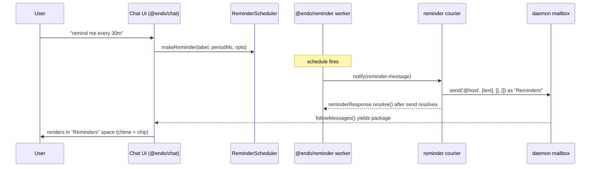

# Integrating `@endo/reminder` into Chat

| | |
|---|---|
| **Created** | 2026-08-06 |
| **Author** | Kris Kowal (prompted) |
| **Status** | Not Started |
| **Parent** | [endo-reminder](endo-reminder.md) |

## What is the Problem Being Solved?

Maintainer review of the `@endo/reminder` build
([PR #721](https://github.com/endojs/endo-but-for-bots/pull/721), 2026-07-15,
[review 4701251219](https://github.com/endojs/endo-but-for-bots/pull/721#pullrequestreview-4701251219))
asked for plans to follow up with integration of the plugin into **Chat**,
**Familiar**, and **minion.town**. This is the Chat plan; the Familiar and
minion.town plans are named here as sibling designs but are **not yet written**
(there is no `designs/reminder-integration-familiar.md` or
`designs/reminder-integration-minion-town.md` in the tree). Every decision this
plan defers to them (§ Ordering, § Open questions) is therefore **currently
unowned** until they are filed; where the chain would otherwise stall, this plan
carries a self-contained Chat fallback and says so at each deferral.

`@endo/reminder` ([design](endo-reminder.md), now **merged** to `llm`) is an
unconfined message-scheduler plugin. It fires a message on a start-to-start
schedule to one recipient capability, resolved by name, and persists its
reminders on a virtual-file-system directory so they survive a daemon restart.
Chat has no scheduling primitive today; a user cannot ask Chat to remind them of
anything. This design works out what a reminder *means* in Chat — who schedules
it, who receives the fired message, how it surfaces, and how it survives a
restart — and how the plugin's `notify`-shaped delivery meets Chat's mailbox.

## Which "Chat"

**Chat is `@endo/chat`** — the web-based chat application shell (a Vite app; all
source is flat in `packages/chat/*.js`, there is no `src/`). Its default
message-list view is the confined `@endo/space-chat` package (`InboxRoot`), a
*view of* Chat, not a separate target. Two neighbors are **not** this target:

- `@endo/goblin-chat` is a standalone OCapN/Goblins chat-protocol library plus an
  Ink TUI, interoperable with Spritely's `goblin-chat`. It has its own state
  store and does **not** touch the Endo daemon mailbox. Out of scope.
- `chat-network-view` does not exist as a package (the review's parenthetical
  named it, but there is no such directory); the network/graph view is
  `chat/outliner-component.js` + `@endo/space-inventory-graph`, internal to
  `@endo/chat`.

So "integrate into Chat" = integrate into `@endo/chat` and, where a rendering
change is needed, `@endo/space-chat`.

## The integration seam

Chat is a thin CapTP-over-WebSocket front-end. The powers object it holds is an
`EndoHost`/`EndoGuest` — the user's **agent** — and *all* message state lives in
the daemon mailbox (`@endo/daemon/src/mail.js`). Sending is
`E(powers).send(to, strings, edgeNames, petNames)`, which builds a `package`
envelope and delivers it; every inbound message flows through `deliver` onto the
`messagesTopic`; the UI subscribes with `followMessages()` and `InboxRoot`
renders each new message (with a chime and a sender chip). **Anything that
reaches `followMessages` surfaces in the UI with no front-end change.**

The reminder plugin, however, does not speak the mailbox. It delivers each
message by `E(recipient).notify(message)` on a subscriber capability resolved as
`reminder-recipient` (design Phase 2 baseline). **There is no `notify` method
anywhere in the agent/mailbox interface.** The only inbound hook is a sender
calling the recipient's `receive(envelope, fromId)`, and a `package` message
carries its capabilities *by stored `FormulaIdentifier`*, not as live exos.

The bridge is one small caplet — the **reminder courier** — bound to
`reminder-recipient`. It exposes `notify(message)`, and on each firing formats
the message and injects it into the user's inbox as an ordinary `package`
message from a distinct "Reminders" party. This is exactly the
[proactive-messages](endoclaw-proactive-messages.md) pattern, which looks up the
host and calls `E(host).send('@host', summary)`
(`endoclaw-proactive-messages.md:31`); that is, it
delivers to **`@host`**, the user's own handle, never `@self`. `@self` is the
*sender's* own handle (for a guest, `packages/daemon/src/guest.js:96`; for a
host, `host.js:484`), so a courier that sends to `@self` deposits every reminder
in its own mailbox and the user never sees it. The courier must send to `@host`
(the user's handle in the courier's namespace). The scheduling half is now the
external `@endo/reminder` plugin rather than an in-process `Timer` callback, so
the courier is the piece that holds the send authority the plugin deliberately
does not.

The `send` guard takes **four required arguments** —
`(recipient, strings, edgeNames, petNamesOrPaths)`, with only
`replyToMessageNumber` optional (`packages/daemon/src/interfaces.js:203-210`) —
so the courier always calls `send('@host', [text], [], [])`.

Because `@endo/space-chat` is a *recipient-filtered single-sender* inbox view,
the distinct "Reminders" sender (the courier guest, a different handle from the
user) *can* have its own single-sender space/conversation. But a space is **not**
derived automatically from the arrival of a new sender: spaces are explicit
configs created only through `addSpace` / the modal and persisted under the
`spaces` pet-store directory (`packages/chat/spaces-gutter.js:410`), and
`InboxRoot` takes an explicit `conversationId` / `conversationPetName`
(`packages/space-chat/src/inbox.js:1386`). So `setup-reminder.js` (§ What
changes) must **provision the "Reminders" space config**; until it does, reminder
messages surface only in the unfiltered `home` view (`chat/chat.js`). The one
thing that would silently *fail* is self-to-self delivery — a message whose
sender is the user's own handle is dropped from every named conversation view
(`inbox.js`) — which is exactly why the courier must be a **distinct** party
sending to `@host`, not the user reminding itself.

## What a reminder means in Chat

- **Who schedules:** the Chat user, through a scheduling affordance that calls
  `E(scheduler).makeReminder(label, periodMs, opts)` on the `ReminderScheduler`
  facet. `label` becomes the reminder text; `periodMs` the cadence;
  `firstDelayMs` a lead time.
- **Recurring, not one-shot.** Every reminder `makeReminder` creates **recurs on
  a start-to-start schedule until it is cancelled**; `firstDelayMs` only offsets
  the *first* firing. There is no one-shot primitive in the merged plugin: "remind
  me in two hours" becomes a permanent two-hourly message, not a single one. The
  baseline therefore ships **recurring reminders only**, and the affordance is
  named for what it does (`/remind-every`, not `/remind`; § What has to change
  item 3). A true one-shot ("fire once, then stop") is **out of scope for the
  baseline** and named as a follow-up (§ Open questions): it needs either a
  plugin-side `oneShot` flag that self-cancels after the first `resolve()`, or a
  courier that cancels the reminder by id on first delivery — which requires the
  cancel-by-id verb the next bullet introduces.
- **How it is cancelled and listed — the plugin's current surface cannot do it
  from Chat, so the baseline adds one verb.** `makeReminder` returns a live
  `Reminder` exo whose `cancel()` / `setPeriod()` are the **only** stop/retune
  path (`packages/reminder/src/scheduler.js:624-658`). A browser drops that remote
  handle on reload or reconnect, and the `ReminderScheduler` facet exposes only
  `makeReminder`, `list`, `help` — `list()` returns plain hardened data records,
  **not** handles (`scheduler.js:761-770`), and there is **no `getReminder(id)`**.
  So after one page refresh a reminder is unstoppable except by
  `ReminderControl.revoke()`, which kills the whole service and which this plan
  withholds from the UI. `maxActive` then throttles new reminders with no
  user-reachable way to free a slot (`scheduler.js:684-687`). The baseline resolves
  this the smallest way: add a **`cancel(id)`** (and, for retune, `setPeriod(id,
  periodMs)`) verb to `ReminderScheduler` so the UI can act on the stable
  `reminderId` that `list()` already returns, instead of on a lost live handle.
  This is a **plugin change** — see § What has to change, where the "Reminder side:
  nothing" claim is corrected. (The alternative that keeps the plugin untouched — a
  courier-held registry mapping `id -> live handle` — is rejected: the courier is
  provisioned by `setup-reminder.js` and does not call `makeReminder`, so it never
  holds the handles; the UI does, transiently, and loses them on reload.)
- **Who receives:** the same user — the first cut is **self-reminders**. The
  courier is a distinct party bound to send to `@host` (the user's own handle in
  the courier's namespace), so a reminder is a note the user schedules for their
  future self, arriving from the "Reminders" party into a dedicated "Reminders"
  conversation. (Delivery to `@self` would land in the courier's *own* mailbox,
  never the user's — see § The integration seam.) Reminding *another* party is a
  later extension (§ Open questions): bind the courier to `send` to that peer,
  which is proactive messaging to others and carries its own consent/policy
  questions.
- **How it survives a restart:** the reminder *service* is pinned in `@pins`, its
  VFS store persists each reminder and the config, and on the next boot
  `revivePins()` re-incarnates the worker, whose `make()` runs recovery
  (coalesce/skip missed messages per `catchUpPolicy`) and re-arms the timers. The
  courier and the store must be re-resolvable *by name* so `make()` re-obtains
  them; the browser re-derives all message state by re-subscribing to
  `followMessages`. In-flight per-firing responses (the `reminderResponse` exo
  each firing carries — see § The interactive-response gap for what it is) are
  in-memory and do **not** survive a restart; recovery re-delivers instead.

## Provisioning

The service is provisioned once, per the plugin's `makeUnconfined` recipe, and
the `ReminderScheduler` facet is stored under a pet name the UI can `lookup`.
`makeUnconfined` is host-side (`E(host).makeUnconfined(worker, '@endo/reminder',
...)` over CapTP; the daemon's Node worker resolves the specifier), so the browser
can drive it, but the running UI does not call `makeUnconfined` today — only the
`setup-lal` / `setup-llm-provider` scripts do (`endo run --UNCONFINED ... --powers
@agent`). The plan follows that precedent with a **`setup-reminder.js`** script
(§ What has to change on each side), leaving an in-UI "enable reminders"
affordance as a later convenience. `setup-reminder.js` must be **idempotent on
the durable pet names** it mints — a second run must adopt the existing
`reminder-store`, `reminder-recipient`, and `@pins/reminder` rather than mint
fresh ones, because a re-minted courier guest is a new sender and would silently
split reminder history across two "Reminders" space views (§ What has to change,
courier). Provision the service in a **dedicated named worker** (an explicit
`workerName`), not the shared `@node` worker: `makeUnconfined` grants the plugin
ambient Node authority in its worker, and defaulting `workerName` (`host.js`)
would co-locate the reminder plugin's ambient authority with every other
unconfined caplet (`setup-lal`'s provider among them) in one process. **The
courier must not run in that unconfined worker.** Its whole attenuation is the
privately-held guest (§ What has to change, courier); a guest closed over inside
the process that also holds ambient Node authority is readable by that authority,
so the courier is a confined caplet in its own (or the shared confined) worker,
never co-located with the plugin.

The powers namehub the plugin resolves must carry exactly two names:

- **`reminder-store`:** a writable `@endo/platform/fs/extended` directory. The
  agent mints one with `E(host).provideScratchMount('reminder-store')` (a
  top-level `provideMount(mountPath, 'reminder-store')` is *also* resolvable back
  to a host path — via `getMountHostPath` — so the two differ not in path-leakage
  but in that a scratch mount is daemon-managed and GC-reaped:
  `reclaimCollectedStorage` unlinks its backing dir on collection, so durability
  depends on keeping the pet name, which is a second reason `setup-reminder.js`
  must be idempotent on that name). Despite the word "scratch", the mount is a
  **persistent daemon-managed** `state/mounts/<n>` directory, not a tmpdir; it is
  what the plugin's restart story rests on.

  **Contract blocker (open question 3 is _not_ resolved — downgraded from the
  round-1 "Resolved"):** the store was written against the
  `@endo/platform/fs/extended` `Directory` contract, which the daemon's
  `EndoMount` — what `provideScratchMount` actually yields — **does not satisfy**
  as of today. Two concrete divergences:
  - The store calls `E(directory).list()` to get a **cursor** and then
    `E(cursor).toArray()`s it, destructuring `{ name, kind }` entries
    (`packages/reminder/src/store.js:100-110`). But `EndoMount.list` is
    `M.call().rest(PathSegmentsShape)` and returns a promise of a plain
    `string[]`, **not** a `Cursor` (`packages/daemon/src/interfaces.js:661`,
    `mount.js:1375`) — so `E(cursor).toArray()` has nothing to call.
  - The store calls `E(root).makeDirectory(REMINDERS_DIRECTORY, {})` with **two**
    arguments (`store.js:45`). `EndoMount.makeDirectory` is
    `M.call(PathArgShape)`, **arity 1** (`interfaces.js:723`), and rejects the
    two-argument call outright.

  `designs/fs-interface-reconciliation.md:453` records exactly this divergence
  (`mount.list(...path)` vs `Directory.list() -> Cursor`) and its **Status is In
  Progress**. The plugin's store has only ever been exercised against
  `makeInMemoryFilesystem` (`packages/reminder/test/scheduler.test.js`), never a
  daemon mount. So this is a **hard blocker, not a "verify before building"
  note**: either the fs-interface reconciliation lands a mount that presents the
  extended-fs `Directory` cursor surface, or the plan supplies a thin adapter that
  wraps `EndoMount` in that surface for the plugin. Name whichever, and treat it
  as a prerequisite. The seam is also unchecked at the type level because
  `ReminderStoreDirectory` is aliased to `any`
  (`packages/reminder/src/types.d.ts:82`); tightening that alias to the extended-fs
  `Directory` type would have surfaced the divergence at compile time and is named
  integration work.
- **`reminder-recipient`:** the reminder courier caplet (below). "Durable" here
  means it survives a daemon restart so `revivePins()`-driven recovery re-resolves
  it **by name** — which requires it to be a **daemon-side formula**, minted from a
  module recipe (`makeUnconfined`/`makeCaplet` against a bundled specifier), not a
  bare `makeExo` in a transient script or the browser: an exo with no daemon
  formula cannot be `storeValue`d and revival has nothing to re-incarnate. Naming
  the courier's module is therefore a **second deployment-resolvable specifier**
  alongside `@endo/reminder` (§ What has to change, Deployment side).

Initial `maxActive` / `minPeriodMs` arrive via `env`; thereafter the store is
authoritative. The service is pinned with `resultName: ['@pins', 'reminder']`.

**The attenuation requires two distinct principals, which a `--powers @agent`
recipe does not provide.** The `setup-lal` precedent runs `--powers @agent` — the
very host Chat holds (`packages/chat/connection.js:112-118`). Under *that* host,
`provideScratchMount('reminder-store')` names the mount in that host's own pet
store (`host.js:637-645`), and `resultName: ['@pins','reminder']` pins the
`ReminderService` exo, which hands out **both** facets — `scheduler()` *and*
`control()` (`scheduler.js:895-897`). So the Chat UI could `lookup('reminder-store')`
and `E(...('@pins','reminder')).control()`: every "the UI holds only
`ReminderScheduler`" claim, including the config-corruption escalation below,
fails. For the split to be real the service must be provisioned under a **separate
provisioning agent** — a dedicated guest or sub-host, **not** Chat's `@agent` —
that owns `@pins`, the `reminder-store` mount, and the `ReminderControl` facet;
the Chat UI is then handed **only** the `ReminderScheduler` facet, stored as a
bare capability (`reminder-scheduler`) it can `lookup` while its siblings stay
unreachable. Naming that distinct principal, and running `setup-reminder.js` under
it rather than `@agent`, is required integration work — the round-1 recipe does
not attenuate. (If a distinct principal is too heavy for the self-contained
fallback cut, the honest alternative is to **drop the attenuation claim** and
state that the fallback grants the UI full control, deferring real attenuation to
the Familiar/Gateway owner.)

The store, not `env`, is authoritative for the limits, and `readConfig`
(`packages/reminder/src/store.js:87`) is deliberately **not** corruption-tolerant
(unlike the entries path); a UI agent that could write the store's `config.json`
directly would bypass `ReminderControl` and, on one out-of-range write, make the
pinned service throw at revival, silently killing *all* reminders
(`scheduler.js:129-146`) — which is exactly why the store mount must sit behind
the separate principal above.

## What has to change on each side

This section is a list of the three **sides** that change. Mailbox retention,
which is Chat-side follow-up work rather than a side, is folded into the Chat side
below.

**Reminder side (`@endo/reminder`): one small addition, not "nothing".** The
plugin's Phase 2/3 delivery surface — `notify`-to-recipient delivery, VFS store,
`@pins` revival — is used unchanged. But the baseline **does** need one new
`ReminderScheduler` verb, **`cancel(id)`** (and, for retune, `setPeriod(id,
periodMs)`), because `cancel()` / `setPeriod()` today live only on the live
`Reminder` handle `makeReminder` returns, which the browser loses on reload, and
`list()` returns data records rather than handles, with no `getReminder(id)` (§
What a reminder means in Chat, the lifecycle bullet). Without it a reminder is
uncancellable from Chat after one refresh, which contradicts the whole
self-reminders story. This is a small, id-keyed addition on top of the existing
`entries` map, not a redesign; it is the only reminder-side change the baseline
requests. The one capability the baseline still cannot carry (an *actionable*
response inside the delivered message) is the plugin's own gated Phase 4 (§ The
interactive-response gap), not a change this plan requests.

**Deployment side (the daemon Chat connects to):** **two** module specifiers must
be resolvable by the daemon's Node worker: `@endo/reminder` (for
`makeUnconfined('@endo/reminder')`) **and** the courier's own module (so
`reminder-recipient` is a daemon-side formula that survives restart — §
Provisioning). Both are currently a dependency of nothing. Whoever owns the
deployment (the **Familiar app** or the **online Gateway**, the future owners of
the provisioning + `@pins` substrate — the *pinned-service* retention, distinct
from the mailbox-message retention below) must add both to the daemon's resolution
root. This is the load-bearing shared dependency with the sibling plans.

**Chat side (`@endo/chat`):**

1. **The reminder courier caplet** — the one genuinely new object. The message it
   receives on each firing has this shape, so the whole spec reads against one
   picture:

   | Field | Meaning |
   |---|---|
   | `label` | the reminder text, delivered verbatim and opaque. |
   | `reminderId` | the reminder's stable id; a **capability key, not a bearer token** (see § The interactive-response gap). |
   | `messageNumber` | monotonic per-firing counter; pairs with `reminderId` to key a retained response. |
   | `missedMessages` | count of firings coalesced into this one after downtime (0 in the steady state). |
   | `annotation` | present on *every* message; `annotation: 'count'` yields a number, `annotation: 'timestamps'` a list — the formatter handles both. |
   | `reminderResponse` | the one-shot `resolve()` / `reschedule()` exo (§ The interactive-response gap). |

   The courier is a hardened exo (`makeExo` + an `M.interface` guard exposing
   exactly `notify(message)`, validating that `reminder-message` shape rather than
   trusting the sender's record). It **closes over** a guest privately; that held
   guest, never itself reachable from the powers namehub, is the trust boundary.
   The distinction is load-bearing: a bare guest is **not** "send-to-self only".
   `provideGuest` yields the full `GuestInterface` — the whole name-hub read *and
   mutation* surface, directory file I/O, the entire mailbox (`request`, `adopt`,
   `dismissAll`, `listMessages`/`followMessages`), and `send` to *any* name
   (`packages/daemon/src/interfaces.js:160-260`) — so a guest handed out directly
   could read and erase the user's whole inbox. The attenuation is therefore
   *structural*: the courier exposes only `notify`, the guest's broad authority is
   denied by never being exported, and (per § Provisioning) the courier does not
   run in the plugin's ambient-authority worker.

   On each `notify`, the courier formats the reminder — `label`, cadence, and, when
   `missedMessages > 0`, the coalesced `annotation` — into markdown and delivers it
   via the held guest's `send('@host', [text], [], [])`. **The label must be
   delivered as one opaque `strings` element with empty `edgeNames`/`petNames`**;
   it must *not* be run back through `message-parse.js`. Chat's `parseMessage`
   (`packages/chat/message-parse.js:3`) lifts every `@name` out of message text
   into `petNames`, and `mail.js` then throws `Unknown pet name` for any that does
   not resolve — so an ordinary label like `ping @alice about lunch` would schedule
   fine and then **fail at every firing** (visible only as plugin backoff). Passing
   the label opaquely also closes the authority leg where a resolvable `@name` in
   the courier's namespace would attach a live capability to the outgoing envelope.
   The markdown the courier composes must be rendered as plain (escaped) text by
   `InboxRoot`, not as trusted "Reminders" markup.

   Only after the `send` promise resolves does the courier resolve the per-firing
   response (auto-ack; a proactive reminder needs no reply). **On a `send`
   rejection the courier calls `reminderResponse.reschedule()`**, so a failed
   delivery is retried by the plugin's backoff rather than silently counted as
   delivered (a broad `try`/`catch` that auto-acks anyway would drop the reminder
   and suppress the plugin's retry). Do not resolve before the send is confirmed.
2. **`setup-reminder.js`** — an `endo run --UNCONFINED ...` script that mints the
   store mount, provisions the courier guest and mutual pet names, composes the
   `reminder-store` + `reminder-recipient` powers namehub, `makeUnconfined`s the
   service pinned into `@pins`, and stores the `ReminderScheduler` facet as
   `reminder-scheduler`. It runs under the **separate provisioning agent** (not
   Chat's `@agent`) that § Provisioning requires for attenuation, and it is
   **idempotent on its durable pet names**: a second run adopts the existing
   `reminder-store` / `reminder-recipient` / `@pins/reminder` and re-binds the same
   "Reminders" space config to the same courier pet name, rather than re-minting a
   guest (a new sender) and splitting reminder history across two space views.
   Mirrors `setup-lal.js` in shape.
3. **A scheduling affordance** — minimal first cut: a chat-bar command **registered
   in the house `command-registry.js` slash-command surface**
   (`packages/spaces-util/src/command-registry.js`), *not* a bespoke parser: the
   registry is the test-enforced convention (every command carries
   `name`/`label`/`description`/`category`/`mode`/typed `fields[]` and appears in
   the browsable menu via `getCommandList`/`filterCommands`), and a hand-rolled
   parser is undiscoverable and skips field validation. Because reminders recur (§
   What a reminder means in Chat), the command is named **`/remind-every <period>
   <label>`**, not `/remind`. Its `<label>` field is a `text` field taken verbatim
   as the reminder text (see the opaque-label requirement above) and **not** run
   through `message-parse.js`, so a label containing `@name` is preserved rather
   than lifted into pet-name references. The affordance must:
   - Parse `<period>` from a **named duration grammar** — a number plus a unit
     suffix (`s`/`m`/`h`, for example `30m`, `2h`), converted to `periodMs` — and
     reject anything outside the plugin's **live** cadence band. That band is **not**
     `ABSOLUTE_MIN_PERIOD_MS` at the floor: `assertValidPeriod` floors `periodMs` at
     the runtime-mutable **`minPeriodMs`** (default `DEFAULT_MIN_PERIOD_MS =
     30_000`, `scheduler.js:38,605`) and caps it at **`MAX_PERIOD_MS = 86_400_000`
     (24 h)** (`scheduler.js:47,610`; the 24 h cap is tied to the `setTimeout`
     ~24.8-day ceiling and will not simply be relaxed); `firstDelayMs`'s own floor
     is **0** (`scheduler.js:702-708`). Below-floor and above-cap both throw a
     **`RangeError`** (only a non-finite value throws `TypeError`,
     `scheduler.js:601-612`), so the affordance must surface an out-of-band or
     unparseable duration as chat-bar feedback rather than let an unhandled
     rejection go silent. `ReminderScheduler` exposes no limits getter, so until one
     is added the UI cannot read the true floor and must assume the 30 s default (or
     read it back from a failed `makeReminder`'s `RangeError`).
   - Handle the **un-provisioned** case: `lookup('reminder-scheduler')` rejects
     until `setup-reminder.js` has run, so the command is **hidden from the menu
     until `reminder-scheduler` resolves** (and, if invoked anyway, shows a
     "reminders are not set up" chat-bar message), rather than advertising an
     affordance that always fails.

   Absolute cadences ("tomorrow at 9am", weekly) are **not** expressible within
   this band and are out of scope for the first cut; a true one-shot is out of
   scope too (§ Open questions). A richer form UI is a follow-up. **Delivery needs
   no UI change** — a reminder that lands as a `package` message renders through the
   existing `InboxRoot` path automatically.
4. **Mailbox message retention (Chat-side follow-up).** Distinct from the
   *pinned-service* (`@pins`) retention above, this is retention of the **stored
   `package` messages** each firing deposits. The daemon mailbox never prunes them,
   and the 30 s default floor permits a rate that is replayed through
   `followMessages` on every reconnect, so a recurring reminder grows the mailbox
   without bound. The baseline can ship without a pruning story, but it must **name
   the authority that will enforce one**: pruning is `dismiss`/`dismissAll`, which
   are the **recipient's** authority (`packages/daemon/src/interfaces.js:195,197`),
   *not* the courier's (the courier holds only send-to-`@host`). So the retention
   policy lives on the **UI-side recipient agent** (the user's own `@host`), the
   only holder that can dismiss its own inbox — not on the one object this plan
   creates. Name it as a follow-up owned there rather than leaving it unstated.

## The interactive-response gap (dependency on #721 shape)

Each fired message carries a one-shot `reminderResponse` exo (`resolve()` /
`reschedule()`) — a possible hook for "snooze this reminder", but a constrained
one. **`reschedule()` is the delivery-*failure* retry path, not a user snooze:**
it increments `consecutiveFailures` and re-arms via a jittered exponential backoff
whose ceiling is `messageTimeoutMs` (`packages/reminder/src/scheduler.js`;
`interfaces.js:5-15` documents it as retry). Recruiting it as snooze hands the
user a backoff delay they did not choose and poisons the failure streak. The
response is also **auto-resolved at `messageTimeoutMs`** (default `periodMs / 2`),
after which *every* later call — `resolve` or `reschedule` — is silently inert
(`interfaces.js:9-11`); and `resolve()` is what arms the next period, so a courier
that *retains* the response un-resolved to "hold it open for snooze" delays the
next firing and then degrades to a silent auto-ack timeout (emitting a
`console.warn`). Any snooze design must state all three constraints. How far a
snooze reaches into Chat is bounded by what #721 built:

- **Auto-ack (baseline, available now):** the courier resolves on delivery (after
  `send` confirms). Reminders fire and appear; no snooze. Ships on
  `@endo/reminder` as merged.
- **Live snooze (Chat-side only, bounded) — but "snooze *sooner*" needs a
  plugin-side decomplecting the merged response cannot express.** This is the
  finding that most needs its mechanism named, because the two verbs on
  `ReminderResponseInterface` (`resolve` / `reschedule`,
  `packages/reminder/src/interfaces.js:13-16`) are *both* wrong for a user snooze:
  `resolve()` arms the next period at the normal cadence, and `reschedule()` is
  backoff-only. So the response object **cannot re-drive the schedule to a
  user-chosen delay** — and `ReminderScheduler` cannot either without minting a
  *new* reminder (a fresh `reminderId`, which then breaks the `(reminderId,
  messageNumber)` keying below and, under recurring-only semantics, leaves a second
  recurring reminder behind). The honest statement: **a genuine snooze-to-a-chosen-
  delay is _not_ available on the merged API.** What *is* available now is only two
  things — auto-ack (above), and holding the response open until `messageTimeoutMs`
  to defer the next firing to the normal cadence (no sooner). A real snooze
  requires **decomplecting `resolve` on `ReminderResponseInterface` into
  `ack()` (handled, advance at cadence) and `defer(ms)` (re-arm this reminder once
  at `now + ms`)** — a small, Phase-4-adjacent plugin change, not something the
  courier can synthesize. Name that split as live snooze's prerequisite rather than
  implying the courier already has a mechanism.

  When a snooze facet *is* built on that split, two constraints hold. It must be
  keyed by **`(reminderId, messageNumber)`**, not `reminderId` alone — a redelivery
  re-uses the same `reminderId` under a fresh `messageNumber` (carried on the
  message), so a `reminderId`-only map either clobbers the retained response (which
  then never resolves, stalling the schedule and firing the timeout) or grows
  unbounded. And authority to snooze must be a **capability, not a bearer token**:
  `reminderId` is `makeRandomHexId` — `Math.random()`, not a CSPRNG
  (`index.js:61-69`) — and is published in the mailbox, so `E(courier).snooze(id)`
  would make "knows a guessable string" sufficient. Pass a per-message ack/snooze
  *facet* to the UI instead. This also splits the courier into a **recipient facet**
  (`notify`, held by the plugin as `reminder-recipient`) and a **control facet**
  (ack/defer, held by the UI): one combined exo would let the plugin snooze and,
  worse, let the UI `notify` — that is, forge arbitrary "Reminders" messages into
  the inbox. A response is lost on restart (recovery re-fires, so no reminder is
  dropped).
- **Native in-message action (blocked on reminder Phase 4):** surfacing the response
  as a first-class message attachment, so the inbox's existing reply/resolve
  affordances drive snooze durably, requires the response to be a *storable*
  value (`send` + `storeValue`). That is precisely the reminder **Phase 4**
  mailbox-delivery upgrade, gated on SturdyRef modeling and **not built** on
  #721. Do not plan the durable-actionable path against the current API; it may
  not survive that review.

**Recommendation:** ship auto-ack first (no plugin change). Live snooze is *not*
a pure Chat-side fast follow after all — a snooze to a user-chosen delay needs the
`ack()`/`defer(ms)` split on `ReminderResponseInterface` above, so it is a small
plugin change plus the control facet, sequenced before native in-message actions.
Defer native in-message actions until reminder Phase 4 lands. Auto-ack blocks
neither of the later two.

## Test strategy

- **Courier unit test:** a `notify(reminder-message)` produces one mailbox
  `package` delivery observable through a mailbox stub / `followMessages`, sent to
  `@host`, with the expected text as one opaque `strings` element (empty
  `edgeNames`/`petNames`), "Reminders" sender, and `annotation` rendering for both
  the `count` and `timestamps` shapes; it resolves the response only after `send`
  resolves, and calls `reschedule()` when the stub `send` rejects.
- **Opaque-label test:** a label containing `@name` round-trips verbatim (is
  *not* lifted into `petNames`) and delivery does not throw `Unknown pet name`.
- **Lifecycle (cancel/list) test:** after `makeReminder`, drop the returned live
  handle (simulate a page reload), then `list()` the scheduler, take the returned
  `reminderId`, and assert the new `cancel(id)` verb stops it (a subsequent `list()`
  omits it and no further firing arrives). This is the test that guards the § What
  a reminder means in Chat lifecycle claim.
- **Clock seam:** the plugin's injectable `setTimeout` / `now` seam is on
  `makeReminderService`'s powers, but the unconfined entry point (`make()`,
  `index.js:111-121`) forwards only `store` / `makeId` / `onMessage` / limits /
  `paused` — it does **not** forward a clock. So the timing test must drive
  `makeReminderService` directly (or add an `env`/powers clock seam); an
  end-to-end test through `makeUnconfined` runs on the real clock.
- **End-to-end against a daemon:** provision the service with
  `reminder-recipient` = courier bound to a test agent's inbox, schedule a
  short reminder, and assert a `package` message appears in `followMessages`.
- **Revival:** pin, schedule, simulate a daemon restart, assert recovery
  re-fires per `catchUpPolicy` (`coalesce` produces one catch-up with the right
  `missedMessages`; `skip` drops stale). Pin the revival assertion on the
  injected `now` seam rather than elapsed sleeping — `missedMessages` derives from
  wall-clock `Date.now()` (`scheduler.js:99`), so a real clock is nondeterministic
  across the simulated downtime. Reuses the plugin's own recovery tests as the
  lower layer.
- **Space provisioning:** assert `setup-reminder.js` creates the "Reminders"
  space config and that the courier's messages then land in that single-sender
  space view (`@endo/space-chat`), not merely the `home` view.
- **Playwright e2e:** for the `/remind-every` affordance once it exists,
  including an out-of-band duration (below the live `minPeriodMs` floor — 30 s by
  default — or above 24 h) surfacing as chat-bar feedback, and the un-provisioned
  case (the command hidden until `reminder-scheduler` resolves).

The integration tests target only the courier + provisioning seam, reusing the
plugin's own unit suite for the scheduler core.

## Ordering

Against **#721:** #721 is **merged**, so this plan no longer waits on it landing
(the review that spawned this plan predates the merge). Only the *native
in-message action* leg waits — on reminder Phase 4, not on #721.

Against the **sibling plans (Familiar, minion.town):** Chat is a thin
front-end; it does **not** own the load-bearing substrate. Provisioning, the
`@pins` **pinned-service** retention (keeping the service alive across restart —
distinct from mailbox-message retention, § What has to change), and the VFS store
mount belong to whichever integration owns the deployment. The parent
[endo-reminder](endo-reminder.md) design names the **Familiar app** and the
**online Gateway** as those future owners. So:

1. The **store-mount + provisioning + pin substrate** should land in the
   Familiar/Gateway layer (the sibling plans), or jointly, first. Until then
   Chat's `setup-reminder.js` carries a self-contained version for a
   direct-to-daemon Chat. **Decider if the siblings defer back:** because those
   plans are not yet written (§ What is the Problem Being Solved?), the self-
   contained Chat fallback is the default owner — the decision does not stall
   waiting on a document that may never come; it lands in `@endo/chat` unless and
   until a sibling plan claims it.
2. **Chat's courier + `/remind-every` affordance** can be built in parallel against
   that substrate; most of the "surfacing" work is free via `followMessages`.
3. **Live snooze** (which needs the `ack()`/`defer(ms)` plugin split, § The
   interactive-response gap), then **native in-message actions** (after Phase 4),
   are independent follow-ups.

The shared blocker across all three is the pair of **deployment-resolvable module
specifiers** (`@endo/reminder` **and** the courier module, § What has to change);
that should be filed as a single cross-cutting task (**to be filed** — owned by
whichever sibling plan lands first, else by `@endo/chat`) rather than duplicated
per plan.

## Dependencies

| Design / PR | Relationship |
|---|---|
| [endo-reminder](endo-reminder.md) / [#721](https://github.com/endojs/endo-but-for-bots/pull/721) | The plugin being integrated (merged). Phase 4 (`send`+`storeValue`) gates the native-action leg. |
| [endoclaw-proactive-messages](endoclaw-proactive-messages.md) | The delivery pattern the courier realizes (send-to-inbox on a schedule). |
| [familiar-daemon-bundling](familiar-daemon-bundling.md), [gateway-package](gateway-package.md) | Candidate owners of provisioning + `@pins` retention + the store mount; the sibling integration plans. |
| [platform-fs](platform-fs.md), [fs-interface-reconciliation](fs-interface-reconciliation.md) | The writable-tree contract the `reminder-store` mount must satisfy. **Blocker:** `fs-interface-reconciliation` is *In Progress*, and today's `EndoMount` does not present the extended-fs `Directory` cursor surface the store needs (§ Provisioning). |

## Open questions

- Which layer owns provisioning and `@pins` retention for a Chat deployment — a
  self-contained `setup-reminder.js` in `@endo/chat`, or the Familiar/Gateway
  integration that Chat merely consumes? The sibling plans should settle this;
  this plan assumes Chat carries a self-contained fallback.
- Should reminders be schedulable *for another party*, not just self-reminders?
  That turns the courier into a proactive-messaging-to-others surface with
  consent implications; deferred here as a self-reminders-first cut.
- **The store-contract question — a live blocker, _not_ resolved** (downgraded
  from the round-1 "Resolved"; see § Provisioning). The reminder store was written
  against the `@endo/platform/fs/extended` `Directory` contract — `list()` ->
  cursor -> `toArray()` -> `{ name, kind }` entries, and a two-argument
  `makeDirectory(name, {})` (`packages/reminder/src/store.js:45,100-110`) — but the
  `EndoMount` that `provideScratchMount` yields presents neither (its `list`
  returns `string[]`, its `makeDirectory` is arity 1). `fs-interface-reconciliation`
  is *In Progress* and records exactly this divergence. The open question is which
  path unblocks it: land the reconciliation so the mount presents the cursor
  surface, or ship a thin `EndoMount` -> extended-fs `Directory` adapter in this
  integration. Tightening `ReminderStoreDirectory` off `any`
  (`packages/reminder/src/types.d.ts:82`) is the type-level check that would have
  caught it.
- **Do the plugin maintainers accept the `cancel(id)` / `setPeriod(id, …)`
  scheduler addition** the baseline needs (§ What has to change, Reminder side)? It
  is small and id-keyed, but it is a change to a *merged* package; if it is
  rejected, the self-reminders story has no cancel path and the integration would
  have to withhold `/remind-every` until a courier-held handle registry is designed.
- What is the minimum viable scheduling affordance — a `/remind-every` chat-bar
  command (registered in `command-registry.js`, with its `<label>` remainder taken
  verbatim, *not* run through `message-parse.js`; see § What has to change on each
  side), or a dedicated form (the `counter-proposal-form.js` / `add-space-modal.js`
  pattern)? This plan assumes the command first, the form as a follow-up.
- Should the baseline offer a **true one-shot** ("remind me once")? The merged
  plugin has no one-shot primitive; adding one needs either a plugin-side `oneShot`
  flag or a courier that cancels by id on first delivery (§ What a reminder means
  in Chat). Deferred here as recurring-first.
