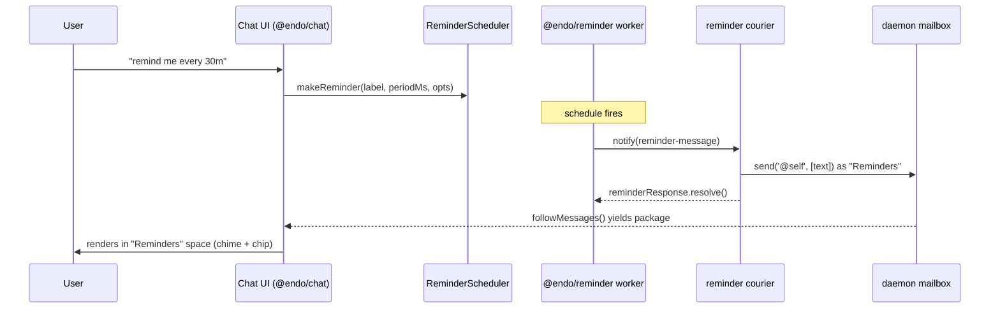
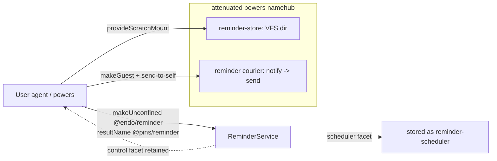

# Integrating `@endo/reminder` into Chat

| | |
|---|---|
| **Created** | 2026-08-06 |
| **Author** | Kris Kowal (prompted) |
| **Status** | Not Started |
| **Parent** | [endo-reminder](endo-reminder.md) |

## What is the Problem Being Solved?

Maintainer review of the `@endo/reminder` build
([PR #721](https://github.com/endojs/endo-but-for-bots/pull/721), 2026-07-15,
[review 4701251219](https://github.com/endojs/endo-but-for-bots/pull/721#pullrequestreview-4701251219))
asked for plans to follow up with integration of the plugin into **Chat**,
**Familiar**, and **minion.town**. This is the Chat plan; the other two are
sibling designs.

`@endo/reminder` ([design](endo-reminder.md), now **merged** to `llm`) is an
unconfined message-scheduler plugin. It fires a message on a start-to-start
schedule to one recipient capability, resolved by name, and persists its
reminders on a virtual-file-system directory so they survive a daemon restart.
Chat has no scheduling primitive today; a user cannot ask Chat to remind them of
anything. This design works out what a reminder *means* in Chat — who schedules
it, who receives the fired message, how it surfaces, and how it survives a
restart — and how the plugin's `notify`-shaped delivery meets Chat's mailbox.

## Which "Chat"

**Chat is `@endo/chat`** — the web-based chat application shell (a Vite app; all
source is flat in `packages/chat/*.js`, there is no `src/`). Its default
message-list view is the confined `@endo/space-chat` package (`InboxRoot`), a
*view of* Chat, not a separate target. Two neighbours are **not** this target:

- `@endo/goblin-chat` is a standalone OCapN/Goblins chat-protocol library plus an
  Ink TUI, interoperable with Spritely's `goblin-chat`. It has its own state
  store and does **not** touch the Endo daemon mailbox. Out of scope.
- `chat-network-view` does not exist as a package (the review's parenthetical
  named it, but there is no such directory); the network/graph view is
  `chat/outliner-component.js` + `@endo/space-inventory-graph`, internal to
  `@endo/chat`.

So "integrate into Chat" = integrate into `@endo/chat` and, where a rendering
change is needed, `@endo/space-chat`.

## The integration seam

Chat is a thin CapTP-over-WebSocket front-end. The powers object it holds is an
`EndoHost`/`EndoGuest` — the user's **agent** — and *all* message state lives in
the daemon mailbox (`@endo/daemon/src/mail.js`). Sending is
`E(powers).send(to, strings, edgeNames, petNames)`, which builds a `package`
envelope and delivers it; every inbound message flows through `deliver` onto the
`messagesTopic`; the UI subscribes with `followMessages()` and `InboxRoot`
renders each new message (with a chime and a sender chip). **Anything that
reaches `followMessages` surfaces in the UI with no front-end change.**

The reminder plugin, however, does not speak the mailbox. It delivers each
message by `E(recipient).notify(message)` on a subscriber capability resolved as
`reminder-recipient` (design Phase 2 baseline). **There is no `notify` method
anywhere in the agent/mailbox interface.** The only inbound hook is a sender
calling the recipient's `receive(envelope, fromId)`, and a `package` message
carries its capabilities *by stored `FormulaIdentifier`*, not as live exos.

The bridge is one small caplet — the **reminder courier** — bound to
`reminder-recipient`. It exposes `notify(message)`, and on each firing formats
the message and injects it into the user's inbox as an ordinary `package`
message from a "Reminders" party. This is exactly the
[proactive-messages](endoclaw-proactive-messages.md) pattern
(`E(host).send('@self', summary)`), except the scheduling half is now the
external `@endo/reminder` plugin rather than an in-process `Timer` callback, so
the courier is the piece that holds the send authority the plugin deliberately
does not.

Because `@endo/space-chat` is a *recipient-filtered single-sender* inbox view,
the "Reminders" party naturally gets its own space/conversation in the spaces
gutter, with no filtering change.

## What a reminder means in Chat

- **Who schedules:** the Chat user, through a scheduling affordance that calls
  `E(scheduler).makeReminder(label, periodMs, opts)` on the `ReminderScheduler`
  facet. `label` becomes the reminder text; `periodMs` the cadence;
  `firstDelayMs` a lead time.
- **Who receives:** the same user — the first cut is **self-reminders**. The
  courier is bound to send to `@self`, so a reminder is a note the user schedules
  for their future self, arriving in a dedicated "Reminders" conversation.
  Reminding *another* party is a later extension (§ Open questions): bind the
  courier to `send` to that peer, which is proactive messaging to others and
  carries its own consent/policy questions.
- **How it survives a restart:** the reminder *service* is pinned in `@pins`, its
  VFS store persists each reminder and the config, and on the next boot
  `revivePins()` re-incarnates the worker, whose `make()` runs recovery
  (coalesce/skip missed messages per `catchUpPolicy`) and re-arms the timers. The
  courier and the store must be re-resolvable *by name* so `make()` re-obtains
  them; the browser re-derives all message state by re-subscribing to
  `followMessages`. In-flight one-shot responses are in-memory and do **not**
  survive a restart — recovery re-delivers instead.

## Provisioning

The service is provisioned once, per the plugin's `makeUnconfined` recipe, and
the `ReminderScheduler` facet is stored under a pet name the UI can `lookup`.
`makeUnconfined` is host-side (`E(host).makeUnconfined(worker, '@endo/reminder',
…)` over CapTP; the daemon's Node worker resolves the specifier), so the browser
can drive it, but the running UI does not call `makeUnconfined` today — only the
`setup-lal` / `setup-llm-provider` scripts do (`endo run --UNCONFINED … --powers
@agent`). The plan follows that precedent with a **`setup-reminder.js`** script
(§ What changes), leaving an in-UI "enable reminders" affordance as a later
convenience.

The powers namehub the plugin resolves must carry exactly two names:

- **`reminder-store`** — a writable `@endo/platform/fs/extended` directory. The
  agent mints one with `E(host).provideScratchMount('reminder-store')` (or
  `provideMount(absPath, 'reminder-store')` for a host-directory backing). This
  is the "daemon mount" backing the plugin README anticipates; it exposes the
  reconciled writable-tree verbs the store uses (`lookup`/`list`/`write`/
  `makeDirectory`/`remove`/`move`, with atomic within-directory `move`).
- **`reminder-recipient`** — the reminder courier caplet (below), a durable
  formula reachable by that name so revival re-resolves it.

Initial `maxActive` / `minPeriodMs` arrive via `env`; thereafter the store is
authoritative. The service is pinned with `resultName: ['@pins', 'reminder']`.
The integration retains the `ReminderControl` facet (pause / resume / revoke /
limits); the UI holds only `ReminderScheduler`.

## What has to change on each side

**Reminder side (`@endo/reminder`): nothing** for the baseline. The plugin's
Phase 2/3 surface — `notify`-to-recipient delivery, VFS store, `@pins` revival —
is exactly what this uses, unchanged. The one capability the baseline cannot
carry (an *actionable* response inside the delivered message) is the plugin's own
gated Phase 4 (below), not a change this plan requests.

**Deployment side (the daemon Chat connects to):** `@endo/reminder` must be
resolvable by the daemon's Node worker for `makeUnconfined('@endo/reminder')`. It
is currently a dependency of nothing. Whoever owns the deployment (the Familiar
app or the online Gateway — the designated future owners of reminder retention)
must add it to the daemon's resolution root. This is the load-bearing shared
dependency with the sibling plans.

**Chat side (`@endo/chat`):**

1. **The reminder courier caplet** — the one genuinely new object. A small caplet
   exposing `notify(message)` that holds a guest power granting only `send` to
   `@self`, and on each `notify` formats the reminder (label, cadence, and — when
   `missedMessages > 0` — the coalesced `annotation`) into markdown and sends it
   as "Reminders", then resolves the one-shot response (auto-ack; a proactive
   reminder needs no reply). Least authority: send-to-self only.
2. **`setup-reminder.js`** — an `endo run --UNCONFINED … --powers @agent` script
   that mints the store mount, makes the courier guest and mutual pet names,
   composes the `reminder-store` + `reminder-recipient` powers namehub,
   `makeUnconfined`s the service pinned into `@pins`, and stores the
   `ReminderScheduler` facet as `reminder-scheduler`. Mirrors `setup-lal.js`.
3. **A scheduling affordance** — minimal first cut: a chat-bar command
   (`/remind <period> <label>`, parsed like existing `@edge:petname` references
   in `message-parse.js`) that looks up `reminder-scheduler` and calls
   `makeReminder`. A richer form UI is a follow-up. **Delivery needs no UI
   change** — a reminder that lands as a `package` message renders through the
   existing `InboxRoot` path automatically.

## The interactive-response gap (dependency on #721 shape)

Each fired message carries a one-shot `reminderResponse` exo (`resolve()` /
`reschedule()`) — the hook for "snooze this reminder". How far that reaches into
Chat is bounded by what #721 built:

- **Auto-ack (baseline, available now):** the courier resolves on delivery.
  Reminders fire and appear; no snooze. Ships on `@endo/reminder` as merged.
- **Live snooze (available now, Chat-side only):** the courier retains the live
  response in memory keyed by `reminderId`, embeds the id in the message, and
  exposes `E(courier).snooze(id)` / `ack(id)`; a chat affordance calls it. Works
  while the daemon is up; a response is lost on restart (recovery re-fires, so no
  reminder is dropped). Needs no #721 change — the response never has to be
  stored — but it does add a courier method and a small UI affordance.
- **Native in-message action (blocked on #721 Phase 4):** surfacing the response
  as a first-class message attachment, so the inbox's existing reply/resolve
  affordances drive snooze durably, requires the response to be a *storable*
  value (`send` + `storeValue`). That is precisely the reminder **Phase 4**
  mailbox-delivery upgrade, gated on SturdyRef modelling and **not built** on
  #721. Do not plan the durable-actionable path against the current API; it may
  not survive that review.

**Recommendation:** ship auto-ack first, add live snooze as a fast follow, and
defer native in-message actions until reminder Phase 4 lands. None of the three
blocks the others.

## Test strategy

- **Courier unit test:** a `notify(reminder-message)` produces one mailbox
  `package` delivery observable through a mailbox stub / `followMessages`, with
  the expected text, "Reminders" sender, and `annotation` rendering for a
  coalesced message; and it resolves the response.
- **End-to-end against a daemon:** provision the service with
  `reminder-recipient` = courier bound to a test agent's inbox, schedule a
  reminder, advance the plugin's injectable clock (the `setTimeout`/`now` seam
  from #609 survives in the plugin), and assert a `package` message appears in
  `followMessages`.
- **Revival:** pin, schedule, simulate a daemon restart, assert recovery
  re-fires per `catchUpPolicy` (`coalesce` produces one catch-up with the right
  `missedMessages`; `skip` drops stale). Reuses the plugin's own recovery tests
  as the lower layer.
- **Space filtering:** assert the "Reminders" sender lands in its own
  single-sender space view (`@endo/space-chat`).
- **Playwright e2e** for the `/remind` affordance once it exists.

The plugin already ships 21 unit tests on the in-memory VFS; the integration
tests target only the courier + provisioning seam, not the scheduler core.

## Ordering

Against **#721:** #721 is **merged**, so this plan no longer waits on it landing
(the review that spawned this plan predates the merge). Only the *native
in-message action* leg waits — on reminder Phase 4, not on #721.

Against the **sibling plans (Familiar, minion.town):** Chat is a thin
front-end; it does **not** own the load-bearing substrate. Provisioning,
`@pins` retention, and the VFS store mount belong to whichever integration owns
the deployment — the design names the **Familiar app** and the **online
Gateway** as the future owners of automatic reminder retention. So:

1. The **store-mount + provisioning + pin substrate** should land in the
   Familiar/Gateway layer (the sibling plans), or jointly, first. Until then
   Chat's `setup-reminder.js` carries a self-contained version for a
   direct-to-daemon Chat.
2. **Chat's courier + `/remind` affordance** can be built in parallel against
   that substrate; most of the "surfacing" work is free via `followMessages`.
3. **Live snooze**, then **native in-message actions** (after Phase 4), are
   independent follow-ups.

The shared blocker across all three is the **deployment-resolvable
`@endo/reminder`** dependency; that should be filed as a single cross-cutting
task (**to be filed**) rather than duplicated per plan.

## Dependencies

| Design / PR | Relationship |
|---|---|
| [endo-reminder](endo-reminder.md) / [#721](https://github.com/endojs/endo-but-for-bots/pull/721) | The plugin being integrated (merged). Phase 4 (`send`+`storeValue`) gates the native-action leg. |
| [endoclaw-proactive-messages](endoclaw-proactive-messages.md) | The delivery pattern the courier realizes (send-to-inbox on a schedule). |
| [familiar-daemon-bundling](familiar-daemon-bundling.md), [gateway-package](gateway-package.md) | Candidate owners of provisioning + `@pins` retention + the store mount; the sibling integration plans. |
| [platform-fs](platform-fs.md), [fs-interface-reconciliation](fs-interface-reconciliation.md) | The writable-tree contract the `reminder-store` mount must satisfy. |

## Open questions

- Which layer owns provisioning and `@pins` retention for a Chat deployment — a
  self-contained `setup-reminder.js` in `@endo/chat`, or the Familiar/Gateway
  integration that Chat merely consumes? The sibling plans should settle this;
  this plan assumes Chat carries a self-contained fallback.
- Should reminders be schedulable *for another party*, not just self-reminders?
  That turns the courier into a proactive-messaging-to-others surface with
  consent implications; deferred here as a self-reminders-first cut.
- Does `provideScratchMount` / `provideMount` yield a directory whose verb set
  exactly matches the reminder store's `@endo/platform/fs/extended` contract
  (including atomic within-directory `move`)? Named as the one integration point
  to verify against a live daemon before building; the plugin README's "daemon
  mount" backing and `daemon/src/mount.js` indicate yes, but it is unconfirmed
  end-to-end.
- What is the minimum viable scheduling affordance — a `/remind` chat-bar command
  parsed like existing `@edge:petname` refs, or a dedicated form (the
  `counter-proposal-form.js` / `add-space-modal.js` pattern)? This plan assumes
  the command first, the form as a follow-up.
