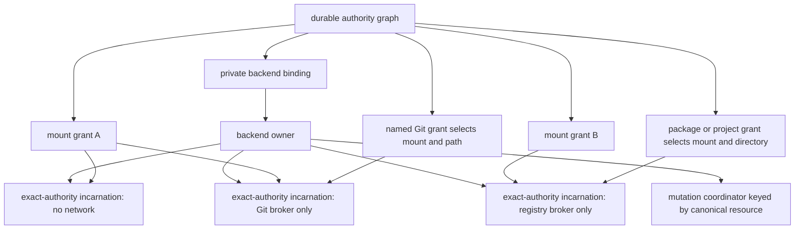

# Session Sandbox Execution Backend

|               |                                                                                                                                                                                                                                                    |
| ------------- | -------------------------------------------------------------------------------------------------------------------------------------------------------------------------------------------------------------------------------------------------- |
| **Created**   | 2026-08-06                                                                                                                                                                                                                                         |
| **Updated**   | 2026-08-17                                                                                                                                                                                                                                         |
| **Author**    | 0xpatrickdev (prompted)                                                                                                                                                                                                                             |
| **Status**    | Proposed                                                                                                                                                                                                                                           |
| **Builds on** | [session-execution-capabilities](session-execution-capabilities.md), [endo-posix-sandbox](endo-posix-sandbox.md), [endo-fs-backend-seam](endo-fs-backend-seam.md), [daemon-mount-capabilities](daemon-mount-capabilities.md), and [daemon-git-remotes](daemon-git-remotes.md) |

## Summary

The base code-mode design defines a durable authority graph containing
independent mount, Git, Git-remote, package-manager, Web, and project-execution
grants. This design adds an optional confined native-process backend without
turning a sandbox, container, driver, or rootfs into public capability identity.

One daemon-private backend owner lazily creates sandbox incarnations for the
exact authority an operation needs. An incarnation is keyed by its selected
mount grants and modes, rootfs or toolchain profile, network posture, limits,
and policy version. No incarnation automatically receives every mount in the
session, and the owner does not pre-create every possible grant combination.

The backend is the planned production boundary for package lifecycle scripts,
package binaries, tests, builds, generators, and native Git or package-manager
processes that consume untrusted workspace content. It does not make the
portable Exo facades, trusted-host development backend, or daemon-owned Web
research depend on sandbox availability.

The first implementation should qualify one reference driver and the profiles
it actually supports. Other drivers become available only after passing the
same profile-specific conformance suite. Initial delivery does not require
bwrap and Podman to reach parity at the same time.

## Scope

This design covers:

- a versioned private binding from durable grants to ephemeral sandbox
  incarnations;
- least-authority mount projection for compatibility and named mount grants;
- sandbox-backed local and remote Git;
- workload-specific broker-only networking for Git and package management;
- separately granted broad public networking for project-selected code;
- operation-scoped Git credential descriptors;
- a borrowed package-manager and project-execution backend;
- bounded process lifecycle, cancellation, output, and orphan cleanup;
- restart interruption and conservative mutating-effect reconciliation; and
- driver- and profile-specific conformance tests.

It does not expose `SandboxFactory`, `SandboxHandle`, driver names, rootfs paths,
host paths, broker endpoints, process handles, or secret descriptors to the
guest. It does not make proxy environment variables a security boundary,
promise that arbitrary scripts are reconcilable, or silently fall back to host
execution.

## Verified Current State

This state was refreshed on 2026-08-17 against the current stacked base and the
live pull-request heads.

| Surface | Current state and consequence |
| ------- | ----------------------------- |
| `@endo/sandbox` | `SandboxFactory.make(spec)` and `SandboxHandle.spawn(argv, opts)` exist with bwrap and Podman driver seams, mount-capability inputs, passable byte streams, and an implemented `network: 'none'` posture. Networking is selected per handle, not per spawn. |
| Network enforcement | Bwrap does not yet wire the documented private-egress namespace and filter path. Podman private filtering remains operator-owned. Bwrap also does not load the default seccomp profile. Only `network: 'none'` has the present implementation evidence needed here. |
| Driver selection | The current automatic factory path selects a registered driver; it does not mean “probe every driver and choose the first conforming implementation.” A durable binding must record a concrete driver selected by explicit probing or track the factory change that supplies that behavior. |
| Lifecycle work | [#954](https://github.com/endojs/endo-but-for-bots/pull/954), head `6d4ce0723c921c1b3009358a0d8a2ea094a92405`, serializes spawn and disposal, bounds captured output, labels operation containers, and cleans exact-owner orphans. It is the first implementation cut for this design. |
| Authority graph | [#958](https://github.com/endojs/endo-but-for-bots/pull/958), head `2c46751282daa7a55c20a18f6759f5f0b666c1ef`, implements multiple named mount and Git grants; [#965](https://github.com/endojs/endo-but-for-bots/pull/965) is stacked generic provisioning work and needs a refresh onto the final #958 head. |
| Workspace surface | [#961](https://github.com/endojs/endo-but-for-bots/pull/961), head `f0b5eaf23f2b2fe33dce25591674fe7c7ac3b9d7`, corrects code-mode workspace to the daemon `EndoMount` and retains extended `Filesystem` as a separate local seam. It must be reconciled with #958 before this backend binds to a guest-visible mount type. |
| Mount containment | [#897](https://github.com/endojs/endo-but-for-bots/pull/897) still carries symlink-deny and mid-walk revocation hardening. The Exo facade prevents public API escalation but does not make these backend path checks unnecessary. |
| Adjacent mount projection | [#971](https://github.com/endojs/endo-but-for-bots/pull/971) landed capability-first 9P projection under `/mnt/` on the separate `feat/hosted-endo-management` feature stack. It removes a host-path fast path and recreates a slice when its mount set changes. It is useful prior art, not substrate already present on `llm`. |
| Git evolution | [#960](https://github.com/endojs/endo-but-for-bots/pull/960) adds linked worktree operations; [#962](https://github.com/endojs/endo-but-for-bots/pull/962) makes status bounded copy data and adds tracking; [#974](https://github.com/endojs/endo-but-for-bots/pull/974) adds worktree-relative path designators; and [#973](https://github.com/endojs/endo-but-for-bots/pull/973), head `9b36df5387bab785dfc40927e85e3dc8abb960d1`, bounds remote results and audit fields. |
| Recovery | Existing `GitRemote` audit records are post-result prior art, and #973 proposes bounds for their network-sourced fields. They are not write-ahead mutating-effect receipts, liveness state, or restart reconciliation. [#1010](https://github.com/endojs/endo-but-for-bots/pull/1010) improves context cancellation cleanup but does not add that durable record. |

## Assurance Levels

Claims use the same three levels as the base design.

1. **Portable Exo facade.** Guards, attenuation, fixed operation shapes, mount
   selectors, Git policy, bounded copy results, and cancellation prevent callers
   from invoking authority that the received facet does not advertise. They do
   not control what a native process does after spawn.
2. **Trusted host development.** Fixed argv, generated configuration, sanitized
   environment, cooperative cancellation, and bounded output are useful for
   trusted workspaces. They do not establish kernel-enforced containment
   against hostile package configuration or repository contents.
3. **Conformance-qualified confined backend.** A specific driver, rootfs, and
   profile pass adversarial filesystem, process, secret, network, and cleanup
   tests. Only this level supports hostile-workspace path, broker-bypass,
   child-process, or orphan-prevention claims.

`piTools: 'preserve'` remains a development-only harness posture. Retained Pi
tools may carry ambient authority outside the Endo grant graph, so no
whole-session confinement result is derived from a preserved run.

## Architecture



The durable graph identifies authority. The private binding selects one
implementation of that authority. Handles, namespaces, containers, bridges,
brokers, sockets, and child processes remain ephemeral.

## Durable Binding and Migration

The daemon records a host-private backend binding containing only versioned,
non-secret reconstruction inputs:

| Field | Meaning |
| ----- | ------- |
| `sandboxFactoryId` | Formula that reconstructs the factory. |
| `backend` | Concrete driver selected after the required probes pass. `auto` is not persisted. |
| `rootfsProfile` | Immutable rootfs mount or digest-pinned image plus a declared toolchain profile. |
| `mountGrantIds` | Authority ceiling from which an operation may select mounts. This is not a directive to mount all of them together. |
| `networkProfiles` | Versioned profiles this binding has qualified, initially `none` and any workload-specific broker profiles. |
| `limits`, `envPolicy`, `policyVersion` | Normalized process and compatibility policy. |

Restart may reconstruct an incarnation under the same pinned driver, rootfs,
policy, and exact authority. Changing driver, rootfs, mount-projection protocol,
network enforcement, or another assurance-relevant input is an explicit
migration. It mints a new grant identity unless conformance establishes
behaviorally equivalent authority and the migration records that proof.

The public capability never promises transparent migration across materially
different enforcement behavior.

## Exact-Authority Incarnation Pool

One daemon-private owner coordinates a lazy pool. A normalized incarnation key
contains:

- the ordered selected mount grant IDs, modes, and inner roots;
- the rootfs or toolchain profile;
- one network posture;
- resource limits and seccomp policy; and
- the backend policy version.

An operation borrows the least-authority matching incarnation. The owner may
reuse, idle, or evict an incarnation without changing durable grant identity.
It does not instantiate the Cartesian product of all session grants.

Exactly one owner controls each live handle. Borrowers can cancel their own
leases but cannot dispose the handle. Admission, spawn registration, disposal,
and orphan cleanup are serialized so either spawn is registered before dispose
observes it or spawn fails before crossing the driver boundary.

Different incarnations may project aliases or overlapping subroots of the same
physical resource. Mutation locks and mutating-effect records therefore use
canonical backing-resource identity plus selected relative root, not guest pet
name, grant name, handle ID, or sandbox path.

## Mount Projection

The compatibility mount named `workspace` maps to `/workspace`. Other selected
named mounts map to deterministic `/mnt/<name>` roots after pet-name validation
and collision checks. A handle receives only the mounts selected for the
operation. Read-only posture is enforced by the driver projection, not merely
by omitting Exo mutation methods.

A named Git grant derives its inner repository root from:

```text
selected mount inner root + validated mount-relative path segments
```

Package-manager and project-execution grants use the same selection rule for
their working directory. No adapter accepts a host path or independently
rediscovers a workspace.

The guest-visible workspace and named-mount capabilities are daemon
`EndoMount`s after #958 and #961 reconcile. An extended `Filesystem` may be
derived locally where an adapter needs that interface, but this backend does
not redefine mount globals as a different capability type.

### Projection implementation decision

This design specifies containment properties, not a new filesystem protocol.
Implementation must compare these paths before choosing one:

1. directly project daemon `EndoMount` capabilities through an existing sandbox
   driver seam; or
2. reuse or extract #971's capability-first 9P projection for foreign
   filesystem grants, including slice recreation when the selected mount set
   changes.

A new CBOR `FsBackend` bridge is not the default. It is considered only if both
reuse paths fail a documented requirement, and then receives its own protocol,
bounds, lifecycle, compatibility, and race review.

Every selected approach must prove read-only enforcement, path-segment
validation, symlink-race resistance, cross-mount denial, revocation during
walks, and absence of a host-path fast path. #897 or equivalent hardening is a
prerequisite for the corresponding portable-containment claims.

## Network Postures

Networking is immutable for the lifetime of the current `SandboxHandle`.
Therefore the following are distinct incarnation keys until a proven per-spawn
attenuation contract exists:

- `none`: no network namespace reachability;
- `registry-broker-only`: reach only the selected registry and tarball mediator;
- `git-broker-only`: reach only the selected exact-origin Git mediator; and
- `public-project`: filtered public egress for explicitly granted project code.

Package installation and Git operations never borrow `public-project` merely
because that handle already exists. Broker-only profiles are kernel-enforced:
the child may reach the named sidecar, socket, or isolated endpoint and cannot
open a direct public, private, host-service, metadata, DNS, or alternate-proxy
connection.

The registry mediator understands HTTP registry and tarball requests and is
backed by `EndoRegistry`, integrity verification, and CAS. The Git mediator
permits only the selected HTTPS origin and bounded CONNECT tunnel. Git retains
end-to-end TLS hostname and certificate verification.

DNS filtering is transport enforcement, not origin authorization. A driver may
classify answers and constrain packet destinations, but it cannot inspect HTTPS
redirects inside an opaque TLS tunnel. HTTP redirects remain the responsibility
of an HTTP-aware broker. Git either rejects them or establishes a fresh tunnel
for a destination independently authorized by the Git grant.

The first production cut qualifies one reference driver for each advertised
profile. Bwrap must own its namespace and filtering path. Podman must install
and verify equivalent per-container policy before advertising that profile;
operator configuration alone is insufficient. A driver that cannot prove a
requested profile fails closed.

## Sandbox-Backed Git

The sandbox Git adapter implements the public `GitBackend` methods that have
landed when the backend is advertised. It must either implement or explicitly
exclude methods added by #960, #962, #973, and #974 until their stacks settle.
Silent host fallback is forbidden.

Every Git grant names a selected mount and relative repository root. Every
`GitRemote` must select a named Git grant. The current compatibility behavior
that attaches remotes only to the root `git` binding is a tracked gap, not the
multi-grant design.

The adapter receives a borrower, the selected inner root, retained repository
identity, normalized remote policy, and fixed Git executable from its rootfs
profile. It does not import ambient host `child_process`, filesystem, path, or
process powers.

Fixed Git configuration disables or bounds hooks, helpers, fsmonitor, external
attributes, filters, signing, pagers, editors, prompts, URL rewriting,
submodules, alternate protocols, and executable configuration. Repository
identity checks occur before mutation and after restart. Linked-worktree and
worktree-relative operations use the same selected mount ceiling rather than
resolving host paths.

### Operation-scoped credentials

The first credential need is Git HTTPS. The initial driver primitive should be
narrow enough to prove that use case before becoming a general arbitrary-secret
spawn API.

A credential is delivered through a one-shot anonymous descriptor only after
endpoint, direction, refspec, and credential-version authorization. Secret
bytes never enter argv, environment values, configuration, a mount, formula,
result, audit record, log, or model context.

The fixed launcher closes unrelated descriptors, becomes non-dumpable where the
platform supports it, acknowledges readiness, reads one bounded role-tagged
frame, and disables fallback prompting. Cancellation, revocation, timeout, and
restart close the descriptor, kill and reap Git, and discard unused bytes.

If a driver cannot preserve and isolate the descriptor from unrelated session
processes, credentialed Git is unavailable on that driver. There is no secret
file or persistent environment fallback.

## Package Management and Project Execution

`@endo/exo-package-manager` retains structurally distinct reader, installer,
and executor facets. The installer is narrower than the executor, but its name
is not a hostile-workspace assurance claim.

The sandbox adapter borrows an exact-authority incarnation containing the
selected project mount and working directory. Frozen installation uses
`registry-broker-only`. Named scripts, lifecycle hooks, package binaries,
tests, builds, and generators require the executor or project-execution grant
and use `none` unless broad public networking is independently granted.

No public method accepts a shell fragment, arbitrary host executable,
unvalidated working directory, or opaque extra argv. The pinned manager and
rootfs profile resolve script names and package binaries inside the selected
mount ceiling. Environment, mounts, resources, output, deadlines, and
cancellation are explicit.

Rootfs selection is a versioned toolchain profile, not a promise that one image
contains every supported Git, Node, npm, pnpm, and Yarn version forever. A
profile advertises only the manager and runtime versions its conformance tests
cover.

If the confined backend is unavailable after restart, executor and project-code
operations remain unavailable. They never fall back to host-shell, exo-shell,
or the trusted-host installer.

## Process Lifecycle and Bounds

All sandbox consumers share these invariants:

- argv is a fixed executable plus validated operation arguments, never a shell
  command;
- stdin is closed or a specifically granted bounded reader;
- stdout and stderr remain separate `PassableBytesReader` capabilities;
- byte caps are enforced before decoding, and overflow kills before waiting for
  EOF;
- drain and graceful-termination windows are bounded before hard-kill and reap;
- cancellation, timeout, revocation, disposal, and shutdown use one idempotent
  kill-and-reap path; and
- diagnostics redact host paths, endpoint userinfo, secret descriptors, and
  secret material.

Bwrap uses parent-death and process-group containment. Podman labels every
container with exact backend-binding and operation identities. Startup removes
only exact-owner orphans and never sweeps unrelated containers. #954 is the
implementation path for the first lifecycle cut.

## Restart and Effect Outcomes

Restart preserves durable grants, canonical mount and backing-resource
identities, normalized policy, rootfs profile, backend binding, and any bounded
mutating-effect records. It preserves no namespace, container, handle, broker,
child, stream, descriptor, credential bytes, or pending promise.

Startup:

1. reconciles exact-owner orphan processes and containers;
2. marks formerly live operations `interrupted` with reason `daemon-restart`;
3. reconstructs dependencies and reruns the selected profile's required probes;
4. admits new operations only after a matching incarnation is ready; and
5. never automatically replays an interrupted operation.

Process liveness and effect outcome are separate. A durable mutating operation
may reconcile as `no-effect`, `completed`, or `indeterminate`. Git may compare
remote refs. Installation may inspect lockfile and workspace state. Arbitrary
scripts, builds, or tests commonly remain `indeterminate`; the backend does not
promise rollback or distributed transactions.

Durable write-ahead recording is required only for operations that may mutate
durable workspace or external state. Web fetch and search plus Git status and
inspection use bounded receipts and reject as interrupted after restart unless
a consumer explicitly requested retention. Git fetch is mutating because it
updates repository objects and refs. Existing GitRemote audit records are
post-result evidence only; #973 proposes bounds for their network-sourced
fields.

The caller decides whether to retry. Retained records contain non-secret
operation kind, policy and grant identifiers, canonical resource identity,
timestamps, liveness, outcome, and reconciliation metadata. They contain no
response bodies, output streams, credentials, or live handles.

## Dependency-Ordered Work

The checklist is the implementation ledger. An unchecked item without a linked
pull request is unposted work.

### Landed foundations

- [x] Sandbox factory, handle, bwrap and Podman driver seams, mount-capability
  inputs, passable process streams, and `network: 'none'`. Owner:
  `@endo/sandbox`. Tracking: [endo-posix-sandbox](endo-posix-sandbox.md).
- [x] Backend-independent Git and package-manager facades. Owners:
  `@endo/exo-git` and `@endo/exo-package-manager`. Tracking: landed Git work and
  #948.
- [x] Revised durable authority and assurance contract. Owner:
  [session-execution-capabilities](session-execution-capabilities.md). Done:
  multiple mount and Git grants, exact-authority incarnations, mutating-effect
  record scope, explicit backend migration, and scoped confinement claims are
  the stacked base.

### Open pull requests

- [ ] Land bounded sandbox lifecycle ownership. Owner: `@endo/sandbox`.
  Tracking: #954. Done when serialized spawn/dispose, output caps, exact-owner
  labels, operation containers, and orphan cleanup pass without claiming later
  network profiles.
- [ ] Reconcile the named authority graph and generic provisioning. Owners:
  `@endo/agentry` and daemon. Tracking: #958 and stacked #965. Done when multiple
  mount and Git grants reconstruct and #965 is refreshed onto the final #958
  head.
- [ ] Reconcile guest-visible mount types. Owners: `@endo/agent-tools`,
  `@endo/agentry`, and daemon. Tracking: #961 with #958. Done when compatibility
  and named mount declarations expose the daemon `EndoMount` contract.
- [ ] Close portable mount containment gaps. Owner: daemon mount. Tracking:
  #897. Done when symlink-deny and mid-walk revocation tests land.
- [ ] Track the public Git surface. Owners: `@endo/exo-git`, `packages/git`, and
  this backend. Tracking: #960, #962, #973, and stacked #974. Done when every
  advertised backend implements or explicitly excludes the final methods and
  bounded result shapes.
- [ ] Settle daemon cancellation cleanup. Owner: daemon. Tracking: #1010. Done
  when graceful cancellation cannot strand owner cleanup hooks. This does not
  replace durable mutating-effect records.

### Unposted implementation work

- [ ] Define the versioned private backend binding and explicit migration rule.
  Done when `auto` cannot be persisted, a concrete probed driver is recorded,
  and assurance-relevant changes cannot silently preserve grant identity.
- [ ] Implement the lazy exact-authority incarnation pool. Dependency: #954.
  Done when mount sets and network postures are part of normalized keys,
  borrowers cannot dispose handles, and aliases coordinate by canonical
  resource identity.
- [ ] Decide and implement mount projection. Dependencies: #958, #961, and
  #897. Done when direct `EndoMount` projection and extraction of #971's 9P path
  are compared, the selected approach has no host-path fast path, and any new
  protocol requires a separate reviewed justification.
- [ ] Add `registry-broker-only` and `git-broker-only` to one reference driver.
  Done when packet-level probes prove only the selected mediator is reachable.
- [ ] Qualify additional drivers independently. Dependency: a reference
  profile. Done per driver and profile; parity does not block first delivery.
- [ ] Add the narrow operation-scoped Git credential descriptor primitive.
  Done when concurrent-process, process-inspection, cancellation, redaction,
  and restart probes find no disclosure or fallback.
- [ ] Implement sandbox Git over selected mount grants. Dependencies: the
  authority graph, mount projection, Git surface reconciliation, and network
  profiles. Done when local and remote methods use fixed policy and no host
  process or path power.
- [ ] Let every named Git remote select a named Git grant. Dependency: #958.
  Done when compatibility root `git` is unnecessary for named-only sessions.
- [ ] Implement the borrowed package-manager and project-execution adapters.
  Dependencies: mount projection, lifecycle, and network profiles. Done when
  frozen install, executor, and project operations use only their selected
  mount, toolchain, and independently granted network authority.
- [ ] Add durable write-ahead records for mutating effects. Owner: daemon.
  Done when dispatch follows durable admission, liveness and outcome are
  separate, arbitrary execution may remain `indeterminate`, and read-only calls
  are not transactions by default.
- [ ] Add crash-point and cross-driver conformance tests. Done when every
  advertised driver and profile proves its own filesystem, lifecycle, network,
  credential, restart, and cleanup claims.
- [ ] Run strict consumer-independent acceptance. Done when a session with
  selected grants can open or clone a repository, edit, install, run a bounded
  test, commit, fetch, conditionally push, restart between steps, and explicitly
  decide whether to retry one interrupted mutation without ambient Pi tools.

Lifecycle work, mount-projection evaluation, and operation-record schema design
can proceed in parallel. Sandbox Git waits for the public Git methods it needs
to settle. The first production path waits for one qualified driver, not for
all drivers.

## Conformance Matrix

Each driver advertises only the rows and profiles it passes.

| Area | Required evidence |
| ---- | ----------------- |
| Authority | Exact selected mount set and network posture; no sibling session grant appears in the handle. |
| Lifecycle | Every spawn/dispose race is leak-free; output overflow kills before EOF; exact-owner orphan cleanup leaves unrelated processes and containers alone. |
| Filesystem | Read-only enforcement, relative-path validation, symlink-race resistance, revocation during walks, cross-mount denial, and no host-path fast path. |
| Network | `none` blocks all sockets; each broker-only profile reaches only its mediator; public-project blocks host, private, link-local, metadata, multicast, alternate DNS, and rebinding paths. |
| Git | Selected-grant roots, repository identity, configuration and protocol denials, bounded results, cancellation, public fetch, authenticated fetch/push, and no host fallback. |
| Credentials | No argv, environment, formula, mount, log, stream, model-context, process-inspection, or concurrent-process disclosure. |
| Package code | Pinned toolchain profiles; fixed argv; selected mount and working directory; independent network grant; no host execution fallback. |
| Restart | Fresh incarnation, exact-owner orphan cleanup, interrupted liveness, conservative outcome, no replay, and fail-closed unavailable dependencies. |

Strict acceptance has `piTools: 'preserve'` absent. Trusted-host tests are
reported separately and never count as confined-backend conformance.

## Alternatives Rejected

- **One session-wide handle:** it accumulates every mount and the broadest
  network authority used anywhere in the session.
- **One handle for every possible grant combination:** it creates a
  combinatorial pool before operations demonstrate a need. Lazy normalized
  incarnation keys give the same least-authority property.
- **Locking by grant or handle identity:** aliases and overlapping grants can
  refer to the same bytes. Coordination follows canonical backing-resource
  identity and relative root.
- **A new CBOR filesystem bridge by default:** it duplicates protocol,
  lifecycle, compatibility, and race-hardening work before direct mount and
  existing 9P reuse are evaluated.
- **Requiring two-driver parity before first delivery:** it delays a qualified
  reference backend and expands the initial attack surface. Every advertised
  driver still has to pass the same profile contract.
- **A general secret-spawn API before the Git case is proven:** it creates a
  broad security commitment without a second demonstrated consumer.
- **Proxy configuration as network confinement:** a hostile child can ignore
  it. Broker-only reachability is enforced outside the process.
- **Stable identity across unproven backend migration:** a driver, rootfs, or
  policy change can alter authority and assurance.
- **Durable transactions for read-only calls:** cancellation and bounded
  receipts suffice unless a consumer explicitly asks for retained status.
- **Automatic replay:** native process, Git, installation, and project effects
  are not generally idempotent.

## Open Questions

Two implementation choices remain deliberately open:

1. whether direct daemon `EndoMount` projection satisfies every confined
   adapter or whether the capability-first 9P path from #971 should be
   extracted for foreign filesystem grants; and
2. which driver becomes the first reference implementation for broker-only
   networking and operation-scoped credential descriptors.

Neither question changes the durable public authority graph. Both must be
settled with implementation probes before the design claims their profiles are
available.

## Prompt

> Define the optional confined execution backend over the durable code-mode
> authority graph. Keep public grants independent of sandbox identity. Use one
> private owner and lazy exact-authority incarnations keyed by selected mount
> set, rootfs, network posture, limits, and policy version. Reuse daemon
> `EndoMount` and evaluate the adjacent #971 9P path before introducing another
> filesystem protocol. Provide sandbox-backed Git, frozen installation,
> project execution, workload-specific broker-only networking,
> descriptor-scoped credentials, bounded lifecycle, conservative restart
> outcomes, and profile-specific conformance without host fallback.

## Revision Prompt (2026-08-17)

> Reconcile the backend with #954, #958, #961, #965, #897, #960, #962, #971,
> #973, #974, and #1010. Replace one canonical workspace and one live handle
> with multiple mount grants and a lazy exact-authority pool. Separate grant
> identity from canonical resource identity. Remove the presumed CBOR
> filesystem bridge, qualify one reference driver before parity, narrow secret
> descriptors to the proven Git use case, make backend migration explicit, and
> reserve durable write-ahead records for mutating effects.
