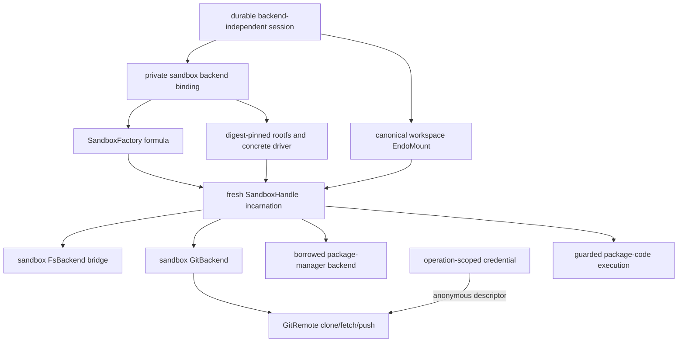

# Session Sandbox Execution Backend

|               |                                                                                                                                                                                                                                                    |
| ------------- | -------------------------------------------------------------------------------------------------------------------------------------------------------------------------------------------------------------------------------------------------- |
| **Created**   | 2026-08-06                                                                                                                                                                                                                                         |
| **Updated**   | 2026-08-06                                                                                                                                                                                                                                         |
| **Author**    | 0xpatrickdev (prompted)                                                                                                                                                                                                                             |
| **Status**    | Proposed                                                                                                                                                                                                                                           |
| **Builds on** | [session-execution-capabilities](session-execution-capabilities.md), [endo-posix-sandbox](endo-posix-sandbox.md), [endo-fs-backend-seam](endo-fs-backend-seam.md), [daemon-mount-capabilities](daemon-mount-capabilities.md), and [daemon-git-remotes](daemon-git-remotes.md) |

## Summary

The daemon-backed session design delivers a useful endo-pi workspace, Git,
safe package installation, and mediated Internet access without requiring an OS
sandbox.
This design adds an interchangeable sandbox execution backend to that session.
It is a defense-in-depth layer and the only backend allowed to run untrusted
package lifecycle scripts, package binaries, tests, and broader project code.
It is not the durable session identity and is not a gate on the base milestone.

The daemon retains the same backend-independent session and capability formula
identities described by
[session-execution-capabilities](session-execution-capabilities.md).
A host-private backend binding reconstructs a fresh `SandboxHandle` for the
current daemon lifetime.
Workspace, ExoGit, `GitRemote`, and `EndoPackageManager` keep their public
interfaces while their adapters borrow the live handle.
No guest binding, public policy record, or model global contains a
`SandboxHandle`, driver name, rootfs path, process handle, or host path.

The backend supplies:

- one canonical workspace mount at `/workspace` and a race-free filesystem
  bridge over that mount;
- sandbox-backed local and remote Git, including clone, fetch, and push;
- operation-scoped Git credentials delivered through anonymous descriptors;
- a package-manager backend that borrows, but never disposes, the
  session-owned handle;
- guarded execution of lifecycle scripts, package binaries, and other
  project-selected code that the host backend deliberately refuses;
- real public-Internet egress with localhost, host service, private/LAN,
  link-local, metadata, redirect, DNS re-resolution, and rebinding blocking;
  and
- serialized spawn/dispose, passable process streams, kill-before-EOF output
  caps, crash-orphan cleanup, restart reconstruction, and cross-driver tests.

Host-shell and exo-shell are never the execution engine for untrusted package
code.
When a guarded operation is enabled, a `SandboxHandle` process running inside
the confined backend is the engine.

## Relationship to the Base Session

The base session owns durable identity, the canonical `EndoMount`, grants,
credential identities, reconstructible non-secret policy, and the operation
journal.
The sandbox backend consumes those authorities; it does not replace them.

The following rules preserve backend interchangeability:

1. `Filesystem`, ExoGit, `GitRemote`, `EndoPackageManager`, and Web capability
   guards and result shapes do not mention a sandbox.
2. Capability formula identity remains stable when a compatible backend is
   selected or reconstructed.
3. The private backend binding may retain the concrete driver and immutable
   rootfs needed to reproduce behavior, but neither becomes session identity
   or guest authority.
4. The base daemon-backed operations remain available when no sandbox backend
   is configured.
5. A sandbox failure never falls back from a sandbox-authorized untrusted
   operation to a host process.
6. `workspace`, `git`, `packageManager`, Web research, Git credentials, and
   `projectExecution` remain independent grants.

Mediated Web research, package-registry access, and HTTPS Git brokers from the
base design remain the preferred narrow network surfaces even when a sandbox is
present.
The backend maps a separate `projectNetwork` grant to its coarser public-egress
profile for explicitly granted project-code execution; that authority is not
implied by `web`, registry, Git, or package-manager installation authority.

## Current Contracts That Constrain the Backend

This design preserves the concrete seams already established by the tree:

| Current seam | Backend consequence |
| ------------ | ------------------- |
| `SandboxFactory.make(spec)` chooses bwrap or Podman and creates a live `SandboxHandle`. | Driver availability, rootfs compatibility, network enforcement, mounts, limits, and secret-descriptor support are probed before binding. |
| `SandboxHandle.spawn(argv, opts)` accepts `env`, `cwd`, `stdin`, and capture flags, but no per-spawn network option. | Network is selected for the whole handle. A session requiring differently attenuated project processes needs separate backend incarnations or a future per-spawn contract; v1 never pretends argv can narrow egress. |
| Process stdout and stderr are `PassableBytesReader` capabilities. | Consumers pump with `iterateReader` or `E(reader).next()`; they do not treat the result as a local `AsyncIterable`. |
| `SandboxFactory` accepts `Mount` capabilities and resolves backing paths privately. | The binding names mount formula IDs and passes capabilities to the factory; it never stores a raw backing path. |
| `@endo/platform/fs/extended` constructs `Filesystem` with `wrapBackend(FsBackend)`. | The sandbox supplies a confined `FsBackend`; it does not expose a host-projected filesystem. |
| ExoGit already injects a `GitBackend`, and `GitRemote` carries endpoint and operation policy. | Sandbox Git is another backend, not another public Git API, and consumes the normalized remote policy rather than repository configuration. |
| The native Git backend identifies a repository by `(commonDir, configHash, rootCommit)`. | The sandbox backend preserves and checks the same logical identity using inner paths and fixed Git commands. |
| The portable package-manager work injects a backend and constructs manager-specific fixed argv. | The sandbox adapter supplies process execution and policy features; it does not take ownership of the handle or turn arbitrary argv into a public method. |

The current `private` network profile is not yet a sufficient security
boundary.
Its declared public-egress behavior blocks at least IPv4 `10.0.0.0/8`,
`172.16.0.0/12`, `192.168.0.0/16`, `100.64.0.0/10`, `169.254.0.0/16`, and
`127.0.0.0/8`, plus IPv6 `fc00::/7`, `fe80::/10`, and `::1/128`.
The bwrap driver leaves pasta/network-namespace filtering incomplete, while
Podman relies on operator configuration.
Neither may claim conformance until enforcement and probes are driver-owned.

## Architecture



The durable session and capability formulas stay above the backend binding.
The live handle is an ephemeral incarnation below it.
Every filesystem-facing adapter receives the same canonical mount identity and
inner `/workspace` root.

## Backend Binding and Lifecycle

### Private reconstruction record

The daemon adds a host-private `session-sandbox-backend` formula or equivalent
binding record.
It is referenced behind the stable capability adapters, not exposed as session
identity.
Provisioning resolves `backend: 'auto'` only after probing concrete drivers;
`auto` is never persisted as if it were reproducible.

The record contains only non-secret, reconstruction-complete inputs:

| Field | Durable backend meaning |
| ----- | ----------------------- |
| `sandboxFactoryId` | Formula that reconstructs the `SandboxFactory`. |
| `workspaceMountId` | The existing canonical session workspace formula. |
| `rootfs` | A rootfs mount formula ID or immutable OCI image reference pinned by digest. |
| `backend` | The concrete probed driver, initially `bwrap` or `podman`. |
| `mounts` | Canonical ordered mounts, including `/workspace` and separately granted cache or scratch mounts. |
| `network` | `none` without an explicit `projectNetwork` grant; `private` for filtered public egress. |
| `limits`, `seccomp`, `env`, `cwd` | Normalized non-secret resource policy; the default working directory is `/workspace`. |
| `policyVersion` | Compatibility version for reconstruction and adapter behavior. |

Formula dependency extraction and `context.thisDiesIfThatDies` cover the
factory, workspace, rootfs mount, and additional mount IDs.
The maker looks them up, calls `SandboxFactory.make` with the recorded policy,
and places the resulting handle in daemon-private state keyed by binding ID.
Dependent adapters receive only captive borrower facets.

An administrator may replace the private binding with a behavior-compatible
backend under an explicit migration that revalidates all grants and leaves
public formula identities unchanged.
An ordinary restart uses the recorded concrete backend so it cannot silently
change isolation or toolchain behavior.

### One owner and captive borrowers

Exactly one owner controls a live handle.
Its `context.onCancel` path stops new admission, cancels and reaps children,
disposes the handle, and releases scratch resources.
Filesystem, Git, remote, package-manager, and project-execution adapters may
cancel their own leases but cannot call `SandboxHandle.dispose()`.

The owner serializes these states:

```text
starting -> running -> stopping -> stopped
```

Spawn registers its lease before it may cross the driver boundary.
Dispose changes admission state and snapshots leases in the same serialized
critical section.
If spawn wins, dispose observes and reaps it; if dispose wins, spawn fails
before driver invocation.
Race tests cover every await boundary in driver selection, mount setup, spawn,
registration, cancellation, and disposal.

## Canonical Workspace and Filesystem Bridge

The base session creates the canonical workspace once.
The complete sandbox mount set binds that `EndoMount` at `/workspace` during
handle construction.
Dynamic `SandboxHandle.mount()` is not used for session setup because tracking
a new mount is not the same as atomically remounting every driver process.

All adapters derive from the same lineage:

- `workspace` is `wrapBackend(makeSandboxFsBackend(...))` at `/workspace`;
- sandbox ExoGit validates workspace-relative paths and roots them at
  `/workspace`;
- each `GitRemote` uses that ExoGit backend; and
- the package-manager and project-execution adapters accept only directory
  handles minted from that lineage.

The sandbox filesystem backend speaks to one immutable bridge process inside
the handle's mount namespace.
The bridge owns a directory descriptor for `/workspace`, accepts
length-delimited canonical-CBOR requests containing path-segment arrays, and
returns bounded records or byte-reader capabilities.
It exposes filesystem methods only—never process spawn or network access.

Every lookup resolves relative to the workspace descriptor with Linux
`openat2` `RESOLVE_BENEATH` and `RESOLVE_NO_MAGICLINKS`, or an equivalently
race-free driver primitive.
Create, remove, link, and rename use relative `*at` operations.
No workspace symlink may reach the rootfs, cache, scratch HOME, another mount,
or a host path.
The shared `wrapBackend` layer constructs the public filesystem exos and
synthesizes optional methods the first bridge version does not implement.

Bridge failure rejects outstanding calls and records the interruption in the
base session journal.
Only the backend owner may restart it.
Read-only filesystem and Git facets remain independently expressible, while a
mutating Git, package-manager, or project-code operation still requires the
canonical backing mount to be writable.

## Public-Network Enforcement

Without an explicit `projectNetwork` grant the handle uses `network: 'none'`.
When project-selected code needs public Internet access, provisioning may bind
the `private` profile: useful public egress with host, localhost, private/LAN,
carrier-grade NAT, link-local, metadata, multicast, and other non-public
destinations blocked.
Because `SpawnOpts` has no network field, every process in that handle inherits
the selected session-wide profile.

DNS is transport plumbing, not authorization.
Each driver supplies a confined DNS proxy without exposing a general host
resolver socket.
For every connection it classifies all A and AAAA answers after resolution and
before connect, rejects mixed public/private sets, and pins an authorized
address for the connection while preserving the validated hostname for TLS and
HTTP.
Every redirect and every re-resolution repeats hostname, address, metadata,
and policy checks.
A driver that trusts a first resolution, a client DNS cache, or operator-only
firewall setup does not conform.

Bwrap must construct and own the required network namespace, DNS path, and
pasta/nftables or equivalent filtering.
Podman must install an equivalent per-container network policy rather than
assuming the host operator configured one.
Both drivers prove public echo, blocked IPv4 and IPv6, host-service isolation,
redirect-to-private, dual-stack mixed answers, cloud metadata, and controlled
DNS-rebinding cases with packet-level destination observation.

The base Web, registry, and Git mediators continue to apply their own origin,
protocol, redirect, byte, rate, and operation policies.
Sandbox networking is an outer enforcement layer, not evidence that arbitrary
project code has received a narrow registry or Git grant.
If a driver cannot prove the requested network profile, creation and restart
fail closed with `sandbox-network-unavailable`.

## Sandbox-Backed Git

### Backend, paths, and identity

`makeSandboxGitBackend` implements the existing ExoGit backend protocol.
It accepts a borrower facet, the canonical inner `/workspace` root, the
retained repository identity, a fixed Git executable from the immutable rootfs,
and the owner-provided operation runner.
It does not import host `child_process`, `fs`, `path`, `process`, or `realpath`
powers.

Every repository path crossing the portable/backend seam is a validated
workspace-relative path.
The backend rejects absolute paths, `..`, NUL, and any resolution outside the
canonical mount.
Every Git argv starts with the native backend's hardening base: hooks,
credential helpers, fsmonitor, external attributes, filters, signing, paging,
editors, and interactive prompting are disabled unless an operation-specific
runner supplies a fixed safe replacement.
The rootfs pins a supported Git version, initially 2.30 or newer.

The backend preserves the identity tuple:

```text
(commonDir relative to /workspace, hash of effective safe config, rootCommit)
```

It obtains each component through fixed Git commands inside the sandbox and
hashes normalized output outside the child.
Every operation checks the retained tuple before mutation.
Clone records identity only after successful destination creation, and the
existing empty-to-first-root transition updates through the formula identity
controller.
A repository replaced while the daemon is down is rejected after
reconstruction rather than silently adopted.

### Clone, fetch, push, and `GitRemote`

Clone moves behind the same sandbox runner used by local Git.
`provideGitClone` accepts a daemon-minted destination mount, a validated
relative destination, normalized endpoint, remote policy, and optional
credential capability.
It refuses a non-empty destination and never resolves a host path in the host
daemon module.
After fixed `git clone` argv completes, it constructs Git and origin-remote
formulas over the recorded repository identity.

Fetch, pull, and push continue through the existing `GitRemote` interface.
Every operation uses the normalized policy URL, never a repository-configured
URL.
Userinfo is rejected.
Refspec, direction, force, tag, delete, and local-file-test policy are checked
before spawn.
The fixed base rejects or overrides URL rewriting, proxies outside the granted
broker, credentials, includes, SSH commands, remote helpers, hooks, filters,
and executables from configuration.

HTTPS is the first production transport.
Credential-free public clone and fetch remain available through the base Git
broker.
Authenticated fetch and push require an explicit operation-scoped credential.
The local-file transport remains test-only; SSH keys, agent forwarding, and
arbitrary helpers are future designs.

### Operation-scoped credentials

The native askpass framing is retained conceptually, but crossing the sandbox
boundary becomes a driver primitive.
`SpawnOpts` gains a guarded `secretInputs` collection of host-private, one-shot
`PassableBytesReader` capabilities mapped to anonymous child descriptors.
Raw pass-by-copy secret bytes and secret environment values are invalid spawn
options.

A credentialed Git operation proceeds as follows:

1. The daemon validates the `GitCredential` audience, direction, endpoint,
   refspec, and live version after all other policy checks.
2. The driver creates an anonymous secret pipe and a readiness pipe but writes
   no material.
3. A fixed immutable-rootfs launcher drops capabilities, makes the child
   non-dumpable, closes unrelated descriptors, and acknowledges readiness.
4. The daemon writes one bounded role-tagged credential frame, closes the pipe,
   zeroes local byte buffers, and never retries with the same material after
   cancellation.
5. `GIT_ASKPASS` names the fixed helper, `GIT_ASKPASS_FD` contains only the
   descriptor number, and `GIT_TERMINAL_PROMPT=0` prevents fallback prompting.

Bwrap inherits the descriptor directly into the per-spawn PID namespace.
For Podman, a secret-bearing operation uses a one-operation container owned by
the same handle, with the same image digest, canonical mounts, network profile,
limits, and formula labels but a distinct PID namespace.
The pinned runtime must support a proven preserved-descriptor path, such as its
documented `--preserve-fd` mechanism, and remove the operation container after
reap.

Podman conformance runs an unrelated concurrent session process and proves
that `/proc/<pid>/fd`, process environments, argv, logs, and container metadata
cannot recover the credential.
If either driver cannot guarantee isolation, credentialed clone, fetch, and
push are unavailable; no temporary file, persistent environment, formula,
mount, Git configuration, log, captured stream, or model-context fallback is
permitted.
Cancellation and revocation close the descriptor, kill and reap Git, and
discard unused frames.

## Package Management and Untrusted Code

`EndoPackageManager` remains the JavaScript capability for npm, pnpm, and Yarn
over an injectable backend.
The portable layer owns structured requests and manager-specific argv.
Registry resolution and daemon module import remain separate capabilities.

The sandbox backend receives a `SessionSandboxBorrower` and a directory handle
under `/workspace`.
It queues leases through the owner, adapts passable streams, kills at output
caps, and returns structured results.
It has no `SandboxFactory`, cannot create a different mount or network profile,
and cannot call `SandboxHandle.dispose()`.
Its `close()` only stops new package-manager requests and cancels its own
leases.

The safe no-lifecycle install operation from the base design remains available
and preferred.
With an additional `projectExecution` grant, this backend may advertise the
portable `run` method and explicitly guarded operations for:

- project and dependency lifecycle hooks needed by an installation;
- named package scripts;
- resolved package binaries; and
- bounded tests, builds, generators, or other project-selected code.

No method accepts a shell fragment, arbitrary host executable, unvalidated
working directory, or opaque extra argv.
Script names and package binaries are resolved inside the pinned manager and
workspace policy.
Every operation receives a sanitized environment, workspace-relative `cwd`,
immutable rootfs tools, declared mounts, resource limits, bounded output,
deadline, cancellation, and no host credential or socket inheritance.
Network is `none` unless independently granted; manager `offline` argv does not
attenuate a handle that already has public egress.

Enabling these operations does not make host-shell or exo-shell safe for
untrusted package code.
The sandbox process path is load-bearing.
If the sandbox is unavailable after restart, `run`, lifecycle, binary, and
project-execution operations remain unavailable rather than falling back to the
base host package-manager runner.

## Process Streams, Limits, and Cleanup

All sandbox consumers share one operation runner and these invariants:

- argv is an array of fixed executable plus validated operation arguments,
  never a shell command;
- stdin is closed or a specifically granted bounded reader;
- stdout and stderr remain separate `PassableBytesReader` capabilities and are
  pumped using eventual sends;
- split UTF-8 is decoded only after byte accounting;
- reaching either byte cap immediately terminates the process group or
  container before waiting for EOF;
- draining after termination is bounded, followed by hard-kill escalation and
  mandatory reap;
- cancellation, timeout, revocation, owner disposal, and daemon shutdown use
  the same idempotent kill-and-reap path; and
- output, errors, journal records, and diagnostics redact endpoint userinfo,
  secret frames, proxy credentials, and host paths.

Bwrap uses parent-death and process-group containment so an ungraceful daemon
exit cannot leave a child.
Podman labels every container with the exact backend formula and operation ID.
Startup reconciles and removes matching orphans before creating a new handle;
it never sweeps unrelated containers.
A fixture whose child inherits a pipe and never closes it must still terminate
within an explicit deadlock-test timeout when the cap is reached.

## Restart and Failure Semantics

An ordinary daemon restart preserves the base session identity, canonical
workspace files, grants, credential capability identities, normalized policy,
private backend reconstruction record, and bounded non-secret journal.
It preserves no namespace, bwrap process, Podman container, live
`SandboxHandle`, bridge, child process, descriptor, stream, credential
material, pending promise, or in-flight result.

Startup performs this order:

1. reconcile and reap formula-labelled orphan processes and containers;
2. mark every journal entry left `running` as `interrupted` with reason
   `daemon-restart`;
3. reconstruct dependencies and probe the recorded driver's isolation,
   networking, secret-descriptor, and rootfs contracts; and
4. create a fresh handle incarnation and bridge before admitting operations.

The disconnected caller receives rejection and must retry explicitly.
Git, install, lifecycle, test, and other project operations never replay
automatically.
If the driver, rootfs, mount, network filter, descriptor support, or cleanup
proof is unavailable, dependent sandbox operations fail with a structured
`sandbox-unavailable` cause and never fall back to host execution.
The session, workspace, and formula records remain available for repair.

Out-of-band daemon-store purge is destructive exactly as defined by the base
design.
An external workspace may remain on disk, but neither its prior session nor its
sandbox binding exists until explicitly reprovisioned and revalidated.

## Dependency-Ordered Implementation Plan

This optional plan begins after, and never holds, the base usability milestone.
Each cut has a fail-closed stop condition.

1. **Lifecycle, streams, and bounded termination.** Serialize spawn/dispose,
   probe concrete drivers, standardize passable-reader pumps, kill on output
   cap before EOF, and reconcile crash orphans.
   Stop when race, reader-failure, never-EOF, and daemon-crash tests pass for
   bwrap and Podman without leaked processes or containers.
2. **Public egress and secret descriptors.** Make `private` a driver-enforced
   profile and add guarded one-shot secret inputs with the non-dumpable
   readiness handshake.
   Stop when real public access works, every private/host/metadata/redirect/DNS
   escape is blocked, and concurrent-process credential probes fail for both
   drivers.
3. **Private binding and filesystem bridge.** Add reconstruction, dependency
   extraction, borrower facets, canonical mount construction, the dirfd-based
   bridge, and one owner.
   Stop when restart creates a fresh handle under stable public formulas,
   reports interruption, fails closed on a removed dependency, and defeats
   concurrent symlink-swap fixtures.
4. **Sandbox Git local operations and clone.** Implement
   `makeSandboxGitBackend`, move clone behind it, preserve repository identity,
   and remove host path/process powers from this backend.
   Stop when the local Git and clone suites pass on both drivers and a host
   process spy observes no Git child.
5. **Sandbox Git remotes and credentials.** Route fetch and push through policy
   URLs and operation-scoped askpass descriptors.
   Stop when public and authenticated HTTPS cases, refspec denial, revocation,
   cancellation, redaction, concurrent isolation, and restart tests pass for
   both drivers.
6. **Borrowed package manager and project execution.** Bind the portable
   package-manager backend without ownership, retain safe install, then gate
   lifecycle, named script, binary, build, and test execution on explicit
   sandbox authority.
   Stop when handle ownership, fixed-argv, path, environment, resource,
   network-independence, output, and no-host-fallback tests pass for npm, pnpm,
   and Yarn fixtures.
7. **Cross-driver end-to-end acceptance.** Provision a base session, attach the
   optional backend, clone or open a repository, inspect and edit through the
   canonical workspace, install, run a bounded test, commit, fetch and push,
   restart between steps, and explicitly retry one interrupted operation.
   Stop when both drivers observe one workspace identity and no host process,
   private destination, secret, mount, container, or orphan leak.

The immutable rootfs fixture needed by later cuts is prepared and pinned in
cut 3.
No driver may advertise a later operation before it passes the lifecycle,
network, and secret-isolation prerequisites it uses.

## Cross-Driver Conformance Matrix

| Area | Required bwrap and Podman evidence |
| ---- | ---------------------------------- |
| Lifecycle | Every spawn/dispose race winner is leak-free; graceful and ungraceful daemon exit reap all owned children. |
| Streams | Real processes exercise eventual reader pumping, split UTF-8, reader failure, independent stdout/stderr caps, kill-before-EOF, and hard-kill escalation. |
| Filesystem | One `/workspace` mount, read-only enforcement, path-segment validation, cross-mount denial, and symlink-race resistance. |
| Network | Public connectivity plus IPv4/IPv6 private, localhost, host service, link-local, metadata, redirect, mixed-answer, and rebinding denial. |
| Git | Local operations, clone, public fetch, authenticated fetch/push, identity replacement, config escape, protocol escape, cancellation, and bounded output. |
| Credentials | No argv, environment, formula, mount, log, stream, model-context, `/proc`, or concurrent-process disclosure; no fallback transport. |
| Package code | npm, pnpm, and Yarn lifecycle/script/binary fixtures run only inside the sandbox, under explicit grants, and never through a host fallback. |
| Restart | Stable public identity and bytes, fresh handle, interrupted operation, no replay, unavailable-dependency failure, and exact orphan cleanup. |

Gateway, daemon, and fork-based acceptance tests are serial and register
teardown for processes, ports, containers, and temporary directories.
Deadlock and stall regressions use explicit test timeouts.

## Implementation Blockers and Later Hardening

The initial blockers are mechanical and must not be papered over in consumers:

- both drivers need enforced public egress filtering rather than documentation
  or operator setup;
- Podman needs a pinned, proven descriptor-preservation and non-dumpable path;
- sandbox consumers need the real `PassableBytesReader` adapter and immediate
  output-cap termination;
- spawn/dispose and crash cleanup need one leak-free owner; and
- the rootfs must contain the race-free bridge, fixed secret launcher, askpass
  helper, compatible Git, Node, npm, pnpm, and Yarn.

Later hardening may add per-spawn network profiles, stronger syscall filters,
separate cache quotas, SSH transport, nested sandboxes, more language package
managers, rootfs attestation, and richer operation auditing.
None is needed to define the additive backend, and none may delay the base
daemon-capability release.

## Alternatives Rejected

- **Making the sandbox the session identity:** couples durable capability
  identity to an ephemeral driver incarnation and contradicts backend
  interchangeability.
- **Holding base workspace, Git, package installation, or Web research:**
  withholds safe daemon-backed value while unrelated driver work proceeds.
- **A sandbox per capability:** fragments mount, lifecycle, and network policy
  and permits divergent views of one worktree.
- **Host-projected filesystem or native Git within sandbox-authorized
  execution:** leaves traversal and subprocesses outside the promised boundary.
- **Host-shell or exo-shell for package code:** turns a structured grant into
  arbitrary host execution.
- **Secret files or environment values:** exposes credentials to mounts,
  process inspection, cleanup races, persistent state, and unrelated children.
- **Treating a live handle as restartable state:** a namespace, container, and
  children cannot survive daemon process loss; only formulas and mounts can be
  reconstructed.
- **Assuming manager offline flags attenuate networking:** argv cannot narrow a
  session-wide sandbox network namespace.
- **Automatic operation replay:** repeats non-idempotent Git, package, build,
  or test effects without a live caller decision.

## Open Questions

None block the sequence.
Rootfs digest, concrete Podman runtime, driver availability, limits, and
network implementation are deployment inputs that must pass conformance before
the private binding is created.
Per-spawn network attenuation remains a later `SandboxHandle` contract change;
until then, provisioning exposes the coarser session-wide authority accurately.

## Prompt

> Split the optional sandbox mechanism from the daemon-backed session
> capability design.
> Preserve SandboxFactory and SandboxHandle lifecycle and reconstruction, one
> canonical workspace mount and confined filesystem bridge, sandbox-backed Git
> clone/fetch/push, operation-scoped credentials for bwrap and Podman, borrowed
> package-manager ownership, sandbox-only untrusted package-code execution,
> public-network enforcement, process-stream and output-cap semantics, orphan
> cleanup, restart failure behavior, and cross-driver acceptance.
> Keep the public session and capability contracts backend-independent, and do
> not make this backend a gate on the first useful endo-pi release.
