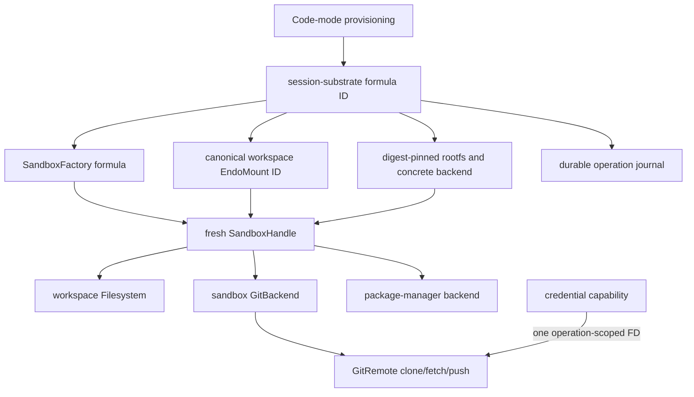

# Session-Scoped Sandbox Substrate

| | |
|---|---|
| **Created** | 2026-08-06 |
| **Author** | 0xpatrickdev (prompted) |
| **Status** | Proposed |
| **Builds on** | [endo-posix-sandbox](endo-posix-sandbox.md), [endo-fs-backend-seam](endo-fs-backend-seam.md), [daemon-mount-capabilities](daemon-mount-capabilities.md), [daemon-git-capability](daemon-git-capability.md), and [daemon-git-remotes](daemon-git-remotes.md) |

## Summary

An execution-capable agent session needs one durable authority boundary around
its workspace, native tools, network, Git, and package manager.
This design calls that boundary the **session substrate**.
The daemon retains its identity and policy, while a fresh `SandboxHandle`
realizes that policy for the current daemon lifetime.

The term **slice**, where used by `@endo/sandbox`, means the live
`SandboxHandle` together with its unified mount set and session-wide authority
binding.
It does not mean an independently durable kernel process, a workspace alone, or
an ambiguous collection of capabilities.

For v1:

- an execution session receives public-Internet egress through the sandbox
  `private` network profile, with host and private/LAN destinations blocked;
- one canonical `EndoMount` is mounted at `/workspace` and backs every granted
  sandbox filesystem, Git, and package-manager capability;
- the daemon owns the sandbox lifecycle and reconstructs an equivalent handle
  after an ordinary restart;
- local and remote Git operations, including clone, fetch, and push, execute
  through a sandbox-backed implementation of the existing ExoGit backend
  protocol;
- Git credentials cross the boundary only through process-scoped anonymous
  descriptors and are never persisted; and
- `EndoPackageManager` remains a fixed-argv npm/pnpm/Yarn capability with an
  injectable backend that borrows, but does not dispose, the session handle.

Review-only sessions may continue to use the existing host-backed filesystem
and native Git path without creating a session substrate.
V1 does not mutate such a retained session into an execution session.
The caller must provision a new execution session with its authority declared
at creation time.

## Problem and Scope

Current `llm` has the pieces but not the binding between them:

- `@endo/sandbox` mints live bwrap or Podman handles, but no daemon formula owns
  a session handle across reconstruction;
- code-mode provisioning creates `workspace` and `git-workspace` mounts for the
  same host path, so independently granted capabilities can diverge;
- `@endo/git` invokes Node filesystem and process APIs on host paths;
- `provideGitClone` injects the host-native `gitClone`, placing clone outside
  the ExoGit backend that subsequent repository operations use; and
- `@endo/package-manager` and `@endo/exo-package-manager` are not present on
  current `llm`, so their landing contract must not assume ownership of a
  sandbox or a per-spawn network switch.

This design covers execution-session construction, persistence, network
authority, local and remote Git, package-manager binding, and code-mode
provisioning.
It does not implement those components, design a general container
orchestrator, merge package execution with registry resolution, or extend the
Git transport contract beyond the existing HTTPS and explicitly test-only
local-file policies.

## Current Contracts That Constrain the Design

The design is based on current `llm`, not on the older layering proposal.

| Current seam | Consequence for this design |
|---|---|
| `SandboxHandle.spawn(argv, opts)` accepts `env`, `cwd`, `stdin`, and capture flags | There is no per-spawn `network` option. Network is selected once by `SandboxFactory.make` and inherited by every spawn. |
| Process stdout and stderr are `PassableBytesReader` capabilities | Consumers must adapt with `iterateReader` or equivalent `E(reader).next()` pumping; they are not JavaScript `AsyncIterable` values. |
| `SandboxFactory` accepts `Mount` capabilities and resolves their backing paths inside the factory | The session formula retains mount IDs and passes the capabilities to the factory; it never persists raw backing paths in its own record. |
| `@endo/platform/fs/extended` builds a `Filesystem` with `wrapBackend(FsBackend)` | Execution sessions add a sandbox filesystem backend; they do not project the host mount with `mountAsFilesystem`. |
| The ExoGit `GitBackend` protocol is already injected into the portable Git and `GitRemote` layers | Sandbox Git is another backend, not a second public Git interface. |
| The native backend identifies a repository by `(commonDir, configHash, rootCommit)` | Sandbox Git preserves and checks the same logical identity without using host Node filesystem or process powers. |
| `GitRemote` already carries URL, refspec, direction, force, tag, delete, and credential policy | The sandbox backend consumes the normalized policy; it does not rediscover authority from repository configuration. |
| Code-mode persistence is versioned, non-secret, and rejects authority changes on reconstruction | Execution policy becomes a versioned field and remains immutable for a retained session. |

The `private` profile is also only partially realized today.
Its declared semantics are public egress with the following destinations
blocked:

- IPv4: `10.0.0.0/8`, `172.16.0.0/12`, `192.168.0.0/16`,
  `100.64.0.0/10`, `169.254.0.0/16`, and `127.0.0.0/8`;
- IPv6: `fc00::/7`, `fe80::/10`, and `::1/128`.

The bwrap driver currently leaves the pasta/netns filtering work deferred, and
the Podman driver delegates filtering to operator configuration.
Neither is sufficient for the execution contract below.
The first implementation cuts therefore make `private` a tested driver
guarantee or report that the profile is unavailable.

## Architecture



The formula ID is the durable session-substrate identity.
The live handle is an incarnation of that formula, not the identity itself.
All native operations borrow the same incarnation and all filesystem-facing
capabilities refer to the same canonical workspace mount ID.

### Durable formula

The daemon adds a `session-substrate` formula and a host provisioning method,
`provideSessionSubstrate`.
Provisioning first resolves `backend: 'auto'` to a concrete compatible driver;
`auto` is never stored in the formula.
The resulting formula contains only non-secret, reconstruction-complete data:

| Field | Durable meaning |
|---|---|
| `sandboxFactoryId` | The `make-unconfined` formula that reconstructs the `SandboxFactory`. |
| `workspaceMountId` | The one writable or read-only workspace mount formula used by every granted capability. |
| `rootfs` | Either a rootfs mount formula ID or an immutable OCI reference pinned by digest. |
| `backend` | The concrete probed driver, initially `bwrap` or `podman`. |
| `mounts` | The canonical ordered mount specification, including `/workspace` and any separately named cache or scratch mount IDs. |
| `network` | Exactly `private` for an execution-capable v1 session. |
| `limits`, `seccomp`, `env`, `cwd` | The normalized, non-secret session-wide resource policy; `cwd` is `/workspace`. |
| `policyVersion` | The version of the reconstruction and authority contract. |

Formula dependency extraction and `context.thisDiesIfThatDies` cover the
factory, workspace, rootfs-mount, and additional mount IDs.
The maker looks them up, calls `SandboxFactory.make` with the exact recorded
specification, and places the resulting handle in manager-private state keyed
by the substrate formula ID.
Dependent filesystem, Git, remote, and package-manager formulas receive only a
captive borrower facet from that state; the guest never receives the raw
`SandboxHandle` unless a later, separately guarded process capability is
designed.

The formula registers exactly one `context.onCancel` owner.
That owner stops admission of new operations, cancels and reaps live children,
disposes the handle, and releases scratch resources.
Workspace, Git, and package-manager adapters may cancel their own operation,
but must not dispose the session handle.

### Canonical workspace and grants

Provisioning creates or looks up `workspace` once and records its formula ID as
`workspaceMountId`.
It removes the separate `git-workspace` mount.
The complete construction-time sandbox mount list binds that capability at
`/workspace`; dynamic `SandboxHandle.mount()` is not used for session setup.

The independently granted capabilities bind as follows:

- `workspace` is `wrapBackend(makeSandboxFsBackend(...))`, rooted at
  `/workspace` through the borrowed substrate handle;
- `git` is a portable ExoGit kit whose sandbox backend root is `/workspace` and
  whose formula also names `workspaceMountId` and `substrateId`;
- each `GitRemote` depends on that Git formula and uses its sandbox backend;
  and
- `packageManager` is constructed with the same `substrateId` and inner
  workspace root.

The `EndoMount` remains the durable physical authority, but execution-session
filesystem operations do not use its host-side method implementation.
`makeSandboxFsBackend` talks to a fixed, immutable filesystem bridge process
owned by the session substrate.
The bridge implements the required `FsBackend` core over a directory descriptor
for `/workspace`, accepts length-delimited canonical-CBOR requests containing
path-segment arrays, and returns bounded records or byte-reader capabilities.
It exposes no process-spawn or network method.

The bridge resolves every operation relative to the workspace directory
descriptor with Linux `openat2` `RESOLVE_BENEATH` and
`RESOLVE_NO_MAGICLINKS`, or an equivalently race-free driver primitive.
It uses relative `*at` operations for create, remove, and rename.
It never follows a workspace link into the immutable rootfs, cache mounts,
scratch HOME, or another mount.
The shared `wrapBackend` layer supplies the existing `Filesystem` exos and
synthesizes optional `FsBackend` methods that v1 does not implement.
Bridge death fails outstanding filesystem calls and is reported through the
substrate operation journal; only the substrate owner may restart it.

Read-only filesystem and Git grants remain independently expressible.
A writable Git grant still requires a writable workspace mount because Git
mutates the worktree.
Package-manager mutation likewise requires a writable workspace grant.
Grant records, aliases, the workspace mount formula, and the substrate formula
survive an ordinary daemon restart.

### Review-only sessions do not upgrade in place

The existing code-mode contract records an immutable authority policy and
requires exact agreement on reconstruction.
That is useful and remains unchanged.
A session created without execution may use the current host-backed mount and
`mountAsFilesystem` projection plus `NativeGitBackend`; it has no substrate
formula and no latent execution authority.

Requesting execution later creates a new retained session and formula graph.
If it reuses an existing workspace, provisioning must first stop writers in the
review-only session or copy the workspace, so two differently governed Git
backends do not race over one worktree.
V1 has no mutable retained-policy upgrade, handle swap, or authority widening.

## Network Contract

An execution-capable session always requests `network: 'private'` from the
factory.
That is a session-wide profile with useful public-Internet access and the block
ranges listed above.
Repository code, Git, package-manager clients, lifecycle scripts, test runners,
and every other process spawned through the handle inherit the same egress
authority.

DNS resolution is transport plumbing, not authorization.
The driver supplies a confined DNS proxy without exposing a general host
resolver socket.
For every connection, including a connection made after an HTTP redirect, the
driver filters the destination address after resolution and before connect.
Every re-resolution is checked again, so a public name that later resolves to
loopback, link-local, carrier-grade NAT, RFC 1918, or unique-local IPv6 is
blocked.
An implementation that filters only the first DNS answer, or trusts a hostname
after its first resolution, does not conform.

Both drivers must prove the contract with public echo, blocked IPv4 and IPv6,
redirect-to-private, and DNS-rebinding-style tests.
The tests use controlled endpoints and packet-level destination checks rather
than assuming a particular DNS client cache.
A backend unable to provide both confined DNS and connection-time filtering
reports `private` unavailable, and substrate reconstruction fails closed.

There is deliberately no `network` field in `SpawnOpts`.
Origin allowlists, per-operation offline mode, separate Git and package
registry profiles, and other finer egress policies are later work.
A package manager's `offline` flag may select its native cache-only argv, but it
does not attenuate the session's network authority.

## Sandbox Lifecycle Prerequisites

The session substrate depends on the following fixes rather than papering over
them in each consumer.

| Hazard in current code | Required contract and stop condition |
|---|---|
| `spawn` can pass its disposed check, await the driver, and register after `dispose` snapshots the live set | A `starting/running/stopping/stopped` admission state serializes spawn registration with disposal. A race test proves no process or mount survives either winner. |
| `auto` selects the first registered driver | Selection probes availability, rootfs compatibility, network-profile conformance, and required secret-FD support. Provisioning records the selected driver. |
| Real process streams become `PassableBytesReader` capabilities | Shared pumps use `iterateReader` or `E(reader).next()` and test real bwrap and Podman processes, cancellation, split UTF-8, and reader failure. |
| Output collection notices the cap only after EOF | Hitting either stdout or stderr cap immediately terminates the process, continues bounded draining, escalates to hard kill after grace, reaps it, and reports truncation. A never-EOF fixture must finish within a test deadline. |
| A bwrap child or Podman container can outlive a crashed daemon | Bwrap uses parent-death/process-group containment; Podman uses formula-labelled, exact orphan reconciliation before reconstruction. Tests kill the daemon ungracefully and prove old PIDs or containers are gone. |
| `private` is documentation or operator setup rather than a driver guarantee | Both drivers install and probe the complete egress filter and fail closed when they cannot. |
| Dynamic mount tracking is not an OS remount | The session passes its complete canonical mount set at construction; later mount mutation is outside v1. |
| A host-projected filesystem can race attacker-created links after repository code runs | Execution sessions use `makeSandboxFsBackend` and a dirfd-relative, race-free bridge inside the same mount namespace. Host `mountAsFilesystem` remains review-only. |

These are substrate requirements, not optional cleanup.
They precede daemon integration so later backends share one tested lifecycle.

## Sandbox-Backed Git

### Backend and paths

`makeSandboxGitBackend` implements the existing ExoGit backend protocol.
It accepts the borrowed session handle, the canonical `/workspace` inner root,
the retained repository identity, a fixed Git executable path from the rootfs,
and an operation runner supplied by the substrate.
It does not import Node `child_process`, `fs`, `path`, `process`, or `realpath`.

Every repository path crossing the portable/backend seam is a validated
workspace-relative path.
The backend joins it to `/workspace` using POSIX inner-path rules and rejects
absolute paths, `..`, NUL, and paths outside the canonical mount.
All Git argv begins with the current native backend's hardening base: hooks,
credential helpers, fsmonitor, external attributes, signing, paging, and
interactive prompting are disabled unless the operation-specific runner
explicitly supplies the safe replacement.
The rootfs must provide Git 2.30 or newer.

Local status, diff, staging, commit, history rewrite, tree reads, and identity
queries therefore execute inside the sandbox.
There is no fallback to `NativeGitBackend` after execution is granted.

### Repository identity

The sandbox backend preserves the existing logical identity tuple:

```text
(commonDir relative to /workspace, hash of effective safe config, rootCommit)
```

It obtains the components through fixed Git commands inside the sandbox and
hashes normalized output outside the child process.
The Git formula durably records the expected tuple.
Every operation checks it before mutation; clone records it only after the
destination has been created successfully, and the existing empty-to-first-root
transition updates it through the formula's identity controller.

If the repository is replaced while the daemon is down, reconstruction may
recreate the session handle, but Git operations fail with a repository-identity
error.
They never silently adopt the replacement.

### Clone, fetch, push, and `GitRemote`

Clone is moved behind the same sandbox runner used by the backend.
`provideGitClone` accepts a daemon-minted destination mount, a validated
destination path relative to that mount, a normalized remote endpoint, the
remote policy, and optional credential capability.
It rejects an existing non-empty destination and never resolves a host path in
the daemon host module.
The cloner invokes fixed `git clone` argv with `/workspace/<destination>` and
then constructs the Git and origin-remote formulas over the resulting identity.

Fetch, pull, and push continue through the existing `GitRemote` capability.
The URL used on every network operation is the normalized policy URL, not a URL
read from local Git configuration.
Remote URLs containing userinfo are rejected.
Refspec, direction, force-push, tag, delete, and local-file-transport checks are
performed before spawning Git.
Configuration keys that can replace or rewrite the transport, credential
helper, hooks, or executable are rejected or overridden by the fixed base argv.

HTTPS is the v1 authenticated transport.
The existing explicit local-file transport remains available for controlled
tests only.
SSH key transport and arbitrary Git helpers are later designs.

### Operation-scoped credentials

The current native askpass framing is retained conceptually, but the transport
becomes a sandbox driver primitive.
`SpawnOpts` gains a guarded `secretInputs` collection whose values are
host-private, one-shot `PassableBytesReader` capabilities and whose entries are
mapped to anonymous child descriptors.
Raw pass-by-copy secret bytes are not valid spawn options.
This is not an environment-value facility.

For a credentialed Git operation:

1. The daemon resolves the `GitCredential` capability, validates its audience
   against the normalized remote origin, and obtains role-tagged username and
   secret frames only after policy checks pass.
2. The driver creates an anonymous pipe and a readiness pipe.
   The secret bytes are not written yet.
3. A fixed launcher in the rootfs starts the selected child with all
   capabilities dropped, makes the process non-dumpable, closes unrelated
   descriptors, and acknowledges readiness.
4. The daemon writes the bounded credential frame, closes and zeroes its local
   byte buffers, and starts no retry with the same material after cancellation.
5. `GIT_ASKPASS` names a fixed helper in the immutable rootfs,
   `GIT_ASKPASS_FD` contains only the descriptor number, and
   `GIT_TERMINAL_PROMPT=0` prevents fallback prompting.
   The helper returns only the field matching Git's prompt and closes the
   descriptor when done.

Bwrap passes the inherited descriptor directly into the per-spawn PID
namespace.
For a secret-bearing spawn, Podman uses a one-operation container owned by the
same handle, with the same image digest, canonical mounts, network profile,
limits, and labels, but a distinct PID namespace from ordinary session
processes.
It pins and probes a runtime that supports preserved descriptors (the
documented `--preserve-fd` path is runtime-specific), and removes the operation
container after reap.
The Podman conformance test runs an unrelated concurrent session process and
proves that `/proc/<pid>/fd`, process environment, and command-line inspection
cannot recover the credential.
If the selected runtime cannot make that guarantee, credentialed clone, fetch,
and push fail closed; no temporary-file or environment fallback is permitted.

Secret material must never enter argv, an environment value, a formula,
persistent or scratch mounts, Git configuration, logs, model context, or
captured stdout/stderr.
Error formatting redacts endpoint userinfo and askpass replies.
Cancellation and credential revocation close the pipe, kill and reap the Git
process, and discard unused frames.

## Package-Manager Boundary

`EndoPackageManager` covers npm, pnpm, and Yarn only.
It is an Exo capability over an injectable backend, while the portable backend
layer validates requests and constructs fixed argv arrays.
It never accepts a shell command, shell fragment, arbitrary executable, or
opaque extra arguments.

The production sandbox backend receives a `SessionSubstrateBorrower` and
`/workspace`.
It queues operations through the substrate, adapts `PassableBytesReader`
streams, terminates at output caps, and reports structured exit results.
It has no `SandboxFactory`, no authority to create a different mount or network
profile, and no call to `SandboxHandle.dispose()`.
Its own `close()` only stops accepting package-manager requests and cancels its
operation leases; disposal remains with the session formula.

Install, run-script, and package-manager-native lifecycle children all inherit
the session's `private` public-egress profile.
Manager-specific offline options are fixed argv selections and do not represent
a network revocation.
The rootfs pins the supported npm, pnpm, and Yarn binaries or package-manager
shim versions so reconstruction does not silently change tool behavior.

Registry resolution, registry fetch, CAS import, lockfile-to-module-graph
mapping, and daemon worker import remain separate capabilities and packages.
Python, Rust, Go, and other language package managers are future sibling
capabilities, not modes added to `EndoPackageManager`.

## Daemon Restart and Failure Semantics

An ordinary restart preserves:

- the `session-substrate` formula ID and normalized policy;
- the workspace mount formula and its files;
- the canonical mount specification and concrete backend/rootfs selection;
- the workspace, Git, remote, and package-manager grant formulas and aliases;
  and
- a bounded, non-secret operation journal.

It does not preserve a kernel namespace, bwrap process, Podman container, live
`SandboxHandle`, child process, pipe, stream, secret, or pending promise.
On startup, the daemon first reaps formula-labelled leftovers.
It then marks every operation journal row left in `running` state as
`interrupted` with reason `daemon-restart`, and only then reconstructs a fresh
handle from the durable formula.
The disconnected caller receives a rejected operation; no Git command, package
install, test, or script is silently replayed.
A host-only substrate inspection facet exposes the interruption record so code
mode can report what must be retried explicitly.

If reconstruction cannot find the concrete driver, rootfs, workspace mount, or
conforming network/secret features, the formula becomes unavailable with a
structured `sandbox-unavailable` cause.
Dependent execution capabilities remain unavailable and do not fall back to
host processes.
The workspace and durable formula records remain intact for repair and retry.

Purging the daemon store out of band is an explicit destructive reset.
It can remove the retained formula graph, aliases, journal, and daemon-owned
scratch workspace.
An externally backed workspace directory might remain on disk, but it is no
longer a retained session until explicitly reprovisioned and revalidated.

## Code-Mode and Pi Provisioning

`provisionEndoCodeMode` remains the product-level entry point.
An execution-enabled versioned policy asks the daemon host for the canonical
workspace mount and `session-substrate` formula before constructing guest
bindings.
The durable formula ID is retained under the deterministic session controller
path as `session-substrate`; whether that path is the current
`pi-code/session-…` layout or the harness-scoped `code-mode/pi/session-…`
layout proposed by PR #907 does not affect formula identity.

Provisioning then binds only the independently granted guest capabilities:
`workspace`, `git`, named remotes, and `packageManager`.
The raw session handle and host-private operation-control facet are not model
globals.
The Pi extension calls this high-level provisioning API, retains only the
versioned non-secret policy needed to reconnect, and closes only its CapTP
client on ordinary session shutdown.
It does not construct a `SandboxFactory`, choose a driver, dispose the sandbox,
or own daemon cleanup.

PR [#907](https://github.com/endojs/endo-but-for-bots/pull/907) was verified on
2026-08-06 as an evaluate-only Pi extension and launcher over retained code-mode
provisioning.
It changes no sandbox, Git backend, or package-manager implementation.
It is orthogonal, may land independently, and must not be held for this
substrate; the eventual code-mode integration rebases onto whichever retained
path layout is then current.

## Dependency-Ordered Landing Plan

Each cut has an independently testable stop condition.

1. **Sandbox lifecycle, streams, and bounded termination.**
   Serialize spawn/dispose, make concrete driver selection probe capabilities,
   standardize `PassableBytesReader` pumps, kill on output cap before EOF, and
   add crash-orphan reconciliation.
   Stop when race, never-EOF, reader-failure, and daemon-crash tests pass for
   both available drivers without leaked processes or containers.
2. **Private egress and process-scoped secret plumbing.**
   Make the `private` profile a driver guarantee and add guarded secret-input
   descriptors with the non-dumpable readiness handshake.
   Stop when public access works, every declared private destination plus
   redirect/rebinding is blocked, and concurrent-process credential probes fail
   for bwrap and Podman.
3. **Durable daemon session substrate and filesystem.**
   Add the formula, dependency extraction, concrete backend/rootfs persistence,
   operation journal, captive borrower facet, canonical mount construction,
   sandbox `FsBackend` bridge, and single cancellation owner.
   Stop when an ordinary restart preserves formula and workspace identity,
   creates a new handle, reports an interrupted operation, and fails closed
   when a reconstruction dependency is removed; filesystem conformance must
   also prove that concurrent symlink swaps cannot expose rootfs, cache, or host
   paths.
4. **Sandbox Git local operations and clone.**
   Implement `makeSandboxGitBackend`, move clone behind its runner, preserve the
   repository identity tuple, and eliminate host path/process imports from the
   execution path.
   Stop when the existing local Git contract suite and clone identity tests run
   against both drivers and a host-process spy observes no Git execution.
5. **Sandbox Git remotes and credentials.**
   Route fetch, pull, and push through the backend using policy URLs and
   operation-scoped askpass descriptors.
   Stop when HTTPS clone/fetch/push, denial/refspec tests, revocation,
   cancellation, redaction, and restart credential-unavailable tests pass on
   both drivers.
6. **Package-manager capability and borrowed backend.**
   Land the portable npm/pnpm/Yarn Exo contract and its injected sandbox
   backend with explicit borrowed ownership.
   Stop when fixed-argv tests reject shell/extra-executable input, real reader
   and output-cap tests pass, installs reach a controlled public registry, and
   closing the capability leaves the session handle usable.
7. **Code-mode grants and canonical bindings.**
   Version the provisioning policy, remove `git-workspace`, add
   `packageManager`, and obtain the substrate through the daemon host surface.
   Stop when review-only sessions remain host-backed, execution sessions expose
   only requested capabilities, reconstruction cannot widen policy, and Pi
   cleanup leaves the durable substrate retained.
8. **End-to-end execution scenario.**
   Provision one execution session, clone or open a repository, inspect and edit
   it through `workspace`, install with one of npm/pnpm/Yarn, run a bounded test,
   commit, fetch and push to a credentialed controlled remote, restart the daemon
   between steps, and explicitly retry one reported interrupted operation.
   Stop when all operations observe one workspace identity and no host Git,
   private destination, secret, process, or mount leak is detected.

The rootfs/toolchain fixture needed by cuts 4 through 8 is prepared in cut 3
and pinned by digest.
No cut after 2 may claim production execution support for a driver that has not
passed both network and secret-isolation conformance.

## Implementation Blockers and Later Hardening

The implementation blockers are concrete, but none require a product-policy
decision:

- both drivers need enforceable `private` networking rather than documented
  operator setup;
- Podman must prove a pinned runtime and non-dumpable preserved-FD path, or
  credentialed operations on that backend remain unavailable;
- sandbox consumers need the real `PassableBytesReader` adapter and immediate
  output-cap termination;
- sandbox spawn/dispose and crash cleanup need a leak-free lifecycle; and
- the immutable rootfs must include the race-free filesystem bridge, compatible
  Git, Node, npm, pnpm, Yarn, and the fixed askpass/secret launcher.

Later hardening includes per-origin and per-operation egress attenuation, SSH
transport, cache-specific mounts and quotas, more language package managers,
nested slices, mutable review-to-execution migration, and richer operation
auditing.
None is required to define or safely ship the v1 session substrate.

## Alternatives Rejected

- **Offline-only execution:** insufficient for real clone, fetch, push, install,
  and test workflows.
- **A sandbox per capability:** creates divergent mount, lifecycle, and network
  policy and reintroduces host escape between operations.
- **Treating a live handle as durable:** an OS sandbox and its children cannot
  survive daemon process loss; only formula identity and persistent mounts do.
- **Keeping host-projected filesystem or native Git after execution is
  granted:** leaves file traversal, clone, and remote subprocesses outside the
  session authority boundary.
- **Credential files or secret environment variables:** expose material to
  mounts, process inspection, cleanup races, and unrelated session children.
- **Merging package management with registry import:** combines executing
  project-selected scripts with resolving and importing module graphs, which
  have different authority and persistence contracts.
- **An in-place review-to-execution upgrade:** conflicts with immutable retained
  policy and creates a split-brain workspace during handle replacement.

## Open Questions

None block v1 sequencing.
The selected rootfs digest, Podman runtime, and backend availability are
deployment inputs validated before the durable formula is created, not
authority questions deferred to an implementer.

## Prompt

> Write a standalone in-project design for a durable, session-scoped sandbox
> substrate.
> Settle useful public egress with private/LAN blocking, daemon-restart
> reconstruction, one substrate for independently granted workspace/Git/package
> manager capabilities, sandboxed local and remote Git with process-scoped
> credentials, the npm/pnpm/Yarn package-manager boundary, Pi/code-mode
> provisioning, lifecycle prerequisites, and a dependency-ordered landing plan.
> Do not implement runtime packages or claim that a live OS sandbox survives a
> daemon restart.
