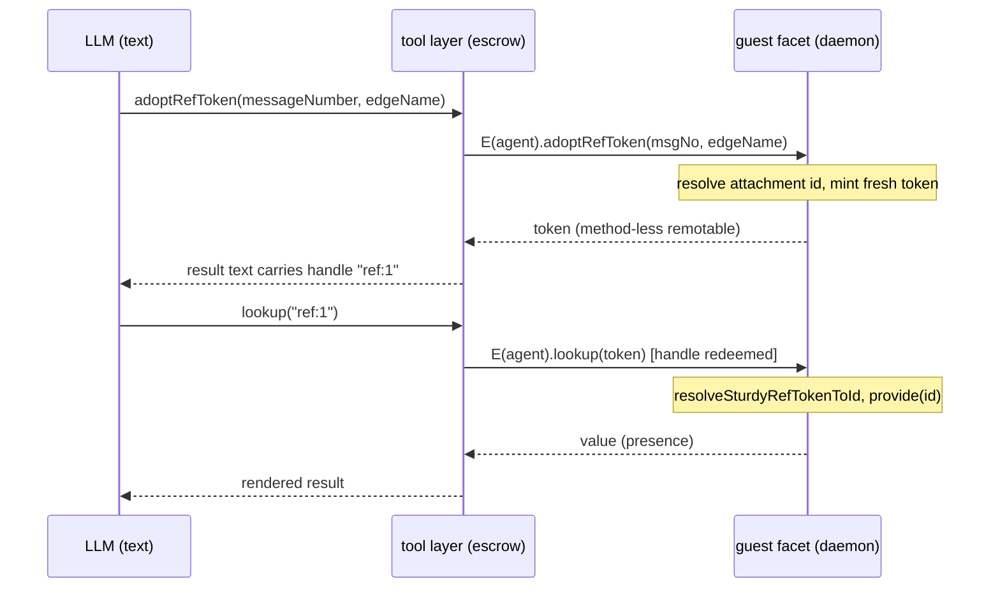

# SturdyRefs Throughout: the Agent Provide/Accept Surface and the Guest Token

| | |
|---|---|
| **Created** | 2026-07-11 |
| **Author** | endolinbot (prompted) |
| **Status** | Not Started |

## Summary

The SturdyRef effort so far gives the platform a first-class `'sturdyref'`
pass-style category (PR #521) and daemon read-side threading at the facet
boundary (PR #541, cuts 3 and 4 of
[sturdy-refs-ocapn-enlivenment](sturdy-refs-ocapn-enlivenment.md)).
What remains for the effort's finish line is the "throughout" bar: Endo
agents (Lal, Fae, Genie, and `@endo/agent-tools`) can hand out a sturdy
reference for a value they hold (**provide**) and accept one they are given
(**accept**), so a guest agent passes a retained reference **as a value in a
tool call** instead of naming it in a namespace.

This design does three things:

1. **Settles the open token-representation question** from the enlivenment
   design: the guest-scoped opaque token is a **daemon-minted, method-less
   remotable** (interface label `SturdyRefToken`), minted **fresh per grant**
   and bound off-band in a module-private `WeakMap` on the daemon side,
   exactly parallel to PR #541's `sturdyRefToId`. Guarded facet methods admit
   it through a **sum pattern**, not through a location-less variant of the
   `'sturdyref'` category.
2. **Specifies provide and accept** for the daemon agent surface and for each
   of the four agent packages, including the **text-tier ref escrow** that
   lets a reference cross the LLM boundary as a short handle while the
   capability itself never enters the model's token stream.
3. **Binds Distributed Confinement**: the three invariants (no-location,
   no-identification, opaque-and-unforgeable) are restated as acceptance
   criteria, every provide/accept path names the invariant it preserves, and
   the token tier is admitted **only by value-producing methods**, never by
   methods that return a stable name (an identifier or a locator).

No retention machinery is introduced, consistent with the enlivenment
design's direction: a token is revoked by the daemon **forgetting** its
binding, and the open enlivened-presence-lifetime question stays open.

## What is the Problem Being Solved?

The enlivenment design commits to a two-tier split: the location-bearing
SturdyRef for trusted holders and the wire, and a fresh, unlinkable, opaque
token per grant for confined guests. It deliberately leaves the token's
concrete shape open ("its own pass-style category, a daemon-minted
remotable, or a payload-free per-instance identity"), and it does not say
how the four agent packages mint, render, or accept either tier.

A survey of the packages (at `llm` head `f7932ed5a9`) shows the gap
concretely. None of the four passes a capability as a value across the LLM
boundary today:

- **Lal** (`@endo/lal`, an unconfined daemon plugin holding a **guest**
  facet) marshals tool arguments and results with a SmallCaps codec
  (`smallcapsMarshal` in `packages/agentry/src/harness/marshal.js`, used by
  `packages/lal/tool-dispatch.js`) whose slot table is **always empty**: the
  default slot converters throw if a remotable reaches the boundary. Every
  tool references daemon values by pet-name-path (`NamePathShape` /
  `NameOrPathShape` from `@endo/daemon/type-guards.js`).
- **Fae** (`@endo/fae`, a factory caplet minting per-agent guests) uses
  plain JSON tool arguments. Its `renderToolResult`
  (`packages/fae/src/tool-makers.js`) detects a presence in a tool result
  and renders a **textual description** of its method names: a description,
  not a referenceable handle.
- **Genie** (`@endo/genie`) traffics in workspace-relative path strings;
  capabilities (the workspace `Mount`, the sandbox slice handle) live inside
  tool closures and are chosen by pet name on the config form.
- **`@endo/agent-tools`** is a pure library pairing JSON Schemas with
  capability-backed `invoke` functions (`makeTool` in
  `packages/agent-tools/src/tool.js`). It deliberately keeps capabilities
  off the wire: `packages/agent-tools/src/git-mount-tool.js` strips
  authority-bearing entries out of `status()` rows before they cross.

Capabilities move between agents only through the daemon mail surface (the
`(strings, edgeNames, petNamesOrPaths)` triple of `send` / `reply`, adopted
by edge name into a namespace). So today the **only** way for an agent to
retain or transfer a reference is to name it. The finish-line bar is
namespace-free designation: a reference as a value.

Two boundaries must therefore be designed together:

1. the **daemon <-> worker boundary** (CapTP): which artifact represents the
   guest tier, and which facet methods admit it, and
2. the **tool layer <-> LLM boundary** (text): how a reference appears in a
   tool result and how the model passes it back in a later tool call.

## Background (what this design builds on)

- **PR #521** (`packages/pass-style/src/sturdyref.js`): the `'sturdyref'`
  category is shape-only. `SturdyRefHelper` recognises and validates (an
  instance with no own properties, a tag-record prototype carrying a
  get-only `location` accessor and an optional `type` hint); construction
  belongs to the CapTP session manager. The swiss number is never a
  property.
- **PR #541** (`packages/daemon/src/sturdyref-resolution.js`): the daemon
  mints SturdyRefs (`mintSturdyRef`) bound off-band in a module-private
  `sturdyRefToId` `WeakMap`, and resolves them at the facet boundary
  (`resolveSturdyRefToId`) inside `lookup`, `maybeLookup`, `identify`,
  `locate`, `list`, `listIdentifiers`, `listLocators` (in
  `packages/daemon/src/directory.js`) and the `evaluate` /
  `makeUnconfined` endowment slots (in `guest.js` and `host.js`). The
  guards (`packages/daemon/src/interfaces.js`) use `M.kind('sturdyref')`
  in sum shapes such as `NameOrPathOrSturdyRefShape`. Resolution authority
  is the off-band map, never the readable `location`: a structurally valid
  forgery has no binding and is rejected.
- **The guest facet** (`packages/daemon/src/guest.js`, `makeGuestMaker`) is
  distinct from the host facet and shares the name-hub methods through
  `nameHubMethodGuards`. Guests hold `@agent`, `@self`, `@host`, `@mail`,
  `@nets`; hosts add provisioning (`provideGuest`, `provideWorker`,
  `provideMount`, `provideGit`, `provideShell`, and the rest).
- **Pattern-matching fact** (verified in
  `packages/patterns/src/patterns/patternMatchers.js`,
  `matchRemotableHelper`): `M.remotable(label)` matches **any** remotable;
  the label is documentation for error messages only. A guard can therefore
  only **route** a token-shaped argument; it cannot authenticate one. The
  authenticating check is the daemon's off-band binding, exactly as it
  already is for SturdyRefs in #541.

## Design

### The guest token is a daemon-minted, method-less remotable

A new daemon module `packages/daemon/src/sturdyref-token.js` (sibling and
mirror of `sturdyref-resolution.js`) exports:

- `mintSturdyRefToken(id)`: returns a fresh, method-less exo (interface
  `M.interface('SturdyRefToken', {})`, so its `passStyleOf` is
  `'remotable'` and its alleged name is `SturdyRefToken`) and records
  `tokenToId.set(token, id)` in a module-private `WeakMap`. Every call
  mints a **new** token, even for the same `id`: fresh per grant is the
  unlinkability mechanism, not an optimisation choice.
- `isSturdyRefToken(value)`: true exactly when `tokenToId.has(value)`.
  Note this is a **binding** check, not a structural check; a look-alike
  remotable with the same interface label is simply not a token here.
- `resolveSturdyRefTokenToId(token)`: returns the bound
  `FormulaIdentifier` or throws. The formula identifier never crosses out
  of the daemon on this path (see the method mask below).
- `revokeSturdyRefToken(token)`: deletes the binding. A revoked token can
  never again be resolved; this is the same revocation-by-forgetting shape
  the enlivenment design specifies for sturdyrefs (forget the swiss
  number) and #541 implements for `sturdyRefToId`.

The token carries **no payload**: no `location`, no `type` hint, no own
properties, no methods. Everything a guest can reach from it is the
remotable prototype machinery and a constant interface label shared by
every token, which identifies the **kind**, never the referent.

#### Why a remotable, against the alternatives

The open question in the enlivenment design lists three candidate shapes.
The remotable wins on the identity requirement that the other two cannot
meet without new machinery:

**The token must keep its identity across the daemon <-> worker CapTP
boundary.** A token is granted daemon-to-worker and later passed back
worker-to-daemon inside a tool-call argument. Resolution and
unforgeability both hang on the daemon recovering **the same object it
minted** so the `WeakMap` lookup lands. CapTP preserves identity for
exactly two passable categories today: remotables and promises, via the
session's export/import slot tables. A remotable rides that machinery
with **zero** new pass-style, marshal, or wire-codec work.

- **Its own pass-style category** (or a location-less "guest form" of
  `'sturdyref'`): a pass-by-copy category cannot round-trip identity, so
  the category would need its own identity-bearing slot type in every
  CapTP layer, plus the `@endo/marshal` rank-order entry that is already
  the named blocker deferring `M.sturdyRef()` in `@endo/patterns`. That
  is the full cross-cutting cost of #521 and its deferred follow-ups a
  second time, for a value whose defining property is that it carries
  nothing. The location-less-guest-form variant is worse still: it makes
  one category mean two contradictory contracts (#521's `assertRestValid`
  makes `location` **mandatory**, and every trusted-tier consumer is
  entitled to read it), and any shared readable payload that made two
  copies "the same token" would itself be the correlation channel
  invariant 2 forbids.
- **A payload-free per-instance identity like the pre-#521 shim**
  (`makeTagged('ocapn-sturdyref', undefined)` plus a side `WeakMap`):
  tagged values are pass-by-copy, so the identity does **not** survive
  the boundary crossing. The pre-#521 shim only worked because the OCapN
  codec re-keyed identity from the wire payload (peer plus swiss number),
  which is precisely the payload a guest token must not carry. This shape
  fails the mediated-resolution test and the unforgeability test at the
  first boundary crossing.
- **Considered and rejected: a sealed-blob data token** (formula id plus a
  fresh nonce, authenticated-encrypted under a daemon key). It narrowly
  passes the confinement tests (fresh nonce per grant makes ciphertexts
  unlinkable) and would survive a daemon restart, but it adds a crypto
  and key-management surface the daemon does not otherwise need, and as
  plain data it is indistinguishable from any other string at the guard
  layer. Reason for rejection: the c-list already gives unforgeable,
  payload-free identity for free; do not rebuild it out of cryptography.

There is also a positive ocap argument, not just a cost argument: the
guest tier is defined by what it **grants** (mediated resolution by the
daemon) rather than what it **carries** (nothing). A remotable is the
platform's native representation of pure authority without data. The
location-bearing SturdyRef is inert data because its essence is a
re-acquirable address; the token is a live grant because its essence is a
standing promise by the mediator. The two tiers differ in kind, and their
representations should say so.

Two further properties fall out of the remotable choice for free:

- **Delegation works.** A token is an ordinary passable; a guest may pass
  it to a peer (through mail, or through any presence it can reach) and
  the recipient's facet resolves the same binding. Resolution is
  bearer-style within the daemon's session graph. Considered and
  rejected: scoping resolution to the granted guest. Reason: it breaks
  ordinary ocap delegation for no confinement gain, since unlinkability
  is about **independent** grants, which always mint fresh tokens.
- **Cross-peer transit needs no new wire form.** A token that travels to
  an OCapN peer travels as an ordinary remote presence (third-party
  handoff), resolving back at the minting daemon. No `ocapn-sturdyref`
  codec change and no locator disclosure is involved.

#### Guard admission: the sum pattern

Facet methods admit the guest tier by **sum**, extending #541's shapes in
`packages/daemon/src/interfaces.js`:

```js
const SturdyRefShape = M.kind('sturdyref');
const SturdyRefTokenShape = M.remotable('SturdyRefToken');
const RefShape = M.or(SturdyRefShape, SturdyRefTokenShape);
const NameOrPathOrRefShape = M.or(NameOrPathShape, RefShape);
```

Not one category with a location-less guest form, for the reasons above.
Because `M.remotable(label)` admits any remotable, the guard is a router,
not an authenticator: a fabricated token passes the guard and is rejected
at `resolveSturdyRefTokenToId`, exactly as a structurally valid forged
SturdyRef passes `M.kind('sturdyref')` and is rejected at
`resolveSturdyRefToId` in #541. Facet dispatch order at each widened
method: `isSturdyRef` first (structural), then `isSturdyRefToken`
(binding), then the pet-name-path.

The widened shapes are re-exported through `@endo/daemon/type-guards.js`
alongside `NamePathShape` and friends, so Lal's tool parameter matchers
(and any other consumer) name the same shapes the facets enforce.

#### The method mask: tokens are admitted only where the result is the value

This is the one place the token tier is **narrower** than the SturdyRef
tier, and the confinement tests force it. `locate(token)` would return an
`endo://` locator (peer key and formula address): a direct violation of
invariant 1, since a locator **reachable from a token** is exactly what
the cannot-read-a-locator test asserts against. `identify(token)` would
return the formula identifier: a stable, guest-comparable name that (a)
lets two tokens for one object be correlated by string equality, and (b)
outlives revocation (with the id in hand, `lookupById` works forever
after the token binding is forgotten), converting a revocable grant into
an irrevocable one.

The rule, stated once and applied uniformly at every facet (host and
guest alike): **a token is admitted only by methods whose result is the
designated value or an effect on it, never by methods whose result is a
stable name for it.**

| Method (shared name-hub, per #541's table) | SturdyRef | Token |
|---|---|---|
| `lookup`, `maybeLookup` | admitted | **admitted** |
| `evaluate` endowment slots, `makeUnconfined` slots | admitted | **admitted** |
| `list` (names within a designated directory) | admitted | **admitted** |
| `identify` | admitted | rejected (stable name) |
| `locate` | admitted | rejected (location) |
| `listIdentifiers`, `listLocators` | admitted | rejected (stable names / locations reachable from a token) |
| `write`, `remove`, `move`, `copy` targets | names only | names only |
| `reverseLookup`, `reverseIdentify`, `reverseLocate` | not widened (per the enlivenment design) | not widened |

Post-resolution knowledge is out of the mask's scope on purpose: a guest
authorised to resolve two tokens can compare the **values** it receives
(the enlivenment design already documents convergence-on-value as the
guarantee enlivenment provides). Unlinkability is a property of tokens
**as tokens**, before and without resolution; the mask keeps the tokens
themselves, and everything reachable from them without taking the value,
free of identity and location. A granter who needs even the resolved
values to be uncorrelatable must attenuate the values (a membrane per
grant), which is out of scope here and noted as prior art in the
Distributed Confinement doctrine rather than solved by this design.

### Provide: minting is daemon-side; the facet decides the tier

Minting happens **only on the daemon side of the boundary**. Agents and
workers never hold the closely-held OCapN network capability, never see a
swiss number, and never see a formula identifier on the token path. The
tier a recipient gets is decided by **which facet method exists where**:

- `makeRefToken(petNamePathOrRef) -> SturdyRefToken` joins the **shared**
  name-hub surface (defined once in `directory.js`, carried up through
  `guest.js` and `host.js` the same way `writeLocator` is): resolve the
  argument to a formula identifier at the facet boundary (pet-name-path
  through the existing path, a SturdyRef through
  `resolveSturdyRefToId`, a token through `resolveSturdyRefTokenToId`,
  which makes re-tokening a fresh unlinkable handle for delegation), then
  `mintSturdyRefToken(id)`. Every call returns a fresh token.
- `makeSturdyRef(petNamePathOrSturdyRef, type?) -> SturdyRef` is
  **host-only** (in `host.js`, guarded on `HostInterface` only): resolve,
  then #541's `mintSturdyRef(id, type)`. Its guard admits pet-name-paths
  and SturdyRefs but **not** tokens, per the method mask: upgrading a
  token to a location-bearing artifact is a stable-name-producing act, so
  it must route through taking the value and naming it, never directly
  through the token.
- `adoptRefToken(messageNumber, edgeName) -> SturdyRefToken` joins the
  mail surface beside `adopt` (in `mail.js`, surfaced on both facets):
  resolve the attachment's formula identifier exactly as `adopt` does,
  but instead of binding a pet name, mint and return a fresh token. This
  is namespace-free acceptance of a mail grant, the exact affordance the
  finish-line bar names.

So a confined guest can only ever mint and hand out tokens; a host can
mint either tier and chooses per recipient: **location-bearing SturdyRef
for trusted or wire peers, fresh opaque token for confined guests**. When
a value moves between agents through mail, refs never travel as refs: a
ref in the sender's `petNamesOrPaths` entry resolves to a formula
identifier at the **sender's** facet, and the recipient re-derives its
own tier's designator (`adopt` for a name, `adoptRefToken` for a token).
Fresh-per-grant unlinkability across independently granted parties falls
out by construction.

### Accept: the daemon table

The read-side table from the enlivenment design, extended with the token
column, is the method mask above. Beyond the name-hub methods, the mail
and store surfaces widen as follows (all entries resolve at the facet
boundary, dispatch order sturdyref / token / path):

| Method | Today | After |
|---|---|---|
| `send(recipient, strings, edgeNames, petNamesOrPaths)` | path entries only | each entry may be a SturdyRef or token |
| `reply(msgNo, strings, edgeNames, petNamesOrPaths)` | path entries only | same widening |
| `editMessage(...)` | path entries only | same widening |
| `resolve(msgNo, petNameOrPath)` | path only | also SturdyRef or token |
| `storeRef(nameOrPath, ref)` | (new) | binds a pet name to the referent of a SturdyRef or token; the durable-retention affordance |
| `adopt(msgNo, edgeName, petName)` | unchanged | unchanged (edge-name based) |
| `adoptRefToken(msgNo, edgeName)` | (new) | fresh token for an attachment, no namespace write |

`storeRef` deserves its confinement note: it binds a name daemon-side
(name to formula identifier, like `write`), and the guest's namespace then
behaves as any adopted value's does today, including `identify(petName)`
revealing the id. That is not a token leak; it is the ordinary,
pre-existing semantics of holding a value by name. Revoking a token stops
future resolution **through that token**; it does not claw back what a
guest already resolved and retained, exactly matching the enlivenment
design's revocation semantics for sturdyrefs (forgetting the swiss number
does not tear down an already-enlivened presence).

### The text-tier ref escrow: how a reference crosses the LLM boundary

An LLM's tool calls and results are text. A remotable (or a SturdyRef)
cannot enter the model's token stream, and must not be flattened into one
(any textual serialisation of the artifact itself would be either a
forgeable string or a leaked payload). The design is an **escrow** (a
slot table) in the tool layer, inside the agent's own trust domain:

- **Outbound (provide, tool results):** when a tool result contains a
  SturdyRef or token, the tool layer escrows the value and renders a
  short handle in the text shown to the model.
- **Inbound (accept, tool arguments):** when a tool argument carries a
  handle the escrow recognises, the tool layer redeems it back to the
  escrowed value **before** guard matching and dispatch, so the daemon
  facet receives the real artifact.

The handle is minted locally by the agent's own tool layer (a counter,
`ref:1`, `ref:2`, ...), derived from nothing about the referent. It
carries no location and no identity by construction, and it is
meaningless outside the agent's transcript. The escrow is **restricted to
the two ref tiers**: it does not open the tool boundary to arbitrary
remotables, so the existing plain-data discipline of every tool layer is
otherwise unchanged.



Per package:

- **`@endo/agent-tools`** gains the shared utility: `makeRefEscrow()` in a
  new `src/ref-escrow.js`, returning `{ escrow(ref) -> handle,
  redeem(handle) -> ref, has(handle) }` over a per-agent `Map`, escrowing
  only values that are SturdyRefs or tokens. `makeTool` (in
  `src/tool.js`) accepts an optional `redeemRef` hook and applies it to
  string arguments that the escrow recognises before `mustMatch`, so a
  tool's arg guard can use the daemon's widened shapes. `toPiAgentTool`
  (in `src/pi.js`) accepts the escrow alongside its existing injectable
  `renderToolResult`, escrowing refs in `details` and rendering handles
  in the text. The library stays tier-agnostic: whether an agent's tools
  ever see location-bearing SturdyRefs is decided by which daemon facet
  its capabilities were minted from, not by the library.
- **Lal** completes the marshal it already has: the SmallCaps codec's slot
  converters (`smallcapsMarshal` in
  `packages/agentry/src/harness/marshal.js`) stop throwing for exactly
  the two ref tiers, converting to and from per-transcript escrow slots;
  everything else still throws, preserving the plain-data rule.
  `tool-dispatch.js` redeems inbound slots before its `mustMatch` against
  `paramsByTool`. New tools in the existing families: `makeRefToken` and
  `storeRef` in `tools/petnames.js`, `adoptRefToken` in `tools/mail.js`;
  the parameter matchers for `lookup`, `send`, `reply`, `resolve`, and
  `evaluate` widen from `NameOrPathShape` / `NamesOrPathsShape` to the
  ref-admitting sums re-exported by `@endo/daemon/type-guards.js`.
- **Fae** threads one `makeRefEscrow()` per agent through
  `spawnWorkerLoop` (in `agent.js`). `renderToolResult` (in
  `src/tool-makers.js`) gains a ref branch ahead of its presence branch:
  escrow, then render the handle and kind. New tool makers
  `makeRefTokenTool` and `makeAdoptRefTokenTool` join `src/tool-makers.js`;
  `makeLookupTool`, `makeSendTool`, `makeReplyTool`, `makeStoreTool`, and
  `makeEvaluateTool` redeem handles where they accept pet names today.
  Daemon-side Fae tool caplets (exos conforming to `FaeToolInterface`)
  need no escrow: they live on the capability side of the boundary and
  receive the real artifact after the driver redeems.
- **Genie** takes the thinnest cut: the escrow threads through
  `buildGenieTools` (in `src/tools/registry.js`) and the args fixup in
  `src/tools/common.js`'s `makeTool` learns to redeem, and the mail loop
  (`src/loop/io.js`) admits handles in reply attachments. Genie's
  file/command tools stay path-based; nothing about the sandbox slice
  changes.

### Revocation and lifetime

- **Revoking a token** is the daemon forgetting the binding
  (`revokeSturdyRefToken`); a later resolution rejects. This mirrors
  sturdyref revocation (forget the swiss number) and needs no retention
  table.
- **Token lifetime is incarnation-scoped by design.** A token is not a
  formula; it does not survive a daemon restart, and it is not written
  into any persistent index. An agent that needs durable retention names
  the value (`storeRef`), which is the existing durable affordance and
  the deliberate boundary of this design's no-new-retention-machinery
  posture. The escrow's handles are transcript-scoped in the same way.
- **The enlivened-presence-lifetime question is untouched** and remains
  open in the enlivenment design.

## Distributed Confinement: invariants as acceptance criteria

Restated from the enlivenment design as binding acceptance criteria for
every artifact of this design. An artifact that widens reach but leaks
identity or location is a regression, not progress.

1. **No location.** Nothing a confined guest holds or can reach (token own
   properties, prototype chain, interface label, misuse errors, tool-call
   result text, escrow handles) reads a peer locator, designator,
   transport or network name, or hints.
2. **No identification.** A confined guest cannot recover a stable
   identity from a token, cannot test whether two tokens denote the same
   object, and cannot use tokens as correlation handles. Tokens are fresh
   per grant; handles are fresh per escrow.
3. **Opaque and unforgeable.** A token grants exactly mediated resolution;
   a guest-fabricated token (or handle) resolves nothing.

Which invariant each artifact preserves:

| Artifact | Invariant preserved, and how |
|---|---|
| `sturdyref-token.js` (`tokenToId`, `mintSturdyRefToken`, `resolveSturdyRefTokenToId`, `revokeSturdyRefToken`) | 2 and 3: payload-free fresh mint per grant; module-private binding is the sole resolution authority, so forgeries and revoked tokens reject. |
| Method-less token exo, constant interface label | 1 and 2: nothing reachable reads a locator; the label names the kind, never the referent. |
| Guard sums (`RefShape` and kin) | 3 (routing only): guards admit, the binding authenticates; no authority moves into pattern matching. |
| Method mask (no `identify` / `locate` / `listIdentifiers` / `listLocators` on tokens) | 1 and 2: no locator and no stable identifier is reachable from a token, and revocation stays effective. |
| `makeRefToken` / `adoptRefToken` (daemon-side minting) | 1: minting and resolution happen where the closely-held capability lives; agents never see the swiss number or the formula identifier on this path. |
| Sender-side resolution of mail ref entries, recipient re-derivation | 2: independent grants mint independent tokens; no shared artifact crosses between grantees. |
| Text-tier escrow and handles | 1 and 2: handles are locally minted counters derived from nothing about the referent; the artifact never enters the model's text. |
| Lal SmallCaps slot converters restricted to ref tiers | 3 (and the pre-existing plain-data rule): the boundary does not open to arbitrary capabilities. |
| Host-only `makeSturdyRef`, tokens excluded from its guard | 1: no token-to-location upgrade path exists at any facet a guest can reach, and none that bypasses taking the value even for hosts. |

## Test plan

The four confinement tests from the enlivenment design's test plan apply
**verbatim** to the token, at the daemon boundary (extending
`packages/daemon/test/sturdyref-resolution.test.js` or a sibling
`sturdyref-token.test.js`):

- **Cannot read a locator.** A confined guest granted a reference receives
  no value from which a peer locator, designator, transport/network, or
  hint is readable, asserted over everything reachable from the token
  (own properties, prototype chain, and error messages from misuse).
- **Cannot correlate two tokens.** Two grants of the same underlying
  object (to two guests, or to one guest twice) yield tokens with
  distinct identities, unequal under every guest-available comparison
  (`===`, structural equality of readable data, pattern matching), so a
  guest cannot test that they denote the same object.
- **Mediated resolution still works.** Each of those unlinkable tokens,
  passed back to the trusted mediator, resolves to the same underlying
  value (the mediator, not the guest, is where convergence is
  observable).
- **Unforgeable.** A guest-fabricated token (structurally identical
  shape, including a remotable alleging the `SturdyRefToken` interface)
  is rejected by the mediator.

Daemon surface tests beyond the verbatim four:

- Method mask: `lookup(token)` resolves; `identify(token)`,
  `locate(token)`, `listIdentifiers(token)`, `listLocators(token)` reject
  at the guard, on the host facet as well as the guest facet.
- `makeRefToken` mints fresh: two calls on one pet name yield distinct
  tokens that both `lookup` to the same value.
- Re-tokening: `makeRefToken(token)` yields a fresh token, unlinkable
  from its input, resolving to the same value.
- `adoptRefToken` returns a token for a mail attachment without any
  namespace write; `storeRef(name, token)` then binds a name whose
  `lookup` agrees.
- Revocation: after `revokeSturdyRefToken(token)`, `lookup(token)`
  rejects; a name previously bound via `storeRef` still resolves (the
  documented claw-back boundary).
- Mail widening: a SturdyRef or token in a `send` `petNamesOrPaths` entry
  attaches the referent; the recipient's `adopt` and `adoptRefToken` both
  work against it.

Agent-surface confinement tests (per package, at the tool-dispatch layer):

- A guest agent granted two tokens for one object (two `adoptRefToken`
  calls) sees two distinct handles; passing both handles to the
  value-producing tools works; no tool exists that maps a handle to an
  identifier or locator; and the two handles share no referent-derived
  content (they are counters).
- Nothing reachable from a tool-call result that carried a token reads a
  locator: the rendered text is asserted to contain the handle and kind
  only. (For a host-tier agent whose tools return location-bearing
  SturdyRefs, rendering the location is permitted; the assertion is that
  a **guest-tier** agent's transcripts never contain one, which holds
  because a guest facet can never mint or receive the location-bearing
  tier in the first place.)
- A fabricated handle (`ref:999`) fails redemption cleanly; a fabricated
  token passed through `evaluate` endowments is rejected by the daemon.
- Lal round-trip: `adoptRefToken` -> handle -> `lookup(handle)` -> value,
  through the real SmallCaps codec with its restricted slot converters;
  a tool result containing an arbitrary (non-ref) remotable still throws.

## Migration / staged cuts

Each cut is independently mergeable, in the style of the enlivenment
design's four cuts. Builder jobs can be posted per cut.

| Cut | Change | Depends on | Risk |
|---|---|---|---|
| A | Daemon token core: `sturdyref-token.js` (mint / recognise / resolve / revoke), guard sums widened to the token tier on the value-producing set only (`lookup`, `maybeLookup`, `list`, `evaluate` slots, `makeUnconfined` slots), facet dispatch order, the four verbatim confinement tests plus the method-mask tests. | #541 (cuts 3 and 4) | Medium: touches the shared guards; the mask must not widen `identify` / `locate`. |
| B | Daemon provide and mail: `makeRefToken` (shared), `makeSturdyRef` (host-only), `storeRef` (shared), `adoptRefToken` and the `send` / `reply` / `resolve` entry widening, fresh-per-grant and revocation tests, re-export of the widened shapes via `@endo/daemon/type-guards.js`. | A | Medium: mail surface coverage per method. |
| C | `@endo/agent-tools` escrow: `src/ref-escrow.js` (`makeRefEscrow`), the `makeTool` redeem hook, the `toPiAgentTool` escrow-aware rendering. Pure library; no daemon dependency. | none (useful with A and B) | Low. |
| D | Lal: SmallCaps slot converters restricted to the ref tiers, per-transcript escrow, new tools (`makeRefToken`, `storeRef`, `adoptRefToken`), widened parameter matchers. | B (and C if it reuses `makeRefEscrow`) | Medium: the marshal is shared harness code in `packages/agentry`. |
| E | Fae: per-agent escrow in `spawnWorkerLoop`, `renderToolResult` ref branch, new and widened tool makers. | B, C | Low. |
| F | Genie: escrow through `buildGenieTools` and `makeTool` args fixup, mail-loop handle admission. | B, C | Low. |

## Deferred follow-ups inherited, not solved here

- `M.sturdyRef()` in `@endo/patterns`, blocked on the `@endo/marshal`
  rank-order entry for the `'sturdyref'` category; `M.kind('sturdyref')`
  remains the structural recogniser throughout (per #541). Tracking: the
  enlivenment design's cut 1 notes and PR #541's `interfaces.js` comment;
  no dedicated issue yet (to be filed).
- The OCapN-peer-to-daemon `internalizeLocator` bridge and wire codec for
  resolving a SturdyRef minted elsewhere (PR #541's
  `resolveSturdyRefToId` rejects such SturdyRefs cleanly today).
  Tokens do not add to this debt: they cross peers as ordinary remote
  presences (see the delegation note), not as wire-encoded artifacts.

## Open questions

- Should a token optionally be formula-backed so it survives a daemon
  restart? This design says no (incarnation-scoped; durable designation
  is a name via `storeRef`), keeping the no-new-retention-machinery
  posture, but a future persistent-token formula type would be additive
  and is left to the maintainer if transcript-durable tokens turn out to
  matter for long-lived agents.
- Lifetime of an enlivened presence: inherited from the enlivenment
  design and **deliberately left open there**; nothing here constrains
  its eventual answer.

## Dependencies

| Design / PR | Relationship |
|---|---|
| [sturdy-refs-ocapn-enlivenment](sturdy-refs-ocapn-enlivenment.md) (PR #539) | Parent design; defines the two tiers, the binding invariants, and the confinement tests this design's token must pass verbatim; its open token-representation question is settled by this document. |
| PR #521 (`build/sturdyrefs-pass-style-ocapn`) | The `'sturdyref'` pass-style shape (cuts 1 and 2); this design does not modify it. |
| PR #541 (`build/sturdyrefs-endor-syscall-retention`) | The facet-boundary resolution pattern (`sturdyRefToId`, guard sums, dispatch) this design's token module mirrors and its cuts A and B extend. |
| [daemon-locator-reference](daemon-locator-reference.md) | Locator format and `externalizeId` / `internalizeLocator` flow; the method mask exists to keep everything in that document unreachable from a token. |
| [daemon-agent-tools](daemon-agent-tools.md) | The agent-tools library this design's cut C extends. |

## Prompt

This design was produced from the SturdyRef effort's finish-line bar (the
"throughout" bar): Endo agents (Lal, Fae, Genie, `@endo/agent-tools`) can
hand out a sturdy reference for a value they hold and accept one they are
given, so a guest agent passes a retained reference as a value in a tool
call instead of naming it in a namespace. It settles the guest-token
representation question the enlivenment design left open, under the
maintainer's standing Distributed Confinement directive (2026-07-11): a
confined guest that holds or passes a sturdy reference must not be able
to identify or locate the value it names. The effort's originating
directive is the maintainer's comment `4775973308` on PR #500
(2026-06-23), quoted in full in the enlivenment design's Prompt section.
