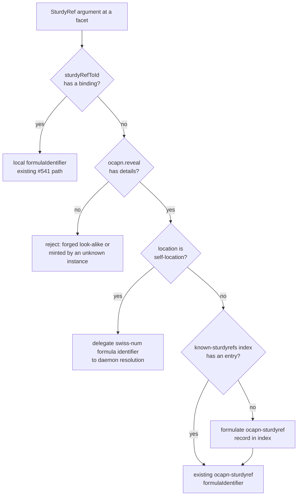
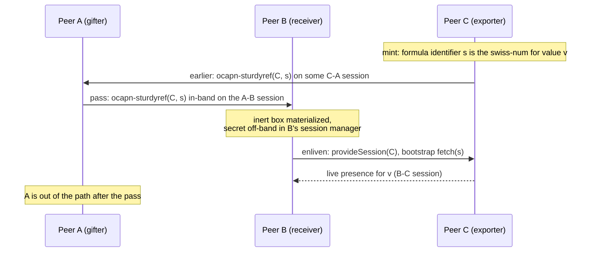

# Cross-Peer SturdyRefs: Wire Codec, Foreign-Locator Internalization, and Three-Party Handoff

| | |
|---|---|
| **Created** | 2026-07-11 |
| **Updated** | 2026-07-15 |
| **Author** | endolinbot (prompted) |
| **Status** | Not Started |

## Summary

The SturdyRef effort's finish-line bar 1 requires mint and enliven (restore)
including three-party handoff: across peers, not only within one daemon. The
enlivenment design ([sturdy-refs-ocapn-enlivenment](sturdy-refs-ocapn-enlivenment.md),
PR #539) specifies the resolution pipeline
`SturdyRef -> { location, swissNum } -> formulaIdentifier` fully for
local-peer locators, and PR #541 implements it at the daemon's facet boundary;
the non-local path is one sentence there ("or a remote peer connection for
non-local ones"). This design settles that sentence:

1. **The wire codec, both directions**, grounded in what PR #521 already
   builds: what exists, what only needs promotion, and what is missing,
   covering the in-band Syrup form, the out-of-band `ocapn://` URI form, and
   the mint-side story. A formula identifier is the swiss-num, so the daemon
   delegates its resolution to its formula machinery instead of maintaining a
   second swiss-num table.
2. **Foreign-locator internalization**: how a SturdyRef whose Peer Locator
   names a different peer resolves at the daemon's facet seam through a
   closely-held OCapN network capability, how the enlivened remote presence
   enters the formula graph, what the resulting formulaIdentifier denotes,
   and the retention and lifetime semantics.
3. **Three-party handoff**: how a SturdyRef hosted at peer C, held by A, and
   passed to B over an A-B session leaves B able to enliven it by connecting
   to C directly; how that differs from and composes with live-reference
   handoff; and how a daemon behaves as each of A, B, and C.
4. **Distributed Confinement**: the three invariants (no-location,
   no-identification, opaque-and-unforgeable) restated as acceptance
   criteria, with every artifact in this design naming the invariant it
   preserves. Nothing here contradicts the guest-token tier of
   [sturdy-refs-agent-surface](sturdy-refs-agent-surface.md) (PR #695).

No retention machinery is introduced, consistent with the enlivenment
design's direction: enlivenment stays on demand, revocation stays
revocation-by-forgetting, and the open enlivened-presence-lifetime question
stays open.

## What is the Problem Being Solved?

Three consecutive effort reports have carried the same unresolved debt: the
OCapN-peer-to-daemon bridge and wire codec for foreign SturdyRefs. The landed
substrate is deliberately local:

- PR #521 gives `@endo/pass-style` the first-class `'sturdyref'` category
  (`SturdyRefHelper` in `packages/pass-style/src/sturdyref.js`, shape-only)
  and gives `@endo/ocapn` a session-manager mint
  (`makeSturdyRefTracker` in `packages/ocapn/src/client/sturdyrefs.js`) with
  the `(location, secret)` tuple held off-band in a closely-held WeakMap.
- PR #541 threads the read side through the daemon's facet boundary
  (`packages/daemon/src/sturdyref-resolution.js`): `mintSturdyRef(id, type)`
  binds a SturdyRef to a local formula identifier in the module-private
  `sturdyRefToId` map, and `resolveSturdyRefToId` resolves it at the seam.
  A SturdyRef minted elsewhere deliberately rejects with "remote SturdyRef
  resolution via the closely-held OCapN network capability is not yet
  implemented".

What no landed or in-flight artifact provides:

- A daemon cannot **export**: `mintSturdyRef` does not use its formula
  identifier as the swiss-num and synthesizes a placeholder location
  (`{ designator: number, network: node, transport: 'endo', hints: false }`)
  that no OCapN netlayer can dial. The OCapN codec refuses to serialize such
  a SturdyRef ("Cannot serialize: not a valid SturdyRef object") because the
  session manager holds no details for it. There is nothing behind
  `locator.get(secret)` in a daemon: the only production `locator` today is
  goblin-chat's in-memory `Map` (`packages/goblin-chat/src/host-room.js`),
  which neither persists nor revokes.
- A daemon cannot **import**: a foreign SturdyRef arriving at a facet rejects
  at `resolveSturdyRefToId`, and the daemon holds no OCapN client at all
  (`packages/daemon/src` has no `@endo/ocapn` dependency; its cross-daemon
  networking is the `EndoGateway` machinery of `daemon.js`, a parallel stack).
- The `ocapn://` URI form lives only in goblin-chat
  (`parseLocator` in `packages/goblin-chat/src/uri-parse.js`,
  `formatLocator` in `packages/goblin-chat/src/host-room.js`), so no daemon
  surface can accept or emit a sturdyref carried out-of-band.

## Background (verified live state, 2026-07-11)

Verified against `llm` head `f7932ed5a`, PR #521 head `d3c68897b9`, PR #541
head `fab626e84a`, PR #539 head `22923949b2`, PR #695 head `619493db4d`.

**The OCapN client surface** (`makeOcapn` in
`packages/ocapn/src/client/index.js`) exposes exactly:
`provideSession(location)`, `makeSturdyRef(location, secret)`,
`enlivenSturdyRef(sturdyRef)`, `shutdown()`. The injected `locator`
capability (`{ get(secret) }`) backs both local enlivenment and the bootstrap
`fetch`. The reveal operation the enlivenment design names
(`reveal(sturdyRef) -> { location, swissNum }`) exists as the module export
`getSturdyRefDetails` in `src/client/sturdyrefs.js` but is not on the package
surface; the `associate` operation is unbuilt.

**The wire read and write paths** (`OcapnSturdyRefCodec` in
`packages/ocapn/src/codecs/descriptors.js`): write consults
`getSturdyRefDetails` and emits the spec record
`<ocapn-sturdyref <ocapn-peer designator transport hints> swiss-num>`;
read materializes a fresh SturdyRef in the receiving world via
`referenceKit.makeSturdyRef(node, secret)`, keeping the secret off-band in
the receiving session manager. The pass-style union codec
(`packages/ocapn/src/codecs/passable.js`) routes `sturdyref` to this codec in
both directions. Enlivenment (`enlivenSturdyRef`) resolves a self-location
via `locator.get(secret)` and a foreign location via
`provideSession(location)` then `E(bootstrap).fetch(wireSecret)`, memoized
per SturdyRef in a `sturdyRefToEnlivened` WeakMap with rejection eviction.
(The enlivenment design's prose says no cache is kept; the landed code
memoizes per instance with value convergence, which honors the design's
stated guarantee, convergence on value rather than promise identity. This
design adopts the code's behavior as normative.)

**Handoff machinery** (same package): `HandOffUnionCodec` reads and writes
signed `desc:handoff-give` / `desc:handoff-receive` envelopes;
`makeGrantTracker` (`src/client/grant-tracker.js`) records per-remotable
grant details and permits exactly one transition, `handoff -> sturdy-ref`.

**The daemon's cross-peer machinery** (`packages/daemon/src/daemon.js`): a
formula identifier `{number}:{node}` with a non-local node evaluates by
`getPeerIdForNodeIdentifier(node)` (backed by the `known-peers-store`
formula) then `E(peer).provide(id)` over the peer's `EndoGateway`. The
`peer` formula (`formulatePeer`, `makePeer`) is formulated lazily, dials
through the networks directory, and on connection loss cancels its own
context so dependent remote presences drop and the next use re-dials. None
of this speaks OCapN.

## Design

### 1. The wire codec, both directions

#### What exists, what needs promotion, what is missing

| Piece | State at #521/#541 heads | This design |
|---|---|---|
| Syrup wire form, write | Built (`OcapnSturdyRefCodec` write; string secrets ASCII-encoded, byte secrets verbatim) | Keep |
| Syrup wire form, read | Built with a defect: the read path decodes the swiss-num with `TextDecoder('ascii', { fatal: true })` and no fallback, so a non-ASCII secret (a Spritely Goblins 24-byte random) throws at decode, while the write path and `sturdyRefTracker.lookup` both support raw bytes | Fix: bytes-preserving read (cut 1) |
| Receiving-world materialization | Built (fresh SturdyRef per arrival, secret off-band in the session manager) | Keep |
| `ocapn://` URI form | Built in goblin-chat only (`parseLocator`, `formatLocator`; base64url no-padding swiss-num per the Locators draft's URI Serialization section and Goblins' `ids.scm`) | Promote both directions into `@endo/ocapn` (cut 2) |
| Advisory `type` hint on the wire | Absent; the spec record has two fields (peer, swiss-num), so the hint cannot ride the Syrup form | Keep local-only; state it explicitly |
| Closely-held reveal | Module-internal (`getSturdyRefDetails`), not on the client surface | Promote to the client as a closely-held `reveal` operation (cut 2) |
| Mint for a daemon-hosted value | Missing entirely | Use the formula identifier as the swiss-num and delegate resolution to the daemon (cut 3) |

#### Mint and export: the daemon as a SturdyRef host

A daemon EXPORTS a wire-tier SturdyRef by using the target formula identifier
as the swiss-num. The formula identifier is already durable, unforgeable at
the daemon boundary, and sufficient for the daemon to resolve the value.

- **Minting.** A host-tier method `provideSturdyRef(petNamePathOrId)` resolves
  its argument to a formula identifier and returns a wire-tier SturdyRef
  constructed through the daemon's OCapN client
  (`ocapn.makeSturdyRef(selfLocation, formulaIdentifier)`). Minting introduces
  no random secret, table, or extra persistence. Repeated exports of one
  formula intentionally carry the same swiss-num and converge on the same
  formula value.
- **Serving.** The `locator` capability injected into `makeOcapn` delegates
  `locator.get(swissNum)` to daemon formula resolution: it validates and
  parses the formula identifier, then `provide`s that identifier. The
  bootstrap `fetch(swissNum)` path therefore resolves through the daemon,
  rather than a parallel sturdyref store.
- **Lifetime and revocation.** A formula-identifier swiss-num remains valid
  for the lifetime of its formula. This design deliberately provides no
  per-export revocation or grant listing: the authority is the formula's
  durable identity, not an independently revocable bearer grant. Keep this
  indefinitely. Any future independently revocable delegation must introduce
  an explicit attenuating formula, rather than reintroduce a hidden mapping.
- **No auto-promotion on export.** When a facet passes a local-tier SturdyRef
  (a #541 `mintSturdyRef` product with no swiss-num) out over an OCapN
  session, the codec's existing refusal stands. Considered and rejected:
  minting a swiss-num implicitly at serialization time. Reason: that would
  persist durable, offline authority as a silent side effect of marshaling;
  minting must be the deliberate `provideSturdyRef` act. The #541 local tier
  keeps its placeholder location and stays non-exportable by construction.

#### The daemon's OCapN identity and self-location

The `ocapn` singleton uses the daemon node key as its OCapN identity by
design. Its value is the daemon's OCapN client plus the closely-held
operations of section 2. The self peer-locator uses the node key as its
designator and the OCapN Noise Protocol Network with WebSocket transport and
TCP with CBOR-frame transport. `provideSturdyRef` bakes that self location and
the formula identifier swiss-num into each minted SturdyRef. There is no
second keypair and no opt-in identity-reuse mode.

### 2. Foreign-locator internalization (the peer-to-daemon bridge)

#### The closely-held OCapN network capability

The `ocapn` formula's value is the bridge capability, held by daemon core
and host-tier facets only, per the enlivenment design's "Local-only at the
boundary": it never crosses to a worker or guest, and everything a worker
imports is a daemon-local presence the daemon proxies. Its operations:

- `reveal(sturdyRef) -> { location, swissNum } | undefined`: the promoted
  `getSturdyRefDetails`, answering for any SturdyRef this daemon's session
  manager minted or materialized from the wire.
- `enliven(sturdyRef) -> Promise<Presence>`: the client's
  `enlivenSturdyRef`, dialing `provideSession(location)` and fetching by
  swiss-num for foreign locations.
- `internalize(location, swissNum) -> FormulaIdentifier`: the durable path
  (next subsection). For a self location, this delegates directly to daemon
  formula resolution because the swiss-num is already a formula identifier.
- `formatSturdyRefUri` / `parseSturdyRefUri`: the promoted URI codec, for
  deliberate out-of-band export and accept. The URI carries the secret;
  emission is host-tier only and the string never appears in logs or error
  messages (the #521 discipline of secret-free errors extends to every
  bridge surface).

#### The resolution pipeline at the facet seam

PR #541's seam (`resolveSturdyRefToId`) gains a fallback instead of its
current rejection:

A SturdyRef reaches the seam by three ingress routes, all converging on the
same pipeline: over the daemon's own OCapN session (materialized by its
session manager, so `reveal` answers), passed back by a worker holding a box
the daemon handed it earlier (the daemon-worker marshaling of that box is
enlivenment-design cut-2 territory, out of scope here), or out-of-band as an
`ocapn://` URI through `acceptSturdyRefUri(uri)`, a new host method that
parses and feeds `internalize`. `writeLocator` keeps its `endo://` contract
unchanged; a separate accept method keeps the URI tier's secret-bearing
strings off the general locator surface.

#### The `ocapn-peer` and `ocapn-sturdyref` formulas

Two new formula types mirror the existing `peer` machinery
(`formulatePeer` / `makePeer`):

- **`ocapn-peer`** `{ type, location }`: formulated lazily, one per foreign
  peer identity (designator plus transport, per the Locators draft's
  same-peer rule). Its value is the live session via
  `provideSession(location)`. On session end it cancels its context, exactly
  as `makePeer` does on connection loss, so dependents drop and the next use
  re-dials.
- **`ocapn-sturdyref`** `{ type, ocapnPeerId, swissNum }`: depends on its
  `ocapn-peer`. Its value is the enlivened presence,
  `E(bootstrap).fetch(swissNum)` over the peer's session. The formula body
  holds the foreign formula-identifier swiss-num; formula records are
  daemon-private state.

**What the formulaIdentifier denotes.** A local identifier
(`{number}:{LOCAL_NODE}`, random formula number) denoting the durable
designation "the object the peer at `location` serves for `swissNum`", not
any particular live presence. Each incarnation re-enlivens on demand; after
a restart, the formula is still there and the next `provide` re-dials. This
is deliberately unlike the `EndoGateway` remote tier, where the identifier
itself carries the foreign node number: an OCapN peer has no Endo node
number, no gateway, and no retention-sync protocol, so the local
`ocapn-sturdyref` formula is the proxy root and cross-peer GC does not
extend across the bridge.

**Deduplication.** A `known-sturdyrefs-store` index (mirroring
`known-peers-store`) maps `locationId + sha256(swissNum)` to the existing
formula identifier, so two internalizations of the same foreign
`(location, swissNum)` yield the same formula identifier. That preserves the
host-tier round-trip invariants (`identify` is stable, `locate` after
`write` finds the same formula) and gives revocation and pet names one
referent. Guest-tier unlinkability is unaffected: guests receive fresh
per-grant tokens (PR #695), never formula identifiers.

**Relation to `internalizeLocator` / `externalizeLocator`.** The
`endo://` locator flow (designs/daemon-locator-reference.md) is untouched.
`locate` on an internalized foreign SturdyRef returns the ordinary
`endo://{localKey}/{number}?type=ocapn-sturdyref` locator: location-bearing
only at the granularity "this daemon holds it", never exposing the foreign
peer locator or secret. The secret-bearing `ocapn://` URI is emitted only by
the closely-held `formatSturdyRefUri`. Unifying the two network stacks
(daemon-to-daemon traffic over OCapN instead of `EndoGateway`) is expressly
out of scope; tracking issue to be filed.

#### Retention, lifetime, and failure

- **Enliven-per-use.** A facet that needs the value (a `lookup`, an
  endowment materialization) provides the `ocapn-sturdyref` formula's value
  on demand. While the session lives, the client's per-SturdyRef memo and
  the daemon's live-value cache make repeated use cheap; when the session
  ends, the `ocapn-peer` context cancellation drops the cached presence and
  the next use re-dials from scratch. No ambient retention: holding the
  inert box (in a worker, on disk, in a mailbox) retains nothing at either
  peer, matching PR #541's discipline. The underlying object's liveness is
  the hosting peer's concern alone.
- **Purely ephemeral use allocates nothing.** When a facet consumes a
  foreign SturdyRef in value position only (no identifier returned, no name
  written, no endowment graph edge), the seam may enliven through
  `ocapn.enliven` directly without formulating. Durable internalization
  happens exactly where an identifier must exist: `identify`, name writes,
  and `evaluate` / `makeUnconfined` endowment slots.
- **Failure surfacing.** A failed dial or a bootstrap `fetch` miss ("secret
  not found": unknown formula identifier or the wrong peer) rejects the facet
  call. Rejections name the peer designator and never the swiss-num,
  extending the #521 rule that capability-bearing identifiers stay out of
  error chains. The memo's rejection eviction and the formula's on-demand
  re-evaluation mean a transient failure retries on next use.
- **Session partitioning.** Every value enlivened through a particular OCapN
  session is bound to that session. When the session ends, its live presences,
  memo entries, and dependent formula values are partitioned with it and are
  not reused. A later use establishes a fresh session and enlivens a fresh
  presence. This is stronger than cache eviction: a stale value cannot cross
  the ended-session boundary.

### 3. Three-party handoff

Peer A holds a SturdyRef hosted at C and passes it to B over an A-B session.

**The pass is the handoff.** A SturdyRef is pass-by-copy
`(peer locator, swiss-num)` data; the Locators draft states this information
alone is the capability to obtain a CapTP reference to the object. When A
sends it, A's codec re-serializes the tuple in-band on the encrypted A-B
session; B's session manager materializes a SturdyRef with details
`(C, swissNum)` held off-band. No deposit at C, no signature, no third
session at pass time. B enlivens later by `provideSession(C)` and
`E(bootstrap).fetch(swissNum)`: a direct B-C session in which A plays no
part.

**Contrast with live-reference handoff.** Passing a live imported reference
across sessions requires the `desc:handoff-give` protocol precisely because
a live import is a session-scoped slot whose authority must move without
transiting or trusting the gifter: the gifter deposits the gift at the
exporter, signs a give certificate, and the receiver redeems it. A SturdyRef
needs none of that because its authority IS the swiss-num, already inert
data. The trade is explicit:

| | Live handoff (`desc:handoff-give`) | SturdyRef pass |
|---|---|---|
| What B gets | A session-scoped live reference, redeemable once | Durable, offline re-acquisition authority |
| C involved at pass time | Yes (gift deposit) | No (only at enliven) |
| Secret on the A-B wire | Never (signed certificate instead) | Yes, in-band on the encrypted session |
| Survives partition or restart | No | Yes |
| Failure window | Redemption, near-term | Any later enliven (C down or formula unavailable) |

A gifter therefore chooses tiers by intent: introduce (handoff) versus
delegate durably (SturdyRef). Both compose on the same remotable: the grant
tracker permits exactly the `handoff -> sturdy-ref` upgrade, so a presence B
first imported through a live handoff can later be recognized as
sturdy-granted when the exporter mints and passes a SturdyRef for the same
object.

**The daemon in each role.**

- **As C (exporter):** `provideSturdyRef` uses the formula identifier as the
  swiss-num and `fetch` delegates to daemon formula resolution. The daemon
  also serves the ordinary gift-deposit bootstrap methods for live handoffs
  through its OCapN client unchanged.
- **As A (gifter):** a host-tier facet passing a wire-tier SturdyRef (its
  own mint, or a foreign one it internalized) over an OCapN session
  re-serializes the tuple. Re-gifting a C-hosted SturdyRef to a fourth peer
  is the same act; delegation of inert authority is transitive by nature,
  and confining it is the token tier's job, not the wire tier's.
- **As B (receiver):** the facet-seam pipeline of section 2. A daemon
  receiving a C-hosted SturdyRef from A internalizes it and enlivens against
  C directly; A never becomes a proxy hop.

### 4. Distributed Confinement binding

The raw, location-bearing SturdyRef is the TRUSTED and WIRE tier only. The
three invariants, restated as acceptance criteria for this design: a
confined guest must gain **no location** (no peer locator, designator,
transport, or hint readable from anything it holds), **no identification**
(no stable identity, no cross-grant correlation), and only
**opaque-and-unforgeable** artifacts (mediated resolution, nothing mintable
by the guest). Per artifact:

| Artifact | Invariant preserved and mechanism |
|---|---|
| Syrup wire form and codec | Opaque-and-unforgeable: the secret rides only inside an encrypted, mutually authenticated session and lands off-band in the receiving session manager, never as a property. The wire tier is peer-to-peer trusted surface; the facet seam is where the guest tier is enforced. |
| `ocapn://` URI | The URI is location plus secret by definition (out-of-band carriage for the trusted tier). No-location and no-identification are preserved for guests by reachability: emission and acceptance are host-tier closely-held operations, and the string appears in no log, error, or guest-visible value. |
| Formula-identifier swiss-num | Opaque-and-unforgeable: the daemon alone resolves a self-location swiss-num as a formula identifier. It introduces no parallel table, grant listing, or guest-visible formula identifier. |
| `ocapn` network capability | No-location: it is the only holder of dial authority, it never crosses the worker boundary, and cross-peer enlivenment is a daemon-side act whose result reaches a worker only as a daemon-local presence. A confined guest can neither dial nor learn that dialing occurred. |
| `ocapn-sturdyref` formula and `known-sturdyrefs-store` index | No-identification toward guests: the local formula number is random and location-free; the body (location, foreign formula identifier) is daemon-private; `identify` and `locate` never admit the guest-token tier (PR #695's method mask). The dedup index is daemon-side equality for the host's own bookkeeping, never guest-observable. Two grants of the same internalized foreign object reach a guest as two fresh, unlinkable #695 tokens. |
| Three-party pass | The invariants govern tier boundaries, not trusted peers: A handing B the tuple is deliberate delegation between wire-tier holders. B's guests still sit behind B's mediator, so the pass widens no guest's authority. |

One caveat is stated rather than hidden: token unlinkability covers the
artifacts, not value identity. Two tokens for the same foreign object
resolve, at the mediator, to values that converge (the same presence while a
session lives). PR #695 accepts the same property for local grants
(convergence is observable at the mediator, and returned values are values).
A granter needing value-level unlinkability between two guests interposes
distinct attenuating facets before granting; that is the granter's choice,
out of scope here as it is there.

The guest-token tier itself is untouched: PR #695's tokens are keyed by
formula identifier, and an internalized foreign SturdyRef is exactly a
formula identifier, so provide and accept compose with this design with no
new mechanism.

## Cut table

Independently mergeable builder cuts, in order. Every behavior-bearing cut
carries a confinement test; cut 6 carries the required two-daemon
round-trip. (The effort's press-driver sequences the builds; none are posted
with this design.)

| Cut | Change | Test plan |
|---|---|---|
| 1 | **Bytes-preserving wire read.** `OcapnSturdyRefCodec` read keeps non-ASCII swiss-nums as bytes (try ASCII, fall back to `Uint8Array`), symmetric with `sturdyRefTracker.lookup` and the write path. | Round-trip a Goblins-style 24-byte random secret read-to-write unchanged; ASCII secrets unchanged; existing codec snapshots green. Confinement: sweep the materialized SturdyRef's own properties and prototype chain for secret bytes (none reachable). |
| 2 | **Promotions in `@endo/ocapn`.** URI codec (`parseSturdyRefUri` / `formatSturdyRefUri`) moves from goblin-chat into `@endo/ocapn`; goblin-chat delegates. The client gains closely-held `reveal(sturdyRef)`. | URI parse/format round-trip including hints and base64url vectors from Goblins' `ids.scm`; goblin-chat suite green against the delegating import; `reveal` answers for minted and wire-arrived refs, `undefined` for foreign-instance mints. Confinement: a SturdyRef never stringifies to its URI (no `toString` leak); `reveal` is absent from every non-closely-held surface. |
| 3 | **Daemon mint and export (daemon as C).** `provideSturdyRef` uses its resolved formula identifier as the swiss-num; the OCapN `locator` delegates self-location resolution to the daemon's formula resolver. | Mint then `fetch` round-trips in one process and after daemon restart; repeated exports of one formula carry the same swiss-num and converge on one value. Confinement: a confined guest cannot reach `provideSturdyRef`, the formula resolver, or the formula identifier. |
| 4 | **The `ocapn` singleton.** The daemon node key is the OCapN identity; OCapN Noise Protocol Network arms WebSocket and TCP with CBOR-frame transport; #541's placeholder location is replaced by the real self peer-locator in wire-tier mints (local-tier `mintSturdyRef` unchanged). | Self-location round-trips the node-key designator and each transport; a self-minted SturdyRef enlivens locally through delegated formula resolution. Confinement: an endowment sweep proves no worker or guest can reach the `ocapn` capability or any netlayer handle. |
| 5 | **Foreign internalization (daemon as B).** `ocapn-peer` and `ocapn-sturdyref` formula types; `known-sturdyrefs-store` dedup index; the facet-seam fallback replacing #541's rejection; `acceptSturdyRefUri`. | Simulated two-peer over the OCapN Noise Protocol Network's WebSocket and TCP/CBOR-frame transports: mint at one instance, pass, `lookup` / `identify` / name-write at the other; dedup yields a stable identifier across repeated internalizations; session teardown partitions all session-bound presences before next use re-dials; a failed fetch rejects without the formula identifier; a forged look-alike still rejects. Confinement: a confined guest holding a #695 token backed by a foreign `ocapn-sturdyref` formula can read no locator through anything reachable from the token; cross-peer enliven occurs only via the mediator (the guest side makes no connection, asserted at the netlayer). |
| 6 | **Three-party round-trip (A, B, C).** Integration of cuts 1-5 plus the handoff contrast: two daemons and a third simulated peer in each role rotation. | The required round-trip: daemon C mints, peer A receives and passes to daemon B, B enlivens by dialing C; assert no A-C traffic at pass time and a fresh B-C session at enliven; repeat with the daemon as A and as C. Live-handoff contrast: the same object introduced via `desc:handoff-give` still works, and the grant tracker records the `handoff -> sturdy-ref` upgrade when the SturdyRef follows. Confinement: end-to-end, a confined guest at B granted the C-hosted value sees a daemon-local presence and can recover neither C's locator nor the swiss-num. |

## Acceptance criteria

- Both wire directions round-trip string and byte swiss-nums; the URI form
  parses and formats in `@endo/ocapn`; the advisory `type` hint is
  documented as local-only.
- A daemon mints wire-tier SturdyRefs whose swiss-nums are formula
  identifiers, and serves them via bootstrap `fetch` by delegating to daemon
  formula resolution; minting never happens as a marshaling side effect.
- A foreign SturdyRef at the facet seam resolves through the closely-held
  OCapN capability to an `ocapn-sturdyref` formula identifier; enlivenment
  is on demand, session loss drops presences and re-dials on next use, and
  no ambient retention is introduced at either peer.
- The three-party pass works with the daemon in each role, and B reaches C
  directly, never through A.
- The three confinement invariants hold as stated per artifact above, every
  cut's confinement test passes verbatim, and nothing contradicts PR #695's
  token tier.

## Open questions

- How should `@endo/captp` and slot-machine reach parity with the
  formula-identifier swiss-num and daemon-delegated resolution model? This is
  a follow-up design plan, to be filed before either package adopts the
  bridge surface.
- The enlivenment design's remaining open question (what governs the
  lifetime of an already-enlivened, worker-held presence) is narrowed but
  not resolved here: the bridge fixes the daemon-side answer (presences ride
  the session; teardown on session end; re-enliven per use) and leaves the
  worker-side teardown-determinism question where PR #539 left it.

## Dependencies

| Design or artifact | Relationship |
|---|---|
| [sturdy-refs-ocapn-enlivenment](sturdy-refs-ocapn-enlivenment.md) (PR #539) | Parent: the enlivenment model, the closely-held capability contract, and the "remote peer connection" sentence this design expands. |
| [sturdy-refs-agent-surface](sturdy-refs-agent-surface.md) (PR #695) | Sibling: the guest-token tier this design composes with and must not contradict. |
| [daemon-locator-reference](daemon-locator-reference.md) | The `endo://` locator flow and `internalizeLocator` / `externalizeLocator` this design leaves untouched and sits beside. |
| PR #521 (`build/sturdyrefs-pass-style-ocapn`) | The pass-style category, session-manager mint, wire codec, and enliven path this design promotes and extends. |
| PR #541 (`build/sturdyrefs-endor-syscall-retention`) | The facet seam whose foreign-SturdyRef rejection this design replaces with the bridge pipeline. |
| OCapN drafts at `kriscendobot/ocapn` commit `f7005c12` | Locators (Sturdyref Locator: Syrup Serialization, URI Serialization; Peer Locator same-peer rule) and CapTP (Third-party handoffs: Gifter, Receiver, Exporter). |

## Prompt

This design was produced from the garden job
`ebfb-design-sturdyref-wire-bridge` (2026-07-11), closing the SturdyRef
effort's finish-line bar 1 gap carried by three consecutive effort reports:

> The effort's finish-line bar 1 requires mint + enliven (restore) including
> three-party handoff, across peers, not just within one daemon. The
> enlivenment design specifies the resolution pipeline
> `SturdyRef -> { location, swissNum } -> formulaIdentifier` fully for
> local-peer locators, [but] the non-local path is one sentence. Three
> consecutive effort reports have carried this as unresolved debt: the
> OCapN-peer-to-daemon bridge and wire codec for foreign SturdyRefs.
