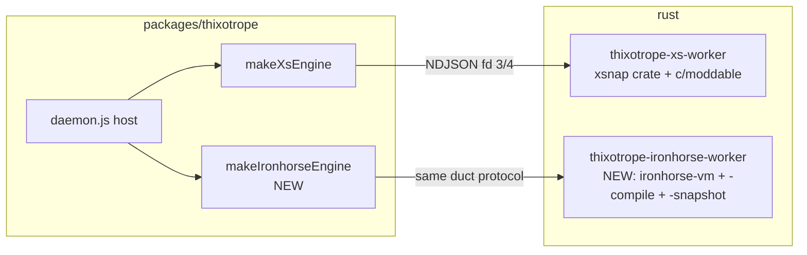

# Thixotrope on Ironhorse

| | |
|---|---|
| **Created** | 2026-08-06 |
| **Author** | kumavis (prompted) |
| **Status** | Proposed |

Feasibility, gap analysis, and a phased plan for running
`@endo/thixotrope` workers on the Ironhorse engine (the Rust port of
XS in `rust/engine/`, design
[ironhorse-engine](ironhorse-engine.md)) behind the same
`WorkerEngine` seam that `makeXsEngine` implements today.
Naming follows the 2026-07-29 settlement: **Ironhorse** is the
engine, **Endor** is the binding of an engine to a platform, and the
engine axis is selected with `-e ironhorse` in the `endor` binary —
so "the endor iron horse engine" of the prompt is, precisely, the
Ironhorse engine.

## What Is the Problem Being Solved?

Thixotrope is the sharpest instance of the problem Ironhorse exists
to solve.
Its workers evaluate **arbitrary guest-supplied source** in a
persistent compartment, and its production engine today is XS —
~94 KLOC of memory-unsafe C parsing and executing hostile input —
reached through `rust/thixotrope-xs-worker` and the `xsnap` crate.
The [ocapn-orthogonal-persistence](ocapn-orthogonal-persistence.md)
design deliberately left the engine seam open: "the seam stays open
for future JS engines with other heap snapshot mechanisms"
(`packages/thixotrope/src/worker-engine.js`).
Ironhorse is now that future engine, in-repo: a
`#![forbid(unsafe_code)]` interpreter with a byte-identical compiler
(stage 5), deterministic release-versioned metering, and a snapshot
surface built **verb-for-verb** on the xsnap shape —
`suspend_to_cas` / `resume_from_cas`
(`rust/engine/ironhorse-snapshot/src/machine.rs`: "the embedder
swaps the C engine for ironhorse without touching the supervisor").

Beyond memory safety, the switch buys thixotrope three things:

1. **Build simplicity.** The XS path needs the `c/moddable`
   submodule, a C toolchain, and stub generation for the xsnap
   crate's gitignored `include_str!` bundles.
   An Ironhorse runner is a pure-Rust `cargo build` from a fresh
   checkout.
2. **Determinism by construction.** Thixotrope's exactly-once
   contract rests on replay regenerating byte-identical outbound
   frames; Ironhorse makes determinism (including deterministic GC
   trigger points) a design invariant with per-release freezing
   rather than an emergent property of one C build.
3. **Metering for free.** The `WorkerIncarnation.deliver` seam can
   later carry per-delivery computron budgets — an embedder policy
   hook the XS runner never wired — with a meter whose determinism
   is already release-versioned.

This design does **not** replace the XS engine.
Both engines stay selectable through the parity campaign
(ironhorse-engine design decision 8); `makeXsEngine` remains, and an
`makeIronhorseEngine` lands beside it behind the same seam.

## What Thixotrope Asks of an Engine

Derived from the seam (`src/worker-engine.js`), the XS runner
(`rust/thixotrope-xs-worker/src/main.rs`), and the worker bundle
(`src/worker-peer-xs.js` → `src/worker-peer.js`).

**The runner contract** (engine-agnostic already):

- One process per incarnation speaking newline-delimited ASCII JSON
  over fd 3/4: `ready`, `deliver`/`ack` (with `outbound` frames
  emitted within the delivery turn), `snapshot`/`snapshot-ok`
  (content-addressed sha256 into a CAS directory), `exit`; restore
  via `--restore <hash>` re-creates the heap with **no
  re-evaluation**.
- Two host functions reachable from the guest global scope:
  `thixotropeSend(json)` (outbound frames) and
  `thixotropeTrace(text)` (stderr diagnostics), plus the engine's
  own `harden` and `lockdown` globals.
  All four join the snapshot callback table under a signature tag
  (XS: `thixotrope-xs 3`), so restore re-links them at the recorded
  ordinals.
- Delivery = run the dispatch entry (`thixotropeDispatch(json)`) to
  quiescence, draining the promise-job queue before `ack`.
  Workers are reactive: no timer queue, no ambient
  nondeterminism — frame silence is exact dormancy.
- Snapshot at quiescence only, exactly the crank-boundary suspend
  point Ironhorse's `MachineSnapshot` already enforces.

**The boot** (`scripts/bundle-xs-worker.mjs`): xsnap's committed
polyfills (pure-JS `TextEncoder`/`TextDecoder`, an assert shim, and
a freeze-based `harden` shim that steps aside when the engine
provides its own), a hand-written immutable-ArrayBuffer emulation
fragment (detect-then-skip in the bundle), then `lockdown()`.
The ses shim is neither needed nor usable — the engine implements
Hardened JavaScript natively, exactly the posture Ironhorse's
stage 4 takes.

**The worker-peer bundle** is a compartment-mapper `makeBundle`
script — a single program, **no engine-level module machinery at
runtime** — whose known certainties are:

| Bundle demand | Where it comes from |
|---|---|
| `Proxy` | `@endo/eventual-send/shim.js` (`HandledPromise`, `E()` proxies) |
| Guest-callable `new Compartment()` + `evaluate` + `globalThis` | `worker-peer.js` persistent guest compartment |
| `harden`, frozen shared intrinsics (`lockdown`) | boot + guest isolation |
| Promise surface incl. combinators, async/await | `@endo/ocapn` client, `@endo/stream` queues |
| `Map`/`Set`/`WeakMap`, `Uint8Array`/`DataView`, `BigInt` | OCapN tables, syrup codec, `@noble` sha256/ed25519 (pure JS) |
| `RegExp` | identifier validation and friends |
| `WeakRef` + `FinalizationRegistry` | OCapN import collection (**optional**: `enableImportCollection: false` exists) |

The exact closure of demands is discovered mechanically by Phase 1
below, not asserted here.

## Where Ironhorse Is Today

From the `rust/engine/README.md` ledger at this writing:

- **Landed**: the full compiler (byte-identical bytecode and `SYMB`
  atom, now the default); the interpreter through stage 4 with the
  complete 121-run `language/` enumeration at `divergent=0`; native
  `harden`/`petrify`; a host-side Rust `Compartment` API
  (per-compartment globals, module maps); generators and
  async/await; the stage-7 boot-campaign children — live
  `globalThis` binding, `Reflect` namespace,
  typed-array-from-source, symbol-keyed `defineProperty`,
  `Promise.prototype.finally` and the combinators; the stage-6
  snapshot surface with meter state riding the `METR` atom.
- **Named gaps, load-bearing for thixotrope**:
  - `lockdown()` and `mutabilities` fold as `Halt::Unsupported`
    (stage-4b harden child's scope fold).
  - The `Compartment` **intrinsic** is not bound
    (`compartment:intrinsic-surface`): a guest
    `new Compartment().evaluate(...)` needs a re-entrant compile
    seam.
    The recorded blocker — "needs the oracle at run time" — predates
    stage 5; `ironhorse-compile` is now pure Rust and
    `forbid(unsafe_code)`, so linking it into the intrinsic's
    `evaluate` is architecturally unblocked.
  - **No `Proxy`, `WeakRef`, or `FinalizationRegistry`** — the
    names exist only in the engine's key table
    (`default_keys.rs`), with no implementation behind them.
  - **No host-function surface**: `endor worker -e ironhorse`
    declines by name (`rust/endo/src/ironhorse_engine.rs`), and the
    snapshot `Signature` gate exists but nothing registers
    callbacks to sign.
  - Async generators / `for-await-of` and `await`-in-`try` remain
    designated folds; boot-ledger rows `to_instance`
    (member-on-primitive boxing), computed `at`, and
    class-instance-construction remain open.
  - **Snapshot side tables**: the compile-checked ledger
    (`ironhorse-snapshot/src/sidetable.rs`) records nearly every
    rich table as `Pending` — functions/closures, promises and
    reactions, collections, arrays, ArrayBuffers/TypedArrays/
    DataViews, iterators, generators, async instances, RegExps,
    error data, bound functions, the symbol registry, and harden
    state.
    Today's round-trip contract is honest but narrow: crank
    boundaries "with closures fully resolved".
    A thixotrope worker heap — an OCapN client made of closures,
    Maps, pending promises, and byte buffers — is precisely the
    rich case.

The shape of the conclusion: **the seam fits like a glove; the
engine does not yet fill it.**
The runner protocol, CAS contract, and suspend-point discipline
translate one-to-one, and nothing in the thixotrope host changes at
all.
The work is (a) closing named engine surfaces the bundle needs,
(b) a minimal host-function seam, and (c) completing snapshot
side-table coverage — all of it already enumerated, compile-checked,
and oracle-gated inside the Ironhorse program's own discipline.

## Architecture

- **`rust/thixotrope-ironhorse-worker`** mirrors
  `thixotrope-xs-worker` deliberately: a dedicated minimal runner
  (~250 lines), **not** the endor supervisor, for the same reasons
  the XS engine was rescoped away from the supervisor (two
  overlapping supervisors, generated-bundle coupling).
  It depends only on the engine crates — no C, no submodule, no
  xsnap stubs.
  Fresh boot: compile-and-run the boot script (polyfills +
  immutable-ArrayBuffer fragment + `lockdown()`), then the worker
  bundle, via `ironhorse-compile` + `ironhorse-vm`; register
  `thixotropeSend`/`thixotropeTrace` host functions; per delivery,
  compile-and-run the one-line dispatch call and drain to
  quiescence.
  Snapshot: `suspend_to_cas` under signature
  `thixotrope-ironhorse 1`; restore: `resume_from_cas` with the
  same callback table.
- **`makeIronhorseEngine`** (`packages/thixotrope/src/
  ironhorse-engine.js`): the duct-spawning half of `makeXsEngine`
  factored into a shared internal helper
  (`src/duct-engine.js`, say), parameterized by binary path and
  artifact paths.
  The daemon, store, hub, journals, and tests are untouched — the
  `WorkerEngine` seam holds by construction.
- **Bundles are engine-neutral.** `dist-xs/boot.js` and
  `dist-xs/worker-peer.js` contain no XS-specific code (the
  immutable-ArrayBuffer fragment detects and skips; the harden shim
  steps aside for any engine-provided `harden`), so the Ironhorse
  runner consumes the same artifacts.
  Renaming `dist-xs/` to an engine-neutral `dist-worker/` is
  cosmetic and deferred.

## Phased Implementation

Ordered so every phase yields a checked-in, self-naming artifact,
front-loading discovery the way the Ironhorse program front-loaded
its differential harness.
Phases 2–4 are **engine work that lands in the Ironhorse program's
lane** under its standing oracle-gated bars; this design contributes
the thixotrope corpus and consumes the results.

1. **The thixotrope boot bar (gap ledger first).**
   Extend the existing boot-bundle mechanism
   (`stage4_daemon_boot_bundle_never_diverges_and_names_its_gaps`)
   with a sibling test that runs thixotrope's actual artifacts —
   `dist-xs/boot.js` then `dist-xs/worker-peer.js` — on Ironhorse,
   asserting zero divergence and recording the named halt where each
   stops.
   Deliverable: a checked-in ledger like the daemon boot table,
   which **is** the engine work-list for Phase 2 and replaces this
   design's assertions with measurements.
2. **Language and intrinsic closure** (Ironhorse lane): the ledger
   rows, known to include the `Proxy` exotic object (port of
   `xsProxy.c`'s proxy half — the largest single new surface),
   native `lockdown()` over the landed harden substrate, the
   guest-callable `Compartment` intrinsic linking
   `ironhorse-compile` for its re-entrant `evaluate`, the remaining
   boot rows (`to_instance`, computed `at`,
   class-instance-construction), and — deferrable, see decision
   5 — `WeakRef`/`FinalizationRegistry` with deterministic
   collection points, plus async generators if the ledger names
   them.
3. **The host-function seam** (Ironhorse lane): named native
   functions installed on the global, invocable from bytecode, with
   the append-only callback-table + `SIGN` discipline the snapshot
   design already specifies.
   Thixotrope's two-function table is the deliberately minimal
   first consumer, exactly as `thixotrope-xs-worker` was for the
   xsnap crate.
4. **Snapshot side-table completion** (Ironhorse lane): flip
   `Pending` rows to carried atoms, prioritized by what the worker
   heap actually holds — functions/closures, promises and
   reactions, collections, buffers and views, iterators, RegExps,
   harden state, symbol registry, generators/async instances; the
   `Modules` row is **not needed** (the bundle is a script).
   Acceptance: a booted worker-peer heap suspends and resumes with
   the round-trip and meter-continuity bars stage 6 already
   defines.
5. **The runner and adapter**: `rust/thixotrope-ironhorse-worker`
   plus `makeIronhorseEngine` (exported from the package index
   beside `makeXsEngine`), with `enableImportCollection: false`
   threaded to the worker peer until Phase 2's
   `WeakRef`/`FinalizationRegistry` lands.
6. **The suite as exit criterion**: Ironhorse variants of the three
   XS test files (`worker-peer`, `durable-worker-session`,
   `worker-session-restart`), skip-when-absent like their XS
   siblings.
   Exit: the full durable-session and daemon-restart scenarios green
   on real Ironhorse heap snapshots.

## Design Decisions

1. **A dedicated minimal runner, not the endor supervisor.**
   Same grounds as the XS rescope in ocapn-orthogonal-persistence:
   thixotrope's host *is* the supervisor; the engine side should be
   one machine, one duct, no powers.
   The `endor` binary keeps its own worker lane; nothing here blocks
   a later consolidation once `endor worker -e ironhorse` exists.
2. **Same duct protocol, same CAS contract, same seam.**
   The daemon cannot tell engines apart; that is the point of
   `WorkerEngine`, and it is how the XS engine dropped into "proven
   host code" before it.
   ASCII-escaped JSON stays: the discipline that made
   CESU-8/UTF-8/C strings coincide now makes the UTF-8↔UTF-16
   boundary transcoding trivial (Ironhorse fuzz target 4's
   surface).
3. **Engine-native Hardened JavaScript, shim-free boot.**
   Ironhorse follows XS's posture: the runner exposes the engine's
   `harden`/`lockdown`, the polyfills' shim steps aside, boot ends
   in `lockdown()`.
   This makes native `lockdown()` (a stage-4 fold today) a hard
   prerequisite, not an optional nicety.
4. **The bundle is the corpus.** Phase 1 turns "what does the
   bundle need?" from analysis into measurement, in the same
   self-naming zero-divergence discipline the engine program
   already runs, and keeps this design honest as the engine
   advances.
5. **Import collection deferred, determinism preserved.**
   `FinalizationRegistry`-driven gc hints are outbound frames; under
   replay they must regenerate identically, so collection must run
   at deterministic points (Ironhorse's GC contract already demands
   deterministic triggers).
   Until that lands, the worker peer runs with
   `enableImportCollection: false` — unbounded import tables, the
   honest prototype trade, matching thixotrope's other stated
   prototype limits.
6. **Engine-specific snapshots, no migration.**
   Snapshots are signature- and version-gated; an existing store's
   XS snapshots are not importable (ironhorse-engine resolved
   question 3) and a worker migrates engines only by retirement or
   by a full-journal replay engine.
   Mixed fleets are fine: the engine is per-daemon configuration,
   and a fresh store per engine is the prototype stance.

## Open Questions

1. **Meter-version bumps versus parked workers.**
   `from_snapshot_bytes` fails closed on a cost-table version
   mismatch, and thixotrope parks workers indefinitely, so an
   `ironhorse-meter-N` recalibration would strand every parked
   snapshot even though thixotrope arms no meter.
   Proposed answer: accept **unarmed**-meter snapshots across
   cost-table versions (carrying accumulated computrons forward as
   advisory), failing closed only when a meter is armed; needs an
   amendment to the stage-6 gate in the Ironhorse lane.
   The fallback is operational: pin the runner binary per store.
2. **Where the shared duct/runner code lives.**
   `thixotrope-xs-worker` and `thixotrope-ironhorse-worker` will
   share the fd-3/4 loop shape; whether to extract a tiny shared
   crate or tolerate ~100 duplicated lines is a taste call for the
   implementation PR.
3. **`dist-xs/` naming** once the artifacts serve two engines
   (cosmetic; see Architecture).

## Dependencies

| Design | Relationship |
|---|---|
| [ocapn-orthogonal-persistence](ocapn-orthogonal-persistence.md) | Parent: defines the `WorkerEngine` seam, the duct protocol, and the XS precedent this design mirrors |
| [ironhorse-engine](ironhorse-engine.md) | The engine program whose lanes carry Phases 2–4; its boot-bundle campaign gains the thixotrope corpus |
| [daemon-xs-worker-snapshot](daemon-xs-worker-snapshot.md) | The CAS layout and callback-table signature discipline both runners follow |

## Prompt

> look into rewriting thixotrope to run on endor iron horse engine
