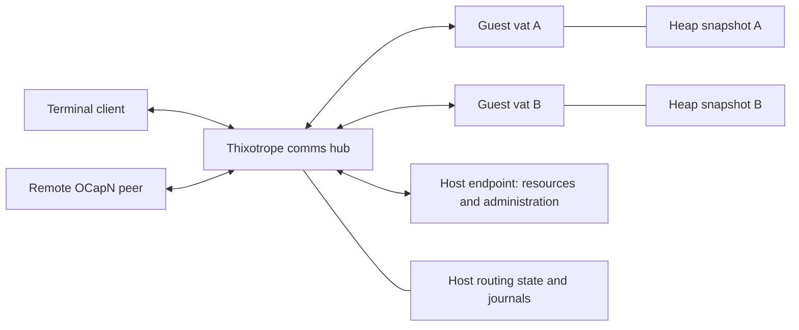

# Thixotrope

| | |
|---|---|
| **Created** | 2026-07-16 |
| **Updated** | 2026-09-24 |
| **Author** | Aaron Davis (prompted) |
| **Status** | In Progress |

## Motivation

Thixotrope is a distributed object-capability machine with orthogonally persistent JavaScript vats.
A vat's objects, variables, closures, and supported pending computations survive suspension and
host restart without application-written serialization or reconstruction functions.

The objective is more than convenient persistence.
Programs should be able to retain remote object references and register promise listeners that
remain meaningful across restart.
A vat can wait for a remote result without occupying a running worker process.
An inventory of named objects is a user convenience, not a prerequisite for persistence or the
mechanism that determines object lifetime.

This document describes the main design and current implementation boundaries.
[Package designs](../packages/thixotrope/designs/README.md) contain potential mechanisms and
experiments; they are not additional guarantees of the current runtime.
The [package README](../packages/thixotrope/README.md) provides commands and operational details.

## Architecture

The host owns workers, durable routing state, transports, and access to external resources.
Each worker runs one guest vat behind an OCapN endpoint.
Guest vats exchange messages through a host-side comms hub, including when both vats are local.
The hub forwards frames and rewrites reference positions without materializing the routed
application objects or promises in the host.

The host endpoint is a deliberate exception to forwarding-only behavior.
It materializes host-provided capabilities and serves administration requests.
Guest-to-guest references, answers, and promise settlements route through the hub directly.

### Package boundaries

| Component | Responsibility |
|---|---|
| `@endo/thixotrope` | Comms hub, worker and remote transports, host endpoint, persistence coordination, supervisor, and terminal tools. |
| `@endo/ocapn` | Protocol clients, wire codecs, reference-descriptor helpers, and signature operations. |
| `rust/thixotrope-ironhorse-worker` | One Ironhorse machine and SQLite heap per process, with a trusted supervisor command interface. |
| Ironhorse VM, snapshot, and SQLite store crates | JavaScript execution, supported machine-state encoding, integrity validation, and heap storage. |
| `rust/thixotrope-xs-worker` | The alternative XS worker engine. |

The comms hub is internal to Thixotrope at `packages/thixotrope/src/net/hub.js`.
Its persistence transactions and session lifecycle belong to the host design.
OCapN no longer exports a hub implementation.

The `WorkerEngine` interface separates the host's journal/session discipline from an engine's
snapshot and process mechanics.
Ironhorse and XS implement this interface.
Internal replay engines exercise host behavior without a native worker; they are test doubles,
not evidence of native heap persistence.

## Guest state, identity, and authority

Guest code runs in SES compartments and receives explicit capability endowments.
It has no ambient host filesystem or process access.
Remote calls use eventual send; results and failures return as protocol messages.

Worker ids are host-generated and unguessable.
Debug labels help administration but do not grant authority.
A caller reaches a guest object through an existing reference, a granted worker facade, or a
publication fetched through the hub's bootstrap.
A publication associates a secret with a reference and can be represented as an OCapN sturdy reference.

The hub maintains per-session reference tables, answer routes, and reference counts.
A reference row records its origin session and incarnation, position, and object/promise role.
Session retirement tombstones origin rows so old references fail instead of designating new objects.
Publications and third-party gift handoffs are also represented in hub state.

Orthogonal persistence preserves the guest's heap relationships.
It does not make an operating-system resource persistent, repair incompatible code, or guarantee
that an external operation can safely be repeated.
Those capabilities cross the host endpoint and have their own failure contracts.

## Sleep, restore, and message recovery

An idle worker can finish its current execution step, checkpoint, and terminate.
Its logical OCapN session remains present.
The next incoming frame restores the worker and resumes delivery without requiring the application
to rebuild its exported objects or listener registrations.
Sleep is host policy; it is not a guest application lifecycle callback.

The worker transport serializes delivery, sleep, wake, crash handling, and retirement.
Recovery pairs an immutable sleep image with its journal cut and replays the remaining journal suffix.
Daemon startup wakes workers with a journal suffix so accepted work resumes without new traffic.
Workers whose journals are fully checkpointed, and quarantined workers, remain asleep.
An abandoned live database is not a recovery baseline: it may be ahead of the selected image without
matching the host's committed delivery state.

Three distinct records establish local delivery continuity:

- Incoming worker frames are journaled before they reach the engine.
- Worker output has a stable session sequence across deterministic replay, letting the hub suppress
  repeats whose effects it has already committed.
- Hub outgoing frames receive stable per-destination delivery identifiers, saved with destination
  journal entries so a repeated handoff does not create another logical invocation.

The hub commits the incoming processed watermark, reference-table changes, and resulting outbox
frames together before releasing output.
A destination's durable queue acceptance is distinct from completion of the guest method.
A failed connection or missing reply must not be interpreted as proof that a sent invocation did
not execute.

### Ironhorse integration

The Rust worker opens or restores one SQLite heap, runs trusted bootstrap code for a fresh heap,
and accepts evaluation requests from the supervisor.
A successful execution step, including its promise jobs, commits before the worker publishes its result.
Guest outbound frames remain in the heap until the adapter drains them through a committed step.
A deterministic VM halt produces a fatal result and quarantines the vat; it does not commit the
failed execution step or repeatedly replay it into service.

The host pins the worker executable, bootstrap bytes, and protocol profile.
Execution and heap limits are configurable daemon-wide defaults, reported by `thix status`.
Runtime manifest version 2 allows increases across restart while rejecting decreases; the request
watchdog timeout may change in either direction.
The crank meter resets for each evaluation; heap ceilings apply across the vat's lifetime, with
collection between completed cranks.
Per-vat overrides remain a follow-up, and raising limits does not clear a vat's failure metadata.
See [Ironhorse limits](../packages/thixotrope/designs/ironhorse-limits.md) for exact settings.
Incompatible or unversioned stored state is refused.
A closed SQLite image is copied only after successful worker shutdown folds in its WAL.
Snapshot references are file digests and are checked before restore.
Kernel leases prevent competing supervisors and abandoned workers from writing accepted state
concurrently.

The underlying engine supplies validated heap persistence and supported native async activations.
Application-level code upgrades and automatic runtime migration are not implemented.

## Remote objects and connections

A durable reference's lifetime is separate from any particular socket.
Connection acquisition reuses a healthy route or attempts a lazy connection and can fail before an
application invocation is accepted.
Once a vat commits a send, the node owns a durable outbox obligation.
Temporary connection failure leaves that obligation pending; recovery retries the same delivery
identity until responsibility is transferred or a defined terminal disposition is recorded.
A socket error alone is not such a disposition.

Unsettled application promises and their listeners survive disconnection.
Invocation acceptance does not settle the result promise.
A later settlement is another message that is delivered when connectivity permits.
Lost delivery confirmation requires recovery of the existing message, not a fresh invocation.
The intended contract applies to handoffs within a node as well as between nodes.
Each owner retains recoverable work until the next owner durably accepts responsibility.

`makeDurableNetLayer` implements this transfer with a versioned envelope, decimal sequence numbers,
and separate accepted and processed watermarks.
The receiver records the payload in its durable inbox before acknowledging acceptance.
Hub dispatch commits routing changes and onward outboxes before inbox reclamation.
Lost acknowledgements trigger retransmission and repeated acceptance receipts, without a new logical
invocation.
Both originator and acceptor session records recover across daemon restart, including pending
handshake identity and output.
Ordinary socket loss preserves references, listeners, and delivery obligations.

Peers advertise whether acceptance survives restart or only the current process.
A peer without a persistence adapter supplies the weaker process-lifetime contract explicitly.
The protocol refuses an acceptance-profile change within an incarnation and rejects receipt-only
version 1 envelopes; old version 1 session records are not automatically migrated.
This resumption envelope is Thixotrope-specific, not an OCapN standard.
Resume tokens are bearer capabilities and require a confidential, authenticated base transport in
production; the TCP testing transport does not supply those properties.

Retirement persists a tombstone, completes hub cleanup across restart, and answers later reconnects
with a terminal disposition if the original close notification was lost.
Temporary unavailability cannot retire a session.
Storage publication uses synchronous file and directory flushes, but process-crash tests do not
establish hardware power-loss behavior.

## Host resources and persistence boundaries

Host capabilities have durable descriptions and are reconstructed through registered factories.
Host-origin nondeterministic results enter guest state as journaled protocol replies.
The host endpoint treats unrecoverable pending host-operation answers as at-most-once obligations:
restart rejects them rather than blindly repeating an external effect.
Guest-owed answers and supported promise listeners remain in guest heap state.

The supervisor also bridges ephemeral observers into the persistent workspace.
An inventory TUI uses a dedicated connection and receives display snapshots rather than the
inventory's capability values.
Closing the TUI, losing its socket, or stopping the supervisor releases the observer and cancels its
subscription; restart discards old UI subscriptions while preserving durable guest listeners.
Bounded cleanup prevents a stalled guest cancellation from holding the supervisor open indefinitely.
Removing a subscription makes its state eligible for ordinary collection; it does not prove physical
heap reclamation has already happened.

### Guest-owned HTTP listeners

HTTP is a directory-installed native resource with `durable.js` and `ephemeral.js` entry modules.
`thix install-native STATE NAME DIRECTORY` selects the daemon's workspace by its state directory.
The durable factory runs in a dedicated manager vat and returns registration and lifecycle facets.
Only the registration facet enters the named inventory slot; applications receive it through grants.
The workspace retains an installation record with code identity, manager reference, and completion
status so interrupted installation can resume on explicit retry.
Each manager receives its own startup notification through its privately published lifecycle facet.
Its recovery, heap, and execution limits are independent of the workspace and other managers.

The ephemeral module runs in a separate Node process, owning the HTTP server, sockets, request
buffers, deadlines, and response handling.
The primary daemon provides generic launch, routing, retirement, and shutdown.
It does not import the HTTP implementation or hold desired listener state in a host JSON registry.
The manager vat retains desired registrations and handlers as ordinary heap state.
Directory contents and the durable bundle are pinned; source changes require a new installation.
Dependencies outside the directory are not included in its digest.

Registration returns a status/close handle even when binding fails.
Status retries binding and reports an inactive listener and error; close withdraws desired state.
Stale handles cannot affect a later registration on the same port.
Daemon restart restores desired listeners through a fresh adapter.
After adapter death during operation, replacement happens on the next manager operation that
provides the adapter; there is no autonomous restart monitor.

Each adapter incarnation has one transient protocol session, shared by its requests.
Request timeout, disconnect, or completion releases request-local state; process retirement breaks
the incarnation's references and retires its session.
An already accepted guest invocation may complete after the HTTP client disappears.
A replacement adapter restores registrations, never pending HTTP requests.

The initial HTTP profile bounds bodies, concurrency, and duration, and copies only method, path,
and text body into the guest.
Exact Host checks and browser Origin/Fetch Metadata checks reject cross-origin browser access.
These checks do not authenticate local processes; the guest HTTP interface is available to local clients.

### Durable time promises

The supervisor can grant a public clock living in the existing persistent workspace.
It exposes `now()`, `when(deadline)`, and `arm(deadline)` with a per-alarm cancellation capability.
The host records deadlines and terminal outcomes in a small manual-persistence ledger.
It schedules one timer for the earliest pending deadline; there is no periodic guest scan or host
control facet that enumerates guest alarms.

Fulfillment time or cancellation is persisted before settling the corresponding host promise.
The clock observes that promise and gives callers a separate guest-owned promise, which other vats
may retain without directly observing the host resource.
After recording settlement through the vat's normal persistence mechanism, it acknowledges cleanup.
The host retains the outcome until that acknowledgement, so restart can replay an interrupted delivery.
An interrupted acknowledgement retries; other cleanup failures retry on subsequent clock use.
An interrupted arm is abandoned explicitly because the host may already have stored its deadline.
See [alarm settlement](../packages/thixotrope/designs/alarm-settlement.md) for the protocol.

The initial profile uses absolute bigint Unix milliseconds in the nonnegative signed 64-bit range.
The shared limit of 1,024 rows includes pending alarms and unacknowledged outcomes.
A deadline that passes during downtime settles after restart, preserving downstream guest listeners.
Wall-clock adjustments affect when deadlines become due; this is not a real-time scheduling guarantee.
Cancellation is supported; recurring scheduling remains application work.

## Workspace and installed applications

The local supervisor owns a persistent workspace and exposes administration over a private Unix socket.
Terminal attachment does not own the workspace lifetime.
Disconnecting a terminal leaves guest state available for later attachment.
The socket carries local administrative authority and is protected by the state directory's ownership
and permissions.

Workspace metadata version 4 identifies dedicated native managers and includes the alarm
acknowledgement protocol introduced in version 3.
Earlier workspaces require explicit migration or fresh state; startup rejects them before restoring
workers, because their heap-persisted registry and clock closures cannot be replaced by loading
new source.

The workspace supplies a worker controller and an observable inventory backed by an ordinary Map.
Guest code can retain capabilities in normal variables and closures without using the inventory.
Inventory entries retain values through normal references; inventory changes do not control a
separate garbage-collection regime.

An application module exports `make(powers)`.
The CLI bundles its static module graph and grants only explicitly selected inventory capabilities.
A persistent application registry retains the pending or completed factory result together with the
bundle digest and grant mapping.
Reinstalling the same name, code, and grant mapping reuses the existing result.
The workspace obtains the guest evaluator directly so an asynchronous factory result can survive
host restart as a guest-to-guest promise.

Installation captures code and powers; it does not reload changed source files or upgrade an existing
application's heap.
The current admission profile limits serialized installation requests to 16 KiB and grants to
remotable capabilities.
Interrupted host allocation or evaluator acquisition can require an explicit retry.
Removing a registry entry releases its reference; it does not revoke references held elsewhere.

## Contacts and capability offers

Local supervisors communicate through private, same-user Unix sockets with durable session recovery.
The transport fragments large logical messages without imposing a smaller limit after durable admission.
Publication imports and third-party gift redemptions share one outgoing session per exporter, preserving
its routing alias and dial location across restart.
An invitation grants one reciprocal exchange of contact inbox capabilities.
Contact labels are local names, not authenticated human identities.
The mailbox owner can cancel an invitation and withdraw its publication without revoking an
established contact.

Each mailbox lives in a guest vat, separate from the workspace and shared application vats.
Received offers and delivery listeners persist as ordinary mailbox guest state.
The mailbox accepts correspondent capabilities directly and has no pet-name registry.
A separate workspace address book resolves names through the user's observable `contacts` inventory
entry by convention.
The same identity can be kept in an ordinary variable and passed to `mailbox.send` without naming it.
Incoming facets bind the local sender identity; peers cannot supply their own display labels.
Inbox and outbox records retain identities, while the address book resolves current labels for the UI.
Renaming a contact therefore does not rewrite mailbox records or replace remote references.
An offer carries one explicitly selected capability; accepting it may retain it in the user's inventory.
The recipient's terminal receives descriptions only and disconnects when closed.
The node outbox handles delivery retries after admission; mailbox code does not resend on reconnect.

## Platform powers and service atoms

Core factories receive their platform powers explicitly.
Node module imports and ambient host authority are confined to the Node power factory and host
composition entrypoints; the XS worker bootstrap is a separate platform perimeter.
Core lint rejects built-in module imports and re-exports, dynamic module acquisition, and ambient
I/O, randomness, clocks, and scheduling.
Tests exercise the effective lint configuration with negative authority probes.

The powers include storage, scheduling, entropy, process launch, network listeners, and terminal I/O.
Calling a core factory does not construct default Node powers or fetch a shared platform singleton.
An alternative host can supply these capabilities explicitly.
The current Unix transport and Node worker adapters still implement platform-specific behavior;
the boundary makes those dependencies replaceable, rather than claiming those adapters already run
on every operating system.

Persistent service metadata uses a `SyncStringAtom`: a synchronous `read()` returns a string or
`undefined`, and a successful `write(string)` durably replaces the slot before the next effect.
The file-backed atom is one implementation.
The host alarm ledger performs its JSON encoding and transitions above this interface.
HTTP registrations live in their installed manager vat's heap; the public clock's promises live in
the workspace heap.
The manual persistence boundary is confined to host state that cannot rely on a durable guest heap.
Platform adapters return plain data, iterator facades, and opaque tokens rather than Node streams,
servers, or timer objects; callbacks likewise do not receive native objects as their receiver.

## Publications and host observation sessions

`daemon.publish(value, secret?)` records a durable swissnum-to-capability mapping in the hub.
Together, the node location and swissnum form an OCapN sturdy reference: a remote peer fetches
that swissnum from the node bootstrap to obtain the capability.
Publication is also a retention root.
`unpublish(secret)` removes the locator and its root; it does not revoke capabilities already fetched.
Importing a publication reuses the canonical outgoing peer session, including one previously
established for a third-party gift.
An existing connection or in-flight connection attempt is reused rather than handshaken again.

A session is a logical protocol relationship with reference tables, answer routes, and lifecycle
state; it is not synonymous with a socket.
Durable peer sessions survive socket loss and daemon restart.
The host endpoint is a reifying session used by host resources and administration.
Worker sessions connect the hub to persistent guest heaps.

An ephemeral client is a short-lived, reifying host client with its own hub session.
Its implementation uses the `transient:` session prefix to mark that the client cannot be restored.
“Ephemeral client” describes the API owner; “transient session” describes its hub representation.
Inventory views use ephemeral clients.
Native adapter processes instead have one transient hub session per incarnation; HTTP shares that
session across requests, and alarm settlement uses restorable host promises.
Closing a client retires its session and releases its references and answer routes.
The daemon tracks both clients being opened and clients already open, so shutdown cannot miss
an opening that completes concurrently.
After a crash, startup removes orphaned transient sessions before resuming ordinary work.
This cleanup does not retire durable peer sessions or reject their unsettled guest promises.

At the host endpoint, an unresolved computation can become unreachable even while a guest retains
its separate result promise.
The guest result does not point back to the host computation or its reaction closures.
The current restart-abort policy explicitly retains the guest resolver route until settlement,
so a subsequent host restart can reject that abandoned operation.
This root retains a protocol obligation, not the original host computation.
It is specific to ephemeral host operations and does not apply to guest-to-guest pending promises.
There is currently no caller-abandonment notification to release a never-settling host obligation
before the endpoint lifetime ends.

## Retention and retirement

Object lifetime follows heap and protocol references.
Vat collection uses a conservative graph of host roots and cross-session references.
Roots include publications, awake workers, explicit keeps, applicable remote sessions, and outstanding
host operations; answer routes, listeners, gifts, and worker facades also affect retention.
A disconnected durable session can retain a vat even while no socket is present.

`reachability` reports this graph without waking guests.
`collect` uses the same graph and rechecks between retirements because incoming traffic can add roots.
The report explains protocol-level vat retention, not every JavaScript retaining path inside a heap.
It omits publication and gift secrets and fingerprints external session identifiers.
Dropping an application or inventory reference can still require guest GC and protocol release before
a vat becomes collectible.

Explicit worker retirement ends the vat and removes its store.
The hub withdraws publications, tombstones references, and breaks affected pending listeners.
Existing remote references do not acquire authority over a new vat under the old identity.
Retirement cannot undo external effects already performed.

## Validation and limitations

The main integration examples each use two guest vats connected through comms: a caller invokes a
counter in another vat, and a promise listener survives restart before receiving settlement.
Tests also exercise process-crash boundaries, reference retention, quarantine, runtime ownership,
workspace restart, installation, and ephemeral UI cleanup.
Process-crash tests do not establish hardware power-loss safety or exactly-once effects in an
arbitrary external service.

Other present limitations include unbounded remote retransmission buffers, indefinite parked durable
sessions, whole-image copying for sleep/wake, and no live heap/code upgrade.
The engine does not persist suspended async generators or `Array.fromAsync` operations.
Protocol limits include rejection of a listen on the sender's own export and pipelining onto an
undeposited gift.
These limitations should remain explicit rather than be obscured by the persistence abstraction.

## Dependencies

| Design | Relationship |
|---|---|
| [Ironhorse snapshot store seam](ironhorse-snapshot-store-seam.md) | Incremental heap persistence and storage integrity used by the Ironhorse worker. |
| [OCapN transport separation](ocapn-network-transport-separation.md) | Protocol and transport boundaries underlying peer communication. |
| [Potential Thixotrope designs](../packages/thixotrope/designs/README.md) | Separate exploration of upgrade, delivery policy, forced revocation, and resource lifetimes. |

## Prompt

> Rewrite the top-level Thixotrope design as `designs/thixotrope.md`, covering the main design
> points without the exploratory items.
> Keep potential designs in the Thixotrope package and consolidate the recent design commits into
> one change.
