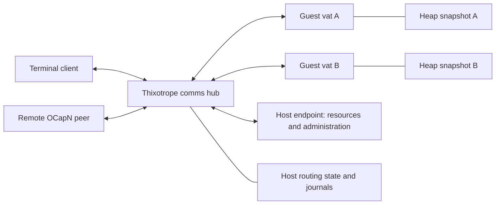

# Thixotrope

| | |
|---|---|
| **Created** | 2026-07-16 |
| **Updated** | 2026-09-30 |
| **Author** | Aaron Davis (prompted) |
| **Status** | In Progress |

## Motivation

Thixotrope is a distributed object-capability machine with orthogonally persistent JavaScript vats.
A vat's objects, variables, closures, and supported pending computations survive suspension and
host restart without application-written serialization or reconstruction functions.

The objective is more than convenient persistence.
Programs should be able to retain remote object references and register promise listeners that
remain meaningful across restart.
A vat can wait for a remote result without occupying a running worker process.
An inventory of named objects is a user convenience, not a prerequisite for persistence or the
mechanism that determines object lifetime.

This document describes the main design and current implementation boundaries.
[Package designs](../packages/thixotrope/designs/README.md) hold the implementation notes behind
contracts that are implemented, and potential mechanisms and experiments; only this document
states guarantees of the current runtime.
The [package README](../packages/thixotrope/README.md) provides commands and operational details.

## Architecture

The host owns workers, durable routing state, transports, and access to external resources.
Each worker runs one guest vat behind an OCapN endpoint.
Guest vats exchange messages through a host-side comms hub, including when both vats are local.
The hub forwards frames and rewrites reference positions without materializing the routed
application objects or promises in the host.

```mermaid
flowchart LR
    T[Terminal client] <--> H[Thixotrope comms hub]
    R[Remote OCapN peer] <--> H
    H <--> A[Guest vat A]
    H <--> B[Guest vat B]
    H <--> E[Host endpoint: resources and administration]
    A --- SA[Heap snapshot A]
    B --- SB[Heap snapshot B]
    H --- S[Host routing state and journals]
```

The host endpoint is a deliberate exception to forwarding-only behavior.
It materializes host-provided capabilities and serves administration requests.
Guest-to-guest references, answers, and promise settlements route through the hub directly.

### Package boundaries

| Component | Responsibility |
|---|---|
| `@endo/thixotrope` | Comms hub, worker and remote transports, host endpoint, persistence coordination, supervisor, and terminal tools. |
| `@endo/ocapn` | Protocol clients, wire codecs, reference-descriptor helpers, and signature operations. |
| `rust/thixotrope-ironhorse-worker` | One Ironhorse machine and SQLite heap per process, with a trusted supervisor command interface. |
| Ironhorse VM, snapshot, and SQLite store crates | JavaScript execution, supported machine-state encoding, integrity validation, and heap storage. |
| `rust/thixotrope-xs-worker` | The alternative XS worker engine. |

The comms hub is internal to Thixotrope at `packages/thixotrope/src/net/hub.js`.
Its persistence transactions and session lifecycle belong to the host design.
OCapN no longer exports a hub implementation.

The `WorkerEngine` interface separates the host's journal/session discipline from an engine's
snapshot and process mechanics.
Ironhorse and XS implement this interface.
Internal replay engines exercise host behavior without a native worker; they are test doubles,
not evidence of native heap persistence.

## Vocabulary

One word for one thing, throughout the code, the README and this document:

| Word | Meaning |
|---|---|
| vat | One guest heap behind one OCapN endpoint, run by a worker. A **durable** vat has a heap image and journal and survives sleep and restart; an **ephemeral** vat or worker has no recovery baseline and is discarded at startup. |
| session | A logical protocol relationship in the hub, with reference tables, answer routes and lifecycle; never a socket. A **durable session** belongs to a worker, a remote peer or the host endpoint itself and outlives sockets, processes and the daemon. A **transient session** (`transient:` key prefix) belongs to a transient client or a native adapter process and is discarded at startup. |
| transient client | A disposable host-side OCapN client with a transient session, for embedders; `daemon.openTransientClient()`. |
| resource | A host capability with a durable description, reconstructed through a registered factory at the host endpoint and retired when its meaning ends (`makeResource`, `retireResource`): alarms, introductions, worker facades. |
| native resource | A directory with `durable.js` and `ephemeral.js`, installed by name; its **manager** runs the durable module in a dedicated vat and its **adapter** runs the ephemeral module in a Node process. |
| manager | The durable half of a native resource: keeps desired registrations in its heap, holds one adapter incarnation through a **keeper**, and is notified at every start. |
| adapter | The ephemeral half of a native resource: one incarnation per Node process, restored from the manager's desired state; the only sense of the word in this package's code and documents. Platform ports have implementations, not adapters. |
| registration | One desired entry a manager keeps under a key, and the **handle** a caller holds for it, with `status()` and `close()`. The public object a native resource installs into the inventory is its **facet**. |
| subscription | A listener on an observable map. A **durable** subscription is a guest's and survives restart; an **ephemeral** subscription is a view's, bridged by the running supervisor, and is discarded at restart. |
| installation | One name in the workspace registry: an application or a native resource, with its code digest, grant mapping, allocation key, vat and outcome. |
| grant | A user handing an inventory value to an installation under a power name. Host-provided services are **provided**, not granted. |
| publication | A swissnum-to-capability mapping in the hub, fetched through the bootstrap; also a retention root. |
| introduction | The exchange of contact inboxes that an **invitation** grants once; `invite`, `accept`, `revokeInvitation`. Dialling a peer is **connecting**, never introduction. |
| message | One mailbox record, sent to a contact or received from one; the CLI area for this is **mail**. |
| identity | An OCapN key pair and the node location it signs; a **contact** is a local object for one correspondent, and a contact name is a label, not an identity. |
| guest prelude | The globals every vat has beside the language: `E`, `Far`, `harden`, `makeExo`, `M` and the rest, typed as `GuestGlobals`. |

## Guest state, identity, and authority

Guest code runs in SES compartments and receives explicit capability endowments.
It has no ambient host filesystem or process access.
Remote calls use eventual send; results and failures return as protocol messages.

Worker ids are host-generated and unguessable.
Debug labels help administration but do not grant authority.
A caller reaches a guest object through an existing reference, a granted worker facade, or a
publication fetched through the hub's bootstrap.
A publication associates a secret with a reference and can be represented as an OCapN sturdy reference.

The hub maintains per-session reference tables, answer routes, and reference counts.
A reference row records its origin session and incarnation, position, and object/promise role.
Session retirement tombstones origin rows so old references fail instead of designating new objects.
Publications and third-party gift handoffs are also represented in hub state.

Orthogonal persistence preserves the guest's heap relationships.
It does not make an operating-system resource persistent, repair incompatible code, or guarantee
that an external operation can safely be repeated.
Those capabilities cross the host endpoint and have their own failure contracts.

### The guest prelude

Every vat has the same globals beside the language and the shared intrinsics: `E`, `Far`,
`harden`, `makeExo`, `defineExoClass`, `defineExoClassKit`, `M`, `matches`, `mustMatch`,
`passStyleOf`, `Fail`, `q`, `makeError`, `makePromiseKit` and `makeSerialQueue`.
The prelude is one hardened record installed on the compartment of every worker peer on every
engine, so source evaluated in a vat, a bundle installed into one, and a factory the supervisor
ships into one by its source text all see one vocabulary, and guest code is held to the same
conventions as host code: exos with interface guards, patterns for shapes, `Fail` for assertions.
Bundled guest code reads the names it wants off `globalThis` in one destructure typed as
`GuestGlobals` from `@endo/thixotrope/guest.js`; it bundles nothing the prelude provides.
A factory shipped by source may import only what the prelude provides, under those names, and
defines everything else inside itself, since a binding beside it at module level is present in the
host and `undefined` in the vat; a test evaluates each such factory with only the prelude in scope.

## Sleep, restore, and message recovery

An idle worker can finish its current execution step, checkpoint, and terminate.
Its logical OCapN session remains present.
The next incoming frame restores the worker and resumes delivery without requiring the application
to rebuild its exported objects or listener registrations.
Sleep is host policy; it is not a guest application lifecycle callback.

The worker transport serializes delivery, sleep, wake, crash handling, and retirement.
Recovery pairs an immutable sleep image with its journal cut and replays the remaining journal suffix.
Daemon startup wakes workers with a journal suffix so accepted work resumes without new traffic.
Workers whose journals are fully checkpointed, and quarantined workers, remain asleep.
An abandoned live database is not a recovery baseline: it may be ahead of the selected image without
matching the host's committed delivery state.

Three distinct records establish local delivery continuity:

- Incoming worker frames are journaled before they reach the engine.
- Worker output has a stable session sequence across deterministic replay, letting the hub suppress
  repeats whose effects it has already committed.
- Hub outgoing frames receive stable per-destination delivery identifiers, saved with destination
  journal entries so a repeated handoff does not create another logical invocation.

The hub commits the incoming processed watermark, reference-table changes, and resulting outbox
frames together before releasing output.
A destination's durable queue acceptance is distinct from completion of the guest method.
A failed connection or missing reply must not be interpreted as proof that a sent invocation did
not execute.

### Ironhorse integration

The Rust worker opens or restores one SQLite heap, runs trusted bootstrap code for a fresh heap,
and accepts evaluation requests from the supervisor.
A successful execution step, including its promise jobs, commits before the worker publishes its result.
Guest outbound frames remain in the heap until the worker transport drains them through a committed
step.
A deterministic VM halt produces a fatal result and quarantines the vat; it does not commit the
failed execution step or repeatedly replay it into service.

The host pins the worker executable, bootstrap bytes, and protocol profile.
Execution and heap limits are configurable daemon-wide defaults, reported by `thix status`.
Runtime manifest version 2 refuses a decrease of the slot or chunk ceiling across restart, since a
restored heap may already exceed a lower ceiling; budgets and the request watchdog timeout may
change in either direction, and a manifest from a newer version is reported as such.
The crank meter resets for each evaluation; heap ceilings apply across the vat's lifetime, with
collection between completed cranks.
Per-vat overrides remain a follow-up, and raising limits does not clear a vat's failure metadata.
See [Ironhorse limits](../packages/thixotrope/designs/ironhorse-limits.md) for exact settings.
Incompatible or unversioned stored state is refused.
A closed SQLite image is copied only after successful worker shutdown folds in its WAL.
Snapshot references are file digests and are checked before restore.
Kernel leases prevent competing supervisors and abandoned workers from writing accepted state
concurrently.

The underlying engine supplies validated heap persistence and supported native async activations.
Application-level code upgrades and automatic runtime migration are not implemented.

## Remote objects and connections

A durable reference's lifetime is separate from any particular socket.
Connection acquisition reuses a healthy route or attempts a lazy connection and can fail before an
application invocation is accepted.
Once a vat commits a send, the node owns a durable outbox obligation.
Temporary connection failure leaves that obligation pending; recovery retries the same delivery
identity until responsibility is transferred or a defined terminal disposition is recorded.
A socket error alone is not such a disposition.

Unsettled application promises and their listeners survive disconnection.
Invocation acceptance does not settle the result promise.
A later settlement is another message that is delivered when connectivity permits.
Lost delivery confirmation requires recovery of the existing message, not a fresh invocation.
The intended contract applies to handoffs within a node as well as between nodes.
Each owner retains recoverable work until the next owner durably accepts responsibility.

`makeDurableNetLayer` implements this transfer with a versioned envelope, decimal sequence numbers,
and separate accepted and processed watermarks.
The receiver records the payload in its durable inbox before acknowledging acceptance.
Hub dispatch commits routing changes and onward outboxes before inbox reclamation.
Lost acknowledgements trigger retransmission and repeated acceptance receipts, without a new logical
invocation.
Both originator and acceptor session records recover across daemon restart, including pending
handshake identity and output.
Ordinary socket loss preserves references, listeners, and delivery obligations.

Peers advertise whether acceptance survives restart or only the current process.
A peer without session resumption supplies the weaker process-lifetime contract explicitly.
The protocol refuses an acceptance-profile change within an incarnation and rejects receipt-only
version 1 envelopes; old version 1 session records are not automatically migrated.
This resumption envelope is Thixotrope-specific, not an OCapN standard.
Resume tokens are bearer capabilities and require a confidential, authenticated base transport in
production; the TCP testing transport does not supply those properties.

Retirement persists a tombstone, completes hub cleanup across restart, and answers later reconnects
with a terminal disposition if the original close notification was lost.
Temporary unavailability cannot retire a session.
Storage publication uses synchronous file and directory flushes, but process-crash tests do not
establish hardware power-loss behavior.

## Host resources and persistence boundaries

Host capabilities have durable descriptions and are reconstructed through registered factories.
A resource whose meaning has ended is retired: the host forgets its instance and nulls its recorded
exports, so a restart seats tombstones for it rather than re-running the factory, and the guest's
release of an export drops that export's record.
Retiring a worker also releases the host state keyed by it, such as its alarm rows.
Host-origin nondeterministic results enter guest state as journaled protocol replies.
The host endpoint treats unrecoverable pending host-operation answers as at-most-once obligations:
restart rejects them rather than blindly repeating an external effect.
Guest-owed answers and supported promise listeners remain in guest heap state.

The supervisor also bridges ephemeral observers into the persistent workspace.
An inventory TUI uses a dedicated connection and receives display snapshots rather than the
inventory's capability values.
Closing the TUI, losing its socket, or stopping the supervisor releases the observer and cancels its
subscription; restart discards old UI subscriptions while preserving durable guest listeners.
Bounded cleanup prevents a stalled guest cancellation from holding the supervisor open indefinitely.
Removing a subscription makes its state eligible for ordinary collection; it does not prove physical
heap reclamation has already happened.

### Native resources

A native resource is a directory with `durable.js` and `ephemeral.js`, installed by name into the
workspace registry the way an application is: `thix install-native STATE NAME DIRECTORY`.
The two modules are the two halves of one thing.
The **manager**, the durable module's kit, runs in a dedicated vat whose heap persists.
The **adapter**, the ephemeral module's root, runs in a Node process that owns the operating-system
resource and is expected to die.
The split is a persistence barrier before it is a division of labour: orthogonal persistence is
indiscriminate, so a durable vat holding live sockets, buffers and request closures would persist
what must not survive, and running all of that in a process makes "everything here dies"
structurally true instead of a case-by-case judgement.

The manager holds policy and desired state; the adapter holds mechanism and no memory of who asked
for what.
Consumers hold references only to the manager's facet, never to the adapter, so the authority over
the host resource is concentrated in a thing with no policy, and when an incarnation is retired the
only holder of dangling references is the manager, which is the one thing equipped to re-establish.
Retirement is generation identity: the hub tombstones a retired session's rows, so a stale reference
breaks rather than reaching a successor.
A manager holding a consumer's handler retains that consumer's vat, which is correct: a vat being
served is reachable, and it is released by withdrawing the registration and dropping its handle,
which still names the handler it was made with.

`durable.js` exports a synchronous `make(powers)` that receives `{ adapters, makeKeeper,
makeManager }`, with the guest prelude in scope, and returns `{ facet, lifecycle }`.
`makeManager({ label, same, replaces, describe })` writes the manager's bookkeeping once: it keeps
the desired registrations, holds one adapter incarnation through a keeper, reconciles each
registration against it, hands out per-registration handles whose `status()` and `close()` act only
on their own generation, withdraws desired state durably before telling the adapter, retires an
incarnation whose unbinding is uncertain, and rebuilds the adapter at startup when anything is
desired.
`ephemeral.js` exports `make()` returning the adapter, built with `makeAdapter({ label, same,
replaces, bind, unbind })` from `@endo/thixotrope/native-adapter.js`, which serializes operations,
keeps the bindings, replaces or refuses a differing registration as the author decides, and restores
a set of registrations one at a time, reporting each failure without giving up on the rest.
The two speak one protocol: `bind(key, spec)`, `unbind(key)`, `restore([[key, spec], …])` and
`keys()`, where `spec` is whatever passable record the author registers under a key.
Sameness of a registration is the author's to state on both sides, since a record crosses the wire
as a fresh copy each time; an adapter forgets a binding only once its release succeeds, so a failed
release is retried by a later unbind and reaches the manager's retirement path.
`src/native/contract.js` states the contract as types.

Only the facet enters the named inventory slot; applications receive it through grants.
The lifecycle facet is published privately for the manager's own start notice, which the daemon
delivers at every start after every vat is seated, to every manager in parallel and within one
bound.
A manager with anything desired rebuilds its adapter then; between starts, adapter death is
repaired by the next operation that needs an adapter, and there is no autonomous restart monitor.
Each adapter incarnation has one transient session, shared by its requests; retiring the process
retires that session and breaks its references.
Directory contents and the durable bundle are pinned by digest; source changes require a new
installation, and dependencies outside the directory are not part of the digest.
Removing an installation retires the manager vat first, which closes the processes it launched and
withdraws its start notice, and only then forgets the name.

HTTP is the first native resource, `resources/http`.
Its facet registers a handler on a port with an optional origin policy and returns the handle;
registration succeeds even when binding fails, and `status()` retries the binding and reports an
inactive listener with its error, so a caller can always withdraw desired state.
The adapter owns the server, sockets, request buffers, deadlines and response handling, copies only
method, path and text body into the guest, bounds bodies, concurrency and duration, and rejects
cross-origin browser access by exact Host and Origin or Fetch Metadata checks.
These checks do not authenticate local processes; the guest HTTP interface is available to local
clients.
A replacement adapter restores registrations, never pending requests, and an already accepted guest
invocation may complete after the HTTP client is gone.

### Durable time promises

The supervisor provides a public clock as an installation in a vat of its own, under `clock` in the
inventory, so it has its own budget and failure lifetime and retiring it drops its alarm rows.
It exposes `now()`, `when(deadline)`, and `arm(deadline)` with a per-alarm cancellation capability.
The host records deadlines and terminal outcomes in a small manual-persistence ledger.
It schedules one timer for the earliest pending deadline; there is no periodic guest scan or host
control facet that enumerates guest alarms.

Fulfillment time or cancellation is persisted before settling the corresponding host promise.
The clock observes that promise and gives callers a separate guest-owned promise, which other vats
may retain without directly observing the host resource.
After recording settlement through the vat's normal persistence mechanism, it acknowledges cleanup.
The host retains the outcome until that acknowledgement, so restart can replay an interrupted delivery.
An interrupted acknowledgement retries; other cleanup failures retry on subsequent clock use.
An interrupted arm is abandoned explicitly because the host may already have stored its deadline.
See [alarm settlement](../packages/thixotrope/designs/alarm-settlement.md) for the protocol.

The initial profile uses absolute bigint Unix milliseconds in the nonnegative signed 64-bit range.
The shared limit of 1,024 rows includes pending alarms and unacknowledged outcomes.
A deadline that passes during downtime settles after restart, preserving downstream guest listeners.
Wall-clock adjustments affect when deadlines become due; this is not a real-time scheduling guarantee.
Cancellation is supported; recurring scheduling remains application work.

## Workspace and installed applications

The local supervisor owns a persistent workspace and exposes administration over a private Unix socket.
Terminal attachment does not own the workspace lifetime.
Disconnecting a terminal leaves guest state available for later attachment.
The socket carries local administrative authority and is protected by the state directory's ownership
and permissions.

Workspace metadata carries a version the supervisor bumps whenever a guest closure it ships changes
shape; the current version includes dedicated native managers, the alarm acknowledgement protocol,
the mail address book with its introductions resource, manager-owned adapter launchers, the one
installation registry, and the clock and mailbox provided through it.
Earlier workspaces require explicit migration or fresh state; startup rejects them before restoring
workers, because their heap-persisted registry and clock closures cannot be replaced by loading
new source.

The workspace supplies a worker controller and an observable inventory backed by an ordinary Map.
Guest code can retain capabilities in normal variables and closures without using the inventory.
Inventory entries retain values through normal references; inventory changes do not control a
separate garbage-collection regime.

An application module exports `make(powers)`.
The CLI bundles its static module graph and grants only explicitly selected inventory capabilities.
One persistent workspace registry records every installation, application or native resource: its
name, code digest, grant mapping, the vat the host allocated for it under an idempotent allocation
key, and its pending, ready, or failed outcome; the installed value takes the name in the inventory.
The host drives the phases, each durable in the workspace, so an interrupted installation resumes
on a retry with the same identity without allocating a second vat or running a factory twice.
The bundle is staged into the new vat in bounded messages, and the workspace obtains that vat's
guest evaluator directly so an asynchronous factory result survives host restart as a
guest-to-guest promise.
Reinstalling the same name, code, and grant mapping reuses the existing result.

Installation captures code and powers; it does not reload changed source files or upgrade an existing
application's heap.
Grants are limited to remotable capabilities and checked before any vat exists.
Removing an installation retires its vat first and then forgets the name, so a removal interrupted
between the two is finished by the next removal or installation under that name.

## Contacts and capability offers

Local supervisors communicate through private, same-user Unix sockets with durable session recovery.
The transport fragments large logical messages without imposing a smaller limit after durable admission.
Publication imports and third-party gift redemptions share one outgoing session per exporter, preserving
its routing alias and dial location across restart.
An invitation grants one reciprocal exchange of contact inbox capabilities.
Contact labels are local names, not authenticated human identities.
The mailbox owner can cancel an invitation and withdraw its publication without revoking an
established contact.

Each mailbox lives in a guest vat, separate from the workspace and shared application vats.
Received offers and delivery listeners persist as ordinary mailbox guest state.
The mailbox accepts correspondent capabilities directly and has no pet-name registry.
A separate workspace address book resolves names through the user's observable `contacts` inventory
entry by convention.
The same identity can be kept in an ordinary variable and passed to `mailbox.send` without naming it.
Incoming facets bind the local sender identity; peers cannot supply their own display labels.
Inbox and outbox records retain identities, while the address book resolves current labels for the UI.
Renaming a contact therefore does not rewrite mailbox records or replace remote references.
An offer carries one explicitly selected capability; accepting it may retain it in the user's inventory.
The recipient's terminal receives descriptions only and disconnects when closed.
The node outbox handles delivery retries after admission; mailbox code does not resend on reconnect.

## Platform powers and service atoms

Core factories receive their platform powers explicitly.
Node module imports and ambient host authority are confined to the Node power factory and host
composition entrypoints; the XS worker bootstrap is a separate platform perimeter.
Core lint rejects built-in module imports and re-exports, dynamic module acquisition, and ambient
I/O, randomness, clocks, and scheduling.
Tests exercise the effective lint configuration with negative authority probes.

The powers include storage, scheduling, entropy, process launch, network listeners, and terminal I/O.
Calling a core factory does not construct default Node powers or fetch a shared platform singleton.
An alternative host can supply these capabilities explicitly.
The current Unix transport and Node worker implementations still implement platform-specific
behavior; the boundary makes those dependencies replaceable, rather than claiming they already run
on every operating system.

Persistent service metadata uses a `SyncStringAtom`: a synchronous `read()` returns a string or
`undefined`, and a successful `write(string)` durably replaces the slot before the next effect.
The file-backed atom is one implementation.
The host alarm ledger performs its JSON encoding and transitions above this interface.
HTTP registrations live in their installed manager vat's heap; the public clock's promises live in
the clock vat's heap.
The manual persistence boundary is confined to host state that cannot rely on a durable guest heap.
Platform implementations return plain data, iterator facades, and opaque tokens rather than Node
streams,
servers, or timer objects; callbacks likewise do not receive native objects as their receiver.

## Publications and host observation sessions

`daemon.publish(value, secret?)` records a durable swissnum-to-capability mapping in the hub.
Together, the node location and swissnum form an OCapN sturdy reference: a remote peer fetches
that swissnum from the node bootstrap to obtain the capability.
Publication is also a retention root.
`unpublish(secret)` removes the locator and its root; it does not revoke capabilities already fetched.
Importing a publication reuses the canonical outgoing peer session, including one previously
established for a third-party gift.
An existing connection or in-flight connection attempt is reused rather than handshaken again.

A session is a logical protocol relationship with reference tables, answer routes, and lifecycle
state; it is not synonymous with a socket.
Durable peer sessions survive socket loss and daemon restart.
The host endpoint is a reifying session used by host resources and administration.
Worker sessions connect the hub to persistent guest heaps.

A transient client is a short-lived, reifying host client with its own transient hub session,
keyed under the `transient:` prefix to mark that it cannot be restored.
Nothing in the supervisor opens one today.
Administration goes through the endpoint's durable session, and the inventory view holds a
control-socket connection whose subscription the supervisor releases.
The mechanism remains for embedders.
Native adapter processes instead have one transient hub session per incarnation; HTTP shares that
session across requests, and alarm settlement uses restorable host promises.
Closing a client retires its session and releases its references and answer routes.
The daemon tracks both clients being opened and clients already open, so shutdown cannot miss
an opening that completes concurrently.
After a crash, startup removes orphaned transient sessions before resuming ordinary work.
This cleanup does not retire durable peer sessions or reject their unsettled guest promises.

At the host endpoint, an unresolved computation can become unreachable even while a guest retains
its separate result promise.
The guest result does not point back to the host computation or its reaction closures.
The current restart-abort policy explicitly retains the guest resolver route until settlement,
so a subsequent host restart can reject that abandoned operation.
This root retains a protocol obligation, not the original host computation.
It is specific to ephemeral host operations and does not apply to guest-to-guest pending promises.
There is currently no caller-abandonment notification to release a never-settling host obligation
before the endpoint lifetime ends.

## Retention and retirement

Object lifetime follows heap and protocol references.
Vat collection uses a conservative graph of host roots and cross-session references.
Roots include publications, awake workers, explicit keeps, applicable remote sessions, and outstanding
host operations; answer routes, listeners, gifts, and worker facades also affect retention.
A disconnected durable session can retain a vat even while no socket is present.

`reachability` reports this graph without waking guests.
`collect` uses the same graph and rechecks between retirements because incoming traffic can add roots.
The report explains protocol-level vat retention, not every JavaScript retaining path inside a heap.
It omits publication and gift secrets and fingerprints external session identifiers.
Dropping an application or inventory reference can still require guest GC and protocol release before
a vat becomes collectible.

Explicit worker retirement ends the vat and removes its store.
The hub withdraws publications, tombstones references, and breaks affected pending listeners.
Existing remote references do not acquire authority over a new vat under the old identity.
Retirement cannot undo external effects already performed.

## Validation and limitations

The main integration examples each use two guest vats connected through comms: a caller invokes a
counter in another vat, and a promise listener survives restart before receiving settlement.
Tests also exercise process-crash boundaries, reference retention, quarantine, runtime ownership,
workspace restart, installation, and ephemeral UI cleanup.
Process-crash tests do not establish hardware power-loss safety or exactly-once effects in an
arbitrary external service.

Other present limitations include unbounded remote retransmission buffers, indefinite parked durable
sessions, whole-image copying for sleep/wake, and no live heap/code upgrade.
The engine does not persist suspended async generators or `Array.fromAsync` operations.
Protocol limits include rejection of a listen on the sender's own export and pipelining onto an
undeposited gift.
These limitations should remain explicit rather than be obscured by the persistence abstraction.

## Dependencies

| Design | Relationship |
|---|---|
| [Ironhorse snapshot store seam](ironhorse-snapshot-store-seam.md) | Incremental heap persistence and storage integrity used by the Ironhorse worker. |
| [OCapN transport separation](ocapn-network-transport-separation.md) | Protocol and transport boundaries underlying peer communication. |
| [Potential Thixotrope designs](../packages/thixotrope/designs/README.md) | Separate exploration of upgrade, delivery policy, forced revocation, and resource lifetimes. |

## Prompt

> Rewrite the top-level Thixotrope design as `designs/thixotrope.md`, covering the main design
> points without the exploratory items.
> Keep potential designs in the Thixotrope package and consolidate the recent design commits into
> one change.
