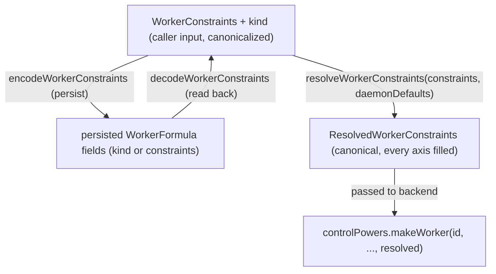

# Worker Constraint Model

| | |
|---|---|
| **Created** | 2026-08-16 |
| **Updated** | 2026-09-04 |
| **Author** | Kris Kowal (prompted) |
| **Status** | Proposed |

## What is the Problem Being Solved?

Every worker the daemon spawns is selected by a single closed field,
`kind?: 'locked' | 'node'`, threaded identically from the `worker`
formula through the daemon core down to the supervisor backends:

- `packages/daemon/src/types.d.ts` — `WorkerFormula.kind?: 'locked' | 'node'`
  (the persisted formula field, reincarnated on daemon restart) and
  `DaemonicControlPowers.makeWorker(..., kind?: 'locked' | 'node', ...)`
  (the control-power contract every backend implements).
- `packages/daemon/src/manager.js` — `formulateNumberedWorker`,
  `makeIdentifiedWorker`, `provideWorkerId`, the `defaultWorkerKind`
  daemon option, and the `workerFormula.kind ?? defaultWorkerKind`
  (`manager.js:2172`) locked-vs-node resolution that decides
  archive-vs-tree loading.
- `packages/daemon/src/bus-manager-rust-xs.js` and
  `packages/daemon/src/bus-manager-node-powers.js` — the two backends
  whose `makeWorker` **acts on** `kind`: each picks `ENDO_NODE_WORKER_BIN`
  for `kind === 'node'` and `ENDO_WORKER_BIN` (the XS binary) otherwise.
  They differ in their in-backend default: `bus-manager-rust-xs.js`
  leaves `kind` `undefined` (`:469`), while `bus-manager-node-powers.js`
  defaults it to `'locked'` (`:206`).
- `packages/daemon/src/manager-node-powers.js` and
  `manager-go-powers.js` — the other two `makeWorker` control powers.
  Both accept `kind` and currently ignore it (`kind` is `no-unused-vars`
  at `manager-node-powers.js:1079`; `_kind` at `manager-go-powers.js:178`).

Two problems follow from encoding worker selection as this one closed
union:

1. **It hard-codes today's two kinds as the ceiling.** `'locked'` and
   `'node'` conflate *which engine runs guest code* with *how the
   worker is supervised*. They leave no room for the runtime axis to
   grow (XS-in-Rust via Ironhorse, PR #600, is a genuine third point on
   that axis, not a fourth `kind`), and no room at all for orthogonal
   concerns — durability, version, target platform/architecture — that a
   caller will increasingly need to express.

2. **Every emerging worker category has to fight the union.** The
   maintainer's headline case is a *durable, orthogonally persistent*
   worker (snapshotted, transcripted, message-embargoed for
   hangover-consistency — the guarantee that a worker resumed from a
   snapshot never re-delivers or double-acts a message it had already
   processed before the snapshot, i.e. no "hangover" of in-flight
   obligations replayed across resume — `@endo/thixotrope`, PR #786;
   the quiescence embargo, PR #989; the snapshot substrate, PR #281; the
   metered-storage worker, issue #984). Under the closed union each of
   these becomes a bespoke new `kind`, cross-multiplying with the
   runtime axis (a durable XS worker, a durable node worker, a durable
   XS-in-Rust worker are three `kind`s for one idea). Version pinning
   and target-platform binary selection have no home in the union at all.

This design replaces the closed union with an **open, multi-axis
constraint expression** a caller passes when requesting a worker. Each
axis is independent and individually optional; an omitted axis means
*flexible — the daemon resolves it*. Today's `'locked'` and `'node'`
become the two seed points of one axis (runtime) with every other axis
flexible, migrated with **zero behavior change and zero persisted-formula
churn**. The remaining axes (persistence, version, target) land now as
**typed, named extension points** — most not yet implementable, but
shaped so the converging work slots in additively rather than reworking
the seam.

## Goals and Non-Goals

**Goals.**

- Define a `WorkerConstraints` schema with independent, individually
  optional axes: **runtime**, **persistence**, **version**, **target**.
- Migrate today's `'locked'` / `'node'` onto the runtime axis as its
  first two instances, byte-for-byte preserving existing worker formula
  records and behavior.
- Keep the wire/API surface **strictly additive** over
  `kind?: 'locked' | 'node'`, so existing callers (CLI `@node`
  selection, `provideWorkerId`, `formulateWorker`) need no change.
- Give the durable/persistence, version, and target categories each an
  explicit, well-typed place in the schema, and name the exact seam
  where each resolves — without designing those mechanisms here.
- State the input-coercion and rejection stance (hardened copy-record,
  allowlist membership, fail-closed on an unserviceable axis) so the
  schema is safe to accept across the CapTP boundary.

**Non-Goals (flagged, not resolved).**

- The durable-worker *mechanism* (snapshot/transcript/embargo). That is
  thixotrope + #989 + #281 + #984; this design only makes it
  *expressible* as a constraint.
- The version *resolution* mechanism (how a pin maps to a build).
- The target *binary-fetch* mechanism (e.g. S3 pull). This design only
  marks the seam.
- Any change to the supervisor backends' actual spawn logic beyond the
  mechanical `kind -> constraints.runtime` normalization.

## Current State (the seam as it exists)

Tracing one worker request end to end on `llm`:

1. **Formula.** A worker is a persisted formula, reincarnated on daemon
   restart:
   ```ts
   type WorkerFormula = {
     type: 'worker';
     label?: string;
     trustedShims?: string[];
     kind?: 'locked' | 'node';
   };
   ```
   `formulateNumberedWorker` (`manager.js:5250`) spreads `kind` in
   **only when truthy** (`...(kind ? { kind } : undefined)`), so a
   flexible-default worker persists as `{ type: 'worker', label }` with
   no `kind` key at all. Key *presence* — not the resolved value — is the
   load-bearing fact (see *Migration*): the formula number is a random
   256-bit value (`randomHex256`), never a hash of the formula body, so
   the persisted record's *shape*, not any content address, is what
   backward-compatibility must preserve. The in-tree comment beside the
   sibling `formulateMount` says exactly this
   (`manager.js:4562`: "Formula numbers are random, not
   content-addressed, so this is about the record's shape and
   backward-compatibility, not formula identity").

2. **Default resolution.** The daemon carries a `defaultWorkerKind`
   option (`'node'` by default, `manager.js:481`). Three bring-ups set
   `defaultWorkerKind: 'locked'` — `bus-manager-node.js:158`,
   `bus-manager-rust-xs.js:701`, and `manager-go.js:164`. The effective
   kind is `workerFormula.kind ?? defaultWorkerKind`, used at
   `manager.js:2172` to choose the archive-packing path (locked/XS
   workers cannot yet run `parseArchive` themselves) versus the
   `makeFromTree` path. This read binds the loading path *late*, from the
   persisted key's presence.

3. **Provision.** `makeIdentifiedWorker(workerId, context, kind, ...)`
   forwards `kind` to `controlPowers.makeWorker(...)`. `provideWorkerId`
   (`manager.js:5665`) additionally branches on `!existingFormula.kind`
   to decide whether to mint a *separate* Node worker — a second reader
   that keys on the **absence** of the `kind` key.

4. **Control power.** `DaemonicControlPowers.makeWorker` carries
   `kind?: 'locked' | 'node'`. There are **four** `makeWorker` control
   powers, and **two act on** `kind`: `bus-manager-rust-xs.js:485` and
   `bus-manager-node-powers.js:226` (binary selection). The other two —
   `manager-node-powers.js:1079`, `manager-go-powers.js:178` — accept and
   ignore it.

5. **Caller surfaces.** `provideWorkerId(..., kind)` mints a distinct
   Node worker when a `'node'` worker is asked for under a `'locked'`
   default; the host registers special names `@main` and `@node`
   (`host.js`); the CLI's `endo make --UNSAFE`/import path defaults the
   unconfined worker to `@node`.

The constraint model threads through the persisted-formula field, the
two late-binding reads that key on the `kind` key
(`manager.js:2172`, the archive-vs-tree read of
`workerFormula.kind ?? defaultWorkerKind`; and `manager.js:5665`, the
`!existingFormula.kind` node-worker split — the `defaultWorkerKind` read in
that block is `:5657`), the formulation write (`:5250`), the four
`makeWorker` control powers, and the `interfaces.js` shape guard
(§ *Passability and rejection*) — the migration must normalize **all** of
them, not the single Rust seam alone. Concretely, both late-binding reads
must route through `decodeWorkerConstraints`: a worker persisted as
`{ constraints: { runtime: … } }` with **no** `kind` key must not fall
through `:2172`/`:5665` to `defaultWorkerKind`'s path (§ *Migration*, the
two-reads normalization) — the seed-value migration alone leaves those two
readers keying on a `kind` key a `constraints`-carrying formula does not have.

## The Constraint Model

A caller expresses worker requirements as a `WorkerConstraints` record.
Every axis is optional. An omitted (or `undefined`) axis means
**flexible**: the daemon resolves it from its configured defaults
(preserving today's `defaultWorkerKind` semantics precisely). A present
axis is either a concrete pin or an explicit flexibility qualifier
(e.g. a version range).

```ts
/**
 * A partial specification of a worker. Every axis is independently
 * optional. Omitting an axis delegates its resolution to the daemon
 * (flexible). The empty object {} is fully flexible and is the
 * canonical form of "any worker the daemon would make by default" —
 * it MUST persist identically to today's no-`kind` formula.
 */
export type WorkerConstraints = {
  /** Engine + supervision axis. Open set; see WorkerRuntime. */
  runtime?: WorkerRuntime;
  /** Ephemeral vs. durable/orthogonally persistent. See WorkerPersistence. */
  persistence?: WorkerPersistence;
  /** Worker build/version pin. See WorkerVersion. */
  version?: WorkerVersion;
  /** Target OS/architecture. See WorkerTarget. */
  target?: WorkerTarget;
};
```

The four axis-value types spell alike — bare `WorkerRuntime` /
`WorkerPersistence` / `WorkerVersion` / `WorkerTarget`, no `Constraint`
suffix — so a reader can predict the name of any axis's value type from
the field name alone. `WorkerConstraints` is the only *caller-facing*
`Constraints`-named type (the seam also defines `ResolvedWorkerConstraints`,
`PersistedWorkerConstraints`, and the `WorkerConstraintsShape` guard, all
internal). Every new `export type` this design names lives in
`packages/daemon/src/types.d.ts` (beside the existing `WorkerFormula` at
`:174` and `makeWorker` at `:2462`), not a new `types.js`.

### Axis 1 — runtime (migrates today's `kind`)

The runtime axis names *which engine executes guest code and how it is
supervised*. It is an **open string-tagged set**, seeded with today's
two values and reserving the near-term third. The escape hatch is spelled
`(string & {})`, not bare `string`, so the seed literals survive
TypeScript's union reduction (a bare `| string` absorbs the literals and
erases all completion, narrowing, and typo-checking — the "typed
extension point" would be untyped):

```ts
/**
 * Open set. The daemon rejects a runtime it cannot service (see
 * "Passability and rejection"), so callers and the schema can grow
 * independently. Seed values:
 *   'locked'      — XS guest under xsnap, confined; today's 'locked'.
 *   'node'        — plain Node.js worker; today's 'node'.
 *   'xs-in-rust'  — XS embedded in a Rust process (Ironhorse, PR #600).
 *                   RESERVED; not yet wired at this seam.
 * The `(string & {})` member keeps the union open while preserving the
 * three seed literals for completion and exhaustiveness.
 */
export type WorkerRuntime = 'locked' | 'node' | 'xs-in-rust' | (string & {});
```

The three points `xs-in-rust` / `locked` (XS-via-xsnap) / `node` are one
axis, per the maintainer's framing, not three unrelated kinds. Keeping
`WorkerRuntime` open is deliberate: a new engine is a new *value*, added
at the resolver, with no change to the schema or to callers that don't
ask for it.

The runtime axis is also the **confinement** axis, and the design says so
explicitly: `'locked'` is the confined XS guest, `'node'` is an
unconfined Node process (the CLI defaults the `--UNSAFE` unconfined
worker to `@node`). Because two of the four backends accept-and-ignore
the axis and the two that act on it fall back to a default binary when
their env var is unset (`bus-manager-rust-xs.js:485`,
`bus-manager-node-powers.js:226`), an *unserviceable* runtime must **fail
the spawn**, never silently downgrade to whatever binary the backend
happens to have — see § *Passability and rejection*.

The axis names *engine + supervision* together rather than splitting
them, even though today's two seed values already vary on both
(`'locked'` is the XS engine loaded via the archive-packing supervision
path; `'node'` is the Node engine on the tree-loading path). The two are
kept as one axis because, at this seam, the supervision strategy is a
*function of* the engine value. `xs-in-rust`'s supervision path is left
as **Open Question 6** rather than smuggled into the runtime string; if a
future runtime needs engine and supervision chosen independently, that is
the trigger to split the axis, and the open union means doing so is
additive. (`daemon-endor-architecture.md`'s already-designed
`separate`/`shared` split of `WorkerPlatform` is the concrete precedent
this open axis must reconcile with — see § *Reconciliation*.)

### Axis 2 — persistence (the durable-worker extension point) — *Not Started*

The persistence axis names the worker's **durability class**: whether
its heap and in-flight obligations survive daemon restart, and under
what consistency guarantee. Its discriminant is spelled `durability`
(not `class`, a JavaScript reserved word that cannot be destructured
`const { class } = ...`):

```ts
/**
 * EXTENSION POINT — schema only; no resolution implemented here.
 *   'ephemeral' — today's behavior: no snapshot, no transcript, lost on
 *                 daemon exit. The flexible default.
 *   'durable'   — orthogonally persistent: heap snapshotted and/or
 *                 message-transcripted, inbound messages embargoed at
 *                 quiescence to prevent hangover-inconsistency, host
 *                 obligations at-most-once across resume.
 */
export type WorkerPersistence =
  | 'ephemeral'
  | 'durable'
  | {
      durability: 'ephemeral' | 'durable';
      /** Durable substrate. Reserved; see thixotrope / #281 / #984. */
      substrate?: 'snapshot' | 'transcript' | 'snapshot+transcript';
      /**
       * Spawn-time opt-in: create this durable worker with a metering
       * channel wired up (snapshot/message-byte growth exposed for
       * external metering — issue #984, Minion Town). Immutable
       * capability bit; the live meter readings are read through a
       * separate READ-ONLY meter facet, NOT the worker's control facet
       * and NOT this formula field. Reserved.
       */
      metered?: boolean;
      /**
       * Spawn-time retention class (issue #984). Immutable substrate
       * selection; the adjustable retention window is set through the
       * control facet, not by reformulating the worker. Reserved.
       */
      retention?: 'session' | 'indefinite';
    };
```

This is the axis that lets issue **#984 (metered-storage worker)** be
expressed as *one constraint combination*
(`{ persistence: { durability: 'durable', metered: true, retention: 'indefinite' } }`)
rather than a bespoke worker kind — the job brief's acceptance test for
the schema. The `durable` class corresponds to the `@endo/thixotrope`
worker (PR #786; sleepy workers, XS heap snapshots, delivered-watermark
journals, at-most-once host obligations); the message-embargo guarantee
corresponds to PR #989's quiescence embargo, which composes with
thixotrope's journal-replay embargo rather than replacing it; the
snapshot/suspend/resume substrate underneath both is the
`daemon-xs-worker-snapshot` design + PR #281. **None of this is resolved
here** — the axis is a typed name so the mechanism lands additively.

**What belongs in the formula vs. what stays mutable.** Every field of a
worker formula is *spawn-time-immutable for the object's life* — a durable
worker is a categorically different object from an ephemeral one, and its
substrate is fixed at creation. The immutable, formula-worthy fields are
the ones that select *which substrate the worker runs on*:
`durability: 'durable'` and `substrate`. The `metered` and `retention`
fields are **policy, not substrate** — a billing tier or a retention
window changes over a running worker's life, so baking a specific value
into the immutable formula would be wrong. They appear here only as the
*capability opt-in* — the boolean `metered: true` says "this durable
worker is created with a metering channel wired up," a
spawn-time-immutable fact; the *live meter readings and the adjustable
retention window* are read and set through a non-formula channel (issue
#984's governance surface), and the readings specifically through a
**read-only meter facet** that does not close over the worker's
terminate/reformulate control authority. So #984's real requirement —
*adjustable* metering/retention on a running worker — is served by that
channel, and the schema fields are only the immutable "is this worker
metered at all / what retention substrate" bits. The exact facet shape is
thixotrope/#984's to design, not this schema's. (Because the split keeps
the mutable policy out of the formula, `metered`/`retention` are not part
of the resolved value that determines the persisted record — see
*Migration*.)

**Reincarnation of a metered durable worker.** Because `metered`/`retention`
are not in the formula, they must be re-established on daemon restart from
the **durable substrate / #984 governance surface**, not from the worker
record — the same surface that owns the *adjustable* policy while the worker
runs owns the record of which durable workers are metered and re-wires the
metering channel at resume, keyed on the reincarnated worker's identity and
its persisted `durability: 'durable'` substrate. So the acceptance
combination `{ persistence: { durability: 'durable', metered: true, retention: 'indefinite' } }`
(issue #984) survives a restart: the *substrate* selection (`durable` +
`substrate`) is what the formula persists and what makes the worker
categorically metered-capable, and the live channel is re-attached by #984's
surface. What this schema does **not** do is persist the `metered` bit into
the formula and pretend a spawn-time-immutable capability is carried there;
the exact reincarnation handshake is #984's to specify (tracked with the
durable-mechanism Non-Goal and Open Question 5's persistence-coupling).

**#989 reconciliation.** PR #989's own review direction is that the
embargo wants to be a **configuration flag on the slot machine across all
CapTP variants** (ocapn, slot machine, legacy captp), i.e. a transport
property rather than a property of `persistence: 'durable'`. This design
therefore does **not** assert the embargo *is* the durable class; it
records that a durable worker *composes with* whichever embargo #989
lands, and that the embargo's home is #989's to decide. Open Question 7
tracks the dependency.

### Axis 3 — version (unfiled; first home here) — *Not Started*

The version axis pins the worker *build* (engine/binary version), not
just the runtime family.

```ts
/**
 * EXTENSION POINT — schema only; no resolution mechanism here.
 * INPUT variants (the resolved form is canonical — see
 * ResolvedWorkerConstraints):
 *   omitted        — flexible: daemon uses whatever build it has.
 *   'latest'       — explicit flexible-latest (same effect as omitted).
 *   { exact }      — pin one build (e.g. an xsnap/Ironhorse version).
 *   { range }      — a semver-style acceptable range.
 */
export type WorkerVersion =
  | 'latest'
  | { exact: string }
  | { range: string };
```

Sketched, not committed: whether a pin resolves against a local build
registry, a fetched manifest, or the target-fetch provider (Axis 4) is
**Open Question 2**. The schema commits only to the *shape* of the
request.

### Axis 4 — target (OS/architecture) (unfiled; first home here) — *Not Started*

The target axis names the OS/architecture for the worker binary. On
deployments like minion.town the daemon may need to fetch a
platform+arch-matched binary from remote storage rather than assume a
local one is present.

The axis is named **`target`** (type `WorkerTarget`), deliberately
**not** `platform`/`WorkerPlatform`: `daemon-endor-architecture.md`
(Status: **Active**) already owns `WorkerFormula.platform?: WorkerPlatform`
with `@typedef {'separate' | 'shared' | 'node'} WorkerPlatform`
(`:388`) — a *supervision-topology* concept, not OS/arch. Reusing that
field name here would land two incompatible `platform` fields on one
worker formula (see § *Reconciliation*). The sub-field is spelled
`architecture`, not the abbreviation `arch`, and its sibling
`operatingSystem`, not the abbreviation `os`, in this design's own schema
(the *values* stay Node's short vocabulary; only the freshly-authored field
names are spelled out):

```ts
/**
 * EXTENSION POINT — schema only; no fetch mechanism here.
 *   omitted     — flexible; resolved to the daemon host's own os/arch.
 *   { operatingSystem, architecture } — pin a target
 *       (e.g. { operatingSystem: 'linux', architecture: 'arm64' }).
 * The operatingSystem/architecture VALUES are Node's
 * process.platform / process.arch vocabulary — that is the canonical wire
 * spelling; a binary-fetch provider owns any mapping to Rust target triples
 * (macos/aarch64/...), and the resolver owns the inbound normalization of a
 * runtime's own host self-detection (e.g. Rust `endor`'s macos/aarch64) back
 * to this Node vocabulary before it fills a flexible target.
 */
export type WorkerTarget = {
  operatingSystem?: 'linux' | 'darwin' | 'win32' | (string & {});
  architecture?: 'x64' | 'arm64' | (string & {});
};
```

**The seam, named but not built.** A pinned (or non-local) target
resolves in `bus-manager-rust-xs.js`'s `makeWorker`, exactly where
`ENDO_WORKER_BIN` / `ENDO_NODE_WORKER_BIN` are read today. A future
binary-fetch provider would be an injected power consulted there — given
`{ runtime, version, target }`, it returns a local path to a matched
binary (fetching from S3 or similar on a miss). Because that path is
executed, the provider owns the artifact's authentication: an eventual
`WorkerVersion`/target fetch reserves an `integrity` (content-hash) field
so the daemon can verify the fetched binary against the machinery it
already has (`locator.js`; the `digester.digestHex() !== hash` check in
`manager.js`'s fetch path). The existing `endoWorkerBin`/`endoNodeWorkerBin`
env lookups become the *local, flexible-target* branch of that provider.
This is **adjacent to but distinct from** the AWS storage line
(`designs/gateway-aws-attuned.md`, the S3-CAS + DynamoDB-state design, with
`designs/gateway-aws-deployment.md`; the PR #356 stack): that work is
DynamoDB+S3 for the daemon's *structured state and blobs* and never mentions
worker binaries or target selection. Nothing here designs the fetch — it
marks where it plugs in.

## The Seam It Plugs Into (resolution)

The constraint object is resolved in one place and lowered to the
existing backend call. Introduce a `resolveWorkerConstraints` step in
`manager.js` between formulation and `controlPowers.makeWorker`.

The design names **three** conversion edges over one subject, each with
an explicit function name (avoiding the earlier draft's anonymous,
direction-ambiguous `<->` edge). The load-bearing detail is which
*endpoint* each function reads: the persisted record is a function of the
**caller's explicit input** (§ *Migration*), a fact `ResolvedWorkerConstraints`
structurally erases (it fills every axis, so it cannot distinguish "the
caller supplied `node`" from "the daemon defaulted to `node`"). Encode and
decode therefore both live on the **input** side of resolution, not the
resolved side:

- `resolveWorkerConstraints(constraints, daemonDefaults)` — fills flexible
  axes with the daemon's defaults and canonicalizes each axis, producing a
  `ResolvedWorkerConstraints`. Takes the **canonicalized caller input**
  (`WorkerConstraints` plus the legacy `kind`); canonicalization —
  collapsing an axis's sugar spellings to one form, e.g.
  `{ persistence: { durability: 'ephemeral' } }` to `'ephemeral'` — is a
  pure, host-independent step run *before* the presence predicate, so two
  spellings of one request persist identical bytes (§ *Migration*).
- `encodeWorkerConstraints(constraints)` — derives the **persisted** formula
  fields from the caller's canonicalized input (legacy `kind` for the two
  seed runtimes, else a `constraints` sub-object — see *Migration*). It is
  typed over the *input*, `WorkerConstraints` + `kind`, **not** the resolved
  value, because the persisted form keys on input *presence* and resolution
  has already erased presence.
- `decodeWorkerConstraints(formula)` — the inverse of encode: reads a
  persisted formula **back** into the caller-input shape
  (`WorkerConstraints` + legacy `kind`), taking no daemon defaults. The
  spawn path is therefore `decode` → `resolve`: decode recovers the stored
  request, resolve fills its flexible axes against *this* daemon's defaults.



`encode` and `decode` form the input↔persisted pair (round-trip
`decode(encode(c)) == c` over canonicalized *inputs*); `resolve` is the
separate, defaults-consuming lowering onto the backend. Keeping encode off
the resolved value is what makes the persisted bytes host-independent — a
flexible request persists nothing on every host, rather than freezing this
host's os/arch or `defaultWorkerKind` into the record.

Axis-to-backend mapping (where each axis *lands*, once built):

| Axis | Resolves at | Today |
|------|-------------|-------|
| runtime | `bus-manager-rust-xs.js` / `bus-manager-node-powers.js` `makeWorker` binary select | `ENDO_WORKER_BIN` vs `ENDO_NODE_WORKER_BIN`; `locked` on the archive path |
| persistence | thixotrope / #281 snapshot+journal substrate | always ephemeral |
| version | (Open Question 2) build registry / fetch provider | implicit "whatever is installed" |
| target | `bus-manager-rust-xs.js` `makeWorker` binary select | implicit host os/arch |

Only the runtime and target axes touch the *existing* backend seam;
persistence resolves into the thixotrope/#281 substrate; version's
resolution point is Open Question 2.

`resolveWorkerConstraints` returns a **`ResolvedWorkerConstraints`**: each
axis narrowed to its canonical resolved form. Only the runtime axis resolves
in the buildable core, so **runtime is always filled**; the three
`Not Started` axes (persistence, version, target) are **optional in the
resolved type and absent until their resolution mechanism lands** — a
required field with no derivation source would be a type that resolution
cannot actually produce. It is *not* `Required<WorkerConstraints>`, because
resolution also collapses each axis's input variants to one canonical shape.
Resolution is idempotent (`resolve(resolve(x)) == resolve(x)`), and every
per-axis resolved type has a named counterpart (including
`ResolvedWorkerRuntime`) so a backend touching one axis need not inline the
shape:

```ts
/**
 * Resolved runtime. Same open union as the input, but by contract narrowed
 * to a value the daemon can service — the allowlist gate (§ Passability)
 * runs before resolution returns. TypeScript cannot express "serviceable
 * subset", so the type is the input union and the allowlist is the runtime
 * defense; a backend reading this may assume the fail-closed gate has run.
 */
export type ResolvedWorkerRuntime = WorkerRuntime;

export type ResolvedWorkerPersistence =
  | { durability: 'ephemeral' }
  | {
      durability: 'durable';
      substrate: 'snapshot' | 'transcript' | 'snapshot+transcript';
    };

/**
 * Version resolves to a single concrete build selector. `'latest'` and
 * `{ range }` are INPUT variants only; resolution concretizes them to
 * one { exact } so a backend reads exactly one shape.
 */
export type ResolvedWorkerVersion = { exact: string };

/**
 * Resolved target. Kept no wider than the input WorkerTarget on either axis
 * — bare `string` here would discard the input's completion/typo-checking at
 * exactly the value that reaches a binary path join.
 */
export type ResolvedWorkerTarget = {
  operatingSystem: 'linux' | 'darwin' | 'win32' | (string & {});
  architecture: 'x64' | 'arm64' | (string & {});
};

/**
 * The output of resolveWorkerConstraints. This is the shape backends
 * type-check against. `runtime` is always present (the buildable core);
 * `persistence`/`version`/`target` are present only once their resolution
 * mechanism lands, hence optional. `metered`/`retention` are mutable POLICY,
 * not substrate, so they are not part of the resolved value that determines
 * the persisted record.
 */
export type ResolvedWorkerConstraints = {
  /** Resolved to a concrete, serviceable runtime value (never undefined). */
  runtime: ResolvedWorkerRuntime;
  persistence?: ResolvedWorkerPersistence;
  version?: ResolvedWorkerVersion;
  target?: ResolvedWorkerTarget;
};
```

Backends type-check their per-axis logic against
`ResolvedWorkerConstraints`, never against the caller-facing
`WorkerConstraints` — resolution is the single place that turns "any of
several optional input shapes" into "exactly one canonical shape."

The control-power contract widens **additively**:

```ts
// types.d.ts — the widened signature (old `kind` retained, deprecated).
makeWorker: (
  id: string,
  daemonWorkerFacet: DaemonWorkerFacet,
  cancelled: Promise<never>,
  forceCancelled: Promise<never>,
  capTpConnectionRegistrar?: CapTpConnectionRegistrar,
  trustedShims?: string[],
  label?: string,
  /** @deprecated pass `constraints.runtime`; retained for one migration cycle. */
  kind?: 'locked' | 'node',
  marshalLoadError?: (err: Error, errorId?: string) => void,
  /**
   * NEW: resolved constraints. Once `constraints` is passed, `kind` is
   * unreachable — a `kind` that *disagrees* with `constraints.runtime` is
   * rejected as a caller error upstream in `resolveWorkerConstraints`
   * (§ Passability), never precedence-resolved here; an agreeing or absent
   * `kind` is redundant with `constraints.runtime`.
   */
  constraints?: ResolvedWorkerConstraints,
) => Promise<{
  workerTerminated: Promise<void>;
  workerDaemonFacet: ERef<WorkerDaemonFacet>;
}>;
```

The persisted `WorkerFormula` widens correspondingly, and the `constraints`
it can now carry is a **third, distinct shape** — neither the caller-facing
`WorkerConstraints` (it never carries `metered`/`retention`, which are not
persisted, and it holds seed runtimes as legacy `kind` rather than inside
`constraints`) nor the sparse-optional `ResolvedWorkerConstraints`. It is a
partial record of the explicitly-supplied non-legacy axes, named
`PersistedWorkerConstraints`, and both new types live in
`packages/daemon/src/types.d.ts` beside the existing `WorkerFormula`
(`:174`) and `makeWorker` (`:2462`):

```ts
// packages/daemon/src/types.d.ts — the widened persisted formula.
export type WorkerFormula = {
  type: 'worker';
  label?: string;
  trustedShims?: string[];
  /** @deprecated seed runtimes only; a new runtime persists in `constraints`. */
  kind?: 'locked' | 'node';
  /** NEW. Present iff a non-seed runtime or a non-runtime axis was supplied. */
  constraints?: PersistedWorkerConstraints;
};

/**
 * The persisted projection of a request: only the explicitly-supplied axes
 * that have no legacy `kind` home. `runtime` appears only for a NON-seed
 * value (seed runtimes stay in `kind`); `metered`/`retention` never appear
 * (mutable policy, § Axis 2). Mutually exclusive with `kind` on runtime
 * (§ Passability item 4).
 */
export type PersistedWorkerConstraints = {
  runtime?: Exclude<WorkerRuntime, 'locked' | 'node'>;
  persistence?: WorkerPersistence;
  version?: WorkerVersion;
  target?: WorkerTarget;
};
```

The positional append lands `constraints` at a slot two of the four
backends do not implement: `bus-manager-rust-xs.js` (params stop at `kind`,
`:469`) and `bus-manager-node-powers.js` (`:206`) both stop **before**
`marshalLoadError`, while `manager-node-powers.js:1081` and
`manager-go-powers.js:179` *do* declare it. The arity gap is therefore on
exactly the **two backends that act on the axis** (binary selection at
`bus-manager-rust-xs.js:485` / `bus-manager-node-powers.js:226`) — they
would each have to grow both a `marshalLoadError` slot and a `constraints`
slot to receive the resolved value positionally. That skew is exactly why
**Open Question 1** leans toward folding `kind`, `trustedShims`, `label`,
and `constraints` into one options bag; the positional form is the one-cycle
bridge, and the bag is the recommended first move for the implementing PR.

## Passability and rejection

`WorkerConstraints` is caller-supplied and crosses the exo/CapTP
boundary before it lands in a persisted formula, so resolution is
stated defensively:

1. **Assert `passStyleOf(input) === 'copyRecord'` first.**
   `resolveWorkerConstraints` begins by requiring its input to be a
   `CopyRecord`, and every downstream read is of that value. `harden` alone
   does **not** foreclose the "Proxy getter returns a different value each
   read" attack — it freezes an accessor in place, and every read still
   invokes the getter. What forecloses it is `passStyleOf`'s copyRecord rule
   that a property "must not be an accessor property"
   (`packages/pass-style/src/passStyle-helpers.js:135`), together with the
   ECMA-262 `[[Get]]` invariant that a non-configurable non-writable data
   property returns SameValue on every read: once the value passes as a
   `copyRecord`, a Proxy can no longer vary an axis between read 1 (which
   persists a legacy `{ kind: 'node' }`) and read 2 (which spawns a different
   runtime). The formula literal and the resolver's return are both
   `harden`ed as well, but the *coercion* that defeats the varying read is
   the copyRecord assertion, not the freeze.

2. **Reject by allowlist membership, never a truthy property read.** An
   axis value is validated against a **null-prototype map or frozen
   `Set`** of serviceable values, so `runtime: 'constructor'` /
   `'toString'` cannot inherit truthiness from `Object.prototype`, and
   `operatingSystem`/`architecture` values that would reach a path join are
   rejected before they can traverse. This is expressed as a
   `WorkerConstraintsShape` interface guard added beside the sibling
   `MakeCapletOptionsShape` at `packages/daemon/src/interfaces.js:45`, the
   **sixth** touch point the migration edits (§ *Current State* names the
   other five). It must be a **closed-key-set** record pattern:
   `M.splitRecord({}, { runtime: …, persistence: …, version: …, target: … })`
   alone fails **open** — `matchSplitRecordHelper` defaults its rest pattern
   to `M.any()` (`packages/patterns/src/patterns/patternMatchers.js:1832`),
   so a misspelled `persistenc: 'durable'` (or any unknown axis) is silently
   accepted and the worker degrades to flexible/ephemeral, the exact silent
   downgrade Axis 1 forbids. Pass an explicit closing rest of `harden({})`
   (equivalently a `copyRecord` pattern, which rejects unexpected
   properties): **open value sets per axis, closed key set for the record.**
   And this guard covers only the *write* (caller-input) path — see
   § *Migration* for the matching fail-closed rule on the reincarnation read.

3. **Fail closed on an unserviceable axis.** An axis value the daemon
   cannot service (a `runtime` the host has no binary for, a reserved
   `'xs-in-rust'`) throws a typed `UnserviceableConstraintError` naming
   the offending axis and value **before any worker id is minted** — see
   Open Question 3 for the exact locus. `kind` and a disagreeing
   `constraints.runtime` on one call is a caller error and is **rejected**,
   not silently resolved by precedence.

4. **The reincarnation read fails closed too.** Fail-closed is not only a
   caller-input stance: `decodeWorkerConstraints(formula)` reads *persisted*
   bytes, which an older writer, a hand-edited state dir, or a bug can shape,
   so it is a trust boundary. Persisted worker records are read with no shape
   validation today (`manager.js:2172` reads `workerFormula.kind ?? …`
   directly), so decode must **reject** an unrecognized `constraints` axis or
   a non-serviceable runtime value rather than fall through to
   `defaultWorkerKind` — a `{ constraints: { runtime: 'xs-in-rust' } }` record
   on a daemon lacking that backend must throw at reincarnation, not silently
   resolve to `'node'` (the *unconfined* default) while the bus bring-ups use
   `'locked'`. Correspondingly, the **encode-side invariant** is that `kind`
   and `constraints.runtime` are **mutually exclusive on disk** (a seed
   runtime persists as `kind`, a non-seed inside `constraints`; the two never
   coexist in one record), so the two late-binding readers and
   `decodeWorkerConstraints` can never disagree about a record's runtime.

## Migration of Today's Two Kinds (zero behavior, zero record churn)

Worker formula numbers are random (`randomHex256`), **not** a hash of the
formula body, so adding an axis can never change an existing worker's
identity. What backward-compatibility must preserve is the persisted
**record shape** — the exact bytes reincarnated on daemon restart, and
the two late-binding reads that key on the `kind` key
(`manager.js:2172`, `:5665`). The migration is stated over that.

**The persisted form is derived from the caller's *explicit input*, axis
by axis — exactly the predicate today's code uses.** Today
`manager.js:5250` spreads `kind` in on **input truthiness**
(`...(kind ? { kind } : undefined)`): an explicitly-supplied runtime
persists, an omitted one does not. The migration keeps that predicate and
generalizes it per axis, rather than switching to value-equality against a
resolved default (which would erase the pinned-vs-flexible distinction the
two late-binding reads depend on, and would make the persisted bytes a
function of ambient host state — the host's os/arch, the daemon's
`defaultWorkerKind`, the moving `'latest'` build — so the *same* request
would persist differently on two hosts). The rule, one line per axis:

- **runtime.** If the caller explicitly supplied a runtime (via
  `constraints.runtime` or legacy `kind`) and it is one of the two seed
  values `'locked'`/`'node'`, persist legacy `{ kind }` — byte-identical
  to today. If it is a new value (`'xs-in-rust'`, ...), persist it inside a
  `constraints` sub-object. If the caller supplied **no** runtime, persist
  **no** `kind` key — byte-identical to today's flexible worker.
- **persistence / version / target.** If the caller explicitly supplied
  the axis (and it is not the explicit spelling of the flexible default),
  persist that axis inside the `constraints` sub-object. If omitted,
  persist nothing for it. `metered`/`retention` are mutable policy and are
  never persisted (§ Axis 2).
- **the `constraints` key appears iff at least one non-runtime axis was
  explicitly supplied, or the runtime is a new value.** The two seed
  runtimes never introduce a `constraints` key; they stay `kind`.

Two invariants follow, and — crucially — they do **not** contradict,
because the discriminator is input presence, not resolved value:

1. **Fully-flexible is identical to today's no-`kind` formula.** `{}` (and no argument)
   persist as `{ type: 'worker', label }` with **zero** extra keys. There
   is no case where `{}` both omits and stamps `kind`: omission is the
   only outcome, on every daemon regardless of `defaultWorkerKind`.
2. **The two legacy kinds keep their exact formula bytes.** `{ kind: 'node' }`
   and `{ runtime: 'node' }` both persist `{ kind: 'node' }` (input
   presence of a seed runtime), matching today exactly; an explicit
   `kind: 'node'` on a `defaultWorkerKind: 'node'` daemon keeps its
   `kind` key (it is *not* dropped, because the discriminator is presence,
   not value-equals-default). `@node` — minted with `kind: 'node'`
   regardless of the daemon default (`manager.js:5379`) — therefore keeps
   its `kind` key on every host, so the `manager.js:2172` archive-vs-tree
   read and the `manager.js:5665` `!existingFormula.kind` split both see
   exactly what they see today.

Spelling equivalence (two callers meaning the same worker) is preserved
where it matters, but scoped precisely so it never contradicts today's
bytes:

- **Runtime seed values** persist on *presence*, matching today exactly:
  `{ runtime: 'node' }` and `{ kind: 'node' }` are two spellings of the
  same request and both persist `{ kind: 'node' }` — equal to each other
  and to today. They are **not** equal to `{}`, and are never collapsed to
  omission, because today's `...(kind ? { kind } : undefined)` persists an
  explicit `kind` regardless of the daemon default. Collapsing them would
  be the identity churn the migration forbids.
- **Non-runtime axes** (persistence/version/target) have no legacy
  persisted form, so an explicit spelling of that axis's flexible default
  (`{ persistence: 'ephemeral' }`) is treated as omission — it persists
  nothing, avoiding a spurious `constraints` key. This is decided against a
  *fixed* default token (`'ephemeral'`, `'latest'`), never against a
  host-resolved concrete value, so the persisted bytes never depend on the
  host.

**How the invariant is verified (test catalog).** The safety claim is
byte-for-byte persisted-record preservation, so the migration lands with
named tests:

- **Golden record-shape test (example-based).** For a representative set
  of today's requests (`{}`, `{ kind: 'node' }`, `{ kind: 'locked' }`, an
  explicit `kind: 'node'` under `defaultWorkerKind: 'node'`, and the same
  under a `defaultWorkerKind: 'locked'` bring-up), assert the persisted
  formula bytes are **identical** before and after the change. Assert
  against **checked-in literal record shapes** captured from `llm` HEAD,
  not a regenerable ava `--update-snapshots` file (a golden guarding
  compatibility must not be launderable by a flag).
- **Spawn-path test.** Assert that a persisted `{ kind: 'node' }` still
  reads back through `manager.js:2172` to the same archive-vs-tree branch
  and through `manager.js:5665` to the same node-worker split, under both
  `defaultWorkerKind` values — the two late-binding reads, not only the
  write. **And the `constraints`-only case:** a persisted
  `{ type: 'worker', constraints: { runtime: 'xs-in-rust' } }` (no `kind`
  key) must route through `decodeWorkerConstraints` at *both* reads, so
  `:2172` does not silently take `defaultWorkerKind`'s archive-vs-tree path
  and `:5665`'s `!existingFormula.kind` does not mint a spurious second Node
  worker. This is the case a `{ kind: 'node' }`-only fixture can never
  redden, so it is required (see § *Migration*, the two-reads normalization).
- **Default-collapse test (non-runtime axes).** Assert every "spelled-out
  default" request on a non-runtime axis (`{ persistence: 'ephemeral' }`,
  `{ version: 'latest' }`) persists nothing extra — matching its
  omitted-axis twin. (The runtime axis is deliberately excluded: an
  explicit seed runtime persists `kind` on presence, so it does **not**
  collapse to its omitted twin — that equivalence is the round-trip test's
  `{ runtime: 'node' } == { kind: 'node' }`, not this one.)
- **Empty-object test.** Assert `{}` (and no-argument) persists as
  `{ type: 'worker', label }` with **zero** extra keys.
- **Seed-value normalization test.** Assert `{ runtime: 'node' }` and
  `{ kind: 'node' }` persist to the *same* `{ kind: 'node' }` record (and
  likewise for `'locked'`) — the two-spellings-one-record equivalence, on
  the seed values only.
- **Round-trip property test.** `keyEQ(decodeWorkerConstraints(encodeWorkerConstraints(c)), canonicalize(c))`
  over generated **caller inputs** `c: WorkerConstraints + kind` (the
  `arbWorkerConstraints` arbitrary shared by the properties below), using
  `keyEQ` from `@endo/patterns` (structural equality — `==` is JS reference
  equality and would pass falsely). `@fast-check/ava` is already in-repo at
  `packages/sha256`/`packages/exo-git`; add it to `packages/daemon`'s
  devDependencies as `catalog:dev`. The property is stated over inputs, not
  resolved values, because encode keys on input presence and is lossy over a
  fully-filled resolved value (a flexible axis persists nothing, so
  `decode(encode(resolved)) == resolved` is *unsatisfiable* — decode takes
  no defaults and cannot rebuild a filled axis). It is what catches lossy
  persistence of a `constraints` object (`xs-in-rust`, `durable`, a pinned
  target) that a two-value example cannot.
- **Host-independence property.** The persisted bytes are a function of the
  request alone, never the host:
  `keyEQ(encodeWorkerConstraints(c, d1), encodeWorkerConstraints(c, d2))`
  over one input `c` and two arbitrary `defaultWorkerKind` bring-ups
  `d1`/`d2`. This is the `forall` behind the single hand-picked pair the
  golden test checks.
- **`constraints`-key biconditional property.** `'constraints' in encode(c)`
  holds **iff** at least one non-runtime axis was explicitly supplied or the
  runtime is a non-seed value — one property over `arbWorkerConstraints`
  rather than the Default-collapse + New-axis-control example pair.
- **Resolution idempotence property.** `keyEQ(resolve(resolve(x)), resolve(x))`,
  which forces the resolved types to be genuinely canonical at design
  time.
- **Precedence property.** `resolve({ constraints: { runtime: r }, kind: k }, d).runtime === r`
  over `arbRuntime` triples where `r`/`k` agree or `k` is absent (the
  disagreement case is the rejection test below), pinning
  `constraints.runtime > kind > defaultWorkerKind`.
- **New-axis test (negative control).** `{ persistence: 'durable' }` *does*
  persist a `constraints` key — the field appears exactly when it should.
- **Rejection tests (§ *Passability and rejection*).** The fail-closed
  stances are load-bearing safety claims and each owes a test:
  - an unserviceable `runtime` (`'constructor'`, `'toString'`, a reserved
    `'xs-in-rust'` on a host with no backend for it) throws
    `UnserviceableConstraintError` naming the axis and value, **and leaves no
    persisted formula record** (assert the record count is unchanged after
    the throw — Open Question 3's fail-before-`formulate` invariant);
  - an explicit `kind` with a *disagreeing* `constraints.runtime` on one
    call is rejected as a caller error (property over `arbRuntime` pairs
    filtered to `a !== b`);
  - `decodeWorkerConstraints` on a formula carrying an **unrecognized**
    `constraints` axis or non-serviceable runtime value *rejects* rather
    than falling through to `defaultWorkerKind` — the reincarnation reader is
    a trust boundary (persisted bytes an older or hand-edited state dir can
    contain), so it fails closed exactly as the caller path does;
  - the varying-read Proxy attack: an input whose `runtime` getter returns
    `'node'` on read 1 and `'xs-in-rust'` on read 2 is rejected at the
    `passStyleOf(input) === 'copyRecord'` coercion (a copyRecord may hold no
    accessor property), not persisted-once-spawned-other.
- **Golden byte-order note.** The golden record-shape test compares the
  **serialized string** `JSON.stringify(formula)` (`manager-database.js:404`),
  not a `deepEqual`/`keyEQ` of the parsed object: key *order* is
  `OrdinaryOwnPropertyKeys` (creation order), so encode must build
  `type, label, trustedShims?, kind?` in today's exact order
  (`manager.js:5244-5250`) with any `constraints` appended last, and only a
  string compare catches an ordering regression.

Resolution precedence (single rule, everywhere):
`constraints.runtime` (explicit) **>** legacy `kind` **>**
`defaultWorkerKind` — with an explicit `kind` *and* a disagreeing
`constraints.runtime` on one call **rejected** as a caller error, not
silently resolved (§ *Passability and rejection*). All existing call
sites keep working:

- `formulateWorker` / `formulateNumberedWorker` gain an optional
  `constraints` alongside the retained `kind`.
- `provideWorkerId(..., kind)` keeps its `kind` parameter; internally it
  becomes sugar for `{ runtime: kind }`. Its `!existingFormula.kind` branch
  (`:5665`) reads unchanged **for a seed runtime** — which still persists as
  `kind` — but a `constraints`-carrying formula (a non-seed runtime, or a
  non-runtime axis) has no `kind` key, so that branch must instead consult
  `decodeWorkerConstraints(existingFormula).runtime` rather than treat the
  absent key as "flexible node". The same normalization covers the
  `manager.js:2172` archive-vs-tree read.
- CLI `@node` selection, `@main`/`@node` special names, and
  `defaultWorkerKind` bring-up are untouched.

**Behavioral acceptance:** with no caller passing `constraints`, every
formula, every spawn, and every persisted record is identical to `llm`
today. The model is inert until a caller opts into a non-default axis.

## Reconciliation With Converging Work

This design **does not duplicate** any of the following; it provides the
constraint vocabulary they attach to.

- **`daemon-endor-architecture.md` (Status: Active).** This is the load-
  bearing reconciliation. That design already renames `defaultWorkerKind`
  -> `defaultPlatform` and introduces `WorkerFormula.platform?: WorkerPlatform`
  with `WorkerPlatform = 'separate' | 'shared' | 'node'` — a
  *supervision-topology* axis (separate process vs. shared vs. node),
  **not** OS/arch. To avoid two incompatible `platform` fields on one
  worker formula, this design (a) names its OS/arch axis `target`
  (`WorkerTarget`), never `platform`, and (b) treats endor's
  `separate`/`shared`/`node` split as the *supervision* dimension of the
  runtime axis: when endor lands, `runtime` and endor's `platform` are the
  two sub-axes an eventual runtime split (Open Question 6) would name.
  The migration's `defaultWorkerKind` reads are stated against today's
  `llm`; when endor renames it to `defaultPlatform`, the runtime axis's
  default source is renamed with it (a mechanical follow, not a re-design).
- **`@endo/thixotrope` / orthogonal persistence** (PR #786 merged, In
  Progress; `designs/ocapn-orthogonal-persistence.md`). Supplies the
  `persistence: 'durable'` mechanism. This design names the axis; that one
  builds it.
- **Quiescence embargo** (PR #989, draft, `kriskowal` CHANGES_REQUESTED).
  #989's review direction is that the embargo is a slot-machine/CapTP
  configuration flag across all transports, *orthogonal* to worker
  identity — so this design records only that a durable worker *composes
  with* it, and leaves the embargo's home to #989 (Open Question 7). Not
  re-specified here.
- **`daemon-xs-worker-snapshot` + PR #281** (In Progress / open). The
  streaming-CAS snapshot/suspend/resume substrate under `durable`. Its
  snapshots are bound to the XS version, architecture, and callback-table
  layout (`daemon-xs-worker-snapshot.md:100`), so a `durable` worker
  **implicitly couples** its persistence axis to its version and target
  axes — a durable worker formulated with a flexible `version` may be
  unresumable after an engine rebuild. This axis coupling is Open
  Question 5, not merely "a property of the durable class."
- **Issue #984 (metered-storage worker)** (open, unclaimed). Becomes the
  `{ persistence: { durability: 'durable', metered: true, retention: 'indefinite' } }`
  combination — the schema's stated acceptance criterion.
- **Issue #813 (snapshot continuity across live upgrade)** (open). A
  property of the `durable` class, entangled with the version/target
  coupling above.
- **Ironhorse / XS-in-Rust** (PR #600, merged). Motivates the
  `runtime: 'xs-in-rust'` reserved value.
- **Sturdy-refs / worker retention** (PR #511, draft). A retained worker
  is durable-classed; reconcile when #511 firms up.
- **AWS daemon storage** (`designs/gateway-aws-attuned.md` +
  `designs/gateway-aws-deployment.md`, the PR #356 stack). *Distinct* from
  the target axis: S3-CAS + DynamoDB for daemon structured state and blobs,
  no worker-binary or os/arch selection. The target axis's binary-fetch
  provider is a *sibling* S3 consumer, not the same seam.

The stale status of `designs/worker-rust-xs.md` (marked "Not Started"
though PR #600 merged) is a doc-hygiene item **out of scope for this
design** and tracked to be filed as its own issue; it is not repeated in
Status or in the index entry.

## Open Questions

1. **Options-bag refactor timing.** Fold `kind`/`trustedShims`/`label`/
   `constraints` into one options argument to `makeWorker` now, or keep
   the additive positional param for one migration cycle? The positional
   append lands in a slot two of the four backends do not implement, so
   the bag is the safer first move. (Leaning: bag, done by the
   implementing PR.)
2. **Version resolution locus.** Does a `version` pin resolve against a
   local build registry, a manifest, or the target-fetch provider?
   Deferred until a concrete version-pinning use case exists.
3. **Constraint validation & rejection locus.** The throw must fail
   **before formulation writes any record** — `formulate` does
   `writeFormula(...)` and `formulaForId.set(...)` before evaluation, so a
   gate placed "between formulation and `makeWorker`" would leave a
   permanently-unspawnable record in the graph. The gate belongs in
   `resolveWorkerConstraints`, run **before** `formulate`, so an
   unserviceable axis leaves no persisted state. (The alternative — a
   tagged result rather than a throw — is deferred to the Open Question 1
   options-bag migration.)
4. **Do the Node and Go backends ever honor non-runtime axes**, or do
   durable/version/target remain Rust-supervisor-only? (Today the two
   ignoring backends drop even `kind`.)
5. **Persistence x runtime x version x target feasibility matrix.** Is
   `durable` meaningful for `runtime: 'node'`, or only for XS-based
   runtimes? And because a snapshot is bound to the engine version and
   architecture (`daemon-xs-worker-snapshot.md:100`), does a `durable`
   worker *require* a pinned `version` and `target`, rejecting a flexible
   pin at resolution? Enumerate when thixotrope's engine adapter lands.
6. **`xs-in-rust` supervision strategy** and the runtime/supervision
   split. The runtime axis names engine *and* supervision together (Axis
   1); `daemon-endor-architecture.md`'s `separate`/`shared`/`node`
   `platform` is the already-designed supervision dimension. Does
   Ironhorse supervise via `'locked'`'s archive path or need a distinct
   path, and is that the trigger to split the runtime axis into engine and
   supervision sub-axes (reconciled with endor's `platform`)? An additive
   change under the open union.
7. **Embargo home (#989).** Given #989's direction to make the embargo a
   CapTP/slot-machine configuration flag rather than a worker property,
   how does a `durable` worker *reference* an embargo it does not own?
   Resolved when #989 lands.

## Status

**Proposed.** The buildable core is the `WorkerConstraints` schema (Axis
1 runtime), the `resolveWorkerConstraints`/`encodeWorkerConstraints`/
`decodeWorkerConstraints` seam with its hardened-input coercion and
allowlist rejection, the additive `makeWorker`/formula surface, and the
zero-churn migration of `'locked'`/`'node'` — all landable now with no
behavior change. Axes 2-4 (persistence, version, target) land as typed,
`Not Started` extension points. The implementing PR owes a `minor`
changeset naming the new `constraints` option and the one-cycle `kind`
deprecation.

## Prompt

> The daemon selects every worker it spawns through a single closed field,
> `kind?: 'locked' | 'node'`, threaded from the persisted worker formula
> down through `manager.js` and the supervisor backends. That closed union
> hard-codes today's two kinds as the ceiling and forces every emerging
> worker category — durable/orthogonally-persistent workers (thixotrope,
> the quiescence embargo, the snapshot substrate, the metered-storage
> worker of issue #984), version-pinned builds, and os/arch-selected
> binaries — to become a bespoke new `kind` that cross-multiplies with the
> runtime axis. Design an open, multi-axis worker-selection constraint
> schema that replaces the closed union: independent, individually-optional
> axes (runtime, persistence, version, target), each flexible-by-default.
> Migrate today's `'locked'`/`'node'` onto the runtime axis with zero
> behavior change and zero persisted-formula churn, keep the API strictly
> additive over `kind`, and give the durable/version/target categories each
> a typed, named extension point that identifies the exact seam it will
> plug into — without designing those mechanisms here. The acceptance test
> for the schema is that issue #984's metered-storage worker can be
> expressed as one constraint combination rather than a new worker kind.

*(Prompt reconstructed from the design's own Problem/Goals framing; the
original generating prompt was not captured at authoring time. Retained
per `designs/AGENTS.md` § Capturing the prompt, labeled as a
reconstruction.)*
