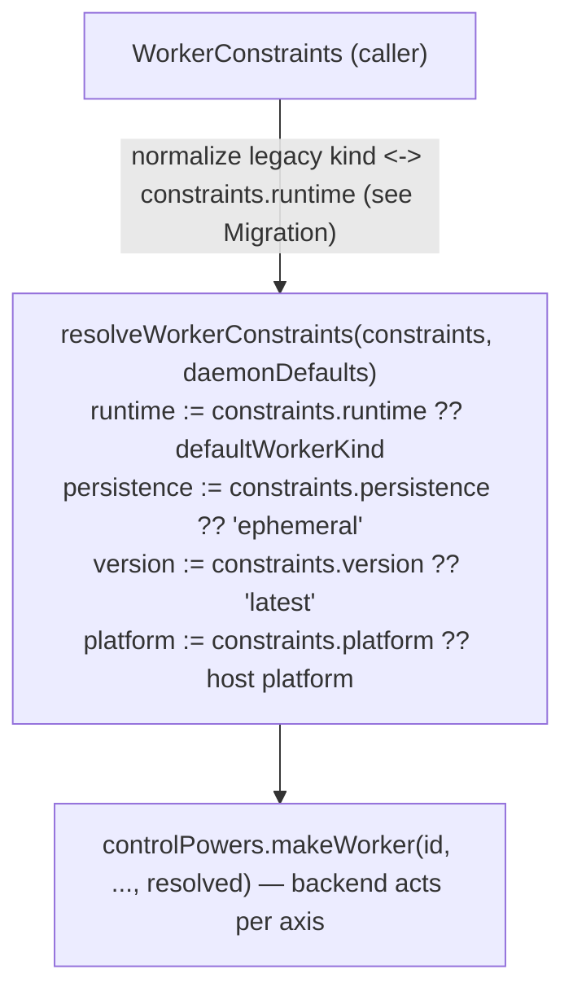

# Worker Constraint Model

| | |
|---|---|
| **Created** | 2026-08-16 |
| **Author** | Kris Kowal (prompted) |
| **Status** | Proposed |

## What is the Problem Being Solved?

Every worker the daemon spawns is selected by a single closed field,
`kind?: 'locked' | 'node'`, threaded identically from the `worker`
formula through the daemon core down to all three supervisor backends:

- `packages/daemon/src/types.d.ts` — `WorkerFormula.kind?: 'locked' | 'node'`
  (the persisted, content-addressed formula field) and
  `DaemonicControlPowers.makeWorker(..., kind?: 'locked' | 'node', ...)`
  (the control-power contract every backend implements).
- `packages/daemon/src/manager.js` — `formulateNumberedWorker`,
  `makeIdentifiedWorker`, `provideWorkerId`, the `defaultWorkerKind`
  daemon option, and the `workerFormula.kind ?? defaultWorkerKind`
  locked-vs-node resolution that decides archive-vs-tree loading.
- `packages/daemon/src/bus-manager-rust-xs.js` — the load-bearing seam:
  `makeWorker` picks `ENDO_NODE_WORKER_BIN` for `kind === 'node'` and
  `ENDO_WORKER_BIN` (the XS binary) otherwise.
- `packages/daemon/src/manager-node-powers.js` and
  `manager-go-powers.js` — `makeWorker` accepts `kind` but currently
  ignores it (Node-only backends).

Two problems follow from encoding worker selection as this one closed
union:

1. **It hard-codes today's two kinds as the ceiling.** `'locked'` and
   `'node'` conflate *which engine runs guest code* with *how the
   worker is supervised*. They leave no room for the runtime axis to
   grow (XS-in-Rust via Ironhorse, PR #600, is a genuine third point on
   that axis, not a fourth `kind`), and no room at all for orthogonal
   concerns — durability, version, platform/architecture — that a
   caller will increasingly need to express.

2. **Every emerging worker category has to fight the union.** The
   maintainer's headline case is a *durable, orthogonally persistent*
   worker (snapshotted, transcripted, message-embargoed for
   hangover-consistency — the guarantee that a worker resumed from a
   snapshot never re-delivers or double-acts a message it had already
   processed before the snapshot, i.e. no "hangover" of in-flight
   obligations replayed across resume — `@endo/thixotrope`, PR #786;
   the quiescence
   embargo, PR #989; the snapshot substrate, PR #281; the
   metered-storage worker, issue #984). Under the closed union each of
   these becomes a bespoke new `kind`, cross-multiplying with the
   runtime axis (a durable XS worker, a durable node worker, a durable
   XS-in-Rust worker are three `kind`s for one idea). Version pinning
   and platform/arch binary selection have no home in the union at all.

This design replaces the closed union with an **open, multi-axis
constraint expression** a caller passes when requesting a worker. Each
axis is independent and individually optional; an omitted axis means
*flexible — the daemon resolves it*. Today's `'locked'` and `'node'`
become the two seed points of one axis (runtime) with every other axis
flexible, migrated with **zero behavior change and zero formula-identity
churn**. The remaining axes (persistence, version, platform/arch) land
now as **typed, named extension points** — most not yet implementable,
but shaped so the converging work slots in additively rather than
reworking the seam.

## Goals and Non-Goals

**Goals.**

- Define a `WorkerConstraints` schema with independent, individually
  optional axes: **runtime**, **persistence**, **version**, **platform**.
- Migrate today's `'locked'` / `'node'` onto the runtime axis as its
  first two instances, byte-for-byte preserving existing worker formula
  identities and behavior.
- Keep the wire/API surface **strictly additive** over
  `kind?: 'locked' | 'node'`, so existing callers (CLI `@node`
  selection, `provideWorkerId`, `formulateWorker`) need no change.
- Give the durable/persistence, version, and platform/arch categories
  each an explicit, well-typed place in the schema, and name the exact
  seam where each resolves — without designing those mechanisms here.

**Non-Goals (flagged, not resolved).**

- The durable-worker *mechanism* (snapshot/transcript/embargo). That is
  thixotrope + #989 + #281 + #984; this design only makes it
  *expressible* as a constraint.
- The version *resolution* mechanism (how a pin maps to a build).
- The platform/arch *binary-fetch* mechanism (e.g. S3 pull). This
  design only marks the seam.
- Any change to the three supervisor backends' actual spawn logic
  beyond the mechanical `kind -> constraints.runtime` normalization.

## Current State (the seam as it exists)

Tracing one worker request end to end on `llm`:

1. **Formula.** A worker is a persisted, content-addressed formula:
   ```ts
   type WorkerFormula = {
     type: 'worker';
     label?: string;
     trustedShims?: string[];
     kind?: 'locked' | 'node';
   };
   ```
   `formulateNumberedWorker` (`manager.js`) spreads `kind` in **only
   when truthy** (`...(kind ? { kind } : undefined)`), so a
   flexible-default worker persists as `{ type: 'worker', label }` with
   no `kind` key at all. This omission is load-bearing for identity (see
   *Migration*).

2. **Default resolution.** The daemon carries a `defaultWorkerKind`
   option (`'node'` by default; the Rust supervisor bring-up in
   `bus-manager-rust-xs.js` sets `defaultWorkerKind: 'locked'`). The
   effective kind is `workerFormula.kind ?? defaultWorkerKind`, used at
   `manager.js:~2155` to choose the archive-packing path (locked/XS
   workers cannot yet run `parseArchive` themselves) versus the
   `makeFromTree` path.

3. **Provision.** `makeIdentifiedWorker(workerId, context, kind, ...)`
   forwards `kind` to `controlPowers.makeWorker(...)`.

4. **Control power.** `DaemonicControlPowers.makeWorker` carries
   `kind?: 'locked' | 'node'`. Only `bus-manager-rust-xs.js` acts on it
   (binary selection); the Node and Go powers accept and ignore it.

5. **Caller surfaces.** `provideWorkerId(..., kind)` mints a distinct
   Node worker when a `'node'` worker is asked for under a `'locked'`
   default; the host registers special names `@main` and `@node`
   (`host.js`); the CLI's `endo make --UNSAFE`/import path defaults the
   unconfined worker to `@node`.

The constraint model threads through **exactly these five points** and
no others.

## The Constraint Model

A caller expresses worker requirements as a `WorkerConstraints` record.
Every axis is optional. An omitted (or `undefined`) axis means
**flexible**: the daemon resolves it from its configured defaults
(preserving today's `defaultWorkerKind` semantics precisely). A present
axis is either a concrete pin or an explicit flexibility qualifier
(e.g. a version range).

```ts
/**
 * A partial specification of a worker. Every axis is independently
 * optional. Omitting an axis delegates its resolution to the daemon
 * (flexible). The empty object {} is fully flexible and is the
 * canonical form of "any worker the daemon would make by default" —
 * it MUST resolve identically to today's no-`kind` formula.
 */
export type WorkerConstraints = {
  /** Engine + supervision axis. Open set; see WorkerRuntime. */
  runtime?: WorkerRuntime;
  /** Ephemeral vs. durable/orthogonally persistent. See WorkerPersistence. */
  persistence?: WorkerPersistence;
  /** Worker build/version pin. See WorkerVersion. */
  version?: WorkerVersion;
  /** Target platform/architecture. See WorkerPlatform. */
  platform?: WorkerPlatform;
};
```

The four axis-value types spell alike — bare `WorkerRuntime` /
`WorkerPersistence` / `WorkerVersion` / `WorkerPlatform`, no `Constraint`
suffix — so a reader can predict the name of any axis's value type from
the field name alone. The wrapper record `WorkerConstraints` is the only
`Constraints`-named type; the per-axis value types deliberately do not
repeat the suffix.

### Axis 1 — runtime (migrates today's `kind`)

The runtime axis names *which engine executes guest code and how it is
supervised*. It is an **open string-tagged set**, seeded with today's
two values and reserving the near-term third:

```ts
/**
 * Open set. The daemon rejects a runtime it cannot service, so callers
 * and the schema can grow independently. Seed values:
 *   'locked'      — XS guest under xsnap, confined; today's 'locked'.
 *   'node'        — plain Node.js worker; today's 'node'.
 *   'xs-in-rust'  — XS embedded in a Rust process (Ironhorse, PR #600).
 *                   RESERVED; not yet wired at this seam.
 */
export type WorkerRuntime = 'locked' | 'node' | 'xs-in-rust' | string;
```

The three points `xs-in-rust` / `locked` (XS-via-xsnap) / `node` are one
axis, per the maintainer's framing, not three unrelated kinds. Keeping
`WorkerRuntime` an open union (`| string`) is deliberate: a new engine
is a new *value*, added at the resolver, with no change to the schema or
to callers that don't ask for it.

The axis deliberately names *engine + supervision* together rather than
splitting them, even though today's two seed values already vary on both
(`'locked'` is the XS engine loaded via the archive-packing supervision
path; `'node'` is the Node engine on the tree-loading path). The two are
kept as one axis because, at this seam, the supervision strategy is a
*function of* the engine value — the daemon has never expressed a runtime
whose engine and supervision path are independently chosen, and inventing
that degree of freedom now would be speculative. `xs-in-rust`'s
supervision path (whether Ironhorse supervises like `'locked'`'s archive
path or needs a distinct one) is therefore left as **Open Question 6**
rather than smuggled into the runtime string; if a future runtime needs
engine and supervision chosen independently, that is the trigger to split
the axis, and the open union means doing so is additive.

### Axis 2 — persistence (the durable-worker extension point) — *Not Started*

The persistence axis names the worker's **durability class**: whether
its heap and in-flight obligations survive daemon restart, and under
what consistency guarantee.

```ts
/**
 * EXTENSION POINT — schema only; no resolution implemented here.
 *   'ephemeral' — today's behavior: no snapshot, no transcript, lost on
 *                 daemon exit. The flexible default.
 *   'durable'   — orthogonally persistent: heap snapshotted and/or
 *                 message-transcripted, inbound messages embargoed at
 *                 quiescence to prevent hangover-inconsistency, host
 *                 obligations at-most-once across resume.
 */
export type WorkerPersistence =
  | 'ephemeral'
  | 'durable'
  | {
      class: 'durable';
      /** Durable substrate. Reserved; see thixotrope / #281 / #984. */
      journal?: 'snapshot' | 'transcript' | 'snapshot+transcript';
      /**
       * Spawn-time opt-in: create this durable worker with a metering
       * channel wired up (snapshot/message-byte growth exposed for
       * external metering — issue #984, Minion Town). Immutable
       * capability bit; the live meter readings are read through the
       * worker's control facet, NOT this formula field. Reserved.
       */
      metered?: boolean;
      /**
       * Spawn-time retention class (issue #984). Immutable substrate
       * selection; the adjustable retention window is set through the
       * control facet, not by reformulating the worker. Reserved.
       */
      retention?: 'session' | 'indefinite';
    };
```

This is the axis that lets issue **#984 (metered-storage worker)** be
expressed as *one constraint combination*
(`{ persistence: { class: 'durable', metered: true, retention: 'indefinite' } }`)
rather than a bespoke worker kind — which the job brief names as the
acceptance test for the schema. The `durable` class corresponds to the
`@endo/thixotrope` worker (PR #786; sleepy workers, XS heap snapshots,
delivered-watermark journals, at-most-once host obligations); the
message-embargo guarantee corresponds to PR #989's quiescence embargo
(one inbound envelope per crank, outbound flushed atomically), which
composes with thixotrope's journal-replay embargo rather than replacing
it; the snapshot/suspend/resume substrate underneath both is the
`daemon-xs-worker-snapshot` design + PR #281. Snapshot continuity across
a live code upgrade (issue #813) is a property of the `durable` class,
not a separate axis. **None of this is resolved here** — the axis is a
typed name so the mechanism lands additively.

**What belongs in the formula vs. what stays mutable.** Because the
formula is content-addressed, every field of `WorkerConstraints` must be
*spawn-time-immutable for the object's life* — changing any of them mints
a different worker. That constrains what the `durable` object form may
carry. The immutable, formula-worthy fields are the ones that select
*which substrate the worker runs on*: `class: 'durable'` and `journal`
(a durable worker is a categorically different object from an ephemeral
one, and its journal substrate is fixed at creation). The `metered` and
`retention` fields are **policy, not substrate** — a billing tier or a
retention window is exactly the kind of thing that changes over a running
worker's life, so baking a specific value into the immutable formula
would be wrong. They appear here only as the *capability opt-in* — the
boolean `metered: true` says "this durable worker is created with a
metering channel wired up," a spawn-time-immutable fact; the *live meter
readings and the adjustable retention window* are then read and set
through a non-formula control-facet channel (the metered-storage
worker's own governance surface, issue #984), never by reformulating the
worker. So #984's real requirement — *adjustable* metering/retention on a
running worker — is served by that channel, and the schema field is only
the immutable "is this worker metered at all" bit. This split (immutable
substrate selection in the formula; mutable policy through a control
facet) is what keeps the flagship use case expressible without
complecting mutable governance into a content address; the exact facet
shape is thixotrope/#984's to design, not this schema's.

### Axis 3 — version (unfiled; first home here) — *Not Started*

The version axis pins the worker *build* (engine/binary version), not
just the runtime family.

```ts
/**
 * EXTENSION POINT — schema only; no resolution mechanism here.
 *   omitted        — flexible: daemon uses whatever build it has (latest).
 *   { exact }      — pin one build (e.g. an xsnap/Ironhorse version).
 *   { range }      — a semver-style acceptable range.
 *   'latest'       — explicit flexible-latest (same effect as omitted).
 */
export type WorkerVersion =
  | 'latest'
  | { exact: string }
  | { range: string };
```

Sketched, not committed: whether a pin resolves against a local build
registry, a fetched manifest, or the platform-fetch provider (Axis 4) is
an **open question**. The schema commits only to the *shape* of the
request (exact vs. range vs. flexible-latest).

### Axis 4 — platform/architecture (unfiled; first home here) — *Not Started*

The platform axis names the target OS/architecture for the worker
binary. On deployments like minion.town the daemon may need to fetch a
platform+arch-matched binary from remote storage rather than assume a
local one is present.

```ts
/**
 * EXTENSION POINT — schema only; no fetch mechanism here.
 *   omitted     — flexible: use the daemon host's own platform/arch.
 *   { os, arch } — pin a target (e.g. { os: 'linux', arch: 'arm64' }).
 */
export type WorkerPlatform = {
  os?: 'linux' | 'darwin' | 'win32' | string;
  arch?: 'x64' | 'arm64' | string;
};
```

**The seam, named but not built.** A pinned (or non-local) platform
resolves in `bus-manager-rust-xs.js`'s `makeWorker`, exactly where
`ENDO_WORKER_BIN` / `ENDO_NODE_WORKER_BIN` are read today. A future
binary-fetch provider would be an injected power consulted there — given
`{ runtime, version, platform }`, it returns a local path to a matched
binary (fetching from S3 or similar on a miss), and the existing
`endoWorkerBin`/`endoNodeWorkerBin` env lookups become the *local,
flexible-platform* branch of that provider. This is **adjacent to but
distinct from** the AWS storage line (PR #637, PR #689,
`designs/endo-daemon-aws-storage.md`): that work is DynamoDB+S3 for the
daemon's *structured state and blobs* and never mentions worker binaries
or platform/arch selection. Nothing here designs the fetch — it marks
where it plugs in.

## The Seam It Plugs Into (resolution)

The constraint object is resolved in one place and lowered to the
existing backend call. Introduce a `resolveWorkerConstraints` step in
`manager.js` between formulation and `controlPowers.makeWorker`:



Axis-to-backend mapping (where each axis *lands*, once built):

| Axis | Resolves at | Today |
|------|-------------|-------|
| runtime | `bus-manager-rust-xs.js` `makeWorker` binary select | `ENDO_WORKER_BIN` vs `ENDO_NODE_WORKER_BIN`; `locked` &lt;-&gt; archive path |
| persistence | thixotrope / #281 snapshot+journal substrate | always ephemeral |
| version | (open) build registry / fetch provider | implicit "whatever is installed" |
| platform | `bus-manager-rust-xs.js` `makeWorker` binary select | implicit host platform |

Only the runtime and platform axes touch the *existing* backend seam;
persistence resolves into the thixotrope/#281 substrate; version's
resolution point is deliberately left open.

`resolveWorkerConstraints` returns a **`ResolvedWorkerConstraints`**: the
same four axes as `WorkerConstraints`, but with every axis filled in (no
`undefined` — each flexible axis has been replaced by its resolved
default) and each axis narrowed to its canonical resolved form. It is
*not* `Required<WorkerConstraints>`, because resolution also collapses
each axis's input variants to one canonical shape:

```ts
/**
 * The output of resolveWorkerConstraints: every axis present and reduced
 * to canonical form. This is the shape backends type-check against.
 */
export type ResolvedWorkerConstraints = {
  /** Resolved to a concrete runtime value (never undefined). */
  runtime: WorkerRuntime;
  /**
   * Canonicalized: the bare-string cases fold into the object form, so a
   * backend always reads `class`. 'ephemeral' resolves to
   * { class: 'ephemeral' }; 'durable' to { class: 'durable' } with its
   * journal/metered/retention defaults filled.
   */
  persistence:
    | { class: 'ephemeral' }
    | {
        class: 'durable';
        journal: 'snapshot' | 'transcript' | 'snapshot+transcript';
        metered: boolean;
        retention: 'session' | 'indefinite';
      };
  /** Resolved to a concrete build selector (never bare 'latest'/omitted). */
  version: { exact: string } | { range: string } | 'latest';
  /** Resolved to a concrete os/arch (host platform when the input omitted it). */
  platform: { os: string; arch: string };
};
```

Backends type-check their per-axis logic against
`ResolvedWorkerConstraints`, never against the caller-facing
`WorkerConstraints` — resolution is the single place that turns "any of
several optional input shapes" into "exactly one canonical shape."

The control-power contract widens **additively**:

```ts
// types.d.ts — the widened signature (old `kind` retained, deprecated).
makeWorker: (
  id: string,
  daemonWorkerFacet: DaemonWorkerFacet,
  cancelled: Promise<never>,
  forceCancelled: Promise<never>,
  capTpConnectionRegistrar?: CapTpConnectionRegistrar,
  trustedShims?: string[],
  label?: string,
  /** @deprecated pass `constraints.runtime`; retained for one migration cycle. */
  kind?: 'locked' | 'node',
  marshalLoadError?: (err: Error, errorId?: string) => void,
  /** NEW: resolved constraints. When present, `kind` is ignored. */
  constraints?: ResolvedWorkerConstraints,
) => Promise<{ workerTerminated; workerDaemonFacet }>;
```

(A cleaner eventual signature folds `kind`, `trustedShims`, `label`, and
`constraints` into one options bag — flagged as a follow-up cleanup, not
required to land the model.)

## Migration of Today's Two Kinds (zero behavior, zero identity churn)

Worker formulas are **content-addressed**; the persisted formula's
canonical form is part of the worker's identity. Two invariants make
this migration safe:

**The persisted form is a pure function of the *resolved value*, never
of the caller's input shape.** This is the single rule the whole
migration depends on, and it is stated over resolved values precisely so
that two callers who mean the same worker cannot fork its identity by
spelling their request differently (e.g. one omits `persistence`, the
other writes `persistence: 'ephemeral'` explicitly — both resolve to the
same value and therefore must persist identically). The formula layer
never inspects which keys the caller happened to pass; it inspects the
resolved value and derives the persisted form from that.

Define, per axis, its **flexible default value** — the resolved value an
omitted axis produces: `runtime` -> `defaultWorkerKind`, `persistence`
-> `{ class: 'ephemeral' }`, `version` -> `'latest'`, `platform` ->
`{ os, arch }` of the host. An axis is **at-default** when its resolved
value equals its flexible default by *value equality* (deep-equal on the
canonical resolved shape, not key-presence on the input) and
**non-default** otherwise. Two invariants then follow mechanically:

1. **Fully-flexible ≡ today's no-`kind` formula.** If every axis is
   at-default, the formula persists as `{ type: 'worker', label }` with
   no `kind` and no `constraints` key — byte-identical to today. The
   `constraints` field is spread in **only when at least one axis is
   non-default by the value test above**, mirroring the existing
   `...(kind ? { kind } : undefined)` treatment but computed over the
   resolved value rather than a truthy input field. So a caller passing
   `{ runtime: 'node', persistence: 'ephemeral' }` (spelling out the
   default) and a caller passing `{ runtime: 'node' }` and a caller
   passing `{ kind: 'node' }` all resolve to one value and persist to the
   one same formula — the split the design exists to prevent is
   impossible by construction.

2. **The two legacy kinds keep their exact formula bytes.** Rather than
   rewrite `{ kind: 'node' }` formulas to `{ constraints: { runtime: 'node' } }`
   (which would change every existing node worker's identity), the
   **formula layer keeps `kind` as the persisted form whenever the only
   non-default axis is a runtime resolving to one of the two seed
   values.** The derivation from the resolved value is:
   - the resolved `runtime` is `'locked'` or `'node'` **and** every other
     axis is at-default (by the value test) => persist legacy `{ kind }`;
   - any other axis is non-default, **or** the resolved runtime is a new
     value (`'xs-in-rust'`, …) => persist a `constraints` object;
   - outbound: a persisted `formula.kind` reads back as the resolved
     value `{ runtime: formula.kind, …host defaults }`.

   This means **no formula migration, no identity change, no rewrite of
   the formula graph** for any worker that exists today. The
   `constraints` key appears in the persisted formula only for workers
   that use a genuinely new capability — which by definition did not
   exist before, so there is nothing to preserve.

**How the invariant is verified (test catalog).** Because the entire
safety claim is byte-for-byte formula preservation, the migration lands
with named tests that guard it, not just prose:

- **Golden formula-identity test.** For a representative set of today's
  requests (`{}`, `{ kind: 'node' }`, `{ kind: 'locked' }`, and the
  `defaultWorkerKind: 'locked'` bring-up), assert the content-address /
  canonical formula bytes are **identical** before and after the change —
  a golden-hash snapshot committed at the PR base and re-asserted after.
- **Default-collapse test.** Assert every "spelled-out default" request
  (`{ runtime: 'node', persistence: 'ephemeral', version: 'latest' }`,
  etc.) resolves to and persists as the *same* formula as its omitted-axis
  twin — the value-equality rule above, tested directly.
- **Empty-object test.** Assert `{}` (and no-argument) persists as
  `{ type: 'worker', label }` with **zero** extra keys (no `kind`, no
  `constraints`).
- **Normalization round-trip test.** Assert `kind -> constraints.runtime`
  (outbound read-back) and `constraints.runtime -> kind` (inbound persist)
  compose to the identity on the two seed values.
- **New-axis test.** Assert a genuinely new axis (e.g.
  `{ persistence: 'durable' }`) *does* persist a `constraints` key (the
  negative control: the field appears exactly when it should).

Resolution precedence (single rule, everywhere):
`constraints.runtime` (explicit) **>** legacy `kind` **>**
`defaultWorkerKind`. All existing call sites keep working:

- `formulateWorker` / `formulateNumberedWorker` gain an optional
  `constraints` alongside the retained `kind`.
- `provideWorkerId(..., kind)` keeps its `kind` parameter; internally it
  becomes sugar for `{ runtime: kind }`.
- CLI `@node` selection, `@main`/`@node` special names, and
  `defaultWorkerKind` bring-up are untouched — they resolve through the
  same precedence.

**Behavioral acceptance:** with no caller passing `constraints`, every
formula, every spawn, and every content address is identical to `llm`
today. The model is inert until a caller opts into a non-default axis.

## Reconciliation With Converging Work

This design **does not duplicate** any of the following; it provides the
constraint vocabulary they attach to.

- **`@endo/thixotrope` / orthogonal persistence** (PR #786 merged, In
  Progress; `designs/ocapn-orthogonal-persistence.md`). Supplies the
  `persistence: 'durable'` mechanism (snapshots, journals, at-most-once
  host obligations, sleepy resume). This design names the axis; that one
  builds it. Phases 5–9 (name-hub upgrade-by-rebinding, resource vats,
  non-reifying host) are orthogonal to the constraint schema.
- **Quiescence embargo** (PR #989, draft). Supplies the message-embargo
  guarantee inside the `durable` class; composes with thixotrope's
  journal-replay embargo. Referenced by the persistence axis, not
  re-specified.
- **`daemon-xs-worker-snapshot` + PR #281** (In Progress / open). The
  streaming-CAS snapshot/suspend/resume substrate under `durable`.
- **Issue #984 (metered-storage worker)** (open, unclaimed). Becomes the
  `{ persistence: { class: 'durable', metered: true, retention: 'indefinite' } }`
  combination — the schema's stated acceptance criterion.
- **Issue #813 (snapshot continuity across live upgrade)** (open). A
  property of the `durable` class.
- **Ironhorse / XS-in-Rust** (PR #600, merged). Motivates the
  `runtime: 'xs-in-rust'` reserved value as a third point on the runtime
  axis. `designs/worker-rust-xs.md` is stale (marked "Not Started"
  though #600 merged) and **needs a status sync — informational only,
  out of scope for this job.**
- **Sturdy-refs / worker retention** (PR #511, draft). Worker retention
  interacts with the persistence axis (a retained/sturdy worker is
  durable-classed); reconcile when #511 firms up.
- **AWS daemon storage** (PR #637, PR #689 draft,
  `designs/endo-daemon-aws-storage.md`). *Distinct* from the platform
  axis: that is DynamoDB+S3 for daemon structured state and blobs, with
  no worker-binary or platform/arch selection. The platform axis's
  binary-fetch provider is a *sibling* S3 consumer, not the same seam.

## Open Questions

1. **Options-bag refactor timing.** Fold `kind`/`trustedShims`/`label`/
   `constraints` into one options argument to `makeWorker` now, or keep
   the additive positional param for one migration cycle? (Leaning:
   additive now, bag later.)
2. **Version resolution locus.** Does a `version` pin resolve against a
   local build registry, a manifest, or the platform-fetch provider?
   Deferred until a concrete version-pinning use case exists.
3. **Constraint validation & rejection surface.** How does the daemon
   report "I cannot service `runtime: 'xs-in-rust'` on this host"? A
   typed rejection at `resolveWorkerConstraints` vs. at `makeWorker`.
   (Leaning: `resolveWorkerConstraints` is the natural gate — it already
   sees the full axis set before any backend is touched, so an
   unserviceable axis should throw a typed `UnserviceableConstraintError`
   naming the offending axis and value there, failing the spawn before a
   worker id is minted, rather than surfacing deep in a backend's
   `makeWorker`. The alternative — a tagged result rather than a throw —
   is deferred to the same options-bag migration as Open Question 1.)
4. **Do the Node and Go backends ever honor non-runtime axes**, or do
   durable/version/platform remain Rust-supervisor-only? (Today Node/Go
   ignore even `kind`.)
5. **Persistence × runtime feasibility matrix.** Is `durable` meaningful
   for `runtime: 'node'`, or only for XS-based runtimes with heap
   snapshots? Likely constrained; enumerate when thixotrope's engine
   adapter lands.
6. **`xs-in-rust` supervision strategy.** The runtime axis names engine
   *and* supervision together (see Axis 1). Does Ironhorse
   (`runtime: 'xs-in-rust'`) supervise via `'locked'`'s archive-packing
   path, or does it need a distinct supervision path? Unresolved because
   the seam is not yet wired (PR #600); if it needs an independently
   chosen supervision path, that is the trigger to split the runtime axis
   into engine and supervision sub-axes (an additive change under the
   open union). Left explicit here rather than buried in the runtime
   string.

## Status and Scope

**Proposed.** The load-bearing, buildable core is the `WorkerConstraints`
schema (Axis 1 runtime), the `resolveWorkerConstraints` seam, the
additive `makeWorker`/formula surface, and the zero-churn migration of
`'locked'`/`'node'` — all of which can land now with no behavior change.
Axes 2–4 (persistence, version, platform/arch) land as **typed,
`Not Started` extension points**, deliberately not implemented here; each
names the converging work or the exact seam it will plug into. The one
adjacent doc-hygiene item surfaced — `designs/worker-rust-xs.md`'s stale
"Not Started" status after PR #600 merged — is flagged as informational
and is **not** part of this job.

## Prompt

> The daemon selects every worker it spawns through a single closed field,
> `kind?: 'locked' | 'node'`, threaded from the content-addressed worker
> formula down through `manager.js` and all three supervisor backends.
> That closed union hard-codes today's two kinds as the ceiling and forces
> every emerging worker category — durable/orthogonally-persistent workers
> (thixotrope, the quiescence embargo, the snapshot substrate, the
> metered-storage worker of issue #984), version-pinned builds, and
> platform/arch-selected binaries — to become a bespoke new `kind` that
> cross-multiplies with the runtime axis. Design an open, multi-axis
> worker-selection constraint schema that replaces the closed union:
> independent, individually-optional axes (runtime, persistence, version,
> platform), each flexible-by-default. Migrate today's `'locked'`/`'node'`
> onto the runtime axis with zero behavior change and zero
> formula-identity churn (they are content-addressed), keep the API
> strictly additive over `kind`, and give the durable/version/platform
> categories each a typed, named extension point that identifies the exact
> seam it will plug into — without designing those mechanisms here. The
> acceptance test for the schema is that issue #984's metered-storage
> worker can be expressed as one constraint combination rather than a new
> worker kind.

*(Prompt reconstructed from the design's own Problem/Goals framing; the
original generating prompt was not captured at authoring time.)*
