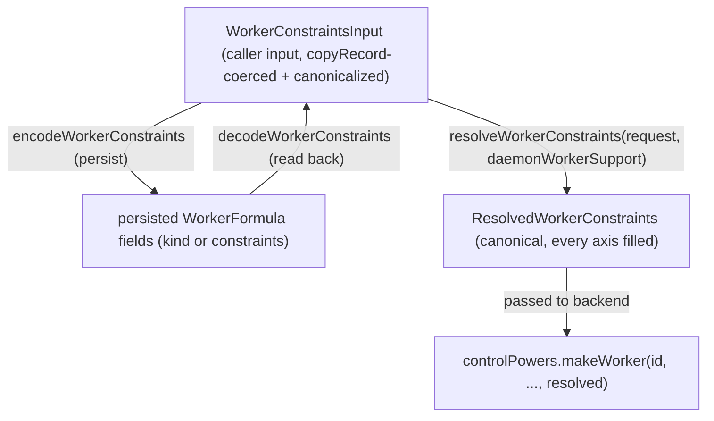

# Worker Constraint Model

| | |
|---|---|
| **Created** | 2026-08-16 |
| **Updated** | 2026-09-04 |
| **Author** | Kris Kowal (prompted) |
| **Status** | Proposed |

## What is the Problem Being Solved?

Every worker the daemon spawns is selected by a single closed field,
`kind?: 'locked' | 'node'`, threaded identically from the `worker`
formula through the daemon core down to the supervisor backends:

- `packages/daemon/src/types.d.ts`: `WorkerFormula.kind?: 'locked' | 'node'`
  (the persisted formula field, reincarnated on daemon restart) and
  `DaemonicControlPowers.makeWorker(..., kind?: 'locked' | 'node', ...)`
  (the control-power contract every backend implements).
- `packages/daemon/src/manager.js`: `formulateNumberedWorker`,
  `makeIdentifiedWorker`, `provideWorkerId`, the `defaultWorkerKind`
  daemon option, and the `workerFormula.kind ?? defaultWorkerKind`
  (`manager.js:2172`) locked-vs-node resolution that decides
  archive-vs-tree loading.
- `packages/daemon/src/bus-manager-rust-xs.js` and
  `packages/daemon/src/bus-manager-node-powers.js`: the two backends
  whose `makeWorker` **acts on** `kind`: each picks `ENDO_NODE_WORKER_BIN`
  for `kind === 'node'` and `ENDO_WORKER_BIN` (the XS binary) otherwise.
  They differ in their in-backend default: `bus-manager-rust-xs.js`
  leaves `kind` `undefined` (`:469`), while `bus-manager-node-powers.js`
  defaults it to `'locked'` (`:206`).
- `packages/daemon/src/manager-node-powers.js` and
  `manager-go-powers.js`: the other two `makeWorker` control powers.
  Both accept `kind` and currently ignore it (`kind` is `no-unused-vars`
  at `manager-node-powers.js:1079`; `_kind` at `manager-go-powers.js:178`).

Two problems follow from encoding worker selection as this one closed
union:

1. **It hard-codes today's two kinds as the ceiling.** `'locked'` and
   `'node'` conflate *which engine runs guest code* with *how the
   worker is supervised*. They leave no room for the runtime axis to
   grow (XS-in-Rust via Ironhorse, PR #600, is a genuine third point on
   that axis, not a fourth `kind`), and no room at all for orthogonal
   concerns (durability, version, target platform/architecture) that a
   caller will increasingly need to express.

2. **Every emerging worker category has to fight the union.** The
   maintainer's headline case is a *durable, orthogonally persistent*
   worker (snapshotted, transcripted, message-embargoed for
   hangover-consistency: the guarantee that a worker resumed from a
   snapshot never re-delivers or double-acts a message it had already
   processed before the snapshot, i.e. no "hangover" of in-flight
   obligations replayed across resume: `@endo/thixotrope`, PR #786;
   the quiescence embargo, PR #989; the snapshot substrate, PR #281; the
   metered-storage worker, issue #984). Under the closed union each of
   these becomes a bespoke new `kind`, cross-multiplying with the
   runtime axis (a durable XS worker, a durable node worker, a durable
   XS-in-Rust worker are three `kind`s for one idea). Version pinning
   and target-platform binary selection have no home in the union at all.

This design replaces the closed union with an **open, multi-axis
constraint expression** a caller passes when requesting a worker. Each
axis is independent and individually optional; an omitted axis means
*flexible: the daemon resolves it*. Today's `'locked'` and `'node'`
become the two seed points of one axis (runtime) with every other axis
flexible, migrated with **zero behavior change and zero persisted-formula
churn**. The remaining axes (persistence, version, target) land now as
**typed, named extension points**: most not yet implementable, but
shaped so the converging work slots in additively rather than reworking
the seam.

## Goals and Non-Goals

**Goals.**

- Define a `WorkerConstraints` schema with independent, individually
  optional axes: **runtime**, **persistence**, **version**, **target**.
- Migrate today's `'locked'` / `'node'` onto the runtime axis as its
  first two instances, byte-for-byte preserving existing worker formula
  records and behavior.
- Keep the wire/API surface **strictly additive** over
  `kind?: 'locked' | 'node'`, so existing callers (CLI `@node`
  selection, `provideWorkerId`, `formulateWorker`) need no change.
- Give the durable/persistence, version, and target categories each an
  explicit, well-typed place in the schema, and name the exact seam
  where each resolves, without designing those mechanisms here.
- State the input-coercion and rejection stance (hardened copy-record,
  allowlist membership, fail-closed on an unserviceable axis) so the
  schema is safe to accept across the CapTP boundary.

**Non-Goals (flagged, not resolved).**

- The durable-worker *mechanism* (snapshot/transcript/embargo). That is
  thixotrope + #989 + #281 + #984; this design only makes it
  *expressible* as a constraint.
- The version *resolution* mechanism (how a pin maps to a build).
- The target *binary-fetch* mechanism (e.g. S3 pull). This design only
  marks the seam.
- Any change to the supervisor backends' actual spawn logic beyond the
  mechanical `kind -> constraints.runtime` normalization.

## Current State (the seam as it exists)

Tracing one worker request end to end on `llm`:

1. **Formula.** A worker is a persisted formula, reincarnated on daemon
   restart:
   ```ts
   type WorkerFormula = {
     type: 'worker';
     label?: string;
     trustedShims?: string[];
     kind?: 'locked' | 'node';
   };
   ```
   `formulateNumberedWorker` (`manager.js:5250`) spreads `kind` in
   **only when truthy** (`...(kind ? { kind } : undefined)`), so a
   flexible-default worker persists as `{ type: 'worker', label }` with
   no `kind` key at all. Key *presence* (not the resolved value) is the
   load-bearing fact (see *Migration*): the formula number is a random
   256-bit value (`randomHex256`), never a hash of the formula body, so
   the persisted record's *shape*, not any content address, is what
   backward-compatibility must preserve. The in-tree comment beside the
   sibling `formulateMount` says exactly this
   (`manager.js:4562`: "Formula numbers are random, not
   content-addressed, so this is about the record's shape and
   backward-compatibility, not formula identity").

2. **Default resolution.** The daemon carries a `defaultWorkerKind`
   option (`'node'` by default, `manager.js:481`). Three bring-ups set
   `defaultWorkerKind: 'locked'`: `bus-manager-node.js:158`,
   `bus-manager-rust-xs.js:701`, and `manager-go.js:164`. The effective
   kind is `workerFormula.kind ?? defaultWorkerKind`, used at
   `manager.js:2172` to choose the archive-packing path (locked/XS
   workers cannot yet run `parseArchive` themselves) versus the
   `makeFromTree` path. This read binds the loading path *late*, from the
   persisted key's presence.

3. **Provision.** `makeIdentifiedWorker(workerId, context, kind, ...)`
   forwards `kind` to `controlPowers.makeWorker(...)`. `provideWorkerId`
   (`manager.js:5665`) additionally branches on `!existingFormula.kind`
   to decide whether to mint a *separate* Node worker: a second reader
   that keys on the **absence** of the `kind` key.

4. **Control power.** `DaemonicControlPowers.makeWorker` carries
   `kind?: 'locked' | 'node'`. There are **four** `makeWorker` control
   powers, and **two act on** `kind`: `bus-manager-rust-xs.js:485` and
   `bus-manager-node-powers.js:226` (binary selection). The other two
   (`manager-node-powers.js:1079`, `manager-go-powers.js:178`) accept and
   ignore it.

5. **Caller surfaces.** `provideWorkerId(..., kind)` mints a distinct
   Node worker when a `'node'` worker is asked for under a `'locked'`
   default; the host registers special names `@main` and `@node`
   (`host.js`); the CLI's `endo make --UNSAFE`/import path defaults the
   unconfined worker to `@node`.

The constraint model threads through the persisted-formula field, the
two late-binding reads that key on the `kind` key
(`manager.js:2172`, the archive-vs-tree read of
`workerFormula.kind ?? defaultWorkerKind`; and `manager.js:5665`, the
`!existingFormula.kind` node-worker split: the `defaultWorkerKind` read in
that block is `:5657`), the formulation write (`:5250`), the four
`makeWorker` control powers, and the `interfaces.js` shape guard
(§ *Passability and Rejection*): the migration must normalize **all** of
them, not the single Rust seam alone. Concretely, both late-binding reads
must route through `decodeWorkerConstraints`: a worker persisted as
`{ constraints: { runtime: ... } }` with **no** `kind` key must not fall
through `:2172`/`:5665` to `defaultWorkerKind`'s path (§ *Migration*, the
two-reads normalization): the seed-value migration alone leaves those two
readers keying on a `kind` key a `constraints`-carrying formula does not have.

## The Constraint Model

A caller expresses worker requirements as a `WorkerConstraints` record.
Every axis is optional. An omitted (or `undefined`) axis means
**flexible**: the daemon resolves it from its configured defaults
(preserving today's `defaultWorkerKind` semantics precisely). A present
axis is either a concrete pin or an explicit flexibility qualifier
(e.g. a version range).

Numbered **Open Question N** references recur throughout the body before the
§ *Open Questions* section (at the end) states each in full. Several of those
questions are genuinely unresolved, not merely deferred detail, so a claim
that cites one is provisional on that question: a reader proceeding top to
bottom should treat an *Open Question N* pointer as "settled only once § *Open
Questions* item N is," and can jump there to see what it asks before weighing
the surrounding claim.

```ts
/**
 * A partial specification of a worker. Every axis is independently
 * optional. Omitting an axis delegates its resolution to the daemon
 * (flexible). The empty object {} is fully flexible and is the
 * canonical form of "any worker the daemon would make by default".
 * It MUST persist identically to today's no-`kind` formula.
 */
export type WorkerConstraints = {
  /**
   * Engine + supervision axis, and also the CONFINEMENT axis: `'locked'` is
   * the confined XS guest, `'node'` an unconfined process (the CLI gates it
   * behind `--UNSAFE`). Choosing `runtime` also chooses sandboxing. Open set;
   * see WorkerRuntime.
   */
  runtime?: WorkerRuntime;
  /** Ephemeral vs. durable/orthogonally persistent. See WorkerPersistence. */
  persistence?: WorkerPersistence;
  /** Worker build/version pin. See WorkerVersion. */
  version?: WorkerVersion;
  /** Target OS/architecture. See WorkerTarget. */
  target?: WorkerTarget;
};
```

The four axis-value types spell alike: bare `WorkerRuntime` /
`WorkerPersistence` / `WorkerVersion` / `WorkerTarget`, no `Constraint`
suffix: so a reader can predict the name of any axis's value type from
the field name alone. `WorkerConstraints` is the only *caller-facing*
`Constraints`-named type (the seam also defines `WorkerConstraintsInput`,
`ResolvedWorkerConstraints`, `PersistedWorkerConstraints`, and the
`WorkerConstraintsShape` guard, all internal). Where these types live and
which cross the package boundary is § *Caller Surface and Type Home* (below);
the short version is that the new **type-only** definitions go in a checked
`packages/daemon/src/types.ts` (per `AGENTS.md` § *Where type definitions go*:
`.d.ts` is unchecked under `skipLibCheck`, exactly wrong for the
`(string & {})` unions this design leans on), not the unchecked
`src/types.d.ts` where `WorkerFormula` (`:174`) and `makeWorker` (`:2462`)
predate that rule.

### Axis 1: runtime (migrates today's `kind`)

The runtime axis names *which engine executes guest code and how it is
supervised*. It is an **open string-tagged set**, seeded with today's
two values and reserving the near-term third. The escape hatch is spelled
`(string & {})`, not bare `string`, so the seed literals survive
TypeScript's union reduction (a bare `| string` absorbs the literals and
erases all completion, narrowing, and typo-checking: the "typed
extension point" would be untyped):

```ts
/**
 * Open set. The daemon rejects a runtime it cannot service (see
 * "Passability and Rejection"), so callers and the schema can grow
 * independently. Seed values:
 *   'locked': XS guest under xsnap, confined; today's 'locked'.
 *   'node': plain Node.js worker; today's 'node'.
 *   'xs-in-rust': XS embedded in a Rust process (Ironhorse, PR #600).
 *                   RESERVED; not yet wired at this seam.
 * The `(string & {})` member keeps the union open while preserving the
 * three seed literals for completion and exhaustiveness.
 *
 * The union is factored through a seed-free base, `NonSeedWorkerRuntime`,
 * so that "non-seed only" can be named as a type (`PersistedWorkerConstraints.runtime`)
 * without an `Exclude`: `Exclude<WorkerRuntime, 'locked' | 'node'>` is a
 * no-op here, because `Exclude` distributes and the `(string & {})` member
 * does not extend `'locked' | 'node'`, so it survives and re-admits both
 * seed literals (verified under the repo's `tsc --strict`:
 * `const r: Exclude<WorkerRuntime,'locked'|'node'> = 'locked'` compiles clean).
 * A type-level narrowing an open `(string & {})` union cannot carry is stated
 * instead as a runtime encode/decode guard (§ Passability item 4).
 *
 * This axis DELIBERATELY MERGES engine and supervision for now (a seed value
 * fixes both; see the prose below). Splitting them (e.g. once `xs-in-rust`
 * needs a supervision path distinct from `'locked'`'s) is additive under the
 * open union, tracked as Open Question 6 and reconciled with
 * `daemon-endor-architecture.md`'s `separate`/`shared` platform split.
 */
export type NonSeedWorkerRuntime = 'xs-in-rust' | (string & {});
export type WorkerRuntime = 'locked' | 'node' | NonSeedWorkerRuntime;
```

The three points `xs-in-rust` / `locked` (XS-via-xsnap) / `node` are one
axis, per the maintainer's framing, not three unrelated kinds. Keeping
`WorkerRuntime` open is deliberate: a new engine is a new *value*, added
at the resolver, with no change to the schema or to callers that don't
ask for it.

The runtime axis is also the **confinement** axis, and the design says so
explicitly: `'locked'` is the confined XS guest, `'node'` is an
unconfined Node process (the CLI defaults the `--UNSAFE` unconfined
worker to `@node`). Because two of the four backends accept-and-ignore
the axis and the two that act on it fall back to a default binary when
their env var is unset (`bus-manager-rust-xs.js:485`,
`bus-manager-node-powers.js:226`), an *unserviceable* **non-seed** runtime
must **fail the spawn**, never silently downgrade to whatever binary the
backend happens to have. The gate is scoped to explicitly-supplied non-seed
values precisely so it cannot fire on the two seed runtimes today's code
already spawns (which would break the zero-behavior-change migration); see
§ *Passability and Rejection* item 3.

The axis names *engine + supervision* together rather than splitting
them, even though today's two seed values already vary on both
(`'locked'` is the XS engine loaded via the archive-packing supervision
path; `'node'` is the Node engine on the tree-loading path). The two are
kept as one axis because, at this seam, the supervision strategy is a
*function of* the engine value. `xs-in-rust`'s supervision path is left
as **Open Question 6** rather than smuggled into the runtime string; if a
future runtime needs engine and supervision chosen independently, that is
the trigger to split the axis, and the open union means doing so is
additive. (`daemon-endor-architecture.md`'s already-designed
`separate`/`shared` split of `WorkerPlatform` is the concrete precedent
this open axis must reconcile with. See § *Reconciliation*.)

### Axis 2: persistence (the durable-worker extension point), *Not Started*

The persistence axis names the worker's **durability class**: whether
its heap and in-flight obligations survive daemon restart, and under
what consistency guarantee. Its discriminant is spelled `durability`
(not `class`, a JavaScript reserved word that cannot be destructured
`const { class } = ...`):

```ts
/**
 * EXTENSION POINT: schema only; no resolution implemented here.
 *
 * TWO LIFECYCLES IN ONE FLAT SHAPE: `durability`/`substrate` are
 * formula-persisted substrate (immutable for the worker's life);
 * `metered`/`retention` are INPUT-ONLY policy, never persisted and never
 * resolved (see their per-field notes and § Axis 2). Setting a policy field
 * here does something categorically different from setting a substrate field,
 * even though the flat record spells them alike.
 *
 *   'ephemeral': today's behavior: no snapshot, no transcript, lost on
 *                 daemon exit. The flexible default.
 *   'durable': orthogonally persistent: heap snapshotted and/or
 *                 message-transcripted, inbound messages embargoed at
 *                 quiescence to prevent hangover-inconsistency, host
 *                 obligations at-most-once across resume.
 */
export type WorkerPersistence =
  | 'ephemeral'
  | 'durable'
  | {
      durability: 'ephemeral' | 'durable';
      /** Durable substrate. Reserved; see thixotrope / #281 / #984. */
      substrate?: 'snapshot' | 'transcript' | 'snapshot+transcript';
      /**
       * INPUT-ONLY spawn-time opt-in (issue #984, Minion Town): asks that
       * this durable worker be created with a metering channel wired up
       * (snapshot/message-byte growth exposed for external metering). It is
       * NOT a formula-carried capability bit: it is never persisted and
       * never resolved (§ Axis 2, § Migration); it is routed to #984's
       * governance surface at spawn time, and the live meter readings are
       * read back through a separate READ-ONLY meter facet, not the worker's
       * control facet and not this formula. Reserved.
       */
      metered?: boolean;
      /**
       * INPUT-ONLY spawn-time retention class (issue #984), routed to the
       * same #984 surface as `metered`; likewise never persisted or
       * resolved. The adjustable retention window is set through the control
       * facet, not by reformulating the worker. Reserved.
       */
      retention?: 'session' | 'indefinite';
    };
```

This is the axis that lets issue **#984 (metered-storage worker)** be
expressed as *one constraint combination*
(`{ persistence: { durability: 'durable', metered: true, retention: 'indefinite' } }`)
rather than a bespoke worker kind: the job brief's acceptance test for
the schema. The `durable` class corresponds to the `@endo/thixotrope`
worker (PR #786; sleepy workers, XS heap snapshots, delivered-watermark
journals, at-most-once host obligations); the message-embargo guarantee
corresponds to PR #989's quiescence embargo, which composes with
thixotrope's journal-replay embargo rather than replacing it; the
snapshot/suspend/resume substrate underneath both is the
`daemon-xs-worker-snapshot` design + PR #281. **None of this is resolved
here**: the axis is a typed name so the mechanism lands additively.

**What belongs in the formula vs. what stays mutable.** Every field of a
worker formula is *spawn-time-immutable for the object's life*: a durable
worker is a categorically different object from an ephemeral one, and its
substrate is fixed at creation. The immutable, formula-worthy fields are
the ones that select *which substrate the worker runs on*:
`durability: 'durable'` and `substrate`. The `metered` and `retention`
fields are **policy, not substrate**: a billing tier or a retention
window changes over a running worker's life, so baking a specific value
into the immutable formula would be wrong. They appear here only as an
*input-only capability opt-in*: the boolean `metered: true` asks that
"this durable worker is created with a metering channel wired up," a
request #984's governance surface records at spawn time rather than a fact
this formula carries (it is neither persisted nor resolved); the *live
meter readings and the adjustable
retention window* are read and set through a non-formula channel (issue
#984's governance surface), and the readings specifically through a
**read-only meter facet** that does not close over the worker's
terminate/reformulate control authority. So #984's real requirement
(*adjustable* metering/retention on a running worker) is served by that
channel, and the schema fields are only the immutable "is this worker
metered at all / what retention substrate" bits. The exact facet shape is
thixotrope/#984's to design, not this schema's. (Because the split keeps
the mutable policy out of the formula, `metered`/`retention` are not part
of the resolved value that determines the persisted record. See
*Migration*.)

**Reincarnation of a metered durable worker.** Because `metered`/`retention`
are not in the formula, they must be re-established on daemon restart from
the **durable substrate / #984 governance surface**, not from the worker
record: the same surface that owns the *adjustable* policy while the worker
runs owns the record of which durable workers are metered and re-wires the
metering channel at resume, keyed on the reincarnated worker's identity and
its persisted `durability: 'durable'` substrate. So the acceptance
combination `{ persistence: { durability: 'durable', metered: true, retention: 'indefinite' } }`
(issue #984) survives a restart: the *substrate* selection (`durable` +
`substrate`) is what the formula persists and what makes the worker
categorically metered-capable, and the live channel is re-attached by #984's
surface. What this schema does **not** do is persist the `metered` bit into
the formula and pretend a spawn-time-immutable capability is carried there;
the exact reincarnation handshake is #984's to specify (tracked with the
durable-mechanism Non-Goal and Open Question 5's persistence-coupling).

**#989 reconciliation.** PR #989's own review direction is that the
embargo wants to be a **configuration flag on the slot machine across all
CapTP variants** (ocapn, slot machine, legacy captp), i.e. a transport
property rather than a property of `persistence: 'durable'`. This design
therefore does **not** assert the embargo *is* the durable class; it
records that a durable worker *composes with* whichever embargo #989
lands, and that the embargo's home is #989's to decide. Open Question 7
tracks the dependency.

### Axis 3: version (unfiled; first home here), *Not Started*

The version axis pins the worker *build* (engine/binary version), not
just the runtime family.

```ts
/**
 * EXTENSION POINT: schema only; no resolution mechanism here.
 * INPUT variants (the resolved form is canonical. See
 * ResolvedWorkerConstraints):
 *   omitted: flexible: daemon uses whatever build it has.
 *   'latest': explicit flexible-latest (same effect as omitted).
 *   { exact }: pin one build (e.g. an xsnap/Ironhorse version).
 *   { range }: a semver-style acceptable range.
 */
export type WorkerVersion =
  | 'latest'
  | { exact: string }
  | { range: string };
```

Sketched, not committed: whether a pin resolves against a local build
registry, a fetched manifest, or the target-fetch provider (Axis 4) is
**Open Question 2**. The schema commits only to the *shape* of the
request.

### Axis 4: target (OS/architecture) (unfiled; first home here), *Not Started*

The target axis names the OS/architecture for the worker binary. On
deployments like minion.town the daemon may need to fetch a
platform+arch-matched binary from remote storage rather than assume a
local one is present.

The axis is named **`target`** (type `WorkerTarget`), deliberately
**not** `platform`/`WorkerPlatform`: `daemon-endor-architecture.md`
(Status: **Active**) already owns `WorkerFormula.platform?: WorkerPlatform`
with `@typedef {'separate' | 'shared' | 'node'} WorkerPlatform`
(`:388`): a *supervision-topology* concept, not OS/arch. Reusing that
field name here would land two incompatible `platform` fields on one
worker formula (see § *Reconciliation*). The sub-field is spelled
`architecture`, not the abbreviation `arch`, and its sibling
`operatingSystem`, not the abbreviation `os`, in this design's own schema
(the *values* stay Node's short vocabulary; only the freshly-authored field
names are spelled out):

```ts
/**
 * EXTENSION POINT: schema only; no fetch mechanism here.
 *   omitted: flexible; resolved to the daemon host's own os/arch.
 *   { operatingSystem, architecture }: pin a target
 *       (e.g. { operatingSystem: 'linux', architecture: 'arm64' }).
 * The operatingSystem/architecture VALUES are Node's
 * process.platform / process.arch vocabulary: that is the canonical wire
 * spelling; a binary-fetch provider owns any mapping to Rust target triples
 * (macos/aarch64/...), and the resolver owns the inbound normalization of a
 * runtime's own host self-detection (e.g. Rust `endor`'s macos/aarch64) back
 * to this Node vocabulary before it fills a flexible target.
 */
export type WorkerTarget = {
  operatingSystem?: 'linux' | 'darwin' | 'win32' | (string & {});
  architecture?: 'x64' | 'arm64' | (string & {});
};
```

**The seam, named but not built.** A pinned (or non-local) target
resolves in `bus-manager-rust-xs.js`'s `makeWorker`, exactly where
`ENDO_WORKER_BIN` / `ENDO_NODE_WORKER_BIN` are read today. A future
binary-fetch provider would be an injected power consulted there: given
`{ runtime, version, target }`, it returns a local path to a matched
binary (fetching from S3 or similar on a miss). Because that path is
executed, the provider owns the artifact's authentication: an eventual
`WorkerVersion`/target fetch reserves an `integrity` (content-hash) field
so the daemon can verify the fetched binary against the machinery it
already has (`locator.js`; the `digester.digestHex() !== hash` check in
`manager.js`'s fetch path). The existing `endoWorkerBin`/`endoNodeWorkerBin`
env lookups become the *local, flexible-target* branch of that provider.
This is **adjacent to but distinct from** the AWS storage line
(`designs/gateway-aws-attuned.md`, the S3-CAS + DynamoDB-state design, with
`designs/gateway-aws-deployment.md`; the PR #356 stack): that work is
DynamoDB+S3 for the daemon's *structured state and blobs* and never mentions
worker binaries or target selection. Nothing here designs the fetch; it
marks where it plugs in.

## The Seam It Plugs Into (resolution)

The constraint object is resolved in one place and lowered to the
existing backend call. Introduce a `resolveWorkerConstraints` step in
`manager.js` that runs **before `formulate`**, not between formulation and
`controlPowers.makeWorker`. `formulate` does `writeFormula(...)` and
`formulaForId.set(...)` before evaluation, so a gate placed after it would
leave a permanently-unspawnable record in the graph (Open Question 3 fixes
this placement and narrows only the *shape* of the rejection, throw versus
tagged result).

The design names **three** conversion edges over one subject, each with
an explicit function name (avoiding the earlier draft's anonymous,
direction-ambiguous `<->` edge). The load-bearing detail is which
*endpoint* each function reads: the persisted record is a function of the
**caller's explicit input** (§ *Migration*), a fact `ResolvedWorkerConstraints`
structurally erases (it fills every axis, so it cannot distinguish "the
caller supplied `node`" from "the daemon defaulted to `node`"). Encode and
decode therefore both live on the **input** side of resolution, not the
resolved side.

The load-bearing input type of all three edges (the one the round-trip
property quantifies over) is named, not left as the prose "`WorkerConstraints`
plus the legacy `kind`": it is `WorkerConstraintsInput`, declared in the same
`types.ts` block and used in every signature below.

```ts
/**
 * The actual argument shape the three conversion functions take: the
 * caller-facing WorkerConstraints widened with the deprecated seed-runtime
 * sugar `kind`. This is what the round-trip and precedence properties
 * quantify over; `WorkerConstraints` alone has no `kind` field.
 */
export type WorkerConstraintsInput = WorkerConstraints & {
  /** @deprecated seed-runtime sugar for `{ runtime: kind }`. */
  kind?: 'locked' | 'node';
};
```

The parameter is named `request` (a `WorkerConstraintsInput`), never
`constraints`: it is *not* a `WorkerConstraints` (that type has no `kind`), and
`constraints` is separately a *field inside* the persisted formula, so reusing
the name for the whole argument would collide.

- `resolveWorkerConstraints(request, daemonWorkerSupport)`: fills flexible
  axes with the daemon's defaults and canonicalizes each axis, producing a
  `ResolvedWorkerConstraints`. Takes the **canonicalized caller input**
  (`WorkerConstraintsInput`); canonicalization
  (collapsing an axis's sugar spellings to one form, e.g.
  `{ persistence: { durability: 'ephemeral' } }` to `'ephemeral'`) is the
  pure, host-independent step that also performs the input coercion
  (`passStyleOf(request) === 'copyRecord'`, § *Passability* item 1), run
  *before* the presence predicate, so two spellings of one request persist
  identical bytes (§ *Migration*). The second argument `daemonWorkerSupport`
  is the daemon's injected worker-support record (named to *not* collide with
  this package's existing string-to-string environment-variable `env`; it is
  not an `Environment`). It bundles **two** injected facts this step closes
  on: the flexible-axis **defaults** (`defaults.runtime` and the like,
  carrying today's `defaultWorkerKind`), and (the fact the fail-closed gate
  needs) the host's **serviceable-runtime set** (`daemonWorkerSupport.serviceableRuntimes`),
  assembled once at daemon bring-up from the backends (§ *Passability* item 3).
  Both are available before `formulate`, so the gate runs where Open Question
  3 puts it without consulting a backend at spawn time.
- `encodeWorkerConstraints(request)`: derives the **persisted** formula
  fields from the caller's canonicalized input (legacy `kind` for the two
  seed runtimes, else a `constraints` sub-object. See *Migration*). It is
  typed over the *input* `WorkerConstraintsInput`, **not** the resolved
  value, because the persisted form keys on input *presence* and resolution
  has already erased presence. It reads only the copyRecord-coerced value
  canonicalization produced.
- `decodeWorkerConstraints(formula)`: the inverse of encode: reads a
  persisted formula **back** into the `WorkerConstraintsInput` shape, taking
  no daemon facts (no defaults, no serviceable set). It performs only the
  **host-independent** shape rejection its trust-boundary role requires
  (unrecognized axis; a record carrying both a seed `kind` and a
  `constraints.runtime`; § *Passability* item 4); host-dynamic
  **serviceability** is not decode's to check (it has no host input): it is
  `resolve`'s. The spawn path is therefore `decode` -> `resolve`: decode
  recovers the stored request and rejects malformed bytes, resolve fills the
  flexible axes against *this* daemon's defaults and applies the serviceable
  gate.



`encode` and `decode` form the input<->persisted pair (round-trip
`decode(encode(c)) == c` over canonicalized *inputs*); `resolve` is the
separate, defaults-consuming lowering onto the backend. Keeping encode off
the resolved value is what makes the persisted bytes host-independent: a
flexible request persists nothing on every host, rather than freezing this
host's os/arch or `defaultWorkerKind` into the record.

Axis-to-backend mapping (where each axis *lands*, once built):

| Axis | Resolves at | Today |
|------|-------------|-------|
| runtime | `bus-manager-rust-xs.js` / `bus-manager-node-powers.js` `makeWorker` binary select | `ENDO_WORKER_BIN` vs `ENDO_NODE_WORKER_BIN`; `locked` on the archive path |
| persistence | thixotrope / #281 snapshot+journal substrate | always ephemeral |
| version | (Open Question 2) build registry / fetch provider | implicit "whatever is installed" |
| target | `bus-manager-rust-xs.js` `makeWorker` binary select | implicit host os/arch |

Only the runtime and target axes touch the *existing* backend seam;
persistence resolves into the thixotrope/#281 substrate; version's
resolution point is Open Question 2.

`resolveWorkerConstraints` returns a **`ResolvedWorkerConstraints`**: each
axis narrowed to its canonical resolved form. Only the runtime axis resolves
in the buildable core, so **runtime is always filled**; the three
`Not Started` axes (persistence, version, target) are **optional in the
resolved type and absent until their resolution mechanism lands**: a
required field with no derivation source would be a type that resolution
cannot actually produce. It is *not* `Required<WorkerConstraints>`, because
resolution also collapses each axis's input variants to one canonical shape.
Resolution is idempotent (`resolve(resolve(x)) == resolve(x)`), and every
per-axis resolved type has a named counterpart (including
`ResolvedWorkerRuntime`) so a backend touching one axis need not inline the
shape:

```ts
/**
 * Resolved runtime. Same open union as the input. By contract it is either a
 * value the daemon can service OR one of the two SEED runtimes ('locked' /
 * 'node'), which are always spawnable on today's backends and are exempt from
 * the fail-closed gate (§ Passability item 3): the gate rejects only an
 * explicitly-supplied NON-seed runtime absent from the injected
 * `daemonWorkerSupport.serviceableRuntimes` set, never a seed value and never a
 * defaulted one. TypeScript cannot express "serviceable-or-seed subset", so the
 * type is the input union and the injected serviceable-set check is the runtime
 * defense; a backend reading this may assume the fail-closed gate has run.
 */
export type ResolvedWorkerRuntime = WorkerRuntime;

export type ResolvedWorkerPersistence =
  | { durability: 'ephemeral' }
  | {
      durability: 'durable';
      substrate: 'snapshot' | 'transcript' | 'snapshot+transcript';
    };

/**
 * Version resolves to a single concrete build selector. `'latest'` and
 * `{ range }` are INPUT variants only; resolution concretizes them to
 * one { exact } so a backend reads exactly one shape.
 */
export type ResolvedWorkerVersion = { exact: string };

/**
 * Resolved target. Kept no wider than the input WorkerTarget on either
 * axis; the `(string & {})` escape hatch preserves the seed literals for
 * completion but is, for assignability, bare `string`, so it is NOT a
 * typo-guard at the value that reaches a binary path join. The load-bearing
 * defense there is the § Passability item 3 allowlist check against a
 * `serviceableTargets` set, not this type.
 */
export type ResolvedWorkerTarget = {
  operatingSystem: 'linux' | 'darwin' | 'win32' | (string & {});
  architecture: 'x64' | 'arm64' | (string & {});
};

/**
 * The output of resolveWorkerConstraints. This is the shape backends
 * type-check against. `runtime` is always present (the buildable core);
 * `persistence`/`version`/`target` are present only once their resolution
 * mechanism lands, hence optional. `metered`/`retention` are mutable POLICY,
 * not substrate, so they are not part of the resolved value that determines
 * the persisted record.
 */
export type ResolvedWorkerConstraints = {
  /** Resolved to a concrete, serviceable runtime value (never undefined). */
  runtime: ResolvedWorkerRuntime;
  persistence?: ResolvedWorkerPersistence;
  version?: ResolvedWorkerVersion;
  target?: ResolvedWorkerTarget;
};
```

Backends type-check their per-axis logic against
`ResolvedWorkerConstraints`, never against the caller-facing
`WorkerConstraints`: resolution is the single place that turns "any of
several optional input shapes" into "exactly one canonical shape."

The control-power contract widens **additively**:

```ts
// types.d.ts: the widened signature (old `kind` retained, deprecated).
makeWorker: (
  id: string,
  daemonWorkerFacet: DaemonWorkerFacet,
  cancelled: Promise<never>,
  forceCancelled: Promise<never>,
  capTpConnectionRegistrar?: CapTpConnectionRegistrar,
  trustedShims?: string[],
  label?: string,
  /** @deprecated pass `constraints.runtime`; retained for one migration cycle. */
  kind?: 'locked' | 'node',
  marshalLoadError?: (err: Error, errorId?: string) => void,
  /**
   * NEW: resolved constraints. Once `constraints` is passed, `kind` is
   * unreachable: a `kind` that *disagrees* with `constraints.runtime` is
   * rejected as a caller error upstream in `resolveWorkerConstraints`
   * (§ Passability), never precedence-resolved here; an agreeing or absent
   * `kind` is redundant with `constraints.runtime`.
   */
  constraints?: ResolvedWorkerConstraints,
) => Promise<{
  workerTerminated: Promise<void>;
  workerDaemonFacet: ERef<WorkerDaemonFacet>;
}>;
```

The persisted `WorkerFormula` widens correspondingly, and the `constraints`
it can now carry is a **third, distinct shape**: neither the caller-facing
`WorkerConstraints` (it never carries `metered`/`retention`, which are not
persisted, and it holds seed runtimes as legacy `kind` rather than inside
`constraints`) nor the sparse-optional `ResolvedWorkerConstraints`. It is a
partial record of the explicitly-supplied non-legacy axes, named
`PersistedWorkerConstraints`. The `WorkerFormula` *shape* extension shown
below lands where `WorkerFormula` already lives (`src/types.d.ts:174`); the
new **type-only** axis definitions land in the checked `src/types.ts`
(§ *Caller Surface and Type Home*):

```ts
// the widened persisted formula (extends WorkerFormula at src/types.d.ts:174).
export type WorkerFormula = {
  type: 'worker';
  label?: string;
  trustedShims?: string[];
  /** @deprecated seed runtimes only; a new runtime persists in `constraints`. */
  kind?: 'locked' | 'node';
  /** NEW. Present iff a non-seed runtime or a non-runtime axis was supplied. */
  constraints?: PersistedWorkerConstraints;
};

/**
 * The persisted projection of a request: only the explicitly-supplied axes
 * that have no legacy `kind` home. `runtime` appears only for a NON-seed
 * value (seed runtimes stay in `kind`); `metered`/`retention` never appear
 * (mutable policy, § Axis 2). The `NonSeedWorkerRuntime` type keeps the two
 * seed literals out of this field *by construction* (no `Exclude`, which is a
 * no-op over the open union; see `WorkerRuntime` above). Being disjoint from
 * `kind` *on disk* is an additional runtime invariant (a record must carry a
 * seed `kind` or a non-seed `constraints.runtime`, never both) that the type
 * cannot express and the encode/decode guards enforce (§ Passability item 4).
 */
export type PersistedWorkerConstraints = {
  runtime?: NonSeedWorkerRuntime;
  persistence?: WorkerPersistence;
  version?: WorkerVersion;
  target?: WorkerTarget;
};
```

The positional append lands `constraints` at a slot two of the four
backends do not implement: `bus-manager-rust-xs.js` (params stop at `kind`,
`:469`) and `bus-manager-node-powers.js` (`:206`) both stop **before**
`marshalLoadError`, while `manager-node-powers.js:1081` and
`manager-go-powers.js:179` *do* declare it. The arity gap is therefore on
exactly the **two backends that act on the axis** (binary selection at
`bus-manager-rust-xs.js:485` / `bus-manager-node-powers.js:226`): they
would each have to grow both a `marshalLoadError` slot and a `constraints`
slot to receive the resolved value positionally. That skew is exactly why
**Open Question 1** leans toward folding `kind`, `trustedShims`, `label`,
and `constraints` into one options bag; the positional form is the one-cycle
bridge, and the bag is the recommended first move for the implementing PR.

## Passability and Rejection

`WorkerConstraints` is caller-supplied and, in the cycle where the exo
`provideWorker` guard grows a `constraints` option (§ *Caller Surface and
Type Home*, below), crosses the exo/CapTP boundary before it lands in a
persisted formula. This cycle, it stays daemon-internal: that section states
where the guard lands and what it defers. The coercion and rejection below
are nonetheless stated for the crossing case, so the internal formulation
entry point is already defended and resolution is stated defensively:

1. **Coerce `passStyleOf(request) === 'copyRecord'` in `canonicalize`, the
   common ancestor of both edges.** The copyRecord coercion must run in
   `canonicalize`, the pure, host-independent step that feeds **both**
   `encodeWorkerConstraints` and `resolveWorkerConstraints` (the mermaid's
   node A fans out to both), not inside `resolveWorkerConstraints` alone.
   The write path is `encode(canonicalize(...))` and never runs `resolve`
   (§ *Migration*, host-independence property), so a coercion sitting only in
   `resolve` would leave `encode` reading the caller's raw value on an edge
   the coercion never touches: precisely the read-1-persists-`{kind:'node'}`
   / read-2-spawns-otherwise varying-read attack. With the assertion in
   `canonicalize`, encode and resolve both read **only** the coerced value.
   `harden` alone does **not** foreclose the "Proxy getter returns a
   different value each read" attack: it freezes an accessor in place, and
   every read still invokes the getter. What forecloses it is `passStyleOf`'s
   copyRecord rule that a property "must not be an accessor property"
   (`packages/pass-style/src/passStyle-helpers.js:135`), together with the
   ECMA-262 `[[Get]]` invariant that a non-configurable non-writable data
   property returns SameValue on every read: once the value passes as a
   `copyRecord`, a Proxy can no longer vary an axis between read 1 (which
   persists a legacy `{ kind: 'node' }`) and read 2 (which spawns a different
   runtime). The formula literal and the resolver's return are both
   `harden`ed as well, but the *coercion* that defeats the varying read is
   the copyRecord assertion, not the freeze.

2. **Reject by allowlist membership, never a truthy property read.** An
   axis value is validated against a **null-prototype map or frozen
   `Set`** of serviceable values, so `runtime: 'constructor'` /
   `'toString'` cannot inherit truthiness from `Object.prototype`, and
   `operatingSystem`/`architecture` values that would reach a path join are
   rejected before they can traverse. This is expressed as a
   `WorkerConstraintsShape` interface guard added beside the sibling
   `MakeCapletOptionsShape` at `packages/daemon/src/interfaces.js:45`, the
   **sixth** touch point the migration edits (§ *Current State* names the
   other five). It must be a **closed-key-set** record pattern:
   `M.splitRecord({}, { runtime: ..., persistence: ..., version: ..., target: ... })`
   alone fails **open**: `matchSplitRecordHelper` defaults its rest pattern
   to `M.any()` (`packages/patterns/src/patterns/patternMatchers.js:1832`),
   so a misspelled `persistenc: 'durable'` (or any unknown axis) is silently
   accepted and the worker degrades to flexible/ephemeral, the exact silent
   downgrade Axis 1 forbids. Pass an explicit closing rest of `harden({})`
   (equivalently a `copyRecord` pattern, which rejects unexpected
   properties): **open value sets per axis, closed key set for the record.**
   The closed key set must reach the **nested** axis records too, not only the
   outer one: an object-form `persistence` (`{ durability, substrate?, metered?,
   retention? }`), a `version` (`{ exact }` / `{ range }`), and a `target`
   (`{ operatingSystem?, architecture? }`) each get their own closed-key-set
   sub-pattern, so `{ persistence: { durability: 'durable', substrat: 'snapshot' } }`
   (a misspelled nested key) is rejected rather than silently downgraded to a
   default substrate: the same silent-downgrade failure this item forbids at
   the top level. And this guard covers only the *write* (caller-input) path. See
   § *Migration* for the matching fail-closed rule on the reincarnation read.

3. **Fail closed on an unserviceable *non-seed* axis value, against an
   injected serviceable set.** Item 2's guard is a *static, host-independent*
   shape check (closed key set, per-axis value grammar); it rejects typos and
   unknown axes but cannot know what *this host* can spawn. Serviceability is
   host-dynamic and lives only in the backends, so it is supplied as an
   explicit injected fact rather than read from a backend at spawn time: at
   daemon bring-up the daemon assembles
   `daemonWorkerSupport.serviceableRuntimes` from its `makeWorker` powers.
   **The two seed runtimes are always in the set.** Every backend declares the
   runtimes it can *in fact* spawn: the two powers that act on the axis
   (`bus-manager-rust-xs.js:485`, `bus-manager-node-powers.js:226`) declare the
   values their configured binaries (`ENDO_WORKER_BIN`, `ENDO_NODE_WORKER_BIN`,
   each with its documented fallback) can service; and the two powers that
   *accept-and-ignore* the axis (`manager-node-powers.js:1079`,
   `manager-go-powers.js:178`) declare the seed runtimes they in fact spawn
   (`['locked', 'node']`), **not** an empty set. Declaring an empty set was the
   original defect: it would make a fully-flexible `{}` resolve to
   `defaultWorkerKind` and then throw, and would brick every existing
   `{ kind: 'node' }` record at reincarnation, falsifying § *Migration*'s
   "identical to `llm` today". So the gate is scoped two ways that both keep
   it inert for today's traffic: (a) it never fires on a **seed** runtime
   (`'locked'`/`'node'` are always serviceable, exactly the values today's
   code spawns), and (b) it fires only on an **explicitly-supplied non-seed**
   value (`'xs-in-rust'`, a typo'd runtime), never on a defaulted axis. Such a
   value absent from the injected set throws, spelled with `@endo/errors`
   `makeError`/`Fail` (the daemon has no `extends Error` classes; a subclass
   thrown out of the resolver would not be passable across the exo/CapTP
   boundary: `packages/pass-style/src/error.js:318` requires the prototype be
   a recognized error constructor's), carrying the offending axis and value in
   `q(...)` and a stable **error name/detail** `'UnserviceableConstraint'` for
   discrimination rather than a class, **before any worker id is minted**.
   Because the set is *passed into* `resolveWorkerConstraints`, the check runs
   where Open Question 3 puts it (before `formulate`) without a backend
   round-trip. `kind` and a disagreeing `constraints.runtime` on one call is a
   separate caller error and is **rejected**, not silently resolved by
   precedence.

4. **The reincarnation read fails closed too, on *shape*, which is all it
   has.** Fail-closed is not only a caller-input stance:
   `decodeWorkerConstraints(formula)` reads *persisted* bytes, which an older
   writer, a hand-edited state dir, or a bug can shape, so it is a trust
   boundary. But decode takes **no daemon facts** (no defaults, no serviceable
   set; see § *The Seam It Plugs Into*), so it can only reject what is
   host-independently malformed; it must **not** attempt a host-dynamic
   serviceability check it has no input for. Persisted worker records are read
   with no shape validation today (`manager.js:2172` reads
   `workerFormula.kind ?? ...` directly), so decode **rejects**, at the shape
   level, exactly two things:
   - an **unrecognized `constraints` axis** (a key outside the closed set), and
   - a record carrying **both** a seed `kind` **and** a `constraints.runtime`
    : it is rejected outright, **never precedence-resolved**, because the two
     late-binding readers (`manager.js:2172` reads `kind` -> the tree/archive
     path; a `constraints`-aware reader reads the axis) would otherwise
     disagree about one byte string's runtime. This closes the wire-divergence
     attack (`{ kind: 'node', constraints: { runtime: 'xs-in-rust' } }`): one
     reader sees `'node'` (unconfined), another the constraint, so the record
     is refused rather than resolved.

   What decode does **not** do is judge serviceability: a
   `{ constraints: { runtime: 'xs-in-rust' } }` record is *well-shaped*, so
   decode accepts it and returns `{ runtime: 'xs-in-rust' }`; the spawn path is
   `decode` -> `resolve`, and `resolve`, which *does* receive
   `daemonWorkerSupport.serviceableRuntimes`, is where that value throws on a
   daemon with no Rust backend (item 3), before any worker starts. This split
   (shape at decode, serviceability at resolve) is what lets the round-trip
   property (§ *Migration*) quantify over `'xs-in-rust'` without decode
   throwing for lack of a host input. Correspondingly, the **encode-side
   invariant** is that `kind` and `constraints.runtime` are **mutually
   exclusive on disk** (a seed runtime persists as `kind`, a non-seed inside
   `constraints`; the two never coexist in one record), and decode's
   both-present rejection above is what enforces that invariant on the read
   side against a writer this item distrusts, so the two late-binding readers
   and `decodeWorkerConstraints` can never disagree about a record's runtime.

## Caller Surface and Type Home

Two structural facts the schema above leaves implicit, made explicit here so
the implementing PR is not free to guess.

**Which method grows `constraints`, and when.** The only worker-provisioning
exo method today is `provideWorker: M.call(NameOrPathShape).returns(M.promise())`
(`interfaces.js:476`, matched by `EndoHost.provideWorker(petNamePath)` at
`types.d.ts:1840`): one argument, no options bag, so `kind` crosses no exo
guard today and `MakeCapletOptionsShape` (`interfaces.js:45`) has no `kind`
key. **This cycle, `WorkerConstraints` stays daemon-internal**: the
`constraints` option is threaded through the *internal* formulation entry
points (`formulateWorker`/`formulateNumberedWorker`, `makeIdentifiedWorker`,
`provideWorkerId`), and `WorkerConstraintsShape` guards *that* internal entry,
which is why the Passability coercion is stated as a defensive measure that is
*ready* for the crossing, not one that a caller exercises yet. The exo-surface
widening is a **named follow-up**: `provideWorker`'s guard grows an optional
`constraints` argument (`M.call(NameOrPathShape).optional(WorkerConstraintsShape)`)
**in lockstep** with `EndoHost.provideWorker`'s exported `.d.ts` signature (the
`packages/daemon/AGENTS.md` § *Keep exported facet `.d.ts` interfaces in sync*
rule), and only then does `WorkerConstraintsShape` guard an actual CapTP
boundary. Deferring the exo guard, not smuggling it in, is the honest cycle-1
scope.

**Which types the package publishes.** `packages/daemon`'s public type surface
is the root `packages/daemon/types.d.ts` (the `exports["."]` `types`
condition), a hand-curated re-export, not `src/types.ts`/`src/types.d.ts`,
which have no `exports` subpath, so a cross-package consumer such as
`@endo/cli` (`/** @import { RetentionPath } from '@endo/daemon' */`) cannot name
a `src`-only type. So: **`WorkerConstraints` and the four axis value types
(`WorkerRuntime`/`WorkerPersistence`/`WorkerVersion`/`WorkerTarget`) join the
root `types.d.ts` re-export** (they become caller-nameable when the exo guard
lands); `WorkerConstraintsInput`, `Resolved*`, `PersistedWorkerConstraints`,
and `WorkerConstraintsShape` **deliberately do not** (daemon-internal). The
definitions themselves live in the checked `src/types.ts`, per `AGENTS.md`
§ *Where type definitions go*.

**Forward-compatibility: fail-closed decode ships before any writer.** A
persisted `{ constraints: ... }` record is a format widening, so the ordering
across releases is stated, not left to chance: the **fail-closed
`decodeWorkerConstraints` reader ships at least one release before any writer
emits a `constraints` key**. Until then, no record carries `constraints`, so an
older daemon (or the `endor` second-seat daemon, which M11's exit criterion
runs against the *same state directory*) never encounters bytes it would
misread (today both read `workerFormula.kind ?? defaultWorkerKind` with a bare
`JSON.parse`, `manager-database.js:387`, and would silently ignore an
unknown `constraints` key: exactly the silent downgrade § *Passability* item 4
forbids). Sequencing the reader ahead of the writer is what makes the widening
safe for a previous reader, not only for the new one.

## Migration of Today's Two Kinds (zero behavior, zero record churn)

Worker formula numbers are random (`randomHex256`), **not** a hash of the
formula body, so adding an axis can never change an existing worker's
identity. What backward-compatibility must preserve is the persisted
**record shape**: the exact bytes reincarnated on daemon restart, and
the two late-binding reads that key on the `kind` key
(`manager.js:2172`, `:5665`). The migration is stated over that.

**The persisted form is derived from the caller's *explicit input*, axis
by axis: exactly the predicate today's code uses.** Today
`manager.js:5250` spreads `kind` in on **input truthiness**
(`...(kind ? { kind } : undefined)`): an explicitly-supplied runtime
persists, an omitted one does not. The migration keeps that predicate and
generalizes it per axis, rather than switching to value-equality against a
resolved default (which would erase the pinned-vs-flexible distinction the
two late-binding reads depend on, and would make the persisted bytes a
function of ambient host state (the host's os/arch, the daemon's
`defaultWorkerKind`, the moving `'latest'` build), so the *same* request
would persist differently on two hosts). The rule, one line per axis:

- **runtime.** If the caller explicitly supplied a runtime (via
  `constraints.runtime` or legacy `kind`) and it is one of the two seed
  values `'locked'`/`'node'`, persist legacy `{ kind }`: byte-identical
  to today. If it is a new value (`'xs-in-rust'`, ...), persist it inside a
  `constraints` sub-object. If the caller supplied **no** runtime, persist
  **no** `kind` key: byte-identical to today's flexible worker.
- **persistence / version / target.** If the caller explicitly supplied
  the axis (and it is not the explicit spelling of the flexible default),
  persist that axis inside the `constraints` sub-object. If omitted,
  persist nothing for it. `metered`/`retention` are mutable policy and are
  never persisted (§ Axis 2).
- **the `constraints` key appears iff at least one non-runtime axis was
  supplied *with a value other than that axis's flexible-default token*, or
  the runtime is a new value.** The "explicitly supplied" phrasing alone is
  too strong: an explicit `{ persistence: 'ephemeral' }` / `{ version: 'latest' }`
  *is* supplied yet persists nothing (it collapses to its omitted twin, above),
  so the biconditional is stated over the post-collapse value, not raw
  presence. The two seed runtimes never introduce a `constraints` key; they
  stay `kind`.

Two invariants follow, and (crucially) they do **not** contradict,
because the discriminator is input presence, not resolved value:

1. **Fully-flexible is identical to today's no-`kind` formula.** `{}` (and no argument)
   persist as `{ type: 'worker', label }` with **zero** extra keys. There
   is no case where `{}` both omits and stamps `kind`: omission is the
   only outcome, on every daemon regardless of `defaultWorkerKind`.
2. **The two legacy kinds keep their exact formula bytes.** `{ kind: 'node' }`
   and `{ runtime: 'node' }` both persist `{ kind: 'node' }` (input
   presence of a seed runtime), matching today exactly; an explicit
   `kind: 'node'` on a `defaultWorkerKind: 'node'` daemon keeps its
   `kind` key (it is *not* dropped, because the discriminator is presence,
   not value-equals-default). `@node` (minted with `kind: 'node'`
   regardless of the daemon default, `manager.js:5379`) therefore keeps
   its `kind` key on every host, so the `manager.js:2172` archive-vs-tree
   read and the `manager.js:5665` `!existingFormula.kind` split both see
   exactly what they see today.

Spelling equivalence (two callers meaning the same worker) is preserved
where it matters, but scoped precisely so it never contradicts today's
bytes:

- **Runtime seed values** persist on *presence*, matching today exactly:
  `{ runtime: 'node' }` and `{ kind: 'node' }` are two spellings of the
  same request and both persist `{ kind: 'node' }`: equal to each other
  and to today. They are **not** equal to `{}`, and are never collapsed to
  omission, because today's `...(kind ? { kind } : undefined)` persists an
  explicit `kind` regardless of the daemon default. Collapsing them would
  be the identity churn the migration forbids.
- **Non-runtime axes** (persistence/version/target) have no legacy
  persisted form, so an explicit spelling of that axis's flexible default
  (`{ persistence: 'ephemeral' }`) is treated as omission: it persists
  nothing, avoiding a spurious `constraints` key. This is decided against a
  *fixed* default token (`'ephemeral'`, `'latest'`), never against a
  host-resolved concrete value, so the persisted bytes never depend on the
  host.

**How the invariant is verified (test catalog).** The safety claim is
byte-for-byte persisted-record preservation, so the migration lands with
named tests:

- **Golden record-shape test (example-based).** For a representative set
  of today's requests (`{}`, `{ kind: 'node' }`, `{ kind: 'locked' }`, an
  explicit `kind: 'node'` under `defaultWorkerKind: 'node'`, and the same
  under a `defaultWorkerKind: 'locked'` bring-up), assert the persisted
  formula bytes are **identical** before and after the change. Assert
  against **checked-in literal record shapes** captured from `llm` HEAD,
  not a regenerable ava `--update-snapshots` file (a golden guarding
  compatibility must not be launderable by a flag).
- **Spawn-path test.** Assert that a persisted `{ kind: 'node' }` still
  reads back through `manager.js:2172` to the same archive-vs-tree branch
  and through `manager.js:5665` to the same node-worker split, under both
  `defaultWorkerKind` values: the two late-binding reads, not only the
  write. **And the `constraints`-only case:** a persisted
  `{ type: 'worker', constraints: { runtime: 'xs-in-rust' } }` (no `kind`
  key) must route through `decodeWorkerConstraints` at *both* reads, so
  `:2172` does not silently take `defaultWorkerKind`'s archive-vs-tree path
  and `:5665`'s `!existingFormula.kind` does not mint a spurious second Node
  worker. This is the case a `{ kind: 'node' }`-only fixture can never
  redden, so it is required (see § *Migration*, the two-reads normalization).
- **Per-backend spawn-selection test (the observable half of "zero behavior
  change").** The golden test pins persisted *bytes* and the two `manager.js`
  reads, but the change also rewrites all four `makeWorker` powers, and the
  two that act on the axis branch on `kind === 'node'` for **binary selection**
  (`bus-manager-rust-xs.js:485`, `bus-manager-node-powers.js:226`). A
  normalization that dropped `kind` at that boundary would keep every byte and
  read test green while spawning the wrong binary for a `{ kind: 'node' }`
  worker. So each of the two acting backends owes an assertion that a resolved
  `{ runtime: 'node' }` selects `ENDO_NODE_WORKER_BIN` and `{ runtime: 'locked' }`
  selects `ENDO_WORKER_BIN`, matching today's `kind`-keyed selection exactly,
  including the two backends' differing in-backend default skew
  (`bus-manager-rust-xs.js:469` leaves it undefined; `bus-manager-node-powers.js:206`
  defaults `'locked'`), which the resolved-value handoff must preserve. Bytes
  are the persistence half of the equivalence; this is the spawn half.
- **Default-collapse test (non-runtime axes).** Assert every "spelled-out
  default" request on a non-runtime axis (`{ persistence: 'ephemeral' }`,
  `{ version: 'latest' }`) persists nothing extra: matching its
  omitted-axis twin. (The runtime axis is deliberately excluded: an
  explicit seed runtime persists `kind` on presence, so it does **not**
  collapse to its omitted twin: that equivalence is the round-trip test's
  `{ runtime: 'node' } == { kind: 'node' }`, not this one.)
- **Empty-object test.** Assert `{}` (and no-argument) persists as
  `{ type: 'worker', label }` with **zero** extra keys.
- **Seed-value normalization test.** Assert `{ runtime: 'node' }` and
  `{ kind: 'node' }` persist to the *same* `{ kind: 'node' }` record (and
  likewise for `'locked'`): the two-spellings-one-record equivalence, on
  the seed values only.
- **Round-trip property test.** `keyEQ(decodeWorkerConstraints(encodeWorkerConstraints(c)), canonicalize(c))`
  over generated **caller inputs** `c: WorkerConstraints + kind` (the
  `arbWorkerConstraints` arbitrary shared by the properties below), using
  `keyEQ` from `@endo/patterns` (structural equality: `==` is JS reference
  equality and would pass falsely). **`canonicalize` is defined as exactly
  the projection `encode` inverts**, so the property holds over *every* input
  `arbWorkerConstraints` generates, including the classes that are otherwise
  lossy: (a) it collapses each axis's sugar spellings to one form
  (`{ persistence: { durability: 'ephemeral' } }` -> `'ephemeral'`); (b) it
  collapses a non-runtime axis's explicit flexible-default spelling
  (`'ephemeral'`, `'latest'`) to omission, matching § *Migration*; and (c) it
  **drops the never-persisted policy fields `metered`/`retention`** (§ Axis
  2), which reach no persisted or resolved form and which `decode` therefore
  cannot rebuild. Defining `canonicalize` as this projection (rather than as
  sugar-collapsing alone) is what makes the property true rather than
  falsified by its own generator; without clause (c) the property is false
  for any `c` carrying `metered`/`retention`. `@fast-check/ava` is already in-repo at
  `packages/sha256`/`packages/exo-git`; add it to `packages/daemon`'s
  devDependencies as `catalog:dev`. The property is stated over inputs, not
  resolved values, because encode keys on input presence and is lossy over a
  fully-filled resolved value (a flexible axis persists nothing, so
  `decode(encode(resolved)) == resolved` is *unsatisfiable*: decode takes
  no defaults and cannot rebuild a filled axis). It is what catches lossy
  persistence of a `constraints` object (`xs-in-rust`, `durable`, a pinned
  target) that a two-value example cannot. **The property is runnable over a
  generated `'xs-in-rust'` precisely because decode is shape-only** (it does
  not check serviceability (§ *Passability* item 4) so it does not throw for
  a well-shaped non-seed runtime the host cannot spawn); the earlier draft that
  put a serviceability check in decode made this property unsatisfiable (every
  shrink to `'xs-in-rust'` threw on a host with no Rust backend, rather than
  fail-equal), which is why serviceability now lives only in `resolve`.
- **Host-independence property.** The persisted bytes are a function of the
  request alone, never the host. `encodeWorkerConstraints(request)` takes no
  daemon defaults *by signature*, so host-independence is structural, but a
  property that asserts it as `keyEQ(encode(canonicalize(c)), encode(canonicalize(c)))`
  is a value compared to itself: **green under any mutation of the write path**,
  including one that started reading `defaultWorkerKind` inside
  `formulateNumberedWorker` and stamping it into the record. To be
  load-bearing the property must drive the **real write entry point**:
  formulate a worker for one request `c` under two arbitrary
  `daemonWorkerSupport` bring-ups `d1`/`d2` differing in `defaultWorkerKind`
  (`manager.js:5244-5250`, the write formulation actually calls), then
  `keyEQ` the two persisted formula records. It must catch a regression where
  the *formulation* (not just `encode`) leaks `d` into the bytes; comparing a
  hand-composed `encode(canonicalize(c))` to itself cannot. This is the
  `forall` behind the single hand-picked pair the golden test checks.
- **`constraints`-key biconditional property.** `'constraints' in encode(c)`
  holds **iff** at least one non-runtime axis was supplied *with a
  post-collapse value other than its flexible-default token* or the runtime is
  a non-seed value: one property over `arbWorkerConstraints` rather than the
  Default-collapse + New-axis-control example pair. Stated over the
  post-collapse value (not raw presence) so it does not contradict the
  Default-collapse rule, under which `{ persistence: 'ephemeral' }` supplies an
  axis yet persists no key.
- **Resolution idempotence property.** `keyEQ(resolve(resolve(x)), resolve(x))`,
  which forces the resolved types to be genuinely canonical at design
  time.
- **Precedence property.** `resolve({ constraints: { runtime: r }, kind: k }, d).runtime === r`,
  pinning `constraints.runtime > kind > defaultWorkerKind`. The runtime `r`
  must be **co-generated from `d.serviceableRuntimes`** (or a seed value),
  never drawn independently: `resolve` applies the fail-closed gate (item 3),
  so an `r` the generated `d` cannot service would throw rather than return,
  making the equality unsatisfiable. Draw the pair from an `fc.record` whose
  `runtime` is `fc.constantFrom(...d.serviceableRuntimes)`, and where `r`/`k`
  agree or `k` is absent (the disagreement case is the rejection test below).
- **New-axis test (negative control).** `{ persistence: 'durable' }` *does*
  persist a `constraints` key: the field appears exactly when it should.
- **Non-seed reuse mint-vs-reject test.** For a `provideWorkerId(specifiedId,
  constraints)` call whose supplied **non-seed** axis is *unsatisfied* by the
  existing worker's decoded formula, assert the daemon does **not** return the
  existing worker: a mismatch a *new identity can satisfy* (e.g. a different
  `runtime`) **mints** a fresh worker; a mismatch that *cannot be retrofitted
  onto a live identity* (e.g. tightening `persistence` on an already-ephemeral
  worker) **rejects**. Pair it with the two controls this rule must not
  disturb: a *satisfied* non-seed axis reuses the existing worker, and a
  **seed-runtime** request against a specified id keeps today's
  return-the-existing-worker behavior unchanged (§ *Migration*, the reuse
  rule). This is the reuse path the seed-only fixtures never exercise (the rule
  bifurcates by *which* axis mismatches, so a seed-`kind`-only test can never
  redden it).
- **Rejection tests (§ *Passability and Rejection*).** The fail-closed
  stances are load-bearing safety claims and each owes a test:
  - an unserviceable *non-seed* `runtime` (`'constructor'`, `'toString'`, a
    reserved `'xs-in-rust'` on a host with no backend for it) throws in
    `resolve` a `@endo/errors` `makeError` carrying name/detail
    `'UnserviceableConstraint'` plus the axis and value in `q(...)` (not an
    `extends Error` subclass, which would not be passable across CapTP), **and
    leaves no persisted formula record** (assert the record count is unchanged
    after the throw, per Open Question 3's fail-before-`formulate` invariant);
    conversely a **seed** runtime (`'locked'`/`'node'`) is asserted **never** to
    throw on any bring-up, including the accept-and-ignore backends (item 3);
  - an explicit `kind` with a *disagreeing* `constraints.runtime` on one
    call is rejected as a caller error (property over `arbRuntime` pairs
    filtered to `a !== b`);
  - `decodeWorkerConstraints` on a persisted formula carrying an
    **unrecognized `constraints` axis**, or carrying **both** a seed `kind`
    **and** a `constraints.runtime`, *rejects* (shape-level) rather than
    precedence-resolving or falling through to `defaultWorkerKind`: the
    reincarnation reader is a trust boundary (persisted bytes an older or
    hand-edited state dir can contain). Decode does **not** reject a
    well-shaped non-serviceable runtime (it has no host input); that
    `{ constraints: { runtime: 'xs-in-rust' } }` record decodes fine and throws
    downstream in `resolve` on a Rust-less host; assert the throw is at the
    resolve step, not decode;
  - the varying-read Proxy attack: an input whose `runtime` getter returns
    `'node'` on read 1 and `'xs-in-rust'` on read 2 is rejected at the
    `passStyleOf(request) === 'copyRecord'` coercion in `canonicalize` (a
    copyRecord may hold no accessor property), before either the encode edge or
    the resolve edge reads it, not persisted-once-spawned-other.
- **Golden byte-order note.** The golden record-shape test compares the
  **serialized string** `JSON.stringify(formula)` (`manager-database.js:404`),
  not a `deepEqual`/`keyEQ` of the parsed object: key *order* is
  `OrdinaryOwnPropertyKeys` (creation order), so encode must build
  `type, label, trustedShims?, kind?` in today's exact order
  (`manager.js:5244-5250`) with any `constraints` appended last, and only a
  string compare catches an ordering regression.

Resolution precedence (single rule, everywhere):
`constraints.runtime` (explicit) **>** legacy `kind` **>**
`defaultWorkerKind`: with an explicit `kind` *and* a disagreeing
`constraints.runtime` on one call **rejected** as a caller error, not
silently resolved (§ *Passability and Rejection*). All existing call
sites keep working:

- `formulateWorker` / `formulateNumberedWorker` gain an optional
  `constraints` alongside the retained `kind`.
- `provideWorkerId(..., kind)` keeps its `kind` parameter; internally it
  becomes sugar for `{ runtime: kind }`. **The new per-axis reuse rule is
  carved to preserve today's seed-runtime behavior exactly**, so it changes no
  existing caller. Today the `!existingFormula.kind` branch (`:5665`, whose
  `defaultWorkerKind` read is `:5657`) returns a *specified* worker id
  **unchanged even when its `kind` mismatches** the requested seed kind: the
  `makeUnconfined` / `endo make --UNSAFE` path (`manager.js:6005`) passes
  `'node'` together with a `specifiedWorkerId`, and on a Node-default daemon
  that tolerated mismatch returns the existing (possibly `{ kind: 'locked' }`)
  worker. **That seed-runtime reuse path reads unchanged**: a seed-runtime
  request against a specified id keeps today's return-the-existing-worker
  behavior, because the discriminator is still the presence/absence of the
  `kind` key, exactly as today. The stricter *mint-or-reject* rule applies
  **only** to an explicitly-supplied **non-seed** axis (a non-seed runtime, or
  a `persistence`/`version`/`target` pin): for such an axis, a caller who
  supplies a worker id together with constraints reuses the existing worker
  **iff every such supplied axis is satisfied** by that worker's decoded
  formula (`decodeWorkerConstraints(existingFormula)`); otherwise the daemon
  does **not** silently return the existing worker but either **mints** or
  **rejects**, by one rule (not merely the two examples that follow it): a
  mismatch a *fresh identity can satisfy* **mints** a new worker (e.g. a
  different `runtime`, where a new worker of the asked-for runtime is a clean
  answer), and a mismatch that *cannot be retrofitted onto a live identity*
  **rejects** (e.g. changing `persistence` on an already-durable worker, whose
  substrate is fixed at creation). The discriminant is whether the requested
  axis value is *substrate-changing for an existing object* (reject) or
  *identity-selecting* (mint). This keeps the
  fail-closed stance § *Axis 1* states for a new axis (a supplied but
  unsatisfied `persistence`/`version`/`target` can never fall through to an
  unpinned or ephemeral worker) while leaving the seed-runtime reuse of every
  existing caller byte-for-byte as it is. Mechanically: the
  `!existingFormula.kind` branch reads unchanged for a seed runtime (which
  still persists as `kind`); a `constraints`-carrying formula (a non-seed
  runtime, or a non-runtime axis) has no `kind` key, so that branch consults
  the decoded per-axis values rather than treat the absent key as "flexible
  node". The same normalization covers the `manager.js:2172` archive-vs-tree
  read.
- CLI `@node` selection, `@main`/`@node` special names, and
  `defaultWorkerKind` bring-up are untouched.

**Behavioral acceptance:** with no caller passing `constraints`, every
formula, every spawn, and every persisted record is identical to `llm`
today. The model is inert until a caller opts into a non-default axis.

## Reconciliation With Converging Work

This design **does not duplicate** any of the following; it provides the
constraint vocabulary they attach to.

- **`daemon-endor-architecture.md` (Status: Active).** This is the load-
  bearing reconciliation, and the collision is **direct, not cosmetic**.
  That design does not merely rename `defaultWorkerKind`: it **supersedes and
  deletes** `WorkerFormula.kind` outright. It introduces
  `WorkerFormula.platform?: WorkerPlatform`
  (`WorkerPlatform = 'separate' | 'shared' | 'node'`, a *supervision-topology*
  axis, not OS/arch), and its § *Summary of renames*
  (`daemon-endor-architecture.md:531-534`) **remaps the persisted values**:
  `kind: 'locked'` -> `platform: 'separate'` (or `'shared'` on explicit
  request), `kind: 'node'` -> `platform: 'node'`. That is a rewrite of the
  exact persisted field this design's zero-churn migration and golden
  byte-for-byte test are built to *preserve*, and endor's `platform: 'node'`
  reuses the same `'node'` token this design spells `runtime: 'node'`. The
  two designs therefore **cannot both land as written**: one keeps `kind`'s
  bytes, the other deletes them. Reconciling the OS/arch *name* (by choosing
  `target`, above) was never enough; the `kind` successor itself is contested.

  **Decision: ownership, and what a formula carrying both looks like.** The
  **runtime axis (this design) owns the successor to `kind`'s engine
  selection**; endor's `separate`/`shared`/`node` `platform` is the
  **supervision** dimension, which this design already reserves as the
  eventual runtime-axis split (Open Question 6). Crucially, `kind`,
  `constraints.runtime`, and endor's `platform` are **three proposed
  spellings of one on-disk slot, mutually exclusive by construction**: no
  formula ever carries both a live `kind`/`runtime` and endor's `platform`.
  Which spelling reaches disk is a *sequencing* decision the two PRs must
  make jointly (now **Open Question 8**), because both migrate the one field
  and the second to land must rebase its migration onto the first rather than
  ship a second, incompatible `kind` rewrite:
  - *If endor lands first*, this design's runtime axis migrates **from
    `platform`, not from `kind`**: reading `platform: 'node'` as
    `runtime: 'node'` and `platform: 'separate'|'shared'` as
    `runtime: 'locked'` with the separate-vs-shared bit carried by the
    supervision sub-axis (Open Question 6). The golden test then pins
    `platform` bytes, not `kind` bytes.
  - *If this design lands first*, `kind`'s bytes are preserved as specified
    here, and endor's supervision split arrives as the runtime axis's
    supervision sub-axis rather than as a `kind`-replacing `platform` field.
  Either way the field is migrated **once**, and the `defaultWorkerKind` ->
  `defaultPlatform` rename follows whichever migration lands (it is a rename
  of the default *source*, downstream of the on-disk decision, not itself the
  contested question).
- **`@endo/thixotrope` / orthogonal persistence** (PR #786 merged, In
  Progress; `designs/ocapn-orthogonal-persistence.md`). Supplies the
  `persistence: 'durable'` mechanism. This design names the axis; that one
  builds it.
- **Quiescence embargo** (PR #989, draft, `kriskowal` CHANGES_REQUESTED).
  #989's review direction is that the embargo is a slot-machine/CapTP
  configuration flag across all transports, *orthogonal* to worker
  identity, so this design records only that a durable worker *composes
  with* it, and leaves the embargo's home to #989 (Open Question 7). Not
  re-specified here.
- **`daemon-xs-worker-snapshot` + PR #281** (In Progress / open). The
  streaming-CAS snapshot/suspend/resume substrate under `durable`. Its
  snapshots are bound to the XS version, architecture, and callback-table
  layout (`daemon-xs-worker-snapshot.md:100`), so a `durable` worker
  **implicitly couples** its persistence axis to its version and target
  axes: a durable worker formulated with a flexible `version` may be
  unresumable after an engine rebuild. This axis coupling is Open
  Question 5, not merely "a property of the durable class."
- **Issue #984 (metered-storage worker)** (open, unclaimed). Becomes the
  `{ persistence: { durability: 'durable', metered: true, retention: 'indefinite' } }`
  combination: the schema's stated acceptance criterion.
- **Issue #813 (snapshot continuity across live upgrade)** (open). A
  property of the `durable` class, entangled with the version/target
  coupling above.
- **Ironhorse / XS-in-Rust** (PR #600, merged). Motivates the
  `runtime: 'xs-in-rust'` reserved value.
- **Sturdy-refs / worker retention** (PR #511, draft). A retained worker
  is durable-classed; reconcile when #511 firms up.
- **AWS daemon storage** (`designs/gateway-aws-attuned.md` +
  `designs/gateway-aws-deployment.md`, the PR #356 stack). *Distinct* from
  the target axis: S3-CAS + DynamoDB for daemon structured state and blobs,
  no worker-binary or os/arch selection. The target axis's binary-fetch
  provider is a *sibling* S3 consumer, not the same seam.

The stale status of `designs/worker-rust-xs.md` (marked "Not Started"
though PR #600 merged) is a doc-hygiene item **out of scope for this
design** and tracked to be filed as its own issue; it is not repeated in
Status or in the index entry.

## Open Questions

1. **Options-bag refactor timing.** Fold `kind`/`trustedShims`/`label`/
   `constraints` into one options argument to `makeWorker` now, or keep
   the additive positional param for one migration cycle? The positional
   append lands in a slot two of the four backends do not implement, so
   the bag is the safer first move. (Leaning: bag, done by the
   implementing PR.)
2. **Version resolution locus.** Does a `version` pin resolve against a
   local build registry, a manifest, or the target-fetch provider?
   Deferred until a concrete version-pinning use case exists.
3. **Constraint validation & rejection locus.** The throw must fail
   **before formulation writes any record**: `formulate` does
   `writeFormula(...)` and `formulaForId.set(...)` before evaluation, so a
   gate placed "between formulation and `makeWorker`" would leave a
   permanently-unspawnable record in the graph. The gate belongs in
   `resolveWorkerConstraints`, run **before** `formulate`, so an
   unserviceable axis leaves no persisted state. (The alternative, a
   tagged result rather than a throw, is deferred to the Open Question 1
   options-bag migration.)
4. **Do the Node and Go backends ever honor non-runtime axes**, or do
   durable/version/target remain Rust-supervisor-only? (Today the two
   ignoring backends drop even `kind`.)
5. **Persistence x runtime x version x target feasibility matrix.** Is
   `durable` meaningful for `runtime: 'node'`, or only for XS-based
   runtimes? And because a snapshot is bound to the engine version and
   architecture (`daemon-xs-worker-snapshot.md:100`), does a `durable`
   worker *require* a pinned `version` and `target`, rejecting a flexible
   pin at resolution? Enumerate when thixotrope's engine adapter lands.
6. **`xs-in-rust` supervision strategy** and the runtime/supervision
   split. The runtime axis names engine *and* supervision together (Axis
   1); `daemon-endor-architecture.md`'s `separate`/`shared`/`node`
   `platform` is the already-designed supervision dimension. Does
   Ironhorse supervise via `'locked'`'s archive path or need a distinct
   path, and is that the trigger to split the runtime axis into engine and
   supervision sub-axes (reconciled with endor's `platform`)? An additive
   change under the open union.
7. **Embargo home (#989).** Given #989's direction to make the embargo a
   CapTP/slot-machine configuration flag rather than a worker property,
   how does a `durable` worker *reference* an embargo it does not own?
   Resolved when #989 lands.
8. **`kind`-successor sequencing with endor (Status: Active).**
   `daemon-endor-architecture.md` deletes `WorkerFormula.kind` and remaps its
   values to `platform`, while this design preserves `kind`'s bytes; both
   migrate the one on-disk field (§ *Reconciliation*). Which design lands
   first, so the second rebases its migration onto the first (and its golden
   test pins the first's bytes) rather than shipping a second, incompatible
   `kind` rewrite? A decision the two PRs must make jointly **before either
   touches `kind` on disk**; the ownership split (runtime = engine successor,
   endor's `platform` = supervision sub-axis) is decided, only the ordering
   is open.

## Status

**Proposed.** The buildable core is the `WorkerConstraints` schema (Axis
1 runtime), the `resolveWorkerConstraints`/`encodeWorkerConstraints`/
`decodeWorkerConstraints` seam with its hardened-input coercion and
allowlist rejection, the additive `makeWorker`/formula surface, and the
zero-churn migration of `'locked'`/`'node'`, all landable now with no
behavior change. Axes 2-4 (persistence, version, target) land as typed,
`Not Started` extension points. The implementing PR owes a `minor`
changeset naming the new `constraints` option and the one-cycle `kind`
deprecation.

## Prompt

The verbatim generating prompt, from the originating job brief
`jobs/todo/design-endo-worker-kind-constraints.md` (garden `journal2` commit
`88afaf4f1d`):

> Design a forward-looking, portable constraint model for the daemon's worker
> selection, replacing the closed two-value `kind: 'locked' | 'node'` union that
> `makeWorker`/`makeIdentifiedWorker` carry today (`packages/daemon/src/manager.js`,
> `bus-manager-rust-xs.js`, `manager-node-powers.js`, `manager-go-powers.js`, and the
> `kind?: 'locked' | 'node'` signature in `types.d.ts`, threaded identically across
> all three supervisor backends). The maintainer's ask (verbatim intent): a
> through-line that is portable across platforms, lets a caller express worker
> constraints or leave them flexible, and does not hard-code today's two kinds as
> the ceiling.
>
> **This must be forward-looking but land something usable now.** Do not just
> propose a distant target architecture. Define the constraint schema and the
> seam it plugs into now, migrate today's two kinds (`locked`, `node`) onto it as
> the first two instances with zero behavior change, and leave explicit,
> well-typed extension points for the categories below — even though most of
> them are not ready to implement yet.
>
> ## Known converging pieces (reconcile with these; do not duplicate them)
>
> - **Durable orthogonal-persistence worker category** — the maintainer's
>   headline case: consistent, portable, snapshotted, embargoes messages to
>   prevent hangover-inconsistency, transcripted and/or snapshotted for durable
>   storage. Maps to `@endo/thixotrope` (PR #786), PR #989 (the quiescence
>   embargo), the `daemon-xs-worker-snapshot` design + PR #281, issue #984 (the
>   metered-storage worker — this design's constraint model should make #984
>   expressible as one constraint combination, not a bespoke worker kind), and
>   issue #813 (snapshot continuity across a live code upgrade).
> - **Alternate worker runtime** — Ironhorse (PR #600, merged): Rust process
>   embedding XS. Treat "worker runtime/engine" as its own constraint dimension,
>   since XS-in-Rust vs. XS-via-xsnap-in-Node vs. plain Node are three points on
>   that axis, not three unrelated kinds.
> - **Sturdy-refs / worker retention** — PR #511 (draft design).
>
> ## Entirely unfiled — this design is where they first get a home
>
> - **Version pinning.** A caller must be able to pin a specific worker build
>   (binary/engine version), not just a kind. Sketch what a version constraint
>   looks like in the schema (exact pin vs. range vs. "flexible/latest") without
>   committing to a resolution mechanism yet.
> - **Platform/architecture-specific binary fetch on demand.** On deployments
>   like minion.town, the daemon may need to pull a platform+arch-matched worker
>   binary from remote storage (e.g. S3) rather than assume a local binary is
>   present. Note the seam where a future binary-fetch provider would plug into
>   `makeWorker`'s constraint resolution (e.g. alongside
>   `endoWorkerBin`/`endoNodeWorkerBin` in `bus-manager-rust-xs.js`), without
>   designing the fetch mechanism itself here.
>
> ## Shape to aim for
>
> A constraint expression a caller passes to `makeWorker` (or the formula that
> requests one) with independent, individually-optional axes — kind/runtime,
> persistence class (ephemeral vs. durable/transcripted/snapshotted with
> hangover-consistency guarantees), version, platform/arch — each either pinned
> or left flexible for the daemon to resolve. Today's `'locked'` and `'node'`
> become the flexible-default resolution of the kind/runtime axis with every
> other axis flexible. Keep the wire/API surface additive over the current
> `kind?: 'locked' | 'node'` signature so existing callers need no changes.
>
> ## Output
>
> A design doc (`designs/<slug>.md`) plus a `designs/README.md` summary-table
> row. Flag open questions rather than resolving them past the load-bearing seam
> (the schema + the migration of today's two kinds onto it); the unfiled pieces
> above should end as explicit `Not Started` extension points, not implementation
> plans.

*(Verbatim from the job brief's `## Task` and following sections, condensed
only by eliding the per-item PR/issue provenance already carried inline in
§ *Reconciliation*; not a reconstruction.)*
