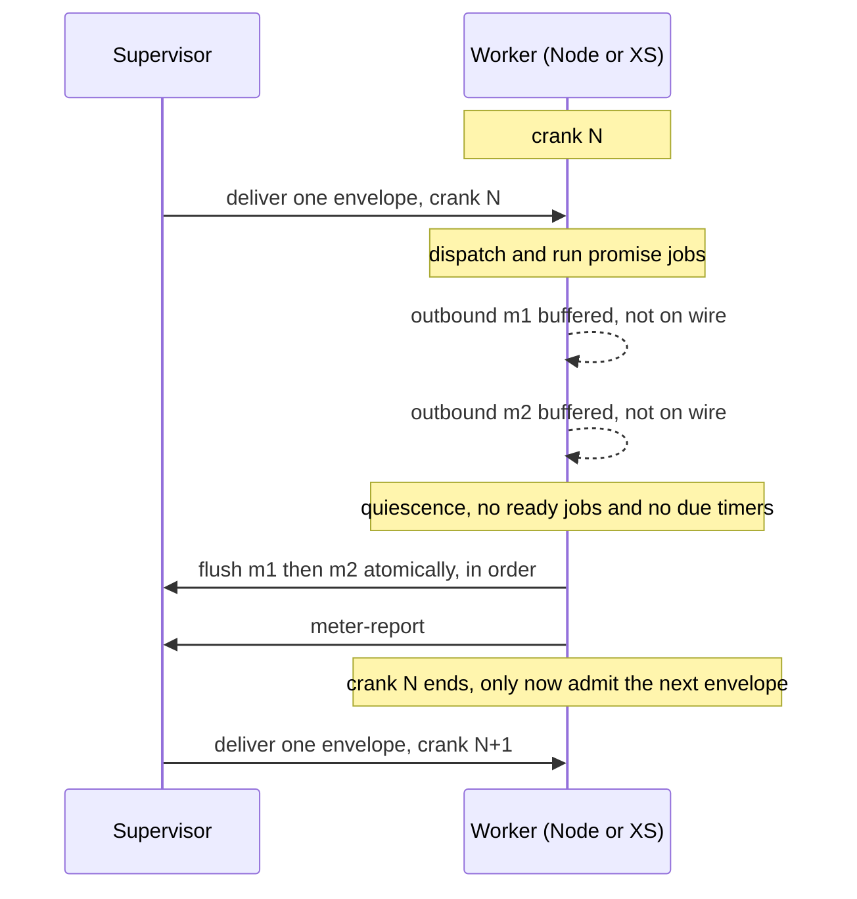

# Worker Quiescence Embargo: Hold Outbound Until a Crank Settles

| | |
|---|---|
| **Created** | 2026-08-14 |
| **Updated** | 2026-08-18 |
| **Author** | Kris Kowal (prompted) |
| **Status** | Not Started |
| **Source** | Follow-up requested in the approving review of [PR #124](https://github.com/endojs/endo-but-for-bots/pull/124) (slot-machine wire protocol) |

## Definitions

Defined up front because the sections below use these terms as load-bearing
vocabulary from their first sentence.

- **Supervisor.** The process that runs a worker machine: reads inbound envelopes,
  dispatches them into the worker, and carries the worker's outbound envelopes to
  the wire. There are two supervisors in play, one per worker runtime: the Rust+XS
  supervisor (`rust/endo/xsnap`) and the Node supervisor (`packages/daemon`).
  Workers are arranged in a process hierarchy, so a worker may have an ancestor
  (its parent supervisor's worker) and descendants. On Rust+XS the supervisor and
  the worker machine are separate processes; on Node the supervisor's dispatch pump
  and the worker's **emission seam** can sit in one process (`makeMessageCapTP`
  serves as both). So when Decision 1 says the buffer lives **worker-side, not
  supervisor-side**, it means the buffer binds at the *emission seam* (the point at
  which the worker's outbound is produced), not that a separate process is required;
  siting the Node buffer inside `connection.js` obeys Decision 1 because that is
  where the Node emission seam is.
- **Envelope.** The logical unit of the wire protocol: one of the four verbs
  `deliver` / `resolve` / `drop` / `abort`. "Message" in this document is a synonym
  for envelope, used only where the surrounding prose reads more naturally than
  "envelope" would; *message* and *envelope* name the same thing and add no fifth
  verb.
- **Control envelope.** An out-of-band supervisor command that shares the inbound
  receive path but is **not** a protocol verb: `debug-attach`, `debug-detach`,
  `debug`, `suspend`, and `meter-config`, dispatched by `handle_envelope`
  (`rust/endo/xsnap/src/lib.rs:1046-1082`) off the same `recv_raw_envelope` /
  `try_recv_raw_envelope` source the crank pump reads. Control envelopes are not
  members of a crank and are **exempt from crank exclusivity** (Decision 10): they
  must remain admissible mid-crank, because several of them exist precisely to act
  on a machine that is stopped or draining: a `debug` resume command reaches XS
  only via the mid-crank drain (`powers/debug.rs:80` -> `fxRunDebugger`), and a
  mid-crank `suspend` must be observed to snapshot the drained machine. Crank
  exclusivity gates the admission of the next **protocol** envelope, never a control
  envelope.
- **Frame.** The serialized, canonical-CBOR form of one envelope, as it appears on
  the wire. An envelope is buffered as its frame; "outbound batch" and "outbound
  frames" name the same bytes at the logical and serialized layers respectively.
- **Quiescence.** The worker has drained its promise-job queue to empty with no
  pending reactions, no synchronously-due timers, and no **outstanding host-power
  continuation** (an awaited `powers/fs.rs` / `powers/sqlite.rs` read whose promise
  has not yet resolved). XS already exposes the primitive: `Machine::quiesce` and
  the check-and-reset `fxMachineHasPendingJobs` in `rust/endo/xsnap/src/lib.rs`. The
  host-power clause is load-bearing only on Node, where a host call resolves from a
  later event-loop turn rather than synchronously inside the crank as it does on XS
  (Decision 6 fences on it); on XS the synchronous host call has already settled
  before the pump tests for pending jobs. Quiescence is bounded to **due-now** work:
  timers scheduled for the future do not hold the embargo open, or it would never
  open.
- **Crank.** The processing of a single inbound **protocol** envelope plus all
  promise jobs it queues, run to quiescence, with no further inbound protocol
  envelope admitted in between. This design scopes itself to **timer-free workers**
  (Decision 4): the supervised pump fires no timers, so every crank is a delivery
  crank carrying exactly one inbound envelope. This extends the crank definition
  that `daemon-xs-worker-metering.md` § "Crank lifecycle" already gives ("one
  inbound envelope plus all resulting promise jobs until quiescence") along one
  axis: the "no inbound envelope admitted in between" clause, which the current pump
  violates. Every crank buffers its outbound and reports once (`meter-report`) at
  its quiescence boundary. "Crank exclusivity" therefore means **at most one**
  inbound protocol envelope admitted per crank, never admitted mid-crank; control
  envelopes (above) are exempt and remain admissible mid-crank.
- **CapTP / OCapN / slot machine.** The wire-protocol variants named in the
  maintainer's request. **CapTP** (`@endo/captp`) is the legacy
  capability-transfer protocol; the **slot machine** (`@endo/slots`, introduced by
  [PR #124](https://github.com/endojs/endo-but-for-bots/pull/124)) is the
  canonical-CBOR variant whose byte-pinned frames make cross-supervisor parity
  checkable at the byte level. These two are the protocols a **worker** speaks
  through the worker-facing pump (`makeMessageCapTP` / `makeMessageSlots` in
  `connection.js`), which is where this design's mechanism binds, and the phrase
  "all CapTP variants" below refers to exactly this worker-pump pair. **OCapN**
  (`@endo/ocapn`) is a separate matter and is **scoped out** of this design's
  mechanism. It is **not** layered over `@endo/captp`: it implements its own object
  table, refcounting, and dispatch loop (`packages/ocapn/src/client/ocapn.js`,
  `dispatchMessageData` into `dispatch`) over its own netlayers (`packages/ocapn-iroh`,
  `packages/ocapn/src/netlayers/`), independent of `@endo/captp`, and no worker in
  this repo speaks OCapN through `connection.js` today. It is therefore scoped out
  the same way the non-worker gateway and peer-to-peer sessions are (§ The
  configuration option records how the maintainer's "must exist in ocapn" request
  is honored without this design touching OCapN's independent dispatch path).
- **Admission control, budget, hard limit.** Defined by `daemon-xs-worker-metering.md`
  (Complete) and used here as it defines them, not redefined. The supervisor meters
  each crank against a **budget** and delivers the next inbound envelope only once
  the remaining budget covers a full **hard limit** (the maximum a single crank may
  spend). Reserving a hard-limit crank's worth of budget before delivery is
  **admission control**: it guarantees a crank never runs unbudgeted, and it is the
  mechanism that lets XS bound crank duration with a hard-limit termination.
- **Outbound batch.** The ordered sequence of outbound frames a worker emits
  during one crank.

There are three classes of outbound frame, distinguished once here so later
sections need not re-derive the taxonomy: **ordinary outbound** (embargoed:
buffered and released at quiescence), **synchronous ancestor-calls** (Decision 5,
always exempt), and **debug frames** (Decision 8, always exempt).

## What is the Problem Being Solved?

A worker processes an inbound delivery by dispatching it and then running the
promise reactions it queues. Today the worker both **emits outbound envelopes**
and **admits the next inbound envelope** before it has finished settling from the
previous delivery. The reviewer of [PR #124](https://github.com/endojs/endo-but-for-bots/pull/124)
named this the "hangover inconsistency": the worker acts on the world while still
hung over from the delivery it has not yet finished.

One consequence the design must clear early is the **synchronous-call hazard**: a
strict one-envelope-per-crank gate could deadlock if a worker, mid-crank, issues a
synchronous call whose reply it must receive before it can quiesce, and that reply
is itself an inbound envelope the gate refuses to admit. Decision 5 resolves this
by restricting synchronous calls to ancestors and exempting them from the
discipline; it is introduced here because the affected-components table below
depends on it.

Two mechanisms produce the hangover inconsistency, one per supervisor:

- **Rust+XS supervisor.** The reactive pump in `rust/endo/xsnap/src/lib.rs` (the
  `run_supervised` crank loop) drains promise jobs and, on the same pass, uses
  `try_recv_raw_envelope` to fold **newly arrived inbound envelopes into the
  in-progress crank** (`got_envelope` then `continue`). Outbound frames are
  written to the wire the instant a promise reaction produces them: the XS
  worker's `sendEnvelope` calls the `sendRawFrame` host function immediately
  (`packages/daemon/src/bus-xs-core.js`). So delivery A's reactions, delivery A's
  outbound writes, and delivery B's dispatch all interleave inside one pump pass.
- **Node supervisor.** `makeMessageCapTP` in `packages/daemon/src/connection.js`
  dispatches with a bare `for await (const message of reader) dispatch(message)`
  loop and writes each outbound frame as CapTP produces it (the `writeTail`
  chain). There is no crank boundary at all: the next inbound envelope is
  dispatched whenever the reader yields, which is governed by Node's event loop,
  not by whether the worker has quiesced.

Because Node's event loop and XS's `fxMachineHasPendingJobs` pump drain their
reaction queues at different granularity relative to frame arrival, the same
logical inbound sequence yields, on the two supervisors:

- a **different outbound byte stream** (outbound frames from one delivery
  interleave differently with the next delivery's frames), and
- a **different intermediate worker state** at the moment each subsequent
  delivery is dispatched (some reactions have run under one supervisor and not
  the other).

That divergence directly undermines the property [PR #124](https://github.com/endojs/endo-but-for-bots/pull/124)
exists to establish: **byte-for-byte cross-supervisor parity** (the `@endo/slots`
and `@endo/cbor` byte fixtures, and the `sqlite-parity.test.js`
Node-reads-what-Rust+XS-wrote guarantee). It also makes replay and snapshot-resume
nondeterministic, since the outbound effect of a delivery is a function of wire
timing rather than of worker state alone.

### Relationship to the metering "output embargo"

`daemon-xs-worker-metering.md` (Status: Complete) already considered an "output
embargo" whose sole job was to buffer outbound so it could be **discarded on a
metering abort** (a rollback-discard). Admission control removed the need for
**that rollback-discard mechanism**: it reserves a full hard-limit crank of budget
before delivery, so any normally-completing crank is fully paid for and never
needs its output rolled back.

Admission control does **not**, however, remove the need for an outbound envelope
embargo. Admission control eliminates the problem of doing *unbudgeted* work; it
does not make a crank's outbound side effects atomic. An outbound embargo is
still required so that the **partial side effects of a failed delivery do not
escape**: if a crank aborts (a fault, a metering hard-stop) *before its flush step
runs*, none of its outbound may reach the wire. Holding outbound until quiescence
gives the crank all-or-nothing outbound semantics against a pre-flush abort: the
batch is released only once the crank has settled cleanly, so **a failed crank
emits nothing**.

This property is emphatically **not** "a retry starts clean." There is no
redelivery in this system. An aborted crank is fatal: XS sends
`meter-report("terminated")` and breaks its pump (`rust/endo/xsnap/src/lib.rs:1806-1810`),
with recovery only an optional re-create from a *prior* snapshot, and Node CapTP
likewise does not redeliver a thrown dispatch. So the guarantee is that a failed
crank produces **no** observable outbound at all, rather than a truncated or
interleaved prefix. The peer-visible consequence (a question the failed crank
would have answered never settles) is not repaired by the embargo and is the same
hang a thrown Node dispatch already produces today; it is out of scope here. What
the embargo adds is that the peer never observes a *partial* effect it would then
have to reconcile against a continuation that will never come.

The scope of this failure-atomicity claim is a **pre-flush** abort. A crash
*during* an N-frame flush is out of scope for in-memory buffering: once the first
frame reaches the wire a prefix has escaped, and no amount of buffering makes the
multi-frame flush atomic against a crash mid-flush. The transactional-turn prior
art buys that stronger property with a durable checkpoint written before release
(see § Prior art), an approach this design does not adopt; the guarantee here is exactly
"an abort that occurs before the flush step leaves no outbound trace."

The quiescence embargo proposed here therefore serves **two** ends admission
control does not: it **releases the outbound batch atomically at quiescence in
emission order** (the cross-supervisor parity property below), and it **withholds
the partial side effects of a delivery until that delivery has completed** (the
pre-flush failure-atomicity property just described). It never discards on a
normally completing crank, so it does not reintroduce the rollback-discard
complexity the metering design turned down (crank-boundary delimiters purely for
discard). The two mechanisms compose: admission control gates **inbound** on
budget; the quiescence embargo gates **outbound** on quiescence, enforces one
delivery per crank, and confines a failed crank's effects.

The failure-atomicity mechanism is drop-with-the-crank, and it is symmetric across
the two supervisors: because the per-crank buffer is never flushed until
quiescence, a crank that aborts before its flush has written nothing to the wire,
so there is no partial trace to clear from the transport. What remains is the
in-memory buffer, which is per-crank state owned by the crank, discarded when the
crank unwinds. On the Rust+XS side that is the pre-existing
terminate-and-restore-from-snapshot path on a metering abort
(`daemon-xs-worker-metering.md`: the machine state after an abort is unreliable, so
the worker is re-created from its last snapshot), which takes the still-unflushed
buffer with it. On the Node side the buffer and the flush live in different turns
(Decision 6 puts the flush in a later `setImmediate` turn), so lexical unwinding of
the dispatch turn does **not** by itself guarantee the flush is skipped. The crank
therefore carries an explicit **per-crank abort flag**, and what sets it must be
named precisely, because on Node an ordinary delivery rejection is **not** a crank
abort. Node CapTP's `dispatch` catches every handler exception into `quietReject`
and returns `false` (`packages/captp/src/captp.js:1000-1026`), converting a rejected
delivery into an ordinary outbound `CTP_RETURN isRejected` frame
(`packages/captp/src/captp.js:855-861`): that is a **well-defined, committed crank
outcome** whose reply frame belongs in the batch and must flush normally, not a
fault that drops the batch. The abort flag is set only by a genuine **crank fault**:
a metering hard-stop, or an exception that escapes the pump turn itself (the
buffering wrapper around `send`, the `setImmediate` drive, or the flush step), none
of which `quietReject` intercepts. It is never set by a handler rejection that CapTP
has already turned into a reply frame. So the Node abort-flag path is exercised by
injecting a fault into the pump/flush machinery, not by making a handler reject. The
abort decision and the commit decision share one observable (the flag) rather than
relying on a stack extent that Decision 6 has already broken. Either way the failed
crank has written no outbound to the wire and leaves
no buffered outbound behind, so there is nothing partial for a peer or a later
crank to observe (there is no redelivery; see the "a failed crank emits nothing"
statement above).

### Prior art

This is the SwingSet/liveslots crank discipline (Agoric's ocap kernel, where a
"crank" is one delivery run to completion before the next is dispatched) and the
Ken protocol's transactional-turn delivery (a fault-tolerant distributed-messaging
protocol whose turns are transactional: buffer a turn's outbound, flush at the
turn boundary, exactly one delivery per crank). Ken achieves atomicity against a
crash *during* the flush by writing a durable checkpoint before it releases the
turn's outbound; this design deliberately does not adopt that stronger, heavier
guarantee (see the pre-flush scoping above). The metering design already adopts the
crank vocabulary; this design restores the crank's **exactly-one-inbound** and
**flush-at-quiescence** contract that the current pump violates.

## Design: the embargo

One per-worker discipline, byte-for-byte identical across supervisors when the
embargo is enabled on both (see § Cross-supervisor parity implications for the
configuration precondition):

1. **Admit exactly one inbound protocol envelope** (crank start). Do not read the
   next until this crank ends. (This design scopes itself to timer-free workers, so
   one inbound envelope is the only way a crank begins; see the Crank definition and
   Decision 4. Control envelopes are admitted out of band and are not a crank start;
   see Decision 10.) Preserve the metering admission gate: deliver only when
   `budget >= hard_limit`.
2. **Buffer every outbound envelope** the worker emits into an ordered per-crank
   buffer. Do not write to the wire.
3. **Run to quiescence.** Drain promise jobs until `fxMachineHasPendingJobs`
   reports none (XS) or the `setImmediate` turn fires after the microtask queue
   drains (Node, Decision 6). Admit no inbound envelope during the drain.
4. **Flush the outbound batch** to the supervisor in emission order, as one
   atomic unit, at the quiescence boundary, unless the per-crank abort flag is
   set, in which case drop the buffer (see § Relationship to the metering "output
   embargo" above).
5. **Report the crank** (`meter-report`), then admit the next inbound envelope.

The invariant this buys: **the outbound batch is a pure function of (pre-crank
worker state, the single delivered envelope, and the replies to any host-power reads
and synchronous ancestor-calls the crank issues)**, independent of wire timing and
host scheduler. The last term is named explicitly because a crank that reads a
`powers/fs.rs` file or receives a synchronous ancestor reply (Decision 5) takes an
input from neither of the first two terms; parity holds only when both supervisors
are handed the same host-power and sync-reply values (the host is deterministic
across the two runtimes for the fixture inputs). Both supervisors compute the
identical batch, so the outbound byte stream is identical. This holds
unconditionally because the design scopes itself to
**timer-free workers** (Decision 4): the supervised pump fires no timers, so no
wall-clock quantity enters the batch. Extending parity to a timer-using supervised
worker would require both a timer-firing pump change on each side and a shared
deterministic clock; that is a named follow-up (Decision 4), not part of this
design. The parity contract below states the timer-free precondition explicitly.

**Where the buffer lives: worker-side**, at the emission seam, because quiescence
is a property only the worker machine can observe.

- **XS.** The `sendRawFrame` host callback appends the frame to a per-crank
  `Vec<Vec<u8>>` instead of writing it. The reactive pump flushes the vector to
  the transport after the promise-job drain completes and before it blocks for
  the next envelope, consulting the abort flag first.
- **Node.** Wrap the `send` passed to `makeCapTP` / `makeMessageSlots` so it
  appends to an array rather than chaining onto `writeTail`. This is the Node
  **emission seam** (the point at which the worker's outbound is produced), so
  siting the buffer here is **worker-side** per Decision 1 even though `connection.js`
  sits in `packages/daemon`, the Node supervisor package (see the Supervisor and
  emission-seam entries in Definitions); it is not a supervisor-side buffer. Drive
  dispatch through a turn that flushes the array in a `setImmediate` turn after the
  microtask queue empties **and** after any outstanding host-power promise settles
  (Decision 6, consulting the abort flag), then reads the next inbound frame. **This
  barrier is installed only for a worker session**, established by the worker-facing
  splices (the raw Node worker splice `bus-worker-node-raw.js`, and the XS worker
  splice) through an explicit worker entry point, not by the mere presence of an
  options bag (§ The configuration option). The non-worker callers of the shared
  `makeMessageCapTP` pump (the WebSocket gateway, the peer-to-peer network links)
  establish a link session and are unchanged; see the `connection.js` row in
  § Affected components.

## Affected components

| Component | Change |
|---|---|
| `rust/endo/xsnap/src/lib.rs` (`run_supervised` pump, near the `'outer` crank loop) | Stop folding mid-crank inbound **protocol** envelopes into the current crank: move the `try_recv_raw_envelope` drain to **after** the outbound flush so each crank consumes one protocol envelope. Add the per-crank outbound buffer and flush it after the promise-job drain. Persist that buffer **alongside** the machine snapshot in `handle_suspend` (which today snapshots only the XS heap via `machine.suspend_to_cas`, not the Rust-side `Vec<Vec<u8>>`) so a mid-crank `suspend` does not lose buffered sends (Decision 10). Read the embargo flag from the worker's spawn/control envelope (see § Cross-supervisor parity implications). Preserve mid-crank admission of **control** envelopes (`debug-attach`/`debug-detach`/`debug`, `suspend`, `meter-config`; Decision 10): `handle_envelope` (`lib.rs:1046-1082`) must still intercept them ahead of the one-protocol-envelope gate, so a debug resume or mid-crank suspend still reaches a stopped or draining machine. |
| `rust/endo/xsnap/src/worker_io.rs` | Confirm the synchronous-ancestor-call reply path for child-process XS workers so strict one-envelope-per-crank cannot deadlock on a synchronous response: `try_recv_raw_envelope` semantics and the `PipeTransport` stub (child-process workers return `None`, noted in-code as a "quiesce deadlock" risk). The synchronous-ancestor-call exemption (Decision 5) is what keeps strict one-envelope-per-crank from deadlocking on a synchronous response here; confirming that response path, or giving those workers real non-blocking recv, is residual build validation. |
| `packages/daemon/src/bus-xs-core.js` | `sendEnvelope` / `sendRawFrame` seam: buffer instead of writing; expose a flush the pump calls and a per-crank abort flag it consults. |
| `packages/daemon/src/connection.js` (`makeMessageCapTP`, plus a worker entry point) | `makeMessageCapTP` is the shared pump for **every** CapTP session, worker and non-worker alike (`bus-worker-node-raw.js:48`, `bus-manager-node-powers.js:311`, `bus-manager-rust-xs.js:550`, `ws-gateway.js:217`, `networks/tcp-netstring.js:101,169`). Crank exclusivity and the turn barrier must therefore **not** replace the bare loop for every caller: a gateway or peer-to-peer session has no worker, no machine, and no quiescence to observe, and serializing it one-message-per-turn would be a regression. So the worker discipline binds to an explicit **session kind**, not to the presence of an options bag: the worker-facing splices (`bus-worker-node-raw.js`, the XS worker splice) establish a **worker session** through a dedicated `makeWorkerMessageCapTP` entry point (equivalently a `sessionKind: 'worker'` selector), which installs crank exclusivity **unconditionally** and the turn barrier (dispatch one frame, await the `setImmediate` drain and any outstanding host-power promise, flush the buffered outbound unless aborted, then read the next frame; buffer `send` instead of the immediate `writeTail` write). The non-worker callers (`ws-gateway.js`, `networks/tcp-netstring.js`, `bus-manager-node-powers.js`) keep calling `makeMessageCapTP` (a **link session**) and keep the existing eager `for await ... dispatch` loop; they cannot acquire cranking by passing a policy flag. `bufferOutboundUntilQuiescence` (§ The configuration option) is then a pure buffering-policy knob a worker session reads, orthogonal to the kind (Decision 3). |
| `packages/daemon/src/bus-worker-node-raw.js`, `worker.js` | Node raw worker inherits the barrier through `makeMessageCapTP`. |
| `packages/slots` (`@endo/slots`: `makeMessageSlots`, `makeNetstringSlots`) and the daemon splices (`bus-manager-endor.js`, `bus-worker-xs.js`) | Thread the same `pumpOptions` bag (`{ bufferOutboundUntilQuiescence, stuckCrankThresholdMs }`) into the slot-machine session (`makeMessageSlots` takes no options bag today, so this adds the same bag `makeMessageCapTP` grows) so both wire protocols behave identically. This is the surface [PR #124](https://github.com/endojs/endo-but-for-bots/pull/124) adds; do not alter [PR #124](https://github.com/endojs/endo-but-for-bots/pull/124) itself; instead, land the embargo as its own change once PR #124 has merged (see § Dependencies for the blocking order). |
| `rust/endo/src/supervisor.rs` (`start_routing` / `route_message`, per-worker inbox) | The one-envelope-per-crank gate binds at the per-worker inbox admission, adjacent to the existing suspended-worker and admission-control skips. The supervisor's own `outbox_rx.drain()` batching must not reorder relative to a worker's crank flush. |

## Cross-supervisor parity implications

The behavior must stay **byte-for-byte consistent across supervisors** when both
are configured with the embargo on, which is the whole motivation. State the
invariant as a testable contract:

> For a fixed pre-state, a fixed ordered inbound sequence, and the embargo enabled
> on both supervisors, the outbound stream of canonical CBOR frames a
> timer-free worker emits is identical under the Node and the Rust+XS supervisors.
> (Timer-using supervised workers are out of scope: neither supervised pump fires
> timers today, so extending parity to them is a named follow-up; see Decision 4.)

Because slot-machine frames are canonical CBOR pinned byte-for-byte on both sides
([PR #124](https://github.com/endojs/endo-but-for-bots/pull/124)'s `@endo/slots`
and `@endo/cbor` fixtures), batch equality is checkable at the byte level, in the
same spirit as `sqlite-parity.test.js`.

**Which frame classes the total-order and byte-parity invariant covers.** The
"emission order, as one atomic unit" flush (§ Design: the embargo, step 4) and the byte-parity
contract above range over **ordinary outbound frames only**: the embargoed batch.
The two exempt classes are emitted eagerly and are **not** members of the ordered
batch: a synchronous-reply frame (Decision 5) is emitted mid-crank, ahead of the
same crank's still-buffered ordinary frames, and debug frames (Decision 8) are a
side channel. The relative wire order between an exempt frame and a same-crank
buffered batch is therefore **not** constrained by this invariant and is **not**
part of the parity claim; CapTP's per-question/answer causal ordering, not this
total order, is what governs a synchronous reply. Two supervisors may legitimately
interleave a sync-reply differently relative to a buffered batch and still satisfy
byte-for-byte parity, because parity is asserted over the ordinary-outbound batch
alone.

The embargo behaves **identically across the CapTP path and the slot-machine
path** when enabled. The design separates two independent things, only the second
of which the configuration option controls:

- **Crank exclusivity** (exactly one inbound envelope admitted per crank, no
  mid-crank folding) is **unconditional and never option-gated.** It restores the
  crank contract `daemon-xs-worker-metering.md` already mandates, so the option
  cannot turn it off. Note that crank exclusivity governs *inbound admission* and
  is separable from *outbound* buffering: a supervisor can refuse the next inbound
  envelope until quiescence while still emitting outbound eagerly.
- **The outbound-buffering delay** (holding the batch until quiescence, then
  flushing it in one contiguous unit) is what the option controls.

### The configuration option: what it is, its default, and what "off" forfeits

The maintainer's request was precise: "It would be good for this option to
**exist** in all captp variants including ocapn, slot machine, and our legacy
captp" (emphasis added), on the grounds that "it's not clear that the delay this
introduces is always better than timely emission." The option is therefore
`bufferOutboundUntilQuiescence`, named for exactly what it gates (the buffering
delay), not the whole embargo discipline, since crank exclusivity is not behind it.

**How far "all captp variants" reaches, stated honestly.** Of the three variants
the request names, only two are spoken by a worker through the worker-facing pump
this design modifies: the legacy CapTP (`makeMessageCapTP`) and the slot machine
(`makeMessageSlots`). OCapN is not layered over `@endo/captp` and no worker speaks
it through `connection.js` (see Definitions), so this design's mechanism does not
reach it, and this design does **not** claim to have added the option to OCapN.
Honoring the "must exist in ocapn" requirement is a named follow-up: when a worker
does speak OCapN, the option belongs in OCapN's own dispatch surface
(`packages/ocapn/src/client/ocapn.js` and its netlayers), not grafted onto the
CapTP pump by analogy. Scoping OCapN out here, rather than asserting a coverage the
plan does not deliver, is what keeps the compliance claim true.

- **Default: on.** The buffering delay is the default so that parity and pre-flush
  failure-atomicity hold out of the box. An earlier draft called the delay "a
  latency tradeoff rather than a correctness requirement"; that was wrong. The
  buffering carries **both** the cross-supervisor byte-parity property and the
  pre-flush failure-atomicity property, and both are correctness properties. What
  the option offers is not "correctness versus latency" but an explicit,
  operator-visible decision to **forfeit both** in a deployment that needs neither.
- **What "off" forfeits.** With `bufferOutboundUntilQuiescence: false`, outbound is
  emitted promptly (mid-crank), so both cross-supervisor byte-parity and pre-flush
  failure-atomicity are lost. Turning it off is safe only for a **single-supervisor
  deployment** that does not compare byte streams across runtimes and that accepts
  a failed crank's partial outbound escaping. Crank exclusivity still holds.
- **"Exist in all variants" does not mean "one global value."** The maintainer
  asked that the option *exist* in each variant, not that all variants carry the
  same value at runtime. There is no single-source mechanism that forces
  uniformity, and the earlier claim that the flag "rides the `capTpOptions` bag
  ... so all three variants read one spelling from one place" was wrong on two
  counts. First, `capTpOptions` is spread verbatim into `makeCapTP`
  (`packages/daemon/src/connection.js:164`), where every member is a genuine
  `@endo/captp` option, so an embargo key would be forwarded as an unknown option
  into an upstream package. Second, `capTpOptions` reaches neither the slot-machine
  session (`makeMessageSlots` has no options bag) nor the Rust+XS supervisor (which
  reads no JS object at all). The correct siting is per-variant, each in that
  variant's own configuration surface:
  - **Node CapTP / slot machine (JS).** Two orthogonal things kept on separate
    surfaces, so that no single absence signals several decisions at once. **Session
    kind** (worker versus non-worker link) is an **explicit datum**, not inferred
    from the presence of an options bag: a worker session is established by the
    worker entry point (`makeWorkerMessageCapTP` / `makeWorkerMessageSlots`,
    equivalently a `sessionKind: 'worker'` selector) that the worker splices call,
    and crank exclusivity (Decision 3) derives from that kind alone. A non-worker
    caller of the plain `makeMessageCapTP` / `makeMessageSlots` gets a link session
    and cannot acquire cranking by passing any flag. **Buffering policy** is the
    `bufferOutboundUntilQuiescence` knob (default on), carried in a single
    `pumpOptions` bag (`{ bufferOutboundUntilQuiescence, stuckCrankThresholdMs }`)
    passed to the worker entry point and **read only for a worker session**. A bare
    positional parameter is rejected because `makeMessageCapTP` already carries seven
    positional parameters with two trailing optionals callers pad with `undefined`
    (`bus-manager-rust-xs.js:556`), so a boolean at slot 8 (and the Decision 9
    `stuckCrankThresholdMs` at slot 9) would force every caller to write extra
    `undefined`s, and the concept would spell two ways once `makeMessageSlots` (which
    has no options bag today) grew a bag of its own. The bag follows the in-repo
    precedent of `capTpConnectionRegistrar` (`connection.js:103`), a separate
    parameter precisely because it is not a CapTP option: the embargo is a property
    of the reader/dispatch pump, not of CapTP, so it does not belong in
    `capTpOptions`. Because the kind is explicit, an omitted or `{}` `pumpOptions` on
    a **worker** session still gets crank exclusivity and default-on buffering, and a
    **non-worker** session cannot get either; the three reachable states are named in
    the table below.
  - **Rust+XS supervisor.** A field on the existing control-envelope surface that
    already crosses the language boundary: the `meter-config` control envelope,
    CBOR `{"hard_limit": u64}` decoded at `rust/endo/xsnap/src/lib.rs:1285`, gains
    `{"buffer_outbound_until_quiescence": bool}` alongside it. The field spells the
    **same word choice** as the JS-side `bufferOutboundUntilQuiescence`, modulo
    Rust's snake_case convention. It is deliberately **not** `quiescence_embargo`,
    which would reintroduce on the wire surface exactly the "embargo" word the JS name
    avoids (an operator seeing `quiescence_embargo: false` could wrongly read it as
    gating the whole discipline, when crank exclusivity survives the flip). The
    Decision 9 stuck-crank threshold takes the same treatment: the field is spelled
    `stuck_crank_threshold_ms` beside the embargo field, carrying the `_ms` unit
    suffix its JS bagmate carries, so the Rust+XS operator has the key too. One
    concept, one word, on every variant; only casing varies per language.
- **The three reachable states, named once.** Session kind and buffering policy are
  orthogonal, so a worker splice and a gateway caller reach exactly three
  configurations, no fourth:

  | Session (entry point) | Crank exclusivity | Outbound |
  |---|---|---|
  | Non-worker link (`makeMessageCapTP` / `makeMessageSlots`) | none | eager |
  | Worker, `bufferOutboundUntilQuiescence` default or `true` | unconditional | buffered, flushed at quiescence |
  | Worker, `bufferOutboundUntilQuiescence: false` | unconditional | eager (byte-parity and pre-flush failure-atomicity forfeited) |

  A non-worker link has no `bufferOutboundUntilQuiescence` row because the knob is
  read only for a worker session; a worker session always has crank exclusivity
  regardless of the knob's value.
- **The single value-source.** The authoritative value is set
  once, per worker, by the supervisor at **spawn time**, and each runtime derives
  its local spelling from that one decision: the Node pump parameter and the Rust
  control-envelope field are both written from the same per-worker spawn
  configuration, so the two are set together rather than by independent
  per-connection discipline (nothing reconciles them after spawn because there is
  one source). The operator-facing surface on which that per-worker spawn
  decision lives (the concrete key on the worker-spawn request the supervisor
  reads, alongside `hard_limit` and the other per-worker metering parameters) is
  **deferred to the build as a named residual** (see § Resolved in review, "Option
  gating"): this design fixes the two derived spellings and the single-source
  requirement, and the build names the one spawn-config key both derive from rather
  than this design inventing a surface it cannot yet verify against the spawn path.
  A parity test configures both sides on; a single-supervisor deployment sets
  whichever value it wants. The design does not,
  and per the maintainer need not, enforce a global constant. It guarantees the
  option exists in every variant and is derived from one per-worker source, and it
  states plainly that byte-parity is claimed only across two supervisors that were
  spawned with the same value.

Its scope is stated once here and cross-referenced elsewhere: **it buffers ordinary
outbound only; synchronous ancestor-calls (Decision 5) and debug frames
(Decision 8) are always exempt, independent of the option's value.**

## Test / verification strategy

- **Reproduction of the current inconsistency.** Set up a worker whose handler
  for delivery A emits two outbound sends across a reaction boundary, for example
  `E(x).m1(); Promise.resolve().then(() => E(x).m2())`, with delivery B already
  queued, and drive the two supervisors with an **identical scripted scheduler**
  so the reproduction is deterministic rather than load-dependent. Show that under
  the current pump the outbound interleaving of `m1`, `m2`, and B's dispatch
  differs between Node and XS. This is the failing test the embargo must turn
  green.
- **Regression guarding the embargo.**
  - One report per crank: `meter-report` count equals crank count, which for the
    timer-free workers this design scopes to equals the delivery count.
  - Contiguity and order: a crank's outbound batch is emitted contiguously and in
    emission order, with no next-delivery frame interleaved.
  - Cross-supervisor byte equality: for a fixed inbound script and the embargo on
    both supervisors, the outbound CBOR byte stream is identical under Node and
    Rust+XS (parity test alongside `sqlite-parity.test.js`).
  - Failure-atomicity (pre-flush): a crank that aborts before its flush with a
    buffered-but-unflushed outbound batch writes nothing to the wire: a failed
    crank emits nothing (there is no redelivery; the crank is fatal). Assert no
    partial batch is ever observable on the wire, exercising both the Rust+XS
    terminate-and-restore-from-snapshot path and the Node
    abort-flag-drops-the-buffer path. The Node case injects a fault into the
    pump/flush machinery (a genuine crank fault sets the abort flag), **not** a
    handler rejection, which CapTP turns into an ordinary `CTP_RETURN isRejected`
    reply frame that must flush normally (§ Relationship to the metering "output
    embargo").
  - Option off: with `bufferOutboundUntilQuiescence: false`, outbound is emitted
    promptly and crank exclusivity still holds (one envelope per crank, verified by
    `meter-report` count) even though byte-parity and failure-atomicity are not
    claimed.
- **Liveness.** A worker that never quiesces admits no inbound and flushes nothing.
  The XS metering hard-limit abort bounds only a **compute-divergent** crank (one
  that keeps spending computrons); a crank blocked awaiting a synchronous ancestor
  reply (Decision 5) or a blocking host power (`powers/fs.rs`, `powers/sqlite.rs`)
  burns no computrons, so the hard-limit never fires (Decision 9). The stuck-crank
  observability mitigation therefore applies to **both** supervisors: after the
  drain exceeds a configurable threshold (`stuckCrankThresholdMs`) the pump (XS or
  Node) surfaces a supervisor-visible stuck-crank warning rather than the worker
  hanging silently. Closing the gap with a real bound (a Node metering bound, or an
  XS wall-clock bound for a non-compute-divergent crank) is a follow-up against the
  metering design, out of scope for this test.
- **Determinism / replay.** The same inbound script run twice under the scripted
  scheduler yields identical outbound bytes.
- **Snapshot-resume.** Two cases. A worker suspended at a quiescence boundary
  (empty buffer) resumes and produces the identical continuation. And, the harder
  case skeptic named, a worker suspended **mid-crank with a non-empty outbound
  buffer** resumes and flushes exactly that buffered batch once, at the resumed
  crank's quiescence, with no send lost or duplicated: this exercises the
  buffer-persisted-alongside-the-snapshot path (Decision 10), without which the
  resumed heap would believe it emitted sends that died with the suspended process.
  Both tie into the existing suspend/resume infrastructure.

## Dependencies

| Design | Relationship |
|---|---|
| [daemon-xs-worker-metering](daemon-xs-worker-metering.md) (Complete) | Defines the crank and admission control. This design restores the crank's exactly-one-inbound and flush-at-quiescence contract and must **not** reintroduce the rejected rollback-discard embargo. Extends. |
| [worker-rust-xs](worker-rust-xs.md) | The XS worker bootstrap and pump this modifies. |
| [daemon-endor-architecture](daemon-endor-architecture.md) | Supervisor routing and per-worker inboxes. |
| slot-machine wire protocol ([PR #124](https://github.com/endojs/endo-but-for-bots/pull/124)) | The parity target. `@endo/slots` plus `@endo/cbor` byte pinning make batch equality checkable. This is a **blocking** order, not merely a separation: the `packages/slots` and `bus-manager-endor.js` rows above name files PR #124 introduces, so the embargo lands only after PR #124 merges. Do not alter PR #124. |

## Design decisions

1. **Buffer worker-side, not supervisor-side.** Quiescence is a machine property
   observable only at the worker.
2. **Release at quiescence, never discard on a normally completing crank.** This
   is what distinguishes the quiescence embargo from the metering rollback-discard
   embargo, and what keeps it compatible with admission control. It is still needed
   *alongside* admission control: admission control eliminates unbudgeted work but
   not partial-effect escape, so the embargo confines the outbound side effects of
   a **failed** crank (a pre-flush abort): a crank that aborts before its flush emits
   nothing, rather than leaking a partial prefix (there is no redelivery; see
   § Relationship to the metering "output embargo"). The buffer *is* dropped when a
   crank aborts before its flush; "never discard" applies only to cranks that
   complete normally.
3. **Exactly one inbound protocol envelope per crank.** Restores the crank contract
   `daemon-xs-worker-metering.md` already states; removes the mid-crank inbound
   folding in the XS pump and the crank-free dispatch loop on Node. Unconditional
   for a **worker session** (never behind the configuration option, Decision 7),
   but scoped to worker sessions only: the shared Node pump (`makeMessageCapTP`)
   also serves non-worker sessions (the WebSocket gateway, peer-to-peer network
   links) that have no worker and no crank, and those keep their eager dispatch loop
   (see the `connection.js` row in § Affected components). Worker-ness is an
   **explicit session kind** (a dedicated worker entry point, equivalently a
   `sessionKind: 'worker'` selector; § The configuration option), not inferred from
   the presence of a `pumpOptions` bag, so a worker splice cannot silently lose
   exclusivity by omitting the bag and a non-worker cannot acquire it by passing one.
   Crank exclusivity derives from the kind; `bufferOutboundUntilQuiescence` is pure
   policy read only within a worker session. Control envelopes are exempt regardless
   (Decision 10).
4. **Timers are out of scope; the supervised pump fires none.** Quiescence is
   bounded to due-now jobs (a future-scheduled timer does not hold the embargo
   open), but the supervised pump does not *fire* timers at all, so no crank is ever
   triggered by a timer. On XS, `fxRunLoop` (the loop that services timers) is
   called only on the non-supervised path (`rust/endo/xsnap/src/lib.rs:1830`);
   `run_supervised`'s pump drains promise jobs and inbound envelopes only, and § Affected
   components adds no timer firing. On Node, Decision 6 puts the flush in the
   `check` (`setImmediate`) phase, which runs strictly before the next `timers`
   phase, so an already-due timer can never join the current crank's batch. It can
   only trigger a later turn. The XS/Node divergence for a timer-using worker is
   therefore **structural**, not merely clock-dependent: neither supervised pump has
   a timer-crank mechanism at all, and adding one on each side (plus a shared
   deterministic clock) is what parity for a timer-using worker would require. This
   design does **not** add it. It scopes its pure-function and byte-parity claims
   (§ Design: the embargo, § Cross-supervisor parity implications) to **timer-free workers** and
   files timer support in the supervised pump as a follow-up (against the metering
   and `worker-rust-xs` designs) that must name the pump change on both sides. A
   worker that schedules a timer still runs correctly under the non-supervised path;
   only the cross-supervisor byte-parity guarantee is withheld from a supervised
   timer-using worker.
5. **Synchronous messages are exempt from the embargo discipline.** A synchronous
   message may only call an **ancestor in the process hierarchy**, and the ancestor
   (parent) sees the call as **asynchronous** and applies the embargo protocol to
   it normally. Because the exemption is confined to the ancestor direction, it
   cannot form the cross-worker cycle that would deadlock the one-envelope-per-crank
   gate. The synchronous *reply* frame is likewise exempt: it is not buffered until
   the ancestor's own quiescence, so a synchronous caller is not blocked for the
   callee's whole crank drain. Exempting the reply is what keeps the caller's own
   in-flight crank able to quiesce (see the resolved sync-call question below).
6. **Node emulates XS job draining with `setImmediate`.** The Node quiescence
   barrier targets XS's "drain all pending jobs" semantics; a `setImmediate` turn
   is the **working hypothesis** for emulating that boundary on Node, preferred
   over a bare microtask-empty fence because it fires after the microtask queue
   drains. This is a proposed approximation, not an established in-repo precedent
   (the repo has no existing `setImmediate` job-drain to cite), and it carries the
   residual validation recorded below, which now includes verifying the emulation
   against Node's actual event-loop phase order (`timers` -> `poll` ->
   `check`/`setImmediate`): a timer scheduled during the drain does not need to join
   the current batch (Decision 4's narrowed "due-now"), and any timer that must be
   observed as due-now has to be due before the `check` phase fires. Because the
   flush lives in this later turn, failure-atomicity relies on the per-crank abort
   flag (Decision 2 / the failure-atomicity discussion in § Relationship to the
   metering "output embargo"), not on lexical unwinding of the dispatch turn.
   The same `setImmediate` fence must also account for **outstanding host-power
   promises**, or it splits a Node crank that XS runs as one. A host power reads
   synchronously on XS (`powers/fs.rs` uses `std::fs::read`, so the continuation
   settles as a microtask inside the same job drain), but on Node
   `fs.promises.readFile` / the sqlite reads resolve from a later `poll` phase,
   strictly **after** the `check` phase where the flush lives. So a crank that awaits
   a file or sqlite power would appear quiesced at the `setImmediate` fence while its
   continuation is still pending, then flush, report, and admit the next envelope
   while XS still holds one crank: one XS crank becomes N Node cranks, voiding both
   byte-parity and crank exclusivity with no timer involved. The Node pump therefore
   tracks in-flight host-power operations and does **not** treat the crank as
   quiesced (does not fire the flush) until that count returns to zero, re-arming the
   fence across the intervening turn. This is why the Quiescence definition names "no
   outstanding host-power continuation" as a third condition, and it makes the Node
   crank boundary coincide with XS's for a host-power-using crank. (The alternative,
   a stated host-power-free precondition alongside timer-free, was rejected: file and
   sqlite powers are ordinary worker inputs, so excluding them would gut the design's
   reach; the fence keeps them in scope.)
7. **The outbound-buffering delay is a configuration option that exists in every
   CapTP variant; crank exclusivity is not option-gated.** The delay buffering
   introduces is not universally better than timely emission, so *that delay* is a
   configuration option (`bufferOutboundUntilQuiescence`, default on), while
   exactly-one-envelope-per-crank (Decision 3) holds unconditionally. Per the
   maintainer's request the option must **exist** in the CapTP variants a worker
   speaks (the legacy CapTP and the slot machine), each spelled in that variant's own
   configuration surface and derived from one per-worker spawn value. OCapN is scoped
   out because no worker speaks it through the worker pump today (see Definitions and
   § The configuration option), and carrying the option into OCapN's own dispatch
   surface is a named follow-up. This is not a requirement that all variants carry
   the same value at runtime, and byte-parity is claimed only across two supervisors
   spawned with the option on. Turning it off
   forfeits both byte-parity and pre-flush failure-atomicity (§ The configuration
   option). Scope: the option gates ordinary outbound only; synchronous
   ancestor-calls (Decision 5) and debug frames (Decision 8) are exempt regardless
   of its value.
8. **Debug outbound is a side channel, not embargoed.** `flush_debug_outbound`
   (breakpoint hits, step responses) is diagnostics, not protocol traffic, so it
   is exempt from the embargoed batch.
9. **Neither supervisor bounds a *blocked* crank; the unbounded-quiescence liveness
   gap is an accepted, documented non-goal of this design.** This decision is made
   here rather than deferred to test authorship, because it changes the runtime's
   failure-observability envelope and so belongs to the design. Crank exclusivity
   (Decision 3, unconditional for a worker) admits the next inbound protocol
   envelope only after the current crank quiesces. On XS the metering hard-limit
   bounds only a **compute-divergent** crank (one that keeps spending computrons):
   the hard-limit abort fires from a callback that runs only while bytecode
   executes, the worker is re-created from snapshot, and its inbound backlog
   unblocks. A crank that instead **blocks**, awaiting a synchronous ancestor reply
   (Decision 5) or inside a blocking host power (`powers/fs.rs`, `powers/sqlite.rs`),
   burns no computrons, so the XS hard-limit never fires. On Node there is no
   metering bound at all. In every one of these cases a worker whose crank never
   settles admits no further inbound and flushes nothing. With the embargo on, it
   also emits nothing, turning a previously merely-slow (partial-progress-streaming)
   worker into a silently wedged one. This design **accepts** that gap rather than
   inventing a new bound: a wall-clock or job-count quiescence deadline is an
   admission-control/metering concern owned by `daemon-xs-worker-metering.md`, and
   folding an ad hoc timeout into this pump would duplicate that model
   inconsistently. The mitigation this design **does** commit to is **observability**,
   not silence, and it applies to **both** supervisors, not Node alone (since XS is
   unbounded for the blocked case too): each pump tracks how long the current crank
   has been draining without quiescing and surfaces a supervisor-visible
   **stuck-crank warning** once the drain exceeds a configurable threshold
   (`stuckCrankThresholdMs`, spelled `stuck_crank_threshold_ms` on the Rust+XS side;
   it carries a stated default, on the order of a few seconds, so the warning fires
   without an operator setting it, and the exact figure is a build-tuning residual),
   so a wedged worker is detectable even though its outbound
   is embargoed. A real liveness bound (a Node metering bound, or an XS wall-clock
   bound for a blocked, non-compute-divergent crank) is filed as a follow-up against
   the metering design, not improvised during this build.
10. **Control envelopes are exempt from crank exclusivity.** The supervisor's
    inbound receive path carries out-of-band control envelopes (`debug-attach`,
    `debug-detach`, `debug`, `suspend`, `meter-config`; `handle_envelope`,
    `rust/endo/xsnap/src/lib.rs:1046-1082`) alongside the four protocol verbs, off
    the *same* `recv_raw_envelope` / `try_recv_raw_envelope` source. Moving the
    `try_recv_raw_envelope` drain to after the flush (§ Affected components) must
    **not** starve them. Several exist precisely to act on a stopped or draining
    machine: a `debug` resume command reaches XS only via the mid-crank drain
    (`powers/debug.rs:80` -> `fxRunDebugger`), and a mid-crank `suspend` must be
    observed to snapshot the drained machine (which the snapshot-resume test
    depends on). A mid-crank `suspend` snapshots a machine whose crank is
    **incomplete**, so the per-crank outbound buffer must be persisted **alongside**
    the snapshot and rehydrated on resume: `handle_suspend`'s `machine.suspend_to_cas`
    captures only the XS heap, not the Rust-side `Vec<Vec<u8>>`, so without this the
    resumed heap believes it emitted sends that died with the suspended process. The
    buffer is therefore part of the suspended worker state, restored so the resumed
    crank flushes exactly the batch the pre-suspend heap produced (§ Test /
    verification strategy covers this non-empty-buffer resume case, not only
    suspension at a quiescence boundary where the buffer is empty). Control envelopes
    therefore remain admissible mid-crank, on a path that intercepts them *before*
    the one-protocol-envelope gate: the inbound mirror of debug outbound's exemption
    (Decision 8) on the outbound side. They are not cranks: they buffer no outbound
    and are not counted by `meter-report`. Only the four **protocol** verbs are held
    to one-per-crank.

## Resolved in review

The maintainer review of this design (kriskowal,
[PR #989](https://github.com/endojs/endo-but-for-bots/pull/989)) settled the open
questions this design raised. The resolutions are recorded here, each with the
residual validation it carries into the build.

- **Synchronous-call deadlock, resolved: sync messages are special-cased out of
  the discipline.** Synchronous messages are **not** subject to the embargo. A
  synchronous message may only call an **ancestor in the process hierarchy**; the
  parent receiving it treats it as an **asynchronous** message and respects the
  embargo protocol, and the synchronous reply is exempt from buffering so the caller
  does not block for the callee's whole crank (Decision 5). This is stronger and
  simpler than the earlier "within-crank continuation" carve-out: the ancestor-only
  restriction is what keeps the exemption from creating a cross-worker cycle, so
  strict one-envelope-per-crank does not deadlock on `pending_syncs`
  (`rust/endo/src/supervisor.rs`). *Residual validation:* confirm the
  child-to-ancestor synchronous path and the parent's asynchronous/embargoed view of
  it against the four-verb slot-machine model (`deliver`/`resolve`/`drop`/`abort`)
  and CapTP's question/answer pairing during the build.
- **Node quiescence primitive, resolved: `setImmediate`.** The target is XS's
  "drain all pending jobs" semantics; `setImmediate` is the working hypothesis for
  emulating that boundary on Node, preferred over a bare microtask-empty fence
  because it fires after the microtask queue drains. It is a proposed
  approximation, not an in-repo precedent. *Residual validation:* verify that
  `HandledPromise` reactions and native microtasks both settle before the
  `setImmediate` turn fires, since they may drain in a different order.
- **Option gating, resolved: the option exists in every CapTP variant, default
  on.** The buffering delay ships as `bufferOutboundUntilQuiescence`, default on,
  because the delay it introduces is not universally preferable to timely emission.
  Per the maintainer the option must **exist** across the CapTP variants a worker
  speaks (the legacy CapTP and the slot machine); OCapN is scoped out because no
  worker speaks it through the worker pump today, with its coverage filed as a named
  follow-up (see § The configuration option). The option is not required to carry the
  same value at runtime, and there is no single-source uniformity mechanism (the earlier
  `capTpOptions` "one spelling" claim was withdrawn as unreachable). Each variant
  spells the option in its own configuration surface, derived from one per-worker
  spawn value; byte-parity and pre-flush failure-atomicity are claimed only with the
  option on, and turning it off forfeits both. Crank exclusivity is not behind the
  option. See § The configuration option for the full statement. *Residual
  validation:* confirm the Rust control-envelope field and the Node pump parameter
  are written from a single per-worker spawn decision during the build.
- **Debug outbound, resolved: side channel.** `flush_debug_outbound` is
  diagnostics, not protocol traffic, so it is **not** part of the embargoed batch
  (Decision 8).
- **Follow-up shape, resolved: probe first.** A **probe** (gap-revealing build)
  that attempts strict one-envelope-per-crank on the XS pump first, reporting
  where sync round-trips deadlock, is the agreed next step over a direct build,
  to be filed once this design lands.

## Prompt

> Please post a follow-up job to address "hangover inconsistency" by embargoing
> outbound messages until a worker quiesces after a message delivery.

(From the approving review of [PR #124](https://github.com/endojs/endo-but-for-bots/pull/124),
the slot-machine wire protocol, by kriskowal, in
[this review](https://github.com/endojs/endo-but-for-bots/pull/124#pullrequestreview-4941535335).
That PR delivers the cross-supervisor SQLite and wire-protocol parity this
embargo protects. Do not alter PR #124; this is a separate follow-up.)
