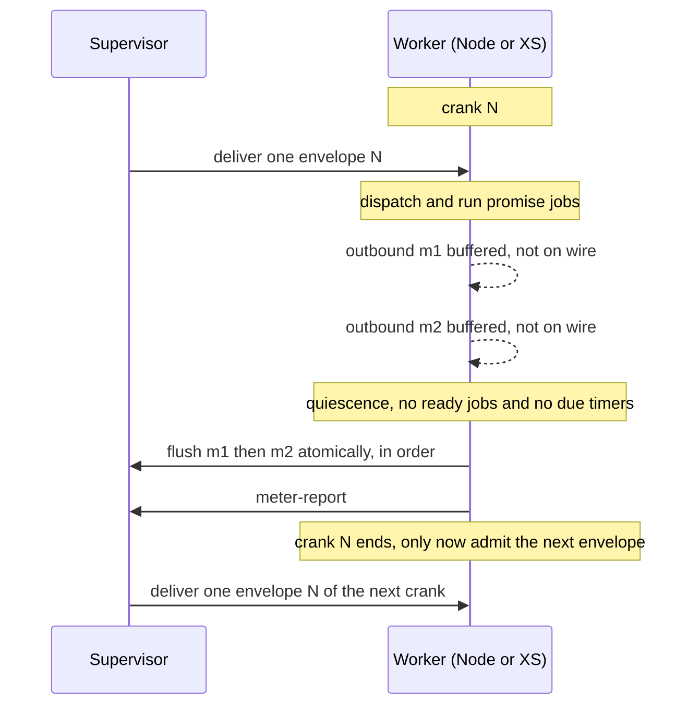

# Worker Quiescence Embargo: Hold Outbound Until a Crank Settles

| | |
|---|---|
| **Created** | 2026-08-14 |
| **Author** | kriskowal (prompted) |
| **Status** | Not Started |
| **Source** | Follow-up requested in the approving review of PR 124 (slot-machine wire protocol) |

## What is the Problem Being Solved? (the hangover inconsistency)

A worker processes an inbound delivery by dispatching it and then running the
promise reactions it queues. Today the worker both **emits outbound messages**
and **admits the next inbound message** before it has finished settling from the
previous delivery. The reviewer of PR 124 named this the "hangover
inconsistency": the worker acts on the world while still hung over from the
delivery it has not yet finished.

Two mechanisms produce it, one per supervisor:

- **Rust+XS supervisor.** The reactive pump in `rust/endo/xsnap/src/lib.rs` (the
  `run_supervised` crank loop) drains promise jobs and, on the same pass, uses
  `try_recv_raw_envelope` to fold **newly arrived inbound envelopes into the
  in-progress crank** (`got_envelope` then `continue`). Outbound frames are
  written to the wire the instant a promise reaction produces them: the XS
  worker's `sendEnvelope` calls the `sendRawFrame` host function immediately
  (`packages/daemon/src/bus-xs-core.js`). So delivery A's reactions, delivery A's
  outbound writes, and delivery B's dispatch all interleave inside one pump pass.
- **Node supervisor.** `makeMessageCapTP` in `packages/daemon/src/connection.js`
  dispatches with a bare `for await (const message of reader) dispatch(message)`
  loop and writes each outbound frame as CapTP produces it (the `writeTail`
  chain). There is no crank boundary at all: the next inbound message is
  dispatched whenever the reader yields, which is governed by Node's event loop,
  not by whether the worker has quiesced.

Because Node's event loop and XS's `fxMachineHasPendingJobs` pump drain their
reaction queues at different granularity relative to frame arrival, the same
logical inbound sequence yields, on the two supervisors:

- a **different outbound byte stream** (outbound frames from one delivery
  interleave differently with the next delivery's frames), and
- a **different intermediate worker state** at the moment each subsequent
  delivery is dispatched (some reactions have run under one supervisor and not
  the other).

That divergence directly undermines the property PR 124 exists to establish:
**byte-for-byte cross-supervisor parity** (the `@endo/slots` and `@endo/cbor`
byte fixtures, and the `sqlite-parity.test.js` Node-reads-what-Rust+XS-wrote
guarantee). It also makes replay and snapshot-resume nondeterministic, since the
outbound effect of a delivery is a function of wire timing rather than of worker
state alone.

### Relationship to the metering "output embargo" (which was rejected)

`daemon-xs-worker-metering.md` (Status: Complete) already considered, and
**rejected**, an "output embargo." That embargo buffered outbound so it could be
**discarded on a metering abort** (a rollback), and admission control removed the
need for it: reserve a full hard-limit crank of budget before delivery, so any
normally-completing crank is fully paid for and never needs its output rolled
back.

The quiescence embargo proposed here is a **different** buffer with a **different
purpose**. It buffers outbound so the batch can be **released atomically at
quiescence in emission order**, and it **never discards** on a normally
completing crank. It therefore does not reintroduce the rollback complexity the
metering design turned down (crank-boundary delimiters, reasoning about partial
effects). The two compose: admission control gates **inbound** on budget; the
quiescence embargo gates **outbound** on quiescence and enforces one delivery per
crank.

### Prior art

This is the SwingSet/liveslots crank discipline and the Ken protocol's
transactional-turn delivery (crank-buffering: buffer a turn's outbound, flush at
the turn boundary, exactly one delivery per crank). See the garden library
concept `ocap-kernel` (Ken protocol assessment: crank-buffering plus a
run-queue-as-commit-fence). The metering design already adopts the crank
vocabulary; this design restores the crank's **exactly-one-inbound** and
**flush-at-quiescence** contract that the current pump violates.

## Definitions

- **Quiescence.** The worker has drained its promise-job queue to empty with no
  pending reactions and no synchronously-due timers. XS already exposes the
  primitive: `Machine::quiesce` and the check-and-reset `fxMachineHasPendingJobs`
  in `rust/endo/xsnap/src/lib.rs`. Quiescence is bounded to **due-now** work:
  timers scheduled for the future do not hold the embargo open, or it would never
  open.
- **Crank.** The processing of **exactly one** inbound envelope plus all promise
  jobs it queues, run to quiescence, with **no other inbound envelope admitted**
  in between. This is verbatim the crank `daemon-xs-worker-metering.md` section
  "Crank lifecycle" already defines; the current pump violates the "exactly one"
  clause.
- **Outbound batch.** The ordered sequence of outbound envelopes a worker emits
  during one crank.

## Design: the embargo

One per-worker discipline, byte-for-byte identical across supervisors:

1. **Admit exactly one inbound envelope** (crank start). Do not read the next
   until this crank ends. Preserve the metering admission gate: deliver only when
   `budget >= hard_limit`.
2. **Buffer every outbound envelope** the worker emits into an ordered per-crank
   buffer. Do not write to the wire.
3. **Run to quiescence.** Drain promise jobs until `fxMachineHasPendingJobs`
   reports none (XS) or the microtask queue is empty (Node). Admit no inbound
   envelope during the drain.
4. **Flush the outbound batch** to the supervisor in emission order, as one
   atomic unit, at the quiescence boundary.
5. **Report the crank** (`meter-report`), then admit the next inbound envelope.

The invariant this buys: **the outbound batch is a pure function of (pre-crank
worker state, the single delivered envelope)**, independent of wire timing and
host scheduler. Both supervisors compute the identical batch, so the outbound
byte stream is identical.

**Where the buffer lives: worker-side**, at the emission seam, because quiescence
is a property only the worker machine can observe.

- **XS.** The `sendRawFrame` host callback appends the frame to a per-crank
  `Vec<Vec<u8>>` instead of writing it. The reactive pump flushes the vector to
  the transport after the promise-job drain completes and before it blocks for
  the next envelope.
- **Node.** Wrap the `send` passed to `makeCapTP` / `makeMessageSlots` so it
  appends to an array rather than chaining onto `writeTail`. Drive dispatch
  through a turn that flushes the array after the microtask queue empties, then
  reads the next inbound frame.

## Affected components

| Component | Change |
|---|---|
| `rust/endo/xsnap/src/lib.rs` (`run_supervised` pump, near the `'outer` crank loop) | Stop folding mid-crank inbound envelopes into the current crank: move the `try_recv_raw_envelope` drain to **after** the outbound flush so each crank consumes one envelope. Add the per-crank outbound buffer and flush it after the promise-job drain. |
| `rust/endo/xsnap/src/worker_io.rs` | `try_recv_raw_envelope` semantics and the `PipeTransport` stub (child-process workers return `None`, noted as a "quiesce deadlock" risk) must satisfy the response-admission carve-out below, or child-process XS workers need real non-blocking recv. |
| `packages/daemon/src/bus-xs-core.js` | `sendEnvelope` / `sendRawFrame` seam: buffer instead of writing; expose a flush the pump calls. |
| `packages/daemon/src/connection.js` (`makeMessageCapTP`) | Replace the bare `for await ... dispatch` loop with a turn barrier: dispatch one frame, await microtask-queue drain, flush the buffered outbound, then read the next frame. Buffer `send` instead of the immediate `writeTail` write. |
| `packages/daemon/src/bus-worker-node-raw.js`, `worker.js` | Node raw worker inherits the barrier through `makeMessageCapTP`. |
| `packages/slots` (`@endo/slots`: `makeMessageSlots`, `makeNetstringSlots`) and the daemon splices (`bus-manager-endor.js`, `bus-worker-xs.js`) | The slot-machine send path needs the same embargo so both wire protocols behave identically. This is the surface PR 124 adds; do not alter PR 124 itself, land the embargo as its own change. |
| `rust/endo/src/supervisor.rs` (`start_routing` / `route_message`, per-worker inbox) | The one-envelope-per-crank gate binds at the per-worker inbox admission, adjacent to the existing suspended-worker and admission-control skips. The supervisor's own `outbox_rx.drain()` batching must not reorder relative to a worker's crank flush. |

## Cross-supervisor parity implications

The behavior must stay **byte-for-byte consistent across supervisors**, which is
the whole motivation. State the invariant as a testable contract:

> For a fixed pre-state and a fixed ordered inbound sequence, the outbound stream
> of canonical CBOR frames a worker emits is identical under the Node and the
> Rust+XS supervisors.

Because slot-machine frames are canonical CBOR pinned byte-for-byte on both sides
(PR 124's `@endo/slots` and `@endo/cbor` fixtures), batch equality is checkable
at the byte level, in the same spirit as `sqlite-parity.test.js`.

The embargo must apply to the **CapTP path and the slot-machine path alike**. A
flag that enabled it for only one path would let the two wire protocols diverge,
which is the opposite of the goal. See Open questions on whether to gate it on
`ENDO_USE_SLOT_MACHINE` at all.

## Test / verification strategy

- **Reproduction of the current inconsistency.** A worker whose handler for
  delivery A emits two outbound sends across a reaction boundary, for example
  `E(x).m1(); Promise.resolve().then(() => E(x).m2())`, with delivery B already
  queued. Show that under the current pump the outbound interleaving of `m1`,
  `m2`, and B's dispatch differs between Node and XS (or run-to-run under load).
  This is the failing test the embargo must turn green.
- **Regression guarding the embargo.**
  - One envelope per crank: `meter-report` count equals delivery count.
  - Contiguity and order: a crank's outbound batch is emitted contiguously and in
    emission order, with no next-delivery frame interleaved.
  - Cross-supervisor byte equality: for a fixed inbound script, the outbound CBOR
    byte stream is identical under Node and Rust+XS (parity test alongside
    `sqlite-parity.test.js`).
- **Determinism / replay.** The same inbound script run twice yields identical
  outbound bytes.
- **Snapshot-resume.** A worker suspended at a quiescence boundary resumes and
  produces the identical continuation, tying into the existing suspend/resume
  infrastructure.

## Dependencies

| Design | Relationship |
|---|---|
| [daemon-xs-worker-metering](daemon-xs-worker-metering.md) (Complete) | Defines the crank and admission control. This design restores the crank's exactly-one-inbound and flush-at-quiescence contract and must **not** reintroduce the rejected rollback-embargo. Extends. |
| [worker-rust-xs](worker-rust-xs.md) | The XS worker bootstrap and pump this modifies. |
| [daemon-endor-architecture](daemon-endor-architecture.md) | Supervisor routing and per-worker inboxes. |
| slot-machine wire protocol (PR 124) | The parity target. `@endo/slots` plus `@endo/cbor` byte pinning make batch equality checkable. Do not alter PR 124; land the embargo separately. |

## Design Decisions

1. **Buffer worker-side, not supervisor-side.** Quiescence is a machine property
   observable only at the worker.
2. **Release at quiescence, never discard.** This is what distinguishes the
   quiescence embargo from the metering rollback-embargo, and what keeps it
   compatible with admission control.
3. **Exactly one envelope per crank.** Restores the crank contract
   `daemon-xs-worker-metering.md` already states; removes the mid-crank inbound
   folding in the XS pump and the crank-free dispatch loop on Node.
4. **Quiescence is bounded to due-now jobs and timers.** Future-scheduled timers
   do not hold the embargo open.

## Open Questions

- **Synchronous-call deadlock.** Does strict one-envelope-per-crank break the
  supervisor-mediated synchronous calls tracked in `pending_syncs`
  (`rust/endo/src/supervisor.rs`), where a caller cannot quiesce until it admits
  the **response** to its outstanding question? The `try_recv` non-blocking drain
  the current pump uses exists precisely to avoid this deadlock (`worker_io.rs`
  notes it). Proposed resolution to validate: admit a **response to an
  outstanding sync question** as a within-crank continuation (part of the same
  logical turn), while keeping **fresh deliveries** embargoed. Confirm against the
  four-verb slot-machine model (`deliver`/`resolve`/`drop`/`abort`) and CapTP's
  question/answer pairing before building.
- **Node quiescence primitive.** Is a microtask-empty barrier (a `queueMicrotask`
  fence, or a `setImmediate` turn) sufficient to match XS's
  `fxMachineHasPendingJobs` semantics exactly, or is an explicit reaction count
  needed? `HandledPromise` reactions versus native microtasks may drain in a
  different order.
- **Flag gating.** Should the embargo ship behind `ENDO_USE_SLOT_MACHINE`, or
  apply to the CapTP path from the start? Parity requires both paths to behave
  identically, so a per-path flag risks the very divergence this design removes.
- **Debug outbound.** Is `flush_debug_outbound` (breakpoint hits, step responses
  in the XS pump) part of the embargoed protocol batch or a side channel?
  Proposed: side channel, not embargoed, since it is diagnostics rather than
  protocol traffic.
- **Follow-up shape.** Given the synchronous-call deadlock risk, a **probe**
  (gap-revealing build) that attempts strict one-envelope-per-crank on the XS
  pump first, reporting where sync round-trips deadlock, is likely the safer next
  step than a direct build. To be filed once this design is reviewed.

## Prompt

> Please post a follow-up job to address "hangover inconsistency" by embargoing
> outbound messages until a worker quiesces after a message delivery.

(From the approving review of PR 124, the slot-machine wire protocol, by
kriskowal:
`https://github.com/endojs/endo-but-for-bots/pull/124#pullrequestreview-4941535335`.
That PR delivers the cross-supervisor SQLite and wire-protocol parity this
embargo protects. Do not alter PR 124; this is a separate follow-up.)
