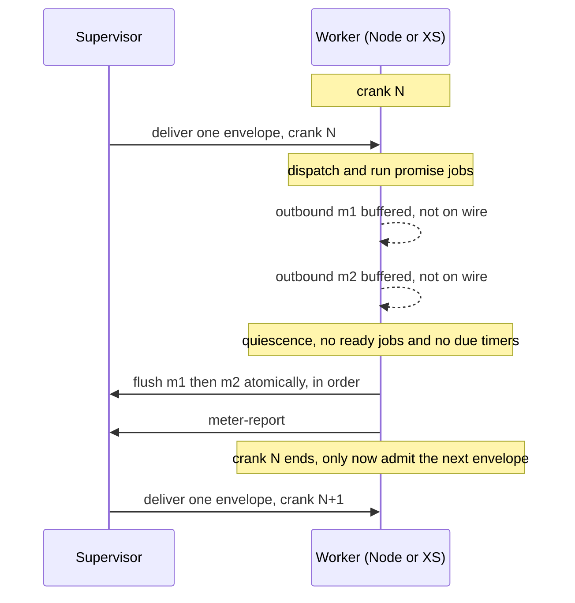

# Worker Quiescence Embargo: Hold Outbound Until a Crank Settles

| | |
|---|---|
| **Created** | 2026-08-14 |
| **Updated** | 2026-08-18 |
| **Author** | Kris Kowal (prompted) |
| **Status** | Not Started |
| **Source** | Follow-up requested in the approving review of [PR #124](https://github.com/endojs/endo-but-for-bots/pull/124) (slot-machine wire protocol) |

## Definitions

Defined up front because the sections below use these terms as load-bearing
vocabulary from their first sentence.

- **Supervisor.** The process that runs a worker machine: reads inbound envelopes,
  dispatches them into the worker, and carries the worker's outbound envelopes to
  the wire. There are two supervisors in play, one per worker runtime: the Rust+XS
  supervisor (`rust/endo/xsnap`) and the Node supervisor (`packages/daemon`).
  Workers are arranged in a process hierarchy, so a worker may have an ancestor
  (its parent supervisor's worker) and descendants.
- **Envelope.** The logical unit of the wire protocol: one of the four verbs
  `deliver` / `resolve` / `drop` / `abort`. "Message" in this document is a synonym
  for envelope, used only where the surrounding prose reads more naturally; there
  is no third kind of unit.
- **Frame.** The serialized, canonical-CBOR form of one envelope, as it appears on
  the wire. An envelope is buffered as its frame; "outbound batch" and "outbound
  frames" name the same bytes at the logical and serialized layers respectively.
- **Quiescence.** The worker has drained its promise-job queue to empty with no
  pending reactions and no synchronously-due timers. XS already exposes the
  primitive: `Machine::quiesce` and the check-and-reset `fxMachineHasPendingJobs`
  in `rust/endo/xsnap/src/lib.rs`. Quiescence is bounded to **due-now** work:
  timers scheduled for the future do not hold the embargo open, or it would never
  open.
- **Crank.** The processing of exactly one inbound envelope plus all promise jobs
  it queues, run to quiescence, with no other inbound envelope admitted in
  between. This extends the crank `daemon-xs-worker-metering.md` section "Crank
  lifecycle" already defines ("one inbound envelope plus all resulting promise
  jobs until quiescence"); the added emphasis is the "no other inbound envelope
  admitted in between" clause, which the current pump violates.
- **Outbound batch.** The ordered sequence of outbound frames a worker emits
  during one crank.

There are three classes of outbound frame, distinguished once here so later
sections need not re-derive the taxonomy: **ordinary outbound** (embargoed:
buffered and released at quiescence), **synchronous ancestor-calls** (Decision 5,
always exempt), and **debug frames** (Decision 8, always exempt).

## What is the Problem Being Solved? (the hangover inconsistency)

A worker processes an inbound delivery by dispatching it and then running the
promise reactions it queues. Today the worker both **emits outbound envelopes**
and **admits the next inbound envelope** before it has finished settling from the
previous delivery. The reviewer of [PR #124](https://github.com/endojs/endo-but-for-bots/pull/124)
named this the "hangover inconsistency": the worker acts on the world while still
hung over from the delivery it has not yet finished.

One consequence the design must clear early is the **synchronous-call hazard**: a
strict one-envelope-per-crank gate could deadlock if a worker, mid-crank, issues a
synchronous call whose reply it must receive before it can quiesce, and that reply
is itself an inbound envelope the gate refuses to admit. Decision 5 resolves this
by restricting synchronous calls to ancestors and exempting them from the
discipline; it is introduced here because the affected-components table below
depends on it.

Two mechanisms produce the hangover inconsistency, one per supervisor:

- **Rust+XS supervisor.** The reactive pump in `rust/endo/xsnap/src/lib.rs` (the
  `run_supervised` crank loop) drains promise jobs and, on the same pass, uses
  `try_recv_raw_envelope` to fold **newly arrived inbound envelopes into the
  in-progress crank** (`got_envelope` then `continue`). Outbound frames are
  written to the wire the instant a promise reaction produces them: the XS
  worker's `sendEnvelope` calls the `sendRawFrame` host function immediately
  (`packages/daemon/src/bus-xs-core.js`). So delivery A's reactions, delivery A's
  outbound writes, and delivery B's dispatch all interleave inside one pump pass.
- **Node supervisor.** `makeMessageCapTP` in `packages/daemon/src/connection.js`
  dispatches with a bare `for await (const message of reader) dispatch(message)`
  loop and writes each outbound frame as CapTP produces it (the `writeTail`
  chain). There is no crank boundary at all: the next inbound envelope is
  dispatched whenever the reader yields, which is governed by Node's event loop,
  not by whether the worker has quiesced.

Because Node's event loop and XS's `fxMachineHasPendingJobs` pump drain their
reaction queues at different granularity relative to frame arrival, the same
logical inbound sequence yields, on the two supervisors:

- a **different outbound byte stream** (outbound frames from one delivery
  interleave differently with the next delivery's frames), and
- a **different intermediate worker state** at the moment each subsequent
  delivery is dispatched (some reactions have run under one supervisor and not
  the other).

That divergence directly undermines the property [PR #124](https://github.com/endojs/endo-but-for-bots/pull/124)
exists to establish: **byte-for-byte cross-supervisor parity** (the `@endo/slots`
and `@endo/cbor` byte fixtures, and the `sqlite-parity.test.js`
Node-reads-what-Rust+XS-wrote guarantee). It also makes replay and snapshot-resume
nondeterministic, since the outbound effect of a delivery is a function of wire
timing rather than of worker state alone.

### Relationship to the metering "output embargo"

`daemon-xs-worker-metering.md` (Status: Complete) already considered an "output
embargo" whose sole job was to buffer outbound so it could be **discarded on a
metering abort** (a rollback-discard). Admission control removed the need for
**that rollback-discard mechanism**: reserve a full hard-limit crank of budget
before delivery, so any normally-completing crank is fully paid for and never
needs its output rolled back.

Admission control does **not**, however, remove the need for an outbound envelope
embargo. Admission control eliminates the problem of doing *unbudgeted* work; it
does not make a crank's outbound side effects atomic. An outbound embargo is
still required so that the **partial side effects of a failed delivery do not
escape**: if a crank aborts (a fault, a metering hard-stop) *before its flush
step runs*, the next attempt to run that crank must not begin in a world already
partially modified by the previous failed attempt. Holding outbound until
quiescence gives the crank all-or-nothing outbound semantics against a pre-flush
abort: the batch is released only once the crank has settled cleanly, so a failed
attempt leaves no observable outbound trace for a retry to race.

The scope of this failure-atomicity claim is a **pre-flush** abort. A crash
*during* an N-frame flush is out of scope for in-memory buffering: once the first
frame reaches the wire a prefix has escaped, and no amount of buffering makes the
multi-frame flush atomic against a crash mid-flush. The transactional-turn prior
art buys that stronger property with a durable checkpoint written before release
(see § Prior art), which this design does not adopt; the guarantee here is exactly
"an abort that occurs before the flush step leaves no outbound trace."

The quiescence embargo proposed here therefore serves **two** ends admission
control does not: it **releases the outbound batch atomically at quiescence in
emission order** (the cross-supervisor parity property below), and it **withholds
the partial side effects of a delivery until that delivery has completed** (the
pre-flush failure-atomicity property just described). It never discards on a
normally completing crank, so it does not reintroduce the rollback-discard
complexity the metering design turned down (crank-boundary delimiters purely for
discard). The two mechanisms compose: admission control gates **inbound** on
budget; the quiescence embargo gates **outbound** on quiescence, enforces one
delivery per crank, and confines a failed crank's effects.

The failure-atomicity mechanism is drop-with-the-crank, and it is symmetric across
the two supervisors: because the per-crank buffer is never flushed until
quiescence, a crank that aborts before its flush has written nothing to the wire,
so there is no partial trace to clear from the transport. What remains is the
in-memory buffer, which is per-crank state owned by the crank, discarded when the
crank unwinds. On the Rust+XS side that is the pre-existing
terminate-and-restore-from-snapshot path on a metering abort
(`daemon-xs-worker-metering.md`: the machine state after an abort is unreliable, so
the worker is re-created from its last snapshot), which takes the still-unflushed
buffer with it. On the Node side the buffer and the flush live in different turns
(Decision 6 puts the flush in a later `setImmediate` turn), so lexical unwinding of
the dispatch turn does **not** by itself guarantee the flush is skipped. The crank
therefore carries an explicit **per-crank abort flag**: a dispatch or reaction that
throws sets the flag, and the flush step consults it and drops the buffer instead
of writing it. The abort decision and the commit decision share one observable
(the flag) rather than relying on a stack extent that Decision 6 has already
broken. Either way a retry starts with no buffered outbound and cannot observe or
re-emit any part of a failed attempt.

### Prior art

This is the SwingSet/liveslots crank discipline (Agoric's ocap kernel, where a
"crank" is one delivery run to completion before the next is dispatched) and the
Ken protocol's transactional-turn delivery (a fault-tolerant distributed-messaging
protocol whose turns are transactional: buffer a turn's outbound, flush at the
turn boundary, exactly one delivery per crank). Ken achieves atomicity against a
crash *during* the flush by writing a durable checkpoint before it releases the
turn's outbound; this design deliberately does not adopt that stronger, heavier
guarantee (see the pre-flush scoping above). The metering design already adopts the
crank vocabulary; this design restores the crank's **exactly-one-inbound** and
**flush-at-quiescence** contract that the current pump violates.

## Design: the Embargo

One per-worker discipline, byte-for-byte identical across supervisors when the
embargo is enabled on both (see § Cross-supervisor parity implications for the
configuration precondition):

1. **Admit exactly one inbound envelope** (crank start). Do not read the next
   until this crank ends. Preserve the metering admission gate: deliver only when
   `budget >= hard_limit`.
2. **Buffer every outbound envelope** the worker emits into an ordered per-crank
   buffer. Do not write to the wire.
3. **Run to quiescence.** Drain promise jobs until `fxMachineHasPendingJobs`
   reports none (XS) or the `setImmediate` turn fires after the microtask queue
   drains (Node, Decision 6). Admit no inbound envelope during the drain.
4. **Flush the outbound batch** to the supervisor in emission order, as one
   atomic unit, at the quiescence boundary, unless the per-crank abort flag is
   set, in which case drop the buffer (see § failure-atomicity above).
5. **Report the crank** (`meter-report`), then admit the next inbound envelope.

The invariant this buys, for a worker that schedules **no timers**: **the outbound
batch is a pure function of (pre-crank worker state, the single delivered
envelope)**, independent of wire timing and host scheduler. Both supervisors
compute the identical batch, so the outbound byte stream is identical. For a worker
that *does* schedule timers, whether a timer is due at drain time is a function of
the wall clock, so the batch is a function of (pre-crank state, envelope,
wall-clock-at-drain); the byte-parity guarantee then holds only under a
deterministic or virtualized clock shared by the two supervisors. Decision 4
records how timer-originated outbound is placed; the parity contract below states
the timer-free precondition explicitly.

**Where the buffer lives: worker-side**, at the emission seam, because quiescence
is a property only the worker machine can observe.

- **XS.** The `sendRawFrame` host callback appends the frame to a per-crank
  `Vec<Vec<u8>>` instead of writing it. The reactive pump flushes the vector to
  the transport after the promise-job drain completes and before it blocks for
  the next envelope, consulting the abort flag first.
- **Node.** Wrap the `send` passed to `makeCapTP` / `makeMessageSlots` so it
  appends to an array rather than chaining onto `writeTail`. Drive dispatch
  through a turn that flushes the array in a `setImmediate` turn after the
  microtask queue empties (consulting the abort flag), then reads the next inbound
  frame.

## Affected components

| Component | Change |
|---|---|
| `rust/endo/xsnap/src/lib.rs` (`run_supervised` pump, near the `'outer` crank loop) | Stop folding mid-crank inbound envelopes into the current crank: move the `try_recv_raw_envelope` drain to **after** the outbound flush so each crank consumes one envelope. Add the per-crank outbound buffer and flush it after the promise-job drain. Read the embargo flag from the worker's spawn/control envelope (see § Cross-supervisor parity implications). |
| `rust/endo/xsnap/src/worker_io.rs` | Confirm the synchronous-ancestor-call reply path for child-process XS workers so strict one-envelope-per-crank cannot deadlock on a synchronous response: `try_recv_raw_envelope` semantics and the `PipeTransport` stub (child-process workers return `None`, noted in-code as a "quiesce deadlock" risk). The synchronous-ancestor-call exemption (Decision 5) is what keeps strict one-envelope-per-crank from deadlocking on a synchronous response here; confirming that response path, or giving those workers real non-blocking recv, is residual build validation. |
| `packages/daemon/src/bus-xs-core.js` | `sendEnvelope` / `sendRawFrame` seam: buffer instead of writing; expose a flush the pump calls and a per-crank abort flag it consults. |
| `packages/daemon/src/connection.js` (`makeMessageCapTP`) | Replace the bare `for await ... dispatch` loop with a turn barrier: dispatch one frame, await the `setImmediate` drain, flush the buffered outbound (unless aborted), then read the next frame. Buffer `send` instead of the immediate `writeTail` write. Add the embargo as its **own** pump parameter, not a member of the `capTpOptions` bag (see § Cross-supervisor parity implications). |
| `packages/daemon/src/bus-worker-node-raw.js`, `worker.js` | Node raw worker inherits the barrier through `makeMessageCapTP`. |
| `packages/slots` (`@endo/slots`: `makeMessageSlots`, `makeNetstringSlots`) and the daemon splices (`bus-manager-endor.js`, `bus-worker-xs.js`) | Thread the same embargo option into the slot-machine session (`makeMessageSlots` takes no options bag today, so this adds one) so both wire protocols behave identically. This is the surface [PR #124](https://github.com/endojs/endo-but-for-bots/pull/124) adds; do not alter [PR #124](https://github.com/endojs/endo-but-for-bots/pull/124) itself; instead, land the embargo as its own change once PR #124 has merged (see § Dependencies for the blocking order). |
| `rust/endo/src/supervisor.rs` (`start_routing` / `route_message`, per-worker inbox) | The one-envelope-per-crank gate binds at the per-worker inbox admission, adjacent to the existing suspended-worker and admission-control skips. The supervisor's own `outbox_rx.drain()` batching must not reorder relative to a worker's crank flush. |

## Cross-supervisor parity implications

The behavior must stay **byte-for-byte consistent across supervisors** when both
are configured with the embargo on, which is the whole motivation. State the
invariant as a testable contract:

> For a fixed pre-state, a fixed ordered inbound sequence, and the embargo enabled
> on both supervisors, the outbound stream of canonical CBOR frames a
> timer-free worker emits is identical under the Node and the Rust+XS supervisors.
> (A worker that schedules timers additionally requires a shared deterministic
> clock; see Decision 4.)

Because slot-machine frames are canonical CBOR pinned byte-for-byte on both sides
([PR #124](https://github.com/endojs/endo-but-for-bots/pull/124)'s `@endo/slots`
and `@endo/cbor` fixtures), batch equality is checkable at the byte level, in the
same spirit as `sqlite-parity.test.js`.

The embargo behaves **identically across the CapTP path and the slot-machine
path** when enabled. The design separates two independent things, only the second
of which the configuration option controls:

- **Crank exclusivity** (exactly one inbound envelope admitted per crank, no
  mid-crank folding) is **unconditional and never option-gated.** It restores the
  crank contract `daemon-xs-worker-metering.md` already mandates, so the option
  cannot turn it off. Note that crank exclusivity governs *inbound admission* and
  is separable from *outbound* buffering: a supervisor can refuse the next inbound
  envelope until quiescence while still emitting outbound eagerly.
- **The outbound-buffering delay** (holding the batch until quiescence, then
  flushing it in one contiguous unit) is what the option controls.

### The configuration option: what it is, its default, and what "off" forfeits

The maintainer's request was precise: "It would be good for this option to
**exist** in all captp variants including ocapn, slot machine, and our legacy
captp," on the grounds that "it's not clear that the delay this introduces is
always better than timely emission." The option is therefore
`bufferOutboundUntilQuiescence`, named for exactly what it gates (the buffering
delay), not the whole embargo discipline, since crank exclusivity is not behind it.

- **Default: on.** The buffering delay is the default so that parity and pre-flush
  failure-atomicity hold out of the box. An earlier draft called the delay "a
  latency tradeoff rather than a correctness requirement"; that was wrong. The
  buffering carries **both** the cross-supervisor byte-parity property and the
  pre-flush failure-atomicity property, and both are correctness properties. What
  the option offers is not "correctness versus latency" but an explicit,
  operator-visible decision to **forfeit both** in a deployment that needs neither.
- **What "off" forfeits.** With `bufferOutboundUntilQuiescence: false`, outbound is
  emitted timely (mid-crank), so both cross-supervisor byte-parity and pre-flush
  failure-atomicity are lost. Turning it off is safe only for a **single-supervisor
  deployment** that does not compare byte streams across runtimes and that accepts
  a failed crank's partial outbound escaping. Crank exclusivity still holds.
- **"Exist in all variants" does not mean "one global value."** The maintainer
  asked that the option *exist* in each variant, not that all variants carry the
  same value at runtime. There is no single-source mechanism that forces
  uniformity, and the earlier claim that the flag "rides the `capTpOptions` bag
  ... so all three variants read one spelling from one place" was doubly wrong:
  `capTpOptions` is spread verbatim into `makeCapTP`
  (`packages/daemon/src/connection.js:164`), where every member is a genuine
  `@endo/captp` option, so an embargo key would be forwarded as an unknown option
  into an upstream package; and `capTpOptions` reaches neither the slot-machine
  session (`makeMessageSlots` has no options bag) nor the Rust+XS supervisor (which
  reads no JS object at all). The correct siting is per-variant, each in that
  variant's own configuration surface:
  - **Node CapTP / OCapN / slot machine (JS).** A dedicated pump parameter on
    `makeMessageCapTP` and a matching option threaded into `makeMessageSlots`,
    following the in-repo precedent of `capTpConnectionRegistrar`
    (`connection.js:103`), which is a separate parameter precisely because it is
    not a CapTP option. The embargo is a property of the reader/dispatch pump, not
    of CapTP, so it does not belong in `capTpOptions`.
  - **Rust+XS supervisor.** A field on the existing control-envelope surface that
    already crosses the language boundary: the `meter-config` control envelope,
    CBOR `{"hard_limit": u64}` decoded at `rust/endo/xsnap/src/lib.rs:1285`, gains
    `{"quiescence_embargo": bool}` alongside it.
- **The single value-source and who reconciles.** The authoritative value is set
  once, per worker, by the supervisor at **spawn time**, and each runtime derives
  its local spelling from that one decision: the Node pump parameter and the Rust
  control-envelope field are both written from the same per-worker spawn
  configuration, so the two are set together rather than by independent
  per-connection discipline. A parity test configures both sides on; a
  single-supervisor deployment sets whichever value it wants. The design does not,
  and per the maintainer need not, enforce a global constant. It guarantees the
  option exists in every variant and is derived from one per-worker source, and it
  states plainly that byte-parity is claimed only across two supervisors that were
  spawned with the same value.

Its scope is stated once here and cross-referenced elsewhere: **it buffers ordinary
outbound only; synchronous ancestor-calls (Decision 5) and debug frames
(Decision 8) are always exempt, independent of the option's value.**

## Test / verification strategy

- **Reproduction of the current inconsistency.** Set up a worker whose handler
  for delivery A emits two outbound sends across a reaction boundary, for example
  `E(x).m1(); Promise.resolve().then(() => E(x).m2())`, with delivery B already
  queued, and drive the two supervisors with an **identical scripted scheduler**
  so the reproduction is deterministic rather than load-dependent. Show that under
  the current pump the outbound interleaving of `m1`, `m2`, and B's dispatch
  differs between Node and XS. This is the failing test the embargo must turn
  green.
- **Regression guarding the embargo.**
  - One envelope per crank: `meter-report` count equals delivery count.
  - Contiguity and order: a crank's outbound batch is emitted contiguously and in
    emission order, with no next-delivery frame interleaved.
  - Cross-supervisor byte equality: for a fixed inbound script and the embargo on
    both supervisors, the outbound CBOR byte stream is identical under Node and
    Rust+XS (parity test alongside `sqlite-parity.test.js`).
  - Failure-atomicity (pre-flush): a crank that aborts before its flush with a
    buffered-but-unflushed outbound batch writes nothing to the wire, and the next
    attempt on that crank does not observe or re-emit any part of the aborted
    batch. Exercise both the Rust+XS terminate-and-restore-from-snapshot path and
    the Node abort-flag-drops-the-buffer path.
  - Option off: with `bufferOutboundUntilQuiescence: false`, outbound is emitted
    timely and crank exclusivity still holds (one envelope per crank, verified by
    `meter-report` count) even though byte-parity and failure-atomicity are not
    claimed.
- **Liveness.** A worker that never quiesces admits no inbound and flushes nothing.
  On XS this is bounded by the metering hard-limit abort; the Node supervisor has
  no metering bound, so this test asserts the Node side either inherits an
  equivalent bound or documents the known liveness gap explicitly rather than
  hanging silently.
- **Determinism / replay.** The same inbound script run twice under the scripted
  scheduler yields identical outbound bytes.
- **Snapshot-resume.** A worker suspended at a quiescence boundary resumes and
  produces the identical continuation, tying into the existing suspend/resume
  infrastructure.

## Dependencies

| Design | Relationship |
|---|---|
| [daemon-xs-worker-metering](daemon-xs-worker-metering.md) (Complete) | Defines the crank and admission control. This design restores the crank's exactly-one-inbound and flush-at-quiescence contract and must **not** reintroduce the rejected rollback-discard embargo. Extends. |
| [worker-rust-xs](worker-rust-xs.md) | The XS worker bootstrap and pump this modifies. |
| [daemon-endor-architecture](daemon-endor-architecture.md) | Supervisor routing and per-worker inboxes. |
| slot-machine wire protocol ([PR #124](https://github.com/endojs/endo-but-for-bots/pull/124)) | The parity target. `@endo/slots` plus `@endo/cbor` byte pinning make batch equality checkable. This is a **blocking** order, not merely a separation: the `packages/slots` and `bus-manager-endor.js` rows above name files PR #124 introduces, so the embargo lands only after PR #124 merges. Do not alter PR #124. |

## Design Decisions

1. **Buffer worker-side, not supervisor-side.** Quiescence is a machine property
   observable only at the worker.
2. **Release at quiescence, never discard on a normally completing crank.** This
   is what distinguishes the quiescence embargo from the metering rollback-discard
   embargo, and what keeps it compatible with admission control. It is still needed
   *alongside* admission control: admission control eliminates unbudgeted work but
   not partial-effect escape, so the embargo confines the outbound side effects of
   a **failed** crank (a pre-flush abort) until a clean attempt settles (see
   § Relationship to the metering "output embargo"). The buffer *is* dropped when a
   crank aborts before its flush; "never discard" applies only to cranks that
   complete normally.
3. **Exactly one envelope per crank.** Restores the crank contract
   `daemon-xs-worker-metering.md` already states; removes the mid-crank inbound
   folding in the XS pump and the crank-free dispatch loop on Node. Unconditional,
   never behind the configuration option (Decision 7).
4. **Quiescence is bounded to due-now jobs and timers.** Future-scheduled timers
   do not hold the embargo open. A due-now timer that fires **during** a crank's
   drain is not its own crank and does not write straight to the wire: its outbound
   joins the current crank's batch. A due-now timer that fires **between** cranks,
   when no drain is open, **starts its own crank** (an envelope-free crank whose
   input is the timer): it buffers its outbound and flushes at its own quiescence,
   so it still cannot write mid-nothing straight to the wire. Because timer
   due-ness is wall-clock dependent, the byte-parity claim (§ Design, § parity)
   holds unconditionally only for timer-free workers; a timer-using worker requires
   a shared deterministic clock for the two supervisors to agree.
5. **Synchronous messages are exempt from the embargo discipline.** A synchronous
   message may only call an **ancestor in the process hierarchy**, and the ancestor
   (parent) sees the call as **asynchronous** and applies the embargo protocol to
   it normally. Because the exemption is confined to the ancestor direction, it
   cannot form the cross-worker cycle that would deadlock the one-envelope-per-crank
   gate. The synchronous *reply* frame is likewise exempt: it is not buffered until
   the ancestor's own quiescence, so a synchronous caller is not blocked for the
   callee's whole crank drain. Exempting the reply is what keeps the caller's own
   in-flight crank able to quiesce (see the resolved sync-call question below).
6. **Node emulates XS job draining with `setImmediate`.** The Node quiescence
   barrier targets XS's "drain all pending jobs" semantics; a `setImmediate` turn
   is the **working hypothesis** for emulating that boundary on Node, preferred
   over a bare microtask-empty fence because it fires after the microtask queue
   drains. This is a proposed approximation, not an established in-repo precedent
   (the repo has no existing `setImmediate` job-drain to cite), and it carries the
   residual validation recorded below. Because the flush lives in this later turn,
   failure-atomicity relies on the per-crank abort flag (Decision 2 / § failure-
   atomicity), not on lexical unwinding of the dispatch turn.
7. **The outbound-buffering delay is a configuration option that exists in every
   CapTP variant; crank exclusivity is not option-gated.** The delay buffering
   introduces is not universally better than timely emission, so *that delay* is a
   configuration option (`bufferOutboundUntilQuiescence`, default on), while
   exactly-one-envelope-per-crank (Decision 3) holds unconditionally. Per the
   maintainer's request the option must **exist** in all CapTP variants (OCapN, the
   slot machine, and the legacy CapTP), each spelled in that variant's own
   configuration surface and derived from one per-worker spawn value; this is not a
   requirement that all variants carry the same value at runtime, and byte-parity is
   claimed only across two supervisors spawned with the option on. Turning it off
   forfeits both byte-parity and pre-flush failure-atomicity (§ The configuration
   option). Scope: the option gates ordinary outbound only; synchronous
   ancestor-calls (Decision 5) and debug frames (Decision 8) are exempt regardless
   of its value.
8. **Debug outbound is a side channel, not embargoed.** `flush_debug_outbound`
   (breakpoint hits, step responses) is diagnostics, not protocol traffic, so it
   is exempt from the embargoed batch.

## Resolved in review

The maintainer review of this design (kriskowal,
[PR #989](https://github.com/endojs/endo-but-for-bots/pull/989)) settled the open
questions this design raised. The resolutions are recorded here, each with the
residual validation it carries into the build.

- **Synchronous-call deadlock, resolved: sync messages are special-cased out of
  the discipline.** Synchronous messages are **not** subject to the embargo. A
  synchronous message may only call an **ancestor in the process hierarchy**; the
  parent receiving it treats it as an **asynchronous** message and respects the
  embargo protocol, and the synchronous reply is exempt from buffering so the caller
  does not block for the callee's whole crank (Decision 5). This is stronger and
  simpler than the earlier "within-crank continuation" carve-out: the ancestor-only
  restriction is what keeps the exemption from creating a cross-worker cycle, so
  strict one-envelope-per-crank does not deadlock on `pending_syncs`
  (`rust/endo/src/supervisor.rs`). *Residual validation:* confirm the
  child-to-ancestor synchronous path and the parent's asynchronous/embargoed view of
  it against the four-verb slot-machine model (`deliver`/`resolve`/`drop`/`abort`)
  and CapTP's question/answer pairing during the build.
- **Node quiescence primitive, resolved: `setImmediate`.** The target is XS's
  "drain all pending jobs" semantics; `setImmediate` is the working hypothesis for
  emulating that boundary on Node, preferred over a bare microtask-empty fence
  because it fires after the microtask queue drains. It is a proposed
  approximation, not an in-repo precedent. *Residual validation:* verify that
  `HandledPromise` reactions and native microtasks both settle before the
  `setImmediate` turn fires, since they may drain in a different order.
- **Option gating, resolved: the option exists in every CapTP variant, default
  on.** The buffering delay ships as `bufferOutboundUntilQuiescence`, default on,
  because the delay it introduces is not universally preferable to timely emission.
  Per the maintainer the option must **exist** across all CapTP variants (OCapN, the
  slot machine, and the legacy CapTP); it is not required to carry the same value at
  runtime, and there is no single-source uniformity mechanism (the earlier
  `capTpOptions` "one spelling" claim was withdrawn as unreachable). Each variant
  spells the option in its own configuration surface, derived from one per-worker
  spawn value; byte-parity and pre-flush failure-atomicity are claimed only with the
  option on, and turning it off forfeits both. Crank exclusivity is not behind the
  option. See § The configuration option for the full statement. *Residual
  validation:* confirm the Rust control-envelope field and the Node pump parameter
  are written from a single per-worker spawn decision during the build.
- **Debug outbound, resolved: side channel.** `flush_debug_outbound` is
  diagnostics, not protocol traffic, so it is **not** part of the embargoed batch
  (Decision 8).
- **Follow-up shape, resolved: probe first.** A **probe** (gap-revealing build)
  that attempts strict one-envelope-per-crank on the XS pump first, reporting
  where sync round-trips deadlock, is the agreed next step over a direct build,
  to be filed once this design lands.

## Prompt

> Please post a follow-up job to address "hangover inconsistency" by embargoing
> outbound messages until a worker quiesces after a message delivery.

(From the approving review of [PR #124](https://github.com/endojs/endo-but-for-bots/pull/124),
the slot-machine wire protocol, by kriskowal:
`https://github.com/endojs/endo-but-for-bots/pull/124#pullrequestreview-4941535335`.
That PR delivers the cross-supervisor SQLite and wire-protocol parity this
embargo protects. Do not alter PR #124; this is a separate follow-up.)
