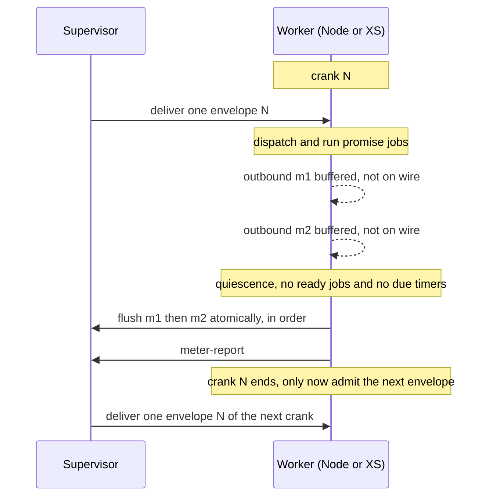

# Worker Quiescence Embargo: Hold Outbound Until a Crank Settles

| | |
|---|---|
| **Created** | 2026-08-14 |
| **Author** | kriskowal (prompted) |
| **Status** | Not Started |
| **Source** | Follow-up requested in the approving review of PR 124 (slot-machine wire protocol) |

## Definitions

Defined up front because the sections below use these terms as load-bearing
vocabulary from their first sentence.

- **Supervisor.** The process that runs a worker machine: reads inbound envelopes,
  dispatches them into the worker, and carries the worker's outbound envelopes to
  the wire. There are two supervisors in play, one per worker runtime: the Rust+XS
  supervisor (`rust/endo/xsnap`) and the Node supervisor (`packages/daemon`).
  Workers are arranged in a process hierarchy, so a worker may have an ancestor
  (its parent supervisor's worker) and descendants.
- **Quiescence.** The worker has drained its promise-job queue to empty with no
  pending reactions and no synchronously-due timers. XS already exposes the
  primitive: `Machine::quiesce` and the check-and-reset `fxMachineHasPendingJobs`
  in `rust/endo/xsnap/src/lib.rs`. Quiescence is bounded to **due-now** work:
  timers scheduled for the future do not hold the embargo open, or it would never
  open.
- **Crank.** The processing of **exactly one** inbound envelope plus all promise
  jobs it queues, run to quiescence, with **no other inbound envelope admitted**
  in between. This is verbatim the crank `daemon-xs-worker-metering.md` section
  "Crank lifecycle" already defines; the current pump violates the "exactly one"
  clause.
- **Outbound batch.** The ordered sequence of outbound envelopes a worker emits
  during one crank.

## What is the problem being solved? (the hangover inconsistency)

A worker processes an inbound delivery by dispatching it and then running the
promise reactions it queues. Today the worker both **emits outbound messages**
and **admits the next inbound message** before it has finished settling from the
previous delivery. The reviewer of PR 124 named this the "hangover
inconsistency": the worker acts on the world while still hung over from the
delivery it has not yet finished.

Two mechanisms produce it, one per supervisor:

- **Rust+XS supervisor.** The reactive pump in `rust/endo/xsnap/src/lib.rs` (the
  `run_supervised` crank loop) drains promise jobs and, on the same pass, uses
  `try_recv_raw_envelope` to fold **newly arrived inbound envelopes into the
  in-progress crank** (`got_envelope` then `continue`). Outbound frames are
  written to the wire the instant a promise reaction produces them: the XS
  worker's `sendEnvelope` calls the `sendRawFrame` host function immediately
  (`packages/daemon/src/bus-xs-core.js`). So delivery A's reactions, delivery A's
  outbound writes, and delivery B's dispatch all interleave inside one pump pass.
- **Node supervisor.** `makeMessageCapTP` in `packages/daemon/src/connection.js`
  dispatches with a bare `for await (const message of reader) dispatch(message)`
  loop and writes each outbound frame as CapTP produces it (the `writeTail`
  chain). There is no crank boundary at all: the next inbound message is
  dispatched whenever the reader yields, which is governed by Node's event loop,
  not by whether the worker has quiesced.

Because Node's event loop and XS's `fxMachineHasPendingJobs` pump drain their
reaction queues at different granularity relative to frame arrival, the same
logical inbound sequence yields, on the two supervisors:

- a **different outbound byte stream** (outbound frames from one delivery
  interleave differently with the next delivery's frames), and
- a **different intermediate worker state** at the moment each subsequent
  delivery is dispatched (some reactions have run under one supervisor and not
  the other).

That divergence directly undermines the property PR 124 exists to establish:
**byte-for-byte cross-supervisor parity** (the `@endo/slots` and `@endo/cbor`
byte fixtures, and the `sqlite-parity.test.js` Node-reads-what-Rust+XS-wrote
guarantee). It also makes replay and snapshot-resume nondeterministic, since the
outbound effect of a delivery is a function of wire timing rather than of worker
state alone.

### Relationship to the metering "output embargo"

`daemon-xs-worker-metering.md` (Status: Complete) already considered an "output
embargo" whose sole job was to buffer outbound so it could be **discarded on a
metering abort** (a rollback). Admission control removed the need for **that
rollback-discard mechanism**: reserve a full hard-limit crank of budget before
delivery, so any normally-completing crank is fully paid for and never needs its
output rolled back.

Admission control does **not**, however, remove the need for an outbound message
embargo. Admission control eliminates the problem of doing *unbudgeted* work; it
does not make a crank's outbound side effects atomic. An outbound embargo is
still required so that the **partial side effects of a failed delivery do not
escape**: if a crank aborts (a fault, a metering hard-stop, a supervisor crash
mid-flush), the next attempt to run that crank must not begin in a world already
partially modified by the previous failed attempt. Holding outbound until
quiescence gives the crank all-or-nothing outbound semantics: the batch is
released only once the crank has settled cleanly, so a failed attempt leaves no
observable outbound trace for a retry to race.

The quiescence embargo proposed here therefore serves **two** ends that
admission control does not: it **releases the outbound batch atomically at
quiescence in emission order** (the cross-supervisor parity property below), and
it **withholds the partial side effects of a delivery until that delivery has
completed** (the failure-atomicity property just described). It **never
discards** on a normally completing crank, so it does not reintroduce the
rollback complexity the metering design turned down (crank-boundary delimiters
purely for discard). The two mechanisms compose: admission control gates
**inbound** on budget; the quiescence embargo gates **outbound** on quiescence,
enforces one delivery per crank, and confines a failed crank's effects.

The failure-atomicity mechanism is drop-with-the-crank, and it is symmetric across
the two supervisors: because the per-crank buffer is never flushed until
quiescence, an aborted crank has written nothing to the wire, so there is no
partial trace to clear from the transport. What remains is the in-memory buffer,
which is per-crank state owned by the crank, discarded when the crank unwinds. On
the Rust+XS side that is the pre-existing terminate-and-restore-from-snapshot path
on a metering abort (`daemon-xs-worker-metering.md`: the machine state after an
abort is unreliable, so the worker is re-created from its last snapshot), which
takes the still-unflushed buffer with it. On the Node side the buffer is the
dispatch turn's local array; a dispatch that throws unwinds the turn before its
flush step runs, so the array is released and the retry begins with an empty
buffer. Either way a retry starts with no buffered outbound and cannot observe or
re-emit any part of a failed attempt.

### Prior art

This is the SwingSet/liveslots crank discipline (Agoric's ocap kernel, where a
"crank" is one delivery run to completion before the next is dispatched) and the
Ken protocol's transactional-turn delivery (a fault-tolerant distributed-messaging
protocol whose turns are transactional: buffer a turn's outbound, flush at the
turn boundary, exactly one delivery per crank). See the garden library concept
`ocap-kernel` (an in-garden assessment of the Ken protocol: crank-buffering plus a
run-queue-as-commit-fence). The metering design already adopts the crank
vocabulary; this design restores the crank's **exactly-one-inbound** and
**flush-at-quiescence** contract that the current pump violates.

## Design: the embargo

One per-worker discipline, byte-for-byte identical across supervisors:

1. **Admit exactly one inbound envelope** (crank start). Do not read the next
   until this crank ends. Preserve the metering admission gate: deliver only when
   `budget >= hard_limit`.
2. **Buffer every outbound envelope** the worker emits into an ordered per-crank
   buffer. Do not write to the wire.
3. **Run to quiescence.** Drain promise jobs until `fxMachineHasPendingJobs`
   reports none (XS) or the microtask queue is empty (Node). Admit no inbound
   envelope during the drain.
4. **Flush the outbound batch** to the supervisor in emission order, as one
   atomic unit, at the quiescence boundary.
5. **Report the crank** (`meter-report`), then admit the next inbound envelope.

The invariant this buys: **the outbound batch is a pure function of (pre-crank
worker state, the single delivered envelope)**, independent of wire timing and
host scheduler. Both supervisors compute the identical batch, so the outbound
byte stream is identical.

**Where the buffer lives: worker-side**, at the emission seam, because quiescence
is a property only the worker machine can observe.

- **XS.** The `sendRawFrame` host callback appends the frame to a per-crank
  `Vec<Vec<u8>>` instead of writing it. The reactive pump flushes the vector to
  the transport after the promise-job drain completes and before it blocks for
  the next envelope.
- **Node.** Wrap the `send` passed to `makeCapTP` / `makeMessageSlots` so it
  appends to an array rather than chaining onto `writeTail`. Drive dispatch
  through a turn that flushes the array after the microtask queue empties, then
  reads the next inbound frame.

## Affected components

| Component | Change |
|---|---|
| `rust/endo/xsnap/src/lib.rs` (`run_supervised` pump, near the `'outer` crank loop) | Stop folding mid-crank inbound envelopes into the current crank: move the `try_recv_raw_envelope` drain to **after** the outbound flush so each crank consumes one envelope. Add the per-crank outbound buffer and flush it after the promise-job drain. |
| `rust/endo/xsnap/src/worker_io.rs` | `try_recv_raw_envelope` semantics and the `PipeTransport` stub (child-process workers return `None`, noted in-code as a "quiesce deadlock" risk). The synchronous-ancestor-call exemption (Design Decision 5, restated under "Resolved in review", synchronous-call deadlock) is what keeps strict one-envelope-per-crank from deadlocking on a synchronous response here; confirming that response path for child-process XS workers, or giving them real non-blocking recv, is residual build validation. |
| `packages/daemon/src/bus-xs-core.js` | `sendEnvelope` / `sendRawFrame` seam: buffer instead of writing; expose a flush the pump calls. |
| `packages/daemon/src/connection.js` (`makeMessageCapTP`) | Replace the bare `for await ... dispatch` loop with a turn barrier: dispatch one frame, await microtask-queue drain, flush the buffered outbound, then read the next frame. Buffer `send` instead of the immediate `writeTail` write. |
| `packages/daemon/src/bus-worker-node-raw.js`, `worker.js` | Node raw worker inherits the barrier through `makeMessageCapTP`. |
| `packages/slots` (`@endo/slots`: `makeMessageSlots`, `makeNetstringSlots`) and the daemon splices (`bus-manager-endor.js`, `bus-worker-xs.js`) | The slot-machine send path needs the same embargo so both wire protocols behave identically. This is the surface PR 124 adds; do not alter PR 124 itself, land the embargo as its own change. |
| `rust/endo/src/supervisor.rs` (`start_routing` / `route_message`, per-worker inbox) | The one-envelope-per-crank gate binds at the per-worker inbox admission, adjacent to the existing suspended-worker and admission-control skips. The supervisor's own `outbox_rx.drain()` batching must not reorder relative to a worker's crank flush. |

## Cross-supervisor parity implications

The behavior must stay **byte-for-byte consistent across supervisors**, which is
the whole motivation. State the invariant as a testable contract:

> For a fixed pre-state and a fixed ordered inbound sequence, the outbound stream
> of canonical CBOR frames a worker emits is identical under the Node and the
> Rust+XS supervisors.

Because slot-machine frames are canonical CBOR pinned byte-for-byte on both sides
(PR 124's `@endo/slots` and `@endo/cbor` fixtures), batch equality is checkable
at the byte level, in the same spirit as `sqlite-parity.test.js`.

The embargo behaves **identically across the CapTP path and the slot-machine
path**. The design separates two things the flag could otherwise conflate:

- **Crank exclusivity** (exactly one inbound envelope admitted per crank) is
  **unconditional and never flag-gated.** It restores the crank contract
  `daemon-xs-worker-metering.md` already mandates, so the flag cannot turn it off.
- **The outbound-buffering delay** (holding the batch until quiescence, then
  flushing it in one contiguous unit) is what the flag controls, because that
  delay is a latency tradeoff rather than a correctness requirement.

The review resolved that the buffering delay ships as **one configuration flag
whose value is uniform across every CapTP variant** (OCapN, slot machine, legacy
CapTP) rather than a per-path `ENDO_USE_SLOT_MACHINE` gate: a flag that enabled
buffering for only one path would let the two wire protocols diverge, which is the
opposite of the goal, whereas one uniform flag lets an operator trade the delay
against timely emission without breaking parity. The flag rides the existing
`capTpOptions` bag threaded through `makeMessageCapTP`
(`packages/daemon/src/connection.js`), as a named option (`quiescenceEmbargo`),
not a new `process.env` check, so all three variants read one spelling from one
place. Its scope is stated once here: **it buffers ordinary outbound only;
synchronous ancestor-calls (Decision 5) and debug frames (Decision 8) are always
exempt, independent of the flag.**

Because the byte-for-byte parity property is a consequence of the buffering delay,
the parity claim above is made **only when the flag is on**; a single uniform flag
means it is on or off everywhere together, so the two supervisors never disagree
about whether buffering applies. See the flag-gating item under "Resolved in
review" below.

## Test / verification strategy

- **Reproduction of the current inconsistency.** Set up a worker whose handler
  for delivery A emits two outbound sends across a reaction boundary, for example
  `E(x).m1(); Promise.resolve().then(() => E(x).m2())`, with delivery B already
  queued. Show that under the current pump the outbound interleaving of `m1`,
  `m2`, and B's dispatch differs between Node and XS (or run-to-run under load).
  This is the failing test the embargo must turn green.
- **Regression guarding the embargo.**
  - One envelope per crank: `meter-report` count equals delivery count.
  - Contiguity and order: a crank's outbound batch is emitted contiguously and in
    emission order, with no next-delivery frame interleaved.
  - Cross-supervisor byte equality: for a fixed inbound script, the outbound CBOR
    byte stream is identical under Node and Rust+XS (parity test alongside
    `sqlite-parity.test.js`).
  - Failure-atomicity: a crank that aborts mid-flight with a buffered-but-unflushed
    outbound batch writes nothing to the wire, and the next attempt on that crank
    does not observe or re-emit any part of the aborted batch. Exercise both the
    Rust+XS terminate-and-restore-from-snapshot path and the Node
    dispatch-turn-unwinds-before-flush path.
- **Determinism / replay.** The same inbound script run twice yields identical
  outbound bytes.
- **Snapshot-resume.** A worker suspended at a quiescence boundary resumes and
  produces the identical continuation, tying into the existing suspend/resume
  infrastructure.

## Dependencies

| Design | Relationship |
|---|---|
| [daemon-xs-worker-metering](daemon-xs-worker-metering.md) (Complete) | Defines the crank and admission control. This design restores the crank's exactly-one-inbound and flush-at-quiescence contract and must **not** reintroduce the rejected rollback-embargo. Extends. |
| [worker-rust-xs](worker-rust-xs.md) | The XS worker bootstrap and pump this modifies. |
| [daemon-endor-architecture](daemon-endor-architecture.md) | Supervisor routing and per-worker inboxes. |
| slot-machine wire protocol (PR 124) | The parity target. `@endo/slots` plus `@endo/cbor` byte pinning make batch equality checkable. Do not alter PR 124; land the embargo separately. |

## Design decisions

1. **Buffer worker-side, not supervisor-side.** Quiescence is a machine property
   observable only at the worker.
2. **Release at quiescence, never discard.** This is what distinguishes the
   quiescence embargo from the metering rollback-embargo, and what keeps it
   compatible with admission control. It is still needed *alongside* admission
   control: admission control eliminates unbudgeted work but not partial-effect
   escape, so the embargo confines the outbound side effects of a **failed**
   crank until a clean attempt settles (see "Relationship to the metering
   embargo").
3. **Exactly one envelope per crank.** Restores the crank contract
   `daemon-xs-worker-metering.md` already states; removes the mid-crank inbound
   folding in the XS pump and the crank-free dispatch loop on Node.
4. **Quiescence is bounded to due-now jobs and timers.** Future-scheduled timers
   do not hold the embargo open. A due-now timer that fires with no inbound
   envelope pending is **not** its own crank and does **not** write straight to
   the wire: it runs inside the current crank's drain and its outbound joins that
   crank's batch, so it cannot reopen the Node/XS timer-granularity divergence
   this design closes.
5. **Synchronous messages are exempt from the embargo discipline.** A
   synchronous message may only call an **ancestor in the process hierarchy**,
   and the ancestor (parent) sees the call as **asynchronous** and applies the
   embargo protocol to it normally. Because the exemption is confined to the
   ancestor direction, it cannot form the cross-worker cycle that would deadlock
   the one-envelope-per-crank gate (see the resolved sync-call question below).
6. **Node emulates XS job draining with `setImmediate`.** The Node quiescence
   barrier targets XS's "drain all pending jobs" semantics; a `setImmediate`
   turn is the **working hypothesis** for emulating that boundary on Node,
   preferred over a bare microtask-empty fence because it fires after the
   microtask queue drains. This is a proposed approximation, not an established
   in-repo precedent (the repo has no existing `setImmediate` job-drain to cite),
   and it carries the residual validation recorded below.
7. **The outbound-buffering delay is a configuration flag, uniform across every
   CapTP variant; crank exclusivity is not flag-gated.** The delay buffering
   introduces is not universally better than timely emission, so *that delay* is a
   configuration option (`quiescenceEmbargo`), while exactly-one-envelope-per-crank
   (Decision 3) holds unconditionally and the flag cannot turn it off. The option
   must carry one uniform value across **all** CapTP variants (OCapN, the slot
   machine, and the legacy CapTP), so the choice is uniform rather than a per-path
   divergence: parity is preserved by the flag meaning the same thing everywhere
   and being on or off everywhere together, not by forcing every path always-on.
   Scope: the flag gates ordinary outbound only; synchronous ancestor-calls
   (Decision 5) and debug frames (Decision 8) are exempt regardless of its value.
8. **Debug outbound is a side channel, not embargoed.** `flush_debug_outbound`
   (breakpoint hits, step responses) is diagnostics, not protocol traffic, so it
   is exempt from the embargoed batch.

## Resolved in review

The maintainer review of this design (kriskowal, PR 989) settled the questions
this section previously left open. They are recorded here with the residual
validation each still carries into the build.

- **Synchronous-call deadlock, resolved: sync messages are special-cased out of
  the discipline.** Synchronous messages are **not** subject to the embargo. A
  synchronous message may only call an **ancestor in the process hierarchy**; the
  parent receiving it treats it as an **asynchronous** message and respects the
  embargo protocol. This is stronger and simpler than the earlier
  "within-crank continuation" carve-out: the ancestor-only restriction is what
  keeps the exemption from creating a cross-worker cycle, so strict
  one-envelope-per-crank does not deadlock on `pending_syncs`
  (`rust/endo/src/supervisor.rs`). *Residual validation:* confirm the
  child-to-ancestor
  synchronous path and the parent's asynchronous/embargoed view of it against the
  four-verb slot-machine model (`deliver`/`resolve`/`drop`/`abort`) and CapTP's
  question/answer pairing during the build. (Design Decision 5.)
- **Node quiescence primitive, resolved: `setImmediate`.** The target is XS's
  "drain all pending jobs" semantics; `setImmediate` is the working hypothesis for
  emulating that boundary on Node, preferred over a bare microtask-empty fence
  because it fires after the microtask queue drains. It is a proposed
  approximation, not an in-repo precedent. *Residual validation:* verify that
  `HandledPromise` reactions and native microtasks both settle before the
  `setImmediate` turn fires, since they may drain in a different order. (Design
  Decision 6.)
- **Flag gating, resolved: one uniform configuration flag across every CapTP
  variant.** The buffering delay ships as a **single `quiescenceEmbargo`
  configuration option** with one uniform value across every variant, not
  always-on, because the delay it introduces is not universally preferable to
  timely emission. The option must carry the same value across **all** CapTP
  variants (OCapN, the slot machine, and the legacy CapTP), so it is a uniform
  knob rather than the per-path `ENDO_USE_SLOT_MACHINE` split feared earlier:
  parity is preserved by the flag meaning the same thing on every path and being
  on or off everywhere together. Crank exclusivity is not behind the flag. (Design
  Decision 7.)
- **Debug outbound, resolved: side channel.** `flush_debug_outbound` is
  diagnostics, not protocol traffic, so it is **not** part of the embargoed batch.
  (Design Decision 8.)
- **Follow-up shape, resolved: probe first.** A **probe** (gap-revealing build)
  that attempts strict one-envelope-per-crank on the XS pump first, reporting
  where sync round-trips deadlock, is the agreed next step over a direct build,
  to be filed once this design lands.

## Prompt

> Please post a follow-up job to address "hangover inconsistency" by embargoing
> outbound messages until a worker quiesces after a message delivery.

(From the approving review of PR 124, the slot-machine wire protocol, by
kriskowal:
`https://github.com/endojs/endo-but-for-bots/pull/124#pullrequestreview-4941535335`.
That PR delivers the cross-supervisor SQLite and wire-protocol parity this
embargo protects. Do not alter PR 124; this is a separate follow-up.)
