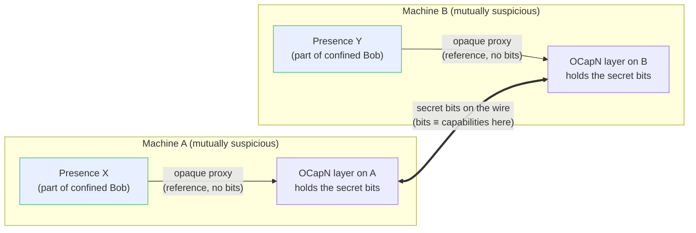

# Distributed Confinement

> **About this page.** This is a modernized rendering of Mark S. Miller and
> Melora Svoboda's note *"Distributed Capability Confinement"* (an observation of
> Norm Hardy's), originally published on
> [erights.org](https://web.archive.org/web/2024/https://erights.org/elib/capability/dist-confine.html "https://erights.org/elib/capability/dist-confine.html").
> The argument and its structure are Miller and Svoboda's; the prose here is a
> fresh exposition rather than a copy, and the code, protocol names, and diagrams
> have been updated to Hardened JavaScript and OCapN. Every such substitution is
> called out inline and collected under [Translation notes](#translation-notes).
> Miller placed the original text in the public domain; see
> [Attribution and provenance](#attribution-and-provenance). This page follows the
> flagging and naming conventions of the fork's `designs/thesis-translation.md`,
> in the lighter single-paper shape that design reserves for standalone notes.

## Introduction

There is a folk theorem that you cannot confine a *distributed* computation. The
reasoning sounds airtight: on an open network a capability is ultimately just a
run of secret bits, any process that holds those bits can copy them to anyone it
likes, and a confined subject with a covert channel can smuggle those bits out.
So — the story goes — even if you can confine a subject on a single machine, the
moment its computation spans two machines the confinement leaks.

This page explains why that conclusion is wrong. **You can confine distributed
capabilities even when you cannot confine bits.** The key is to keep straight the
difference between *having* a capability and *knowing* the secret that stands for
it on the wire, and to notice that the two mutually suspicious machines hosting a
subject can still cooperate to hold that subject to pure object-capability rules.

### Prerequisites

This note assumes familiarity with:

- [Hardened JavaScript](./guide.md) and the `lockdown()` function.
- Object capabilities and the principle of least authority.
- Asynchronous message passing between vats — see [Message
  Passing](./message-passing.md).

## Full confinement versus capability confinement

Start on a single machine, in a pure object-capability system. The original note
uses "the world of Java instances" as its example of such a system; we use
**Hardened JavaScript** instead — a lockdown-hardened realm where object
references are the capabilities. *(Substitution: Java instances →
Hardened JavaScript objects; see [Translation notes](#translation-notes).)*

The property that matters is that a reference is **not accessibly represented as
bits**. In Hardened JavaScript there is no operation that turns a reference back
out of its representation: you cannot serialize an object into a number and then
reconstitute the object from that number. (Java made the point by observing that
even if you learned the 32 bits of the underlying pointer — say, through a
debugging print — the language gives you no way to turn those bits back into the
reference. Hardened JavaScript is stronger still: it never exposes the bits at
all.)

Consider four objects:

- **Bob**, a confined subject.
- **Mallet**, an unconfined conspirator, working with Bob.
- **Alice**, Bob's customer.
- an **authority-granting object** — say, an expense account.

Alice hands Bob the expense account. She does this counting on Bob being
confined: she is willing to give Bob real spending authority precisely because
she believes Bob cannot reach Mallet, and so Bob can only spend within the rules
her confinement enforces. Mallet, being unconfined, has much wider latitude, and
because Bob and Mallet are conspirators, Bob would gladly hand the expense
account to Mallet if he could.

He cannot. A covert channel may let Bob leak *bits* to Mallet — timing, resource
usage, whatever the platform fails to close off — but no quantity of leaked bits
lets Bob hand Mallet the expense-account *reference*. The reference is built out
of bits, yet it is not *reachable* as bits, so the ability to leak bits does not
imply the ability to leak capabilities. This is a defensible confinement claim in
a system where bits themselves cannot be confined.

## Distributed capabilities: no shared kernel

Inside a single language runtime or a single-machine operating system there is a
mechanism sitting beneath every participant that all of them are forced to
trust — the language virtual machine, or the OS kernel. That shared, mutually
trusted substrate is what lets us mint capabilities as opaque references in the
first place.

On an open network there is no such common trusted mechanism. Two machines that
have never met share no kernel. Distributed capabilities therefore live under a
stricter constraint: across an open network they can only be implemented
**cryptographically**, and cryptography can only represent a capability *as
bits*. Those bits are necessarily accessible to any machine that holds the
capability — a machine has to be able to read and transmit them to use them at
all. So, taken in isolation, a machine on an open network cannot be fully
confined, nor even capability-confined: it holds the raw bits of its remote
capabilities and can copy them at will.

This is the setting for **Pluribus (whose living descendant is OCapN)** — the
Object Capability Network protocol Endo uses to carry capabilities between vats.
The original note calls it "the Pluribus network protocol" and "the comm system";
following the naming discipline of `designs/thesis-translation.md`, this page
keeps Miller's term beside the modern name on first mention and uses **OCapN**
thereafter. *(See [Translation notes](#translation-notes).)*

## Having versus knowing

Here is the distinction the whole argument turns on.

In cryptography, authorization *is* knowledge. A right is a secret, and to know
the secret is to hold the right; there is nothing more to having the capability
than knowing its bits. **Having and knowing are the same thing.**

In a pure object-capability system such as Hardened JavaScript, having an object
is categorically different from knowing anything about it. No amount of knowledge
*about* a reference — its shape, its history, even (hypothetically) the bits of
its underlying representation — grants you the reference. This matches the
physical world, where knowing everything about a key does not put the key in your
hand, and it cuts against the computing instinct that "within computation there
is only information." **Having and knowing are absolutely different.**

That contrast — between having and knowing, and equivalently between cryptography
and pure capabilities — is the lever the solution pulls on.

## The fallacy

Now make the naive argument precise so we can see where it breaks. On the network,
OCapN represents a distributed capability as an unguessable secret — knowing the
secret is what lets you invoke the object. (A real distributed capability also
pins the identity of the process hosting the object, but that detail does not
change the argument.) Because invoking the remote object is *just* knowing secret
bits, whoever knows the secret can choose to tell anyone.

From there the fallacy assembles itself:

1. On the network, capabilities are necessarily represented as bits.
2. A distributed computation necessarily uses the network.
3. Therefore a confined distributed subject could leak those bits over a covert
   channel to a conspirator, who turns the bits back into a capability.

The reasoning has a flaw. It assumes the confined subject is *handed the secret
bits* of its remote capabilities. That assumption is exactly what a correct
implementation refuses to grant.

## The solution

Picture Bob as a single object graph that straddles two machines. Call the part
of Bob on machine A the **presence X** and the part on machine B the **presence
Y**. *(Substitution: "presence" is E-vintage terminology; in OCapN these are the
**remote presences** / far references you address with eventual send — see
[Message Passing](./message-passing.md) and [Translation
notes](#translation-notes).)*

The capabilities that cross between the machines are, of necessity, represented
as bits that the participating machines can read. The machines are mutually
suspicious, and within their OCapN layers bits and capabilities are
interchangeable — so the communication layer itself is *not* confined, and cannot
be.

And yet Bob *is* confined. The trick is that machines A and B collaborate to
confine Bob even while neither trusts the other. Each machine's OCapN layer holds
the secret bits of the remote capabilities, and **denies its own resident
presence any knowledge of those bits**. What the OCapN layer hands the presence
instead is an *encapsulated proxy*: an ordinary local reference that designates
the remote object, and that the presence can invoke, while withholding the secret
number that represents that capability on the wire.

So the two machines and their OCapN layers play by cryptographic rules among
*themselves* — where having and knowing coincide — while jointly arranging for
Bob to play by pure object-capability rules, where having and knowing come apart.
Bob holds references he can *use* but cannot *name* as bits. A covert channel lets
Bob leak bits, but the bits he can reach are not the secrets, and the secrets he
would need are ones he was never given. Bob is a distributed computation sitting
inside a distributed confinement box.

## Translation notes

This page modernizes the source note. Each substitution below is a deliberate,
flagged change; the underlying argument is unchanged.

| Original | Rendered here | Why |
| --- | --- | --- |
| "the world of Java instances" (pure-capability example) | **Hardened JavaScript** objects under `lockdown()` | Hardened JavaScript is Endo's pure object-capability substrate; its references are likewise opaque and unforgeable — in fact more so, since it never exposes an underlying pointer at all. |
| **Pluribus** network protocol / "the comm system" | **OCapN** (Object Capability Network) | Pluribus was E's network capability protocol; CapTP was its successor, and OCapN is the modern cross-language standard Endo speaks. Following the E→Endo translation convention, CapTP/Pluribus → OCapN. |
| **presence** (E term for the local stand-in of a remote object) | **remote presence** / far reference | The eventual-send abstraction in OCapN; see [Message Passing](./message-passing.md). |
| **Figure 1** ("bob-in-a-box" GIF) | an original Mermaid diagram | The source-page text is public-domain-dedicated, but that dedication reads "all *text* on this page," which does not clearly cover the figure image. Rather than reproduce a possibly-non-public-domain asset, the figure is redrawn from scratch. |
| Section **"Inward vs. Outward Bit Confinement"** | *omitted* | In the source this heading contains only an author's placeholder note (`<need an explicit discussion of the differences>`); there is no content to translate, and inventing Miller's intended text would be unfaithful. It is dropped rather than fabricated. |
| erights.org intra-site links (`factory.html`, `deputy.html`, …) | dropped | Dead relative links into the E website; the relevant ideas live in Endo's own docs, linked above. |

These choices now match the fork's landed translation convention,
`designs/thesis-translation.md`: the page carries category **Annex** (below Guides
and Reference in the site navigation, where that design places the research
edition), names the protocol "Pluribus (whose living descendant is OCapN)" on
first mention, and redraws the source figure as a Mermaid diagram
(`typedoc-plugin-mermaid`, already enabled) rather than reproducing a figure image
whose copyright status is separate from the text. As a standalone note rather than
a dissertation chapter, it uses the single-paper `docs/<slug>.md` shape that design
reserves for such papers, not the `docs/thesis/` directory or `/thesis/` redirect.

## Attribution and provenance

- **Authors of the original:** Mark S. Miller and Melora Svoboda, writing up an
  observation of **Norm Hardy's**.
- **Source:** *Distributed Capability Confinement*,
  [erights.org/elib/capability/dist-confine.html](https://web.archive.org/web/2024/https://erights.org/elib/capability/dist-confine.html "https://erights.org/elib/capability/dist-confine.html")
  (erights.org is intermittently unreachable, so the canonical URL is linked
  through archive.org with the original in the link title; fetched via the
  erights.github.io mirror on 2026-07-07; source SHA-256
  `6d7ed3c3e85b66159f9eacc59b3220fe59631174dc12dc7f3c33c635575718ac`).
- **License of the original text:** the source page states, "Unless stated
  otherwise, all text on this page which is either unattributed or by Mark S.
  Miller is hereby placed in the public domain." This dedication covers the
  page's text. It does **not** unambiguously cover Melora Svoboda's contribution
  (the byline reads "written up by Mark S. Miller and Melora Svoboda") nor the
  figure image, which is why this rendering is an original exposition with an
  original diagram rather than a copy. Whether to seek explicit confirmation from
  the authors before publishing is a maintainer decision.
