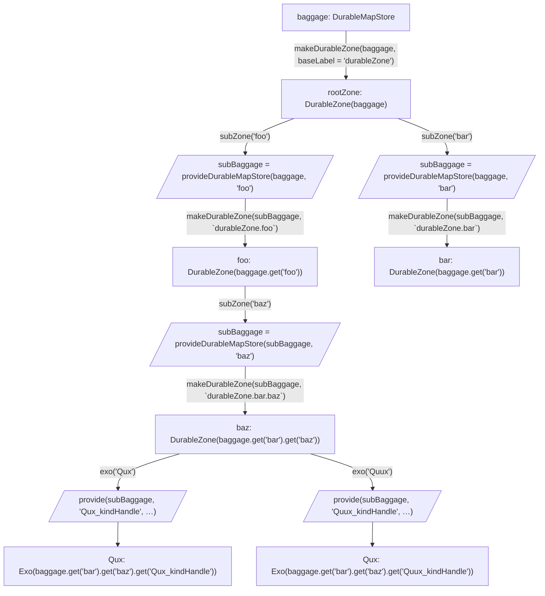
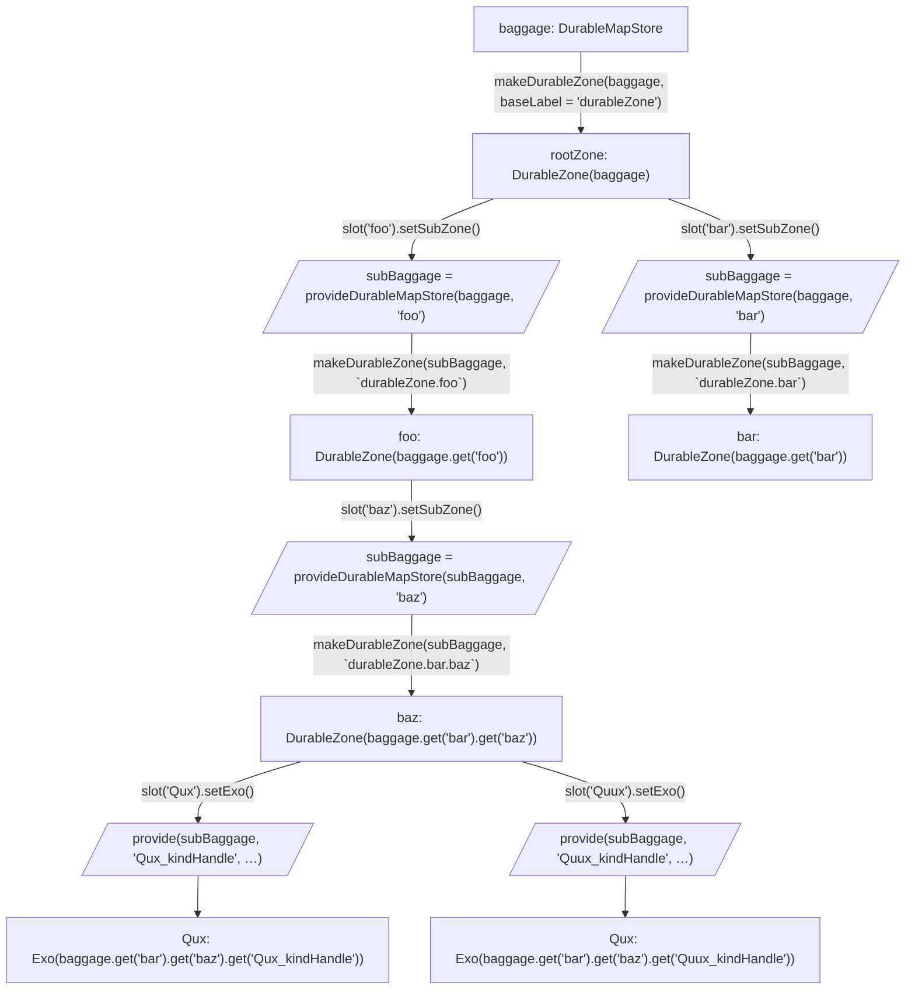

# #2397: Consider a `zone.slot()` abstraction

- **URL:** https://github.com/endojs/endo/issues/2397
- **State:** OPEN
- **Author:** @mhofman
- **Created:** 2024-08-02T05:21:44Z
- **Updated:** 2024-08-02T19:15:06Z
- **Labels:** `enhancement`

## Description

## What is the Problem Being Solved?

We have a pattern for zone that emerged: `prepareFoo(zone, 'foo', ...)` for simple entries in a zone. If Foo requires complex (aka multiple prepared entries), it can create a subzone with that name. In some case that leaks onto the "prepare" function itself, which accepts a zone without a tag, assuming it's getting a subzone it ca take over.

However the current prepare pattern is a break in encapsulation: it effectively gives access to the full zone, but relies on the prepareFunction to pinky swear it will only write keys at the provided tag.

This has come up repeatedly in async-flow / orchestration design and similar issues were raised before, e.g. in https://github.com/Agoric/agoric-sdk/pull/7107#discussion_r1125031665

## Description of the Design

Introduce a `zone.slot(name)` API with methods to define an exo or map/subzone in that slot, or create a sub slot (working as a series of prefixes which are joined when inserting the element).

`slot.exoClass` would no longer require a tag as that comes from the slot itself.

Prepare functions would be updated to only accept slots instead of zone + tag (or zone alone).

The current `zone.exo(tag, ...args)` would become an alias for `zone.slot(tag).setExo(...args)`, and `zone.subzone(tag)` is effectively the equivalent of `zone.slot(tag).setSubzone()`. (prefix `set` to be bikeshed, but it should convey only a single type of thing can be stored there).


## Security Considerations

This allows for better encapsulation of zones when passing them around.

## Scaling Considerations

Slots can be heap only as they're transient objects representing an attenuated zone entry.

## Test Plan

TBD

## Compatibility Considerations

We may need some helper for prepare functions to remain backward compatible with the version accepting zone + tag (and maybe even just zone).

```js
const prepareFoo = withZoneAndTagCompatibility((slot, arg1, arg2) => { ... });
```

## Upgrade Considerations

New methods on existing APIs, adopt at own convenience.


## Comments (2)

---

### @gibson042 (MEMBER) — 2024-08-02T15:41:07Z

Before bikeshedding on specific names, can you clarify the "zone" data model and how this proposes to extend it? I haven't looked in a while, but my understanding is we're starting from something like "_each subZone corresponds with a MapStore in its parent zone, and exos/stores in a zone correspond with entries in its MapStore_":


---

### @mhofman (MEMBER) — 2024-08-02T19:15:05Z

I am not proposing to change the data structure. But to change the API:



