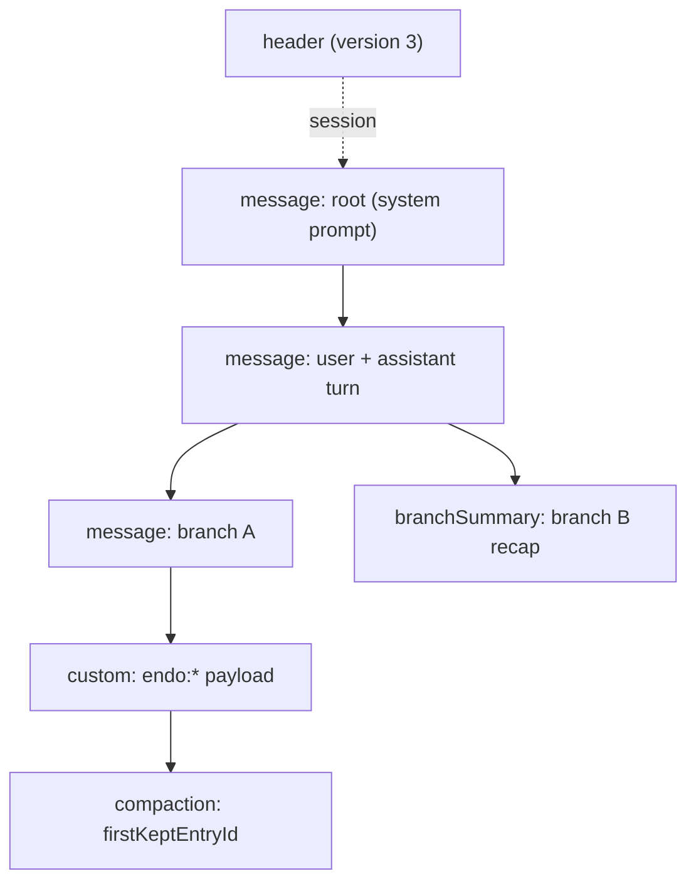

# Session transcript format (Pi-compatible JSONL)

This document is the reference for the on-disk JSONL projection of a
conversation tree. The projection lets an operator `cat`, `grep`, and `jq` a
session without going through the daemon, and lets an agent resume a session by
reading its own file back (the "the agent uses these as a form of memory" path
from the [endopi JSONL transcript design](https://github.com/endojs/endo-but-for-bots/blob/llm/designs/endopi-jsonl-transcript-format.md)).

The format is compatible with Pi's v3 transcript shape ("tree + custom"
unification). Pi's own reference is
[`packages/coding-agent/docs/session-format.md`](https://github.com/badlogic/pi-mono/blob/main/packages/coding-agent/docs/session-format.md)
in the pi-mono repository; this document records the exact subset and the
Endo-specific extensions the `@endo/conversation-tree` projection emits, so a
reader here does not have to cross-reference the upstream file for the parts
that differ.

## File layout

One file per session:

```
$ENDO_STATE/sessions/<guest-id>/<timestamp>_<session-id>.jsonl
```

The `timestamp` prefix keeps a guest's sessions sorted chronologically by a
plain directory listing; the `session-id` suffix disambiguates sessions started
within the same timestamp granularity. `sessionFilePath({ stateDirectory,
guestId, timestamp, sessionId })` composes this path.

The file is append-only and written mode `0600`. Each line is one complete JSON
object (JSONL). The writer flushes `O_APPEND` writes; a crash can leave a
partial final line with no terminating newline, which a reader recovers from by
discarding everything after the last newline (`truncateToLastCompleteLine`).

## Entries

The first line is a `header`. Every subsequent line is one **node entry**: the
projection emits exactly one entry per `ConversationNode`, in parent-before-child
order, so a reader reconstructs the tree in a single forward pass. Entries link
into a tree through `id` / `parentId`, matching Pi.

### Header

```json
{ "type": "header", "version": 3, "sessionId": "01975f", "createdAt": 1715817600000, "cwd": "/home/user/proj" }
```

| field | meaning |
| --- | --- |
| `version` | `3` — Pi's v3 shape. Exported as `SESSION_FORMAT_VERSION`. |
| `sessionId` | The session identifier (also the file-name suffix). |
| `createdAt` | Milliseconds since the Unix epoch. |
| `cwd` | Optional working directory the session ran in. |

### Node entries

A node entry carries the structural keys the projection owns, plus the node's
messages, plus any node metadata promoted to top-level fields:

```json
{
  "type": "message",
  "id": "01975f",
  "parentId": "01975e",
  "timestamp": 1715817601000,
  "messages": [
    { "role": "user", "content": "hello" },
    { "role": "assistant", "content": "hi there" }
  ]
}
```

| field | meaning |
| --- | --- |
| `type` | One of `message`, `compaction`, `branchSummary`, `custom`. |
| `id` | The node id — in the Endo daemon this is the message id. |
| `parentId` | The parent node id (the daemon `replyTo`), or `null` for a root. |
| `timestamp` | Milliseconds since the Unix epoch, when the node was recorded. |
| `messages` | The chat messages recorded at this step. |

Endo groups a conversational turn's messages into one node, so `messages` is an
array. This is the one documented shape difference from Pi, whose `message`
entry wraps a single message; the `type` / `id` / `parentId` tree linkage and
the entry-type set are exactly Pi's. Each element of `messages` is passed
through verbatim, so per-message Pi fields (`role`, `content`, `api`,
`provider`, `model`, `usage`, `stopReason`, `timestamp`, ...) are preserved
without transformation.

### Metadata promotion

Every node-metadata key other than `entryType` is promoted to a top-level field
on the entry, so an operator reads it directly with `jq` rather than reaching
into a nested object. The inverse operation on read returns every non-structural
top-level key to the node's `metadata`. The structural keys the projection owns
(and which metadata therefore may not shadow) are: `type`, `id`, `parentId`,
`timestamp`, `messages`, `version`, `sessionId`, `createdAt`, `cwd`. A metadata
key that collides with one of these is an error at serialization time rather
than silent data loss.

The well-known promoted keys per entry type:

| `type` | promoted keys | meaning |
| --- | --- | --- |
| `message` | (none required) | A plain conversational step. |
| `compaction` | `firstKeptEntryId` | Points at the first entry kept after an iterative-compaction pass elided earlier turns. The full history stays in the file; the in-memory graph is rebuilt with the summary node in place of the elided ones. |
| `branchSummary` | `summary` | A summary of a branch, for cross-branch reference. |
| `custom` | `endo:*` fields | Endo-specific payloads that have no Pi equivalent (for example `endo:messageId` carrying the daemon's 256-bit formula id alongside the Pi-style `id`, or a `value`-typed daemon message). Pi's spec accommodates extension-namespaced entries through the `custom` type. |

The tree structure of the entry types:



## Reading and writing

`@endo/conversation-tree` exports the projection as pure functions plus a small
append-only writer. The writer takes an injected line sink so this package stays
free of any filesystem dependency; a guest binds the sink to an `O_APPEND`,
mode-`0600` file under `$ENDO_STATE/sessions/`.

| export | role |
| --- | --- |
| `serializeTreeToJsonl(tree, header)` | Serialize a whole tree to a JSONL string. |
| `serializeHeader(fields)` / `serializeNode(node)` | Serialize one entry line. |
| `makeJsonlSessionWriter({ appendLine })` | Append-only writer: `writeHeader`, then `writeNode` per node as it is created. |
| `parseSessionEntries(text)` | Parse a file's text into entry objects, recovering a torn final line. |
| `entryToNode(entry)` | Reconstruct a `ConversationNode` from a node entry. |
| `loadTreeFromJsonl(text, backend, makeTree)` | Load a file into a backend and return `{ header, tree }` for resume. |
| `sessionFilePath(parts)` | Compose the canonical on-disk path. |
| `truncateToLastCompleteLine(text)` | Drop a crash-torn partial final line. |

Round-trip fidelity is the load-bearing property: `loadTreeFromJsonl` over the
output of `serializeTreeToJsonl` reproduces the same graph — same roots, same
branch structure, same assembled context down every leaf, and the same metadata
(including `custom` discriminators and the `compaction` pointer). The test suite
in `test/jsonl.test.js` exercises this across a branching tree that uses every
entry type.

## Relationship to the daemon

The writer is a guest-side concern: the agent (Lal, Fae, Floot) opens the file
lazily on the first message in a session and appends one line per node it adds
to its conversation tree. The daemon is not involved in the projection. The
in-memory tree remains the source of truth for a live session (see
`@endo/conversation-tree`'s `makeConversationTree` and its backends); the JSONL
file is the durable, inspectable projection of it.
