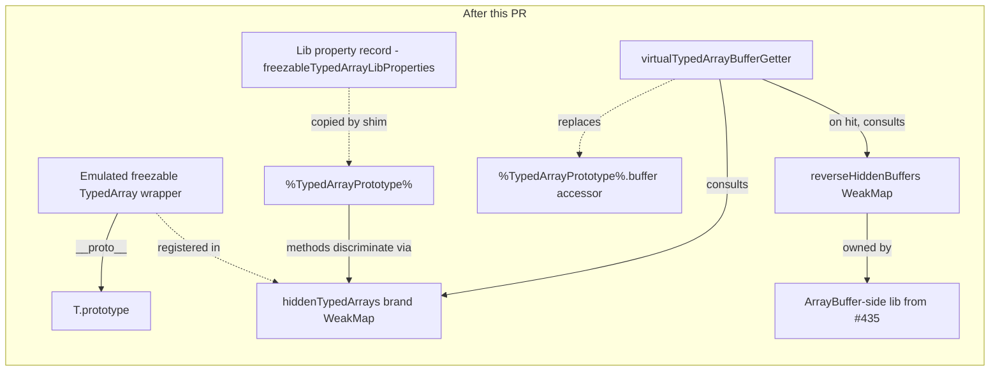

# Freezable TypedArray emulation: drop the pseudo-prototype on the TypedArray side

This design captures the *delayed freezable TypedArray emulation*
that erights asked for in his 2026-06-17T10:55Z comment on PR #435,
the predecessor that drops the immutable-ArrayBuffer pseudo-prototype.
This is the TypedArray-side analog explicitly named in PR #435's
DESIGN.md § Out of scope ("The TypedArray-side analog (drop
`%FreezableTypedArrayPrototype%` similarly). Separate PR, separate
design.").

The package keeps its split between a self-contained library layer
(`src/lib.js`) and a shim layer (`src/shim.js`) that installs
emulation onto genuine prototypes at load time.
The TypedArray side mirrors the ArrayBuffer-side amplifier-with-this-fallthrough
shape PR #435 established: every method on `%TypedArrayPrototype%`
discriminates on brand-WeakMap membership, the emulated wrapper
inherits directly from the genuine prototype (no intermediate
pseudo-prototype), and the shim installs the lib's property record
onto the genuine prototype under a stage-3 detect-then-skip policy.

## Status

| Field    | Value                                                                                            |
| -------- | ------------------------------------------------------------------------------------------------ |
| Created  | 2026-06-17                                                                                       |
| Authors  | erights (original framing), kriscendobot (write-up)                                              |
| Status   | Proposed                                                                                         |
| Depends  | PR #435 (drop-the-pseudo-prototype on the ArrayBuffer side) must merge before the builder fires  |
| Affects  | `packages/immutable-arraybuffer/`, `packages/ses/src/permits.js`                                 |
| Replaces | The would-be `%FreezableTypedArrayPrototype%` intrinsic that the experiment branch introduced    |

## Problem

The *Immutable ArrayBuffer* proposal at TC39 (Stage 2.7, advanced
February 2025) carries an explicit guarantee:
*A `DataView` or `TypedArray` using an immutable buffer as its backing
store can be frozen and immutable.*
PR #435 lands the ArrayBuffer-side emulation under the
drop-the-pseudo-prototype shape; this proposal carries the parallel
guarantee for `TypedArray` instances backed by emulated immutable
ArrayBuffers.

After PR #435 merges, a caller can do this:

```js
import '@endo/immutable-arraybuffer/shim.js';

const ab = new ArrayBuffer(4);
const iab = ab.sliceToImmutable();          // emulated immutable AB
const view = new Uint8Array(iab);            // ← currently throws or
                                             //   silently produces a
                                             //   wrong-shape view
```

Without the freezable-TypedArray emulation, the `new Uint8Array(iab)`
call falls into one of two unwanted states:

- **Throws.**
  The native `Uint8Array` constructor expects a real `ArrayBuffer`
  exotic object as its first argument.
  The emulated immutable buffer is a plain object whose `__proto__`
  is `ArrayBuffer.prototype`; the spec's internal slot check rejects it.
- **Coerces silently.**
  Some engines treat the emulated immutable buffer as a buffer-like
  and copy out a degraded view whose `.buffer` is a fresh genuine
  ArrayBuffer disconnected from the immutable wrapper.
  The view is then mutable, breaking the proposal's
  *can-be-frozen-and-immutable* guarantee at the TypedArray surface.

The proposal's TypedArray guarantee therefore cannot land at the
JavaScript surface without a TypedArray-side shim.
The experiment branch `experiment/no-spackle-immutable-arraybuffer-417`
(prototype, not for merge) demonstrates the pattern; PR #435 fixes
the ArrayBuffer-side surface this design builds on; this PR brings
the TypedArray-side surface to parity.

## API surface

After this PR merges, the following hold for any concrete TypedArray
constructor `T` in the standard eleven (`Int8Array`, `Int16Array`,
`Int32Array`, `Uint8Array`, `Uint8ClampedArray`, `Uint16Array`,
`Uint32Array`, `Float32Array`, `Float64Array`, `BigInt64Array`,
`BigUint64Array`):

```js
import '@endo/immutable-arraybuffer/shim.js';

const ab = new ArrayBuffer(4);
const iab = ab.sliceToImmutable();
const view = new T(iab);
```

| Expression                                | Returns                                                       |
| ----------------------------------------- | ------------------------------------------------------------- |
| `view instanceof T`                       | `true`                                                        |
| `Object.getPrototypeOf(view)`             | `T.prototype` (no intermediate prototype)                     |
| `view.buffer`                             | `iab` (the immutable wrapper, not the underlying genuine AB)  |
| `view.byteLength`, `byteOffset`, `length` | correct values, delegated to the hidden genuine TypedArray    |
| `view.at(0)`, `slice`, `subarray`, etc.   | correct values, delegated to the hidden genuine TypedArray    |
| `view.set([1])`                           | throws `TypeError` (complaining mutator)                      |
| `view.fill(0)`, `reverse`, `sort`, `copyWithin` | each throws `TypeError`                                 |
| `view[0] = 42; view[0]`                   | `0` (indexed assignment is silently swallowed; see *Semantics*) |
| `Object.freeze(view); Object.isFrozen(view)` | `true`                                                     |

The non-emulated path (construction from a genuine mutable
ArrayBuffer) is unchanged:

```js
const realAb = new ArrayBuffer(4);
const view = new T(realAb);

// view is a genuine TypedArray view.
// Mutators succeed; indexed assignment writes through; .buffer === realAb.
```

The pseudo-constructor is a drop-in replacement for `T`: the
emulated-immutable branch is reached only when the first argument is
a hidden buffer (registered in the lib's `hiddenBuffers` WeakMap);
every other call shape falls through to the genuine constructor via
`Reflect.construct(OriginalConstructor, args, new.target)`.

## Semantics

Three semantic choices warrant explicit treatment.

### Mutator methods throw

The five enumerated mutator methods (`copyWithin`, `fill`, `reverse`,
`set`, `sort`) each `throw TypeError` when invoked on an emulated
freezable TypedArray.
This matches the *Immutable ArrayBuffer* proposal's guarantee that an
immutable-backed view is immutable: a mutator that observably
modifies the contents must be prevented, and a thrown `TypeError` is
the explicit failure mode the proposal text uses.

The throw is implemented at the lib level via the
amplifier-with-this-fallthrough pattern: each mutator on the lib's
property record checks brand-WeakMap membership and throws on hit; on
miss it delegates to the captured genuine method, which preserves
unchanged behaviour for genuine TypedArrays.

### Indexed assignment is silently swallowed

The proposal does not provide a way to make integer-indexed
assignment to a TypedArray *throw*.
Per the ECMAScript specification, an integer-indexed exotic object's
`[[Set]]` returns `true` after a no-op when the underlying buffer is
not writable; it does not enter the same throw path that named-mutator
methods do.
Therefore:

```js
view[0] = 42;
view[0];      // 0 (assignment was silently swallowed)
```

The experiment branch carries explicit coverage for this (the
"strengthened indexed-assignment swallow test" in fixup
`740259d2`); this design preserves the behaviour and the coverage.
The emulated wrapper is a plain object whose `__proto__` is
`T.prototype`, so reads via the integer-indexed exotic path on the
*hidden* genuine TypedArray do not happen; the wrapper's integer
indices are plain own-properties whose presence is determined by
whatever indexed access the lib chooses to expose.
The lib does not expose them, so the read returns `undefined` or the
prior value of the slot.

This is a known proposal-level constraint, not a shim shortcoming.
The README's *Caveats* section is updated to mention it.

### `Object.isFrozen(view)` returns true after `Object.freeze(view)`

The emulated wrapper has no integer-indexed exotic slots and no
non-configurable own data properties, so `Object.freeze(view)`
succeeds and `Object.isFrozen(view)` returns `true`.
This is the proposal's TypedArray-can-be-frozen guarantee at the
JavaScript surface.

For a genuine TypedArray on a mutable buffer, `Object.freeze` throws
because the integer-indexed slots are non-configurable accessor-like
slots backed by the buffer; the emulated wrapper has neither of those
properties, so `freeze` is well-defined.

The harden phase of SES `lockdown()` reaches every primordial and
freezes it transitively; the emulated wrappers participate normally
in that walk because they are plain objects.

### `view.buffer` returns the immutable wrapper

The lib installs `virtualTypedArrayBufferGetter` as the new accessor
for `%TypedArrayPrototype%.buffer`.
The getter checks `hiddenTypedArrays` for the receiver; on hit it
returns the immutable wrapper (`reverseHiddenBuffers.get(genuineAb)`);
on miss it returns the genuine buffer the way the native accessor
would.
This means a caller who does `view.buffer.sliceToImmutable()` on an
emulated freezable view gets the immutable wrapper back, consistent
with the rest of the proposal's surface.

The same getter therefore serves both genuine TypedArrays and
emulated freezable TypedArrays, so the shim install replaces the
prototype's `buffer` accessor unconditionally (under the stage-3
detect-then-skip gate).

### `[Symbol.toStringTag]`

The decision parallel to PR #435's post-departure recovery
(`'ImmutableArrayBuffer'` as an own-property of each emulated
immutable buffer, not on the shared prototype) is **deferred** to
*Open questions*.
The experiment branch sets `[Symbol.toStringTag] = 'FreezableTypedArray'`
on the would-be intermediate prototype; under the
drop-the-pseudo-prototype shape there is no intermediate prototype.
Whether to (a) install the tag as an own-property on each emulated
wrapper (matching the ArrayBuffer side's post-departure recovery),
(b) not install it at all (defer to the genuine TypedArray's tag),
or (c) install it on `%TypedArrayPrototype%` (which would change the
tag on every genuine TypedArray too, which is almost certainly wrong)
is a designer-and-maintainer call that depends on whether any
downstream tool routes on `'[object FreezableTypedArray]'`.
See *Open questions* § 3.

## Implementation outline

The implementation is the post-#435 reshape of the experiment branch's
freezable-TypedArray commits (`721c68a3`, `2097641c`, `cfe99f7e`,
`e02ec0d0`, `1ef6c174`, plus four review-response fixups).

### Files added or modified

| File                                                                | Action  | Notes                                                                 |
| ------------------------------------------------------------------- | ------- | --------------------------------------------------------------------- |
| `packages/immutable-arraybuffer/src/lib.js`                         | EDIT    | extend with the freezable-TypedArray surface (see *Lib additions*)    |
| `packages/immutable-arraybuffer/src/shim.js`                        | EDIT    | extend the shim to also install the freezable-TypedArray surface      |
| `packages/immutable-arraybuffer/test/lib-typedarray.test.js`        | NEW     | lib-level unit tests (translated from `freezable-typedarray-pony.test.js`) |
| `packages/immutable-arraybuffer/test/shim-typedarray.test.js`       | NEW     | shim-level integration tests (translated from `freezable-typedarray-shim.test.js`) |
| `packages/immutable-arraybuffer/test/shim-typedarray-per-flavor.test.js` | NEW | per-flavor parameterized coverage across all eleven concrete TypedArray constructors |
| `packages/immutable-arraybuffer/README.md`                          | EDIT    | new section "The Freezable TypedArray Emulation"; retire the "follow-on shims might modify `DataView` and `TypedArray`" caveat |
| `packages/immutable-arraybuffer/DESIGN-freezable-typedarray.md`     | NEW     | this file                                                              |
| `packages/ses/src/permits.js`                                       | EDIT    | extend the `%TypedArrayPrototype%` permits entry to cover the shim-installed slots (`buffer` accessor replacement) |
| `packages/ses/test/immutable-arraybuffer.test.js`                   | EDIT    | extend to cover the freezable-TypedArray case (a `Uint8Array` constructed from an immutable AB is frozen / immutable after lockdown) |
| `.changeset/freezable-typedarray-emulation.md`                      | NEW     | minor on `@endo/immutable-arraybuffer`; patch on `ses`                  |

This design does **not** introduce a new ses-side intrinsic.
Under the drop-the-pseudo-prototype shape the emulated wrappers
inherit directly from the genuine `T.prototype`, so
`get-anonymous-intrinsics.js` does not need a new sample.
This is the parallel to PR #435's deletion of the
`%ImmutableArrayBufferPrototype%` sample.

### Lib additions

The lib gains four exported bindings (in addition to whatever PR #435
leaves as the post-merge exports):

```js
// In src/lib.js, after the existing ArrayBuffer-side property record:

const hiddenTypedArrays = new WeakMap();

export const amplifyTypedArray = typedArray =>
  apply(weakmapGet, hiddenTypedArrays, [typedArray]) || typedArray;

export const virtualTypedArrayBufferGetter = /* getter that consults
  hiddenTypedArrays first, then walks via FERAL_GET_ARRAY_BUFFER and
  reverseHiddenBuffers to return the immutable wrapper for hidden
  cases and the genuine buffer for fallthrough */;

export const makePseudoTypedArrayConstructor = OriginalConstructor =>
  /* returns a constructor that delegates to OriginalConstructor on
     non-hidden-buffer args, and produces an emulated wrapper on
     hidden-buffer args */;

export const freezableTypedArrayLibProperties = /* property record
  the shim copies onto %TypedArrayPrototype%; contains the mutator
  throw / read delegate methods, plus the `buffer` accessor
  replacement */;
```

The internal `hiddenBuffers` and `reverseHiddenBuffers` WeakMaps
remain owned by the immutable-ArrayBuffer side of the lib (per the
experiment branch's `immutable-arraybuffer-pony-internal.js`);
the freezable-TypedArray code reads them from the lib's existing
module-internal scope.
The experiment branch's separate `immutable-arraybuffer-pony-internal.js`
file may collapse into the consolidated `lib.js` PR #435 establishes;
the choice between collapse and a separate internal file is a builder
call documented in *Open questions* § 4.

The `internal-heir.js` helper that the experiment branch carries (a
100+ line "intermediate prototype with redirect + complain semantics"
builder) does not survive the drop-the-pseudo-prototype shape.
Its role is taken by the property record copied onto `T.prototype`.
The helper is therefore deleted (or, if its property-record-building
shape proves useful as a thin utility, kept as a renamed
`make-property-record.js`; see *Open questions* § 4).

### Shim additions

`src/shim.js` extends the existing detect-then-skip install body:

```js
// In src/shim.js, inside the existing detect-then-skip block:

if (!('sliceToImmutable' in arrayBufferPrototype)) {
  // ... existing ArrayBuffer-side install from PR #435 ...

  // New: freezable-TypedArray install.
  const TypedArray = getPrototypeOf(Uint8Array);
  const { prototype: typedArrayPrototype } = TypedArray;

  defineProperties(
    typedArrayPrototype,
    getOwnPropertyDescriptors(freezableTypedArrayLibProperties),
  );

  // Replace each of the eleven concrete global TypedArray constructors
  // with the pseudo-constructor produced from the lib.
  for (const { name, Ctor } of concreteTypedArrayCtors) {
    defineProperty(globalThis, name, {
      value: makePseudoTypedArrayConstructor(Ctor),
      writable: true,
      enumerable: false,
      configurable: true,
    });
  }
}
```

The stage-3 detect-then-skip gate is shared: if a prior shim or a
native implementation has already installed the ArrayBuffer-side
`sliceToImmutable`, this shim's entire install body is skipped,
including the TypedArray-side additions.
The two sides ship as a unit because they are part of the same TC39
proposal.

### Diagram



## Test plan

The implementation must pass three test layers.

### Lib-level (the property-record + pseudo-constructor in isolation)

`packages/immutable-arraybuffer/test/lib-typedarray.test.js`
(translation of the experiment branch's
`freezable-typedarray-pony.test.js`, four tests):

- `makePseudoTypedArrayConstructor wraps an immutable ArrayBuffer`:
  the brand-check WeakMap registration succeeds; the
  `virtualTypedArrayBufferGetter` recovers the immutable wrapper.
- `makePseudoTypedArrayConstructor forwards a non-immutable first arg`:
  the fallthrough branch via `Reflect.construct(OriginalConstructor,
  args, new.target)` produces a genuine TypedArray view.
- `virtualTypedArrayBufferGetter returns the real buffer for a
  genuine TypedArray`: the fallthrough returns the genuine buffer.
- `virtualTypedArrayBufferGetter redirects to the immutable wrapper
  when present`: the redirect via `reverseHiddenBuffers` works.

### Shim-level (after `import '../src/shim.js'`)

`packages/immutable-arraybuffer/test/shim-typedarray.test.js`
(translation of the experiment branch's
`freezable-typedarray-shim.test.js`, eight tests):

- `shim: global Uint8Array on an immutable ArrayBuffer wraps as
  emulated freezable`.
- `shim: global Uint8Array on a regular ArrayBuffer forwards to the
  OriginalConstructor`.
- `shim: virtual buffer getter returns the real buffer for a genuine
  TypedArray`.
- `shim: virtual buffer getter redirects to the immutable wrapper
  when present`.
- `shim: emulated freezable byteLength and at redirect via
  amplifyTypedArray`.
- `shim: emulated freezable mutators complain` (each of the five
  enumerated mutators throws).
- `shim: emulated freezable subarray returns a view whose buffer is
  the immutable wrapper`.
- `shim: detect-then-skip is idempotent under re-import` (parallel
  to PR #435's gate behaviour).

Additional tests this PR introduces beyond the experiment branch:

- `shim: indexed assignment is silently swallowed on an emulated
  freezable view` (covers the proposal-level constraint named in
  *Semantics* § Indexed assignment).
- `shim: Object.freeze(view); Object.isFrozen(view) === true` on an
  emulated freezable view (the proposal's
  TypedArray-can-be-frozen guarantee).
- `shim: Object.getPrototypeOf(view) === Uint8Array.prototype` on an
  emulated freezable view (documents that no intermediate prototype
  exists, parallel to PR #435's analogous assertion).

### Per-flavor parameterized coverage

`packages/immutable-arraybuffer/test/shim-typedarray-per-flavor.test.js`
runs a parameterized matrix over all eleven concrete TypedArray
constructors (`Int8Array`, `Int16Array`, `Int32Array`, `Uint8Array`,
`Uint8ClampedArray`, `Uint16Array`, `Uint32Array`, `Float32Array`,
`Float64Array`, `BigInt64Array`, `BigUint64Array`).
For each flavor, the matrix asserts:

- Construction from an immutable buffer succeeds and yields a
  freezable wrapper whose `__proto__` is `T.prototype`.
- Each of the five mutator methods throws `TypeError`.
- Indexed assignment is silently swallowed (`view[0] = 42;
  t.is(view[0], 0)`).
- `view.byteLength`, `view.byteOffset`, `view.length`, `view.buffer`
  all return correct values.
- `view.slice(...)`, `view.subarray(...)`, `view.at(0)`,
  `view.with(0, 1)`, `view.toReversed()`, `view.toSorted()` return
  correct values (modulo the BigInt-flavor distinctions for `with`).
- `Object.freeze(view); Object.isFrozen(view)` returns `true`.
- The fallthrough constructor (`new T(genuineMutableBuffer)`) still
  produces a genuine writable view.

The eleven-flavor table catches regressions that a `Uint8Array`-only
test suite would miss (the experiment branch covers only
`Uint8Array`).

### ses-side integration

`packages/ses/test/immutable-arraybuffer.test.js` extends to cover:

- After `lockdown()`, an emulated freezable `Uint8Array` is hardened
  and `Object.isFrozen(view) === true`.
- After `lockdown()`, the permits walk does not complain about the
  `%TypedArrayPrototype%` slots the shim installs.
- After `lockdown()`, an emulated freezable view's mutator methods
  still throw (the harden phase does not break the lib's
  discrimination logic).

### Cross-package consumer touchpoints

The freezable-TypedArray emulation does not directly touch
`packages/pass-style/src/byteArray.js`, but the byte-array pass-style
logic now admits `Uint8Array` instances whose backing buffer is
immutable.
Two consumer test sweeps verify nothing regresses:

- Run `yarn workspace @endo/pass-style test` after the implementation
  lands.
  An emulated freezable `Uint8Array` should be acceptable to
  `harden(byteArray)` and pass-style's brand checks.
- Run `yarn workspace @endo/marshal test` after the implementation
  lands.
  Marshal depends on byte-array pass-style for OCapN bulk-data
  wire-format encoding; the freezable-TypedArray emulation should not
  surface there.

Per the *Notes from the field* entry in `roles/designer/AGENT.md`
2026-06-09: PR #435's `[Symbol.toStringTag]` decision killed 13 ocapn
codec tests because `concordance` routed through `Buffer.from` on the
`'[object ArrayBuffer]'` tag.
The parallel risk on the TypedArray side is recorded in *Open
questions* § 3 (the `[Symbol.toStringTag]` decision); the builder
runs the same downstream consumer sweep before opening the PR.

## Scope

### In scope

- Adding the freezable-TypedArray emulation to `@endo/immutable-arraybuffer`
  as a new section of the lib's property record and as a new portion
  of the shim install body.
- Replacing each of the eleven concrete global TypedArray
  constructors with a pseudo-constructor that handles the
  emulated-immutable branch and falls through to the genuine
  constructor otherwise.
- Replacing `%TypedArrayPrototype%.buffer` with a getter that
  redirects emulated freezable views to the immutable wrapper.
- Extending the SES permits entry for `%TypedArrayPrototype%` to
  cover the shim-installed slots.
- Adding lib-level, shim-level, and per-flavor tests.
- Updating the package README to document the new surface and retire
  the "follow-on shims might modify `DataView` and `TypedArray`"
  caveat.

### Dependency: PR #435 must merge first

The builder dispatch for this design **must not fire before PR #435
merges**.
PR #435 establishes the amplifier-with-this-fallthrough pattern, the
lib-as-property-record shape, the stage-3 detect-then-skip install
policy, and the consolidated `lib.js` file that this design extends.
Building on top of pre-#435 master would either (a) fork the pattern,
producing a TypedArray-side shape that does not match the
ArrayBuffer-side, or (b) require a substantive rebase that rewrites
this PR's contents after #435 merges.

The designer's dispatch (this document) can fire before #435 merges;
the design is independent of the implementation's exact diff.
The builder's dispatch waits.

As of this draft's authoring (2026-06-17T20Z), PR #435 has merged
(merge commit `855a8f7bc`); the builder can fire as soon as the
project's frozen-base branch is updated.

### Out of scope

- `DataView` emulation.
  A parallel "freezable DataView" surface is implied by the same
  proposal text ("A `DataView` or `TypedArray` using an immutable
  buffer ..."), but it is not part of this design.
  DataView's surface is much smaller (one constructor, a handful of
  typed accessors), and the same drop-the-pseudo-prototype shape
  applies; a separate follow-up PR can land it after this one
  validates the pattern on the richer TypedArray surface.
- Subclass support.
  The pseudo-constructor throws if `new.target !== PseudoTypedArray`
  on the emulated-immutable branch (per the experiment branch's
  current code); subclassing an emulated freezable TypedArray is not
  supported.
  The fallthrough branch supports the standard subclass story for
  genuine TypedArrays.
- Cross-realm support.
  The lib's WeakMaps are realm-local; an emulated freezable
  TypedArray from one realm is not recognised in another realm.
  This matches the proposal text (TC39 proposals are realm-local by
  default) and the ArrayBuffer-side behaviour.
- A new `%FreezableTypedArrayPrototype%` SES intrinsic.
  Explicitly excluded: under the drop-the-pseudo-prototype shape,
  emulated wrappers inherit directly from `T.prototype` and no new
  intrinsic exists.
  The experiment branch's `cfe99f7e` "fixup: partial progress" commit
  introduced a 48-line `%FreezableTypedArrayPrototype%` permits
  entry; that entry is dropped under this design.
- A `view.freeze()` or `view.toImmutable()` API.
  Freezable-TypedArray-ness in this design (and in the proposal) is
  constructor-time-determined by the backing buffer's immutability.
  There is no API to "freeze later"; the only way to obtain an
  emulated freezable TypedArray is to construct it from an emulated
  immutable ArrayBuffer.
- Native engine work.
  This is a shim layer; native engines must implement the proposal
  separately at TC39 Stage 3 advance.
  The stage-3 detect-then-skip gate ensures this shim steps aside
  when a native implementation is present.

## Open questions

The design is implementable from this document.
The four questions below are framing or scope calls that the
maintainer (or erights) may want to revisit before the builder lands.
None block the builder from making a defensible choice on its own.

### 1. Confirm "delayed" = sequencing, not runtime lazy

The researcher's hypothesis (per `journal/entries/2026/06/17/195947Z-result-researcher-fe4754.md`)
reads erights's "delayed freezable TypedArray emulation" comment as a
*sequencing* word: a follow-up PR that *follows* PR #435's merge and
*delays* the TypedArray-side work to its own design and builder
cycle, with no runtime-lazy semantics.
Specifically, freezable-TypedArray-ness is *constructor-time-determined
by the backing buffer's immutability*; there is no `view.freeze()` or
`view.toImmutable()` API and no runtime detection that flips the
view's mode after construction.

The two alternative readings the researcher ruled out:

- "Delayed at runtime" (lazy `view.freeze()` or `view.toImmutable()`).
  The proposal does not spec such an API, and adding one would be a
  TC39-spec scope expansion outside the package's remit.
- "Delayed install" (the shim's race-to-install / detect-then-skip
  policy).
  PR #435 already decided that axis (stage-3 detect-then-skip);
  "delayed" here is about PR scheduling, not install behaviour.

If erights's actual reading differs from this hypothesis, the
designer (or the maintainer routing the design PR review) should
surface the divergence before the builder fires.

### 2. DESIGN placement (extend vs sibling)

This design lives at `packages/immutable-arraybuffer/DESIGN-freezable-typedarray.md`
as a sibling to PR #435's `DESIGN.md`.
The sibling shape is the default because (a) the design branch
descends from pre-#435 master, where `DESIGN.md` does not yet exist
locally, and (b) keeping the two designs in separate files avoids
merge conflicts when this PR rebases onto post-#435 master.

The alternative is to extend PR #435's `DESIGN.md` with a
*"Phase 2: TypedArray-side"* section.
That shape has the advantage of keeping the package's design history
in one document; the disadvantage is that the design becomes large
enough to no longer fit the *Length: aim for 1 to 3 screens*
guideline in `roles/designer/AGENT.md` § Operating norms.

The maintainer can redirect the placement in the design PR review;
the builder will reorganise the file structure to match either way.

### 3. `[Symbol.toStringTag]` decision parallel to #435

PR #435's *Move 2* originally proposed dropping the
`[Symbol.toStringTag] = 'ImmutableArrayBuffer'` purposeful violation
entirely (on the premise that `concordance` would handle the
resulting `TypeError` from `Buffer.from` as unrenderable).
The premise was empirically wrong: 13 ocapn codec tests broke because
concordance routes through `Buffer.from` on `'[object ArrayBuffer]'`.
PR #435 restored the tag as an *own-property of each emulated
immutable buffer*, not on the shared prototype.

The parallel decision on the freezable-TypedArray side has three
shapes:

- **(a) Match the post-departure recovery: install
  `[Symbol.toStringTag] = 'FreezableTypedArray'` as an own-property
  on each emulated wrapper.**
  Matches PR #435's final shape.
  Costs one extra own-property per emulated wrapper; observable as
  `Object.prototype.toString.call(view) === '[object FreezableTypedArray]'`.
  May or may not interact safely with consumers that route on the
  tag.
- **(b) Defer to the genuine TypedArray's tag.**
  No install; `Object.prototype.toString.call(view)` reads as
  `'[object Uint8Array]'` (or the concrete flavor's name).
  Cleaner; aligns with the proposal's "no observable difference at
  the toStringTag surface" framing.
  Carries the same risk PR #435 hit if a downstream consumer routes
  on the tag and treats `'[object Uint8Array]'` as a license to
  mutate.
- **(c) Install on `%TypedArrayPrototype%`.**
  Almost certainly wrong; would change the tag on every genuine
  TypedArray too.
  Listed here only to exclude.

The experiment branch chose shape (a) (sets the tag on the would-be
intermediate prototype, which under the drop-the-pseudo-prototype
shape becomes shape (a) as own-property).
This design's working assumption is shape (a) for parity with PR
#435's outcome, with a builder-level smoke-test against
`@endo/pass-style` and `@endo/marshal` to validate the choice does
not break a downstream consumer.

The maintainer or erights may prefer shape (b) if the consumer sweep
shows shape (a) breaks something.

### 4. `internal-heir.js` inline versus separate

The experiment branch's `src/internal-heir.js` is a 100+ line helper
that builds intermediate prototypes with redirect-and-complain
semantics.
Under the drop-the-pseudo-prototype shape there is no intermediate
prototype; the helper's role collapses to building a property record
the shim copies onto the genuine prototype.

Three shapes the builder can pick from:

- **Delete the helper.**
  The property record is small enough that inlining its construction
  in `lib.js` is clearer than a separate helper file.
  PR #435 inlined the ArrayBuffer-side property record; this PR can
  mirror that on the TypedArray side.
- **Keep as a thin utility, renamed.**
  If the property-record-building shape proves useful (e.g., the
  DataView follow-up would also benefit), rename to something like
  `make-property-record.js` and reuse.
  The "heir" naming no longer fits since there is no inheritance
  relationship.
- **Keep as-is.**
  Defensible only if a future caller-outside-this-package needs the
  helper.
  No such caller exists; not recommended.

The builder's default is **Delete the helper** unless a downstream
DataView follow-up materialises before this PR opens.

## References

- [erights's "delayed freezable TypedArray emulation" comment on PR #435](https://github.com/endojs/endo-but-for-bots/pull/435)
  (2026-06-17T10:55Z): the framing this document expands.
- [PR #435 `DESIGN.md`](https://github.com/endojs/endo-but-for-bots/pull/435/files):
  the drop-the-pseudo-prototype shape this design adopts on the
  TypedArray side.
  Specifically § Out of scope ("The TypedArray-side analog (drop
  `%FreezableTypedArrayPrototype%` similarly). Separate PR, separate
  design.") names the work this PR does.
- The experiment branch
  `experiment/no-spackle-immutable-arraybuffer-417`
  (origin remote, head `1ef6c174d` plus four review-response
  fixups): the working prototype this PR translates.
  Foundational commits: `721c68a3` (initial freezable-typedarray pony
  scaffolding), `e02ec0d0` (shim install body), `1ef6c174`
  (shim-level tests).
- [TC39 *Immutable ArrayBuffer* proposal](https://github.com/tc39/proposal-immutable-arraybuffer)
  (Stage 2.7 as of 2026-06): the proposal text that includes the
  "A `DataView` or `TypedArray` using an immutable buffer as its
  backing store can be frozen and immutable" guarantee this PR
  realises at the shim layer.
- README.md *Caveats* section: the existing caveat "Perhaps follow-on
  shims might modify `DataView` and `TypedArray` to emulate that as
  well, but that is hard and beyond the ambition of this ponyfill +
  shim" is the readme-side anchor; this PR rewrites that caveat to
  point at the new section.
