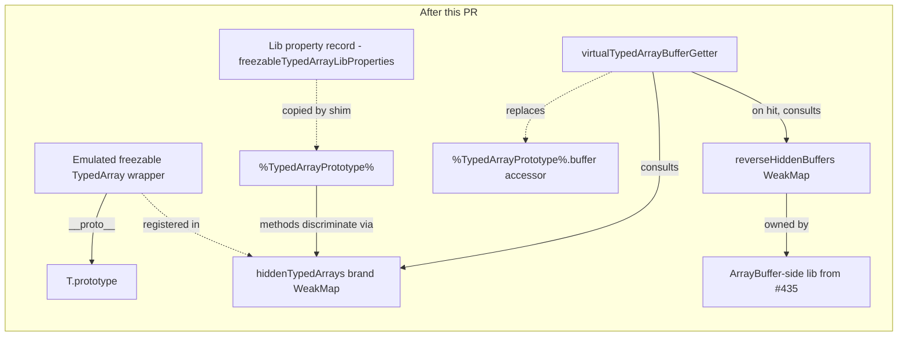

# Freezable TypedArray emulation: drop the pseudo-prototype on the TypedArray side

This design captures the *delayed freezable TypedArray emulation*
that erights asked for in his 2026-06-17T10:55Z comment on PR #435.
PR #435 is the predecessor that drops the immutable-ArrayBuffer
pseudo-prototype.
This is the TypedArray-side analog explicitly named in PR #435's
`DESIGN-immutable-arraybuffer.md` § Out of scope ("The TypedArray-side
analog (drop `%FreezableTypedArrayPrototype%` similarly). Separate PR,
separate design.").

The package keeps its split between a self-contained library layer
(`src/lib.js`) and a shim layer (`src/shim.js`) that installs
emulation onto genuine prototypes at load time.
The TypedArray side mirrors the ArrayBuffer-side amplifier-with-this-fallthrough
shape PR #435 established: every method on `%TypedArrayPrototype%`
discriminates on brand-WeakMap membership, the emulated wrapper
inherits directly from the genuine prototype (no intermediate
pseudo-prototype), and the shim installs the lib's property record
onto the genuine prototype under a stage-3 detect-then-skip policy.

## Status

| Field    | Value                                                                                            |
| -------- | ------------------------------------------------------------------------------------------------ |
| Created  | 2026-06-17                                                                                       |
| Authors  | erights (original framing), kriscendobot (write-up)                                              |
| Status   | Proposed                                                                                         |
| Depends  | PR #435 (drop-the-pseudo-prototype on the ArrayBuffer side) must merge before the builder fires  |
| Affects  | `packages/immutable-arraybuffer/`, `packages/ses/src/permits.js`                                 |
| Replaces | The would-be `%FreezableTypedArrayPrototype%` intrinsic that the experiment branch introduced    |

## Problem

The *Immutable ArrayBuffer* proposal at TC39 (Stage 2.7, advanced
February 2025) carries an explicit guarantee:
*A `DataView` or `TypedArray` using an immutable buffer as its backing
store can be frozen and immutable.*
PR #435 lands the ArrayBuffer-side emulation under the
drop-the-pseudo-prototype shape; this proposal carries the parallel
guarantee for `TypedArray` instances backed by emulated immutable
ArrayBuffers.

After PR #435 merges, a caller can do this:

```js
import '@endo/immutable-arraybuffer/shim.js';

const ab = new ArrayBuffer(4);
const iab = ab.sliceToImmutable();          // emulated immutable AB
const view = new Uint8Array(iab);            // ← currently throws or
                                             //   silently produces a
                                             //   wrong-shape view
```

Without the freezable-TypedArray emulation, the `new Uint8Array(iab)`
call would fall into one of two unwanted states:

- **Throws.**
  The native `Uint8Array` constructor expects a real `ArrayBuffer`
  exotic object as its first argument.
  The emulated immutable buffer is a plain object whose `__proto__`
  is `ArrayBuffer.prototype`; the spec's internal slot check rejects it.
- **Coerces silently.**
  Some engines treat the emulated immutable buffer as a buffer-like
  and copy out a degraded view whose `.buffer` is a fresh genuine
  ArrayBuffer disconnected from the immutable wrapper.
  The view is then mutable, breaking the proposal's
  *can-be-frozen-and-immutable* guarantee at the TypedArray surface.

The proposal's TypedArray guarantee therefore cannot land at the
JavaScript surface without a TypedArray-side shim.
The experiment branch `experiment/no-spackle-immutable-arraybuffer-417`
(prototype, not for merge) demonstrates the pattern; PR #435 fixes
the ArrayBuffer-side surface this design builds on; this PR brings
the TypedArray-side surface to parity.

## Background

The freezable-TypedArray design extends the post-#435 lib surface,
not the experiment branch's earlier shape.
A reader meeting this document without having read
`DESIGN-immutable-arraybuffer.md` first needs the following lib-side
topology before the *Implementation outline* section makes sense.

After PR #435 merges, the lib (`packages/immutable-arraybuffer/src/lib.js`)
owns two internal WeakMaps that the freezable-TypedArray code extends
rather than reintroduces:

- `hiddenBuffers` maps each emulated immutable ArrayBuffer wrapper to
  its backing genuine (mutable) ArrayBuffer.
  The lib uses the wrapper as the public-facing identity and the
  genuine buffer as the private storage; methods that need to read
  bytes (`slice`, `getInt8`, etc.) consult `hiddenBuffers` to recover
  the genuine buffer.
- `reverseHiddenBuffers` is the inverse map from genuine backing
  buffer to the wrapper.
  Methods that need to *return* a buffer (the `view.buffer` getter,
  for instance) consult `reverseHiddenBuffers` to hand back the
  immutable wrapper rather than the genuine buffer.

Both WeakMaps live inside the lib's module scope; they are not
exported.
The freezable-TypedArray code adds a third WeakMap (`hiddenTypedArrays`)
keyed on the emulated TypedArray wrappers and reads the two
pre-existing WeakMaps for `view.buffer` lookups.
This is the topology *Implementation outline* § Lib additions extends;
that section names `hiddenBuffers` and `reverseHiddenBuffers` without
re-explaining them.

A reader who wants to see the post-#435 lib in detail (the
amplifier-with-this-fallthrough pattern, the lib-as-property-record
shape, the brand-WeakMap discrimination) should read
`DESIGN-immutable-arraybuffer.md` § Move 2 first; this design assumes
that surface as a given.

## API surface

After this PR merges, the following hold for any concrete TypedArray
constructor `T` in the standard library's eleven concrete TypedArray
constructors (`Int8Array`, `Int16Array`, `Int32Array`, `Uint8Array`,
`Uint8ClampedArray`, `Uint16Array`, `Uint32Array`, `Float32Array`,
`Float64Array`, `BigInt64Array`, `BigUint64Array`):

```js
import '@endo/immutable-arraybuffer/shim.js';

const ab = new ArrayBuffer(4);
const iab = ab.sliceToImmutable();
const view = new T(iab);
```

| Expression                                | Returns                                                       |
| ----------------------------------------- | ------------------------------------------------------------- |
| `view instanceof T`                       | `true`                                                        |
| `Object.getPrototypeOf(view)`             | `T.prototype` (no intermediate prototype)                     |
| `view.buffer`                             | `iab` (the immutable wrapper, not the underlying genuine AB)  |
| `view.byteLength`, `byteOffset`, `length` | correct values, delegated to the hidden genuine TypedArray    |
| `view.at(0)`, `slice`, `subarray`, etc.   | correct values, delegated to the hidden genuine TypedArray    |
| `view.set([1])`                           | throws `TypeError` (complaining mutator)                      |
| `view.fill(0)`, `reverse`, `sort`, `copyWithin` | each throws `TypeError`                                 |
| `view[0] = 42; view[0]`                   | `0` (indexed assignment is silently swallowed; see *Semantics*) |
| `Object.freeze(view); Object.isFrozen(view)` | `true`                                                     |

The non-emulated path (construction from a genuine mutable
ArrayBuffer) is unchanged:

```js
const realAb = new ArrayBuffer(4);
const view = new T(realAb);

// view is a genuine TypedArray view.
// Mutators succeed; indexed assignment writes through; .buffer === realAb.
```

The pseudo-constructor is a drop-in replacement for `T`: the
emulated-immutable branch is reached only when the first argument is
a hidden buffer (registered in the lib's `hiddenBuffers` WeakMap);
every other call shape falls through to the genuine constructor via
`Reflect.construct(OriginalConstructor, args, new.target)`.

The constructor surface is symmetric (both `new T(iab)` and
`new T(realAb)` parse and complete without error), but the
*result-of-construction* surface is asymmetric: the resulting views
diverge on mutability.
A reader of a single call site like `new Uint8Array(maybeIab)` cannot
tell from the syntax whether the produced view will throw on
`.set(...)` or write through; only the runtime identity of the
argument decides.
This is the proposal's central trade: the constructor accepts both
shapes uniformly so existing TypedArray-construction code at consumer
sites does not have to branch, and the call site's mutator behavior
is determined by the argument's immutability rather than by a
separate constructor name.

## Semantics

Three semantic choices warrant explicit treatment.

### Mutator methods throw

The five enumerated mutator methods (`copyWithin`, `fill`, `reverse`,
`set`, `sort`) each `throw TypeError` when invoked on an emulated
freezable TypedArray.
This matches the *Immutable ArrayBuffer* proposal's guarantee that an
immutable-backed view is immutable: a mutator that observably
modifies the contents must be prevented, and a thrown `TypeError` is
the explicit failure mode the proposal text uses.

The throw is implemented at the lib level via the
amplifier-with-this-fallthrough pattern: each mutator on the lib's
property record checks brand-WeakMap membership and throws on hit; on
miss it delegates to the captured genuine method, which preserves
unchanged behaviour for genuine TypedArrays.

### Indexed assignment is silently swallowed

The proposal does not provide a way to make integer-indexed
assignment to a TypedArray *throw*.
Per the ECMAScript specification, an integer-indexed exotic object's
`[[Set]]` internal operation (the operation JavaScript invokes when
code writes `view[0] = 42`) returns `true` after a no-op when the
underlying buffer is not writable; it does not enter the same throw
path that named-mutator methods do.
Therefore:

```js
view[0] = 42;
view[0];      // 0 (assignment was silently swallowed)
```

The experiment branch carries explicit coverage for this (the
"strengthened indexed-assignment swallow test" in fixup
`740259d2`); this design preserves the behaviour and the coverage.
The emulated wrapper is a plain object whose `__proto__` is
`T.prototype`, so reads via the integer-indexed exotic path on the
*hidden* genuine TypedArray do not happen; the wrapper's integer
indices are plain own-properties whose presence is determined by
whatever indexed access the lib chooses to expose.
The lib does not expose them, so the read returns `undefined` or the
prior value of the slot.

This is a known proposal-level constraint, not a shim shortcoming.
The README's *Caveats* section is updated to mention it.

### `Object.isFrozen(view)` returns true after `Object.freeze(view)`

The emulated wrapper has no integer-indexed exotic slots and no
non-configurable own data properties, so `Object.freeze(view)`
succeeds and `Object.isFrozen(view)` returns `true`.
This is the proposal's TypedArray-can-be-frozen guarantee at the
JavaScript surface.

For a genuine TypedArray on a mutable buffer, `Object.freeze` throws
because the integer-indexed slots are non-configurable accessor-like
slots backed by the buffer; the emulated wrapper has neither of those
properties, so `freeze` is well-defined.

The spec basis: `Object.freeze` invokes `SetIntegrityLevel` on the
receiver, which iterates the receiver's *own* property keys (via
`[[OwnPropertyKeys]]`) and sets each to non-configurable.
The integer-indexed exotic check that makes genuine TypedArrays
unfreezable lives on the integer-indexed exotic object's
`[[OwnPropertyKeys]]` and `[[DefineOwnProperty]]` internal methods,
which enumerate the integer-indexed slots as own properties.
The emulated wrapper is a plain ordinary object whose `[[Prototype]]`
is `T.prototype`; its own `[[OwnPropertyKeys]]` (the ordinary-object
form) does not enumerate integer-indexed slots because the wrapper
has none.
The freeze walk therefore touches only the wrapper's plain own
properties (none) and completes; the prototype chain's exotic-ness is
not consulted because freeze operates on the receiver.

The harden phase of SES `lockdown()` reaches every primordial and
freezes it transitively; the emulated wrappers participate normally
in that walk because they are plain objects.

### `view.buffer` returns the immutable wrapper

The lib installs `virtualTypedArrayBufferGetter` as the new accessor
for `%TypedArrayPrototype%.buffer`.
The getter checks `hiddenTypedArrays` for the receiver; on hit it
returns the immutable wrapper (`reverseHiddenBuffers.get(genuineAb)`);
on miss it returns the genuine buffer the way the native accessor
would.
This means a caller who does `view.buffer.sliceToImmutable()` on an
emulated freezable view gets the immutable wrapper back, consistent
with the rest of the proposal's surface.

The same getter therefore serves both genuine TypedArrays and
emulated freezable TypedArrays, so the shim install replaces the
prototype's `buffer` accessor unconditionally (under the stage-3
detect-then-skip gate).

### `[Symbol.toStringTag]`

The shim **does not install** `[Symbol.toStringTag]` on the emulated
freezable TypedArray wrapper.
An emulated freezable view inherits its tag from the genuine
`T.prototype` chain, so
`Object.prototype.toString.call(view)` reads as `'[object Uint8Array]'`
(or the concrete flavor's name) just as it does for a genuine view of
the same flavor.
This deliberately diverges from PR #435's ArrayBuffer-side post-departure
recovery (which installed `'ImmutableArrayBuffer'` as an own-property
on each emulated immutable buffer to keep `concordance` from misrouting
through `Buffer.from`).

The reason for the divergence is erights's call on
[PR #449's open question 3](https://github.com/endojs/endo-but-for-bots/issues/comments/4735477238):
*"(b) is best. It does have the hazard you mention, but I'm happy not
to add complexity to avoid it until we find out if it is an actual
problem."*
Adding the own-property tag is reversible if the downstream consumer
sweep (per *Test plan* § Cross-package consumer touchpoints) surfaces
a concrete regression; until that signal arrives, the simpler shape
is preferred.

The experiment branch sets `[Symbol.toStringTag] = 'FreezableTypedArray'`
on the would-be intermediate prototype.
Under the drop-the-pseudo-prototype shape there is no intermediate
prototype to hang the tag on, and erights's call says do not recover
it on the wrapper either; the experiment branch's tag install is
therefore dropped during translation.

## Implementation outline

The implementation is the post-#435 reshape of the experiment branch's
freezable-TypedArray commits (`721c68a3`, `2097641c`, `cfe99f7e`,
`e02ec0d0`, `1ef6c174`, plus four review-response fixups).

### Files added or modified

| File                                                                | Action  | Notes                                                                 |
| ------------------------------------------------------------------- | ------- | --------------------------------------------------------------------- |
| `packages/immutable-arraybuffer/src/lib.js`                         | EDIT    | extend with the freezable-TypedArray surface (see *Lib additions*)    |
| `packages/immutable-arraybuffer/src/shim.js`                        | EDIT    | extend the shim to also install the freezable-TypedArray surface      |
| `packages/immutable-arraybuffer/test/lib-typedarray.test.js`        | NEW     | lib-level unit tests (translated from `freezable-typedarray-pony.test.js`) |
| `packages/immutable-arraybuffer/test/shim-typedarray.test.js`       | NEW     | shim-level integration tests (translated from `freezable-typedarray-shim.test.js`) |
| `packages/immutable-arraybuffer/test/shim-typedarray-per-flavor.test.js` | NEW | per-flavor parameterized coverage across all eleven concrete TypedArray constructors |
| `packages/immutable-arraybuffer/README.md`                          | EDIT    | new section "The Freezable TypedArray Emulation"; retire the "follow-on shims might modify `DataView` and `TypedArray`" caveat |
| `packages/immutable-arraybuffer/DESIGN-freezable-typedarray.md`     | NEW     | this file                                                              |
| `packages/ses/src/permits.js`                                       | EDIT    | extend the `%TypedArrayPrototype%` permits entry to cover the shim-installed slots (`buffer` accessor replacement) |
| `packages/ses/test/immutable-arraybuffer.test.js`                   | EDIT    | extend to cover the freezable-TypedArray case (a `Uint8Array` constructed from an immutable AB is frozen / immutable after lockdown) |
| `.changeset/freezable-typedarray-emulation.md`                      | NEW     | minor on `@endo/immutable-arraybuffer`; patch on `ses`                  |

This design does **not** introduce a new ses-side intrinsic.
Under the drop-the-pseudo-prototype shape the emulated wrappers
inherit directly from the genuine `T.prototype`, so
`get-anonymous-intrinsics.js` does not need a new sample.
This is the parallel to PR #435's deletion of the
`%ImmutableArrayBufferPrototype%` sample.

### Lib additions

The lib gains four exported bindings (in addition to whatever PR #435
leaves as the post-merge exports):

```js
// In src/lib.js, after the existing ArrayBuffer-side property record:

const hiddenTypedArrays = new WeakMap();

export const amplifyTypedArray = typedArray =>
  apply(weakmapGet, hiddenTypedArrays, [typedArray]) || typedArray;

export const virtualTypedArrayBufferGetter = /* getter that consults
  hiddenTypedArrays first, then walks via FERAL_GET_ARRAY_BUFFER and
  reverseHiddenBuffers to return the immutable wrapper for hidden
  cases and the genuine buffer for fallthrough */;

export const makePseudoTypedArrayConstructor = OriginalConstructor =>
  /* returns a constructor that delegates to OriginalConstructor on
     non-hidden-buffer args, and produces an emulated wrapper on
     hidden-buffer args */;

export const freezableTypedArrayLibProperties = /* property record
  the shim copies onto %TypedArrayPrototype%; contains the mutator
  throw / read delegate methods, plus the `buffer` accessor
  replacement */;
```

The `freezableTypedArrayLibProperties` record bundles two
semantically distinct concerns under one install loop for shim-side
simplicity, not because they are the same kind of property:

- The mutator-throws descriptors (`copyWithin`, `fill`, `reverse`,
  `set`, `sort`): discriminate on `hiddenTypedArrays` brand
  membership and throw on hit; on miss, delegate to the captured
  genuine method (the *amplifier-with-this-fallthrough* shape).
- The `buffer` accessor replacement: discriminate on the same brand
  WeakMap but with a different fallthrough semantic.
  On hit, return the immutable wrapper via `reverseHiddenBuffers`;
  on miss, return the genuine buffer the native accessor would have
  returned.

The two share the brand WeakMap and the install loop but answer
different questions (throw-versus-delegate for mutators, redirect-
versus-passthrough for the buffer getter).
The bundling is an install-loop economy, not a category claim.

The internal `hiddenBuffers` and `reverseHiddenBuffers` WeakMaps
(see *Background* above) remain owned by the immutable-ArrayBuffer
side of the post-#435 lib;
the freezable-TypedArray code reads them from the lib's existing
module-internal scope.
On post-#435 master, the immutable-ArrayBuffer side already lives
inside the consolidated `lib.js` (the experiment branch's separate
`immutable-arraybuffer-pony-internal.js` file does not survive the
merge), so this design extends a single `lib.js` and does not
reintroduce an internal file split.

The experiment branch carries an `internal-heir.js` helper (a 100+
line "intermediate prototype with redirect + complain semantics"
builder) that does not exist on post-#435 master.
Under the drop-the-pseudo-prototype shape there is no intermediate
prototype to build; the helper's role is taken by the property
record copied onto `T.prototype`.
The builder therefore does not port the helper; the design needs no
property-record-building utility beyond what `lib.js` exports
directly.

### Shim additions

`src/shim.js` extends the existing detect-then-skip install body:

```js
// In src/shim.js, inside the existing detect-then-skip block:

if (!('sliceToImmutable' in arrayBufferPrototype)) {
  // ... existing ArrayBuffer-side install from PR #435 ...

  // New: freezable-TypedArray install.
  const TypedArray = getPrototypeOf(Uint8Array);
  const { prototype: typedArrayPrototype } = TypedArray;

  defineProperties(
    typedArrayPrototype,
    getOwnPropertyDescriptors(freezableTypedArrayLibProperties),
  );

  // Replace each of the eleven concrete global TypedArray constructors
  // with the pseudo-constructor produced from the lib.
  for (const { name, Ctor } of concreteTypedArrayCtors) {
    defineProperty(globalThis, name, {
      value: makePseudoTypedArrayConstructor(Ctor),
      writable: true,
      enumerable: false,
      configurable: true,
    });
  }
}
```

The stage-3 detect-then-skip gate is shared: if a prior shim or a
native implementation has already installed the ArrayBuffer-side
`sliceToImmutable`, this shim's entire install body is skipped,
including the TypedArray-side additions.
The two sides ship as a unit because they are part of the same TC39
proposal.

### Diagram



## Test plan

The implementation must pass three test layers.

### Lib-level (the property-record + pseudo-constructor in isolation)

`packages/immutable-arraybuffer/test/lib-typedarray.test.js`
(translation of the experiment branch's
`freezable-typedarray-pony.test.js`, four tests):

- `makePseudoTypedArrayConstructor wraps an immutable ArrayBuffer`:
  the brand-check WeakMap registration succeeds; the
  `virtualTypedArrayBufferGetter` recovers the immutable wrapper.
- `makePseudoTypedArrayConstructor forwards a non-immutable first arg`:
  the fallthrough branch via `Reflect.construct(OriginalConstructor,
  args, new.target)` produces a genuine TypedArray view.
- `virtualTypedArrayBufferGetter returns the real buffer for a
  genuine TypedArray`: the fallthrough returns the genuine buffer.
- `virtualTypedArrayBufferGetter redirects to the immutable wrapper
  when present`: the redirect via `reverseHiddenBuffers` works.

### Shim-level (after `import '../src/shim.js'`)

`packages/immutable-arraybuffer/test/shim-typedarray.test.js`
(translation of the experiment branch's
`freezable-typedarray-shim.test.js`, eight tests):

- `shim: global Uint8Array on an immutable ArrayBuffer wraps as
  emulated freezable`.
- `shim: global Uint8Array on a regular ArrayBuffer forwards to the
  OriginalConstructor`.
- `shim: virtual buffer getter returns the real buffer for a genuine
  TypedArray`.
- `shim: virtual buffer getter redirects to the immutable wrapper
  when present`.
- `shim: emulated freezable byteLength and at redirect via
  amplifyTypedArray`.
- `shim: emulated freezable mutators complain` (each of the five
  enumerated mutators throws).
- `shim: emulated freezable subarray returns a view whose buffer is
  the immutable wrapper`.
- `shim: detect-then-skip is idempotent under re-import` (parallel
  to PR #435's gate behaviour).

Additional tests this PR introduces beyond the experiment branch:

- `shim: indexed assignment is silently swallowed on an emulated
  freezable view` (covers the proposal-level constraint named in
  *Semantics* § Indexed assignment).
- `shim: Object.freeze(view); Object.isFrozen(view) === true` on an
  emulated freezable view (the proposal's
  TypedArray-can-be-frozen guarantee).
- `shim: Object.getPrototypeOf(view) === Uint8Array.prototype` on an
  emulated freezable view (documents that no intermediate prototype
  exists, parallel to PR #435's analogous assertion).

### Per-flavor parameterized coverage

`packages/immutable-arraybuffer/test/shim-typedarray-per-flavor.test.js`
runs a parameterized matrix over all eleven concrete TypedArray
constructors (`Int8Array`, `Int16Array`, `Int32Array`, `Uint8Array`,
`Uint8ClampedArray`, `Uint16Array`, `Uint32Array`, `Float32Array`,
`Float64Array`, `BigInt64Array`, `BigUint64Array`).

The matrix carries a per-flavor *sample value* for each row.
For the nine non-BigInt flavors the sample is `1`; for the two
BigInt flavors (`BigInt64Array`, `BigUint64Array`) the sample is `1n`.
The mutator and `with` calls must use the per-flavor sample because
the native operations throw `TypeError` on a type mismatch *before*
reaching the brand check, which would mask the test's intent.
Specifically:

- `view.with(0, sample)` requires `sample === 1n` for the two BigInt
  flavors and `sample === 1` for the nine non-BigInt flavors.
  `view.with(0, 1)` on a `BigInt64Array` throws `TypeError`
  ("Cannot convert a Number value to a BigInt") before the
  emulation's mutator-throws path is reached.
- `view.fill(sample)` and `view.set([sample])` carry the same
  per-flavor constraint.
  Both are *expected* to throw `TypeError` on the emulated freezable
  view (the mutator-throws contract), but the test must construct
  the argument with the flavor-correct type so that the throw the
  test observes is the brand-check throw and not a type-mismatch
  throw at the native call site.

For each flavor, the matrix asserts (with the per-flavor sample
substituted into the parenthesized positions):

- Construction from an immutable buffer succeeds and yields a
  freezable wrapper whose `__proto__` is `T.prototype`.
- Each of the five mutator methods throws `TypeError`:
  `view.copyWithin(0, 1)`, `view.fill(sample)`, `view.reverse()`,
  `view.set([sample])`, `view.sort()`.
- Indexed assignment is silently swallowed (`view[0] = sample;
  t.is(view[0], expectedZero)` where `expectedZero` is `0` for
  non-BigInt flavors and `0n` for BigInt flavors).
- `view.byteLength`, `view.byteOffset`, `view.length`, `view.buffer`
  all return correct values.
- `view.slice(...)`, `view.subarray(...)`, `view.at(0)`,
  `view.with(0, sample)`, `view.toReversed()`, `view.toSorted()`
  return correct values.
- `Object.freeze(view); Object.isFrozen(view)` returns `true`.
- The fallthrough constructor (`new T(genuineMutableBuffer)`) still
  produces a genuine writable view.

The eleven-flavor table catches regressions that a `Uint8Array`-only
test suite would miss (the experiment branch covers only
`Uint8Array`).
Naming the per-flavor sample shape explicitly here lets the builder
write the right matrix on the first try rather than rediscovering
the BigInt distinction in a CI run.

### ses-side integration

`packages/ses/test/immutable-arraybuffer.test.js` extends to cover:

- After `lockdown()`, an emulated freezable `Uint8Array` is hardened
  and `Object.isFrozen(view) === true`.
- After `lockdown()`, the permits walk does not complain about the
  `%TypedArrayPrototype%` slots the shim installs.
- After `lockdown()`, an emulated freezable view's mutator methods
  still throw (the harden phase does not break the lib's
  discrimination logic).

### Cross-package consumer touchpoints

The freezable-TypedArray emulation surfaces an explicit cross-package
risk against `packages/pass-style/src/byteArray.js`.
On post-#435 master, `byteArray.js`'s `confirmCanBeValid` requires
`candidate instanceof ArrayBuffer && candidate.immutable` and
`assertRestValid` requires `getPrototypeOf(candidate) === ArrayBuffer.prototype`.
A `Uint8Array` (genuine or emulated freezable) therefore does **not**
pass the current byte-array brand check.
This is a pre-existing condition of the post-#435 lib, not a
regression this design introduces.

A separate revision to `byteArray.js` is required for the
freezable-TypedArray emulation to be useful at the pass-style brand
boundary.
Per erights's
[inline comment on this design](https://github.com/endojs/endo-but-for-bots/pull/449#discussion_r3431570369)
(2026-06-17T21:26Z):
*"Also need to revise `packages/pass-style/src/byteArray.js` to use a
frozen Uint8Array rather than a frozen immutable ArrayBuffer as a
byteArray."*
And:
*"Perhaps packages/bytes need a similar revision."*
*"I'll leave that to @kriskowal."*
The `byteArray.js` revision is **out of scope for this PR** (the
design's scope is the immutable-arraybuffer package's freezable-
TypedArray emulation, not pass-style's brand check) and is left to a
follow-up that the maintainer files separately.

The implementation PR's consumer sweep therefore expects the
following:

- `yarn workspace @endo/pass-style test` after the implementation
  lands: passes unchanged.
  An emulated freezable `Uint8Array` does **not** pass the existing
  brand check; pass-style tests do not exercise the freezable-Uint8Array
  path and are unaffected.
- `yarn workspace @endo/marshal test` after the implementation lands:
  passes unchanged for the same reason.
  Marshal's byte-array codec routes through pass-style's
  `byteArray` style; without the `byteArray.js` revision, no marshal
  test exercises a freezable-Uint8Array round-trip.

The named regression signals the builder watches for (kinds of CI
failure that would indicate a real regression rather than the
expected no-op):

- Any `concordance`-routed `Buffer.from` `TypeError` on an emulated
  freezable `Uint8Array` (the parallel to PR #435's 13 ocapn-codec
  failures named in *Notes from the field*, 2026-06-09).
- Any pass-style brand-check mis-classification on an emulated
  freezable `Uint8Array` (the check correctly returns "not a
  byteArray"; a different routing is a regression).
- Any marshal codec test failing on a byte-array encode/decode
  round-trip whose input is constructed from an emulated freezable
  `Uint8Array` (this should not happen because no marshal test
  constructs such an input; if one does, the test should be updated
  to use the genuine `byteArray` shape rather than the regression
  being absorbed silently).

If the cross-package sweep surfaces any of these named signals, the
builder escalates back to the maintainer rather than installing a
workaround in the freezable-TypedArray PR; the underlying remediation
is the separate `byteArray.js` revision erights describes.

Per the *Notes from the field* entry in `roles/designer/AGENT.md`
2026-06-09: PR #435's `[Symbol.toStringTag]` decision killed 13 ocapn
codec tests because `concordance` routed through `Buffer.from` on the
`'[object ArrayBuffer]'` tag.
The parallel risk on the TypedArray side is acknowledged by erights's
*"It does have the hazard you mention, but I'm happy not to add
complexity to avoid it until we find out if it is an actual problem"*
on PR #449's open question 3 (resolution recorded in *Decisions* § 3);
the builder runs the same downstream consumer sweep before opening
the implementation PR and, if the sweep surfaces a regression,
escalates back to the maintainer rather than installing the tag
unilaterally.

## Scope

### In scope

- Adding the freezable-TypedArray emulation to `@endo/immutable-arraybuffer`
  as a new section of the lib's property record and as a new portion
  of the shim install body.
- Replacing each of the eleven concrete global TypedArray
  constructors with a pseudo-constructor that handles the
  emulated-immutable branch and falls through to the genuine
  constructor otherwise.
- Replacing `%TypedArrayPrototype%.buffer` with a getter that
  redirects emulated freezable views to the immutable wrapper.
- Extending the SES permits entry for `%TypedArrayPrototype%` to
  cover the shim-installed slots.
- Adding lib-level, shim-level, and per-flavor tests.
- Updating the package README to document the new surface and retire
  the "follow-on shims might modify `DataView` and `TypedArray`"
  caveat.

### Dependency: PR #435 must merge first

The builder dispatch for this design **must not fire before PR #435
merges**.
PR #435 establishes the amplifier-with-this-fallthrough pattern, the
lib-as-property-record shape, the stage-3 detect-then-skip install
policy, and the consolidated `lib.js` file that this design extends.
Building on top of pre-#435 master would either (a) fork the pattern,
producing a TypedArray-side shape that does not match the
ArrayBuffer-side, or (b) require a substantive rebase that rewrites
this PR's contents after #435 merges.

The designer's dispatch (this document) can fire before #435 merges;
the design is independent of the implementation's exact diff.
The builder's dispatch waits.

As of this draft's authoring (2026-06-17T20Z), PR #435 has merged
(merge commit `855a8f7bc`); the builder can fire as soon as the
project's frozen-base branch is updated.

### Out of scope

- `DataView` emulation.
  A parallel "freezable DataView" surface is implied by the same
  proposal text ("A `DataView` or `TypedArray` using an immutable
  buffer ..."), but it is not part of this design.
  DataView's surface is much smaller (one constructor, a handful of
  typed accessors), and the same drop-the-pseudo-prototype shape
  applies; a separate follow-up PR can land it after this one
  validates the pattern on the richer TypedArray surface.
- Subclass support.
  The pseudo-constructor throws if `new.target !== PseudoTypedArray`
  on the emulated-immutable branch (per the experiment branch's
  current code); subclassing an emulated freezable TypedArray is not
  supported.
  The fallthrough branch supports the standard subclass story for
  genuine TypedArrays.
- Cross-realm support.
  The lib's WeakMaps are realm-local; an emulated freezable
  TypedArray from one realm is not recognised in another realm.
  This matches the proposal text (TC39 proposals are realm-local by
  default) and the ArrayBuffer-side behaviour.
- A new `%FreezableTypedArrayPrototype%` SES intrinsic.
  Explicitly excluded: under the drop-the-pseudo-prototype shape,
  emulated wrappers inherit directly from `T.prototype` and no new
  intrinsic exists.
  The experiment branch's `cfe99f7e` "fixup: partial progress" commit
  introduced a 48-line `%FreezableTypedArrayPrototype%` permits
  entry; that entry is dropped under this design.
- A `view.freeze()` or `view.toImmutable()` API.
  Freezable-TypedArray-ness in this design (and in the proposal) is
  constructor-time-determined by the backing buffer's immutability.
  There is no API to "freeze later"; the only way to obtain an
  emulated freezable TypedArray is to construct it from an emulated
  immutable ArrayBuffer.
- Native engine work.
  This is a shim layer; native engines must implement the proposal
  separately at TC39 Stage 3 advance.
  The stage-3 detect-then-skip gate ensures this shim steps aside
  when a native implementation is present.

## Decisions

Three framing questions on the original draft were resolved by
erights on PR #449
([issuecomment-4735477238](https://github.com/endojs/endo-but-for-bots/issues/comments/4735477238),
2026-06-17).
This section records the resolutions so a future reader does not have
to reconstruct them from PR thread history.

### 1. "Delayed" means sequencing of PRs (confirmed)

erights confirmed the researcher's hypothesis: the "delayed freezable
TypedArray emulation" phrasing is a *sequencing* word, not a
runtime-lazy semantic.
A follow-up PR that *follows* PR #435's merge and *delays* the
TypedArray-side work to its own design and builder cycle is what was
asked for.
Freezable-TypedArray-ness is *constructor-time-determined by the
backing buffer's immutability*; there is no `view.freeze()` or
`view.toImmutable()` API and no runtime detection that flips the
view's mode after construction.
The two alternative readings the researcher ruled out (a lazy
`view.freeze()` / `view.toImmutable()` API; a "delayed install" /
detect-then-skip framing already decided by PR #435) are accordingly
out of scope.

### 2. Two design files with parallel naming (confirmed)

erights confirmed the sibling-files shape and asked for parallel
naming.
Both designs now sit at:

- `packages/immutable-arraybuffer/DESIGN-immutable-arraybuffer.md`
  (PR #435's design; renamed from the generic `DESIGN.md` on this
  PR's branch as part of this resolution).
- `packages/immutable-arraybuffer/DESIGN-freezable-typedarray.md`
  (this design).

The rename uses `git mv` so the immutable-arraybuffer design's file
history is preserved.
The alternative shape (extending PR #435's `DESIGN.md` with a
*"Phase 2: TypedArray-side"* section) is ruled out: keeping the two
designs in separate files avoids merge conflicts on future
amendments and keeps each document within the *Length: aim for 1 to
3 screens* guideline in `roles/designer/AGENT.md` § Operating norms.

### 3. `[Symbol.toStringTag]`: defer to the genuine tag (confirmed)

erights chose option (b): *"(b) is best. It does have the hazard you
mention, but I'm happy not to add complexity to avoid it until we
find out if it is an actual problem."*

The shim therefore does **not** install
`[Symbol.toStringTag] = 'FreezableTypedArray'` on the emulated
wrapper.
`Object.prototype.toString.call(view)` reads as `'[object Uint8Array]'`
(or the concrete flavor's name), inherited from `T.prototype`.
This deliberately diverges from PR #435's ArrayBuffer-side
post-departure recovery (which installed
`'ImmutableArrayBuffer'` as an own-property on each emulated
immutable buffer).

The risk acknowledged in erights's reply (a downstream consumer like
`concordance` routing on `'[object Uint8Array]'` and treating it as a
license to mutate or to call `Buffer.from`) is real but not blocking.
The builder runs the same cross-package consumer sweep PR #435 used
(per *Test plan* § Cross-package consumer touchpoints, against
`@endo/pass-style` and `@endo/marshal`).
If the sweep surfaces a concrete regression, the builder escalates
back to the maintainer rather than installing the tag unilaterally;
adding the own-property tag is a small, reversible follow-up if it
ever becomes necessary.

The experiment branch's original shape installs the tag on the
would-be intermediate prototype; that install is dropped during the
post-#435 translation.

## References

- [erights's "delayed freezable TypedArray emulation" comment on PR #435](https://github.com/endojs/endo-but-for-bots/pull/435)
  (2026-06-17T10:55Z): the framing this document expands.
- [PR #435 `DESIGN-immutable-arraybuffer.md`](https://github.com/endojs/endo-but-for-bots/pull/435/files)
  (renamed from `DESIGN.md` on this PR's branch per *Decisions* § 2):
  the drop-the-pseudo-prototype shape this design adopts on the
  TypedArray side.
  Specifically § Out of scope ("The TypedArray-side analog (drop
  `%FreezableTypedArrayPrototype%` similarly). Separate PR, separate
  design.") names the work this PR does.
- [erights's resolution of open questions 1, 2, 3 on PR #449](https://github.com/endojs/endo-but-for-bots/issues/comments/4735477238)
  (2026-06-17): the comment that pinned the sibling-files shape, the
  parallel-naming convention, and option (b) on the
  `[Symbol.toStringTag]` decision.
  Recorded in *Decisions* above.
- The experiment branch
  `experiment/no-spackle-immutable-arraybuffer-417`
  (origin remote, head `1ef6c174d` plus four review-response
  fixups): the working prototype this PR translates.
  Foundational commits: `721c68a3` (initial freezable-typedarray pony
  scaffolding), `e02ec0d0` (shim install body), `1ef6c174`
  (shim-level tests).
- [TC39 *Immutable ArrayBuffer* proposal](https://github.com/tc39/proposal-immutable-arraybuffer)
  (Stage 2.7 as of 2026-06): the proposal text that includes the
  "A `DataView` or `TypedArray` using an immutable buffer as its
  backing store can be frozen and immutable" guarantee this PR
  realises at the shim layer.
- README.md *Caveats* section: the existing caveat "Perhaps follow-on
  shims might modify `DataView` and `TypedArray` to emulate that as
  well, but that is hard and beyond the ambition of this ponyfill +
  shim" is the readme-side anchor; this PR rewrites that caveat to
  point at the new section.
