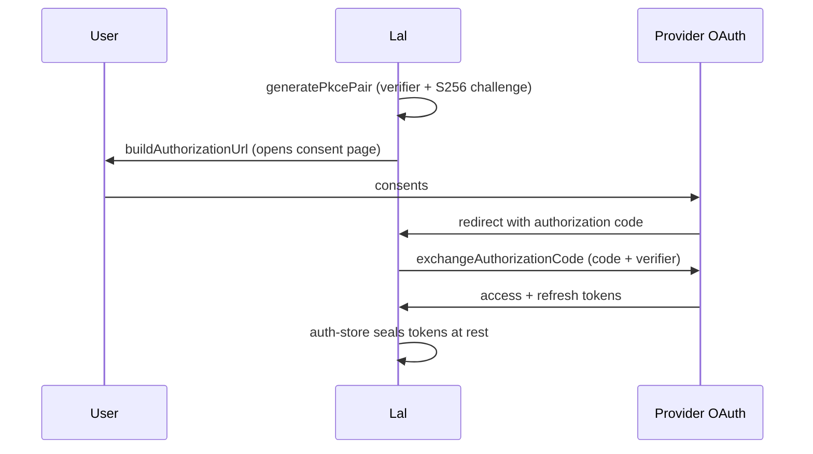

# Subscription OAuth for Lal providers

This directory implements the subscription-OAuth path from the
`endopi-provider-registry-and-oauth` design (milestone M3, phases 3 and 4):
the authorization-code-with-PKCE flow and the per-provider encrypted
auth-storage exo.
It is the genuinely-missing, unblocked slice of that design.
The provider-registry refactor and the Lal-vs-Genie consolidation policy
question the design also raises are deliberately out of scope here.

## What subscription OAuth buys

A user who already pays for a Claude Pro/Max, ChatGPT Plus/Pro, or GitHub
Copilot subscription can authenticate Lal against that same account over
OAuth, without minting a separate API key.
Subscription tokens are account-level rather than workspace-level, so they
carry a broader blast radius than API keys: the design frames them as
equivalent to logging in on the web, and a consuming surface should confirm
on first use and store them with care.
The auth-storage exo here is that careful store.

## Modules

- `pkce.js`: Proof Key for Code Exchange (RFC 7636), S256 method only.
  Generates a code verifier and derives its code challenge.
  Randomness and SHA-256 are injected, so the module is pure and testable.
- `flow.js`: the authorization-code flow.
  Builds the authorization URL, exchanges an authorization code (with its
  PKCE verifier) for tokens, and refreshes tokens.
  `fetch` and the clock are injected.
- `auth-store.js`: the per-provider encrypted credential store, a `makeExo`
  exo keyed by provider name and account id.
  It seals credentials on the way in and unseals on the way out through an
  injected cipher, so at-rest state is ciphertext only.
- `node-crypto.js`: the one module that reaches for `node:crypto`.
  It provides the SHA-256 and randomness the PKCE flow needs, an
  AES-256-GCM authenticated cipher, and a scrypt passphrase key derivation.
- `base64url.js`: base64url-without-padding, as PKCE requires.
- `index.js`: the public surface, including `makeOAuthClient`, which binds a
  flow to one provider configuration.

## Flow

The redirect target is a Familiar pane in the Electron build or a local
`127.0.0.1` HTTP listener in the daemon-only build, per the design.
Standing up that listener is a separate concern from this module, which owns
the flow arithmetic and the credential sealing.

## Injected capabilities

Every side-effecting capability is a constructor or call argument rather than
ambient authority, in keeping with the daemon's powers discipline
(`packages/daemon/src/daemon-node-powers.js`).
The pure modules never import `node:crypto`; they take the capabilities that
`node-crypto.js` produces.
This keeps the flow and the store testable with fakes and free of host
coupling, and it lets a caller substitute a hardware-backed cipher for the
software AES-256-GCM one.

## Follow-ups (out of scope here)

- Persist the sealed credential bytes into the daemon's formula-graph store,
  so credentials survive a restart.
  This exo owns the seal/unseal discipline and the in-memory sealed map;
  durable persistence layers on top without changing the interface.
- Extend the daemon `CryptoPowers` with an encrypt-at-rest and
  key-derivation surface, and derive the store's key from the host passphrase
  or a hardware key there, rather than from `deriveKeyFromPassphrase` alone.
- Add verified provider presets (endpoints, client ids, scopes) for Claude,
  ChatGPT, and GitHub Copilot; this module carries the flow but embeds no
  provider constants.
- Wire a subscription provider's bearer token from the store into the
  provider registry so the agent loop can use it, once the registry refactor
  (the design's phase 1) lands.
