# @endo/rps-demo

A two-player Rock Paper Scissors game, written as a small Endo daemon
plugin.
The whole package fits in two source files and exists for one purpose:
to show, end to end, how to author a distributed game as an Endo
daemon plugin.

The game itself is the classic Rock Paper Scissors comparison.
Rather than modeling the "three throws" countdown, the demo
synchronizes the reveal of both players' picks for the same effect:
the attacker commits a choice and hands the defender a capability
that can reveal a counter-choice exactly once.
The interesting part is the shape of the code: a pure scoring function,
a daemon-loadable module that wraps it in an `Exo` remotable with
`@endo/patterns` guards, and the capability discipline that lets two
mutually-suspicious agents play a fair round.

Adapted from the `fun-games` package in
[endojs/playground#14](https://github.com/endojs/playground/pull/14).

## What you can read first

In rough order of "where the lesson lives":

- [`src/score.js`](./src/score.js) — the rules, as a pure function from a
  pair of choices to a result.
  No SES, no exo, no CapTP: just data and a switch table.
  This is the part you would change if you were inventing a new game.
- [`src/rock-paper-scissors.js`](./src/rock-paper-scissors.js) — the
  daemon plugin.
  Exports `make()`; the daemon calls it and stores the returned
  remotable under a pet name.
  Wraps `score` in two `makeExo` remotables (`Attacker`,
  `Defender`) and guards their methods with `M.interface(...)`
  patterns so untrusted callers cannot smuggle in bogus choices.
- [`index.js`](./index.js) — the public surface for in-process callers.
  Re-exports `make`, `score`, and the type aliases.
- [`test/score.test.js`](./test/score.test.js) — exhaustive unit tests
  for the scoring function (every pair, every outcome).
- [`test/rock-paper-scissors.test.js`](./test/rock-paper-scissors.test.js)
  — behavior tests against the exo: pattern-guard rejections,
  one-shot attack discipline, parallel games, late-bound `getResult`.

## The capability sketch

```mermaid
flowchart LR
    attacker([attacker]) -->|attack&#40;c1&#41;| Attacker
    Attacker -->|returns| Defender
    Defender -->|defend&#40;c2&#41;| score
    Attacker -->|getResult&#40;&#41;| Promise
    score -->|resolves with| Promise
```



The `Attacker` is a one-shot capability: the first `attack(choice)`
records the attacker's pick and returns a fresh `Defender`;
any second `attack` fails.
The `Defender` carries the attacker's choice in a closure, but only
exposes `defend(choice)`, so a holder cannot read or replay the
attacker's pick.
Both choices are compared inside the daemon, where `score` is the
sole authority that decides the winner.

This is why the demo is interesting as a distributed-game pattern:
neither player has to trust the other with their choice, because the
daemon is the trusted third party that both players speak to over
CapTP, and the only thing the other player ever receives is a
`Defender` remotable, not the choice itself.

## Running it

### As a unit / behavior test

```sh
cd packages/rps-demo
yarn test
```

The tests exercise both the pure scoring function and the exo
behavior end-to-end through `@endo/eventual-send`.

### As an Endo daemon plugin

With an Endo daemon running locally and `@endo/cli` on `$PATH`:

```sh
# Bring up a fresh daemon.
endo restart

# Load the plugin into a worker. The daemon imports
# `src/rock-paper-scissors.js`, calls its `make()` export, and stores
# the returned remotable under the pet name `rps`.
endo make packages/rps-demo/src/rock-paper-scissors.js --name rps

# Two parties can now play a round against `rps`. With one agent's
# host you might do:
endo eval 'E(rps).attack("rock")' rps --name d
endo eval 'E(d).defend("paper")' d
# => { winner: 2, why: 'paper covers rock' }
```

The pet-name flow (`rps`, `d`) is the daemon's view of the same
remotables the unit tests reach for in-process.
Whether the second player is another local host, a guest agent, or a
remote Endo over CapTP is a deployment choice; the plugin's contract
is identical.

## Why this shape

The pieces map to recurring Endo authoring conventions:

- **Pure core, guarded shell.**
  `score` has no SES dependencies and is trivially testable;
  `rock-paper-scissors.js` adds the `Exo` and pattern guards at the
  capability boundary.
  Bugs in scoring rules are unit-test bugs;
  bugs in the boundary are integration-test bugs.
- **`makeExo` over `Far`.**
  The remotables ship with method guards (`M.interface(...)`) that
  reject malformed calls at the boundary.
  `makeExo` also provides `__getMethodNames__()` for CapTP
  introspection.
- **One-shot capabilities.**
  Handing out a fresh `Defender` per `attack` keeps the
  attacker's choice from being read; refusing a second
  `attack` keeps the game from being silently replayed.
- **`make(powers?)` entry point.**
  The daemon's convention for loadable plugins is a module that
  exports `make`; this game does not need any powers, so `make` takes
  no arguments, but the shape is what the daemon expects.

## Not in scope here

This package is a teaching demo, not a finished UI.
The original `fun-games` package in `endojs/playground` includes a
browser chat surface and a CLI front-end;
those are deliberately omitted so the demo stays focused on the
plugin and the game logic.
A future demo can compose this plugin with a chat or web surface
without changing the contract.
