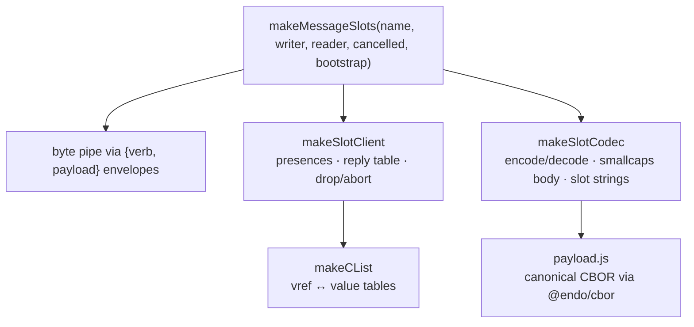

# @endo/slots

JavaScript client for the slot-machine wire protocol — a flat
four-verb (`deliver` / `resolve` / `drop` / `abort`) capability bus
designed to interoperate byte-for-byte with the Rust crate at
`rust/endo/slots`.

## Architecture



## Quick start

```js
import { makeMessageSlots } from '@endo/slots';

const { getBootstrap, closed } = makeMessageSlots(
  'my-session',
  envelopeWriter,   // .next({verb, payload}) sends a frame
  envelopeReader,   // AsyncIterable<{verb, payload}>
  cancelledP,
  rootObject,       // exported as Local Object position 1
);

const remoteRoot = getBootstrap();
const reply = await E(remoteRoot).method(args);
```

`makeMessageSlots` is a drop-in analogue for `makeMessageCapTP`
from `@endo/daemon/connection.js` — same signature, same return
shape.  See `packages/daemon/test/bench-results/slot-machine-status.md`
for the splice plan.

## Wire-protocol invariants

- **Canonical CBOR.**  Minimal-head integers (RFC 8949 §4.2), no
  indefinite-length containers, no maps, no floats.  Every encoder
  is byte-deterministic; the Rust crate produces and accepts the
  same byte sequences.
- **Descriptors.**  A descriptor is the 2-element CBOR array
  `[kindByte, position]`.  `kindByte = (kind << 1) | direction`, with
  `direction` in bit 0 (`Local=0`, `Remote=1`) and `kind` in bits 1-2
  (`Object=0`, `Promise=1`, `Answer=2`, `Device=3`).  Reserved bits
  are rejected on decode.
- **Slot strings.**  Marshal-side slot identifiers are canonical
  `/^s(0|[1-9][0-9]*)$/`.  Non-canonical forms (`s00`, `s+1`,
  `s1e2`) are rejected.
- **Position-1 root.**  Both peers export their session root as
  `{ Local, Object, position: 1 }`.  No explicit handshake — the
  Rust supervisor's kref registry unifies the two.  See
  `src/bootstrap.js`.
- **Pinned fixtures.**  Hex-equality fixtures live in both
  `test/payload.test.js` and `rust/endo/slots/src/wire/payload.rs`
  for `deliver`, `resolve`, `drop`, `abort` plus the `descriptor`
  reference and `SessionId` digests.  Either side will fail-loudly
  if the wire shape drifts.

## Calling convention

`deliver` carries **one flat passable argument vector** in its body,
following the OCapN **Body Content Format**
(`packages/ocapn/docs/cbor-encoding.md` § Body Content Format) and
mirroring `@endo/ocapn`'s client (`packages/ocapn/src/client/ocapn.js`,
`packages/ocapn/src/selector.js`):

- **Function application** — `E(fn)(...args)` — sends its arguments
  unchanged: the body is exactly `[...args]`, no selector.
- **String-named method invocation** — `E(obj).method(...args)` —
  prepends the method's passable-symbol selector
  (`passableSymbolForName(method)`), so the body is
  `[selector, ...args]`.
- **Symbol-named methods are unreachable.**  A symbol method name has
  no wire selector, so slot-machine rejects it at the sender rather
  than delivering it.

The convention is **enforced independently on receipt** — the receiver
does not rely on the wire (or a well-behaved sender) to have honoured
it.  On receipt the target's own shape decides dispatch, exactly as
`@endo/ocapn`'s `invokeDeliver` does:

- a **function** Exo receives the complete argument vector through
  `applyFunction`;
- an **object** Exo validates and decodes the leading selector to a
  string method name and dispatches through `applyMethod`.  A leading
  argument that is not a passable symbol, that decodes to no registered
  name, or whose name is reserved (`@@`, the well-known symbols) is
  rejected by `getSelectorName` regardless of what the peer sent.

There is no `__call__` sentinel and no `[method, args]` body shape —
both are retired in favour of the flat vector above.

**Property access (`op:get`) today rides on `deliver`; the separate
OCapN lanes are the target shape.**  OCapN provides `op:get`,
`op:index`, and `op:untag` as lanes distinct from message delivery
(field access, positional indexing, and tag stripping against
`Struct` / `List` / tagged targets).  Slot-machine's intent is to
**emulate those lanes too**.  What is modelled *today* is only
`op:get`, and only because it is the single such lane that JavaScript
eventual-send exposes: `E(p).prop` is the sole non-delivery operation
`HandledPromise`/`E` can express (`HandledPromise.get`), so it is the
only one there is a JS surface to carry.  It currently resolves through
a `deliver` of a conventional `__get__` string method carrying the
property name as its sole argument (so, like any method call, its
selector is prepended), which keeps the four-verb bus (`deliver` /
`resolve` / `drop` / `abort`) intact.

`op:index` and `op:untag` have **no eventual-send surface** to invoke
them from JavaScript yet, so they are not modelled; and promoting even
`op:get` to a first-class wire operation (rather than the `__get__`
call it is carried as today) would have to be mirrored in the Rust
supervisor's verb set (`rust/endo/slots/src/wire`).  Designing the
distinct-lane emulation — including any eventual-send extension needed
to express `op:index` / `op:untag` — is tracked as follow-up work.

## Daemon integration

The worker-side splice is in `packages/daemon/src/bus-worker-node-raw.js`,
gated by `ENDO_USE_SLOT_MACHINE=1`.  When the flag is unset (the
default), the worker speaks CapTP exactly as before.  The matching
daemon-side splice in `bus-manager-endor.js` is described in
`packages/daemon/test/bench-results/slot-machine-splice-plan.md`.

## Layered API

If `makeMessageSlots` is too high-level, drop down to:

- `makeSlotClient({ clist, codec, sendEnvelope })` — `HandledPromise`
  presences, reply-promise table, drop / abort routing, optional
  `FinalizationRegistry` auto-drop.
- `makeSlotCodec({ clist, makePresence })` — `@endo/marshal`
  wrapper that produces `deliver` / `resolve` payload bytes.
- `makeCList({ label })` — bidirectional value<->descriptor map with
  monotonic position counters.
- `bootstrap`, `LOCAL_ROOT`, `REMOTE_ROOT` — the position-1 root
  convention.
- `encodeDeliverPayload` / `decodeDeliverPayload` etc. — the raw
  wire codec.

## Testing

```sh
yarn test         # 82 unit tests
yarn lint         # eslint + tsc
```

Tests run under SES lockdown (`ses-ava` + `prepare-endo.js`).
