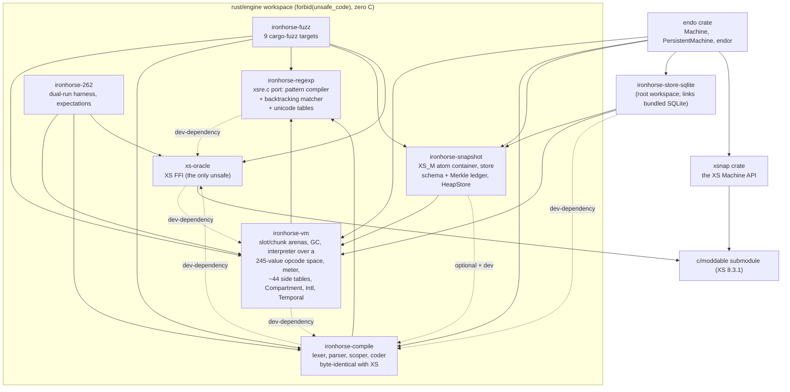

# IronHorse engine: deep architecture review

| | |
|---|---|
| **Created** | 2026-09-02 |
| **Author** | Claude Code architecture-review fleet (prompted by kumavis) |
| **Status** | Reference |
| **Scope** | `rust/engine` at commit `97d8de25`, plus `rust/endo/ironhorse-store-sqlite` and `rust/endo/src/ironhorse_engine.rs`. The XS oracle could not be built in this environment, so **no differential run against XS was performed**; every parity claim below is read from the harness code, not observed. Appendix C is the full scope caveat. |
| **Method** | See [Method](#method) below. 191 findings, each verified by two independent adversarial agents. |

## Method

39 region mappers read the tree and produced 522 candidate leads and a
per-region map.
14 lens reviewers, each given the maps plus the design baseline, produced a
300 to 700 word architectural assessment, a strengths list, and 222 findings.
31 were exact duplicates (same file, line within 40, same category) and were
merged, leaving 191.
Every one of the 191 was then verified by two independent adversarial agents: a
code-truth refuter instructed to default to "refuted" whenever it could not
confirm a claim against the source, and an architecture-significance judge
holding veto power over severity and framing, with a third tiebreaker agent on
the 8 batches where the two disagreed.
The outcome and its honest interpretation, including the zero-refutation rate,
are in Appendix B.

## Companion documents

The 14 lens reports carry the full per-theme assessments, the strengths lists,
and the executable probes quoted throughout this document:

- [`lens-determinism-consensus.md`](architecture-review/lenses/determinism-consensus.md)
- [`lens-robustness-untrusted-input.md`](architecture-review/lenses/robustness-untrusted-input.md)
- [`lens-gc-roots-heap-integrity.md`](architecture-review/lenses/gc-roots-heap-integrity.md)
- [`lens-snapshot-persistence-seam.md`](architecture-review/lenses/snapshot-persistence-seam.md)
- [`lens-metering-architecture.md`](architecture-review/lenses/metering-architecture.md)
- [`lens-error-model-exceptions.md`](architecture-review/lenses/error-model-exceptions.md)
- [`lens-reentrancy-control-flow.md`](architecture-review/lenses/reentrancy-control-flow.md)
- [`lens-security-sandbox.md`](architecture-review/lenses/security-sandbox.md)
- [`lens-compiler-pipeline.md`](architecture-review/lenses/compiler-pipeline.md)
- [`lens-modularity-maintainability.md`](architecture-review/lenses/modularity-maintainability.md)
- [`lens-api-boundaries-crate-layering.md`](architecture-review/lenses/api-boundaries-crate-layering.md)
- [`lens-verification-strategy.md`](architecture-review/lenses/verification-strategy.md)
- [`lens-design-drift-docs.md`](architecture-review/lenses/design-drift-docs.md)
- [`lens-performance-architecture.md`](architecture-review/lenses/performance-architecture.md)

The 39 region maps, one per region of the tree, are in
[`architecture-review/maps/`](architecture-review/maps/).
They carry the mechanism-level detail this document summarises, plus each
mapper's note on what it did not read.

Three review-process terms appear inside findings and are defined once here.
A *region map* is one mapper's mechanism-level read of one region of the tree,
filed in `architecture-review/maps/`.
A *lens* is one of the 14 thematic reviews listed above.
A *wave* is one of the project's own prior review rounds, numbered in
`designs/ironhorse-snapshot-store-seam.md`; "this wave" means the present
review.
House vocabulary (crank, computron, vat, atom, quiescent, MOP, that is the
metaobject protocol) is defined in `designs/ironhorse-engine.md`.
Five further terms are this document's own and are used repeatedly.
The *metamorphic suite* is `ironhorse-snapshot`'s `store_suite`, which runs one
crank sequence through seven storage variants and compares the results.
The *trophy ledger* is the 24 checked-in `ironhorse-vm/tests/finding_*.rs`
regressions distilled from fuzz findings.
The *expectation ratchet* is `ironhorse-262`'s `--expectations` mechanism, which
is meant to make a covered-to-skip regression fail the build.
The *roster* is the single declarative list of side tables proposed in F052 and
W5.1, from which every enumeration over them would be generated.
The *mechanical floor* is the set of automated gates a change must pass with no
human in the loop: formatting, lints, a second platform, a release lane.

---

## Contents

- [1. Executive summary](#1-executive-summary)
- [2. Architecture as built](#2-architecture-as-built) (2.1 crate graph, 2.2
  value and heap model, 2.3 dispatch, 2.4 metering, 2.5 snapshot seam, 2.6
  compiler and regexp, 2.7 harness, 2.8 the `rust/endo` embedding, 2.9 what is
  done well)
- [3. Findings by theme](#3-findings-by-theme) (3.1 robustness, 3.2 error model,
  3.3 compiler, 3.4 re-entrancy, 3.5 metering, 3.6 determinism, 3.7 security,
  3.8 verification, 3.9 snapshot seam, 3.10 performance, 3.11 design drift,
  3.12 GC and heap, 3.13 API boundaries, 3.14 modularity)
- [4. Recommended architectural direction](#4-recommended-architectural-direction)
  (W0 mechanical floor, W1 split `Halt`, W2 one budget, W3 persistence gates,
  W4 cost table, W5 decompose, W6 open decisions, W7 unscheduled)
- [Appendix A: full findings index](#appendix-a-full-findings-index)
- [Appendix B: verification statistics](#appendix-b-verification-statistics-and-how-to-read-them)
- [Appendix C: what this review did not cover](#appendix-c-what-this-review-did-not-cover)

---

## 1. Executive summary

**IronHorse is not yet the engine its design describes.**
The two properties it exists to have, deterministically bounded execution and
cross-host reproducibility, are each broken by a small number of structural
defects, and the verification architecture is currently unable to observe most
of them.
None of this is subtle porting error.
The recurring shape is an invariant that was diagnosed correctly, fixed at one
site, and left as a convention everywhere else, in a codebase whose only
enforcement mechanism for such conventions is a reviewer noticing the next site.

The substrate underneath is right, and right in ways most engines are not:
`#![forbid(unsafe_code)]` on every engine crate, index arenas instead of a
pointer graph, no ambient authority at all, a persistence seam with proof tokens
and one shared bounds gate, and two mechanical source-derived nets that force a
classification for every new heap field.
Section 2.9 lists the specifics, and the project's own retrospective at
`designs/ironhorse-snapshot-store-seam.md:2504` is the best artifact in the
repository: it decomposes why 1,093 green tests missed the previous wave's
defects, and it is why this review could be specific.

|  | critical | high | medium | low | total |
|---|---|---|---|---|---|
| Findings | 6 | 57 | 73 | 55 | 191 |

101 of the 191 match a record that already existed, in the project's prior-wave
ledger, in a design document, or in this review's own region maps; Appendix B
breaks that number down, because the three sources carry very different weight.
Three findings are recorded in the project's ledger as *fixed* and are open
again: **F004** (`designs/ironhorse-snapshot-store-seam.md:1313`, declared
closed at `:2058`), **F022** (W6-10 and W6-11, recorded FIXED at `:2623`) and
**F073** (fixed at one site in wave 5, never generalised).

**The findings that matter most.**

1. **Guest code aborts the process, not the crank** (F018/F002/F019, F003, F017;
   critical).
   `DISPATCH_REENTRY_LIMIT` bounds exactly one recursion family; at least seven
   others are guest-reachable and unbounded, including the proxy MOP over a
   spec-legal prototype cycle, `JSON.parse`, the host-boundary renderer, and the
   whole compile front end.
   A Rust stack overflow is a SIGABRT, so `catch_unwind` cannot contain it and
   the design's "a panic is a crashed crank, not a compromised daemon" does not
   apply.
   Four lines of ordinary JavaScript kill the worker, at a depth that depends on
   host stack size and build profile.
   Fixed by **W2**.

2. **The meter bounds nothing in the shipped configuration** (F014/F020, F012,
   F073, F010/F076, F051; critical to high in aggregate).
   No path in `rust/endo` arms a meter, `check_meter` returns `Continue` when no
   host is installed, and `step_limit` is `u64::MAX` in production.
   Even an armed meter would not help: all 43 check points are inside the
   dispatch loop, so regexp backtracking, compilation and every allocating
   built-in run to completion before a computron is charged.
   A measured 16,000-iteration concatenation retains 2.05 GB for 343,678
   computrons; 80,000 iterations OOM-kills the process.
   Fixed by **W2** and **W4**.

3. **The error and control-transfer model leaks into results** (F004, F005,
   F006, F007, F001, F023, F024; high).
   29 engine-raised `TypeError`s are uncatchable by guest `try`/`catch`; promise
   executors that hit one reject with `undefined`; five dispatch sites return a
   `Halt::Resume` so a `try`/`catch` around a throwing setter is silently
   skipped; `null.f` evaluates to `undefined` instead of throwing.
   Each is a wrong answer, not a refusal, in an engine whose stated rule is that
   it declines rather than answering wrongly.
   Fixed by **W1**.

4. **Valid JavaScript produces silent wrong answers at four seams** (F016, F085,
   F084, F087, F062; high).
   `var o = {"\uD800":1, "\uD801":2}; Object.keys(o).length` evaluates to 1,
   because the compiler's symbol slot is a Rust `String` and lone surrogates fold
   to U+FFFD; the VM's own `str_text` seam (35 call sites) does the same to
   guest-observable values; `RegExp.exec().index` reports UTF-8 byte offsets on
   non-ASCII subjects; an array length above 2^31 is reported as a negative
   number.
   No halt, no diagnostic, and every validator agrees on the wrong value, so no
   determinism gate can ever catch these.
   Individually scheduled; see **W7**.

5. **Cross-host determinism is unenforced and already broken in three places**
   (F080, F081 high; F083/F070, F082/F115 medium).
   22 `Math` transcendentals call the platform libm, NaN payloads are never
   canonicalised and are persisted verbatim, and the root and engine workspaces
   resolve 22 of 48 shared crates differently, including the ICU stack behind
   `Intl.Segmenter`.
   No CI lane runs on a second OS or architecture and `--repeat N` is invoked by
   no workflow, so nothing would notice a fourth leak arriving.
   Fixed by **W0** and **W6**.

6. **The persist gate accepts machines that fork the durable heap** (F011,
   F030/F022, F047; high).
   A crank halted by `MeterAbort` or `StepLimit` at a top-level check passes
   `is_quiescent()` and every persist verb; so does a crank whose completion
   value is a `Symbol`, because the synthetic host-boundary throw bypasses the
   register clear.
   Reproduced end to end: after one boundary collection the continuous machine
   and its resumed twin hold different live counts, free lists and canonical
   snapshot bytes while agreeing on every result and computron the differential
   suites compare.
   The shipped embedder is shielded because it only checkpoints completed
   cranks, so this is a persist-gate contract hole rather than a live daemon
   fork today.
   Fixed by **W3**.

7. **The engine controls its own exemption from the oracle** (F008, F009, F028,
   F027/F071/F140; high).
   `Halt::Unsupported` carries 269 distinct labels, at least 23 of which are
   interpreter-invariant violations rather than unported features, and both
   differential instruments discard the whole channel unexamined.
   `Agreement::OracleOnlyComplete` is an unconditional skip, and test262 positive
   cases signal failure by throwing, so the dominant wrong-answer failure mode
   lands in the skip bucket.
   This is the structural reason the defects above survived six review waves.
   Fixed by **W1**.

8. **Hardened JavaScript is not yet a security boundary** (F015, F057, F058,
   F059, F061; high).
   `harden()` can return successfully leaving the object mutable; a frozen
   `globalThis` is still writable through a bare identifier assignment; no array,
   `Map`, typed array or proxy can be frozen at all; and `Compartment::evaluate`
   builds a fresh `Interp` per call, so the "shared frozen intrinsics" the design
   requires has no seam to land on.
   Fixed by **W6**.

**What to do first.**

| Move | Stream | Size | Unblocks | First commit |
|---|---|---|---|---|
| Mechanical floor: fmt, clippy, release lane, second platform | W0 | small, 5 to 8 commits | everything else | fix `intl_number.rs:779`, the one deny-level clippy hit |
| Split `Halt`; make the harness able to fail | W1 | medium, 6 to 10 | the whole error theme, plus the blind spot that hid it | add `catchable_type_error_msg` so no diagnostic is lost |
| One budget, one chokepoint, one ceiling | W2 | medium, 7 to 12 | the process-abort class | the `Interp::native_depth` RAII guard |
| Persistence gate on the data path | W3 | medium, 7 to 12 | the durable-fork class | `last_crank_completed` as the first conjunct of `is_quiescent` |
| Reified cost table, and arm the meter | W4 | medium, 6 to 10 | the determinism-per-release claim | the `cost_table` module plus its digest test |
| Roster first, then decompose `interp.rs` | W5 | large, 15+ | every future side table | the `side_tables!` roster |
| Decide four open layering questions | W6 | decisions, not code | realm, engine trait, integrity model, determinism scope | write the four decisions down |

W0 and W1 are the prerequisites: W0 because no diff is reviewable until
`cargo fmt` has run, W1 because it repairs the instrument that would otherwise
fail to notice the rest.
W2, W3 and W4 are then independent of each other; W5 is strictly after W0; W6's
four decisions can be made in week one and should be, because they are currently
being answered by accident.

---

## 2. Architecture as built

### 2.1 The crate graph

The design's diagram (`designs/ironhorse-engine.md:265`) names two crates that do
not exist (`ironhorse-ses`, `ironhorse-debug`), omits two that do
(`ironhorse-regexp`, `ironhorse-store-sqlite`), and draws three edges that run
the other way or not at all.
The graph as the manifests define it:



The layering that matters is better than the design says.
`ironhorse-vm` owns a `SourceCompiler` trait
(`rust/engine/ironhorse-vm/src/interp.rs:89`) and takes `ironhorse-compile` only
as a dev-dependency, so the VM does not depend on a front end.
The inversion is not absolute, and the diagram above draws the three exceptions
that a reader checking that sentence will otherwise find in the manifests:
`ironhorse-snapshot` carries `ironhorse-compile` as an optional dependency
behind its `store-suite` feature and again as a dev-dependency,
`ironhorse-store-sqlite` dev-depends on it too, and `xs-oracle`, the graph's one
leaf, dev-depends back on `ironhorse-vm`.
`ironhorse-regexp` and `ironhorse-compile` are clean leaves.
`ironhorse-store-sqlite` sits deliberately outside the engine workspace because
it links C, preserving the engine's zero-unsafe, zero-C budget, with the reason
written in its manifest.
The two real layering problems are that the engine and root workspaces are
separate Cargo workspaces with separately resolved lockfiles (F070, F083), and
that `rust/endo` wires the engine crates directly rather than behind any engine
abstraction (F068).

Sizes, from the census: `ironhorse-vm` 53,948 source lines of which
`interp.rs` is 44,942, holding one `impl Interp` of about 34,000 lines
(`interp.rs:5184` to `:39169`) plus two smaller ones at `:43488` and `:44543`,
with free functions and consts in between;
`ironhorse-compile` 17,426; `ironhorse-snapshot` 16,323; `ironhorse-regexp`
16,094 (4,193 hand-written); `ironhorse-262` 9,775; `ironhorse-fuzz` 5,226;
`xs-oracle` 879 plus a C shim.

### 2.2 Value and heap model

`Slot` (`rust/engine/ironhorse-vm/src/value.rs:298`) is the `txSlot` analogue: a
kind tag, a payload union, a `u16` id, and a flag byte, 24 bytes in practice
though its doc claims 32 (F121).
`SlotArena` is an index arena with a free list, a free bitmap, mark bits, dirty
bits, and per-page residency state for the lazy store path.
`ChunkArena` is an append-only byte arena addressed by `ChunkOffset(u32)` with a
`u32` length header per block; strings are stored as UTF-16BE code units, a
2026-07-06 design revision whose stated purpose was O(1) code-unit access.

XS's slot-union arms become roughly 44 side tables on `Interp`, keyed by
`SlotIndex`: `arrays`, `collections`, `functions`, `proxies`, `promises`,
`generators`, `typed_arrays`, `regexps`, `dates`, the Temporal and Intl families,
and so on.
`Interp` itself is 160 fields, 47 of them `HashMap`s, 4,032 bytes.
This is the single most consequential structural decision in the engine: it makes
the heap safe and snapshot-able, and it means that every cross-cutting operation
(GC visitation, pruning, chunk remap, snapshot emit, snapshot decode, bounds
gate, store section, restore verb) is a hand-written enumeration over the same
roster, ten times over, in two crates (F052, F128, F130).

Garbage collection is split well: `rust/engine/ironhorse-vm/src/gc.rs` is 449
lines, 292 of them code, of pure mark/ephemeron/sweep/compact over the arenas,
with the side tables quarantined behind a `GcHooks` trait.
Root order is sorted and deduped, the sweep is index-ordered, and compaction
validates every live block before it takes the byte space.
Two collectors exist: the exact `collect_garbage` and a page-conservative
`partial_collect` in the snapshot crate driven by counted side-table reference
pages (`bulk.rs`).
Only the partial collector has a production caller, and it never compacts chunk
space (F090, F010/F076, F123).

### 2.3 Dispatch and re-entrancy

`dispatch_at_inner` (`rust/engine/ironhorse-vm/src/interp.rs:11292` to `:15862`)
is a 4,571 line `match` over a 245-value opcode space, 227 of which the loop
names, with a bounds-checked operand decoder: every instruction re-checks
`pc + ilen > len` before reading, and an unknown opcode is a named
`Halt::Decode`.
Measured throughput is 18 to 24 ns per dispatched opcode.
Two properties give that number its floor.
Nothing in the loop is execution-count-dependent, so the no-JIT rule holds by
construction; and there is no dynamic dispatch on the hot path at all, because
`Native` and `NativeMethod` are closed enums matched statically and the only
`dyn` values in the interpreter are `meter_host`, `source_compiler` and the GC
visitor closures, none of which the dispatch arms touch.

Nested guest execution (callbacks, generator resume, async steps, cross-segment
calls) funnels through one `dispatch_at` wrapper that brackets `dispatch_depth`
against `DISPATCH_REENTRY_LIMIT = 64`.
A nested loop knows the call depth it entered at (`return_depth`) and refuses to
consume a `CatchJump` belonging to a frame below it, returning
`Halt::Resume(target)` upward instead; the `dispatch_result!` macro
(`interp.rs:3573`) encodes that protocol at 73 sites.
Suspension moves a whole activation (locals, id map, args, `this`, env, strict
flag, result, stack slice, frame-relative rebased handlers) into a `SavedFrame`.
This design is right, and the suspend/resume symmetry is genuinely hard work done
correctly.
The defects along this axis (F001, F006, F023, F024, F092) are all failures to
apply the protocol uniformly, not failures of the protocol.

### 2.4 Metering

`Meter` (`rust/engine/ironhorse-vm/src/meter.rs`, 370 lines) is a 16.16
fixed-point `u64` incremented at XS's points, checked only at loop-closing
points, with a faithful reproduction of `fxCheckMetering` including the
overflow-wrap guard.
It is small, pure-integer, and well tested; meter state across suspend is
correctly modelled with three distinct resume forms (`begin`, `rearm`,
`reattach_meter_host`) and locked by tests.
`COST_TABLE_VERSION` is stamped into the snapshot `METR` atom and refused
fail-closed on resume.

What does not exist is a cost table.
The weights are 214 free-standing `pub const *_METERING` values across
`ironhorse-vm`, `ironhorse-regexp` and `ironhorse-compile` under two
uncoordinated version strings, no artifact binds the
version string to the weights, and the per-opcode table the design describes is
absent: the loop charges a flat `CODE_METERING` per opcode while `cost.rs`
already classifies opcodes by work shape and feeds nothing (F031, F181, F156).

### 2.5 Snapshot and persistence seam

This is the strongest subsystem in the engine.
There is a single validated-image type, `ValidatedSnapshot`
(`rust/engine/ironhorse-snapshot/src/image.rs:411`), whose constructor is
`pub(crate)` and which restore consumes by value; one semantic bounds gate,
`check_image_slot_bounds` (`image.rs:3478`), shared verbatim by the container
path, the eager store path, and the lazy attach path; and a side-table ledger
(`sidetable.rs`) whose classification is reconciled mechanically against
`Interp`'s field list parsed out of the VM source.
Determinism hygiene is uniform: about 25 emitters all sort by owner, `f64`
travels as raw bits, page edges and reachability are `BTreeSet`s, and no `usize`
is ever serialized.
`format.rs` is a real format specification with a per-version log naming what
each bump added.

Above the container sits the store: rows keyed by slot page and chunk extent,
domain-separated leaf hashes, per-class Merkle trees, a seal chain, and a
schema-23 verify-then-restamp migration ladder.
`HeapStore` has three backends (memory, file, SQLite) sharing one integrity
implementation and one backend-parameterized acceptance suite.
The seam's failures are not in what it validates but in where the preconditions
live: the gate is attached to three convenience verbs rather than the data path
(F047), `is_quiescent` is a table-emptiness test standing in for a lifecycle
property (F011), payload canonicality stops at the six oldest atoms (F048), and
the bounds gate is one predicate short on live edges into free records (F046).

### 2.6 Compiler and regexp

`ironhorse-compile` is a legible transliteration: every method names its
`xsCode.c`/`xsSyntaxical.c`/`xsScope.c`/`xsLexical.c` counterpart, flag bits and
token discriminants are XS's exact values, and the bar is byte identity of both
the bytecode and the `SYMB` atom against the oracle.
The counterpart naming is load-bearing rather than decorative: because each
method also explains *why* XS behaves as it does, a reader can tell a deliberate
choice from an accident without running the oracle, which is exactly what the
oracle-free environment of this review had to do.
`scoper.rs:2237` is the clearest specimen, reproducing a known XS
frame-accounting bug on purpose and saying so.
Determinism inside the crate is clean: no `HashMap` iteration reaches output,
`f64` is emitted as raw bits, address-keyed side tables are lookup-only.
Its architectural problems are the AST symbol representation (F016), totality
(the scoper and coder answer with 33 `panic!`s where the parser has a `Result`
channel, F063), recursion bounds (F017), a dead parse meter (F066/F051), and an
`O(n^2)` `Coder::optimize` measured at 12.8 s for 1 MB of source (F065).

`ironhorse-regexp` is a separate leaf crate porting `xsre.c`: a
parse-measure-code compiler and a backtracking match VM, both metering-exact
against the pin.
It is used twice: by the VM's `RegExp` surface, and eagerly by the lexer, which
fully compiles every regexp literal at lex time and discards the program
(F152, F187).

### 2.7 Harness, fuzzing, oracle

`xs-oracle` compiles and runs XS through an audited FFI shim and is the only
crate permitted `unsafe`.
`ironhorse-262` drives a dual run of the same source through both engines and
records a four-valued agreement plus computron agreement, with an expectation
ratchet, a report generator, and a whole-tree sweep binary.
`ironhorse-fuzz` declares nine libFuzzer targets, five of them differential.
The harness discipline is honest: skips are named and reported, fuzz trophies
become executable regressions with full provenance, and several trophies state
plainly that the port was right and the oracle harness was wrong.

The architectural problem is what the instruments can fail on.
`Halt::Unsupported` is discarded unexamined by both differential comparators,
one whole divergence direction is an unconditional skip, the expectation ratchet
has no committed list and no CI caller, and the metering doctrine is inverted in
the gates: about 1,600 checked-in cases hard-gate XS computron equality that the
design calls a non-goal (F008, F009, F028, F036, F050).

### 2.8 The embedding in `rust/endo`

`ironhorse_engine::Machine` is a stateless facade: `evaluate` constructs a fresh
`Interp`, links intrinsics, runs, and drops it.
`PersistentMachine` is the real stateful path: it owns a `StoreSession` over the
SQLite backend, compiles each crank's source with `compile_atoms_with`, relinks
it, runs it, and checkpoints on a cadence, rewinding the session on any halt.
`endor run -e ironhorse <file>` reaches it; the worker envelope protocol returns
`Unavailable` and is unwired.

There is no engine trait.
`Engine` in `rust/endo/src/engine.rs:10` has two XS-typed variants; the only two
traits in `rust/endo/src` are `HttpClient` and `GitCas`; `-e ironhorse` is a
string match in `bin/endor.rs`.
`ironhorse_engine::Machine` has six methods against `xsnap::Machine`'s thirty and
implements none of the metering, snapshot, host-function, or pump verbs (F068).
Consequently the daemon runs Ironhorse cranks with no meter armed and no step
ceiling, and installs no `SourceCompiler`, so guest `eval` on that path halts
`Unsupported("eval:no-compiler")` even though the daemon already links the
compiler (F160).

### 2.9 What is done well, specifically

- `#![forbid(unsafe_code)]` holds on every engine crate, with the FFI oracle
  explicitly and honestly excluded, so every index error found in this review is
  a bounded panic rather than memory corruption.
- No ambient authority anywhere in the VM: `Date.now()` is 0, `Temporal.Now` is
  pinned to `NOW_EPOCH_NS = 0`, there is no `Math.random`, no `SystemTime`, no
  `std::env`, no host locale, and no `WeakRef`/`FinalizationRegistry`, which
  removes the classic GC-observability covert channel outright.
- Snapshot emission is canonically ordered without exception: every `*_snapshot`
  view sorts by owner before encoding, `gc_roots` sorts and dedups, array
  elements live in a `BTreeMap`, and the wire format is platform-width-free.
- The proof-token pattern is real where it fits inside one crate:
  `ValidatedSnapshot` and `ValidatedStoreState` make "validated before restore" a
  type-level property.
- The suspension protocol is symmetric and correct, including frame-relative
  saved handlers rebased on resume with an explicit flag feeding a deliberate
  metering delta.
- `harden` is an iterative, cycle-safe, per-item metered worklist rather than a
  recursion, and it is the model the MOP, JSON, and `render` should follow.
- XS's C-platform artefacts were frozen deliberately rather than inherited: the
  parser symbol hash pins signed-`char` promotion as `(b as i8 as i32) as u32`
  instead of depending on the build platform.
- Two mechanical source-derived nets exist and have caught real omissions:
  `gc_visitation_registry.rs` forces a GC classification for every slot-bearing
  `Interp` field, and `sidetable.rs` reconciles the persistence ledger against
  the same struct.
- The seven-way metamorphic store runner compares uninterrupted, blob, eager,
  lazy, adversarial-prefetch, adversarial-evict, and checkpoint-every-crank
  variants on per-crank results, the per-crank computron vector, and final
  canonical bytes, and it is generic over `HeapStore` so the SQLite backend runs
  the identical instrument.
- Nearly every invariant has a named executable lock, and nearly every refusal
  cites the wave, review, or fuzz trophy that motivated it, which is what made
  "is this still true?" answerable throughout this review.
- The metering constants are extraordinarily well documented: each carries a
  derivation, a pin reference, and often a caveat naming what would invalidate
  it.
  That documentation is what makes a real recalibration tractable.
- `COST_TABLE_VERSION` is stamped into the snapshot `METR` atom and refused
  fail-closed at every persistence entry point, which is the one place the
  versioned-meter claim is enforced by a mechanism rather than asserted in prose,
  and it is the model the other four version identifiers should copy (F156).
- `HeapStore`'s three backends (memory, file, SQLite) share one integrity
  implementation and one backend-parameterized acceptance suite, so the SQLite
  backend that actually ships is judged by the same instrument as the in-memory
  one rather than by a hand-copied sibling.
- The compiler is auditable without the oracle: every coder, parser and scoper
  method names its `xsCode.c`/`xsSyntaxical.c`/`xsScope.c` counterpart and
  explains why XS behaves that way, which is the property that makes the
  compiler findings (F063, F149) tractable to fix rather than merely reportable.
- The interpreter has no dynamic dispatch on its hot path: `Native` and
  `NativeMethod` are closed enums matched statically, and the only `dyn` values
  in the interpreter are `meter_host`, `source_compiler` and the GC visitor
  closures, which is why an 18 to 24 ns dispatch is achievable at all under
  `forbid(unsafe_code)` with no JIT.

---
## 3. Findings by theme

Themes are ordered by aggregate severity (critical weighted 100, high 10, medium
3, low 1), not by the order the lenses ran.
Where two lenses found the same defect from different angles the entry lists
every id, and Appendix A indexes all 191 ids individually.

**How to read a finding.**
Each heading carries `[severity, confidence]` in that order, and severity means
this:

| Level | Definition | Example |
|---|---|---|
| critical | Untrusted guest input reaches an outcome the engine cannot contain at all: a process abort, or an unbounded run that no budget can interrupt. Containment is absent, not merely weak. | F003, a cyclic completion value aborts the host process on the result path |
| high | A guest-reachable wrong answer, a broken security or consensus invariant, or a resource hole that a budget could bound but does not. The engine keeps running and is wrong, or the invariant the design names is simply not held. | F016, two distinct source keys collapse into one property with no diagnostic |
| medium | The defect is real and reachable but mitigated by a current accident of deployment, or it is a mechanism failure whose harm is latent: an instrument that cannot fail, a duplicated invariant, a gate on the wrong verb. | F047, the persist gate guards three verbs while the data path is public |
| low | Correct today and structurally fragile: a hazard held by luck, a stale doc a maintainer will act on, or hygiene whose cost is future work rather than present wrongness. | F179, an atom writer wraps past `u32::MAX`, unreachable under any budget |

A silent wrong answer is graded high, not critical, on the reasoning that the
worst outcome for a consensus engine is one it cannot contain: a process abort
takes every co-hosted machine with it and cannot be caught, whereas a wrong value
is contained within the machine that computed it.
That is a defensible line rather than an obvious one, and a reader who weights
consensus correctness above availability should read the highs in items 3 and 4
of the summary as critical.

Confidence is the verifiers' final value and is `high` for 188 of the 191.
Where a verifier narrowed or corrected a claim, the corrected claim is what
appears here, and the entry says so.
A merged heading (`F079 / F114 / F055`) carries the **maximum** severity of its
group and names each id's own severity in the body; Appendix A always carries the
per-id value.
`**Verify.**` names the test, lane or pin that would show the fix landed;
findings whose Evidence is an executable probe can usually pin that probe.

**Citation convention.**
Every location is `path:line`.
After a finding's first full path, later citations use the bare basename, which
is unambiguous inside `rust/` for every file this document names, with three
exceptions that are always written out in full: `ironhorse-vm/src/meter.rs`
versus `ironhorse-compile/src/meter.rs`, `ironhorse-compile/src/parser.rs`
versus the fuzz target of the same name, and `ironhorse-vm/src/opcode.rs`
versus `ironhorse-regexp/src/opcode.rs`.
The expansions for the bare names used below are:
`interp.rs`, `value.rs`, `gc.rs`, `bulk.rs`, `cost.rs`, `compartment.rs`,
`symbols.rs`, `intl_number.rs`, `default_keys.rs` and `opcode.rs` in
`rust/engine/ironhorse-vm/src/`;
`image.rs`, `machine.rs`, `store.rs`, `store_file.rs`, `store_suite.rs`,
`atom.rs`, `format.rs`, `sidetable.rs` and `slot_codec.rs` in
`rust/engine/ironhorse-snapshot/src/`;
`coder.rs`, `scoper.rs`, `lexer.rs`, `parser.rs`, `ast.rs` and `opcodes.rs` in
`rust/engine/ironhorse-compile/src/`;
`compile.rs` and `matcher.rs` in `rust/engine/ironhorse-regexp/src/`;
`xst.rs`, `expectations.rs` and `compile_diff.rs` in
`rust/engine/ironhorse-262/src/`.

**Known.**
This field records that the finding matches a record that already existed, and it
distinguishes three sources, because they are not equivalent: the project's own
prior-wave ledger in `designs/ironhorse-snapshot-store-seam.md` and the design
documents (a record the project can act on), versus this review's own region maps
and sibling-lens leads (a record only this review holds).
"Not in the ledger" in a `**Known.**` line means the first sense specifically.
Appendix B gives the breakdown; the aggregate 101 is *not* 101 items the project
already knew about.

**Findings that are one issue seen from several themes.**
Six clusters are split across theme sections because different lenses found them,
and a maintainer reading one entry should know about the others.
Unbounded native recursion is F018/F002/F019 (3.1), F003 (3.2) and F017 (3.3),
one missing invariant with one fix (W2.1 and W2.2).
Regexp outside the meter is F012 (3.5), F074 (3.1) and F132 (3.5), one budget
parameter.
Allocate-before-bound-and-charge is F073 (3.1) and F021 (3.6, and its stated
impact belongs to 3.1's subject); they share `reserve_units`.
Lone surrogates folding to U+FFFD is F016 (3.3) and F085 (3.6), one key space.
Uncatchable engine errors are F004, F005 (3.2) and F145 (3.7), all closed by the
one type change in W1.2.
Stale documentation is F032, F104 through F111, F172, F173 and F174, eleven
findings whose collective content is that the design and README are stage-frozen;
W6's closing paragraph treats them as one item.

**How much weight to put on the verification pass.**
The verifiers refuted none of the 191 findings, and a zero-refutation rate is a
limitation of this review rather than evidence the findings are correct.
The load-bearing evidence is elsewhere: 71 findings came back with the claim
restated and 77 with the severity changed, and a large fraction of the entries
below quote a program that was run and an output that was observed.
Weight a probe-backed finding accordingly, and weight a read-only one less;
Appendix B argues this at length.

### 3.1 Robustness and resource exhaustion

The design's safety sentence is "a panic is a crashed crank, not a compromised
daemon" (`designs/ironhorse-engine.md:616`), and `#![forbid(unsafe_code)]` makes
that true for panics.
The two failure modes that actually matter for a shared-process supervisor are
not panics: a native stack overflow is an abort, and `handle_alloc_error` on a
failed reservation is an abort, and neither unwinds.
The engine has a deterministic JavaScript value-stack budget and exactly one
native-recursion counter covering one recursion family; everything else recurses
or allocates on the host's terms.
The hardening that exists is excellent where it was applied (the bytecode operand
decoder is total, the snapshot decoders are cursor-based with `checked_add` and
cross-table geometry validation, arrays are sparse `BTreeMap`s so length
amplification is structurally absent, and the typed-array-from-source path was
rewritten to bound-charge-allocate with the abort hazard named in a comment), but
it was never generalised, and the team's own diagnosis of the class is recorded
in three places while the fix is in one.

#### F018 / F002 / F019 - No engine-wide native recursion budget [critical, high]

**Claim.**
`DISPATCH_REENTRY_LIMIT` bounds only recursion that passes through
`dispatch_at`, so at least seven other guest-reachable native recursions have no
depth counter and terminate by overflowing the thread stack, an uncatchable
process abort at a depth that depends on host stack size and build profile.

**Evidence.**

```rust
// rust/engine/ironhorse-vm/src/interp.rs:205  (the constant)
pub const DISPATCH_REENTRY_LIMIT: usize = 64;
// rust/engine/ironhorse-vm/src/interp.rs:11281-11284  (the only guard)
if self.dispatch_depth >= DISPATCH_REENTRY_LIMIT {
    return Halt::StackOverflow(self.stack_slots_in_use());
}
// rust/engine/ironhorse-vm/src/interp.rs:36206 (ordinary_get -> proxy_get)
if owner != inst && self.proxies.contains_key(&owner) {
    return self.proxy_get(code, owner, id, receiver);
}
// rust/engine/ironhorse-vm/src/interp.rs:36623 (the cycle check stops at a proxy)
if self.proxies.contains_key(&p) { return false; }
// rust/engine/ironhorse-vm/src/interp.rs:16971 (async-generator drain)
self.kick_async_generator(code, gen)
```

Uncounted families: the proxy MOP forwarding chain, the async-generator request
drain, `json_parse_value`/`json_serialize` (`interp.rs:30548`, `:30435`),
`Interp::render` (`interp.rs:10945`), and the parser, scoper, coder and regexp
compiler (`rust/engine/ironhorse-compile/src/parser.rs:626`,
`scoper.rs:1130`, `rust/engine/ironhorse-regexp/src/compile.rs:1531`).

**Impact.**
Probes at `rustc -O` on an 8 MiB main thread:
`var t={}; var p=new Proxy(t,{}); Object.setPrototypeOf(t,p); t.zzz` and
`async function* ag(){} var g=ag(); for(var i=0;i<40000;i++) g.next(); 1` both
produce `fatal runtime error: stack overflow, aborting`, exit 134.
The control (200-level `.forEach` recursion) produces a clean
`Halt::StackOverflow(1346)`.
Any guest can terminate the validator or vat process, taking every co-hosted
machine with it, and because the abort depth is a function of host stack and
build profile rather than a modelled quantity, replicas do not agree on when they
die, which violates `designs/ironhorse-engine.md:886` requiring stack-exhaustion
aborts to be bit-exact.

**Fix.**
Make the budget a machine invariant rather than a property of `dispatch_at`: one
`Interp::native_depth` RAII guard taken by every function that can re-enter guest
code or itself (`dispatch_at`, all `proxy_*` and `mop_*` entries,
`kick_async_generator`/`finish_async_generator_request`, `json_parse_value`,
`json_serialize`, `render`), yielding `Halt::StackOverflow` (or a catchable
`RangeError`, which is what V8 and JSC produce for the proxy-cycle shape) past a
fixed budget, with crate-local equivalents in `ironhorse-compile` and
`ironhorse-regexp` returning a `ParseError`.
Convert the async-generator drain to a loop over the existing `VecDeque` rather
than mutual recursion.
Add a fuzz target whose only assertion is that no guest program terminates the
process abnormally, add per-family tests at the default 2 MiB stack, and then
delete `RUST_MIN_STACK` from `.github/workflows/ci.yml:832` so the guard, not the
runner, defines the bound.

**Verify.**
One test per recursion family on a spawned 2 MiB thread asserting a structured
halt rather than an abort, plus the fuzz target above; the lane is red today.

**Known.**
Not in the prior-wave ledger (the ledger is
`designs/ironhorse-snapshot-store-seam.md`).
Operationally acknowledged and worked around at `.github/workflows/ci.yml:826`
and `rust/engine/ironhorse-262/src/xst.rs:1369`, both of which correctly describe
the hazard.
Independently reproduced by two region maps in this wave.

#### F073 - Guest-sized allocations are made before any bound or charge [high, high]

**Claim.**
`"abcdefgh".repeat(2**30)` reserves a 16 GiB `Vec<u16>` and `"".padStart(2**40)`
reserves roughly 2 TiB with no maximum-string-length check and no `RangeError`,
so the allocation failure aborts the process instead of throwing.

**Evidence.**

```rust
// rust/engine/ironhorse-vm/src/interp.rs:31218
let mut out = Vec::with_capacity(content.len() * count as usize);
for _ in 0..count { out.extend_from_slice(&content); }
// rust/engine/ironhorse-vm/src/interp.rs:18355 (the one site that was fixed)
// where the reservation fails, `handle_alloc_error` ABORTS THE PROCESS,
// which no `catch_unwind` can contain
```

**Impact.**
A process-killing denial of service from a one-line guest program, or under
overcommit a multi-minute unmetered stall.
This is a doctrine gap rather than an oversight: the rule was discovered, written
down, and locked by `tests/typed_array_source_length.rs` for exactly one call
site, and never applied to its siblings (`repeat`, `padStart`/`padEnd`, `join`,
`String.raw`, `Array.prototype.flat`, `alloc_array_buffer`, the JSON serializer).

**Fix.**
Add one `Interp::reserve_units(n) -> Result<usize, Halt>` chokepoint that refuses
`n > MAX_STRING_UNITS` with a catchable `RangeError` (reusing the `0x7FFF_FFFF`
chunk ceiling already enforced at `interp.rs:34397`), charges
`tick_chunk_new(n + 1)` *before* reserving, and returns the checked size; make it
the only way a built-in sizes a guest-derived buffer.
Order is the whole point: bound, charge, allocate.
Then add a source-parsing audit test in the style of
`rust/engine/ironhorse-vm/tests/gc_visitation_registry.rs` that fails on any
`Vec::with_capacity` in the built-in line range whose size expression is not
`reserve_units`-derived, so the invariant stops depending on a reviewer noticing
the next site.

**Known.**
The hazard is diagnosed in prose and fixed at one site (`interp.rs:18345`), a
wave-5 finding; no ledger item covers the sibling sites.

#### F074 - Regexp compile and match are unmetered until after they finish [high, high]

**Claim.**
The meter is charged only after `match_regexp` and `compile` return, so
`/(a+)+$/.test("a".repeat(40)+"b")` runs to exhaustion with no abort point, and
`/[\u{0}-\u{10FFFF}]/i` performs 1,114,112 fold iterations each allocating two
retained AST nodes, all before a single computron is charged.

**Evidence.**

```rust
// rust/engine/ironhorse-vm/src/interp.rs:20187-20191  (condensed; the call is
// at :20189 and the tick at :20191)
let outcome = ironhorse_regexp::match_regexp(program, subject, start_i);
self.meter.tick_raw(outcome.match_meter_raw);
// rust/engine/ironhorse-regexp/src/compile.rs:889 (the /i fold loop)
while ch <= end { let canon = ...; let single = self.add_node(...);
    result = self.charset_combine(result, single, MX_CHARSET_UNION_OP)?; ch += 1; }
// rust/engine/ironhorse-regexp/src/matcher.rs:310
states.push(State { step: sequel, offset, flags, captures: captures.clone() });
```

**Impact.**
Catastrophic backtracking is a full-process hang plus unbounded `Vec<State>`
growth rather than a metered abort, and the compile-side charge is proportional
to output code size, so a pattern whose fold collapses to a small charset pays
almost nothing for a million iterations of work.
Reachable from `new RegExp(untrusted)` and, through
`rust/engine/ironhorse-compile/src/lexer.rs:1223`, from any regexp literal in
evaluated source.

**Fix.**
Give `ironhorse_regexp::compile` and `match_regexp` a budget parameter instead of
a post-hoc report: an abortable step counter decremented in the three hot loops,
with `CompileError::Budget` and a `MatchOutcome::Aborted` the VM maps to
`Halt::MeterAbort`.
The budget is a pure function of frozen meter state
(`count.saturating_sub(index)`), so it introduces no new nondeterminism; pass
`u64::MAX` when unarmed so existing differential runs stay bit-identical.
Cap `states.len()` at a fixed ceiling independently, and build the `/i` folded
set by merging sorted canonical ranges once instead of unioning a million
singletons.

**Known.**
The region map for the regexp engine carries both halves; not in the ledger, and
`designs/ironhorse-engine.md:1065` states the contrary premise that "RegExp
execution is metered and guest-reachable".

#### F010 / F076 - No allocation-pressure GC and no heap ceiling anywhere in the VM [high, high]

**Claim.**
`Interp::collect_garbage` has no non-test caller anywhere in the tree,
`partial_collect` reclaims slot pages only and never compacts chunk space, and
`CadencePolicy::default()` sets `collect_every: 0`, so a crank's chunk allocation
is retained for the machine's lifetime; separately `ChunkArena::alloc` writes a
`u32` length header and takes a `u32` offset with no arena ceiling.

**Evidence.**

```rust
// rust/engine/ironhorse-vm/src/value.rs:1470  (append-only; no free)
pub fn alloc(&mut self, data: &[u8]) -> ChunkOffset {
    ...                              // four residency lines elided
    let v = self.bytes_mut();
    v.extend_from_slice(&(data.len() as u32).to_le_bytes());
    let off = v.len() as u32;
// rust/endo/src/ironhorse_engine.rs:287
checkpoint_every: 1,
collect_every: 0,
```

`designs/ironhorse-engine.md:918` requires that "collection fires on allocation
pressure at fixed thresholds"; that stage never landed.
The one heap ceiling in the VM, `BOUNDED_RUN_SLOT_CEILING = 1_000_000`
(`interp.rs:173`), is gated on `step_limit != u64::MAX` and is therefore inert in
production by design, where the comment states that the computron meter is the
only bound.

**Impact.**
Measured: `for (i<16000) s = s + 'abcdefgh'`, whose final live string is 256 KB,
leaves `chunk_bytes = 2,048,520,572` and 4.0 GB peak RSS for 343,678 computrons;
the same shape at 80,000 iterations was OOM-killed (exit 137).
That is a process-killing denial of service at a computron cost far below any
plausible crank limit, and in the persistent path the garbage is durably
checkpointed so the store grows monotonically too.
Past 2^32 arena bytes, offsets and length headers wrap and the heap is silently
corrupt.

**Fix.**
Three separable pieces, smallest first.
Hard-cap the chunk arena at `u32` addressability inside `ChunkArena::alloc`,
which removes the silent-corruption mode with one branch and no policy decision.
Add a configurable arena ceiling (slots and chunk bytes) checked in both arenas
and surfaced as a new `Halt::HeapExhausted`, modelled on XS's `fxGrowSlots`
failure, so the embedder's rewind path treats it like any other halt.
Then wire `collect_garbage` from the allocation path at fixed thresholds that are
a pure function of the release, per the design's own requirement, and give
`collect_every` a non-zero default; until that lands, record in the design that
the deployed embedder must arm the meter, which today it does not.

**Known.**
`designs/ironhorse-engine.md:913` records the stage-2 deferral with a MUST;
ledger item L10 covers identity-keyed chunk rows as demand-gated.
The OOM consequence and the `u32` wrap are new.

#### F079 / F114 / F055 - No `overflow-checks` profile in either workspace [high, high]

Severities per id: F079 high, F114 medium, F055 medium.

**Claim.**
Neither workspace declares a `[profile]` section, so `overflow-checks` is on in
the debug builds CI tests and off in the release builds a daemon ships, and
guest-reachable integer overflows are therefore a loud panic in CI and a silent
wrong value in production.

**Evidence.**

```rust
// grep -rn "overflow-checks|\[profile" --include=Cargo.toml -> no matches
// rust/engine/ironhorse-vm/src/interp.rs:40861-40866  (days_from_civil)
let era = if y >= 0 { y } else { y - 399 } / 400;
...                                     // four arithmetic lines elided
Some((era * 146097 + doe - 719468) as i128)
// rust/engine/ironhorse-vm/src/intl_number.rs:518
let mut n: u128 = 0;
for &d in &integer.digits { n = n * 10 + d as u128; }
```

Guest-reachable instances: `new Date(1e17, 0)` overflows `era * 146097`;
`new Intl.NumberFormat('en',{roundingIncrement:5,minimumFractionDigits:2,
maximumFractionDigits:2}).format(1e300)` overflows the `u128` digit accumulation
and yields a silently wrong formatted string in release; and
`var y = 2147483647; var x = ~y; x--` reaches the DECREMENT boundary check at
`interp.rs:14757`, which tests against `-i32::MAX` and so falls through to
`v - 1`.

**Impact.**
The worst possible split for a consensus engine: CI observes a deterministic
panic where validators observe a quiet wrong answer, and no test can see it.
The same profile split also compiles out the one net that guards the partial
collector: the `#[cfg(debug_assertions)]` parity check at `interp.rs:44716`,
which asserts that the standing `SideRefCounts` page bits equal a fresh
enumeration, is the only thing standing between a missed counted mutation and the
collector freeing a live page, and it does not exist in the shipped profile.

**Fix.**
Set `[profile.release] overflow-checks = true` in both `rust/engine/Cargo.toml`
and the root `Cargo.toml`; a metered engine can afford it and the design already
makes a panic the intended failure mode.
Add a CI lane running `cargo test -p ironhorse-vm -p ironhorse-snapshot
--release` so the shipped profile's arithmetic is exercised at least once per
pull request (the suite is 26 s in debug, so this is affordable).
Note that a release lane does *not* exercise the debug-only nets: it is the
profile in which `#[cfg(debug_assertions)]` code does not exist, which is
precisely F114's and F190's complaint, so promoting the parity net is a separate
change and not a consequence of adding the lane.
Convert each site from panic to deterministic refusal: bound `norm_year` before
calling `days_from_civil` and return NaN outside it (which is the spec-correct
answer anyway), do the `intl_number` accumulation on the decimal digit vector, and
use `checked_add`/`checked_sub` at the INCREMENT/DECREMENT boundary.
Promote the counted-reference parity net out from behind `debug_assertions`,
failing closed by refusing the collection rather than collecting from a
projection known to disagree.

**Verify.**
A `--release` lane whose first commit adds a test asserting
`new Intl.NumberFormat('en',{roundingIncrement:5,minimumFractionDigits:2,
maximumFractionDigits:2}).format(1e300)` formats identically in both profiles;
it fails today.

**Known.**
This review's own census recorded the missing profile setting, and the fact is
independently checkable: no `Cargo.toml` in the tree contains a `[profile]`
section or the string `overflow-checks`.
The guest-reachable sites and the consensus-split framing are new.

#### F077 - Guest-triggerable panics from `&str` slicing at non-char boundaries [high, high]

**Claim.**
`Date.parse("2020-01-01T00:00:00.éé")` panics with "byte index 3 is not a char
boundary" and `Temporal.Duration.from("P1é")` panics at byte index 2, because
both slice guest text at byte offsets derived from ASCII assumptions.

**Evidence.**

```rust
// rust/engine/ironhorse-vm/src/interp.rs:39623-39624  (Date.parse)
if !fraction.is_empty() { let digits = &fraction[..fraction.len().min(3)];
// rust/engine/ironhorse-vm/src/interp.rs:40798-40801  (Temporal.Duration.from)
let end = rest.find(|c: char| !(c.is_ascii_digit() || c == '.'))?;
...                                  // two lines elided
let designator = rest.as_bytes().get(end).copied()? as char;
rest = &rest[end + 1..];
```

Both panic sites were reproduced: `Date.parse` panics at `:39624`, and
`Temporal.Duration.from` at `:40801`.

**Impact.**
A crashed crank from a one-argument built-in call on an attacker-supplied string.
Tolerable in isolation, but it is the loud half of a class: every place the code
reasons about a guest string in bytes while holding a `&str`.

**Fix.**
Take `fraction.chars().take(3)` with a non-ASCII-digit rejection (as
`parse_temporal_instant` at `:40896` already does) and advance by
`designator.len_utf8()`.
Add the design's fuzz target 4 (UTF-8/UTF-16 boundary), which does not exist and
whose absence is why this survived: every generator alphabet in `ironhorse-fuzz`
is ASCII-only.

**Known.** No.

#### F078 - A wrapped numeric backreference indexes `names[usize::MAX]` in the matcher [high, high]

**Claim.**
`/(a)\2147483648/` compiles, because the out-of-range check is
`capture_index >= 0 && capture_index >= self.capture_index` and the wrapped value
is negative, and then panics in the matcher at `names[f as usize]` with `f == -1`.

**Evidence.**

```rust
// rust/engine/ironhorse-regexp/src/compile.rs:385-389  (fn decimal)
*value = value.wrapping_mul(10).wrapping_add((c - b'0' as i64) as u32);
// rust/engine/ironhorse-regexp/src/compile.rs:283
if *capture_index >= 0 && *capture_index >= self.capture_index {
    return Err(self.error("invalid reference number"));
// rust/engine/ironhorse-regexp/src/matcher.rs:245-247  (forward arm)
let mut e = code[p];
if e < 0 { let f = code[p + 1]; e = names[f as usize];
```

The panic reproduces at `matcher.rs:247` with
`index out of bounds: the len is 0 but the index is 18446744073709551615`, that
is `usize::MAX`; the backward arm at `:211` is the same two lines.

**Impact.**
A crashed crank from `new RegExp(untrustedPattern)` plus one `.test()`.
In the fuzz and oracle harnesses it is a crash artifact; across the daemon seam it
is a panic on the guest's message path.

**Fix.**
Three independent one-liners, all worth taking: make the post-parse validation
total over the sign (`*capture_index != -1 && !(0..self.capture_index)
.contains(capture_index)`), make `decimal` saturate or fail on overflow so the
greedy read produces a `SyntaxError` matching XS's rejection of an out-of-range
`\N`, and bounds-check `f` before indexing in both matcher arms.

**Known.** The regexp region map carries the same probe; not in the ledger.

#### F075 - The `u16` property-key id space is a monotone machine-lifetime budget [medium, high]

**Claim.**
`append_name_key` only ever appends to `symbol_names`, which GC never prunes and
which the snapshot `NAME` row persists verbatim, so every committed crank's novel
string keys accrue permanently and exhaustion at roughly 65,534 names poisons the
machine for the rest of its life.
**Evidence.** `interp.rs:35006` sets `id_space_exhausted`; `interp.rs:11351`
halts every crank by name thereafter; `interp.rs:10742` refuses persistence;
`json_parse_object` interns per distinct key at `:30829` and
`array_generic_index_id` interns a decimal key per index at `:32809`.
**Impact.** A long-lived vat that mints novel keys per message (uuids,
per-message ids) eventually cannot complete any crank that interns a new name,
with no recovery short of rebuilding the vat; the managed lifecycle rewinds the
poisoning crank, so what is durable is the near-full table rather than the poison
itself.
**Fix.** Make the ceiling guest-visible before it is fatal: raise a catchable
`RangeError` from `intern_key` at a soft threshold so one hostile payload fails
its own crank without consuming the vat's remaining budget, keeping the hard
poison as a backstop.
Reclamation at GC needs the `NAME` row to carry explicit `(id, name)` pairs
instead of positional order and wants its own format increment.
**Known.** Wave-6 "Remaining" item; `tests/id_space_exhaustion.rs` exists.

#### F162 - The bytecode dispatch loop is fail-open on value-stack underflow [medium, high]

**Claim.** `pop()` on an empty stack returns `undefined` instead of halting, so
malformed or mis-compiled bytecode keeps executing with fabricated operands and
can complete with a rendered result.
**Evidence.** `interp.rs:10853` `self.stack.pop().unwrap_or_else(Slot::undefined)`,
against `interp.rs:11390` where every operand-length error is a `Halt::Decode`.
**Impact.** The design names "the bytecode loader/decoder must never panic on
corrupt input" as the bar; the loop meets it by inventing a value, converting
corrupt-bytecode detection into a wrong answer, and for store-resumed bytecode
that is a silent wrong-state path.
No test in `ironhorse-vm/tests` feeds malformed bytecode; the decoder fuzz target
lives in `ironhorse-fuzz`, which cannot build without the C oracle.
**Fix.** A `pop_checked() -> Result<Slot, Halt>` returning
`Halt::Decode("stack underflow at pc {pc}")`, with a named `pop_lenient` only
where XS genuinely tolerates an under-full stack, plus a pure-Rust
malformed-bytecode totality test in `ironhorse-vm/tests` so the surface is gated
in the oracle-free lane.
**Known.** Same-wave digest lead; not in the prior-wave ledger.

#### F163 - `ABUF` length is validated against the arena, not the chunk header [medium, high]

**Claim.** A crafted image can declare an `ArrayBuffer` whose length exceeds the
stored chunk header at its data offset, because the gate only checks
`data + length <= chunk_len`.
**Evidence.** `rust/engine/ironhorse-snapshot/src/image.rs:3589`
`b.data as u64 + b.length as u64 > chunk_len as u64`; `value.rs:1529`
`slice_mut` bounds against the arena, not the block.
**Impact.** Not memory-unsafe (Rust bounds-checks the arena), but restore
succeeds and typed-array writes deterministically overwrite neighbouring chunks,
violating `ChunkArena::compact`'s assumption that live blocks do not overlap.
See F167 for the identical hole on the VM's own restore path.
**Fix.** Bound `b.length` by `ChunkArena::len_of(b.data)` at the gate and add a
one-pass chunk-chain walk proving the headers tile the arena without overlap;
`debug_assert` in `slice_mut` that the range lies inside the block.
**Known.** No.

### 3.2 Error and exception model

`Halt` is not an error type.
It unions four unrelated protocols in one enum: a normal completion, three
control transfers the dispatch loop must consume, three host aborts, two errors,
and `Unsupported`, which is all three at once.
Nothing in the type separates "must be handled by the enclosing loop" from "this
is the answer"; the separation is a hand-maintained convention across 73 macro
invocations plus hand-expanded copies.
That convention has already failed once and been fixed at one site, with a
comment at `interp.rs:13008` explaining the exact bug class, and five sibling
sites still carry it.
The parts that were designed rather than accreted are good: `raise_js` plus
`unwind_to_jump` is a faithful `fxJump` including the `with`/eval environment
restore that most ports miss, cross-frame catches through nested Rust dispatch
genuinely work and are locked by `nested_run_unwind_floor.rs`, error objects are
realm-local and correctly shaped, and stack traces are deterministic by
construction because they record function names only.

#### F003 - `render()` recurses over guest arrays with no cycle guard [critical, high]

**Claim.**
A guest program whose completion value or thrown value is a self-containing array
kills the host process with a native stack overflow on the host-boundary render
path, after the crank has already halted.

**Evidence.**

```rust
// rust/engine/ironhorse-vm/src/interp.rs:10939
for i in 0..a.length {
    if let Some(item) = a.items().get(&i) {
        if item.kind != Kind::Undefined && item.kind != Kind::Null {
            out.push_str(&self.render(item));
```

**Impact.**
Reproduced: `var a=[]; a[0]=a; a` produces
`thread 'main' has overflowed its stack / fatal runtime error: stack overflow,
aborting`.
This is not a panic, so `catch_unwind` cannot contain it.
The path runs after the crank has halted, so no meter, no step limit and no
`DISPATCH_REENTRY_LIMIT` applies, and `throw a` reaches the same code through
`render_uncaught`'s fallback (`interp.rs:11072`).
Three lines of untrusted guest JavaScript kill the daemon on its only result
path.

**Fix.**
Give `render` an explicit depth budget and a visited set keyed on
`Payload::Reference`, emitting a truncation marker past either limit, and cap the
array element count with the same budget so a `length` of `2^32-1` yields a
truncated string instead of a multi-gigabyte allocation.
Apply the same to the `wrapper_data` recursion at `:11019`.
Pin `var a=[]; a[0]=a; a`, the mutual-cycle form, `throw a`, and a huge sparse
length as vm tests.
Longer term, route the host boundary through the engine's own
`Array.prototype.join` inside the metered dispatch rather than maintaining a
parallel host-side renderer.

**Known.**
This wave's `interp-05` region map, same lines, same probe; not in the
prior-wave ledger.

#### F004 - 29 engine error sites bypass `raise_js` and are uncatchable [high, high]

**Claim.**
Twenty-nine engine-raised `TypeError`s are constructed as inline
`Halt::Throw(String)` that never consults the jump chain, so guest `try`/`catch`
cannot catch them, contradicting the seam design's "the mainline did that
conversion wholesale" and the vm test suite's own doc comment.

**Evidence.**

```rust
// rust/engine/ironhorse-vm/src/interp.rs:29003
NativeMethod::ReflectIsExtensible => {
    let object = match arg0.value {
        Payload::Reference(object) if arg0.kind == Kind::Reference => object,
        _ => return Err(Halt::Throw("TypeError: Reflect.isExtensible target".into())),
```

Twenty-eight sibling sites are listed in Appendix A's `other_sites` for this
finding, spanning `Object.defineProperty`/`create`/`defineProperties`, all of
`Reflect.*`, and every descriptor read.
The counting rule matters, because F030/F022 counts overlapping lines with the
opposite intent: the 29 are the non-test `Halt::Throw(...)` constructions in
`interp.rs` that carry a `"TypeError: ..."` message and never consult the jump
chain.
`interp.rs` holds 35 non-test `Halt::Throw` constructions in total; the six
excluded here are the two deliberate host-boundary shims at `:11200` and
`:11214` (F030/F022 treats those as intentional), the rendered host escape at
`:34646`, and three non-`TypeError` messages.

**Impact.**
Reproduced: `try { Reflect.isExtensible(1) } catch(e){ r='caught' }` ends the
crank with `completed=false, halt=Throw(...)`.
Spec-mandated `TypeError`s end the crank instead of entering the guest handler,
so `assert.throws(TypeError, ...)` can never pass for them.
It is also the hard prerequisite the debugger design names for break-on-uncaught,
reported as met.

**Fix.**
Do this as one change with F005: make `Halt::Throw` carry the slot
(`Throw { value: Slot, rendered: String }`), which turns every one of the 29
sites into a compile error resolvable only by producing a real error object, that
is by routing through `catchable_type_error()` or a messaged sibling built on
`build_error` plus `raise_js`.
Add the messaged variant first so the existing diagnostic strings are not lost.
Then lock the invariant with a source-parsing test asserting `Halt::Throw` is
constructed only in `raise_js`, the two unwound host escapes, and the two
post-run harness sites, in the same shape as
`tests/gc_visitation_registry.rs`.
Finally correct `designs/ironhorse-snapshot-store-seam.md:2058` and
`ironhorse-vm/tests/nested_run_unwind_floor.rs:19`, which currently assert the
conversion is complete.

**Verify.**
The source-parsing test above is the acceptance check; as an immediate probe,
pin `try { Reflect.isExtensible(1) } catch(e){ r='caught' }` as a vm test
asserting `completed == true`.

**Known.**
The ledger records the invariant at `:1313` and then declares it closed at
`:2058`.
This is a known-fixed-regressed item; the count has grown since.

#### F005 - The thrown value travels in `self.exception`, which 29 sites never set [high, high]

**Claim.**
All three native-try boundaries recover the thrown value from the
`self.exception` register rather than from the `Halt` they match on, so any
`Halt::Throw` raised without setting that register rejects the promise with
`undefined` or a stale value.

**Evidence.**

```rust
// rust/engine/ironhorse-vm/src/interp.rs:16602-16606
Err(Halt::Throw(_)) => {
    ...                          // call-stack unwind and two truncates elided
    let thrown = self.exception;
    self.exception = Slot::undefined();
    self.unmeter_host_escape();
    Ok(Err(thrown))
```

The same shape is at `:21639` (`from_async_unwind`) and `:21740`
(`call_any_catching_throw`).

**Impact.**
Reproduced: `new Promise(function(){ Reflect.isExtensible(1); })` rejects with
`undefined` where `throw 42` correctly rejects with 42, and
`Promise.resolve(1).then(function(){ Reflect.isExtensible(1); })` likewise
rejects the derived promise with `undefined`.
A silent wrong value on a shipped path: the promise carries a rejection reason no
guest code produced.
Secondarily, `unmeter_host_escape` subtracts a constant `meter_host_escape` never
charged, drifting the meter by +32768 raw, and `Meter::untick_raw` is an
unchecked `-=`.

**Fix.**
Change `Halt::Throw` to carry the value and render only at the host boundary;
that removes the unenforced invariant rather than documenting it.
Delete the `self.exception` reads at `:16606`, `:17128`, `:17372` and `:21639` in
the same change, keeping the register purely for `XS_CODE_EXCEPTION`.
Move the `unmeter_host_escape` call to the place `meter_host_escape` charged, and
give `untick_raw` a `saturating_sub` or a debug assertion.

**Known.**
The ledger records the exact invariant at `:1313` and then declares it closed;
the code asserts it as fact at `interp.rs:21600`.

#### F006 - A throwing setter returns `Halt::Resume(pc)`: the catch is skipped [high, high]

**Claim.**
Five dispatch-loop sites propagate a native result with a raw
`Err(halt) => return halt` instead of `dispatch_result!`, so a `Halt::Resume`
produced by a throwing setter or `@@toPrimitive` escapes the loop unhandled and
the guest `try`/`catch` is silently skipped.

**Evidence.**

```rust
// rust/engine/ironhorse-vm/src/interp.rs:12652
} else if !match self.ordinary_set(code, inst, id, value, obj) {
    Ok(accepted) => accepted,
    Err(halt) => return halt,
} {
```

Siblings at `:11753` (env-ref `ordinary_get`), `:11944` (`SET_VARIABLE`),
`:12018` (computed-key `to_primitive`) and `:14729` (`TO_STRING`).
The guarded twin at `:13008` carries a comment naming this exact bug class.

**Impact.**
Reproduced, all `completed=false` with an internal control value as the host
outcome: `var o={set x(v){throw 1;}}; try{o.x=1}catch(e){}` yields
`Resume(110)`; the template-literal `toString` form yields `Resume(117)`; the
guarded getter twin correctly completes with `caught:1`.
`rust/endo` renders this to an operator as `halted: Resume(148)` through a
`Debug` fallback, and the persistent machine rewinds the whole session for a
program that ordinary JavaScript says was handled.

**Fix.**
Convert the five sites to `dispatch_result!` now, and then make the class
unrepresentable: `dispatch_at_inner` should return a terminal type with no
`Resume` arm, and fallible callees a `Result<T, Unwind>` whose `Resume` only one
helper can consume.
Add a sweep test over every native re-entry site.

**Known.** No; but the class was diagnosed in-code and fixed at one site.

#### F007 - Member access and assignment on `null`/`undefined` raise no error at all [high, high]

**Claim.**
`null.f` and `undefined.f` evaluate to `undefined` and `null.f = 1` silently
succeeds, instead of throwing the spec's `TypeError`.

**Evidence.**

```rust
// rust/engine/ironhorse-vm/src/interp.rs:13032 (GET_PROPERTY, catch-all arm)
_ => Slot::undefined(),
};
self.push(v);
// rust/engine/ironhorse-vm/src/interp.rs:12612 (SET_PROPERTY: no else arm)
if let Payload::Reference(inst) = ...
```

**Impact.**
Reproduced: `null.f` completes with `undefined`; `var k='f'; null[k]` the same;
`null.f = 1` completes as a no-op.
`null.f()` does throw, because the call site checks callability, which masks the
defect in the most-tested shape.
The most common runtime error in JavaScript yields a wrong value rather than an
error, silently, in an engine whose design says it "declines a program it cannot
run rather than returning a wrong answer", and every `if (x.y)` guard over a
nullish `x` takes the wrong branch.

**Fix.**
Add explicit `Kind::Null | Kind::Undefined` arms before the catch-all in
`GET_PROPERTY`/`GET_PROPERTY_AT` and an `else` in `SET_PROPERTY`, routing through
`catchable_type_error()` with XS's diagnostic text.

**Verify.**
Pin the four Evidence probes (`null.f`, `null[k]`, `undefined.f`, `null.f = 1`)
as a vm test asserting each throws a catchable `TypeError`.

**Known.** No.

#### F026 - `String(err)` aborts the crank unless the source mentions `toString` [high, high]

**Claim.**
`ToPrimitive` resolves `toString`/`valueOf` through the per-crank compiled symbol
table, so the ordinary ways guest code inspects an error are an uncatchable
`Halt::Unsupported` whose reachability depends on whether an unrelated identifier
appears elsewhere in the source.

**Evidence.**

```rust
// rust/engine/ironhorse-vm/src/interp.rs:38834
for name in names {
    let Some(&id) = self.symbol_ids.get(name) else { ...; continue; };
```

**Impact.**
Reproduced: `var e=new Error('a'); String(e)` halts
`Unsupported("to_primitive:no-primitive-result")`, as does `'' + e`; adding one
unrelated mention of the identifier (`var u = ({}).toString;`) makes the
identical program complete with `"Error: a"`.
Two textually different but semantically identical programs behave differently,
which is unacceptable in a consensus engine, and the error model is effectively
untestable from inside the guest.

**Fix.**
Resolve `toString`/`valueOf` (and the same class of well-known method names)
through `intern_key_unmetered` against the machine-global key table, exactly as
`build_error` already does for `message` with a comment explaining why, and make
the fallthrough a catchable `TypeError` rather than `Halt::Unsupported`.

**Verify.**
Pin the Evidence pair as one vm test: `var e=new Error('a'); String(e)` and the
same program with `var u = ({}).toString;` prepended must produce the identical
result.
They differ today.

**Known.**
Ledger row L4 (`designs/ironhorse-snapshot-store-seam.md:3485`), still open.

#### F027 / F071 / F140 - `Halt::Unsupported` conflates three conditions in 269 labels [high, high]

Severities per id: F027 high, F071 high, F140 medium.

**Claim.**
There is no engine outcome meaning "my own state is wrong": 376 construction
sites and 269 distinct labels share one variant covering unported opcodes,
value-dependent refusals, and engine invariant violations, which the daemon
renders as "a named, unlanded engine gap" and both differential harnesses record
as a non-gating skip.
Both counts were re-measured for this document: 376 `Halt::Unsupported(`
constructions and 269 distinct string literals across `ironhorse-vm/src` and
`ironhorse-snapshot/src` (273 if the harness, fuzz and compile crates are
included).
Of the 269, at least 23 are engine-invariant refusals rather than unported
features; that figure is F008's verified count and supersedes F071's original
17.

**Evidence.**

```rust
// rust/engine/ironhorse-vm/src/interp.rs:15247
Halt::Unsupported("end:frame-underflow")
// :15341  Halt::Unsupported("yield:stack-underflow")
// :17463  Halt::Unsupported("async:bad-resolving-fn")
// :21588  Halt::Unsupported("promise:job-bad-capability")
// the variant doc at :3535 -- "An opcode outside the stage-1 subset was reached."
```

The same enum publishes `Resume(usize)`, `Yield(Slot)`, `Await(Slot)` and
`AsyncYield(Slot)`, documented as "never seen by the top-level run", through
`EvalOutcome.halt`, where `rust/endo/src/ironhorse_engine.rs:97` renders anything
unrecognised as `format!("halted: {other:?}")`.

**Impact.**
An interpreter bug that corrupts frame geometry on oracle-produced bytecode is
indistinguishable, to the operator and to the acceptance suite, from "we have not
ported `Array.prototype.sort` yet".
Reproduced third category: `Math.max('1',2)` halts
`Unsupported("Math:non-numeric-argument")`, a guest-value refusal rather than an
opcode at all.
Structurally, because any awkward case can be answered with a new string, no
pressure accumulates to factor the subsystem that keeps producing them.

**Fix.**
Split the type.
Keep a crate-private `Transfer { Resume, Yield, Await, AsyncYield }` for the
dispatch loop's own control flow, and make the public type `#[non_exhaustive]`
with `NotImplemented(&'static str)` (skip-eligible), `Refused(&'static str)`
(deliberate value-dependent refusal) and `EngineInvariant(&'static str)` (never
skip-eligible), plus `Throw(Value)` and `Decode(DecodeError)`.
Reclassify the 269 labels once, mechanically, by prefix.
Then make `EngineInvariant` a hard failure in `ironhorse-fuzz/src/lib.rs:1699`
and `ironhorse-262/src/xst.rs:450`, and add a test asserting the
`NotImplemented` label set is an explicit allowlist so a new label cannot join
the skip channel silently.
An immediately landable subset: one `fn is_engine_invariant(label) -> bool` over
an explicit list, consulted at both discard sites.

**Known.**
The ledger contains an instance (L4) but not the class.
This wave's fuzz and test262 region maps each recorded it independently.

#### F028 - Every error-model divergence direction is a non-gating skip [high, high]

**Claim.**
In `evaluate_positive`, an Ironhorse-only abort is an unconditional skip
regardless of halt kind and a both-abort with a differing thrown value is a skip,
so an error-model divergence that surfaces as an uncaught throw can never fail
the run.

**Evidence.**

```rust
// rust/engine/ironhorse-262/src/xst.rs:450
Halt::Unsupported(op) => return Verdict::RunSkip(format!("unsupported-opcode:{}", op)),
// :516  Verdict::RunSkip("abort-value-differs".into())
// :560  Agreement::OracleOnlyComplete => Verdict::RunSkip("ironhorse-aborted".into()),
```

The verifiers narrowed the claim: a divergent error the program catches and
observes as a value still fails through the `BothComplete` arm at `:484`, and the
negative arm fails on over-acceptance at `:629`.

**Impact.**
The uncatchable engine `TypeError`s (F004), the `Resume` returned to the host
(F006), the spurious `ReferenceError` (F024), the engine invariant firings
(F027) and the message-less `TypeError`s (F029) all land in one of these three
buckets.
This is the structural reason the defects in this theme survived six review
waves; the design's own bar, "matching the fail vector matters as much as the
pass vector", is not implemented.

**Fix.**
Split the `OracleOnlyComplete` arm on `run.ironhorse_halt`: `Halt::Throw` (and a
future `EngineInvariant`) is a Fail, and the skip stays only for
`Unsupported`/`Decode`/limit halts.
Do the same for `abort-value-differs` when the oracle's thrown constructor is one
Ironhorse claims to implement.
Then commit an expectation list and pass `--expectations` in the oracle CI lane
so a covered-to-skip flip ratchets (F036).

**Known.**
`designs/test262-fixture-consolidation.md:82` records the silently-absorbed flip;
the arm's failure to inspect the halt kind is not recorded anywhere.

#### F029 - Engine-raised `TypeError`/`RangeError` never carry a message [medium, high]

**Claim.** All 263 `catchable_type_error` and 181 `catchable_range_error` call
sites build the error with `argc = 0`, so every engine `TypeError` and
`RangeError` has an empty message where XS's `fxThrowMessage` carries a
diagnostic.
**Evidence.** `interp.rs:34654` `let error = self.build_error("TypeError", 0, 0);`
against `interp.rs:23146` `internal_error`, the messaged builder that exists and
is used only by the `ReferenceError` family.
**Impact.** Reproduced: `var f; try { f() } catch(e) { e.message }` is `''`
where XS says "f is not a function", while `try { nosuchvar } catch(e)
{ e.message }` correctly says "get nosuchvar: undefined variable".
`DualRun::error_agrees` compares the oracle's error text against the
`Halt::Throw` string, so every uncaught engine `TypeError` is an automatic
mismatch absorbed by the `abort-value-differs` skip; diagnostics are inverted,
with the uncatchable sites carrying text the guest can never see.
**Fix.** Add `catchable_type_error_msg`/`catchable_range_error_msg` over
`internal_error` (keeping the unmetered message write so no computron count
moves), then port XS's texts ordered by what the corpus reaches, instrumenting
the 262 runner to count `abort-value-differs` by source location.
Separately, make the harness report `error-message-differs` as its own
disposition so the size of the hole is visible.
**Known.** No.

#### F098 - `DISPATCH_REENTRY_LIMIT = 64` reuses `Halt::StackOverflow` [medium, high]

**Claim.** A Rust-implementation re-entry budget of 64 shares the
`Halt::StackOverflow` variant with XS's value-stack `fxOverflow`, so a host
cannot distinguish a consensus-relevant geometry limit from a porting artifact,
and ordinary callback recursion aborts far below the modelled budget.
**Evidence.** `interp.rs:205` and `:11284`, against `STACK_SLOT_COUNT = 4096` at
`:164`.
**Impact.** Reproduced: a 70-deep `[1].forEach(...)` recursion aborts with
`StackOverflow(1346)`, a third of the value-stack budget, where XS would not
abort; the constant's own doc claims 64 is "far above any real program's
nesting".
Both sites pass `stack_slots_in_use()` while the variant doc and `rust/endo`'s
`describe_halt` call the payload "slots over the limit".
**Fix.** Split the variant (`StackOverflow(slots_in_use)` for the geometry abort,
`ReentryLimit { depth, limit }` for the implementation budget), fix the payload
wording, and either raise the budget by moving the four nested-dispatch seams
onto an explicit heap continuation stack or document 64 as a deliberate versioned
engine limit with a test pinning the exact depth.
**Known.** The `interp-06` region map; not in the ledger or designs.

#### F099 - `render` reads a write-once shadow while `e.stack` reads live properties [medium, high]

**Claim.** The host-visible text of an error is computed from write-once
`error_data` rather than the object's live `name`/`message`, so `String(e)` and
`e.stack` disagree about the same object and a subclass `toString` is bypassed.
**Evidence.** `interp.rs:11011` reads `self.error_data`; `interp.rs:28760`
`ErrorStackGetter` reads live, with a comment saying so deliberately;
`interp.rs:11074` `render_uncaught` skips guest coercion for anything in
`error_data`.
**Impact.** Reproduced: `var e=new Error('a'); e.message='b'; throw e` yields
`Halt::Throw("Error: a")`, and the 262 comparator compares this text against the
oracle's `String(exception)`.
**Fix.** Have `render`'s `error_data` arm read the live own or inherited
`name`/`message` as the stack getter already does, keeping `error_data` for the
frame list; drop the `!contains_key` gate in `render_uncaught` so a guest
`toString` override on an `Error` subclass is honoured.
**Known.** This wave's `interp-05` map; not in the prior-wave ledger.

#### F100 - `CatchJump` records a bare `target_pc` with no code-segment identity [medium, high]

**Claim.** The jump chain stores a resume pc without the bytecode buffer it
indexes, unlike XS's `txJump` which carries `jump->code`, so `Resume` routing is
validated only by call depth.
**Evidence.** `interp.rs:4971` `struct CatchJump { target_pc, stack_len, ...,
call_depth }`; routing is decided by `call_stack.len() < return_depth` alone.
**Impact.** The `enter_call` misroute (F024) is exactly that assumption
breaking, dispatching a handler pc over `top_level_code`; and the debugger
design's chosen break-on-uncaught classifier needs `code[target_pc]` to
distinguish a real `CATCH_*` target from finally-only transit, which it cannot
find today.
**Fix.** Add `segment: Option<usize>` to `CatchJump` (and `SavedJump`/
`SavedJumpRow`, a one-field snapshot row growth behind the existing format
version discipline), set it from `self.active_segment` at the `CATCH` push, and
`debug_assert_eq!` it against the resuming loop's active segment at each `Resume`
landing.
That assertion alone would have caught F024.
**Known.** No; `designs/ironhorse-debugger-recovery-and-uncaught.md:180` depends
on the missing capability.

#### F101 - Internal control transfers are host-visible [medium, medium]

**Claim.** `Resume`/`Yield`/`Await`/`AsyncYield` are arms of the public enum the
daemon re-exports, and whether `Err(Halt::Return)` means success is decided by a
machine-global `callback_return_depth` register that only one of five nesting
seams saves and restores.
**Evidence.** `interp.rs:16443`
`Halt::Return if self.callback_return_depth != Some(return_depth) => Err(Halt::Return)`;
set at four END-boundary sites, never cleared after a callback returns, saved by
`eval_source` only, and classified TRANSIENT in
`rust/engine/ironhorse-snapshot/src/sidetable.rs:719` on a liveness argument
rather than a value argument.
**Impact.** The success/throw distinction at the interpreter's central function
is carried out of band, which is what made F001 hard to see; the verifiers
established that a `Resume` cannot in fact escape a top-level `run`, so the
reported operator-visible `Resume` leak belongs to F006, not here.
**Fix.** Give the nested dispatcher its own result type
(`Step { Returned(Slot), Threw, Yielded, Awaited, AsyncYielded, Unwound,
Host(Halt) }`), which deletes the register and its snapshot classification.
In the interim, clear the register in every reader, save it in the three resume
seams as `eval_source` does, and assert it is `None` at the persist gate.
Replace `rust/endo`'s `other => format!("halted: {other:?}")` with an exhaustive
match.
**Known.** Partially, through the integration and dispatch-loop region maps.

#### F102 - Uncaught-rejection tracking is reachable only from the harness [medium, high]

**Claim.** The engine's mirror of XS's `the->rejection` latch is a boolean
predicate over the entire promise table with no reason value, no host hook, and
no caller in the shipped embedder.
**Evidence.** `interp.rs:5419` `has_unhandled_rejection` iterates
`self.promises.values()`; the only caller is
`rust/engine/ironhorse-262/src/lib.rs:594`; `RunOutcome` has no field for it.
**Impact.** The embedder that ships cannot learn that a crank ended with an
unobserved rejection, and cannot learn the reason at all; the predicate is
`O(promises)` per query and becomes wrong the moment a later crank attaches a
handler.
For an engine driving vats that is operationally important state left
unreachable.
**Fix.** Latch the first unhandled rejection as `(SlotIndex, Slot)` where a
promise transitions to rejected with no reaction registered, root and serialize
it like any other register, and surface it on `RunOutcome` and `EvalOutcome`,
keeping the predicate for the harness that depends on it.
**Known.** No.

#### F103 - `self.exception` is never cleared after an uncaught throw [medium, high]

**Claim.** After any uncaught throw the exception register stays populated for
the machine's lifetime, so `is_quiescent()` returns false forever and no persist
verb will ever accept that `Interp` again.
**Evidence.** `interp.rs:10741` makes `self.exception.kind == Kind::Undefined` a
conjunct of quiescence; the boundary clear at `:11234` is gated on `completed`
and never touches it.
**Impact.** Reproduced: crank 1 `throw 1` halts, crank 2 completes normally, and
`is_quiescent()` is still false, so `write_snapshot`, `begin_store_session` and
`checkpoint_to_store` all refuse from then on.
`PersistentMachine` masks this by rewinding the session on a halt, so the shipped
path is safe today and any other embedder is not; it also keeps the thrown object
graph alive as a GC root indefinitely.
**Fix.** Clear `exception` at the crank boundary once `render_uncaught` has
produced the host-visible text (it is already classified transient), and move the
halted-crank refusal onto the explicit `last_crank_completed` latch proposed in
F011 so the register's lifetime and the persist gate stop being coupled.
**Known.** Same-wave vm-tests map; not in the prior-wave ledger.

#### F171 - `AggregateError.errors` is enumerable on the `Promise.any` path [low, high]

**Claim.** `new_aggregate_error` installs the `errors` own property with the
unflagged setter while the constructor path uses `XS_DONT_ENUM_FLAG`, so one
class has two property shapes depending on which path built it.
**Evidence.** `interp.rs:23014` `self.set_own_unmetered(inst, eid, ...)` against
`interp.rs:23342` `set_own_unmetered_with_flag(..., XS_DONT_ENUM_FLAG)`.
**Impact.** `Object.keys(err)` on a `Promise.any` rejection lists `errors`; on
`new AggregateError([...])` it does not, and `JSON.stringify` differs too.
Spec and XS say non-enumerable in both.
**Fix.** Add the flag, then make the doc comment at `:22981` true by extracting
the shared tail into one helper both builders call; pin
`Object.keys(err).length === 0` on both paths.
**Known.** Duplicated within this wave as an `interp-09` map candidate; not in
designs or the ledger.

### 3.3 Compiler pipeline

`ironhorse-compile` is an unusually legible transliteration and its
determinism hygiene inside the crate is clean.
The architecture nonetheless has one coherent defect seen from four sides: the
compiler's contract with everything around it is enforced by convention rather
than by a type, an assertion, or a test, and where the convention fails the
failure is silent or fatal rather than a `Result`.
Representation cannot hold what XS holds (F016); totality is not achieved
because two of four passes answer with `panic!` (F063); nothing bounds recursion
(F017); the cost channel exists and is not wired (F066); and the verification
that would catch all four runs in one path-filtered, submodule-fetching lane on
one platform and is blind to over-acceptance, over-rejection, and every construct
that panics before it can be compared.

#### F017 - Unbounded recursion in the compile pipeline [critical, high]

**Claim.**
There is no depth or stack guard anywhere in `ironhorse-compile`, so
bounded-size guest source aborts the process at a depth determined by the host
thread's stack and the build profile rather than by the source.

**Evidence.**
`grep -i 'depth|recursion|nesting|stack'` over `rust/engine/ironhorse-compile/src`
finds no guard.
Probes (a `catch_unwind` did not contain them): release on an 8 MiB main thread,
2,000 nested parens succeed and 4,000 abort; debug on the same thread, 200
succeed and 300 abort; release on a 2 MiB spawned thread, one 10,000-deep nested
group regexp literal of about 20 KB aborts from inside
`rust/engine/ironhorse-compile/src/lexer.rs:1223`.

**Impact.**
A process-killing denial of service from roughly 8 KB of guest source, taking
down every co-hosted machine in the worker, and `rust/endo` has no `catch_unwind`
at all.
Two validators built with different profiles, or running the compiler on threads
with different stack sizes, disagree on whether the same source compiles: a
~20x profile-dependent swing on identical input.
Also reachable at snapshot restore, where `Interp::restore_regexps`
(`interp.rs:9152`) re-runs the same recursive compiler outside any crank.

**Fix.**
Own the budget in the engine rather than in the embedder: thread a monotone
`depth: u32` through `Parser`, `Scoper`, `Coder` and `ironhorse_regexp::compile`,
checked against one crate-level constant, returning
`ParseError { kind: Syntax, message: "too much recursion" }`, which is XS's
`fxCheckParserStack` behaviour expressed as a counter (deterministic) rather than
a stack-address margin (host-dependent).
The coder already has the `error: Option<ParseError>` channel for its half.
Gate `restore_regexps` on the same limit, add fixtures at LIMIT-1 and LIMIT+1 for
parens, arrays, blocks and regexp groups, and then delete `RUST_MIN_STACK` from
`.github/workflows/ci.yml:832` (the variable; `:826-830` is the comment that
acknowledges the hazard).
Note that the limit becomes part of the release-versioned contract.

**Known.**
Not in the ledger; `designs/ironhorse-engine.md:884` names XS's fixed stack limits
as future work for the interpreter only, and `rust/engine/README.md:118` records
the parser half as "Already mirrored" (F105).

#### F016 - Lone-surrogate property keys silently alias to U+FFFD [high, high]

**Claim.**
An object literal with two distinct lone-surrogate string keys compiles to a
single property, and a lookup with a different lone surrogate finds it: a silent
wrong answer from valid JavaScript on the production path.

**Evidence.**

```rust
// rust/engine/ironhorse-compile/src/ast.rs:440-443
/// surrogates fold to U+FFFD (`from_utf16_lossy`); every well-formed key,
/// which is all the corpus interns, round-trips exactly.
pub fn units_to_string(u: &[u16]) -> String {
    String::from_utf16_lossy(u)
}
```

The doc comment is quoted verbatim except that its two dashes are rendered as
commas here.

Probe on `compile_atoms` plus `ironhorse_vm::run_program_with_symbols`, release:
`var o={"\uD800":1,"\uD801":2}; Object.keys(o).length` yields `1` (spec 2);
`var o={"\uD800":1}; o["\uD801"]` yields `1` (spec `undefined`);
`Object.keys(o)[0].charCodeAt(0)` yields 65533 (spec 55296).
Control: `"\uD800".charCodeAt(0)` yields 55296 and astral keys are fine.

**Impact.**
Guest-triggerable, deterministic, silent wrong result through
`Machine::evaluate` and `PersistentMachine::eval`, with no halt and no
diagnostic, which is exactly what `rust/endo/src/ironhorse_engine.rs:15` says
cannot happen.
It is simultaneously a byte-identity violation against XS, which interns CESU-8
`ed a0 80`, invisible because no fixture covers it, and it collides two distinct
source keys in the persisted symbol and `KEYS` space.

**Fix.**
The key space, not just `ast.rs`, is the bug: neither
`SymbolTable.index: HashMap<String, usize>` nor `Interp::symbol_ids:
HashMap<String, u16>` can represent an unpaired surrogate.
Key the compiler's symbol table on the CESU-8 bytes `units_to_cesu8` already
produces (which also fixes the astral divergence and makes the hash
byte-identical to `fxNewParserSymbol`'s), carry `Item::Symbol(Vec<u16>)`, and
keep `String` only for diagnostics; intern on the same bytes in the VM, watching
the mirror `String::from_utf8_lossy` at `rust/engine/ironhorse-vm/src/symbols.rs:37`.
If that is too large for one change, fail closed first: refuse an
unpaired-surrogate key with `ParseErrorKind::Unsupported` and
`Halt::Unsupported("key:lone-surrogate")`, so the engine declines instead of
answering wrongly.
Add byte-identity fixtures with lone-surrogate and astral keys plus an
`Object.keys().length` conformance case.

**Verify.**
Pin the three Evidence probes as a compile-plus-run test:
`Object.keys({"\uD800":1,"\uD801":2}).length === 2`,
`({"\uD800":1})["\uD801"] === undefined`, and
`Object.keys(o)[0].charCodeAt(0) === 55296`.
All three fail today.

**Known.** No.

#### F063 - Panic as control flow: the coder and scoper are not total [high, high]

**Claim.**
`ironhorse_compile::compile*` panics on valid ES2022 and on a spec early error,
`ParseErrorKind::Unsupported` is never produced outside the parser, and the
production embedder calls `compile_atoms_with` with no `catch_unwind`.

**Evidence.**

```rust
// rust/engine/ironhorse-compile/src/coder.rs:2997
panic!("static block with lexical declarations deferred");
// rust/engine/ironhorse-compile/src/coder.rs:2403
panic!("coder: invalid initializer");
// rust/engine/ironhorse-262/src/lib.rs:76 (the firewall, in the test harness)
Err(payload) => Err(SourceCompileError::Unsupported(panic_message(...)))
```

Probes: `class C { static { let x = 1; } }` panics, as do `({a = 1});` and
`({a: {b = 1}});`.
`grep catch_unwind rust/endo/src` returns nothing.

**Impact.**
In the harness a guest-triggerable panic is laundered into "coverage gap", so a
real coder invariant violation reads as "not yet ported" and the dual-run report
cannot distinguish "unimplemented" from "may have miscompiled", which is exactly
the distinction a consensus engine needs.
In production the panic unwinds through the daemon crank with no firewall, and
any embedder setting `panic = "abort"` breaks the harness firewall too.

**Fix.**
Make the crate total: convert each guest-reachable `panic!` in `coder.rs` and
`scoper.rs` into a `report()` on the existing `Coder::error` channel,
`Unsupported` for deliberate folds and `Syntax` for reachable early errors (rule
on the `CoverInitializedName` refinement obligation at `parser.rs:1397` and report
it there rather than at `coder.rs:2403`), and have the first error poison the
pass so later code cannot compound it.
Reserve `panic!` for invariants no input can reach.
Then keep exactly one `catch_unwind` as belt and braces, and split the harness's
`Unsupported` counter into `unsupported` and `panicked` so the two stop being the
same number.

**Verify.**
A compile-crate test that `class C { static { let x = 1; } }`, `({a = 1});` and
`({a: {b = 1}});` each return a `ParseError` rather than panicking, plus the
harness's new `panicked` counter asserted at zero over the corpus.

**Known.** This review's compiler region maps carry it; not in the project's
ledger.

#### F064 - Symbol ids silently wrap at 65,536 [high, high]

**Claim.**
A program with more than 65,535 emitted symbols compiles "successfully" to
bytecode whose 2-byte symbol operands collide and whose `SYMB` count field is
wrapped, with no diagnostic in either crate.

**Evidence.**

```rust
// rust/engine/ironhorse-compile/src/coder.rs:292,298,307
let mut used: u16 = 0;
used = used.wrapping_add(1);
let count = used.wrapping_add(1);
// rust/engine/ironhorse-compile/src/coder.rs:5787
out.extend_from_slice(&(symbol_id(c, sym_ids) as u16).to_le_bytes());
```

Probe: 70,000 `var vN;` declarations produce
`OK bytecode=550821 symbols=478892 count_le=[113, 17]`, that is 0x1171 = 4465 =
70,001 mod 65,536.

**Impact.**
Deterministic, so not a replica split, but a silently wrong program: two distinct
names share one 16-bit operand, so the VM relinks the wrong intrinsic or global.
`AGENTS.md`'s numeric-domain rule names this anti-pattern precisely.
Reachable from one large machine-generated bundle.

**Fix.**
Fail closed at the boundary: refuse in `assign_ids`/`symbols_atom` when the next
id would exceed `u16::MAX`, recording into the existing `Coder::error` channel
that `compile_atoms_with` already surfaces, mirroring the scoper's existing "too
many arguments" refusal; use `u16::try_from` at `coder.rs:5787` and `checked_add`
in place of the two `wrapping_add`s.
Optionally have `parse_symbols` cross-check the count instead of ignoring it.

**Verify.**
Fixtures at 65,535 and 65,536 used symbols: the first compiles, the second
returns a `Coder::error`.
Today the second silently produces colliding operands.

**Known.** This review's compiler region map; not in the ledger or designs.

#### F065 - Compilation is quadratic in source size and entirely unmetered [high, high]

**Claim.**
`Coder::optimize` is `O(records x branches)` because `target_pos` rescans the
whole record list per `BRANCH_1`, so compile time grows quadratically in source
size while the parse meter grows linearly and is charged to nothing.

**Evidence.**
`rust/engine/ironhorse-compile/src/coder.rs:5440` `target_pos` is
`self.codes.iter().position(...)` called inside the `while i < self.codes.len()`
scan at `:5365`, with `Vec::remove` at `:5395`, `:5413` and `:5429`.
Measured (release, `if(aN){bN;}else{cN;}` repeated n times): n=4,000 (117 KB)
143 ms full, 16 ms parse; n=8,000 773 ms; n=16,000 3.52 s; n=32,000 (1.00 MB)
12.81 s, while parse computrons over the same range are exactly linear.
`Coder::optimize` is the mechanism behind that measurement.
A second quadratic exists in the scoper and is narrower than first reported:
`scoper.rs:704` `sc.declares.insert(0, decl)` is guarded by
`if sc.token == Token::Eval` at `:703`, and `scoper.rs:1145` shows the top scope
is `Token::Program` unless the `SCOPE_EVAL` flag is set, so the `insert(0)` path
is reached only for eval-goal and `Function`-constructor scopes while an ordinary
`compile_atoms` program takes the plain `push` in the `else` arm.
The separately measured 18.6 ms to 343 ms over 2,000 to 8,000 declarations
therefore belongs to that eval-goal shape, not to a plain program.

**Impact.**
`rust/endo/src/inproc.rs:225` records the daemon's own manager bundle at about
1.2 MB, which extrapolates to roughly 18 s of unmetered, unpreemptible host CPU
inside a crank with no check point and no abort path.
A guest that can submit source gets an `n^2` CPU amplifier for free, which
contradicts the design's own statement that the meter is the best available
deterministic proxy for real execution cost.

**Fix.**
Build a `tid -> record index` map once per `optimize` pass and have `target_pos`
read it; replace the `Vec::remove` passes with mark-then-`retain` compaction; and
in `scope_add_declare` push and reverse once at scope close rather than
`insert(0)` per declare in the eval arm.
Then charge the compile to the meter (F051) so the residual is bounded rather
than merely faster.

**Verify.**
A compile-time scaling assertion at 1 MB of the measured source shape, written
shape-based (`t(2n)/t(n) < 2.5`) so it survives a noisy runner; it fails today at
a ratio near 4.

**Known.** This review's compiler region map guessed the complexity; it is
measured here.

#### F066 - The parse meter is a dead instrument with an inverted determinism test [high, high]

**Claim.**
No path charges parse cost to the VM meter, the compiler and VM carry two
independently versioned meter releases, and the determinism test fails when the
release is correctly bumped while passing when the weights change silently.

**Evidence.**

```rust
// rust/engine/ironhorse-compile/src/meter.rs:22
pub const PARSE_METER_RELEASE: &str = "ironhorse-meter-0";
// rust/engine/ironhorse-vm/src/meter.rs:26
pub const COST_TABLE_VERSION: &str = "ironhorse-meter-1";
// rust/engine/ironhorse-compile/tests/parse_meter_determinism.rs:44
assert_eq!(PARSE_METER_RELEASE, "ironhorse-meter-0", ...)
// rust/engine/ironhorse-vm/src/interp.rs:58
pub struct CompiledSource { pub bytecode: Vec<u8>, pub symbols: Vec<u8> }  // no cost field
```

**Impact.**
Compiling arbitrary guest source costs zero computrons and cannot be aborted, and
F065 gives that hole an `n^2` shape.
The versioning gate is worse than absent, it is an inverted ratchet, and the
snapshot `METR` atom records only `COST_TABLE_VERSION`, so a parse-table change
would be undetectable at resume if parse cost were ever charged.

**Fix.**
Add `parse_computrons: u64` to `CompiledSource`, fill it from `Parser::meter()`,
and charge it in `eval_source` and `create_dynamic_function` before the unit
runs, plus a meter check point inside the coder's optimize loop so a quadratic
compile aborts rather than hangs.
Unify the two version strings behind one constant, or record both in `METR` and
gate resume on both.
Replace the tautological assertion with golden `(program, computrons)` pairs, the
shape `ironhorse-262/src/lib.rs:1501` already uses for the VM's frozen UTF-16
costs.

**Known.** Partially, through the metering lens; the inverted test is new.

#### F067 - Two valid programs are rejected, and over-rejection has limited reach [medium, high]

**Claim.** `for (/a/;;) {}` (parser) and `try {} catch (e) { var e; }` (scoper,
Annex B.3.4) are both valid ECMAScript and are deterministically rejected.
**Evidence.** `rust/engine/ironhorse-compile/src/parser/stmt.rs:704` runs
`look_ahead_once()` unconditionally before the for-header dispatch, so a
`/`-initial init is lexed in operator mode; `scoper.rs:1393` treats the catch
parameter as a `Let` declare and so never applies Annex B.3.4's exemption.
Probes: `ParseError { kind: Syntax, message: "missing ?" }` and "duplicate
variable".
**Impact.** Deterministic rejection of spec-valid programs on the shipped path.
The verifiers narrowed the verification half: `corpus_parse_smoke.rs:114` and
`ironhorse-262`'s corpus byte-identity test do assert the over-rejection
direction over 1,711 programs, so the assertions exist; what is missing is reach.
`corpus_scope_smoke.rs` files every scoper rejection into a counter it never
asserts on, and for the wider test262 tree `xst.rs:560` maps over-rejection to a
skip while the expectation ratchet that would catch a covered-to-skip flip has no
cargo-test caller.
**Fix.** Move the for-header lookahead into the three arms that need it,
matching XS's `fxForStatement`; exempt a simple catch parameter from `hoist_var`'s
conflict walk while keeping the rejection for binding patterns; make
`corpus_scope_smoke` assert `early_errors == 0` for programs the oracle accepts.
**Known.** No.

#### F147 - Operand widths are defined twice with no cross-check [medium, high]

**Claim.** `opcodes.rs` claims to be generated from `ironhorse-vm/src/opcode.rs`
but no generator or agreement test exists, and the emitted operand width is
expressed a second time as three hand-written class predicates whose default arm
emits zero operand bytes for any opcode it does not enumerate.
**Evidence.** `rust/engine/ironhorse-compile/src/opcodes.rs:1` says "generated
... Do not edit by hand", and `grep -rn "opcodes.rs" rust/engine` finds only that
comment; `coder.rs:5794` ends `// else: a plain 1-byte opcode, already pushed`.
A mechanical diff of all 245 name/value pairs agrees today, and the coder's
static widths match `CODE_SIZES` except for the `ARCHIVE` families the coder
never emits, so the classes are not total, they simply are not exercised.
**Impact.** A new or reclassified opcode produces bytecode short by its operand
with no compile-time error, after which the VM's `instruction_len` walk misframes
every subsequent instruction: a silent wrong-bytecode class that byte identity
catches only where the oracle corpus reaches.
**Fix.** Add a cross-crate test in `ironhorse-262` (which links both crates)
asserting name/value agreement and equal cardinality, and asserting the coder's
emitted width equals `CODE_SIZES` for every emittable opcode; walk every
byte-identity fixture with `instruction_len` and assert the walk lands exactly on
`bytecode.len()`; make the default arms `unreachable!` with the opcode name, or
generate `opcodes.rs` for real with a CI drift check.
**Known.** The compiler region map named the convention.

#### F148 - The scoper-to-coder contract is raw-address hash maps [medium, high]

**Claim.** The nine per-node side tables are keyed by
`&Node as *const Node as usize`, and a missing entry is handled three different
ways: silent semantic downgrade, silent zero, or panic.
**Evidence.** `scoper.rs:361` `node_key`; `coder.rs:502`
`resolutions.get(...).copied().flatten()` falls through to the global symbol
path; `coder.rs:1194` `scope_counts.get(&scope).unwrap_or(&0)`; `coder.rs:701`
`.expect("scope for node")`.
`scoper::run` returns a `ScopeTree` with no lifetime parameter, so
`scope_program`/`scope_module` return trees whose keys point into an
already-dropped tree.
**Impact.** A cloned or re-materialized `Node` on the coding path yields either a
wrong-but-valid program (a frame local compiled as a global `GET_VARIABLE`, or an
under-reserved frame) or a panic the harness reclassifies as a coverage gap.
This is the seam where a silent miscompile can enter with no test noticing.
**Fix.** Stamp a monotone `id: u32` in the parser and key the tables on it, which
makes them `Vec`-indexed and a miss representable and uniformly fatal.
As an interim make all three miss paths behave identically, and either give
`ScopeTree` a lifetime or return `(root, tree)` so the keys cannot outlive their
nodes.
**Known.** No.

#### F149 - The compiler has exactly one Script shape, the oracle shim's eval program [medium, high]

**Claim.** `compile_atoms_with` unconditionally ORs `flags::EVAL` onto the
program node and sets `eval_flag = true`, no path emits
`XS_CODE_PROGRAM_ENVIRONMENT`, and the public API has no goal parameter, so the
shape the harness needs is the shape production gets.
**Evidence.** `coder.rs:942`, `:952`; `grep XS_CODE_PROGRAM_ENVIRONMENT` in the
crate finds no hits; all 24 scoper fixtures build a `Program` root the product
never takes.
**Impact.** Two demonstrable costs: the load-bearing scoper path has zero
fixtures, and top-level `let`/`const` become frame locals of the program frame
rather than program-environment bindings, so on a `PersistentMachine` a lexical
top-level declaration cannot be seen by a later crank.
The verifiers established that the `EVAL_REFERENCE`-versus-`PROGRAM_REFERENCE`
choice is semantically inert here and that sloppy `var` is correctly hoisted to
the global, so those are not costs.
**Fix.** Add an explicit `Goal { Script, EvalProgram, Module }` parameter
defaulting to `Script`, keep `EvalProgram` for the byte-identity bar, port
`fxScopeCodingProgram` (the VM already accepts both opcodes, so this can land
compiler-first and be checked byte-for-byte), add scoper fixtures with an `Eval`
root, and write down whether a `PersistentMachine` crank is a Script or an eval
program, because the answer decides whether top-level lexicals survive a crank.
**Known.** The compiler region maps.

#### F151 - Lex-originating error messages carry a `line N:` prefix into the guest [medium, high]

**Claim.** `ParseError.message` is bare for grammar errors and prefixed for lexer
errors, and `ParseError::Display` doubles the prefix, so `eval`'s `SyntaxError`
text diverges from XS for every lexer-originating early error.
**Evidence.** Probe: `"0x"` gives `kind=Lex message="line 1: invalid number"
display="line 1: line 1: invalid number"`, while `"var x = ;"` gives
`message="missing expression"`; `'a\nb'` is reported one line late.
The adapter's stated intent at `rust/engine/ironhorse-262/src/lib.rs:68` is to
carry the bare diagnostic so the bridge renders XS's exact wording.
**Impact.** `eval("0x")` throws `SyntaxError: line 1: invalid number` where XS
throws `SyntaxError: invalid number`; the message is guest-observable at
`interp.rs:8007` and compared whole by the dual-run harness.
**Fix.** Build `ParseError` from `LexError` using the kind alone (split the
wording into `impl Display for LexErrorKind`), letting `Display` add the prefix
once; move `self.line += 1` after the error return in both newline arms of
`lexer.rs:933`; add a unit test pinning that the message has no prefix.
**Known.** No.

#### F152 - Eager regexp compilation inside the lexer [medium, high]

**Claim.** The lexer runs the full `ironhorse-regexp` compiler on every regexp
literal and discards the program, and the same pattern is compiled again at
runtime, so a leaf matcher crate is a build-time dependency of the front end and
the work is unmetered and duplicated.
**Evidence.** `lexer.rs:1223` matches on
`ironhorse_regexp::compile::compile(&body, &flags)` and discards `Ok(_)`;
`interp.rs:20088` compiles the same source again;
`ironhorse-compile/src/lib.rs:32` also re-exports the crate's `unicode` module
for identifier classification.
The verifiers narrowed the recursion sub-claim: the regexp compiler is indeed
unbounded, but the JavaScript parser has no depth guard either and aborts a 2 MiB
thread at nesting 100, so the regexp path is not the marginal hazard.
**Impact.** Faithful to XS in behaviour but the layering puts a lexer concern in
a leaf engine crate and matcher-scale recursion in the parse path; the double
compile is pure waste on every regexp literal in every bundle.
**Fix.** Expose `ironhorse_regexp::validate(pattern, flags)` that walks the
grammar without building a program and call that from the lexer; move
`unicode.rs` into its own leaf crate; and add the depth counter of F017 to both
recursive descents.
**Known.** Partially.

#### F153 - `node_code_name` is a hard-coded `false` stub with a stale comment [medium, high]

**Claim.** For a short-circuit compound assignment whose right side is an
anonymous function or class, the coder never emits `XS_CODE_NAME`, and no fixture
covers the shape.
**Evidence.** `coder.rs:5996` `fn node_code_name(_value: &Item) -> bool { false }`
with a comment saying the trigger node kinds are not in the ported surface, while
`code_function` at `:3134` and `code_class` at `:2652` port both;
`coder_byte_identity.rs:619` covers only `x&&=1`, `x||=2`, `x??=3`, `a.b||=c`.
**Impact.** A likely byte divergence and a wrong `.name` on a common idiom
(`cache ||= function(){...}`) in a shape the fixture corpus does not reach, and
the stale comment tells a maintainer the stub is intentional.
**Fix.** Delete the stub and call the existing `Self::infers_name` from
`code_compound_name`, then add byte-identity fixtures for
`x ||= function(){}`, `x &&= () => 1`, `x ??= class {}` and the member-target
case (which must stay unnamed), letting the oracle decide whether the `NAME`
opcode or the creation operand is what XS uses.
**Known.** No.

#### F150 - Over-acceptance is recorded but not asserted in the smoke test [low, high]

**Claim.** `corpus_parse_smoke.rs` cannot fail when Ironhorse accepts a program
the oracle rejects.
**Evidence.** `rust/engine/ironhorse-compile/tests/corpus_parse_smoke.rs:63`
"The benign direction (we accept, oracle rejects), recorded, not fatal", and the
only assertions at `:113` are the reverse direction and `agree_accept > 0`.
**Impact.** The verifiers narrowed this: the same direction over the same corpus
*is* a hard assertion in `ironhorse-262`'s
`corpora_byte_identity_no_undocumented_divergence`, in the same CI job, so a new
over-acceptance still reddens the build.
What remains is a consistency wart, two harnesses defining the bar differently,
and a comment calling "benign" what `designs/ironhorse-engine.md:637` calls a
semantic divergence.
**Fix.** Either delete the accept/reject half of the smoke test and let
`compile_diff` own the bar, or make the two symmetric and reword the comment; if
deliberate divergences ever exist, put them in one committed exceptions file read
by both harnesses.
**Known.** No.

#### F185 - `panic::set_hook` is replaced process-wide from library functions [low, high]

**Claim.** Three public library functions install a silencing panic hook for the
duration of a batch and restore it with a plain statement, so a concurrently
running test's panic message is swallowed and any panic escaping the batch leaves
the hook silenced for the rest of the process.
**Evidence.** `rust/engine/ironhorse-262/src/compile_diff.rs:323`
`let prev_hook = panic::take_hook(); panic::set_hook(Box::new(|_| {}));` with the
restore at `:329` and no `Drop` guard; `cargo test` runs test functions on
multiple threads in one process by default.
**Impact.** Diagnostics loss in exactly the suite whose job is to distinguish a
deliberate coder fold from a coder bug.
**Fix.** An RAII guard type, or better, keep the process hook intact and suppress
per call with a thread-local flag consulted by one installed hook.
**Known.** No.

#### F186 - Byte identity with the oracle is platform-conditional [low, medium]

**Claim.** The symbol hash hard-codes signed-`char` promotion, a pin-and-platform
assumption the site's own comment records, and every Ironhorse CI lane runs on
x86_64, so byte identity is an x86_64-only claim if XS hashes over plain `char`.
**Evidence.** `coder.rs:221`
`sum = sum.wrapping_shl(1).wrapping_add((b as i8 as i32) as u32);` with the
comment "C promotes `char`, signed on the pin's platform".
The C side could not be checked here (the `c/moddable` submodule is absent), so
the divergence remains hypothetical.
**Impact.** Ironhorse itself stays deterministic, which is the property that
matters for consensus, but "byte identity with XS" is not a portable claim and
would surface as a mass fixture failure the first time the oracle lane runs on
ARM.
**Fix.** Hash the CESU-8 bytes (which falls out of the F016 fix), and either
restate the bar as byte identity against an x86_64-built oracle at pin
`23b4d6b0a65f` or add one aarch64 run of the oracle lane to find out.
**Known.** The compiler region map; not tracked in the ledger or designs.

### 3.4 Re-entrancy and suspension

The engine has one designed re-entrancy discipline and it is a good one, and the
suspension protocol built on it is correct in the hard places.
The problem is that none of these invariants is enforced by a mechanism: each is
a convention re-typed at every site, and there are live sites where it was not.
The `return_depth` protocol lives in one macro plus two hand copies, and eleven
other hand-expanded raise arms do not implement it.
Native "run guest code under a try" is implemented three incompatible ways at
five sites with no shared primitive, and the difference between them is a live
result divergence.
Two registers cross the crank boundary out of band.
GC safety under re-entrancy is intact only because no code in `ironhorse-vm` ever
collects; landing the design's allocation-triggered collector turns every
`SlotIndex` held in a Rust local across a guest callback into a use-after-sweep
site.

#### F001 - The `return_depth` protocol is not applied to `raise_js` [high, high]

**Claim.**
`raise_js` returns `Ok(target)` on the caught path and no dispatch site applies
the `call_stack.len() < return_depth` re-entry test to it, neither the eleven
hand-expanded arms nor the roughly 25 `dispatch_result!` sites, because the
macro's depth guard only matches `Err(Halt::Resume(t))` while its `Ok(value)` arm
assigns `pc` unconditionally.

**Evidence.**

```rust
// rust/engine/ironhorse-vm/src/interp.rs:11738 (one of eleven)
match self.raise_js(error) {
    Ok(target) => { pc = target;
        if self.check_meter() == MeterCheck::Abort { return Halt::MeterAbort; }
        continue; }
// contrast, the THROW arm at :15705
if self.call_stack.len() < return_depth { return Halt::Resume(target); }
```

**Impact.**
An engine-raised error inside any nested dispatch whose handler frame lies below
the re-entry boundary resumes the outer frame's handler inside the inner loop.
Probes: `try { [1].forEach(function(){ nosuchvar; }) } catch {}` inside a
function, the `toString` form, a getter body, a `Proxy` get trap body and
`[3,1,2].map(function(){nosuchvar})` all yield
`Unsupported("end:frame-underflow")`; a generator body yields an uncatchable
`Throw("ReferenceError")`; every `throw`-based baseline answers "caught".
When `run_callback` switched `body_code` to another segment, `pc = target`
decodes a caller pc against the callee's buffer.
`Halt::Unsupported` is scored as a coverage skip, so this is invisible to the
acceptance bar.

**Fix.**
The fix belongs in `raise_js` (`interp.rs:34637`), not in converting the arms to
`dispatch_result!`: make `raise_js` yield `Halt::Resume(target)` as
`catchable_type_error` already does, so the single depth test in
`dispatch_result!` covers every raise site.
Then delete the eleven hand-expanded arms and add a test asserting no
`match self.raise_js(` remains inside `dispatch_at_inner`, plus a differential
fixture per raise arm crossed with each re-entry substrate.

**Known.** No; the `interp-06` region map recorded this invariant as upheld.

#### F023 - `run_callback_catching_throw` does not fence the caller's handler chain [high, high]

**Claim.**
The function records a `jump_depth` it never enforces and catches only
`Halt::Throw`, so a guest throw inside a promise executor unwinds into the
caller's live handler and returns `Halt::Resume`, which is passed straight
through.

**Evidence.**

```rust
// rust/engine/ironhorse-vm/src/interp.rs:16588
let jump_depth = self.jumps.len();          // recorded, never enforced
match self.run_callback(code, func, this, args) {
    Err(Halt::Throw(_)) => { ... self.jumps.truncate(jump_depth); ... }
    Err(halt) => Err(halt),                 // Halt::Resume escapes here
// vs step_async at :17238
let fenced_jumps = std::mem::take(&mut self.jumps);
```

**Impact.**
Probe: `var r=0; var p; try { p = new Promise(function(){ throw 1; }); }
catch(e){ r='caught:'+e; } r` yields `"caught:1"`; spec and XS say `r === 0` and
`p` is rejected.
A silent result divergence plus a promise that never settles, which for a vat is
an unresolvable message.
The doc comment asserts the opposite of the behaviour, and the fenced twins'
comments record that the async version of this exact bug was found and fixed in a
rebase review.

**Fix.**
Extract one `run_guest_under_native_try(fence: bool, ...)` primitive that takes
the jump chain, runs, catches both `Halt::Throw` and `Halt::Resume` as "the guest
threw", restores the chain, clears `self.exception` and unwinds the stack, call
and jump floors; use it for the executor, thenable jobs, reactions, disposers,
`call_any_catching_throw` and the `fromAsync` prologue.
Express the deliberately unfenced sync-generator case as a flag on it rather than
as a separate code path.

**Verify.**
Pin the Evidence probe: `try { p = new Promise(function(){ throw 1; }); }
catch(e){ r='caught:'+e; } r` must answer `0` with `p` rejected.
It answers `"caught:1"` today.

**Known.** No.

#### F024 - `enter_call` returns a catch-handler pc through its success channel [high, high]

**Claim.**
`enter_call`'s non-callable branch returns `raise_js`'s handler pc as if it were
a body start, and `cross_segment_callee` classifies any `Payload::Reference` as a
callee, so once any function has been defined a non-callable call inside a
function frame is dispatched at the handler pc over the wrong buffer.

**Evidence.**

```rust
// rust/engine/ironhorse-vm/src/interp.rs:16222
_ => { let error = self.build_error("TypeError", 0, 0); return self.raise_js(error); }
// rust/engine/ironhorse-vm/src/interp.rs:16529 (no callability test)
let f = match self.stack.get(base + 1).map(|slot| slot.value) {
    Some(Payload::Reference(f)) => f, _ => return None };
let seg = self.callee_segment(f);
(seg != self.active_segment).then_some(seg)
```

**Impact.**
Probes: at top level `try { ({})(); } catch(e){ e instanceof TypeError }` answers
"TypeError" correctly; inside a function the same code yields
`completed=false halt=Throw("ReferenceError")`; and the pervasive
`assertThrows(function(){ o(); })` shape answers `undefined` where the spec says
`true`.
Any program that defines a function gets a wrong value or a halt from the most
common conformance idiom in existence.

**Fix.**
Give `cross_segment_callee` a callability test
(`self.functions.contains_key(&f)`) before it claims the callee, and change
`enter_call`'s error channel to `Err(Halt::Resume(target))`, the shape
`catchable_type_error` already uses, so `Ok(usize)` means only "body start".
Add a fixture per `enter_call` consumer; the other three are safe today only
because they pre-screen `functions.contains_key`.

**Verify.**
Pin `function f(){}; try { ({})(); } catch(e){ e instanceof TypeError }` inside a
function frame; it halts with a `ReferenceError` today.

**Known.**
Ledger item P2-2 is adjacent (a cross-crank `f.call(o,1)` reaching the same arm
by a different trigger) but is not this defect.

#### F025 - `pending_new_target` survives the crank boundary [high, high]

**Claim.**
`StepLimit`, `MeterAbort`, `Unsupported`, `StackOverflow` and `Decode` return out
of the dispatch loop without passing through `unwind_to_jump`, so an armed
`pending_new_target` persists across the crank boundary and the next crank's first
`new` call consumes it as its `new.target`.

**Evidence.**

```rust
// rust/engine/ironhorse-vm/src/interp.rs:13496 (SUPER arms it)
self.pending_new_target = Some(self.target_func);
// rust/engine/ironhorse-vm/src/interp.rs:16291 (the next construct consumes it)
self.target_func = if has_target { self.pending_new_target.take().unwrap_or(func) }
// rust/engine/ironhorse-vm/tests/gc_visitation_registry.rs:362 -- satisfied by
// Req::DocumentedOnly => true
("pending_new_target", &[Req::DocumentedOnly], "armed by SUPER, consumed/disarmed before every boundary (W6-15)")
```

**Impact.**
Probe: crank 1 is a `class B extends A` construction under
`run_bounded(.., 50)`, halting `StepLimit(50)`; crank 2 on the same machine
computes `new.target === F` as false where the uninterrupted control answers
true.
Cross-crank silent wrong state on a consensus-critical machine.
Because the register is absent from `gc_roots`, a boundary collection between the
two cranks can free the slot it names, and `SlotArena::get` does not consult the
free bitmap, so the stale index reads whatever now occupies the record.
`PersistentMachine` masks it by rewinding any non-completed crank; the 262
harness and raw embedders do not.

**Fix.**
Clear `pending_new_target` (with `callback_return_depth`, `resume_status` and
`eval_direct`) at the top of `run`; add all four to `is_quiescent`; add
`pending_new_target` to `gc_roots`; and replace the registry's
`Req::DocumentedOnly` entry with a behavioural twin that arms via `SUPER`, halts
once per `Halt` variant, and asserts `new.target` in the following crank.

**Known.**
Ledger item W6-15 claims the register is "consumed/disarmed before every
boundary", which this refutes.

#### F092 - Three incompatible native-try boundaries and no shared primitive [medium, high]

**Claim.** Whether a native that runs guest code isolates the caller's handler
chain, which `Halt` variants it treats as "the guest threw", and whether it
clears `self.exception` are decided independently at five sites with no shared
abstraction.
**Evidence.** `interp.rs:17238` `let fenced_jumps = std::mem::take(&mut self.jumps);`
against `:16590` `let jump_depth = self.jumps.len();` against `:21752`'s
`from_async_try` triple.
**Impact.** This is the structural cause of F023: the fix applied to the async
twin was not applied to the sync twin, and the `fromAsync` prologue had to
isolate `jumps` by hand at `:21893`.
The next native that runs guest code will pick one of five patterns at random.
**Fix.** The one `run_guest_under_native_try` primitive of F023, with the
deliberately unfenced sync-generator case expressed as a flag.
**Known.** No.

#### F093 / F146 - `render_uncaught` executes guest code after the halt is decided [medium, high]

Severities per id: F093 medium, F146 low.

**Claim.** After `meter_host_escape()` has adjusted the meter and with
`self.exception` already set, the throw arms call `render_uncaught`, which
re-enters guest code through `to_primitive`, and any nested throw, meter abort or
`Unsupported` inside that `toString` is dropped while its allocations, meter
ticks and queued promise jobs stay in the halted machine.
**Evidence.** `interp.rs:15715` `self.meter_host_escape(); let text =
self.render_uncaught(code, v); return Halt::Throw(text);` and `:11076`
`if let Ok(prim) = self.to_primitive(code, v, true)`.
**Impact.** The "a halted crank is the state at the throw" contract that the
rewind path and the persist gate rely on is not true.
`RunOutcome.computrons` includes the post-halt `toString` while the oracle shim
captures its count before stringifying, so every uncaught user-object throw with
a non-trivial `toString` diverges in computrons, on a codebase whose acceptance
bar is oracle-exact computrons.
A crank whose meter actually aborts inside the rendering is reported to the
embedder as `Halt::Throw` rather than `Halt::MeterAbort`, so a supervisor's
keep-going decision is driven by the wrong halt kind.
**Fix.** Capture the meter and the intended halt before rendering and restore
afterwards; make `render_uncaught` return `Result<String, Halt>` so a nested
`MeterAbort`/`StackOverflow`/`Unsupported` reaches the embedder as itself; better,
render structurally with no guest re-entry at the host boundary, as the
`error_data` path already does.
**Known.** This wave's `interp-05` map; not in the prior-wave ledger.

#### F097 - GC-root coverage of the re-entrancy registers is convention [medium, high]

**Claim.** `gc_roots` roots `cur_func` but neither `self.target_func` nor
`pending_new_target`; the registry test is satisfied for `target_func` by the
frame field `f.target_func` and for `pending_new_target` by an unconditional
`Req::DocumentedOnly`, and both are safe today only because nothing inside
`ironhorse-vm` ever collects.
**Evidence.** `interp.rs:43610` `roots.push(self.cur_func);` with no
`self.target_func` anywhere in `gc_roots`;
`grep -n "collect_garbage(\|free_pages(" ironhorse-vm/src` finds no call sites.
**Impact.** The moment allocation-triggered GC lands, which both designs call
for, every Rust-local `SlotIndex` held across a guest callback
(`settle_promise`'s `derived`, `array_from_async`'s result promise, a
combinator's `derived`, `run_callback`'s pushed frame) plus these two registers
becomes a use-after-sweep site, read through an arena whose `get` does not consult
the free bitmap.
F025 makes one of them reachable today at a boundary collection.
**Fix.** Root both now; add `debug_assert!(self.dispatch_depth == 0 &&
self.is_quiescent())` at the top of `collect_garbage`/`free_pages` so the
boundary-only premise is enforced rather than documented; make
`Req::DocumentedOnly` require a named behavioural twin; add
`debug_assert!(!self.is_free(i))` to `SlotArena::get`/`mark` so a stale index is a
deterministic panic rather than a stale read.
**Known.** Region maps in this wave; the boundary-only premise is documented at
`bulk.rs:235`.

#### F094 - Re-entrant resume of an executing generator is an uncatchable halt [low, high]

**Claim.** The one path the `GeneratorState::Executing` state exists to guard
answers with a crank halt instead of a realm-local `TypeError`.
**Evidence.** `interp.rs:16681`
`return Err(Halt::Unsupported("generator:already-running"));` under a comment
naming XS's `TypeError` as "a named skip for now".
**Impact.** Probe: a generator that calls `it.next()` on itself inside a `try`
yields `completed=false halt=Unsupported(...)` where the spec answers `'te'`; and
because `Unsupported` maps to a skip, the divergence is invisible to the
acceptance bar.
The guard itself is sound, only the reported error is wrong.
**Fix.** `return Err(self.catchable_type_error());` plus a differential fixture,
and audit the async-generator and async-function re-entry states against
`kick_async_generator`'s correct queueing shape.
**Known.** Self-named in the source; not in designs or the ledger.

#### F095 - The single value-stack overflow check is in `enter_call` [low, high]

**Claim.** The three resume paths add `driver_footprint` to `frame_slots` and
reinstall an arbitrarily large saved frame with no budget test, so
`stack_slots_in_use()` can exceed the fixed budget and the abort fires only at
the next `enter_call` inside the body.
**Evidence.** `grep -n "would_overflow(" interp.rs` finds the definition at
`:8213` and exactly one call site at `:16248`; `:16712` does
`self.frame_slots += driver_footprint;` with no guard, then `:16738` extends the
stack.
**Impact.** `Halt::StackOverflow` is meant to bracket XS's `fxOverflow`; on the
resume side the bracket does not hold, so a deeply nested generator or async
chain aborts at a different point than XS.
Deterministic per release, but not the modelled limit, and the design's stated
reason for keeping XS frame geometry is precisely that the overflow point is
observable.
**Fix.** Call `would_overflow(saved.stack_slice.len() + saved.locals.len() +
saved.args.len() + FRAME_OVERHEAD_SLOTS)` before installing the frame in all
three resume paths, putting the frame back or marking the generator completed
first since `frame.take()` has already happened.
**Known.** No.

#### F096 - `callback_return_depth` gives `Halt::Return` two meanings [low, medium]

**Claim.** Whether a nested `Halt::Return` means "the callback returned" or "a
throw unwound past me" is decided by one machine-global `Option<usize>` compared
against `return_depth`, cleared before each nested dispatch but never after, and
`XS_CODE_RETURN` returns without touching it.
**Evidence.** `interp.rs:15229` sets it, `:16443` reads it, `:15268` returns
`Halt::Return` without setting it.
**Impact.** If the depths alias, the native reads an arbitrary stack value as its
callback's result and keeps iterating on a machine whose program has ended.
No such program could be constructed, because the `return_depth` test in
`dispatch_result!` prevents the obvious shapes, but F001 shows that test is not
universal, so the safety argument rests on the very invariant that is broken.
**Fix.** Return a typed `NestedOutcome` from the nested dispatch; failing that,
clear the register in every reader after the comparison and set it in the
`XS_CODE_RETURN` arm too.
**Known.** No.

#### F169 - `enter_call`'s early returns leave the frame quartet on the stack [low, high]

**Claim.** All four early `Err` returns precede `self.stack.truncate(base)`, so
the frame quartet plus `argc` argument slots are still live when those halts leave
the function.
**Evidence.** `interp.rs:16249` returns `Halt::StackOverflow` above the
`self.stack.truncate(base)` at `:16252`.
**Impact.** Benign today, and the verifiers established why: on the caught
non-callable path `unwind_to_jump` truncates below `base`, and the other three
halts either end the crank or are caught by wrappers that truncate to their own
recorded base.
It is a stack invariant maintained by luck at a seam three callers depend on.
**Fix.** Compute `base` and truncate first, after reading the function slot,
`this` and arguments, then run every validation, noting that this also changes the
value `Halt::StackOverflow` reports (currently a deliberate over-count).
**Known.** No.

#### F170 - The async fence's own invariant is a `debug_assert!` [low, high]

**Claim.** Both fenced drivers assert the chain is empty and then overwrite it,
so in release a body that left handlers behind loses them silently.
**Evidence.** `interp.rs:17155`
`debug_assert!(self.jumps.is_empty(), "async body left handlers behind");
self.jumps = fenced_jumps;`, repeated at `:17412`.
**Impact.** Every arm truncates to `jumps_base` today so the invariant holds, but
the guard that would catch a regression is compiled out of shipped builds, and
the failure mode, a caller's `catch` silently disappearing, is exactly the class
F023 belongs to.
**Fix.** Make loss impossible rather than checked:
`fenced_jumps.append(&mut self.jumps); self.jumps = fenced_jumps;`, a no-op on
every path today.
Apply identically at both sites and fold the fence pair into one helper.
**Known.** This wave's async region map.

### 3.5 Metering doctrine and implementation

There is no cost table.
There is a meter primitive, small, faithful and well tested, attached to 214
XS-parity residual constants scattered across three crates under two
uncoordinated version strings, and the project's own CI makes the doctrine's
central mechanism, recalibration at an `ironhorse-meter-N` bump, unreachable.
The design promises four things: a per-opcode cost table derived from calibration
instrumentation, frozen and stamped with previous tables addressable; a meter
that is the best available deterministic proxy for real execution cost; and XS
computron parity as an explicit non-goal.
The code delivers none of the four, structurally, and metering is fail-open in
three independent ways.
The parts that were engineered rather than accreted are genuinely good: meter
state across suspend is correctly modelled and locked, the snapshot cost-table
gate is fail-closed and consistently applied, and the cost-calibration
determinism firewall is a zero-sized recorder with two mechanical proofs.

#### F012 - Regexp backtracking runs outside every meter check point [critical, high]

**Claim.**
An armed crank limit cannot interrupt a catastrophic regexp match, because the
matcher accumulates into a function-local `u64` and the VM charges the meter only
after `match_regexp` has already returned.

**Evidence.**

```rust
// rust/engine/ironhorse-regexp/src/matcher.rs:108,130
let mut meter: u64 = 0;
meter += XS_REGEXP_METERING;      // inside the step loop; no host, no check hook
// rust/engine/ironhorse-vm/src/interp.rs:20187-20191  (the call is at :20189)
let outcome = { let program = &self.regexps[&inst].program;
    ironhorse_regexp::match_regexp(program, subject, start_i) };
self.meter.tick_raw(outcome.match_meter_raw);
```

**Impact.**
`/(a+)+b/.test("a".repeat(40))` is exponential wall-clock inside one native call.
For a consensus engine this is a validator-halt vector that the meter, whose
entire purpose is bounding a crank, structurally cannot see.
All 43 `check_meter` sites lie inside `dispatch_at_inner`, so no native is
interruptible.

**Fix.**
Give `match_regexp` a budget parameter and an abort outcome, with the VM
computing the budget from `meter.remaining_raw()`, a pure function of the frozen
`MeterState` that introduces no nondeterminism and no snapshot-visible change,
and mapping the abort to `Halt::MeterAbort`.
Pass `u64::MAX` when unarmed so existing oracle and test262 runs stay
bit-identical.
Apply the same seam to the other long-running natives (string replace-all, JSON,
BigInt) once it exists.

**Verify.**
A vm test running `/(a+)+b/.test("a".repeat(40))` under an armed meter with a
small budget and asserting `Halt::MeterAbort`; today it runs to exhaustion.

**Known.**
The regexp region map rated it critical; `designs/ironhorse-engine.md:1065`
states the contrary premise.

#### F014 / F020 - Metering is fail-open and the production embedder never arms it [high, high]

**Claim.**
A machine whose meter carries a non-zero interval but whose host callback was
never installed runs unbounded, and no path in the shipped `rust/endo` embedding
arms a meter, so a guest `while(true){}` delivered through `Machine::evaluate` or
`PersistentMachine::eval` never terminates.

**Evidence.**

```rust
// rust/engine/ironhorse-vm/src/interp.rs:10749
fn check_meter(&mut self) -> MeterCheck {
    match self.meter_host.as_mut() {
        Some(host) => self.meter.check(host),
        None => MeterCheck::Continue,
    }
}
// rust/engine/ironhorse-vm/src/interp.rs:11328-11330 (the memory guard's own
// comment; :11326 is the `return Halt::StepLimit(self.n_dispatched);` above it)
// bounded mode ONLY (`step_limit` is `u64::MAX` in production, which relies on
// the computron meter to bound allocation)
// rust/endo/src/ironhorse_engine.rs:572
let outcome = session.machine_mut().run(&bytecode);
```

`grep -rn arm_meter rust/` returns no hit under `rust/endo`.

**Impact.**
No time bound and no memory bound on a crank in the shipped engine binding.
The engine's whole resource-exhaustion story is delegated to a mechanism the
embedder never enables, and the dispatch loop's own comment states that
dependency; `Halt::MeterAbort` is mapped by the seam at
`rust/endo/src/ironhorse_engine.rs:89` but can never be produced.

**Fix.**
Make the fail-open state unrepresentable: replace `meter_host: Option<...>` plus
`interval` with a `meter_mode` enum (`Unmetered` or `Armed { host }`) so
`check_meter`'s `None` arm cannot exist; failing that, return
`MeterCheck::Abort` when the interval is non-zero and the host is absent, and add
a vm test that a restored-but-unattached machine aborts.
Have the restore verbs take the host callback so no path yields an armed hostless
machine.
Then wire the endo seam: arm the meter per crank in `PersistentMachine::eval` and
`Machine::evaluate` and reattach after every resume, mirroring
`rust/endo/xsnap/src/lib.rs:1229`, so an unmetered crank is opt-in rather than the
default.
Promote `BOUNDED_RUN_SLOT_CEILING` to a configurable production heap ceiling.

**Known.**
Ledger L9 covers the envelope gate; the `check_meter` fail-open half and the
never-armed embedder are new here and still open.

#### F051 - Compilation is unmetered; straight-line code has no check points [high, high]

**Claim.**
Compilation is entirely outside the meter (`CompiledSource` has no cost field and
the compile-to-run bridge in `eval_source` ticks nowhere), and all 43
`check_meter` sites sit on backward branches, call entry, END and throw-resume, so
a program with no call and no backward branch is uninterruptible however large.

**Evidence.**

```rust
// rust/engine/ironhorse-vm/src/interp.rs:8006 (the whole bridge; no tick)
let compiled = match compiler.compile_source(source, strict) { ... };
let eval_names = crate::symbols::parse_symbols(&compiled.symbols);
let code = match self.relink_program_symbols(&compiled.bytecode, &eval_names) { ... };
```

The verifiers corrected the reachability: a guest cannot reach `eval` on the
deployed engine at all, because `source_compiler` is `None` by default and
`set_source_compiler` is called only from the 262 harness (F160).
The unmetered front end is nonetheless live in the daemon by a different door:
`PersistentMachine::eval` compiles each crank's submitted source with
`compile_atoms_with` outside any meter.

**Impact.**
`O(|src|)` front-end work on untrusted submitted source is unpriced on every
crank today, with the quadratic shape of F065 behind it, and the eval vector arms
itself the moment a `SourceCompiler` is installed for the Compartment surface.
Design metering-table row 4 ("Parse unit to cost-table entry") is unimplemented
end to end.

**Fix.**
Add `parse_meter_raw: u64` to `CompiledSource`, populate it from the existing
`ParseMeter`, and charge it before dispatch in `eval_source`,
`create_dynamic_function`, and the `rust/endo` crank path.
Give `SourceCompiler::compile_source` a raw budget so the front end aborts with a
named halt rather than running to completion on a hostile source.
Add a dispatch-count-modulo check point (for example every 4,096 dispatches when
a host is armed) so straight-line code is interruptible; this changes no
computron count and only adds abort points, and the design already concedes the
abort point is release-defined.

**Known.**
Design drift against a written bar (`designs/ironhorse-engine.md:398`, `:785`).

#### F132 - Regexp compile is metered by output program size, not by parse work [high, high]

**Claim.**
The regexp compile meter is a function of the emitted program size only, so a
pattern whose parse cost is quadratic in a character-class range under `/i` is
metered as if it were tiny.

**Evidence.**

```rust
// rust/engine/ironhorse-regexp/src/compile.rs:329
let compile_meter_raw = (self.size as u64) * XS_PARSE_REGEXP_METERING;
// rust/engine/ironhorse-regexp/src/compile.rs:889
while ch <= end { let canon = crate::charcase::canonicalize(ch as i64, fold) as i32;
    let single = self.add_node(Kind::CharSet { chars: vec![2, canon, canon + 1], ... });
    result = self.charset_combine(result, single, MX_CHARSET_UNION_OP)?; ch += 1; }
```

**Impact.**
`new RegExp("[\\u{0}-\\u{10FFFF}]", "iu")` runs about 1.1 million `add_node` and
`charset_combine` iterations, each cloning the running charset, for a compile
meter proportional to the small final program; through a regexp literal in
evaluated source the charge is zero, since the lexer compiles eagerly and
discards.

**Fix.**
Meter the compiler's work rather than its output: thread a step counter through
`add_node`/`charset_combine` and fold it into `compile_meter_raw`, bumping the
release since this is a cost-table change.
Give `compile` the work budget of F074.
Independently, build the folded set by merging sorted canonical ranges once,
which removes the superlinear term entirely.

**Known.** The regexp region map; not in designs or the ledger.

#### F050 - Recalibration is blocked by about 1,600 XS-parity CI gates [medium, high]

**Claim.** XS computron equality is an enforced acceptance gate in CI for 1,588
checked-in test262 cases and in every wired differential fuzz comparator, so
recalibrating any weight, the only mechanism the accuracy-over-parity doctrine
provides, cannot be done without regenerating the corpus.
**Evidence.** `rust/engine/ironhorse-262/tests/corpus_conversion_equivalence.rs:62`
`let cfg = Config { gate_meter_exact: true, ..Config::default() };`;
`xst.rs:473`; `ironhorse-fuzz/src/lib.rs:1722`; against
`designs/ironhorse-engine.md:448` "computron **equality** with XS is never an
acceptance gate".
**Impact.** The design's safety argument for consensus depends on being able to
bump the table; today the table is pinned to a 2023 XS fork by the test suite
while the design says parity is a non-goal.
This is a build-system constraint on the engine's evolution, not documentation
drift.
**Fix.** Decide, and make the code say it: either demote `gate_meter_exact` to an
advisory drift report and delete it from the two CI test gates, or amend the
design to state that XS computron parity is this release's acceptance bar so
`ironhorse-meter-1` means "XS 8.2.3-equivalent" and divergence becomes an
explicit `ironhorse-meter-2` project.
**Known.** Ledger item 10 records the doctrine drift; the CI-gate consequence and
the case counts are new.

#### F131 - The string-op cost unit is inconsistent within one release [medium, high]

**Claim.** The 2026-07-06 revision's "string-op weights re-based to UTF-16 code
units" landed only in `new_string_units`; JSON and `Array.prototype.join` meter
the same logical string by its UTF-8 byte length, so a CJK string costs three
times as much through one path as another in the same release.
**Evidence.** `interp.rs:30905` `tick_chunk_new((units.len() + 1) as u64)`
against `:28205` `tick_chunk_new((out.len() + 1) as u64)` where `out` is UTF-8,
and `:30564`/`:30830`, which hand-inline `tick_chunk_new`'s alignment arithmetic.
**Impact.** Internal consistency of the cost table is the property that makes
"determinism per release" meaningful; here one operation has two prices depending
on which built-in reached it, and future changes to `tick_chunk_new` will not
reach the inlined copies.
**Fix.** Give `tick_chunk_new` a code-unit sibling and have `alloc_str_text`
return the unit count it already computes, routing every string-producing site
through it; delete the three inlined copies; lock it with a test that
`['日','本'].join('')`, `JSON.parse('["日本"]')[0]` and `'日'.repeat(2)` charge
equally, which the current tree fails by about 3x.
Bump the meter release, since this moves frozen weights.
**Known.** The strings region map; no prior-wave ledger item.

#### F133 - The Proxy and MOP seam is effectively unmetered [medium, high]

**Claim.** Across the roughly 1,700 lines implementing the thirteen proxy traps,
their invariant checks, descriptor materialisation and argument-array
construction, exactly one meter tick exists.
**Evidence.** An exhaustive scan of `interp.rs:36339-38005` for `self.meter.`
yields one line: `:36736 self.meter.tick_raw(METHOD_HAS_OWN_PROPERTY_METERING);`.
**Impact.** Proxies are the hot path for hardened-JavaScript membranes, precisely
the Endo and Agoric workload this engine exists for; their real cost is metered
only by whatever bytecode a trap body happens to execute, and a proxied read can
cost less than an unproxied one.
**Fix.** Charge the seam through the helpers the ordinary paths already use
(`tick_slot_alloc` per descriptor field, chunk metering for
`property_key_slot`'s allocation, a per-trap frame charge), landed as one
coherent block in the next cost table, with a calibration test asserting the
proxied form of a read costs at least as much as the unproxied form.
**Known.** The property-model region map.

#### F134 - Check-point placement is not uniform [medium, high]

**Claim.** Whether the meter is consulted at a catch landing depends on which
internal arm raised the error: `dispatch_result!`'s `Resume` arm jumps and
continues without a check, while the hand-expanded raise sites check after
landing.
**Evidence.** `interp.rs:3579`
`Err(Halt::Resume(target)) => { $program_counter = target; continue; }` against
`:15710`'s `if self.check_meter() == MeterCheck::Abort`.
**Impact.** The design says check points are inherited "because they shape
observable abort behavior" and that the abort point is a release-defined
observable; an observable that depends on which of two internal code paths raised
a `TypeError` is not a defined property of the release, and it will drift as
natives are refactored.
`dispatch_result!` has 73 use sites.
**Fix.** Put the check inside the macro's `Resume` arm so every catch landing is
a check point, which subsumes the three hand-expanded copies, and add a test
enumerating the check-point set in the style of the existing backward-branch
cadence test at `interp.rs:42150`.
**Known.** The dispatch-loop region map; the design records no deviation.

#### F135 - Unmetered `O(n)` reverse-lookup scans on hot property paths [medium, high]

**Claim.** `string_key_name` linearly scans the whole `symbol_ids` map cloning a
`String`, and `is_symbol_key_id` scans every symbol key; both are unmetered and
both are called per property on enumeration paths.
**Evidence.** `interp.rs:35095` and `:35099`; `interp.rs:10641` clones a `String`
on every new own property purely for a set-membership test.
**Impact.** Real cost superlinear in machine state the guest controls, metered
flat; the `u16` key space bounds the constant at up to 65,535 map probes plus a
`String` allocation per property creation.
**Fix.** Use the existing reverse index `symbol_names` to make `string_key_name`
an `O(1)` borrow (`id_name` already does exactly this, so the two should be one
helper), keep a `HashSet<u16>` inverse beside `symbol_key_ids`, and precompute a
default-key bitset indexed by key id at intern time.
**Known.** Two region maps in this wave.

#### F013 - `arm_meter` silently disables metering for large intervals [low, high]

**Claim.** `Meter::begin`/`rearm` compute `interval << 16` with no width check, so
any host interval at or above 2^48 silently loses its high bits, and an interval
that is an exact multiple of 2^48 installs `interval == 0`, which `Meter::check`
treats as "metering disabled".
**Evidence.** `rust/engine/ironhorse-vm/src/meter.rs:119`
`let scaled = interval << 16;` and `:285`
`if self.interval != 0 && self.index > self.count`.
**Impact.** The value is host-supplied and not guest-reachable, so the practical
exposure is a supervisor expressing "effectively unlimited but bounded" as a
round power of two and getting an unmetered machine with no diagnostic; the
failure is silent in both profiles and non-monotone.
**Fix.** `interval.checked_shl(16).unwrap_or(u64::MAX)` in both, which keeps
`interval != 0` so the armed/unarmed distinction is never flipped by arithmetic,
plus a boundary unit test.
**Known.** This wave's meter region map recorded the truncation, not the
fail-open consequence.

#### F136 - `meter.rs`'s module doc contradicts the paragraph below it [low, high]

**Claim.** The module header says the weights are XS's; the
`COST_TABLE_VERSION` doc nineteen lines later says they are Ironhorse's own and
not a back-fit of the oracle's.
**Evidence.** `meter.rs:3` "incremented at exactly XS's points with exactly XS's
weights" against `meter.rs:19` "Ironhorse's meter is its **own** frozen cost
table, not a back-fit of the oracle's".
**Impact.** The module doc is the first thing a maintainer reads before touching
a weight, and today it authorises exactly the XS-parity edit the design forbids.
Given the CI parity gates, the header is in fact the accurate description of the
shipped engine, which is why the fix must be a decision rather than a doc edit.
**Fix.** Resolve the doctrine (F050), then state it identically in `meter.rs:3`,
`meter.rs:19`, `interp.rs:21`, `RunOutcome::computrons` and the README.
**Known.** Ledger contract 10.

#### F180 - `RunOutcome.computrons` is a machine-lifetime counter documented as run-only [low, high]

**Claim.** `run()` never resets the meter, so only the first crank on a fresh
machine yields the run-only count the doc promises.
**Evidence.** `interp.rs:3596` documents "comparable bit-for-bit with the
oracle's run-only count"; `Meter::reset` at `meter.rs:144` has no caller in any
engine crate although its doc says the oracle shim does this after parse.
**Impact.** Consumers reading `EvalOutcome.computrons` per crank get two
different meanings from one field name, and the XS differential is only
meaningful on crank 1.
**Fix.** Capture the raw meter and dispatch count at run entry and report the
delta, adding explicit lifetime-total fields; then delete the compensating delta
arithmetic in `ironhorse-262/src/lib.rs:470` so the two agree by construction.
Either give `Meter::reset` a caller or remove it.
**Known.** The run/render region map; the 262 harness documents the workaround.

#### F181 - `DEFAULT_KEYS` is an unversioned, untested input to the cost table [low, high]

**Claim.** Membership in the roughly 534-name `DEFAULT_KEYS` table decides
whether creating an own property costs 256 or 536 raw units, yet nothing
versions, counts, or digests the table.
**Evidence.** `interp.rs:10639` `if !self.default_keys.contains(name.as_str())
{ self.meter.tick_raw(PROPERTY_CREATE_REMAINDER); }`; `grep -rn DEFAULT_KEYS`
finds exactly two hits, the definition and the loader.
**Impact.** Adding a name while porting a built-in silently changes computrons
for every program creating a property under that name, with no version bump and
no failing test.
**Fix.** Fold the table into the reified cost table of F031 so a digest test
covers it; a `const _: () = assert!(DEFAULT_KEYS.len() == 535);` is the cheap
first step.
**Known.** The opcode-table region map.

### 3.6 Determinism and consensus

The internal determinism discipline is genuinely good, and better than the raw
`HashMap` counts suggest: every snapshot emitter sorts before it encodes,
`gc_roots` sorts and dedups, array elements are a `BTreeMap`, the compiler's
address-keyed tables are lookup-only, boot allocates from fixed-order literals,
`Date.now()` is 0 and `Temporal.Now` is pinned to the epoch, the number-to-string
codecs are pure Rust and correctly rounded, and the wire format never serializes
a `usize`.
The one XS platform artefact that would have leaked, C's signed `char` in the
parser symbol hash, was frozen deliberately.
What is missing is the boundary.
The design's determinism bullet is headed "Determinism per release
(unconditional...)" at `designs/ironhorse-engine.md:370` and promises that
"identical inputs produce identical computrons on every host, architecture, and
build" at `:373`, prefixed by "Within a released Ironhorse version the meter is
frozen".
The promise is therefore scoped to a release rather than unconditional in time,
and the criticism is that even that scope is not held:
three independent leaks put two honestly-built validators on different answers,
a fourth class produces deterministic *wrong* answers that every validator agrees
on and persists, and no instrument exists that would notice a fifth arriving.

#### F080 - Platform libm in 22 `Math` built-ins [high, high]

**Claim.** `Math.sin`/`cos`/`exp`/`pow`/`log`/`atan2`/`hypot`/`cbrt` return the
host libm's result bit for bit, so validators on glibc versus musl or x86-64
versus AArch64 can differ in the last ulp and, because results feed guest
branches, diverge transitively in computrons.
**Evidence.** `interp.rs:29879-29930` (`Sin => unary(f64::sin, arg(0))?` and
siblings) under a 15-line decision-of-record at `:29829` scoping determinism
"PER RELEASE BINARY PER PLATFORM".
**Impact.** A heterogeneous-validator consensus break, that is a chain halt.
The design at `designs/ironhorse-engine.md:373` still promises identity on every
host and architecture within a release, so consumers cannot know the real scope,
and the scope narrowing lives only in a private Rust doc comment.
(Both design citations in this section were re-opened for this revision:
`:336` is "NaN canonicalization follows `mxCanonicalNaN`" and `:373` is the
determinism sentence, as cited.)
**Fix.** Two steps.
Now: move the narrowed scope out of the source comment into
`designs/ironhorse-engine.md` and the engine README, because a consensus scope
only the implementer can read is not a scope.
Then, as ledger item W6-23 already prescribes: switch the 22 bodies to the pure
Rust `libm` crate, which is already in `rust/engine/Cargo.lock:258` through
`core_maths`, behind one helper module, landed in the same commit as an oracle
rebuilt against the same library.
A golden-vector test over the 22 functions at a few hundred inputs is a cheap
interim gate.
**Known.** Ledger L14 / W6-23, still open.

#### F081 - No NaN canonicalization [high, high]

**Claim.** A NaN produced by arithmetic carries the host CPU's default-NaN bit
pattern (x86-64 `0xFFF8...`, AArch64 `0x7FF8...`), is readable through a
`DataView` or `Float64Array` byte view, and is written verbatim into the
snapshot.
**Evidence.** `rust/engine/ironhorse-vm/src/value.rs:332` `Slot::number` stores
raw bits; `interp.rs:40344` stores `n.to_le_bytes()`;
`rust/engine/ironhorse-snapshot/src/slot_codec.rs:77` encodes `n.to_bits()`, and
`:189` is a test named `nan_bits_preserved` asserting the wrong invariant.
`rust/engine/xs-oracle/build.rs:81` defines `mxCanonicalNaN`.
Probe: `var d=new DataView(new ArrayBuffer(8)); d.setFloat64(0, Math.sqrt(-1));
d.getUint8(0)` yields 255 on this host.
**Impact.** Cross-architecture divergence in both guest results and persisted
state, on a path where the design explicitly promises the opposite:
`designs/ironhorse-engine.md:336` reads "NaN canonicalization follows
`mxCanonicalNaN`".
Because the oracle is built with `mxCanonicalNaN=1` while `results_agree`
compares `String()`-rendered completions, the differential harness can never
observe it.
**Fix.** Canonicalize on ingress at the one chokepoint: `Slot::number` maps any
NaN to XS's `mxCanonicalNaN` pattern, with the other `Payload::Number`
construction sites audited so none bypasses it, and
`slot_codec::encode_payload` canonicalizing (or `decode` refusing) as defence in
depth.
Replace `nan_bits_preserved` with `nan_is_canonicalized`, and add a fuzz or 262
case that reads NaN bytes back through `DataView.getUint8`.
**Known.** No.

#### F085 - A lossy `String` ToString seam turns lone surrogates into U+FFFD [high, high]

**Claim.** Values that pass through `str_text` (`String::from_utf16_lossy`) lose
lone surrogates, contradicting the 2026-07-06 UTF-16 storage decision, even though
the lossless `to_string_units` exists in the same file and documents exactly this
hazard.
**Evidence.** `interp.rs:10892`
`fn str_text(&self, off: ChunkOffset) -> String { String::from_utf16_lossy(&self.str_units(off)) }`,
with 35 `self.str_text(` call sites; `:38979` uses it in
`to_string_bytes_metered`; `:23080` and `:23104` build an `Error`'s own
`message` through it.
The count is 35, not the 83 raw grep lines: 46 of those lines are
`self.alloc_str_text(`, a different function at `:10900` taking `&[u8]` and
returning a `ChunkOffset`, and 2 are the definitions.
`alloc_str_text` is separately lossy (`String::from_utf8_lossy`), which is worth
auditing on its own terms but is not evidence for this seam.
Probe: `new Error('\uD800').message.charCodeAt(0)` yields 65533 while
`'\uD800'.charCodeAt(0)` yields 55296.
**Impact.** Silent string corruption on a shipped path, persisted into snapshots,
and it breaks the seam design's claim that the stored form is exactly what the
specification defines a string to be.
This is the VM-side twin of F016.
**Fix.** Rename to `str_text_lossy` and audit the 35 sites into diagnostics
(keep) and value-producing (convert to `to_string_units`/`new_string_units`);
store `ErrorInfo.message` and `RegExpData.source` as `Vec<u16>`; give
`string_receiver_text` a units-based sibling, or make `ironhorse-regexp` take
`&[u16]`.
Lock it with vm tests over unpaired surrogates and add the design's fuzz target 4.
**Known.** Same-wave region maps; not in the prior-wave ledger.

#### F084 - `RegExp.exec().index` returns UTF-8 byte offsets for non-ASCII subjects [high, high]

**Claim.** The matcher runs over UTF-8 bytes derived from a lossy `str_text` and
the only offset correction applied is for the `C0 80` NUL spelling, so any
multi-byte code point before a match inflates the reported index by the extra byte
count.
**Evidence.** `interp.rs:20284` builds the subject from `self.str_text(off)`;
`:20311` subtracts only `regexp_nul_pairs_before`; the sibling `lastIndex` path at
`:20169` refuses outright with
`Halt::Unsupported("RegExp:non-ascii-stateful-lastIndex")`.
Probes: `/b/.exec('äb').index` yields 2 (spec 1) and `'äb'.search(/b/)` yields 2.
**Impact.** A deterministic wrong answer on a shipped path that every validator
agrees on; it flows into guest slicing logic and into persisted state.
The guard at `:20169` proves the hazard was understood, which makes the unguarded
siblings a gap rather than an oversight.
**Fix.** Either build the byte-to-code-unit remap the guard's own comment names
(`fxCacheUTF8ToUnicodeOffset`), one forward walk per exec producing a prefix count
of continuation bytes, and apply it at every reported offset (`index`, `.indices`,
`search`, `match`, `split`, `replace`), folding the existing NUL correction into
the same walk; or widen the `:20169` refusal to any path that reports an offset
so a non-ASCII subject self-names.
The first is clearly preferable; shipping neither is the only unacceptable
outcome.
**Verify.** Pin `/b/.exec('äb').index === 1` and `'äb'.search(/b/) === 1` as vm
tests; both answer 2 today.
**Known.** The regexp region map, same wave; not in the ledger.

#### F086 - Snapshot boot-layout compatibility rests on a caller-supplied string [high, high]

**Claim.** Adoption boots a fresh machine and replaces its arenas, so every
boot-derived map keyed by `SlotIndex` survives from the current build, and the
only guard is a `Signature` string the host passes in, with no derivation from
`create_intrinsics`.
**Evidence.** `rust/engine/ironhorse-snapshot/src/format.rs:333` says so in its
own doc ("Nothing else catches it: `boot_slot_count` is not serialized");
`interp.rs:5377` sets `boot_slot_count` and never serializes it;
`rust/endo/src/ironhorse_engine.rs:394` passes an opaque option string.
**Impact.** A validator that rebuilds the engine with one reordered
`alloc_method` restores a peer's snapshot into a machine whose `functions` and
`*_proto` maps point at unrelated slots: silent wrong state across the fleet with
no refusal.
The doc's own mitigation, "at release the signature must move with it", is a
human process step.
**Fix.** Derive the boot half mechanically: hash `boot_slot_count` plus the
ordered `(SlotIndex, native discriminant, name id)` list the boot walk produces,
expose it as `Interp::boot_fingerprint()`, make `Signature` a struct of
`{ host: String, boot: [u8; 32] }`, encode both in `SIGN`, and refuse a boot-half
mismatch with a distinct `BootLayoutMismatch` so the operator message is
actionable.
The exact fail-closed mechanism already exists one file away for
`COST_TABLE_VERSION`.
Lock it with a test that mutates the intrinsic order behind a `cfg(test)` hook
and asserts adoption refuses.
**Known.** Ledger-adjacent (recorded as upheld-as-documented), still open.

#### F087 - Array length above 2^31 is reported to the guest as a negative number [high, high]

**Claim.** `ArrayData.length` is a `u32` rendered to the guest with `as i32`, and
the length setter's fallback arm silently stores 0 instead of throwing
`RangeError`.
**Evidence.** `interp.rs:36967` `Slot::integer(self.arrays[&inst].length as i32)`;
`interp.rs:35516` `to_length_u32`'s `_ => 0` arm, with the correctly written
`checked_array_length` sitting unused at `:35524`.
Probes: `a.length=4294967295; a.length` yields -1; `a.length=3000000000` yields
-1294967296; `a.length=5000000000` yields 0 where the spec says `RangeError`.
**Impact.** A deterministic wrong value observable from one line of ordinary
JavaScript, feeding every length-driven loop and persisted into `ARRY` snapshot
rows.
Being deterministic, no determinism gate will ever catch it, only conformance.
**Fix.** Render length through `Slot::number(a.length as f64)` above `i32::MAX`
(or always, matching XS's number kind), and point the setter at the existing
`checked_array_length`, raising a catchable `RangeError` on `None` after a
`ToNumber`/`ToUint32` round-trip equality check.
**Verify.** Pin the three Evidence probes: `a.length=4294967295` reads back
`4294967295`, `a.length=3000000000` reads back `3000000000`, and
`a.length=5000000000` throws `RangeError`.
**Known.** No.

#### F021 - The meter has no admission-control point inside any built-in [high, high]

**Claim.** All 43 `check_meter()` calls sit in the dispatch loop, so a built-in
that charges a guest-chosen quantity accrues the cost and then does the work, with
the limit consulted only at the next instruction, by which time the allocation has
already been attempted.
**Evidence.** `interp.rs:31217` `self.meter.tick_builtin_some(count as u64);`
immediately followed by `Vec::with_capacity(content.len() * count as usize)`;
`interp.rs:11328` states the premise this breaks.
**Impact.** One line of guest JavaScript kills the worker process, and in a
shared-platform process every other worker in it.
With the meter unarmed (F014) there is no crank limit at all in production, so
the design's admission-gate story does not exist on the shipped path.
**Fix.** Give `Meter` a `charge_and_check(n, host)` admission call that adds the
cost and consults the host in one step, and have every built-in charging a
guest-chosen quantity use it instead of a bare `tick_*`; pair it with F073's
`reserve_units` chokepoint so bound-charge-check-allocate is one call rather than
four things a site must remember to do in order.
Add a test that a program exceeding its budget halts `Halt::MeterAbort` through
the `rust/endo` `Machine` API; there is none today.
**Known.** Partially; the allocation half is the same class as the wave-5 fix.

#### F082 / F115 - No cross-platform, cross-build or repeat determinism lane [medium, high]

**Claim.** No workflow runs any Ironhorse job on a second OS or architecture and
no workflow passes `--repeat N`, so the design's cross-host determinism claim is
verified by nothing.
**Evidence.** `.github/workflows/ci.yml:698` and `:766`,
`ironhorse-full-test262.yml:52` and `ironhorse-deep-fuzz.yml:47` are all
`runs-on: ubuntu-latest`, while the same `ci.yml` uses
`runs-on: ${{ matrix.platform }}` for six JavaScript jobs; the `--repeat` gate
defaults to 1 at `xst.rs:229` and grep finds no workflow passing it;
`metamorphic_determinism.rs:72` pins a golden blob for a machine with no
side-table state.
The verifiers corrected one half: the cost table is not unpinned, because 16
in-file absolute computron assertions plus a golden fixture test do run in the
PR lane, so a weight drift on covered paths does fail CI; the residual gap is
coverage breadth and the absence of an explicit version-bump gate.
**Impact.** The libm and NaN findings would both be caught by a two-platform
lane, and neither is; nothing would notice a third host dependence arriving, such
as a `HashMap` iteration order reaching an observable or an endianness slip.
**Fix.** Add one non-x86_64-linux lane (macos-15 is already in the JavaScript
matrix, or an aarch64 or musl target) running
`cargo test -p ironhorse-vm -p ironhorse-snapshot`, which turns the frozen
`hex_sha256` golden into a real cross-host instrument instead of a same-host
tautology.
Widen the golden crank list to touch one row of each side-table family (an array,
a Map, a typed array, a regexp with a live `lastIndex`, a `Symbol.for` key).
Widen `determinism_violation` to compare result, error string and halt kind
alongside computrons, and pass `--repeat 3` in the nightly sweep.
Add a test asserting `COST_TABLE_VERSION` equals a checked-in literal so a weight
change forces both a golden re-pin and an explicit version bump in one commit.
**Known.** The CI region map, and ledger L14 for the libm half.

#### F083 / F070 - Two workspaces, two lockfiles, no toolchain pin [medium, high]

**Claim.** `cargo build` at the repo root resolves a different dependency closure
than the engine workspace for 22 of 48 shared crates, including `icu_provider`
and `icu_locale_core` and the whole `zerovec`/`zerotrie`/`tinystr` plumbing;
there is no Rust toolchain pin for either workspace, no `--locked` in any CI
cargo call, and `Intl.Segmenter`/`Collator` are reachable guest surfaces
consuming ICU.
**Evidence.** `Cargo.toml:6` `exclude = ["rust/engine"]`; diffing `Cargo.lock`
against `rust/engine/Cargo.lock` gives 48 shared package names of which 22
resolve to different version sets (`cc`, `displaydoc`, `foldhash`, `hashbrown`,
`hashlink`, `icu_locale_core`, `icu_provider`, `litemap`, `potential_utf`,
`proc-macro2`, `quote`, `serde`, `serde_core`, `serde_derive`, `shlex`,
`smallvec`, `syn`, `tinystr`, `writeable`, `zerotrie`, `zerovec`,
`zerovec-derive`), for example `icu_provider` 2.2.0 against 2.3.0 and `zerovec`
0.11.6 against 0.11.7.
`icu_segmenter` and `icu_normalizer` themselves are exact-pinned `=2.2.0` in
both, so the ICU divergence is entirely in their transitive dependencies; `interp.rs:4422` `const INTL_DATA_VERSION: &str = "ironhorse-intl-2026a"`
is hand-stamped and gates nothing;
`find . -name 'rust-toolchain*'` finds none under `rust/engine`.
**Impact.** The verifiers narrowed it: the ICU *data* crates do not currently
skew, because `ironhorse-vm` exact-pins `icu_normalizer` and `icu_segmenter` at
`=2.2.0`, so the divergence is latent rather than realized, and the root
resolution is built and exercised by the store-suite and worker-lifecycle jobs.
What is true and unmitigated is that the engine's own vm and snapshot suites
never run against the root lock, that nothing would fail closed if the `=2.2.0`
pins were loosened, and that for an engine whose stated property is identity on
every build, the artifact under test and the artifact under ship are different
dependency graphs on an unpinned toolchain.
**Fix.** Add a CI step that parses both lockfiles and fails on any disagreement
over a shared package; add `--locked` to every cargo invocation; add
`rust-toolchain.toml` at both workspace roots; and either fold `INTL_DATA_VERSION`
into the snapshot version gate alongside `COST_TABLE_VERSION` or derive it in a
build script from the resolved ICU crate versions.
Folding `rust/engine` into the root workspace would subsume all of it.
**Known.** The integration region map recorded the two lockfiles; the
measurement and the `INTL_DATA_VERSION` gap are new.

#### F188 - `HashMap::iter().find()` scans rely on an un-asserted invariant [low, high]

**Claim.** Three lookups select an entry by scanning a `RandomState` `HashMap`
and taking the first match; each is deterministic today only because the predicate
happens to match exactly one entry.
**Evidence.** `interp.rs:29746`, `:37906` and `:37913`.
**Impact.** None today, and each was traced: the four native methods are
allocated once, and `symbol_ids` maps name to position so ids are unique.
But `property_key_slot` feeds `Reflect.ownKeys`, so a future duplicate would make
property enumeration ASLR-dependent, which is precisely the intra-process
nondeterminism the `--repeat` gate is designed to catch and which is never run.
**Fix.** Build the reverse indexes once instead of scanning (the
`symbol_names` index already exists and is used elsewhere), hold the four
collection adders in named fields at boot, and where a scan must remain add
`debug_assert!(iter.filter(pred).count() <= 1)`.
**Known.** The strings region map made the same observation.

### 3.7 Security and sandboxing

The memory-safety story is strong and the ambient-authority story is unusually
clean; the ingredients are right and better than any production JavaScript engine
starts with.
What is missing is the confinement itself.
Requirement 5, per-compartment globals over shared frozen intrinsics, has no
implementation seam, and each primitive it rests on fails in a way that is a
wrong answer rather than a gap: `harden` can report success on a mutable object,
a frozen `globalThis` is writable by bare name, nothing exotic can be frozen at
all, and property operations outside the `mop_*` seam see through proxies.
Shape and doctrine are right; the Hardened JavaScript layer is not yet a security
boundary, because it reports success without delivering the invariant.
Most items are small fixes; the compartment/realm seam is a genuine architectural
hole that should be closed before more surface accretes on `Interp`.

#### F015 - `harden()` can return successfully while leaving the object unhardened [high, high]

**Claim.** Because the visited mark is stamped at enqueue and the harden walk can
abort part-way on an exotic object, objects reached but not yet frozen stay
marked, and a later `harden(x)` short-circuits on that mark and returns `x`
without freezing it.
**Evidence.** `interp.rs:35754` returns early on the mark, `:35756` sets the mark
at enqueue, `:35776` aborts mid-walk with
`Halt::Unsupported("harden:exotic-object")`, and `:35727` short-circuits on the
mark in `do_harden`.
Probe: crank 1 `var inner={secret:1}; var o={b:[],a:inner};
try{harden(o)}catch(e){}` halts on the exotic array; crank 2
`harden(inner); inner.secret=99; inner.secret+':'+Object.isFrozen(inner)` answers
`"99:false"`.
**Impact.** The SES tamper-proofing primitive reports success on a still-mutable
object, so any invariant built on `harden` (Endo's `Far`/`harden` discipline) is
silently void for the affected subgraph.
The store-backed daemon rewinds a halted crank and masks it there; `Interp::run`,
which the 262 harness and any future embedder use, has no such protection.
**Fix.** Separate the worklist's dedup set from the durable mark, stamping only
after the freeze completes; better, make `do_harden` transactional, walking the
graph once to collect the reachable set with no mutation, refusing before
touching anything if it contains an object the model cannot freeze, then freezing
and stamping.
The transactional form also eliminates the partially-frozen graph state entirely.
**Verify.** Pin the two-crank Evidence probe: after a `harden` that halts on an
exotic member, `harden(inner); inner.secret=99; Object.isFrozen(inner)` must
report frozen.
It reports `"99:false"` today.
**Known.** No.

#### F057 - Frozen and hardened global bindings remain writable through bare assignment [high, high]

**Claim.** `resolve_set` writes the global property slot's kind and value
directly with no `XS_DONT_SET_FLAG` or accessor check, so a frozen global is
writable by bare name even though the same property is correctly protected
through `globalThis.x`.
**Evidence.** `interp.rs:38498-38501` assigns `p.kind` and `p.value` after a bare
`global_props.get(&name)`.
Probes: `var g=1; Object.freeze(globalThis); globalThis.g = 2; g` yields "1"
(blocked, correct); the same with `g = 2` yields "2" (bypass); in strict mode it
does not throw; and after `harden(globalThis)` the bypass still works while
`Object.isFrozen(globalThis)` reports true.
**Impact.** The most basic hardened-realm invariant, a frozen `globalThis`, is
reported as held and is not, so a compartment cannot rely on its own global
bindings; it is also a plain spec divergence, since strict assignment to a
non-writable property must throw.
**Fix.** Route the global arm of `resolve_get`/`resolve_set` through
`mop_get`/`mop_set` (or at minimum `ordinary_get`/`ordinary_set`) on the global
object, keeping `global_props` purely as a lookup index, and raise
`catchable_type_error` from the `SET_VARIABLE` arm when the set is rejected in
strict mode.
**Verify.** Pin `var g=1; Object.freeze(globalThis); g = 2; g` as a vm test
asserting `1` in sloppy mode and a `TypeError` in strict; it answers `2` today.
**Known.** Partially; this review's property-model region map covered the
sloppy-mode case.

#### F058 - The integrity model covers only slot-chain properties [high, high]

**Claim.** `is_ordinary_object` excludes arrays, collections, typed arrays,
buffers, views, wrappers, regexps and proxies, and every integrity operation
refuses on them, while functions pass the gate but keep configurable synthesized
`length`/`name`, so no realistic object graph can be hardened.
**Evidence.** `interp.rs:35673` defines the exclusion; `:35776`, `:26866` and
`:26910` refuse by name; `:35906` reports `configurable: Some(true)`
unconditionally for function metadata.
Probes: `Object.freeze([1])` halts `Unsupported("freeze:exotic-object")`;
`harden(new Map())` halts; `function f(){}; harden(f);
Object.defineProperty(f,'name',{value:'evil'})` answers `"evil:false"`.
**Impact.** Requirement 5's acceptance bar (the endor boot bundles running
identically, which harden every API surface containing arrays and functions) is
unreachable, and the obstacle is structural rather than a missing method:
integrity is a flag on property records while exotic own state lives in flagless
side tables.
**Fix.** Introduce a per-instance integrity level
(`Extensible | Sealed | Frozen`) stored on the instance slot (there are spare
flag bits) and consult it in every own-state write path that bypasses the chain:
`array_item_set`, `array_set_length`, typed-array element set, the collection
mutators, `materialize_function_meta_slot`.
`freeze`/`seal`/`isFrozen`/`harden`/`petrify` then drop the `is_ordinary_object`
gate and read that level, and the chain flag byte becomes a per-property
descriptor detail layered on top.
Gate the change on a test that hardens `{a:[1,2], m:new Map(), f(){}}` and
asserts every mutation path is rejected.
**Known.** The property-model region map; ledger-adjacent, open.

#### F059 - `Compartment` is a stateless per-call evaluator [high, high]

**Claim.** Every `Compartment::evaluate*` constructs a fresh `Interp`,
`Intrinsics` carries no intrinsics and has no writer, name-keyed endowments are
never read, and no primordial object is shared between compartments or between
two evaluations of one compartment.
**Evidence.** `rust/engine/ironhorse-vm/src/compartment.rs:64`
`pub struct Intrinsics { pub locked_down: bool }` with no writer in the
workspace; `:295` and `:320` each `let mut interp = Interp::new();`; `:171`
stores endowments the evaluators never read; `:440` certifies "shared intrinsics"
with `Rc::ptr_eq` on that struct.
**Impact.** There is no realm object below `Interp`, so the design's
requirement-5 architecture cannot be built incrementally on this seam, and the
isolation the compartment tests certify is the isolation of two unrelated heaps.
`rust/endo`'s store-backed path does not use `Compartment` at all, so the
deployed engine has one realm per worker and no compartment layer whatsoever.
**Fix.** Decide explicitly and land one of two.
Either extract a `Realm { global_obj, global_props, symbol_ids/symbol_names,
installed_names_len, source_compiler }` out of `Interp` so one machine owns the
primordial graph and N realms share it, changing `Compartment::evaluate*` to take
`&mut Interp` and making `Intrinsics` hold the actual frozen graph with
`locked_down` written by a real `lockdown`; or delete
`Compartment`/`Machine`/`Intrinsics` from the public surface until the realm split
lands.
In the interim, reject `Kind::Reference` endowments so a cross-arena endowment
cannot be constructed, and rewrite `compartment.rs:4-48` and
`designs/ironhorse-engine.md:570` so neither claims shared intrinsics that do not
exist.
**Verify.** Strengthen `compartments_share_intrinsics_but_not_globals` to assert
the intrinsics half by object identity across two evaluations; it asserts only
the globals half today, because the other half is not true.
**Known.** Region maps in this wave; the design text it contradicts is `:566`.

#### F061 - Operations outside the `mop_*` seam bypass traps and accessors [high, high]

**Claim.** The documented contract that all property operations route through
`mop_*` so a trap cannot be bypassed is false at four sites, and a trapless proxy
does not forward `ownKeys` identically to its target.
**Evidence.** `interp.rs:37847` (`descriptor_from_object` is chain-only),
`:38216` (the `with` statement), `:38105`/`:38125`/`:38153`
(`string_property_get` through `instance_get`).
Probes: `with(new Proxy({x:42},{has:()=>true,get:()=>42})){ x }` throws
`ReferenceError`; `Object.defineProperty(o,'k',new Proxy({},{get:()=>7})); o.k`
yields `undefined` where the spec says 7 with no throw; `Reflect.ownKeys(f)`
yields `prototype,caller` while `Reflect.ownKeys(new Proxy(f,{}))` yields
`length,name,caller,prototype`.
**Impact.** A membrane's entire premise is that a proxy is indistinguishable from
its target at the meta level.
The `defineProperty` case is the worst shape: no throw, no named skip, a silently
wrong property.
**Fix.** Make `instance_get`/`instance_has`/`instance_put` private to boot and
restore code and rename them to say so (`boot_chain_*`), converting every
guest-reachable caller to `mop_*`.
Add a mechanical membrane test: for about 20 representative shapes assert that
`ownKeys`, `getOwnPropertyDescriptor`, `get`, `set`, `has` and `delete` agree
between `x` and `new Proxy(x, {})`, which would have caught the `ownKeys`
divergence.
**Known.** The property-model region map; not in the ledger.

#### F062 - Silent wrong values at confinement-relevant seams [high, high]

**Claim.** The engine's "an honest named skip, never a wrong value" rule is
broken at three guest-observable seams: `array_set_length` coerces through
`to_length_u32`, whose `_ => 0` arm turns `a.length = '2'` into 0 where the spec
says 2, and `a.length = 1.5` or `-1` into 0 while deleting every element where
the spec says `RangeError`, even though the correctly written
`checked_array_length` already exists at `:35524` and is wired only to the
`Array(n)` constructor at `:18056`, never to the setter; `Intl.NumberFormat`
accepts
`style: 'currency'` and `notation: 'compact'` and then formats without the affix
or the exponent; and `$262.detachArrayBuffer` records the buffer while the typed
array accessors never consult `detached_buffers`.
**Evidence.** `interp.rs:35517` `_ => 0` with the correctly written
`checked_array_length` unused at `:35524`; `intl_number.rs:877`
`Notation::Standard | Notation::Compact => 0`; `interp.rs:26951` records the
detach while `:12815-12824` and `ta_valid_index` ignore it, although the
`DataView` accessors immediately below do check.
Probes: `a.length=1.5` yields `"0:undefined"`;
`Intl.NumberFormat('en',{style:'currency',currency:'USD'}).format(1)` yields
`"1.00"`; a detached `Uint8Array` reports `"8:0:8"`.
**Impact.** In a consensus engine a wrong value is worse than a refusal: a
refusal is a visible coverage gap, a wrong value reaches the guest and, through a
snapshot, the durable state.
The `Intl` surface is oracle-blind by construction, so no differential test can
catch it.
**Fix.** Point `array_set_length` at the `checked_array_length` that already
exists and raise a catchable `RangeError`, which is a one-line rewiring rather
than new code; refuse `style: currency|unit` and `notation: compact` at
construction rather than mis-formatting at format time; give the detach one
chokepoint (`ta_effective_length` returning `None` for a detached buffer) routed
through the three view accessors and `ta_valid_index`, or drop the `$262` host
from the production intrinsic set (F143).
Then audit every `_ => 0` and `unwrap_or(0)` in a guest-visible coercion.
**Verify.** Pin the three Evidence probes: `a.length=1.5` throws `RangeError`,
the currency format either carries the affix or refuses at construction, and a
detached `Uint8Array` reports length 0.
**Known.** Partially; the detached typed-array case is new.

#### F060 - Relink re-installs `%Error.prototype%.stack` on every partial pass [medium, high]

**Claim.** Two branches of `install_intrinsic_bindings` run on partial relink
passes with no keep filter, no `full` gate and no create-only guard, so the next
crank overwrites a guest redefinition of `Error.prototype.stack` and of
`%AsyncGeneratorPrototype%.constructor`.
**Evidence.** `interp.rs:7699` interns `"stack"` and `:7700` installs the
accessor pair, both above the `if !full { return; }` gate at `:7735`.
Probes: crank 1 tames `Error.prototype.stack` to a getter returning `"TAMED"`;
crank 2 through `relink_crank` reads `"Error: y\n at ()"`, the boot accessor
restored.
**Impact.** SES lockdown tames `Error.prototype.stack`; here the taming is
silently undone at a crank boundary with no signal.
The function's doc claims the class is locked by a test named
`relink_preserves_guest_intrinsic_edits`; no test of that name exists.
Because `installed_names_len` is set before the pass that appends names, a
partial pass happens on the next crank for almost every program, so this fires
routinely.
**Fix.** Give both branches the create-only `find_property` guard the neighbouring
`proto_data` branch uses (checking the accessor table too, since a guest may have
replaced the accessor with a data property), and write the regression test the
doc already names with four arms: guest redefinition survives, guest deletion
stays deleted, for both branches.
Separately consider advancing `installed_names_len` after the pass.
**Known.** The boot region map; the project's ledger tracks the sibling fixes,
not these two branches.

#### F143 - The test262 host object is built into every production machine [medium, high]

**Claim.** `create_test262_host` runs unconditionally inside `create_intrinsics`,
so any guest program naming `$262` receives a working `ArrayBuffer`-detach
capability in the shipped engine.
**Evidence.** `interp.rs:6339` calls it with no `cfg`, no feature and no host
flag; `:6858` installs `$262` into `self.intrinsics`; probe: `typeof $262` is
`"object"` and `detachArrayBuffer` succeeds.
**Impact.** A hardened realm is supposed to have an auditable global surface, and
an unexpected host object carrying a memory-detach primitive is exactly what
lockdown exists to reject.
The capability is low-power today (it detaches a buffer the guest already holds)
but its semantics are half-modelled, so it is also a wrong-value generator, and it
is a permanent audit item in every deployment.
**Fix.** Delete the call and expose `pub fn install_test262_host(&mut self)` that
only the harness calls, or gate it on a non-default feature.
Independently correct the stale `ta_valid_index` doc and add the detach branch to
the length accessors, since the oracle does expose `$262` and can certify them.
**Known.** No; noted in prose by this wave's boot region map.

#### F145 - Descriptor helpers throw uncatchable host escapes [medium, high]

**Claim.** `descriptor_from_object`, `to_property_id` and
`define_properties_from_object` return `Err(Halt::Throw(String))` instead of
`catchable_type_error()`, so guest `try`/`catch` cannot observe the error and the
crank dies.
**Evidence.** `interp.rs:37861`
`return Err(Halt::Throw("TypeError: getter is not callable".into()));` against
the `raise_js` doc at `:34633` stating the rule that native semantic failures
must use that path.
Probe: `try { Object.defineProperty({}, 'x', {get: 1}) } catch (e) { 'caught' }`
ends the crank.
**Impact.** Guest-visible error semantics depend on which helper a path happens
to use, a guest cannot defensively wrap reflective code, and each such throw costs
a whole crank, which in the daemon is a rewind and therefore a cheap availability
lever.
**Fix.** Replace those sites with `Err(self.catchable_type_error())` (adding a
message-carrying variant as `catchable_syntax_error_msg` already does) and add the
grep gate of F004.
**Known.** The property-model region map; ledger-adjacent, open.

#### F144 - No attenuation seam: a program receives every intrinsic it names [low, high]

**Claim.** `install_intrinsic_bindings` binds a global for every name in the
program's symbol table that matches an intrinsic, and the only host control is
the additive endowments map: there is no deny list, attenuation, or empty-global
mode.
**Evidence.** `interp.rs:7373` calls with `|_| true`; `compartment.rs:112` has
only `endowments` and `endowments_by_id`; the `keep` predicate is an id floor for
create-only relinking, never a host policy.
**Impact.** An embedder hosting untrusted code cannot express "this compartment
gets no `eval`, no `Function`, no `Intl`, no `$262`", which is the standard first
move; combined with the absent realm object there is nowhere for such a policy to
live, so the guest surface is whatever the boot happens to build.
**Fix.** `Interp::set_intrinsic_permit(Option<&[&str]>)` consulted at the
intrinsic-binding arm, `None` keeping today's behaviour, threaded through
`CompartmentOptions`; when the realm split lands the permit becomes the realm's
own field.
A test evaluating `typeof eval` and `typeof $262` under an empty permit is the
lock.
**Known.** No.

#### F184 - Intrinsic globals are enumerable [low, high]

**Claim.** Intrinsic global bindings are created with flag 0, so `Object`,
`Math`, `globalThis` and every other intrinsic global is enumerable, where XS's
`fxBuildGlobal` and the specification make them non-enumerable.
**Evidence.** `interp.rs:7442` `create_global_property(...)`;
`value.rs:349` `Slot::property` yields flag 0.
Probe: `Object.getOwnPropertyDescriptor(globalThis,'Object')` reports
`enumerable:true`.
The verifiers narrowed the claim: writable and configurable are *not* divergences,
since the spec's global intrinsic bindings are
`{writable:true, enumerable:false, configurable:true}`, which flag 0 gets right.
**Impact.** A hardened realm inspects global descriptors, and SES's global-permit
checks would trip on an enumerable `Object`; it is also a plain result divergence
from XS, unobserved because the 262 baseline lacks the top-level prop-desc cases.
**Fix.** Set `XS_DONT_ENUM_FLAG` on the intrinsic and `globalThis` global
bindings, leaving the other bits clear, and add the corresponding prop-desc cases
to the corpus.
**Known.** The boot region map already states the corrected form.

### 3.8 Verification strategy

The verification architecture is unusually self-aware and unusually unfinished.
The self-awareness is real: `designs/ironhorse-snapshot-store-seam.md:2504`
decomposes 1,093 green tests' collective blindness into six named failure
patterns, each with the antidote that would have caught its findings, and most
projects never write this down.
The problem is that the antidotes were built as fixtures rather than instruments.
Pattern 2's antidote became seven hand-written multi-crank tests; pattern 6's
became 20 crafted-row tests against 213 named refusals; pattern 3's antidote,
"a GC net that checks against an independently derived edge list", is
contradicted by the shipped net, which compares the counted projection against a
walk composed from the same visitor.
Above the fixtures, four seams let a wrong answer pass as a named skip, and CI
compounds it: no Miri, no sanitizer, no clippy, no rustfmt, no second OS or
architecture job exists anywhere in `.github/workflows`, fuzzing was removed from
pull-request CI and the nightly lane runs four of nine targets and none of the
five differential ones, and the oracle lane raises the stack precisely so the
recursive abort class cannot fire.

#### F008 - `Halt::Unsupported` is an engine-controlled oracle escape hatch [high, high]

**Claim.** Every differential comparator returns "no finding" for any run ending
in `Halt::Unsupported`, and at least 23 of the 269 distinct labels are
interpreter-invariant refusals rather than unported features.
**Evidence.** `rust/engine/ironhorse-fuzz/src/lib.rs:1697`
`// Out-of-subset opcode: not a divergence, just uncovered ground.` followed by
the `if let` at `:1698` and `return Ok(())` at `:1699`;
`rust/engine/ironhorse-262/src/xst.rs:450` returns
`RunSkip("unsupported-opcode:{label}")`.
The verifier's original figure for the label space was 275; re-extracting the
distinct `Halt::Unsupported("...")` literals gives 269 across `ironhorse-vm/src`
and `ironhorse-snapshot/src`, which is the number used throughout this document
and agrees with F027.
Mechanical extraction yields labels including `end:frame-underflow`,
`yield:stack-underflow`, `await:stack-underflow`, `async:non-boundary-return`.
**Impact.** The engine decides, at runtime, which of its own executions the
oracle is allowed to judge.
A stack or frame underflow guard misfiring on valid bytecode, exactly the class
that produces silent wrong state, is indistinguishable from an honest coverage
gap and is reported as a pass by every fuzz target and by test262.
In the fuzz differential such a run is literally silent; in test262 it is at
least an honest coverage gap in the report.
**Fix.** Split the variant per F027, make `EngineInvariant` a hard
`Divergence`/`Fail` at both discard sites, and add a unit test asserting the
skip-eligible label set is an explicit allowlist so a new label cannot join it
silently.
**Verify.** The allowlist test itself: it pins the label set, so a new
`Unsupported` label fails the build until it is classified.
**Known.** Recorded twice in this wave's own region maps; not in designs or the
prior-wave ledger.

#### F009 - One divergence direction is an unconditional skip [high, high]

**Claim.** `evaluate_positive` maps `Agreement::OracleOnlyComplete` to
`RunSkip("ironhorse-aborted")` without inspecting `run.ironhorse_halt`, so a
positive case where Ironhorse computes a wrong value, trips a harness assertion
and throws `Test262Error` while XS completes is a skip, not a failure.
**Evidence.** `xst.rs:559-560`.
The verifiers narrowed the reach: for the 1,712 checked-in cases under
`test/ironhorse`, `tests/corpus_conversion_equivalence.rs:107` asserts
`covered == total`, so such a flip does fail `cargo test -p ironhorse-262` in the
oracle lane; the hole is unguarded for the upstream test262 tree, which runs only
in the dispatch-only sweep, and for the report's headline.
**Impact.** test262 positive cases signal failure by throwing, so the dominant
wrong-answer failure mode of a conformance run lands in the skip bucket, and the
conformance percentage can rise while semantic regressions accumulate as skips.
**Fix.** Match on the halt inside the arm: a `Halt::Throw` whose rendered
constructor is `Test262Error`, or any error the oracle did not throw, is a
failure; keep the skip for `NotImplemented`, `Decode` and limit halts.
This is the symmetric twin of the `oracle_host_aborted` carve-out already written
for the other direction.
**Verify.** A unit test over a synthetic `DualRun` whose Ironhorse side throws
`Test262Error` while the oracle completes, asserting `Verdict::Fail`; it returns
`RunSkip` today.
**Known.** `designs/test262-fixture-consolidation.md:82` records the class; the
arm's failure to inspect the halt kind is recorded nowhere.

#### F113 - The oracle lane raises the test stack so the abort class cannot fire [high, high]

**Claim.** The only lane that runs the compiler and regexp suites sets
`RUST_MIN_STACK` to 16 MiB specifically because the ported recursive compile and
match overflow the default, which makes CI structurally incapable of observing
the uncatchable process-abort class the same comment acknowledges is an engine
property.
**Evidence.** `.github/workflows/ci.yml:826-833`, whose comment reads "the
recursion depth is an engine property, not this lane's".
**Impact.** The comment correctly identifies the finding and then works around
it; raising the CI stack removes the only signal that would have kept the issue
visible, and no test bounds the depth.
**Fix.** Keep the 16 MiB stack for the parity suites, but land the depth counters
of F017 and then add a bound test on a spawned 2 MiB thread asserting that deeply
nested source returns a structured error rather than aborting.
That test is the enforcement point the workaround currently substitutes for.
**Known.** No.

#### F036 - The expectation ratchet exists only as code [medium, high]

**Claim.** No expectation list exists anywhere in the repository and no workflow
or script passes `--expectations`, so the only anti-regression gate is
"zero failures", under which a covered-to-skip regression is silently absorbed;
and even with a list, `Outcome::Fail` is payload-free and a
failure-to-skip transition is classified non-gating.
**Evidence.** Repo-wide grep for `--expectations` finds only
`rust/engine/ironhorse-262/src/bin/endot_ih.rs` and two designs;
`expectations.rs:33` `pub enum Outcome { Pass, Fail, Skip(String) }`;
`:346` maps `(Fail, Skip)` to `SkipReasonChanged`, which `:236` gates behind a
`strict_skip_reasons` flag that is false by default.
**Impact.** The mechanism the design names as the defence against silently
absorbed regressions is inert.
Combined with F008 and F009, a semantic regression has three ways to stay green:
become an `Unsupported` skip, become an `ironhorse-aborted` skip, or move from
one skip reason to another; and a quarantined failure whose cause changes
entirely compares equal and produces no event at all.
**Fix.** Generate and commit a list with `endot-ih --update-expectations` as its
own reviewable patch, wire `--expectations` into the oracle job for the Ironhorse
subtree and into the nightly whole-tree sweep, give `Outcome::Fail` a reason
string, and move failure-to-skip out of `SkipReasonChanged` into a gating
`Degraded` variant.
**Known.** `designs/test262-fixture-consolidation.md:108` records the remaining
work; still open.

#### F037 - Most named `Corrupt` refusals are asserted by no test [medium, high]

**Claim.** Mechanical extraction yields 213 distinct named refusals in
`ironhorse-snapshot/src`, of which 46 appear verbatim anywhere under `tests/`, so
roughly 167 of the named untrusted-input refusal surface is unasserted by name.
**Evidence.** The refusals are constructed as `Corrupt("...")` throughout
`ironhorse-snapshot/src`, for example `image.rs:807`, `image.rs:810` and
`store.rs:1455`; the coverage measurement is over the union of those literals
against the text of `ironhorse-snapshot/tests/`.
The reporter's original "9 covered" was a measurement artifact (concatenating
test files before extracting string literals misaligns quote pairing);
extracting per file and unioning gives 46.
Genuinely unasserted names include `HEAP free list`,
`HEAP live/free accounting`, `slot index out of arena bounds`,
`side table names a free slot`,
`data-views side table: view geometry past its buffer`,
`accessor state: getter or setter is not callable`.
**Impact.** This is the coverage frontier the ledger's pattern 6 named, still open
after the wave that named it.
A refusal that has never fired cannot be known to fire: a gate that fails open on
a crafted row and a gate that fires on an honest image and bricks a live worker
are equally invisible.
**Fix.** Add `tests/refusal_registry.rs` modelled on
`gc_visitation_registry.rs`: `include_str!` each source module, regex the
`Corrupt("...")` literals, and require each to appear in a committed registry
table classified `Asserted` (checked against the text of `tests/`) or
`Allowlisted { reason }`.
Land it green by allowlisting all 167 with a one-line reason each, then work the
list down family by family on the existing read-mutate-adopt harness.
**Known.** Ledger pattern 6, still open.

#### F039 - Differential fuzzing runs in no in-repo automation [medium, high]

**Claim.** The nightly lane runs exactly four pure-Rust targets and none of the
five differential ones, no pull-request lane runs any fuzz target, and the corpus
directory is gitignored, contradicting the design's "runs nightly in CI with a
checked-in corpus".
**Evidence.** `.github/workflows/ironhorse-deep-fuzz.yml:129`
`for t in snapshot_decoder snapshot_roundtrip bytecode_decoder parser; do`;
`ironhorse-fuzz/fuzz/Cargo.toml` declares nine targets;
`ironhorse-fuzz/fuzz/.gitignore` excludes `corpus/`; the workflow header
describes a pull-request tripwire job that does not exist in `ci.yml`.
**Impact.** Continuous differential fuzzing, the mechanism that produced all 24
checked-in trophies, is executed only by an out-of-repo service the repository
cannot verify or reproduce, and coverage lives solely in a GitHub Actions cache
subject to eviction, so a corpus loss silently resets the search to zero.
**Fix.** Add the five differential targets to the nightly loop (the lane already
fetches the submodule they need), check in a minimized seed corpus per target so
coverage survives cache eviction, restore a short pull-request tripwire, and
correct both the workflow header and the design text.
**Known.** The CI region map; ledger-adjacent.

#### F040 - Fuzz generator bias is measurable in the trophy ledger [medium, high]

**Claim.** All 24 checked-in fuzz regressions come from four generators and
collapse into about four root classes; 17 of the 24 trophy files record the
trophy as an artifact of the XS oracle harness rather than a port defect; and no
generator in the crate can emit a non-ASCII code unit.
**Evidence.** `ls ironhorse-vm/tests/finding_*.rs` yields 24 files across five
name families, 17 containing a phrase such as "The port was never wrong";
`ironhorse-fuzz/src/lib.rs:553`
`// Draw from a fixed ASCII alphabet so every char is a single UTF-8 byte.`;
`gen_program` uses a fixed depth of 4.
The verifiers corrected the "unwired generators" framing: 17 of the 22
generators are driven by fixed 600-seed deterministic sweeps in the crate's own
test module, so they do get oracle differential coverage; what they never get is
coverage-guided mutation, a persistent corpus, or the nightly lane.
**Impact.** No fuzz input this crate can produce contains a non-ASCII code unit,
so the 2026-07-06 UTF-16 decision, surrogate handling, and the regexp
code-unit/byte remap (F016, F085, F084) are unreachable by construction, and the
design's fuzz target 4, which names exactly that boundary, has no target at all.
A high trophy count is being read as evidence of a working fuzzer when it is
evidence of a narrow one.
**Fix.** Add the missing target 4 first, a boundary-transcode target seeded with
lone surrogates, astral pairs and split pairs, which is the one that would have
caught the lossy eval boundary.
Then widen every generator's alphabet to a code-unit alphabet chosen from fuzzer
bytes, replace the hand-rolled modulo cursor with `arbitrary::Unstructured` so
libFuzzer's length feedback is not defeated by wraparound, make the expression
depth fuzzer-chosen, and give the stage-3 generators real libFuzzer targets.
**Known.** No.

#### F041 - The multi-crank oracle is seven hand-written tests [medium, high]

**Claim.** `dual_run_cranks` has exactly one caller, a 103-line file of seven
scenarios totalling 18 cranks, and `store_suite`'s `carry()` forbids symbol-set
variation across the cranks of a scenario, so the metamorphic store suite
excludes the relink seam.
**Evidence.** Repo grep finds `dual_run_cranks` only at
`ironhorse-262/src/lib.rs:430` and `tests/multi_crank_oracle.rs:18,86`;
`store_suite.rs:336` asserts each crank interns exactly crank 1's symbols.
The verifiers corrected one half: `ironhorse-snapshot/tests/side_table_ledger.rs:231`
already varies the symbol set deliberately (reordered, subset, genuinely new) and
compares a continuous machine against its store-resumed twin through
`relink_crank`, so the relink seam is not entirely unexercised.
**Impact.** The retrospective identified the single-crank oracle as the
structural cause of a whole family of missed defects; the response was seven
fixtures rather than a generalization, and the 1,712-case regression tree and the
converted corpus all run single-crank.
**Fix.** Drive `dual_run_cranks` from the converted corpus and from a libFuzzer
target that folds generated bytes into a crank *sequence*, so multi-crank
differential coverage scales like the single-crank path; and promote
`side_table_ledger.rs`'s misaligned-crank shape into the metamorphic suite as a
scenario family, relaxing `carry()`'s anchor assertion for those scenarios.
**Known.** Ledger `:2518` names the generalization; still open.

#### F042 - No mid-crank collection anywhere [medium, high]

**Claim.** No collection in the workspace observes a non-empty machine register
set: every `collect_garbage` caller is a test running between `run()` calls, so
the `GcRoots` classification of `stack`, `args`, `this_val`, `cur_func`,
`target_func`, `env`, `call_stack` and `jumps` is asserted only by the
source-parsing registry, which F089 shows is foolable.
**Evidence.** Repo grep of `collect_garbage` callers finds only
`ironhorse-vm/tests/gc_*.rs`, `reaction_arena_pruning.rs`, and
`ironhorse-snapshot/src/machine.rs:1723`/`:1759`, both inside `#[cfg(test)]`.
The primitive that makes the test trivial already exists:
`interp.rs:11147 pub fn run_bounded(&mut self, code, step_limit) -> RunOutcome`.
The verifiers narrowed the claim: frame-adjacent state is not unverified, since
`gc_frame_state.rs` does exercise `SavedFrame` envs, super-home and `fromAsync`
chunk remap across a boundary collection.
**Impact.** The largest and most safety-critical root class is verified only by a
registry that requires a classification rather than by a collection that could
disprove it; when the design's allocation-threshold trigger lands, it will run
mid-frame for the first time in production against a root set no test has
exercised in that state.
**Fix.** A step-indexed metamorphic sweep, roughly 40 lines using only public
API: for `k` in a schedule, `run_bounded(code, k)`, `collect_garbage()`, then
complete the run, and require identical result, computrons and halt against the
unswept baseline.
It runs oracle-free in the cheap lane and is the only instrument that can validate
frame-register roots.
Pair it with the one-line truth fix it should catch:
`roots.push(self.target_func);`.
**Known.** The vm-tests region map; the contract is documented at
`interp.rs:4082`.

#### F117 - The Temporal host exclusion is a source-substring heuristic [medium, high]

**Claim.** `oracle_missing_temporal` skips any case whose source merely contains
the substring "Temporal" and whose results disagree, and it is checked before the
agreement match, so it also swallows over-acceptance and wrong-value divergences
in those cases.
**Evidence.** `xst.rs:459` calls it above `match run.agreement`; `:602` defines
it as `run.oracle_parsed && run.source.contains("Temporal") &&
(!run.result_agrees || ...)`.
**Impact.** Observable disagreement is exactly what a divergence is, so any case
mentioning Temporal in a comment, an identifier or a string gets a blanket
exemption, including the over-acceptance direction that is otherwise the only
gating one.
The sibling `oracle_missing_intl` is written correctly, matching the oracle's
exact error text inside the right arm.
**Fix.** Mirror the Intl version: drop the substring test, require the oracle
error to be the exact undefined-variable text, move the check inside the
`IronhorseOnlyComplete` arm, and add a unit test with a source containing the
word "Temporal" and a divergent result asserting a failure.
**Known.** No.

#### F038 - The GC counted-ref parity net is self-referential and debug-only [low, high]

**Claim.** The parity net's tail term appears on both sides of the comparison and
cancels, and the net is `#[cfg(debug_assertions)]`.
**Evidence.** `interp.rs:44704` builds the bits from
`each_side_table_ref_tail`, and `:44740`'s `each_side_table_ref` is composed from
the same tail walk, with a doc comment saying so approvingly.
The verifiers narrowed it: for the net's stated purpose, checking the bulk
`SideRefCounts`, it *is* an independent comparison (incrementally maintained
counts against a fresh walk), and the forgot-the-table class is covered by
`gc_visitation_registry.rs`.
What is genuinely uncovered is the subfield class, a reference reachable through a
side table whose field name appears in both walks but whose subfield is visited in
neither, which is exactly the W6-1 and W6-2 shape; the registry explicitly
delegates that job to this net, and this net cannot do it.
**Impact.** The class is therefore held only by behavioural twins, that is by
fixture coverage, the same instrument that missed W6-1 through W6-4; and in
release the net does not run at all, so a missed counted mutation is undetectable
in the shipped daemon.
**Fix.** Make `extra_edges` and `each_side_table_ref_tail` share one per-table
edge closure (or generate both from the roster of F052) so a subfield can only be
missing from both by being missing from one definition; correct
`gc_visitation_registry.rs:27`, which currently tells the next maintainer the
subfield class is covered; and promote the comparison into an integration test so
it holds in whatever profile CI runs.
**Known.** Ledger `:2531` names this exact antipattern as the cause of four
missed findings.

#### F112 - No oracle-free test target for `ironhorse-compile` or `ironhorse-regexp` [low, high]

**Claim.** `xs-oracle` is an unconditional dev-dependency of both crates, so no
test target of either builds without the `c/moddable` submodule and the C build,
including their oracle-free unit tests.
**Evidence.** `rust/engine/ironhorse-compile/Cargo.toml:22` and
`rust/engine/ironhorse-regexp/Cargo.toml:14`;
`.github/workflows/ci.yml:746` runs only `-p ironhorse-vm -p ironhorse-snapshot`.
The verifiers noted the consequence is not silent: the oracle lane hard-fails on
a missing submodule rather than passing green.
**Impact.** All 21.6k lines of compiler and regexp source have zero coverage in
the cheap pull-request lane, a submodule outage blocks those pull requests
outright instead of degrading to the oracle-free subset, and a contributor
without the submodule (this review environment included) can run none of those
tests locally.
**Fix.** Make `xs-oracle` an optional dev-dependency behind a `parity` feature,
gate the oracle-linked test files with `#![cfg(feature = "parity")]`, add both
crates with default features to the fast lane, and keep `--features parity` on
the oracle lane.
**Known.** No.

#### F116 - The expectation list's Mode axis is vestigial [low, high]

**Claim.** `record_case` inserts a `Mode::Strict` entry only when strict was
skipped, so for every case that runs both modes the ratchet stores one `Sloppy`
entry whose outcome is a combination of the two runs.
**Evidence.** `xst.rs:1254-1266` and the verdict combination at `:912`.
**Impact.** The parameterized-list design, one entry per case per mode mirroring
`xst262.c`'s two-run shape, is half-implemented: a sloppy-pass/strict-skip case
and a sloppy-skip/strict-pass case produce indistinguishable entries, and
re-baselining loses per-mode resolution, which matters because strict-mode
divergences are a distinct semantic class.
**Fix.** Have `run_case` return the per-mode verdicts and let `record_case`
insert both independently whenever both ran, keeping the folded verdict only for
the aggregate counters.
**Known.** No.

#### F175 - Test placement is driven by CI topology rather than ownership [low, high]

**Claim.** `interp.rs` carries a 1,204-line inline test module of 42 tests, and
six regexp-only regressions that touch no `ironhorse_vm` API are filed under
`ironhorse-vm/tests` because `cargo test -p ironhorse-regexp` cannot run without
the C oracle.
**Evidence.** `grep -n '^#\[cfg(test)\]' interp.rs` finds a single hit at 41970
in a 44,942-line file, with production code continuing after it; six
`ironhorse-vm/tests/finding_*_regexp_*.rs` files exercise only
`ironhorse_regexp` APIs and cite the `differential_regexp` target.
**Impact.** Coverage per crate becomes unreadable and it hides the fact that
`ironhorse-regexp`'s own suite is unrunnable in the fast lane.
**Fix.** Move the inline module to `ironhorse-vm/tests/` or a child module, and
relocate the six regressions once F112's optional dev-dependency lets that crate's
tests build oracle-free.
**Known.** Partially, through the census.

### 3.9 Snapshot and persistence seam

Structurally one of the strongest parts of the engine, as section 2.5 describes.
The failures are not in what it validates but in where its preconditions live and
which states its instrument can observe.
The load-bearing precondition, `is_quiescent`, is a table-emptiness test standing
in for a lifecycle property, and it is false for a whole class of halts.
The gate is attached to three convenience verbs rather than to the data path.
Canonicality, the stated basis for the content-addressed key being an identity,
is enforced at the atom envelope and in the 24 side-table decoders but not inside
the six oldest atom payloads.
And the instrument's blind spots line up exactly with the defects: the shared
backend suite never reopens a store and never issues a refused commit, the
metamorphic suite asserts every crank completes, and the production embedding
never arms the meter.

#### F011 - `is_quiescent` admits a meter-aborted or step-aborted crank [high, high]

**Claim.** A crank that halts with `MeterAbort` or `StepLimit` at a top-level
loop-closing check passes `is_quiescent()` and every persist verb, and the
resulting snapshot's resumed twin permanently diverges from the uninterrupted
machine in free list, live count and canonical bytes.
**Evidence.** `interp.rs:10733` tests nine fields, all of which are empty for
that halt shape, while `run` clears `result`/`locals`/`id_map`, which are GC
roots, only `if completed` (the gate is `interp.rs:11234`; `:11232` is the
comment above it); the predicate's own doc claims a halted
crank returns "with pending microtasks, a populated call stack, live handlers, a
set exception, and a mid-frame value stack".
Probes: `completed=false halt=MeterAbort`, `is_quiescent=true`,
`write_snapshot` OK (23,143 bytes); after a boundary collection, continuous
`live=715 free=2` against resumed `live=714 free=3`, and post-collection snapshot
bytes 23,349 against 23,137.
**Impact.** A supervisor that snapshots after a metered abort, which is the
natural response to a computron-budget abort, commits a torn epoch that validates
cleanly on every path.
Two replicas answer identical results and computrons on the next crank while
their durable keys have forked, which is exactly the failure the `cranks` field's
own doc names.
**Fix.** Add a `last_crank_completed: bool` set by `run`, initialized true, as the
first conjunct of `is_quiescent`; quiescence is a lifecycle property, not a
table-emptiness property.
Classify it in the ledger and extend the reconciliation test to non-`is_empty()`
conjuncts so a future conjunct cannot be dropped silently.
Move the register clear out of the `if completed` arm.
Extend `persist_gates.rs` beyond the `throw` shape with meter-abort and
step-limit cases asserting `MachineNotQuiescent`, and let one metamorphic
scenario contain a halted crank.
**Known.** The ledger records the verbs as upheld; the predicate defect is new.

#### F030 / F022 - The synthetic host throw bypasses the register clear [high, high]

**Claim.** For a crank whose completion value is a `Symbol` or a null-prototype
object, `run()` rewrites a clean `Halt::Return` into a synthetic `Halt::Throw`
*before* `completed` is computed, so the register clear is bypassed and
`result`/`locals`/`id_map` stay populated and GC-rooted on a machine
`is_quiescent()` accepts.
**Evidence.** `interp.rs:11199`
`if halt == Halt::Return && self.result.kind == Kind::Symbol { halt =
Halt::Throw("TypeError: cannot coerce symbol to string".to_string()); }`, with the
null-prototype twin at `:11214` and the gated clear at `:11234`.
**Impact.**
Two consequences, one guest-visible and one durable.
The guest-visible one is F030's own half: a legal program whose completion value
is a `Symbol` or a null-prototype object is reported to the host as an uncaught
`TypeError` by the engine's only run entry, which falsifies `is_quiescent`'s own
doc (a halted crank is supposed to return "with pending microtasks, a populated
call stack, live handlers, a set exception, and a mid-frame value stack") and the
matching comment at `:11232-11233`.
The synthetic throw is also not the only quiescent halt: `Halt::Decode` returned
at the loop top for an empty or short buffer (`:11354-11356`) and
`Halt::StepLimit` returned before any dispatch (`:11325-11327`) also leave an
empty stack, an empty call stack and an undefined exception, so the
halted-but-quiescent class is wider than the two shim coercions.

The durable one was reproduced end to end.
For `let a={p:1}; let b={q:2}; let s=Symbol(); s` the crank-1 snapshot is
byte-identical to the completing control's, yet after the same
`collect_garbage()` and the same crank 2 (both answering "42" for 78 computrons)
the continuous image hashes `f22f0619` and the resumed image `76a9b922`; six
controls show no divergence.
That is two validators running an identical crank sequence, one across a
suspend, holding different heaps and therefore different store roots and commit
seals, after agreeing on every observable the differential suites compare.
Separately, a legal program is reported to the operator as an uncaught
`TypeError`, and `PersistentMachine::eval` rewinds the whole session for it.
The shipped embedder is shielded because it only checkpoints completed cranks, so
this is a persist-gate contract hole rather than a live daemon fork.
**Fix.** Compute `completed` from the dispatch's own halt and clear
`result`/`locals`/`id_map` on `Halt::Return` before the two shim coercions;
better, move the `String(result)` emulation out of the engine into the 262 runner
and give `run` a raw-completion surface.
Widen `is_quiescent` to assert the whole TRANSIENT set rather than three
stack-shaped fields, so the persist gate and the GC root set agree by
construction.
Add a store-suite scenario that collects at the boundary and compares continuous
against resumed image bytes; the existing carry twins compare results and
computrons and are blind to this class.
**Known.** Ledger W6-10 and W6-11 record the class as fixed; the re-opening
through the synthetic halts is recorded nowhere.

#### F046 - A live heap edge into a free record bypasses the bounds gate [high, high]

**Claim.** A container whose live slot references a free record, and whose free
record carries a stale out-of-arena reference, passes `read_validated_machine` and
panics with an anonymous index-out-of-bounds at the first `collect_garbage`.
**Evidence.** `rust/engine/ironhorse-snapshot/src/image.rs:3528` skips free
records as opaque before running `check` on each heap record.
Probe: a crafted live-to-free-to-out-of-arena container is accepted by
`read_validated_machine` and `collect_garbage` panics.
**Impact.** A regression of the branch's own stated bar,
`a_lazily_resumed_poisoned_store_dies_named_at_the_fault`, which requires a
poisoned reference to die named and asserts that the container path refuses this
exact content; hiding the poison one hop behind a free record defeats both gates.
The same shape feeds a bogus offset to `ChunkArena::compact` through
`live_offsets`.
**Fix.** One predicate: in `check`, refuse a live edge into a free record
(`bad |= !r.is_null() && (r.0 >= slot_count || is_free(r.0))`), applied to heap
records, the stack and every side-table slot, and mirrored in the lazy fault gate.
It is honest-safe by construction, since the sweep frees only unmarked records and
every edge of a marked record is marked, and it also closes the aliasing case
where a live reference names a slot `alloc` will hand out again.
**Known.** No; adjacent to the W6-14 lazy-fault hardening.

#### F048 - Core atom payloads accept trailing slack [high, high]

**Claim.** Appending a byte inside the `HEAP` (or `STAC`/`KEYS`/`NAME`/`CREA`/
`VERS`) payload yields a container `read_machine` accepts, whose SHA-256 differs
from the honest bytes, and which re-emits to the honest bytes.
**Evidence.** `image.rs:807` `if p.len() - i < want`, `:4199`
`if p.len() - 4 < want`, `:131` `if p.len() < 8`: `<`, not `==`, where the 24
side-table decoders use exact consumption.
Probe: `HEAP+1` is accepted, differs from the honest bytes, and re-emits to them.
**Impact.** The content-addressed key is the supervisor's identity for a suspended
worker and an ephemeral GC root; a second key for one machine breaks dedup and
any equality-of-state reasoning built on it.
On the store side the same slack sits inside `small` bytes, which are hashed into
the Merkle root, so one logical small state has many roots.
**Fix.** Give the six oldest decoders the exact-consumption rule the side tables
already have, bound `BLOC` against the arena size `CREA` declares rather than
taking the payload verbatim, and pick one rule for the empty table
(`image.rs:4346` refuses a present-but-empty atom while `store.rs:1455` accepts a
zero-length section).
Then close the hole that let it survive: change the fuzz invariance arm from
"no panic" to `if let Ok(img) = read_machine(&mutated, &sig) {
assert_eq!(write_machine(&img), mutated) }`, which is the invariant
`image.rs:4343` already claims.
**Known.** Two region maps record the slack; the project's own audit item 100
declared exactly-one-encoding upheld, which this falsifies at the payload level.

#### F047 - The persist gate is attached to three verbs, not to the data path [medium, high]

**Claim.** The gate guards `write_snapshot`, `write_snapshot_to_file`,
`suspend_to_cas` and the two store verbs, while `MachineSnapshot::snapshot_image`,
`image::write_machine`, `store::image_to_batch` and `HeapStore::commit` are all
`pub` and ungated, and the trait's default `persist_gate` is permissive.
**Evidence.** `machine.rs:139` `fn persist_gate(&self) -> ... { Ok(()) }`;
`machine.rs:209` `snapshot_image` takes no gate; `store.rs:2733` and
`image.rs:4210` are public.
**Impact.** `image_to_batch(&interp.snapshot_image(&sig), 1, "") + commit`
persists a machine neither gate ever saw, and the engine's own test helpers
already use that pattern, so the bypass is established in-tree.
The verifiers narrowed what escapes: an await-anchored machine *is* caught,
because `decode_promise_cluster` refuses unknown reaction kinds by name on both
paths; what no downstream reader can detect is the async-generator and module
rows and every non-quiescence except a populated value stack.
**Fix.** Make the gate structural: have `snapshot_image` return a `GatedImage`
(or `Result`) that only a gated call can produce, with `image_to_batch` and
`write_machine` taking it, the same proof-token pattern `ValidatedSnapshot`
already applies on the read side; remove or seal the permissive default.
**Known.** Ledger invariant 1 covers the verbs.

#### F049 - Metering does not survive a resume in the shipped path [medium, high]

**Claim.** The meter *state* does survive (index, interval and count ride in the
`METR` atom and are reinstated by `Meter::restore`, locked by tests); what cannot
survive is the host callback, and `arm_meter` on a resumed machine zeroes the
restored index by design.
**Evidence.** `interp.rs:10680` states the contract in prose; `:10667`
`arm_meter`; grep finds no `arm_meter`/`rearm_meter`/`reattach_meter_host` caller
under `rust/endo`.
**Impact.** The real, unmitigated gap is the embedding one: no path in
`rust/endo` arms any of the three forms, so `Halt::MeterAbort` is unreachable in
the shipped embedding and a resumed machine sits fail-open with a non-zero
interval and no host.
A future embedding that arms with `arm_meter` after a resume silently restarts
the budget, a consensus divergence between a suspended and an uninterrupted
replica that no test would catch.
**Fix.** Make the hazard unrepresentable: have `arm_meter` refuse when the meter
state was restored, forcing the caller to choose `rearm_meter` or
`reattach_meter_host`, or fold the host into the restore verbs.
Add one armed scenario to the metamorphic suite so the seven-way computron
equality covers the metered path, and one refusing-host scenario asserting
`MeterAbort` lands at the same crank in all seven variants.
**Known.** W6-13 locks the rearm/reattach distinction; the never-armed embedding
is F014.

#### F124 - The shared backend suite cannot observe durability or a refusal [medium, high]

**Claim.** No entry point drops a store handle and re-acquires the same backend
from its medium, and every commit the suite issues is an expected-to-succeed
legitimate successor, so a backend that buffered commits in RAM, or that skipped
`check_succession`/`check_batch` entirely, passes the one instrument the design
says every backend must run.
**Evidence.** `grep -n "reopen|FileStore::open|drop(store"
rust/engine/ironhorse-snapshot/src/store_suite.rs` finds nothing; the suite's
four public entry points (`store_suite.rs:60` and the seven variants at `:224`)
take an empty-store factory or a `&mut dyn HeapStore`, so no entry point can drop
a handle and re-acquire the same medium.
This is a claim about an absence: the citation is to the entry points that would
have to carry the capability, not to a defective line.
**Impact.** Durability and split-brain refusal are exactly what a new backend gets
wrong, and their coverage today is hand-copied per backend, which is the
duplication the shared suite exists to eliminate; the production backend is
SQLite and lives outside this workspace.
**Fix.** Add a `commit_contract(store)` entry point replaying an epoch, forking a
seal, committing into a non-empty store and omitting a grown row (every primitive
already exists), plus an optional `reopen` closure so a RAM-buffering backend
fails.
Structurally better: give `HeapStore` a provided `commit` that runs
`check_succession` and `apply_batch` and delegates to a narrow `persist_verified`
hook, so the gauntlet stops being a per-backend convention (F155).
**Known.** No; ledger L13 covers only randomized evict schedules.

#### F126 / F091 - `cranks` and `epoch` sit outside the Merkle root [medium, high]

**Claim.** A length-preserving byte flip of `cranks` in a stored manifest passes
`validate_store` and changes when the resumed replica next runs
`partial_collect`, producing exactly the durable-heap fork the field's own doc
says it exists to prevent; and the schedule's other input, `collect_every`, is
embedder configuration with no cross-replica gate at all.
**Evidence.** `rust/engine/ironhorse-snapshot/src/store.rs:221` documents the
root as covering the small-state leaf and the row leaves, with the manifest in
neither; `validate_store` at `:3106` checks `epoch != 0` and never `cranks`, and
the seal is stored inside the manifest so it is not re-derived at open;
`rust/endo/src/ironhorse_engine.rs:511`
`let collect_due = self.cadence.collect_every > 0 && total_after %
self.cadence.collect_every as u64 == 0;`.
**Impact.** The design asks for GC scheduling to be a pure function of
release-fixed thresholds; it is instead a function of an embedder-chosen cadence
plus a stored counter outside the root, and a single-bit change forks that
replica's heap layout silently.
Severity is medium rather than high because `collect_every` defaults to 0 and
`PersistentMachine` still has no production caller.
**Fix.** Fold the manifest core (`epoch`, `cranks`, `store_schema`, `signature`,
`creation`) into a fifth domain-separated term of the root so the existing
recombination covers it with no new read; stamp `collect_every` into the manifest
at the next schema step and refuse a resume whose configured cadence differs, the
same fail-closed shape the cost gate already uses; and have the public
`PersistentMachine::collect` advance a durable counter so an operator-triggered
collection is visible in the lineage.
**Known.** Ledger L20 is a weaker adjacent stance; the region map found the same
defect.

#### F129 - The content-addressed identity contract is enforced on neither side [medium, high]

**Claim.** A blob whose bytes do not hash to its filename is accepted whenever it
passes structural validation, and two machines suspending concurrently into one
directory both create `.snapshot.tmp`, so one rename can publish interleaved bytes
under a digest they do not hash to.
**Evidence.** `machine.rs:125` `const CAS_TMP_NAME: &str = ".snapshot.tmp";`;
`machine.rs:712` opens `cas_dir.join(sha256)` and calls `from_snapshot_file` with
no re-hash; the mirrored xsnap surface uses `.snapshot.{pid}.{seq}.tmp` with a
comment explaining exactly why.
**Impact.** The store's only integrity property here is name equals hash of
content, and neither the writer nor the reader checks it, while the store path
verifies every row against sealed leaf hashes on every fault.
`cas_dir.join(sha256)` also performs no validation of the caller-supplied digest
string, so a path component can escape the directory, and a failed write leaves
the temp file behind where xsnap removes it.
**Fix.** Re-hash the fully buffered bytes on read and refuse a mismatch (the bytes
are already in memory, so it is free), use a pid-and-sequence temp name and remove
it on the failure path, and reject a digest that is not 64 hex characters before
joining.
**Known.** No.

#### F130 - Two divergent hand-maintained stored-reference traversals [medium, high]

**Claim.** `stored_unregistered_key_id` walks only live slots, the stack, arrays
and collections, missing private elements, bound-function `this_arg`/`args`,
generator frames, disposable records, promise results and accessor rows that the
persist gate's roughly ten-holder walk does cover, and neither traversal is
derived from anything.
**Evidence.** `image.rs:510` chains four `.or_else` walks; `interp.rs:8745`
walks about ten holders with the comment "Kept in the ledger's order so a new
carried row is easy to slot in".
**Impact.** The audit's own rationale, that an unregistered id maps to nothing on
resume, applies to every holder equally, and the wave-5 widening of the bounds
walk to all tables was not mirrored here; a slot-bearing table added tomorrow can
be missed by both traversals with nothing failing at build time.
**Fix.** Short term, extend the `.or_else` chain to the holders the persist gate
already walks, mirroring the list line for line so a reviewer can diff the two.
Structurally, give `MachineImage` one `visit_slots(&self, f)` that every
slot-bearing field feeds and express all three consumers on top of it, then add
the ground-truth test that makes the enumeration self-maintaining: parse
`MachineImage`'s fields from source and require an explicit classification for
each.
**Known.** Ledger L2 (P1-4 residue), open at HEAD.

#### F125 - The metamorphic suite varies the backend but barely varies the suspend point [low, high]

**Claim.** The suite samples the suspend schedule at only three points, never, at
every crank boundary, and once at the end, and `run_baseline` asserts every crank
completes.
**Evidence.** `store_suite.rs:60` and the seven variants at `:224`; the assertion
is `assert!(o.completed, "{scenario} baseline crank {} completes")`.
The verifiers narrowed it: the halted-boundary persist refusal is covered by
dedicated tests outside the suite (`tests/persist_gates.rs:47`, `:56`, `:84`) and
the daemon's halt-rewind path is exercised in `rust/endo`'s worker test.
**Impact.** What the suite genuinely does not sample is any middle-only suspend
subset and a halt followed by a rewind and a resumed continuation across a store
boundary, which is where F011 and F030/F022 live.
**Fix.** Parameterize the suspend schedule (all `2^k` boundary subsets for small
`k`, seeded subsets beyond) since the runner is already generic over the backend
factory, and add a deliberately halting scenario with an expected-refusal
assertion instead of the blanket completion assertion.
**Known.** No; ledger L13 records randomized evict schedules as an honest
deferral.

#### F127 - Three Pending rows make every await-bearing machine un-checkpointable [low, high]

**Claim.** `checkpoint_to_store` and `write_snapshot` refuse by name whenever any
live promise carries a reaction whose kind is not `User`/`FinallyReturn`/
`Combine`, or any non-free `async_generators` owner exists.
**Evidence.** `rust/engine/ironhorse-snapshot/src/sidetable.rs:558` and `:568`.
**Impact.** Fail-closed and correct, but it excludes the daemon's central
pattern, a vat suspended while awaiting a host response; combined with the
dependency-gated worker envelope, the persistence stack has no production caller
that exercises it end to end.
The gate is at least conservative in the useful direction, scanning all promises
including unreachable ones.
**Fix.** No change to the gate.
The architectural point is sequencing: land the `async_instances` and
`async_generators` carries (following the `generators`/`promise_cluster` carries
as the template) *before* the worker envelope, or the envelope ships onto a seam
that refuses its own workload; and state the limitation in the
`PersistentMachine` docs where an embedder will meet it, not only in the ledger.
**Known.** Ledger L8 and L9.

#### F128 - Two container grammars over one row set, wired by hand twice [low, high]

**Claim.** Every carried side table is wired by hand at roughly a dozen
independent sites and nothing derives that coverage from `MachineImage`'s field
list, so a table added to the container path but missed on the store path loses
state silently on resume.
**Evidence.** The sites are the `MachineImage` field and its builder, the atom
emit and decode arms, the canonical order entry at
`rust/engine/ironhorse-snapshot/src/format.rs:164`, a
`check_image_slot_bounds` parameter (16 of them, `image.rs:3478`), a
`SmallState` field, its encode and decode sections (a fixed `[Vec<u8>; 30]` whose
doc still says "twenty-eight"), `small_state_of` (`machine.rs:902`),
`store_to_image` and `restore_side_tables` (22 parameters).
The mechanical net that exists reconciles the ledger against the VM and stops at
the snapshot crate's boundary.
The verifiers dropped the "divergent canonicality" framing: an absent atom and a
zero-length section are different wire situations, each with exactly one encoding
of empty, and the store rule is load-bearing because it makes each schema
migration a pure suffix append over bytes the old root already signed.
**Impact.** This is the mechanism behind the recurring missing-table class, now
relocated from the VM, where it was mechanized, into the snapshot crate, where it
was not.
**Fix.** One table-of-tables (tag, image field, encode, decode, gate hook,
small-state section, restore verb) iterated by all sites, plus a field-count lock
derived from `MachineImage`'s source text in the style `sidetable.rs` already uses
for `Interp`.
**Known.** No.

#### F177 - The seam's correctness argument rests on now-false doc comments [low, high]

**Claim.** The persist gate's stated rationale, that a resumed guest function is
uncallable today, is false: `FUNC`, `PRXY` and `ACCS` all travel and
`functions_carry.rs` resumes a machine and calls a bound guest function.
**Evidence.** `interp.rs:8606` states the rationale; `:9213`, `:9405` and `:9486`
implement the carries; `sidetable.rs:186` and `machine.rs:50` repeat it.
**Impact.** In a codebase whose completeness controls are doc-comment-driven
registries and whose review ledger is prose, a rotting rationale is the mechanism
by which the next maintainer re-derives a wrong gate; it cost this review real
time, since a lens brief carried the question straight out of this stale comment.
**Fix.** Treat these comments as code: extend the existing source-parsing test to
assert that a `SideTable` variant whose descriptor is `Serialized` carries no
"Pending" phrasing in its own doc block, and re-derive the three rationales from
the current carry set.
**Known.** The graduations are tracked; the drift of the comments they left behind
is not.

#### F178 - Unchecked `i + len` where every sibling decoder uses `checked_add` [low, high]

**Claim.** On a 32-bit `usize`, a crafted section length near `u32::MAX` wraps
past the bound check and the slice panics anonymously instead of returning a named
`Corrupt`.
**Evidence.** `store.rs:1441` and `:1951` compute `if i + len > p.len()` where
`image.rs:716` does the same job with `checked_add` and a comment explaining
exactly this hazard.
**Impact.** Closes the ledger's open question: a crashed crank rather than
unsafety, and only on a 32-bit or wasm target.
The real cost is discipline, since the branch has fixed this class three times
elsewhere with an explicit comment each time while the module doc claims decoders
fail closed on every target.
**Fix.** Copy `image.rs:721` verbatim at both sites, then flip ledger L7 to
fixed; or scope the "every target" claim.
**Known.** Ledger L7, recorded but not verified; this verifies it.

#### F179 - `AtomWriter` silently wraps atom sizes past `u32::MAX` [low, high]

**Claim.** A payload past about 4 GiB emits a wrapped length prefix and a
misframed container rather than an error.
**Evidence.** `rust/engine/ironhorse-snapshot/src/atom.rs:40` and `:50`
`(total as u32).to_be_bytes()`.
**Impact.** Unreachable under any current metering budget, but the writer is the
one place that must never produce bytes the reader refuses.
Related: the blob suspend path peaks at roughly three heap images in memory
because `write_snapshot_to_file` materializes the whole container before hashing,
despite a doc implying streaming.
**Fix.** `u32::try_from(total)` returning a `SnapshotError` in both methods, with
a unit test using a synthetic length; and reword the `machine.rs:163` comment to
say the digest is computed over the same buffer that is written, noting the ~3x
peak if the buffering is intentional.
**Known.** Recorded verbatim as a region-map candidate in this wave.

### 3.10 Performance architecture

The interpreter core is architecturally sound for a no-JIT, `forbid(unsafe_code)`
port and its measured constant factor is respectable: 18 to 24 ns per dispatched
opcode, achieved because nothing in the loop is execution-count-dependent and
there is no dynamic dispatch on the hot path at all (`Native` and `NativeMethod`
are closed enums matched statically; the only `dyn` values in the interpreter are
`meter_host`, `source_compiler` and the GC visitor closures).
The problems are not in the `match`; they are in memory reclamation, the meter's
fidelity as a cost proxy, and the per-crank persistence cost, and two of them are
places where a design claim that justified an architectural choice does not hold
in the implementation.
The envelope itself has no machine-checked expression: seven `#[ignore]`d benches
across four files print medians and assert only fixture correctness, no workflow
runs anything with `--ignored`, and no baseline numbers are committed.

#### F043 - The per-crank checkpoint is O(live side-table state), not O(dirty) [high, high]

**Claim.** Every `checkpoint_to_store` call rebuilds and re-encodes the machine's
entire small state, all roughly 22 materialized side tables including whole array
and collection contents, the program name table, the symbol-key table and the
meter, and hashes the result as one leaf, so a crank that dirties nothing still
pays a cost linear in live side-table content.
**Evidence.** `rust/engine/ironhorse-snapshot/src/machine.rs:902`
`fn small_state_of(interp: &Interp) -> SmallState` clones the tables, and
`:1193` `let small = small_state_of(interp).encode();`.
Measured, checkpointing a `1 + 1` crank after building an N-element array:
N=1,000 gives 0.70/0.50/0.44 ms; N=10,000 gives about 4.9 ms; N=50,000 gives
about 24 ms.
The verifiers removed the free list from the list: it travels as dirty-diffed
segment rows since schema v4, though `small_state_of` still clones it into a
struct that discards it.
**Impact.** With `checkpoint_every: 1`, the default and "today's contract", every
crank of a vat pays O(heap side-table bytes) of encoding plus hashing regardless
of what the crank did; at a million live array items that is roughly half a second
of pure per-crank overhead, which invalidates the seam's central throughput claim
(`designs/ironhorse-snapshot-store-seam.md:3959`) for exactly the workloads it
targets.
**Fix.** Leaf-hash each small-state section separately so an unchanged table
travels as an unchanged leaf, which the `RootLedger` already does for pages,
extents and free segments; then shard per-table dirty bits as the fuller fix.
**Verify.** A shape-based scaling assertion on checkpoint time across N=1,000,
10,000 and 50,000 array elements for a `1 + 1` crank, requiring sublinear
growth; it is linear today.
**Known.** The whole-encode is stated in the design; the O(dirty) steady-state
claim sits nine lines below it.

#### F044 - Every `String.prototype` method decodes the whole receiver [high, high]

**Claim.** `s.charCodeAt(i)`, `s.charAt(i)` and every other `String.prototype`
entry are O(|s|) in time and allocation because `call_string_method` eagerly
materialises the receiver's code units, so a linear scan of an n-character string
is O(n^2).
**Evidence.** `interp.rs:31025` `let content = self.string_this_units(code, this)?;`
and `:10877`
`fn str_units(&self, off: ChunkOffset) -> Vec<u16> { be16_to_units(&self.str_content(off)) }`.
Measured, 100,000 `s.charCodeAt(0)` calls at identical dispatch and computron
counts: length 16 gives 59.95 ms, 256 gives 67.46 ms, 1,024 gives 102.34 ms,
4,096 gives 221.43 ms.
**Impact.** On a 1 MB string each `charCodeAt` copies 2 MB at a constant metered
price, an unbounded unmetered CPU amplifier and a straightforward denial of
service, and it means the design trade that justified doubling string memory
(`designs/ironhorse-engine.md:318`, code-unit access "intrinsically O(1)" so the
index machinery is "deleted, not ported") has not actually been taken.
**Fix.** Split `call_string` into an index-addressed arm and a whole-text arm: add
`str_unit_at(off, i)` reading two bytes out of the already-guarded slice, route
`charAt`, `charCodeAt`, `codePointAt`, `at`, `startsWith`/`endsWith`/`includes`/
`indexOf`/`lastIndexOf` and `string_index_get` through it, and hoist
`string_this_units` out of the prologue so only the arms that need it pay.
**Verify.** A counter on `str_units` calls, asserting that 100,000
`s.charCodeAt(0)` calls make none, plus a shape-based timing assertion across
receiver lengths 16 to 4,096 at identical dispatch counts.
**Known.** No.

#### F045 - The meter is not a wall-clock proxy on the collection and iteration paths [high, high]

**Claim.** `Map`/`Set` lookup is a linear scan priced as a hash table, and every
iterator step clones the whole `IterState` including the iterated string's bytes
and the pre-collected for-in key list, so wall time is quadratic in collection or
string size while the metered cost stays exactly linear.
**Evidence.** `interp.rs:34435`
`data.entries().iter().position(|entry| entry.is_some_and(|(k, _)| self.same_value_zero(&k, key)))`;
`:32513` and `:32730` `let st = self.iterators[&iter].clone();` over an
`IterState` containing `enum_keys: Vec<(u16,u32)>` and `str_bytes: Vec<u8>`.
Measured: `map.set` at n=1k/2k/4k/8k gives 2.30/8.41/30.94/119.27 ms with
computrons 25,305 to 202,141 (exactly 8x); for-in at n=2k..16k gives
22.8/91.7/329.2/1274.4 ms at linear computrons; for-of over a 64Ki-character
string gives 254.7 ms and over 256Ki gives 3,643.2 ms.
**Impact.** A validator can be made to spend minutes on a computron budget that
buys under a second of arithmetic, and the amplification grows without bound with
data size, so no fixed crank limit bounds it.
This is a direct violation of the metering doctrine, which is the property the
design made unconditional.
**Fix.** Make the structures match the model rather than the reverse, because the
cost table is release-frozen and re-pricing would bake the quadratic into
consensus.
Add a `HashMap<CollKey, usize>` index beside `entries`, keyed on the canonicalised
SameValueZero key the code already computes, maintained by the insert/delete/clear
paths, keeping `entries` as the ordered backing store so insertion order and the
generation cursor are untouched and no metered outcome moves.
Stop cloning `IterState`: take the scalars by copy and either `mem::take` the
vectors for the step or move them behind an `Rc`.
**Verify.** Shape-based scaling assertions on `map.set` at n=1k to 8k and on
for-in at n=2k to 16k, requiring wall time to grow in the same class as
computrons; both fail today at roughly 4x per doubling against a linear meter.
**Known.** Two region maps in this wave; no prior-wave ledger item.

#### F119 - Exotic-object dispatch by side-table membership [medium, high]

**Claim.** `GET_PROPERTY` tests membership in fourteen side tables in a fixed
textual order before reaching `ordinary_get`, and `RUN` computes all six
callee-class probes as unconditional bindings before the dispatch chain.
**Evidence.** `interp.rs:12687` lists the fourteen guards in order (`arrays`,
four Temporal tables, `disposable_stacks`, `array_buffers`, `typed_arrays`,
`data_views`, `regexps`, `locales`, `collators`, `functions`, `proxies`);
`:13583` computes `bound`, `proxy_callee` and `promise_fn` before the if-chain.
Measured: 788.07 ms for 38,000,049 dispatches against 616.04 ms for 34,000,049,
that is 43 ns per extra dispatch against an 18 ns baseline.
**Impact.** Every new built-in makes every property read and every call slower,
there is no single place that says what an instance is, and the guards do not
check `obj.kind`, so a `Symbol` payload is kept out of the exotic arms only by
slot-index uniqueness.
**Fix.** Tag instances with an exotic kind (a `Slot.flag` bit field or one
`HashMap<SlotIndex, ExoticKind>` consulted once) and `match` on it; make the
callee-class probes lazy so a plain user-function call pays at most one lookup.
**Known.** The dispatch-loop region map recorded the counts.

#### F120 - `CATCH` clones the frame's `id_map` on every try entry [medium, high]

**Claim.** Establishing an exception handler deep-copies the frame's
`HashMap<u16, usize>` into the `CatchJump`, so a `try` inside a loop pays a heap
allocation and an O(names) copy per iteration that the meter does not observe.
**Evidence.** `interp.rs:15671` `id_map: self.id_map.clone(),` inside the
`jumps.push(CatchJump { ... })`.
Measured, 100,000 try/catch iterations at near-identical dispatch and computron
counts: 2 locals gives 32.83 ms, 50 gives 37.46 ms, 200 gives 50.07 ms, 400 gives
67.68 ms, against a no-try baseline flat at about 19 ms.
**Impact.** Modest today but unbounded in principle, since a frame may hold up to
the `u16` name space, and it is another path where wall time varies with program
shape while the metered cost is flat.
**Fix.** Store the map as `Rc<HashMap<..>>` (it is only read on unwind, and the
restore is already copy-on-write), so `CATCH` becomes a refcount bump.
**Known.** No.

#### F123 - The only chunk-space compactor destroys lazy residency [medium, high]

**Claim.** The only chunk-space reclaimer is unreachable from the production path,
and when it is reached it fully faults in a lazily resumed arena and permanently
downgrades it to fully-resident storage.
**Evidence.** `rust/engine/ironhorse-vm/src/gc.rs:183`
`let remap = chunks.compact(&live_offsets);`; `value.rs:1548` opens `compact`
with `self.ensure_all_resident();` and `:1650` installs `ChunkBytes::Plain`;
`gc.rs:172` scans `0..slots.capacity()` twice.
The verifiers corrected the checkpoint claim: `compact` computes per-extent dirt
by comparing new bytes against old, and a test locks that an already-compact space
stays clean, so the following checkpoint rewrites the extents at and after the
first freed block, not the whole space.
**Impact.** The more consequential half is that nothing in the deployed path
reclaims chunk bytes at all: `PersistentMachine::collect` calls `partial_collect`,
which only frees slot pages, and `ChunkArena::alloc` is a pure bump allocator with
no free list, so a long-lived worker's string arena grows monotonically in memory
and in the store.
Together with F010/F076 this is a fork in the road: today nothing compacts and
memory grows without bound; the moment something does, a lazily resumed machine
loses its working-set advantage.
**Fix.** Split residency from relocation: compact extent-locally, leaving extents
with no dead blocks (and their residency) alone and emitting remap entries only
for blocks that move, gated on a fragmentation threshold computed from the mark
pass.
Separately, either wire a chunk-side sweep into `partial_collect` with a
size-classed free list, or state explicitly in the code and the seam design that
chunk space is never reclaimed and the worker must be recycled; today neither says
so.
**Known.** Ledger L10, open by design.

#### F118 - The design's "small register struct" does not exist [low, high]

**Claim.** `designs/ironhorse-engine.md:344` states that interpreter state lives
in a small register struct threaded through the loop, mirroring
`mxSaveState`/`mxRestoreState`; no such struct exists.
**Evidence.** `interp.rs:11293` `let len = code.len(); let mut pc: usize =
start_pc;` are the only locals; `struct Interp` has 160 fields, 47 `HashMap`s, and
`size_of::<Interp>() == 4032`.
**Impact.** Documentation drift on the design's stated performance mechanism: the
envelope has never been reasoned about against the implementation.
The verifiers dropped the causal attribution of the measured 18-24 ns dispatch
floor to optimizer barriers, which is asserted rather than measured against an
alternative.
**Fix.** Either amend the design to describe the real model, or hoist the
genuinely hot registers into loop locals across straight-line arm runs with
explicit save and restore at call and allocation boundaries, gated on a
`dispatch_bench` delta.
**Known.** The dispatch-loop region map lists the same claim as not upheld.

#### F121 - `Slot` is 24 bytes, not the documented 32 [low, high]

**Claim.** `Slot` carries no `repr` attribute and is 24 bytes while its doc claims
a 32-byte `repr(C)`-style record, and `SlotArena::byte_size()` reports
`capacity * 32` and has zero callers anywhere in the workspace.
**Evidence.** `value.rs:298` doc; `value.rs:967` `capacity() as usize * 32`;
probe `size_of::<Slot>() = 24`.
**Impact.** The engine has no slot-footprint instrument at all, so the design's
"heap within 1.1x, the slot accounting is identical by construction" bar is not
merely unfalsifiable but unmeasured, and the per-slot bookkeeping vectors and the
47 side tables that hold the per-instance state XS keeps inline are outside the
argument entirely.
**Fix.** Correct the doc to state the real layout and note that the snapshot
writer serializes field by field so layout is not load-bearing; either delete
`byte_size` or rename it `xs_accounted_byte_size` and add a real
`resident_byte_size`; and if the footprint bar is meant to gate anything, give it
a bench that reports slot bytes plus sidecar bytes plus a side-table estimate.
**Known.** The heap region map recorded the drift.

#### F122 - The performance envelope has no machine-checked expression [low, high]

**Claim.** Nothing compares any measurement against the design's envelope: seven
`#[ignore]`d benches across four files print medians and assert only fixture
correctness, no workflow runs them, no baselines are committed, and
`attached_bench.rs:20` points at a file that does not exist.
**Evidence.** `rust/engine/ironhorse-snapshot/tests/dispatch_bench.rs:51`
`#[ignore = "benchmark: run explicitly in --release on the trees being compared"]`
and `:67`, a `println!` with no assertion.
The verifiers noted the envelope is a stage-8 deliverable while the engine is at
stage 6, so the missing CI lane is unstarted planned work rather than debt; what
is debt is that the store seam's own phase-3 gate, "zero measurable regression
detached", is asserted by a bench nothing runs.
**Impact.** Every one of F043, F044, F045 and F119 is a regression in the
envelope's own terms and none would have been caught by anything in the tree.
**Fix.** Fix the stale path; commit a `benches/baseline.json` of current medians
and have each bench print a ratio against it; run the four benches on the existing
nightly workflow rather than pull-request CI; and add a scaling suite whose
assertions are shape-based (`t(2n)/t(n) < 2.5` and the same growth class for
computrons), which fails today on F044 and F045 and survives noisy shared runners.
**Known.** The snapshot-tests region map.

#### F176 - Per-crank whole-bytecode copy and per-eval full intrinsics boot [low, high]

**Claim.** `run()` copies the entire bytecode buffer into a fresh `Rc<Vec<u8>>` on
every crank whether or not the crank defines a function, and the non-persistent
`Machine::evaluate` path constructs a whole new `Interp` per call.
**Evidence.** `interp.rs:11162`
`self.top_level_code = Some(std::rc::Rc::new(code.to_vec()));` under a doc
claiming the common path is allocation-free; `compartment.rs:320`
`let mut interp = Interp::new();`.
Probe: `Interp::new()` plus `link_intrinsics` costs 0.17 ms and 716 live slots per
call, against 0.15 ms to boot and run `"1"`.
**Impact.** Small in absolute terms, but it is a per-crank O(program size) copy on
the hot path and a 0.17 ms floor under every `Machine::evaluate`, which matters
for the many-small-evals shape the compartment API invites.
**Fix.** Accept the caller's buffer as `Rc<[u8]>` (the embedder already owns one)
instead of copying, and let `Machine::evaluate` reuse a boot image rather than
re-linking intrinsics per call.
**Known.** The run/render region map noted the copy as an observation.

### 3.11 Design drift and documentation

IronHorse has three governance documents and no reference.
`designs/ironhorse-engine.md` is the approved architecture and its content is
frozen at 2026-07-29, with landed-stage records stopping at stage 3 and no
`## Status` section although `designs/AGENTS.md:57` prescribes one.
Everything the engine actually became between 2026-08-06 and 2026-09-01 lives in
a 4,474-line design-plus-changelog-plus-ledger file and a 2,952-line README, and
neither is a reference.
The drift has three distinct shapes, which is what makes it structural: the
design contradicts the code and the code is right (the crate roster and the
integration edges); the design contradicts the code and the design is right but
nobody noticed (the metering doctrine); and the docs record an open gap as closed
(the parser stack margin).
What is genuinely good is `rust/engine/ironhorse-snapshot/src/format.rs`, a real
and accurate format specification with a per-version log naming exactly which
state-bearing atom each bump added and what a stale reader would drop.
It is simply not reachable from any document a reader opens first.

#### F031 - Metering doctrine inverted; the named cost table has no reified form [high, high]

**Claim.** The shipped weights are XS's while the design says the table is
Ironhorse's own calibrated release-versioned table, `meter.rs` asserts both within
sixteen lines, and no artifact binds the string `ironhorse-meter-1` to the 212
constants it names.
**Evidence.** `meter.rs:3` against `meter.rs:19`;
`designs/ironhorse-meter-opcode-cost-instrumentation.md:7` Status "Not Started"
while `:69` says "They are currently XS's constants ... never calibrated against
real Ironhorse execution cost"; of the 17 `COST_TABLE_VERSION` occurrences one is
the definition of the string, one a re-export, and 15 comparisons.
**Impact.** `COST_TABLE_VERSION` is the consensus gate a resumed snapshot is
refused on, and nothing ties the version to the weights, so a weight edit without
a bump is undetectable by any check in the tree for any weight the corpus does not
reach, yielding two machines that agree on `METR` and disagree on computrons.
The accuracy half of accuracy-over-parity has no evidence and no instrument, so a
maintainer cannot tell whether an XS-mismatched constant is a defect or a
recalibration.
**Fix.** Reify the table: move the 212 weights behind a `cost_table` module
exposing `const TABLE: &[(&str, u64)]` in fixed order plus a `digest()`, and add
`assert_eq!(cost_table::digest(), PINNED[COST_TABLE_VERSION])` with the digest
checked in, so any weight edit is a red test whose only resolutions are "bump and
re-pin" or "revert".
That converts the `METR` gate from a name check into a table check.
Then fix `meter.rs:3` to say the weights are XS-derived today, and either amend
the design or flip the instrumentation design's status and land the calibration
lane.
**Known.** Ledger invariant 10; still open.

#### F033 - The `Machine` API the design says is preserved verbatim does not exist [high, high]

**Claim.** None of the seven `Machine` metering methods the design says are
preserved verbatim exists on the Ironhorse seam, and no code path under
`rust/endo/src` calls `arm_meter`, `rearm_meter`, or any crank limit.
**Evidence.** `designs/ironhorse-engine.md:460` lists `begin_metering`,
`end_metering`, `current_meter`, `current_computrons`, `set_meter`,
`run_promise_jobs_metered`, `set_crank_limit`; the complete `impl Machine` at
`rust/endo/src/ironhorse_engine.rs:146-198` is `new`, `evaluate`, `eval`,
`eval_strict`, `intrinsics`, `vm_machine`.
**Impact.** Documentary: the daemon-integration reconciliation table declares five
sibling designs unchanged on the strength of a seam that does not exist, so those
reconciliations are unverified.
Operational: on the `-e ironhorse` path a guest `while(true){}` runs unbounded and
`Halt::MeterAbort` is unreachable (F014).
**Fix.** Amend the design and the reconciliation table to state the actual seam
shape (`arm_meter` with a boxed host closure, not a thread-local crank limit) and
enumerate the supervisor changes it will require; and, independently of the doc
fix, arm the meter in `PersistentMachine::eval` and `Machine::evaluate` before any
production use.
**Known.** The CI and integration region maps; the design's requirement-5 row.

#### F032 - No document describes the current architecture [medium, high]

**Claim.** No document in the repository describes IronHorse as it exists today.
**Evidence.** `designs/README.md:355` leaves the `Updated` cell empty despite two revisions
recorded inside the design; the design's headings contain no `## Status` although
`designs/AGENTS.md:57` prescribes one for implemented documents; `git log -1` on
`rust/engine/README.md` is 2026-08-14 while `interp.rs` is 2026-09-01, so the
record predates the store-seam graduation, the language-completion rebase, Intl
and Temporal.
**Impact.** Review, onboarding, and any future amendment must re-derive the design
from source, which is the mechanism that produces the rest of the findings in this
theme.
**Fix.** Sequence it.
First, add a `## Status` section to `designs/ironhorse-engine.md` with one row per
roadmap stage giving landed/partial/not-started plus deviations, and fix the index
row's `Updated` cell; that alone makes the drift visible.
Then add a roughly 300-line `rust/engine/ARCHITECTURE.md` naming the real crate
graph, the four seams (`SourceCompiler`, `HeapStore`, `GcHooks`, the side-table
ledger) and a "where is X specified" index, and move the README's per-stage
narrative verbatim to `rust/engine/CHANGELOG.md`.
Amend `designs/ironhorse-engine.md:1152`, which currently designates the README
blockquotes as the record, to point at the new Status section.
**Known.** The CI and docs region maps; `designs/AGENTS.md:57` is the repo's own
unmet convention.

#### F034 - Design-promised Miri and sanitizer CI does not exist [medium, high]

**Claim.** The design's "CI enforcement: Miri on the arena and GC test suites,
ASAN/UBSAN on the oracle harness" is entirely unimplemented: no workflow mentions
Miri or any sanitizer.
**Evidence.** `designs/ironhorse-engine.md:612` and `:782`;
`grep -rn 'miri|sanitizer|ASAN|UBSAN' .github/workflows/` returns nothing;
four tests named `*_is_miri_clean` (`interp.rs:42664`, `:42819`, `:42857`,
`:42900`) run as ordinary cargo tests, and the README cites them as Miri evidence
in five places.
**Impact.** The material half is that `xs-oracle`, the only crate that opts out of
`forbid(unsafe_code)` and the FFI seam through which the C engine compiles and
executes hostile test262 input in the oracle job, runs under a plain `cargo test`
with no sanitizer, so a memory error there would silently corrupt the parity
verdicts the whole program is judged by.
The lesser half is verification-claim integrity.
**Fix.** Add sanitizers to the oracle job (simplest form: build the shim and
moddable objects with `-fsanitize=address,undefined` through a `CFLAGS` override),
non-blocking first and then gating.
For Miri, either add a lane restricted to the VM's `gc`/`value`/`bulk` unit tests
or, the honest option over 100% safe Rust with index arenas and no `Rc`, rename
the four tests to what they actually assert, delete the README phrases, and amend
the design to say the enforcement is `forbid` plus fuzzing with sanitizers scoped
to the C oracle.
Do not leave the names asserting an unchecked property.
**Known.** The CI region map; the repo records no gap because the design asserts
the enforcement exists.

#### F035 / F164 - Intl and Temporal ship against a binding resolved question [medium, high]

Severities per id: F035 medium, F164 low.

**Claim.** Seven ECMA-402 constructors plus the whole Temporal family are live
guest surfaces in the consensus engine, against resolved question 10 which binds
the build stages and forbids Intl, and the governing design and the engine README
carry no amendment and, for Temporal, no mention at all.
**Evidence.** `designs/ironhorse-engine.md:1181` "Intl is omitted (`intl402`
stays out), matching the oracle ... no seam is reserved for it";
`interp.rs:6408` installs `Intl`; `grep -c Temporal` yields 283 in `interp.rs`, 0
in `rust/engine/README.md`, 0 in the design.
The acceptance-bar carve-out that makes this pass CI was implemented in code with
no design record: `xst.rs:460` and `:547` convert what the design calls
over-acceptance into named skips.
**Impact.** The resolved-question mechanism, whose own rule is that reopening one
is a design amendment rather than a code-review discussion, has been bypassed for
the largest oracle-uncheckable surfaces in the engine.
`icu_normalizer` and `icu_segmenter` are now consensus inputs whose bump changes
observable results and transitively computrons, and no document names them as
such; the exact `=2.2.0` pins are the right instinct with no stated reason.
These surfaces are locked instead by roughly 1,600 lines of pinned expected-value
fixtures that no document ties to an `INTL_DATA_VERSION` or ICU bump.
**Fix.** Amend resolved question 10 with the actual decision and its grounds and
the meter-bump disposition; add a Temporal paragraph noting its pinned epoch,
which is a determinism property worth stating; add an "external data
dependencies" subsection naming the ICU crates and `INTL_DATA_VERSION` as
release-gated consensus inputs; derive `INTL_DATA_VERSION` from the resolved data
crate versions so a loosened pin cannot silently change segmentation; and record
the two oracle-host carve-outs in the acceptance-bar text, since they are a
standing exception to the stated fail-vector rule.
**Known.** The CI region map for the Intl half; untracked by the project.
The Temporal half is new.

#### F105 - README records the parser stack-margin gap as "Already mirrored" [medium, high]

**Claim.** The upstream-delta table marks XS's parser stack-margin fix as already
mirrored on the grounds that "the parser carries its own stack checks", and no
depth counter, margin, or recursion guard exists anywhere in the compiler front
end.
**Evidence.** `rust/engine/README.md:118`; grep for `depth|recursion|nesting|
margin` in `parser.rs`, `parser/stmt.rs` and `scoper.rs` finds only a debug-dump
indent helper.
**Impact.** Two independent region readers measured an uncatchable native stack
overflow at a host- and build-dependent nesting depth reachable from `eval`
(F017); the delta table records that gap as closed, which is how it stays
unfixed, and the table is load-bearing as the mechanism by which upstream XS fixes
are triaged.
**Fix.** Flip item 7 to Follow-up with the measured depths, drop the clause, and
land the counters of F017 returning XS's own message ("too much recursion") so the
failure is a `Result` the eval bridge can render identically on every host.
**Known.** The parser region map files the underlying defect; open.

#### F110 - The store-seam design claims three fuzz targets that do not exist [medium, high]

**Claim.** The store seam has no fuzz coverage: none of `ironhorse-fuzz`'s nine
targets touches `store.rs`, while the design names the missing targets three
times, including as a phase-1 acceptance bar.
**Evidence.** `designs/ironhorse-snapshot-store-seam.md:4066` presents them as
delivered surface, `:4128` as a phase-1 bar, `:4146` as phase-4 work;
`grep HeapStore rust/engine/ironhorse-fuzz/src/` returns nothing.
Phase 1's bar was never met yet phases 2 through 12 were declared done, and no
ledger row records the gap; worse, the wave-6 meta-cause analysis at `:2575`
reasons from the false premise that the store is fuzzed at the decoder.
**Impact.** The store is the newest, least-exercised, adversarially reachable
decoder in the tree, and its hardening story leans on a bar that was never met;
what exists is hand-written crafted-row tests, which are cases rather than a
search.
**Fix.** Land a `store_decoder` target over `StoreManifest::decode`,
`SmallState::decode` and `validate_store` (the harness shape already exists in
`ironhorse-fuzz/src/snapshot.rs`), with a mutation arm seeded from a real
exported store so the corpus starts inside the well-framed region, and register it
in the nightly loop.
If that is not affordable now, strike the table row, mark the bar unmet, correct
the false premise at `:2575`, and add an open-ledger row.
**Known.** No.

#### F111 - The instrumentation design's status is wrong in both directions [medium, high]

**Claim.** The design that is the sole named source of the consensus meter's
weights is marked "Not Started" while its stage C1 is implemented in
`rust/engine/ironhorse-vm/src/cost.rs`, and the calibration CI job its Cargo
feature comment names does not exist.
**Evidence.** `designs/ironhorse-meter-opcode-cost-instrumentation.md:7` against
`cost.rs:1` "Cost-calibration instrumentation, stage C1";
`ironhorse-vm/Cargo.toml:34` names "the dev-only calibration binary and the
calibration CI job", and neither `.github/` nor a `[[bin]]` contains them.
**Impact.** The status field cannot be used to plan, and the feature-on side is
compiled by no job, leaving the recorder and the "instruction-identical hot loop"
acceptance bar unexercised.
**Fix.** Flip the status to In Progress with a `## Status` section naming
`cost.rs` and what C1 covers and does not; add
`cargo test -p ironhorse-vm --features cost-calibration --lib` to an existing job,
which compiles the on side and runs its tests for one incremental build; and
either land the calibration driver or strike the claim from the manifest comment.
**Known.** The opcode-table region map.

#### F104 - The architecture diagram names phantom crates and inverts the topology [low, high]

**Claim.** The crate roster names two crates that do not exist, omits
`ironhorse-regexp` from the diagram and both it and `ironhorse-fuzz` from the
`forbid` roster, and inverts or fabricates three edges.
**Evidence.** `designs/ironhorse-engine.md:270`, `:272` and the roster at `:584`;
`CC --> VM` at `:284` runs the other way (`ironhorse-vm` dev-depends on
`ironhorse-compile`), and `XSNAP --> VM` at `:290` is false, the engine crates
being wired directly into `rust/endo` under a default feature.
`ironhorse-store-sqlite`, a default-path crate linking bundled SQLite, appears
nowhere.
**Impact.** The memory-safety requirement is stated over a crate list wrong in
both directions, so the document cannot be audited against; `XSNAP --> VM` is the
documentary form of the requirement-8 drift, since the engine-agnostic-supervisor
story assumes Ironhorse sits behind xsnap and the code forked the call sites; and
the "only `xs-oracle` links C" budget is stale for a default daemon build.
**Fix.** Generate the diagram from `cargo metadata` and run the generator as a CI
drift check; restate the unsafe budget as "forbid on every member of the
`rust/engine` workspace except `xs-oracle`, verified by a workspace-walking test";
add an explicit row for `ironhorse-store-sqlite`'s bundled SQLite.
**Known.** The CI region map for the phantom crates; the topology inversion is
new.

#### F106 - The performance envelope has no instrument [low, high]

**Claim.** The engine workspace contains no benchmark harness (no `benches/`, no
criterion, no `[[bench]]` in any of the seven manifests) and the fourth
daemon-benchmark variant the design names as the envelope's harness is unwired.
**Evidence.** `designs/ironhorse-engine.md:755` and the kill criterion at `:56`;
`packages/daemon/test/bench-daemon.js:64` still documents only `"node"` and
`"rust-xs"`.
**Impact.** The envelope is a stage-8 deliverable and the engine is at stage 6, so
this is unstarted planned work rather than a missed date; the reportable gap is
that the program has no performance baseline or regression floor at any stage, so
the third kill criterion has no early-warning device and becomes measurable only
at the point it would fire.
**Fix.** Give the four existing benches a checked-in baseline file and a
`--check-baseline` mode, run them on the existing nightly workflow, and add the
Ironhorse arm to `runBenchmarks` now, which is a third arm on an existing switch
and turns the kill criterion into a number the program can watch trend.
**Known.** No.

#### F107 - Crate-root rustdoc is stage-frozen [low, high]

**Claim.** Three of the seven engine crate roots describe a different engine:
`ironhorse-vm` advertises a stage-1 arithmetic and branch opcode subset while
re-exporting 46 items including Intl, generator, proxy and disposable-stack row
types; `ironhorse-compile` says "child 1 lands the first stratum, the lexer" while
shipping a 6,048-line coder; and `ironhorse-snapshot`'s grammar sentence names 9
atoms where `CANONICAL_ATOM_ORDER` has 34.
**Evidence.** `rust/engine/ironhorse-vm/src/lib.rs:6`,
`rust/engine/ironhorse-compile/src/lib.rs:8`,
`rust/engine/ironhorse-snapshot/src/lib.rs:7` against `format.rs:164`.
**Impact.** A reader who runs `cargo doc`, the natural first move, gets a
description of a different engine on every crate's front page, and the snapshot
crate understates its own format by 25 atoms.
**Fix.** Rewrite each crate-root doc as a current-state summary with a pointer to
where the spec lives, and add a unit test asserting the atom list quoted in
`ironhorse-snapshot`'s module doc matches `CANONICAL_ATOM_ORDER`, using the same
source-parsing trick the existing nets use.
**Known.** No.

#### F108 - "Stage-4 acceptance evidence" records an unmet bar as evidence [low, high]

**Claim.** The section titled "Stage-4 acceptance evidence" contains its own
statement that the stage-4 bar is not met, and uses a stage number the roadmap
assigns elsewhere.
**Evidence.** `rust/engine/README.md:961` heading against `:990` "the committed
boot bundle still does not run identically on Ironhorse yet";
`designs/ironhorse-engine.md:786` states the bar; `README.md:995` says "stage-7
child 1" while `designs/ironhorse-engine.md:790` assigns stage 7 to the debugger.
Both halves of the bar are open: `ses_boot.js` is an uncommitted bundler artifact
and a named ledgered gap, and the SES-parity suite exists but reads
`total=2 covered=0 divergent=0`.
**Impact.** A section titled "acceptance evidence" for a bar that is not met is the
most consequential drift shape, because the design instructs readers to treat
these blocks as the record; the individual statements are honest and the framing
misleads.
**Fix.** Retitle to "Stage-4 evidence and open bars" with a one-line BAR NOT MET
and the two named gaps, and give the orchestration's child numbering its own name
so bare stage numbers mean the roadmap's.
**Known.** No.

#### F109 - The README verdict record has no current-status surface [low, high]

**Claim.** `rust/engine/README.md` is a 2,953-line round-by-round changelog that
the design designates as the record of what was measured, carrying eleven
MET/NOT-MET strings across the stage-5 material.
**Evidence.** `designs/ironhorse-engine.md:1152` designates it;
`README.md:1656`, `:1709`, `:1969`, `:2167`, `:2451`, `:2660`.
The verifiers dropped the "undocumented ordering convention" half, since the
section states newest-first explicitly; what holds is that there is no
current-status section, the front-page crate table is stale
(`README.md:17` describes "the stage-1 opcode subset" for an engine whose
opcode enum now has 245 variants),
`README.md:181` points at a directory that no longer exists, `:209` still
describes the CESU-8 chunk after the UTF-16 revision, and every `covered=N` figure
is a snapshot with no test binding it.
**Impact.** There is no reliable answer to "did stage N pass?".
**Fix.** Add one `## Acceptance status` table (stage, bar, verdict, date, tip
SHA, the test that locks it) immediately after the crate table, move the
round-by-round narrative verbatim into `CHANGELOG.md` under dated headings, and
fix the three stale front-page facts.
**Known.** The CI region map; open.

#### F172 - Stale oracle-provisioning prose [low, high]

**Claim.** The README and resolved question 9 describe the `c/moddable` gitlink as
`5516726818...`, unfetchable upstream and deliberately not bumped, while HEAD
records the design pin `23b4d6b0a65f`.
**Evidence.** `rust/engine/README.md:70`;
`designs/ironhorse-engine.md:1173`; `git ls-tree HEAD c/moddable` yields
`23b4d6b0a65f...`.
**Impact.** `README.md:60` warns a new contributor that `c/moddable` is an empty
gitlink with no `.git` and tells them to `git init` into what is in fact a working
submodule, an actively misleading setup step, which is why the plain
`git submodule update --init --depth 1` in CI succeeds.
A binding resolved question also describes a decision that has since been
reversed with no amendment.
**Fix.** Collapse the section to the one-line submodule command with the
full-fetch fallback as a footnote, delete the `git init` caution, and amend
resolved question 9 to record the bump.
**Known.** The CI region map; open.

#### F173 - An orchestration handoff artifact is shipped at the workspace root [low, high]

**Claim.** `rust/engine/ASYNC-AWAIT-HANDOFF.md` is a child-to-child note citing
the superseded oracle pin, a personal `TMPDIR`, an orchestration time budget, and
a "Still folded" list every item of which has since landed.
**Evidence.** `:34` cites pin `48ee02d8cfe0`; `:140` cites
`TMPDIR=/home/kris/tmp`; `:16` lists async generators and the promise combinators
as folded, against `interp.rs:4293` and `:2984`.
**Impact.** Low individually; it is the clearest specimen of the pattern behind
the design freeze, a document written for one agent invocation left in the tree as
engineering documentation.
Its GC-roots contract is a third independent formulation of the design's, and
neither cites the executable ground truth.
**Fix.** Delete it, first folding the GC-roots contract into the async module
documentation with a pointer to `gc_visitation_registry.rs` and the XS-mechanics
mapping into doc comments beside `step_async`, restating the pin.
**Known.** The CI region map.

#### F174 - The design index entry for the store seam is a 23 KB single table cell [low, high]

**Claim.** `designs/README.md:1274` is one 23,138-byte line containing the entire
phase-1 through wave-6 changelog.
**Evidence.** `awk 'NR==1274' designs/README.md | wc -c` yields 23138.
**Impact.** The index exists so a reader can find the right design quickly; this
row makes the file unreadable in any renderer and unreviewable in any diff, since
a one-word edit reflows 23 KB, and it duplicates content that already lives in the
design.
**Fix.** Replace it with the two-sentence summary the other rows use and let the
design's own `## Status` section carry the phase history.
**Known.** No.

### 3.12 GC roots and heap integrity

The collector kernel is good and the rosters agree today: a mechanical diff of the
full collector's in-hook and late prunes against `free_pages` finds 46 tables each
with an empty symmetric difference, the chunk-holder roster is complete (only
three `ChunkOffset`-typed field families exist and all three are visited), and
weak-collection semantics are precise where the full collector runs.
What is not sound is the contract by which the machine tells the collector what is
a root.
Three load-bearing premises are false in the tree: the boundary-empty premise
(F011, F030/F022), the complete-root-set premise (F088), and the premise that the
registry's classifications are checked rather than recorded (F089).
Two further facts frame the whole theme: the exact collector has no production
caller, so `WeakMap`/`WeakSet` are strong for a worker's life and chunk space is
never compacted; and there is no allocation-pressure collection, no heap cap, and
no heap-exhaustion halt.

#### F088 - Confirmed GC-root omission: the `Error.prototype.stack` accessor pair [high, high]

**Claim.** A `collect_garbage()` at a crank boundary after a crank that names no
Error-family name sweeps the two boot-minted `stack` accessor function slots, so
the next crank naming `Error` installs dangling indices and every `err.stack` read
halts the crank.
**Evidence.** The field is declared at `interp.rs:4355` and the pair is minted
and stored at `:6262-6264`; `error_stack_accessor` appears nowhere in `gc_roots`
(`:43502`).
`rust/engine/ironhorse-vm/tests/gc_visitation_registry.rs:360` classifies it
`Req::DocumentedOnly` with the full justification "identity cache; the proto and
both accessor functions are boot slots, and the installed pair is a property of
the rooted %Error.prototype%".
Both clauses have to be answered, and the reproduction answers them.
The second clause is false before the install: the pair is minted at boot but the
property is written on `%Error.prototype%` only when a crank names `Error`, so
between boot and that first naming nothing holds the two function slots.
The first clause, that they are boot slots, is true and is exactly why the defect
is masked rather than absent: boot pages are page-conservatively live under the
partial collector, so only the exact collector sweeps them, and the exact
collector has no production caller (F090).
Reproduced: crank 1 `var x = 1; x`; `collect_garbage` reclaims exactly 2 slots;
crank 2 `var e = new Error('m'); typeof e.stack` halts
`Unsupported("callback:non-user-function")` where the uncollected control answers
`"string"`.
**Impact.** Collection is supposed to be observation-invariant; here it changes a
program's outcome, and SES assert and error paths read `.stack`, so the machine
fails every later error report.
Masked today only because the full collector has no production caller and boot
pages are page-conservatively live under partial collection, which are accidents
rather than guarantees.
**Fix.** Push the triple in `gc_roots` beside the `proto_accessors` loop (the
sibling W6-4 fix), or fold the pair into `proto_accessors` so the existing loop
covers it, and change the registry row to `Req::GcRoots`.
Add a behavioural twin in `gc_anchor_truth.rs` with `Error` named only in crank 2
and a collection between.
Separately, tighten the registry so `DocumentedOnly` cannot be self-certifying
(F089).
**Verify.** The `gc_anchor_truth.rs` twin named above: `Error` appears only in
crank 2, with a `collect_garbage()` between the cranks, and `typeof e.stack`
must answer `"string"`.
It halts today.
**Known.** No; the registry actively asserts the incorrect justification.

#### F090 - The exact collector has no production caller [high, high]

**Claim.** No non-test code in `rust/` calls `Interp::collect_garbage`:
production reclaims only through `partial_collect`, whose root projection roots
every collection entry including `WeakMap`/`WeakSet` keys and which never compacts
chunks, so weak entries, dead-keyed side-table values and all chunk garbage
accumulate for the life of a worker.
**Evidence.** `interp.rs:44747-44748` roots every `live_entries()` key and value;
`interp.rs:44550-44552`'s doc says chunk space held by freed string slots "is
reclaimed by the next full `collect_garbage` (partial collection never
compacts)";
`rust/endo/src/ironhorse_engine.rs:680` calls `partial_collect`; the two
`collect_garbage` sites in `machine.rs` are inside `#[cfg(test)] mod tests`.
**Impact.** `free_pages`' documented promise ("keeps its values' pages one partial
collection longer") is therefore indefinite.
`WeakMap` is the SES idiom for identity-keyed caches, that is `passStyle` brands
and remotable registries, so under partial-only collection those caches never
release and heap growth tracks the number of objects ever branded; chunk bytes
only ever grow.
The store-seam design asserts allocation-threshold GC scheduling that exists
nowhere in `ironhorse-vm`.
**Fix.** Either schedule the exact collector (a crank-counted `full_collect_every`
in the cadence policy, called at a checkpoint boundary, noting that compaction
makes the following checkpoint a near-full write and that the root-set holes must
be closed first), or stop advertising the semantics: change the two comments from
"until the next full collect" to "indefinitely in the store-backed
configuration", document that `WeakMap`/`WeakSet` retain strongly there, and add a
manifest-level ceiling on chunk length so a runaway store fails closed.
Whichever is chosen should be recorded in the seam design.
**Verify.** A vm test that builds a `WeakMap` entry whose key becomes
unreachable, runs the production reclamation path, and asserts the entry is
released; it cannot pass today.
**Known.** The conservatism is documented; the "never runs" part is not.

#### F089 - The GC registry's escape hatches are unconditionally satisfied [medium, high]

**Claim.** The registry's "each classification is CHECKED, not just recorded"
claim has three holes: `Req::DocumentedOnly => true` is no check at all and 26
entries use it, one demonstrably false; `mentions` is not `self.`-qualified, so
`roots.push(f.target_func)` in the call-stack loop satisfies
`("target_func", GcRoots)` while `self.target_func` is never pushed; and the whole
`impl GcHooks for Hooks` block is nested inside `collect_garbage`, so the
`full_sweep` string used for `PrunedBothPaths` textually contains
`extra_edges`, `swept` and `external_chunk_refs`.
**Evidence.** `rust/engine/ironhorse-vm/tests/gc_visitation_registry.rs:435`,
`:443`, `:458`; `interp.rs:43805` sits inside the body opened at `:43707`.
The verifiers measured the third hole: 19 of the 20 `PrunedBothPaths` entries are
mentioned in the body only at their `retain` line, so deleting it would fail the
net; `array_buffers` is the one currently unchecked, and any future table that is
both edge-bearing and pruned inherits the hole.
**Impact.** The registry is the designated defence against the forgot-the-table
class that waves 2 through 6 kept producing; as written it kills only "the name
appears nowhere", and a new field can be waved through with a prose note, which is
exactly how F088 is currently sanctioned.
**Fix.** Hoist `struct Hooks` and its `impl` to module level so the sweep markers
mean what they say (and shrink a 690-line function); make register-class checks
`self.`-qualified, then fix the resulting violation with
`roots.push(self.target_func);`; and replace `DocumentedOnly` with
`DocumentedTwin(&'static str)` naming the behavioural test that proves the anchor,
checked against the text of `gc_anchor_truth.rs`, which makes F088 fail the net
until it is rooted or covered.
**Known.** Two region maps; both open.

#### F167 - `ArrayBuffer` restore validates length against the arena, not the header [medium, high]

**Claim.** `restore_typed_array_family` accepts a buffer whose declared length
exceeds the stored length of its chunk block, after which `slice_mut` reads and
writes across neighbouring blocks and the next `compact()` copies only
`len_of(data)` bytes, so the buffer's tail silently changes across a collection.
**Evidence.** `interp.rs:9036` refuses only on
`data.0 + *length > chunk_len`; `value.rs:1529` `slice_mut` bounds against the
arena.
**Impact.** On an honest machine the two lengths agree, since `alloc_array_buffer`
allocates exactly `byte_length` and resize and transfer are refused, so this needs
a crafted but consistently sealed image, which is the threat model the store gates
exist for.
A restored machine can then observe a `Uint8Array` whose contents change when a
collection runs, and can overwrite the header and payload of an adjacent string or
BigInt block.
In-arena, so memory-safe; silently wrong, so consensus-relevant.
This is the VM-side twin of F163.
**Fix.** Add `*length as usize != self.chunks.len_of(data)` to the refusal;
equality, not `<=`, is the right relation because an honest buffer's block is
allocated at exactly its byte length.
Apply the same check to any other side table storing an offset-and-length pair,
and give `ChunkArena` a `slice_mut_checked` (or a `debug_assert` inside
`slice_mut`) so a future caller-arithmetic bug fails loudly instead of straddling
blocks.
**Known.** The typed-array region map; not in the prior-wave ledger.

#### F165 - Neither collector checks quiescence [low, high]

**Claim.** `collect_garbage` and `free_pages` are `pub` with no `is_quiescent()`
guard, and `pending_new_target` is a `SlotIndex` register absent from `gc_roots`
that `run()` never resets, so the registry's justification is an unenforced
convention the test itself cannot check.
**Evidence.** `gc_visitation_registry.rs:362`;
the only `is_quiescent` callers are the persist gates, and `partial_collect`
asserts only clean dirty state.
The verifiers established that the GC harm is not demonstrated (in both arming
paths the held slot is co-reachable from rooted state), so the demonstrated harm
of the missing reset is the stale `new.target` of F025.
**Impact.** The moment the design's allocation-threshold trigger lands, or a host
calls the public collector after a halt, the register is a live dangling root.
**Fix.** Root `target_func` and `pending_new_target`; make `Req::GcRoots` require
a `self.<name>` occurrence so today's silent pass becomes a red test; add
`debug_assert!(self.is_quiescent())` at the top of both collectors; and reset
`pending_new_target` at `run()` entry, which also closes the cross-crank leak.
**Known.** W6-15 documents the convention without enforcing it.

#### F166 - Arena accessors never consult the free bit [low, high]

**Claim.** `SlotArena::get`/`get_mut`/`mark` index the record vectors without
consulting `free_marks`, so a stale index into a freed-not-reused slot returns its
old bytes and passes every kind check, and `free()` can push the same index twice
so two later allocations alias one record.
**Evidence.** `value.rs:841`, `:853`, `:861`, `:901`, with the O(1) `is_free`
predicate already present at `:929`.
**Impact.** The design says a stale index is "a logic bug caught by kind checks,
not undefined behavior"; the code records having hit the uncaught form ("a reused
slot answered Temporal's brand check", `interp.rs:44351`), so the failure mode of
the whole root-omission class is a silent wrong read rather than a deterministic
panic.
With no `overflow-checks` profile, `self.live -= 1` wraps silently in release on a
double free, and under a lazy arena `get()` on a freed index also faults its page
in.
**Fix.** `debug_assert!(!self.is_free(index.0))` in `get`/`get_mut`/`mark` and in
`free`, plus `checked_sub` with an `expect` on `live` (cheap and deterministic in
every profile, which matters because the release wrap turns a double free into an
aliasing bug that survives into the next snapshot).
This converts the class into a deterministic debug panic at no release cost and
would have caught F088 in the existing suite.
**Known.** The heap region map.

#### F168 - `ChunkArena::compact` silently resurrects a stale in-range offset [low, high]

**Claim.** Compaction honours only half its documented tolerance: duplicates are
deduped, but an unknown offset is ignored only when it is out of range, so a stale
but in-range offset is treated as a live block, has its length read from whatever
bytes precede it, and is copied and remapped.
**Evidence.** `value.rs:1541` documents "Duplicate/unknown offsets in `live` are
ignored"; the only filter at `:1550` is `!o.is_null()`.
**Impact.** The compactor is the last line of defence for the very bug class this
architecture keeps producing, a missed prune leaving a chunk-bearing row alive and
reporting its offset; its failure mode for that input is silent retention plus a
changed layout rather than the loud deterministic panic the design promises.
Genuinely live blocks are still copied and remapped correctly, so live data is not
corrupted.
**Fix.** Make the doc true by making the mismatch loud: in the existing pre-take
validation pass, walk the block chain once into a set of real payload boundaries
and assert every reported offset is one, which turns the whole missed-prune class
into a deterministic panic.
If the tolerance is wanted instead, skip non-boundary offsets and return them to
the caller so the omission is observable; either way correct the doc.
**Known.** The heap region map.

#### F189 - Ephemeron symbol-key retention rides an unpartitioned id space [low, high]

**Claim.** `XS_ENVIRONMENT_BEHAVIOR_ID = u16::MAX` falsifies its own documented
invariant: it is exactly the first id `intern_symbol_key` mints.
**Evidence.** `interp.rs:559` and `:5295` against the ephemeron pass at `:44098`;
the pass's own comment at `:44088` blames frame argument counts, an id use that no
longer exists.
The verifiers established the ephemeron consequence is effectively unreachable
(the id-65535 descriptor is always a boot well-known symbol and therefore a root),
and that the operative consequence is a vacuous test witness:
`Interp::stored_runtime_intern` returns `Some(65535)` on every booted machine
because every `with`/eval environment behavior slot answers 65535, so
`side_table_ledger.rs:380`'s assertion cannot fail.
**Impact.** Retention-only, with no use-after-free, plus one assertion that
asserts nothing and a code comment naming the wrong cause.
**Fix.** Move the sentinel out of the mint range (or start the mint at
`u16::MAX - 1`), have `stored_key_id()` return `None` for it, add a negative test
asserting `stored_runtime_intern()` is `None` on a machine that never used a
symbol as a key, and correct the comment.
**Known.** The constants region map recorded the collision.

#### F190 - The partial collector's soundness net exists only in debug builds [low, high]

**Claim.** `SideRefCounts` undercounts saturate silently in release and the
enumeration parity net is `#[cfg(debug_assertions)]`, so a missed counted mutation
in a shipped build either pins a page forever or lets the partial collector free a
live page, with no diagnostic.
**Evidence.** `rust/engine/ironhorse-vm/src/bulk.rs:84`
`None => { debug_assert!(false, "side-ref undercount on page {page}"); }`;
`interp.rs:44716`'s `#[cfg(debug_assertions)]` block.
**Impact.** The counted-refcount projection is the only thing that roots array
elements and collection entries for the collector that actually runs in
production and whose decisions are made durable; freeing a live page corrupts
durable state irreversibly.
**Fix.** Make the net a run-time-gated integrity check rather than a
build-profile one: put the full walk and comparison behind a `store-integrity`
feature the worker build enables, or run it every Nth partial collection, and make
a mismatch fail closed by refusing the collection rather than freeing from a
projection known to disagree.
On an undercount, latch a poison flag that `is_quiescent` reports so the machine
cannot checkpoint after counted-state corruption.
**Known.** The heap region map; the plan itself is in the seam design.

#### F191 - Free-list validity is enforced two crates away [low, high]

**Claim.** `SlotArena::from_image` trusts its inputs (an out-of-range free entry
panics anonymously and a duplicate silently aliases one record to two
allocations) while the range, duplicate and accounting gates that make it safe
live in the snapshot crate's `decode_heap`.
**Evidence.** `value.rs:1039` writes `free_marks[i as usize] = true` for each
entry; `image.rs:810` performs the three checks.
**Impact.** The arena's core invariant is a property of `SlotArena` but is only
ever checked by the decoder, so any other constructor of a `MachineImage` (the
fuzz harness's builder, a future backend, a test) reconstitutes an arena with no
check and a silent aliasing failure rather than a named refusal.
`pub slots`/`pub chunks` plus public `alloc`/`free`/`get_mut` make the same point
for the live machine (F154/F138).
**Fix.** Give the arena a fallible constructor performing the three checks, and
leave `decode_heap`'s gate as the fail-closed wrapper that names the corruption
so existing messages and fuzz expectations do not change.
**Known.** The heap region map.

### 3.13 API boundaries and layering

The crate graph is sound where it was designed and accidental where it was not.
Two seams are genuinely well built: the compiler/VM dependency inversion and the
persistence layer's internal structure with its proof tokens and shared integrity
stack.
Everything outside those two seams is a fork of call sites wearing the vocabulary
of a seam.
There is no engine abstraction anywhere, so every design promise that rides
"engine-agnostic supervisor" has no place to attach.
`ironhorse-vm`'s public surface is not an API but the absence of one, because
Rust has no friend visibility and the vm/snapshot split is a compilation-unit
boundary with internals published.
And versioning is five independent hand-maintained strings, none of which appears
in any design document or in the README.

#### F068 - No engine abstraction: the Ironhorse `Machine` is a parallel type [medium, high]

**Claim.** No trait in `rust/endo` abstracts an engine, `Engine` has no Ironhorse
variant, and `ironhorse_engine::Machine` implements none of `xsnap::Machine`'s
metering, snapshot, host-function or pump verbs.
**Evidence.** `rust/endo/src/engine.rs:10` has two XS-typed variants dispatching
on platform; `grep '^pub trait ' rust/endo/src/*.rs` yields only `HttpClient` and
`GitCas`; `-e ironhorse` is a string match in `bin/endor.rs:83`;
`ironhorse_engine.rs:147-199` has six methods against
`rust/endo/xsnap/src/lib.rs:218-487`'s thirty.
**Impact.** The supervisor cannot spawn, meter, admission-gate, suspend or resume
an Ironhorse worker at all, every reconciliation row in the design's table is
unattached, and the retrofit cost grows with each new call site written against
the concrete `xsnap::Machine`.
**Fix.** Extract the slice the daemon actually calls into a `trait JsMachine` in
`rust/endo/src/engine.rs` and implement it for `xsnap::Machine` first, which is
mechanical and changes no behaviour; implement it for `PersistentMachine`, leaving
the verbs it cannot yet serve as explicit `Err(Unavailable)` so the gap stays
named and typed rather than absent; add `Engine::Ironhorse` and select it in
`engine_for_spawn_request` from the spawn payload, retiring the string match.
Doing the xsnap half now is the cheap part and is what caps the retrofit cost.
**Known.** The integration and CI region maps; self-disclosed in the code as an
unlanded stage.

#### F069 - The daemon never arms the meter, and the pump verbs are private dead code [medium, high]

**Claim.** No code path in `rust/endo` arms the meter or bounds a run, and the
design's per-machine pending-jobs query and microtask drain are private with
`#[allow(dead_code)]`.
**Evidence.** `rust/endo/src/ironhorse_engine.rs:572`
`let outcome = session.machine_mut().run(&bytecode);`; grep for
`arm_meter|rearm_meter|reattach_meter_host|run_bounded` under `rust/endo/src`
returns nothing; `interp.rs:21449` `fn has_pending_jobs` is private with a doc
promising it to the daemon pump loop.
The verifiers narrowed the exposure: the guest-delivery path is not live, since
`run_worker` returns `Unavailable` and `PersistentMachine` has no non-test caller,
so the only reachable path today is `endor run -e ironhorse <file>` on an
operator-supplied script.
**Impact.** The design's replacement for xsnap's global pending-jobs latch is
unreachable from any embedder, and the moment the worker envelope lands the
unmetered crank becomes a guest-reachable hang.
`StoreSession::machine_mut()` makes the fix available today and nothing consumes
it.
**Fix.** Add a meter interval and crank ceiling to the store options, call
`arm_meter` at the end of `PersistentMachine::open`'s fresh-boot arm and
`reattach_meter_host` on the resume arm and in `rewind_to_last_checkpoint`
(reattach, not rearm, for the reason `interp.rs:10684` spells out), and map
`Halt::MeterAbort` to a distinct `MachineError` so a supervisor can tell "over
budget" from "crashed".
Make `has_pending_jobs` and `run_promise_jobs` public and put them on the
`JsMachine` trait.
**Known.** The integration region map; contradicts `designs/ironhorse-engine.md:460`.

#### F072 - The restore seam is 21 public, inconsistently-validating mutators [medium, high]

**Claim.** `Interp` exposes 21 `pub fn restore_*` verbs under two failure
disciplines, 5 returning `()` and accepting anything and 16 returning `bool` with
validation varying case by case, while the `ValidatedSnapshot` proof wrapper meant
to gate them lives in `ironhorse-snapshot` with a `pub(crate)` constructor, so the
engine cannot require it.
**Evidence.** `interp.rs:8273` `restore_snapshot_state(...)` returns `()`;
`:9205` `restore_dates` inserts with no owner-kind, range or duplicate check, as
does `:9181`; `:9502` `restore_accessors` does check and returns `bool`;
`image.rs:424` `pub(crate) fn from_validated_image`.
**Impact.** The restore trust boundary is split across two crates by convention:
"no unvalidated row reaches the engine" is not a property of the engine's
signatures but of the single caller that happens to be `image_to_interp`.
Any second caller gets no gate, and each new side table adds a 22nd verb with a
freely chosen discipline.
**Fix.** Move the proof token into `ironhorse-vm` and make it own the verbs:
`Interp::begin_restore() -> RestoreSession<'_>` with all 21 verbs relocated onto
it as `Result<(), RestoreError>`, uniform, `#[must_use]` by construction, and each
refusal naming its row; `RestoreSession::finish` then asserts the cross-row
obligations.
Move the cheap per-row checks down into the verbs so they hold for every caller,
keeping the snapshot-crate pass for genuinely cross-atom invariants.
Do this alongside F154/F138's private-arena change, which is what actually closes
the boundary.
**Known.** Recorded at LOW in two region maps; this is the same seam re-rated.

#### F155 - Persistence safety obligations are prose on a public trait [medium, high]

**Claim.** `HeapStore::commit` states the store's most consensus-critical
admission obligation, succession plus geometry plus leaf and summary maintenance,
only in a doc comment, while three independently hand-written production backends
each remember to call `check_succession` and `apply_batch` and each hand-rolls its
own beyond-geometry row sweep.
**Evidence.** `rust/engine/ironhorse-snapshot/src/store.rs:1774` states the
obligation; the three sites are `store.rs:3559`, `store_file.rs:573` and
`rust/endo/ironhorse-store-sqlite/src/lib.rs:875`.
The verifiers weakened the `persist_gate` half: its permissive default is a
documented accommodation for image-only implementors and `Interp` is today the
only implementor.
**Impact.** The most consensus-critical invariant of the store is enforced by
three copies of a convention; a fourth backend, or one refactor of one copy,
silently admits a forged or replayed epoch with no compile error and no test that
is not backend-specific.
**Fix.** Invert the trait: rename the required method to
`commit_verified(&mut self, batch, verified)` carrying only the medium-specific
write, and make `commit` a non-overridable provided method that runs
`check_succession` and `apply_batch` and computes the post-batch geometry, so the
beyond-geometry sweep has one definition instead of three; seal it against
override with a private supertrait.
Make `persist_gate` required so a second implementor has to state its answer.
**Known.** The ledger records `persist_gate` as upheld for `Interp`; the
commit-gauntlet-as-convention point is not in the open ledger.

#### F156 - Five version identifiers, no compatibility document [medium, high]

**Claim.** The engine carries five independently hand-maintained version
identifiers with no single document naming them, what each gates, and its bump
rule.
**Evidence.** `IRONHORSE_FORMAT_VERSION` (`format.rs:197`),
`STORE_SCHEMA_VERSION` (`store.rs:89`), `COST_TABLE_VERSION` (`meter.rs:26`),
`PARSE_METER_RELEASE` (`ironhorse-compile/src/meter.rs:22`) and
`INTL_DATA_VERSION` (`interp.rs:4422`); grep across `designs/*.md` and the engine
README finds none of the five.
**Impact.** Two have real migration machinery (the container's read range, the
store's schema ladder) and three do not.
`COST_TABLE_VERSION` is a bare equality gate whose own migration code states that
a bump makes every persisted heap permanently unresumable, and while the design
answers the *fleet* question (coordinated upgrade), it says nothing about
persisted worker heaps, so the procedure a recalibration actually requires, drain
and re-boot every worker before the upgrade, is written nowhere.
`PARSE_METER_RELEASE` shares the meter namespace at a different number and rides
in no atom, so the parse meter can be recalibrated under an already-suspended
machine with no gate.
`INTL_DATA_VERSION` is the sharpest gap: it is guest-observable as
`Intl.__ironhorseDataVersion` and gates nothing on resume.
**Fix.** One `versions.rs` or README section listing all five with what each
gates, what a bump costs and its migration path; carry `PARSE_METER_RELEASE`
beside the cost table in `METR` and gate on it; give `INTL_DATA_VERSION` an
equality gate; and derive `COST_TABLE_VERSION` from the reified table's digest
(F031) so the constant cannot drift from the weights it names.
**Known.** Ledger item 10 for the metering half; the five-identifier framing and
the Intl gap are new.

#### F157 - Structured engine errors are collapsed to `String` at the daemon seam [medium, high]

**Claim.** `StoreError` implements neither `Display` nor `std::error::Error`
anywhere in the workspace, so the seam flattens its sixteen variants with `{e:?}`
into `MachineError::Store(String)`, the same variant that also carries "rewind
failed" and the deterministic `PendingStateUnsupported` refusal.
**Evidence.** `rust/endo/src/ironhorse_engine.rs:381`
`MachineError::Store(format!("{e:?}"))`; `grep -n 'impl .*StoreError'` finds only
`impl From<SnapshotError>`; `:591` formats the poisoned-session case into the same
variant; `RelinkError`, a clean two-variant enum, is likewise stringified.
**Impact.** The three outcomes with opposite supervisor semantics, transient I/O
(retry), deterministic refusal (never retry) and poisoned session (tear down), are
indistinguishable at the only boundary that can act on them, and the comment at
`:611` records that the authors already hit one instance of this class.
**Fix.** Implement `Display` and `Error` on `StoreError`, mark both enums
`#[non_exhaustive]`, add `enum StoreFailure { Transient, Refused, Poisoned }` with
a `classify` next to the variants, replace `Store(String)` with
`Store { kind, source }`, and give the rewind-failure sites their own
`MachineError::Poisoned { during, source }`.
**Known.** The integration region map; not tracked in designs or the ledger.

#### F160 - The compiler seam is correctly inverted and never wired in production [medium, high]

**Claim.** `rust/endo` depends on `ironhorse-compile` and calls
`compile_atoms_with` directly but never calls `Interp::set_source_compiler`, so
guest `eval` and `new Function` on the daemon path abort the crank with
`Halt::Unsupported("eval:no-compiler")`; and `CompiledSource` has no cost field,
so the design's parse-unit cost-table entry cannot cross the seam without a
breaking trait change.
**Evidence.** `interp.rs:8000`; `grep -rn 'set_source_compiler' rust/` finds only
`ironhorse-262/src/lib.rs:91` and four test files;
`rust/endo/src/ironhorse_engine.rs:34` already re-exports `compile_atoms_with`.
**Impact.** The daemon reports a capability whose implementation it already links
as "a named, unlanded engine gap" for a one-line omission; and once wired, an
evaluated source of any size will still cost zero computrons.
**Fix.** Install the compiler in `Machine::new` and both arms of
`PersistentMachine::open`, lifting the 262 harness's `IronhorseSourceCompiler`
(including its `catch_unwind`-to-`Unsupported` mapping) into a shared location so
the daemon and the harness install the same one, guarded by a test that
`m.eval("eval('1+1')")` returns 2.
Change the trait's return type now, while there are two implementors, to carry
`parse_cost`, and tick it in `eval_source`.
**Known.** No.

#### F154 / F138 - `pub mod interp` publishes the interpreter's internals [low, high]

**Claim.** `ironhorse-vm` publishes its interpreter internals wholesale beside an
already-curated re-export list, and in particular publishes the mutable heap as
`pub slots: SlotArena` and `pub chunks: ChunkArena`.
**Evidence.** `rust/engine/ironhorse-vm/src/lib.rs:28` `pub mod interp;`;
`interp.rs:3723`; `grep -c '^\s*pub const ' interp.rs` yields 241 and
`'^\s*pub fn '` yields 87 of 799 functions; grep for `_METERING` across every
other crate matches only doc comments.
The verifiers separated the load-bearing half: the arenas are a public write path
into the heap that bypasses every side-table invariant the restore verbs of F072
exist to protect, and no consumer needs it, since all roughly 30 external uses are
reads or paging calls.
The 241 constants with no consumer and the 87 public methods are hygiene, since
every consumer is in-tree.
**Impact.** Nothing distinguishes the surface `ironhorse-snapshot` needs from
implementation detail, so any interpreter refactor is an API break; and
`ironhorse-snapshot` builds its wire format directly on the published row structs,
so adding or reordering a field changes the on-disk format with nothing forcing a
format-version bump.
The golden canonical-blob pin does turn red on an encoding change, but its fixture
(`var x = 5; x = x + 1; x + 10`) holds no function, proxy, generator, promise or
Intl state, so a field added to those row types moves no pinned byte, and the
honest response to a red pin is a re-pin rather than a version bump.
**Fix.** Do the arenas first and independently: make `slots`/`chunks` private with
`slots()`/`chunks()` accessors plus the handful of paging verbs the store suite
calls, so mutation reaches the heap only through the restore session and the
interpreter itself.
Then make `interp` private, lean on the existing curated re-export list, add a
deliberate `snapshot_api` module for the row types with a `ROW_SCHEMA_VERSION`
that a snapshot-side test ties to `IRONHORSE_FORMAT_VERSION`, and widen the golden
fixture to carry one instance of each state-bearing row family.
**Known.** The opcode-table region map for the constants half.

#### F159 - `ironhorse_vm::Machine` occupies the design's `Machine` name [low, high]

**Claim.** The `Machine` name is taken by a stateless compartment factory holding
only `Rc<Intrinsics>` (whose sole field has no writer) and a realm counter, while
both `Compartment::evaluate*` entries construct a fresh `Interp`.
**Evidence.** `compartment.rs:342`, `:64`, `:295`, `:320`;
`rust/endo/src/ironhorse_engine.rs:35` re-exports it as `VmMachine`.
**Impact.** The documented contract "one shared intrinsics graph per machine,
referenced per realm" is not implemented, and the name that should anchor the
embedder API is taken by a type that cannot carry state, forcing the real surface
to scatter across `Interp` inherent methods, an extension trait in another crate,
and two more `Machine` types in `rust/endo`.
The daemon's real stateful path, `PersistentMachine`, does own an `Interp`, so
this is naming and layering debt rather than lost state.
**Fix.** Rename to `Realm` (or fold it into `Compartment`), delete
`Intrinsics::locked_down` until `lockdown` writes it, and implement the
`JsMachine` trait of F068 on the type that owns an `Interp`.
Note that the crate's `compartments_share_intrinsics_but_not_globals` test asserts
only the globals half, because the other half is not true.
**Known.** The compartment region map; not in the ledger.

#### F161 - `cost-calibration` is a workspace-unifiable feature with no CI job [low, high]

**Claim.** The feature's manifest comment says it is enabled by "the dev-only
calibration binary and the calibration CI job", and neither exists.
**Evidence.** `rust/engine/ironhorse-vm/Cargo.toml:39`;
`grep -rn 'cost-calibration' .github/` returns nothing and there is no
`ironhorse-vm/src/bin`.
The verifiers narrowed the determinism framing: the firewall is argued *and*
partially tested (`cost.rs:397` asserts the recorder is zero-sized when off, and
`interp.rs:42766` greps `meter.rs` for cost-recorder names in both
configurations), so an accidental unification would cost hot-loop speed and
compile the untested recorder rather than change computrons.
**Impact.** The feature's on side is compiled by nothing, so it can break
silently, the manifest documents infrastructure that does not exist, the
object-code proof the C1 bar calls for is run nowhere, and `COST_TABLE_VERSION`
does not vary with the feature so no artifact records which build produced a
computron count.
**Fix.** Add `cargo test -p ironhorse-vm --features cost-calibration --lib` to an
existing job and correct the comment to name it; add a `consensus` feature the
release build sets with a `compile_error!` on the pair so an accidental
unification fails the build.
**Known.** The opcode-table region map.

#### F187 - `ironhorse-compile` re-exports a leaf crate's module as its own API [low, high]

**Claim.** All ten internal modules are `pub mod`, and
`pub use ironhorse_regexp::unicode;` makes a leaf dependency's module part of the
compiler's public surface for a stated reason that is purely internal path
convenience.
**Evidence.** `rust/engine/ironhorse-compile/src/lib.rs:18-32`, whose comment
says the re-export exists "so the lexer's `crate::unicode` path is unchanged".
**Impact.** A change to `ironhorse-regexp`'s `unicode` module is a breaking change
to `ironhorse-compile`'s API for an internal-ergonomics reason, and the crate's
public surface gives no signal which entry points are the stable ones.
**Fix.** Delete the re-export and use the path directly in the one call site,
which evaporates the stated rationale; demote `ast`, `coder`, `lexer`, `scoper`,
`token`, `token_flags` and `error` to `pub(crate)`, keeping the top-level
re-exports callers name and leaving `parser`, `opcodes` and `meter` public because
the fuzz and 262 crates reach them by module path.
**Known.** No.

### 3.14 Modularity and maintainability

IronHorse is a faithful transliteration organised as a transliteration: the unit
of organisation is the XS source file being ported, not the subsystem being built.
Compile time is honestly not the cost and a review that led with it would aim
wrong (a cold library build is 10.6 s and the whole pull-request job is 26 s).
The real cost is the absence of any seam layer: the engine defines five traits and
six `macro_rules!` across four crates, none abstracting what actually varies, so
the roughly 44 per-instance side tables are enumerated by hand about ten times in
two crates.
The compensating control is remarkable and fragile, two tests that derive ground
truth by parsing `interp.rs` as text, which is why the monolith is load-bearing
and why decomposition must begin by replacing them.
There is also no mechanical floor at all: no workspace lints, no rustfmt config,
no clippy config, no toolchain file, no profile.

#### F056 - Several property seams, not one; 47 sites bypass the seam [high, high]

**Claim.** The codebase documents a single `mop_*` metaobject seam and then reads
and writes properties around it from 47 sites, with names that give no indication
which family is the seam and which is a bypass.
**Evidence.** `interp.rs:36348` asserts that all ordinary, `Object.*`, `Reflect.*`
and syntax property operations route through `mop_*` so a trap cannot be bypassed;
counts in the same file are `instance_get` 35, `instance_has` 9, `instance_put` 1,
`resolve_get` 2, against `ordinary_get` 45 and `mop_get` 21, with definitions
scattered (`property_at_get` 35242, `ordinary_get` 36195, `mop_get` 36885,
`instance_get` 38125, `resolve_get` 38448) and no prefix convention expressing the
layering.
`instance_get`'s doc contradicts its own body two lines later.
**Impact.** Proxy traps and accessors are transparent to whichever layer a given
built-in author happened to reach for, notably the Intl and Temporal option
readers; a security-relevant invariant is enforced by naming folklore and the
names actively mislead.
F061 is the guest-visible half of this.
**Fix.** Rename to express the lattice (`raw_slot_get`, `ordinary_get`, `mop_get`,
and the same three tiers for has/put/delete/ownKeys) so a reader can tell at the
call site which layer is in use; audit the 47 raw sites once and move every site
implementing a spec `Get`/`GetMethod`/`HasProperty` onto `mop_*`, priority to the
Intl and Temporal option readers and the `cause`, `@@dispose` and
`@@unscopables` sites.
Lock it with a recording-proxy test per built-in entry point, plus a source-level
check that no file under a future `interp/natives/` names a `raw_*` helper.
**Known.** The property-model region map; not in the prior-wave ledger.

#### F052 - No seam layer: 44 side tables mirrored across ten enumerations [medium, high]

**Claim.** Adding an `Interp` side table still requires hand-editing roughly ten
independent enumerations across two crates.
**Evidence.** The collector's `Hooks` struct declared inside the body of
`collect_garbage` (`interp.rs:43711`), plus `extra_edges` `:43806`, `swept`
`:44001`, `ephemeron_edges` `:44045`, `prune_dead_keyed` `:44109`,
`external_chunk_refs` `:44137`, `free_pages` `:44556`,
`each_side_table_ref_tail` `:44761`, the snapshot `SideTable` enum and its
descriptor, `sidetable.rs:694`'s `LEDGER_ROWS`, the GC registry, `is_quiescent`
and the persist gate's holder list.
Measured coupling for one table (`disposable_stacks`): 104 mentions across 8 files
in 2 crates.
The code documents its own duplication at `:44778` ("mirrored from the full
collector's `saved_frame_slots`").
The verifiers corrected the failure mode: it is not silent, because two
source-parsing nets fail loudly on an unclassified slot-bearing field; what
remains is the cost and the residual risk that both nets are textual and the
classification is author-chosen.
**Impact.** This is the mechanism that produced the W6-1 through W6-4 visitation
misses and it is still the mechanism; every future side table is another ten-site
coordination.
**Fix.** Declare the roster once: a `side_tables!` macro emitting the `Interp`
fields, the collector `Hooks` struct, the `extra_edges`/`swept`/
`external_chunk_refs`/`ephemeron_edges` arms from per-table attributes,
`free_pages`' retains (which mechanically closes the gap the registry does not
check), and `each_side_table_ref_tail`; export it as a
`const SIDE_TABLES: &[TableDesc]` so `ironhorse-snapshot` derives its enum and
descriptors from it instead of re-listing names, keeping the registry as the net
that the generated code and the struct still agree.
Mechanical, no behavioural surface, and the highest-leverage edit in the codebase.
**Known.** The ledger's wave-6 meta-cause names the antidote shape.

#### F053 / F158 - Both mechanical safety nets parse `interp.rs` as source text [medium, high]

Severities per id: F053 medium, F158 low.

**Claim.** The GC visitation registry and the snapshot side-table ledger both
derive their ground truth by string-scanning `rust/engine/ironhorse-vm/src/interp.rs`,
the registry through `include_str!` and, across a crate boundary and at runtime,
the ledger through `std::fs::read_to_string` of a relative path.
**Evidence.** `gc_visitation_registry.rs:34`; `sidetable.rs:663` and `:891`
locate `pub struct Interp {` and `pub fn is_quiescent(&self)` by literal text,
parse fields by indentation, and reconcile against six hand-maintained `&[&str]`
arrays and a hand-bumped `VARIANT_COUNT`.
**Impact.** The failure is loud rather than silent (the parses panic if the
markers move), but the monolith is therefore load-bearing for the safety nets,
which is why the file has not been split and why decomposition is dangerous rather
than merely tedious; and the registry computes slot-bearingness from each field's
type *text* against a type graph parsed from `interp.rs` only, so a future field
typed by a slot-bearing struct declared in `bulk.rs` whose type text does not
mention `Slot` would be silently exempt.
No such field exists today.
**Fix.** Move the ground truth next to the struct and make it a type: the
`side_tables!` roster of F052 lets both nets assert over a `const` array, become
crate-boundary-clean, and stop depending on `interp.rs` being one file.
Interim, replace the cross-crate `read_to_string` with an exported
`const INTERP_FIELDS: &[&str]` (or at least `include_str!` so a moved file breaks
the build rather than the test), anchor the registry's function bodies on stable
sentinel comments, and make the type-graph parser fail loudly on a type it cannot
resolve rather than exempting it.
**Known.** The store-seam ledger map records the textual coupling and credits the
nets as the wave-6 antidote.

#### F054 - The next-stage seams the design says are carved do not exist [medium, high]

**Claim.** Two of the three named next stages have no abstraction to land on, and
`designs/ironhorse-engine.md:566` asserts otherwise.
**Evidence.** SES: `Intrinsics` holds one `locked_down: bool` with no reader or
writer anywhere in `rust/`, every `Compartment::evaluate*` builds a fresh
`Interp`, and the `lockdown` global does not exist (only `harden`/`petrify`).
Host functions: the only host-installable closure in the VM is `meter_host`,
`Native` and `NativeMethod` are closed enums of 46 and 280 variants, and
`run_callback` refuses everything else at `interp.rs:16310`, so a host function
could not be passed to `map`, `then` or a proxy trap.
The verifiers softened the debugger leg: it is tracked as a named non-optional
prerequisite in the debugger design and is half-migrated, since `raise_js` does
route through `unwind_to_jump` while about 34 sites still construct
`Halt::Throw(String)` inline.
**Impact.** Each stage will either grow the monolith by thousands of lines of
variants and match arms or force the refactor under schedule pressure, and host
functions hit the ten-site side-table problem on day one.
**Fix.** Land the seams before the features: an `enum Callee { User, Native, Host }`
routed through `run_callback` with a GC-rooted, snapshot-covered host table (the
callback-table signature already exists to gate exactly this); either the `Realm`
extraction of F059 or the deletion of `Intrinsics::locked_down`; and finish the
raise migration the debugger design specifies.
Correct `designs/ironhorse-engine.md:570`, which states the seams as carved.
**Known.** The debugger leg is tracked; the SES leg overlaps F059.

#### F137 - No mechanical style or lint floor [medium, high]

**Claim.** `cargo clippy -p ironhorse-vm` fails with 92 warnings and one
deny-by-default error, `cargo fmt --check` reports 469 diff hunks, and no
workspace lint configuration exists, so neither gate has ever run.
**Evidence.** `rust/engine/ironhorse-vm/src/intl_number.rs:779`
`Grouping::Always => int_digit_count > 3 || notation == Notation::Standard && int_digit_count > 3`
trips `clippy::overly_complex_bool_expr`; the right disjunct is subsumed, so the
arm is literally `int_digit_count > 3`, copied from the `Auto` arm below.
384 of the 469 formatting hunks are in `interp.rs`.
**Impact.** The project's only mechanical quality signal is `cargo test`; the
formatting debt means any future diff is contaminated by churn the moment someone
runs `cargo fmt` on a file they touch, and the 92 warnings are why the gate cannot
be added incrementally.
**Fix.** Three ordered commits, and the order matters.
Fix `intl_number.rs:779`, which alone unblocks a clippy gate since it is the only
deny-by-default hit.
Run `cargo fmt --all` as its own commit, *before* any decomposition or the split
diff is unreadable, and add `--check` to the fast lane.
Then add `[workspace.lints.clippy]` allowing today's families by name and denying
the rest, with `cargo clippy --workspace --no-deps -- -D warnings` in CI, retiring
the allow list one family at a time.
**Known.** The census records the counts.

#### F141 - Copy-paste as the structuring principle in the persistence ladder [medium, high]

**Claim.** `store.rs` contains 18 schema-migration functions that are the same
function with a different integer, and the snapshot test suite redefines its core
twin harness in 15 files.
**Evidence.** `store.rs:2487` `migrate_v18_to_v19` and `:2513` `migrate_v19_to_v20`
are byte-identical except for the number; `migrate_v21_to_v22` at `:2544` is
defined before `migrate_v20_to_v21` at `:2570` and inherits the orphaned doc
"20 -> 21: synchronous generator activations join the small state";
`grep -l 'fn twin'` matches 15 test files and `grep -l '^fn compile'` matches 27,
each carrying the same helper down to the same five-line doc comment, although
`tests/common/mod.rs` already exists.
**Impact.** The migration ladder decides whether a persisted consensus machine is
readable, so a 16-fold copy means a fix reaches one step, and the ordering slip has
already produced a misattached doc; in the tests, the consequence is that rigor
differs per family, with six carry families never calling
`resume_from_store_lazy` and seven never re-validating after resume.
**Fix.** Replace the ladder with one
`migrate_append_small_section(store, to_schema, extra_len)` driven by a
`const LADDER` table, keeping the two hand-written steps, which also removes the
ordering hazard; move `compile`/`crank`/`twin` into `tests/common/twin.rs` with a
rigor flag set defaulting to all, so adding a check reaches all 14 carry families
at once.
**Known.** The store region map covers the ladder half.

#### F142 - The 44,942-line file [medium, high]

**Claim.** `interp.rs` is organised by XS source file rather than by subsystem,
producing units that exceed what a reviewer can hold.
**Evidence.** `impl Interp` at `interp.rs:5184` closes at 39169, that is 33,986
lines; `dispatch_at_inner` is 4,571 lines with 149 arm groups naming 227
distinct opcodes;
`call_native_method` is 3,698 lines; `create_intrinsics` is 949 lines; the inline
test module holds 42 tests.
Measured build cost is modest, so the tax is not compile time.
**Impact.** No unit smaller than "the file" exists in which to see a defect.
A reviewer cannot notice that `GET_PROPERTY` makes fourteen sequential side-table
probes, or that the four suspend paths differ, because nothing frames those as
units; most of the findings in this review are symptoms of that.
**Fix.** Four phases, in order.
Phase 0 is the roster of F052 and the fmt and clippy floor of F137.
Phase 1 moves the roughly 4,000 lines of `&self`-free helpers (Temporal calendar
algebra and records, BigInt limbs, BCP-47 and ICU glue, the UTF-16 and CESU-8
codecs, number formatting) into sibling modules with `pub(crate)` re-exports and
no signature changes, running the exact pull-request CI job after each move; it is
behaviour-preserving and invisible to the source-parsing nets.
Phase 2 splits `impl Interp` across sibling modules (`interp/{state,boot,dispatch,
property,suspend,persist,gc}.rs` and `interp/natives/*.rs`) with no visibility
changes, checking the two source-scraping tests *before* the move rather than
after.
Phase 3 is the seams of F054.
Take Phase 1 as the first pull request and judge the rest afterwards.
**Known.** No; the census independently records the size.

#### F139 - Activation-record suspend is copy-pasted at eight sites [low, high]

**Claim.** The activation-suspend sequence (underflow guard, stack `split_off`,
jump rebase, 13-field `SavedFrame` literal, meter tick) is written out four times
inside the dispatch loop, byte-identical except for the underflow message and the
destination driver table, with four more construction sites outside it.
**Evidence.** `interp.rs:15359`, `:15415`, `:15574`, `:15626`, plus `:9729`,
`:15997`, `:16029`, `:16120`.
**Impact.** `SavedFrame` is 13 fields of consensus-critical machine state; the
fuzz-trophy `stack_base > self.stack.len()` guard already had to be hand-replicated
across all four, and a future change to the activation model must be re-derived at
eight sites, where a subtle miss yields a resumed generator with a wrong `this`,
wrong handler offsets or a wrong resume pc, which only a carry twin for that exact
family would catch.
**Fix.** `suspend_activation(&mut self, stack_base, jumps_base, call_depth_base,
resume_pc) -> SavedFrame` and `reinstall_activation(&mut self, frame,
driver_base)`, reducing the four dispatch sites to the call plus their table
write; the three instance constructors can call a `fresh_activation` sibling.
**Known.** The dispatch-loop region map.

#### F182 - Every build of the VM emits a dead-code warning [low, high]

**Claim.** `cargo build -p ironhorse-vm` is never warning-clean, which normalises
warning-blindness in the crate where clippy also has 92 findings.
**Evidence.** `warning: method 'accessor_function_persists' is never used`
at `interp.rs:9473`; alongside it sit `has_pending_jobs` (`:21449`, private with
`#[allow(dead_code)]` and a doc promising it to the daemon pump loop) and
`Intrinsics::locked_down`.
**Impact.** Small alone, corrosive with F137: a codebase whose green build prints
a warning cannot use `-D warnings` as a tripwire, and a maintainer who has learned
to skip one warning line skips the next.
**Fix.** Delete `accessor_function_persists`; either make `has_pending_jobs`
public (the daemon seam wants it, F069) or delete it and its promise from the
design; delete `Intrinsics::locked_down` until `lockdown` lands; then add
`-D warnings` to the build step, gating the clippy job separately behind the
`intl_number.rs` fix.
**Known.** Ledger L22 records `has_pending_jobs` as still dead.

#### F183 - In-source comments record the authoring process rather than the invariant [low, high]

**Claim.** Fifteen shipped source comments refer to the process that produced the
code ("the llm rebase", "the llm sweep's tables") in terms a future maintainer
cannot resolve, and the collector comments document the duplication instead of
removing it.
**Evidence.** `interp.rs:44605` "The llm sweep's tables, same coverage as the full
sweep's in-hook and late prunes"; 15 occurrences of `llm` in engine sources and 37
`W6-*` citations in `interp.rs`.
**Impact.** "The llm sweep's tables" names a set no reader can enumerate, and the
comment states a duplication invariant the code does not enforce; this is the
clearest textual signature of accretion under review pressure, each wave appending
its identifier rather than folding its lesson into structure.
**Fix.** Replace each process reference with the invariant it stands for, stated
against a checkable name ("every table classified Prune must appear in both sweep
paths, enforced by `gc_visitation_registry.rs` `Req::PrunedBothPaths`"), and then
extend that requirement to the edge-bearing tables the comment claims but no test
checks.
Keep wave identifiers in the design ledger and cite the lock test by filename in
source.
**Known.** No.

## 4. Recommended architectural direction

The findings above are not a to-do list of 191 items.
131 of them cluster into six workstreams, and the order matters: two of them are
prerequisites that make the others safe to attempt, and one of them (W1) buys
disproportionate leverage because a single type change closes an entire theme and
simultaneously repairs the instrument that would have caught it.
The remaining 60, including 15 high-severity ones, share no mechanism with each
other and are listed in W7 so that a maintainer working this program top to
bottom does not lose them.

Order of attack:

```
W0 (floor) ──┬── W1 (Halt split) ──> W5 (decompose, strictly after W0)
             ├── W2 (budget/ceiling)
             ├── W3 (persistence gates)
             └── W4 (cost table + armed meter)
W6 (four decisions) ── make in week one; implementations land inside W2..W5
```

W0 comes first because no diff is reviewable until `cargo fmt` has run, and W1
next because it repairs the instrument that would otherwise fail to notice the
rest.
W2, W3 and W4 are independent of one another and can run in parallel, with two
couplings worth naming: W2.4 (`Meter::charge_and_check`) is only observable once
W4.4 has armed the meter, and W3.2's change to `Halt::Return` handling should
land after W1.1 has restructured that type.
W6's four items are decisions rather than code and should be made first even
though their implementations sit inside the later streams.

Each workstream names the findings it addresses.
Sizes are relative, not calendar estimates; the commit counts in the summary
table are the intended unit of work.

### W0. The mechanical floor (small; unblocks everything else)

Nothing else in this list is safe to attempt while `cargo fmt --all` would produce
469 hunks and `cargo clippy` cannot run at all.
Three ordered commits, in this order:

1. Fix `rust/engine/ironhorse-vm/src/intl_number.rs:779`, the only deny-by-default
   clippy hit and a genuine dead disjunct in shipped Intl grouping (F137).
2. `cargo fmt --all` as its own commit, and add `cargo fmt --all -- --check` to
   the `test-ironhorse` job (F137).
   Doing this before any decomposition is the difference between a reviewable and
   an unreviewable split diff.
3. `[workspace.lints.clippy]` allowing today's warning families by name and
   denying the rest, with `cargo clippy --workspace --no-deps -- -D warnings` in
   CI; delete `accessor_function_persists` and resolve the two other dead items so
   `-D warnings` can be added to the build step (F182, F137).
   F137 proposes the gate and the deny-level fix; the allow-list-by-family design
   is this review's suggestion for landing the gate incrementally, not the
   finding's own recommendation.

Then the CI floor the design already promises, each item independently landable:

- `[profile.release] overflow-checks = true` in both manifests plus a `--release`
  test lane, so the shipped profile's *arithmetic* is exercised at least once per
  pull request (F079/F055).
- Separately, promote the counted-reference parity net out from behind
  `debug_assertions`: a release lane does not run `#[cfg(debug_assertions)]` code,
  so the lane above cannot cover it.
  Put the full walk and comparison behind a `store-integrity` feature the worker
  build enables, or run it every Nth partial collection, and make a mismatch fail
  closed by refusing the collection; latch a poison flag that `is_quiescent`
  reports on an undercount (F190, F114).
- A second-platform lane (macOS is already in the JavaScript matrix; aarch64 or
  musl is better) running `-p ironhorse-vm -p ironhorse-snapshot`, which turns the
  existing golden canonical-blob pin from a same-host tautology into a real
  cross-host instrument (F082/F115).
- `xs-oracle` as an optional dev-dependency behind a `parity` feature, so
  `ironhorse-compile` and `ironhorse-regexp` get oracle-free targets in the fast
  lane and 21.6k lines stop having zero pull-request coverage (F112, F175).
- A lockfile-agreement check over the shared subset, `--locked` on every cargo
  invocation, and `rust-toolchain.toml` at both workspace roots (F083/F070).
- Sanitizers on the oracle job, which is the one place C runs on hostile input,
  and either a Miri lane or an honest rename of the four `*_is_miri_clean` tests
  plus a design amendment (F034).

### W1. Split `Halt`, and make the harness able to fail (medium; highest leverage)

One type change closes most of theme 3.2 and repairs the verification blind spot
that let it survive six review waves.

1. Give the nested dispatcher its own result type with no host-visible arms
   (`Step { Returned, Threw, Yielded, Awaited, AsyncYielded, Unwound, Host }`),
   and reduce the public type to what a host can observe.
   That deletes `callback_return_depth` and its snapshot classification, and makes
   the five `Err(halt) => return halt` sites compile errors (F006, F096, F101,
   F027/F071/F140).
2. Make `Halt::Throw` carry the thrown `Slot` alongside the rendered string.
   Every one of the 29 inline construction sites becomes a compile error
   resolvable only by producing a real error object, which fixes the uncatchable
   `TypeError`s and the `undefined` promise rejections in one edit (F004, F005,
   F145).
   Add `catchable_type_error_msg`/`catchable_range_error_msg` first so the
   existing diagnostic strings survive, then port XS's `fxThrowMessage` texts
   ordered by what the corpus reaches (F029).
3. Reclassify the 269 `Unsupported` labels mechanically into `NotImplemented`,
   `Refused` and `EngineInvariant`, and make `EngineInvariant` a hard failure in
   `ironhorse-fuzz/src/lib.rs:1699` and `ironhorse-262/src/xst.rs:450`.
   A landable subset that buys the coverage immediately is a single
   `is_engine_invariant(label)` predicate over an explicit list consulted at both
   discard sites (F008, F027/F071/F140).
4. Make `raise_js` yield `Halt::Resume(target)` so the one depth test in
   `dispatch_result!` covers every raise site, then delete the eleven
   hand-expanded arms and add a test asserting none remain (F001).
5. In the same pass, close the harness's other two exemptions: split the
   `OracleOnlyComplete` arm on the halt kind (F009), narrow `oracle_missing_temporal`
   to the Intl version's shape (F117), and commit an expectation list with a CI
   caller and a gating failure-to-skip transition (F036).
6. Lock all of it with a source-parsing test asserting `Halt::Throw` is
   constructed only in `raise_js`, the unwound host escapes and the two post-run
   harness sites, in the shape `gc_visitation_registry.rs` already uses (F004,
   F145).

Correct `designs/ironhorse-snapshot-store-seam.md:2058` and
`ironhorse-vm/tests/nested_run_unwind_floor.rs:19` in the same change; both
currently assert this work is already done.

### W2. One budget, one chokepoint, one ceiling (medium; closes the abort class)

Every process-abort finding is the same missing invariant seen at a different
site.
Land the invariant, not the sites.

1. `Interp::native_depth`, an RAII guard taken by every function that can re-enter
   guest code or itself: `dispatch_at`, the `proxy_*` and `mop_*` entries, the
   async-generator drain, the JSON walkers, `render`.
   Exceeding it yields `Halt::StackOverflow` or, for the proxy-cycle shape, the
   catchable `RangeError` real engines produce (F018/F002/F019, F003).
   Convert the async-generator drain to a loop over its existing queue while you
   are there.
2. Crate-local equivalents in `ironhorse-compile` (parser, scoper, coder) and
   `ironhorse-regexp` (`disjunction_parse`, `sequence_parse`), returning the
   existing structured error with XS's own "too much recursion" wording; a
   counter, not a stack-address margin, because the counter is deterministic and
   the margin is host-dependent.
   Then delete `RUST_MIN_STACK` from `.github/workflows/ci.yml:832` and add the
   depth-bound test on a 2 MiB spawned thread (F017, F113, F105, F152).
3. `Interp::reserve_units(n) -> Result<usize, Halt>` as the only way a built-in
   sizes a guest-derived buffer: bound against the existing chunk ceiling, charge
   `tick_chunk_new` *before* reserving, then allocate.
   Route `repeat`, `padStart`/`padEnd`, `join`, `String.raw`, `flat`,
   `alloc_array_buffer` and the JSON serializer through it, and add the
   source-level audit test that fails on a raw `Vec::with_capacity` over a
   guest-derived length (F073, F021).
4. `Meter::charge_and_check(n, host)` so admission control exists inside a
   built-in rather than only at the next instruction, paired with (3) so
   bound-charge-check-allocate is one call (F021).
5. A configurable heap ceiling on slots and chunk bytes with a new
   `Halt::HeapExhausted`, plus the one-branch `u32` addressability cap inside
   `ChunkArena::alloc` that removes the silent-corruption mode with no policy
   decision (F010/F076).
6. A budget parameter threaded into `ironhorse_regexp::compile` and
   `match_regexp`, derived from the frozen meter state so it introduces no
   nondeterminism, with `u64::MAX` when unarmed so existing differential runs stay
   bit-identical; plus a hard state-stack ceiling and a per-code-point charge for
   the case-fold loop (F012, F074, F132).
7. A fuzz target whose only assertion is that no guest program terminates the
   process abnormally, and the design's missing target 4 over the UTF-8/UTF-16
   boundary, which is the one that would have caught F016, F085 and F077 (F040).

### W3. One persistence ledger with fail-closed gates (medium)

The seam's mechanisms are right; the work is moving its preconditions onto the
data path and making quiescence mean what its name says.

1. `last_crank_completed` as the first conjunct of `is_quiescent`, set by `run`,
   classified in the ledger, and reconciled by the existing source-parsing test
   extended to non-emptiness conjuncts (F011).
2. Compute `completed` from the dispatch's own halt and clear
   `result`/`locals`/`id_map` on `Halt::Return` before the two shim coercions;
   better, move the `String(result)` emulation out of the engine into the 262
   runner (F030/F022).
   Widen `is_quiescent` to the whole TRANSIENT set so the persist gate and the GC
   root set agree by construction, and clear `self.exception` at the boundary
   (F103, F025, F165).
3. A `GatedImage` proof token: `snapshot_image` produces it, `write_machine` and
   `image_to_batch` consume it, and the permissive `persist_gate` default is
   removed or sealed (F047).
   Do the same inversion for `HeapStore::commit`, making the succession and
   geometry gauntlet a provided method over a narrow `commit_verified` hook
   (F155, F124).
4. Exact-consumption in the six oldest atom decoders, the live-edge-into-free
   predicate in the bounds gate, the chunk-header length equality on both the
   image and the VM restore paths, and the content-addressed re-hash on read
   (F048, F046, F163, F167, F129).
5. Fold the manifest core into the Merkle root and stamp the collection cadence
   into the manifest, so the GC schedule stops being unauthenticated state plus
   deployment configuration (F126/F091).
6. Derive the boot half of `SIGN` mechanically from the intrinsic layout, with a
   distinct refusal, using the fail-closed mechanism `COST_TABLE_VERSION` already
   demonstrates one file away (F086).
7. Extend the instruments to the states that were unobservable: an arbitrary
   suspend-subset schedule and a deliberately halting scenario in the metamorphic
   suite, a continuous-versus-resumed image-byte comparison after a boundary
   collection, a store-reopen closure and a `commit_contract` entry point, a
   step-indexed mid-crank GC sweep using the existing `run_bounded`, and the
   refusal registry that forces every named `Corrupt` to be asserted or explicitly
   allowlisted (F125, F042, F124, F037, F041).

### W4. A real cost table with change detection, and a meter that is armed (medium)

1. Reify the weights: a `cost_table` module exposing `const TABLE: &[(&str, u64)]`
   in fixed order plus `digest()`, with `assert_eq!(digest(), PINNED[VERSION])`
   against a checked-in digest, so any weight edit is a red test whose only
   resolutions are "bump and re-pin" or "revert" (F031).
   Fold `DEFAULT_KEYS` into it (F181).
   Carry the digest, not just the name, in the `METR` atom so resume refuses a
   differently-weighted binary.
2. Decide the doctrine once and make every statement agree: either demote
   `gate_meter_exact` to an advisory drift report, matching the design, or amend
   the design to say XS parity is this release's bar and make divergence an
   explicit `ironhorse-meter-2` project (F050, F136, F031).
   Whichever is chosen, `meter.rs:3`, `meter.rs:19`, `interp.rs:21`,
   `RunOutcome::computrons` and the README must say the same thing.
3. Fold `PARSE_METER_RELEASE` into the same namespace and gate, add
   `parse_computrons` to `CompiledSource`, charge it in `eval_source`,
   `create_dynamic_function` and the `rust/endo` crank path, give the compiler a
   budget, and replace the inverted determinism test with golden
   `(program, computrons)` pairs (F066, F051).
4. Arm the meter at the only shipped seam: `arm_meter` in
   `PersistentMachine::open`'s fresh-boot arm and `reattach_meter_host` on resume
   and rewind, with `Halt::MeterAbort` mapped to a distinct `MachineError`, and
   make an unarmed run opt-in rather than the default by making the armed-without-
   host state unrepresentable (F014/F020, F069, F049).
5. Fix the two internal-consistency defects that make the table incoherent within
   one release: route every string charge through a code-unit chokepoint (F131),
   and charge the Proxy and MOP seam through the same helpers ordinary property
   operations use (F133).
   Move the check into `dispatch_result!`'s `Resume` arm so every catch landing is
   a check point (F134).
6. Add a golden computron corpus covering each metering family, asserted by an
   oracle-free cargo test (F031, F181), and a test pinning `COST_TABLE_VERSION` to
   a literal, so a weight change forces both a re-pin and an explicit bump in the
   same commit (F082/F115).

### W5. Decompose `interp.rs`, roster first (large; strictly after W0)

The monolith is load-bearing for the two safety nets, so the roster replaces them
before anything moves.

1. `side_tables!`: one declaration emitting the `Interp` fields, the collector
   `Hooks` struct, the `extra_edges`/`swept`/`external_chunk_refs`/
   `ephemeron_edges` arms, `free_pages`' retains and `each_side_table_ref_tail`,
   exported as `const SIDE_TABLES` so `ironhorse-snapshot` derives its enum,
   descriptors and ledger rows instead of re-listing names (F052, F128, F130).
2. Repoint both nets at the roster, which makes them crate-boundary-clean and
   frees the file to move (F053/F158, F089, F038).
   While there, fix the three registry holes: hoist the `Hooks` impl to module
   level, make register checks `self.`-qualified, and replace `DocumentedOnly`
   with a named behavioural twin, which turns F088 and F097 into red tests until
   they are fixed.
3. Phase 1 of the split: move the roughly 4,000 lines of `&self`-free helpers into
   sibling modules with no signature changes, running the exact pull-request job
   after each move.
   Phase 2: split `impl Interp` across `interp/{state,boot,dispatch,property,
   suspend,persist,gc}.rs` and `interp/natives/*.rs` with no visibility changes
   (F142).
4. Extract the primitives whose absence caused specific defects:
   `run_guest_under_native_try` (F023, F092, F170), `suspend_activation` and
   `reinstall_activation` (F139), and the three-tier property naming with the 47
   raw call sites audited (F056, F061).
5. Close the API boundary the split exposes: private arenas with accessors, a
   `RestoreSession` owning the 21 restore verbs as uniform `Result`s, a curated
   `snapshot_api` module with a row-schema version tied to the format version, and
   `interp` demoted from `pub mod` (F154/F138, F072, F191).
6. Replace the 18-step migration ladder with a table-driven append, and the 15
   copies of the test twin harness with one parameterized helper (F141).

### W6. Decide the layering questions that are still open (decide in week one)

This stream is listed last because its implementations sit inside W2 through W5,
not because it can wait.
Four of these are decisions, not implementations, they cost a meeting rather than
a sprint, and each one is currently being answered by accident:

- **Realm.** Either extract a `Realm` from `Interp` so intrinsics can be shared
  across realms and `Compartment` can point at one, or delete
  `Compartment`/`Machine`/`Intrinsics` from the public surface until it lands.
  A marker documenting a property the code lacks misleads embedders and reviewers
  alike, and requirement 5 cannot be built incrementally on today's seams (F059,
  F054, F159, F144).
- **Engine trait.** Extract `JsMachine` in `rust/endo/src/engine.rs` and implement
  it for `xsnap::Machine` first, which is mechanical and changes no behaviour;
  every day this waits, the retrofit grows (F068, F157).
- **Integrity model.** Move integrity from a per-property flag to a per-instance
  level consulted by every own-state write path, which is the only way anything
  exotic can be frozen and therefore the only way `harden` can mean what SES needs
  it to mean (F058, F015, F057).
- **Determinism scope.** Either vendor `libm` and rebuild the oracle against it,
  or state the per-binary-per-platform scope in the design and README where
  consumers read it; and canonicalize NaN on ingress either way (F080, F081).

Finally, the documentation restructure, which is cheap and makes the rest
reviewable: a `## Status` section in `designs/ironhorse-engine.md` with one row per
roadmap stage; a roughly 300-line `rust/engine/ARCHITECTURE.md` naming the real
crate graph, the four seams and a "where is X specified" index; the README's
per-stage narrative moved verbatim to a changelog with one `## Acceptance status`
table left behind; a generated crate diagram with a CI drift check; and a
`versions.rs` naming all five version identifiers with their bump rules
(F032, F104, F107, F108, F109, F156, F033, F035/F164, F110, F111, F172, F173,
F174, F105, F106, F118, F121, F177).

### W7. Standalone fixes with no shared mechanism (60 findings)

W0 through W6 name 131 of the 191 findings.
The other 60 are listed here in full, because several are individually more
consequential than items inside the workstreams and a maintainer working the
program in order would otherwise never reach them.
Each has a concrete fix in its own §3 entry; the disposition column says whether
it is genuinely independent or is cheapest to land inside a workstream that is
already touching the code.

**High (15).**

| Id | What | Disposition |
|---|---|---|
| F007 | `null.f` evaluates to `undefined` instead of throwing | standalone; two match arms, do it inside W1 while the raise paths are open |
| F024 | `enter_call` returns a handler pc through its success channel | standalone; the callability test is one line, pairs with W1.4 |
| F026 | `String(err)` aborts the crank unless the source mentions `toString` | standalone; route well-known method names through the machine-global key table |
| F028 | Every error-model divergence direction is a non-gating harness skip | fold into W1.5, which is already reworking the same three arms |
| F043 | Per-crank checkpoint is O(live side-table state), not O(dirty) | standalone; per-section leaf hashing, inside the W3 seam work |
| F044 | Every `String.prototype` method decodes the whole receiver | standalone |
| F045 | Meter is not a wall-clock proxy on collection and iteration paths | standalone; index beside `entries`, stop cloning `IterState` |
| F062 | Silent wrong values at three confinement-relevant seams | standalone; one of the three is a one-line rewiring |
| F063 | Coder and scoper are not total: `panic!` as control flow | standalone; prerequisite for trusting any compiler change |
| F064 | Symbol ids silently wrap at 65,536 | standalone; `checked_add` plus a refusal |
| F065 | Compilation is quadratic in source size | standalone; pairs with W4.3, which charges the compile |
| F078 | Wrapped numeric backreference indexes `names[usize::MAX]` | standalone; three one-liners |
| F084 | `RegExp.exec().index` returns UTF-8 byte offsets on non-ASCII | standalone |
| F087 | Array length above 2^31 reported as a negative number | standalone; wire the existing `checked_array_length` |
| F090 | The exact collector has no production caller | standalone; a scheduling decision, and the root-set holes must close first |

**Medium (21).**
F039 (differential fuzzing in no in-repo automation), F060 (relink reverts a
guest `Error.prototype.stack` taming), F067 (two valid programs rejected), F075
(`u16` key space is a machine-lifetime budget), F093 (guest code runs after the
halt is decided), F098 (`DISPATCH_REENTRY_LIMIT` reuses `Halt::StackOverflow`),
F099 (`render` and `e.stack` disagree), F100 (`CatchJump` has no segment
identity), F102 (uncaught-rejection tracking unreachable from the embedder),
F119 (fourteen side-table probes on the hottest opcode), F120 (`CATCH` clones
`id_map`), F123 (the only chunk compactor destroys lazy residency), F135
(unmetered O(n) reverse-lookup scans), F143 (`$262` built into every production
machine), F147 (operand widths defined twice), F148 (scoper-to-coder contract is
raw-address maps), F149 (one Script shape), F151 (`line N:` prefix leaks into
guest `SyntaxError` text), F153 (`node_code_name` stub), F160 (compiler seam
never wired), F162 (dispatch loop fail-open on stack underflow).
F098, F100 and F162 are cheapest inside W1, which is already reshaping `Halt`;
F160 is one line and blocks nothing; the rest are independent tickets.

**Low (24).**
F013, F094, F095, F116, F122, F127, F146, F150, F161, F166, F168, F169, F171,
F176, F178, F179, F180, F183, F184, F185, F186, F187, F188, F189.
Five of these are debug assertions or guards that make an existing invariant
checkable rather than conventional (F166, F168, F169, F188, F189) and are worth
landing inside W5's roster work, where the same code is already open.
The rest are independent, and none is a prerequisite for anything above.

---

## Appendix A: full findings index

191 findings, ordered by severity then id.
The § column is the section above where the finding is discussed; where several
ids share one entry, the row says which id leads it.
Severity and confidence are per id, so a sub-finding of a merged heading can be
lower than the heading's bracket.
"Known" marks items matched to *any* prior record: the project's prior-wave
ledger, a design document, or this review's own region maps.
101 of 191 carry it, and Appendix B separates the three sources, because only the
first two mean the project already knew.

| Id | Sev | Conf | § | Location | Title | Known |
|---|---|---|---|---|---|---|
| F002 | critical | high | 3.1 | `rust/engine/ironhorse-vm/src/interp.rs:16971` | Guest-reachable native-to-native recursion cycles bypass DISPATCH_REENTRY_LIMIT entirely (discussed under F018) | no |
| F003 | critical | high | 3.2 | `rust/engine/ironhorse-vm/src/interp.rs:10939` | render() recurses over guest arrays with no cycle guard: a cyclic completion or exception | yes |
| F012 | critical | high | 3.5 | `rust/engine/ironhorse-regexp/src/matcher.rs:130` | Regexp backtracking runs outside every meter check point; a metered crank cannot abort | no |
| F017 | critical | high | 3.3 | `rust/engine/ironhorse-compile/src/coder.rs:934` | Unbounded recursion in the compile pipeline: a few KB of source aborts the process | yes |
| F018 | critical | high | 3.1 | `rust/engine/ironhorse-vm/src/interp.rs:11281` | No engine-wide native recursion budget; Halt::StackOverflow covers one recursion family | no |
| F019 | critical | high | 3.1 | `rust/engine/ironhorse-vm/src/interp.rs:36623` | A spec-legal proxy prototype cycle drives unbounded MOP recursion with zero JS frames (discussed under F018) | yes |
| F001 | high | high | 3.4 | `rust/engine/ironhorse-vm/src/interp.rs:34637` | The `return_depth` protocol is enforced by a macro that eleven hand-expanded raise arms | no |
| F004 | high | high | 3.2 | `rust/engine/ironhorse-vm/src/interp.rs:29003` | 29 engine error sites bypass raise_js: uncatchable by guest try/catch, and the tree's own | yes |
| F005 | high | high | 3.2 | `rust/engine/ironhorse-vm/src/interp.rs:16606` | The thrown value travels in self.exception, which those 29 sites never set , promise | yes |
| F006 | high | high | 3.2 | `rust/engine/ironhorse-vm/src/interp.rs:12652` | A throwing accessor setter (and toString in a template literal) returns Halt::Resume(pc) | no |
| F007 | high | high | 3.2 | `rust/engine/ironhorse-vm/src/interp.rs:13032` | Member access and assignment on null/undefined raise no error at all | no |
| F008 | high | high | 3.8 | `rust/engine/ironhorse-fuzz/src/lib.rs:1699` | Halt::Unsupported is an engine-controlled escape hatch from every oracle comparison, and 14 | no |
| F009 | high | high | 3.8 | `rust/engine/ironhorse-262/tests/corpus_conversion_equivalence.rs:107` | One divergence direction can never redden the build: OracleOnlyComplete is an unconditional | yes |
| F010 | high | high | 3.1 | `rust/engine/ironhorse-vm/src/interp.rs:43707` | Nothing in any wired configuration reclaims the chunk arena; guest JS OOM-kills the worker | no |
| F011 | high | high | 3.9 | `rust/engine/ironhorse-vm/src/interp.rs:10733` | `is_quiescent` admits a meter/step-aborted top-level crank; persisting it forks | no |
| F014 | high | high | 3.5 | `rust/engine/ironhorse-vm/src/interp.rs:10749` | Metering is fail-open and the production embedder never arms | yes |
| F015 | high | high | 3.7 | `rust/engine/ironhorse-vm/src/interp.rs:35754` | harden() can return successfully while leaving the object unhardened | no |
| F016 | high | high | 3.3 | `rust/engine/ironhorse-compile/src/ast.rs:442` | Lone-surrogate property keys silently alias to U+FFFD , distinct keys collapse into one | no |
| F020 | high | high | 3.5 | `rust/engine/ironhorse-vm/src/interp.rs:11328` | Metering is fail-open at the deployment seam; the guard that would bound memory documents (discussed under F014) | yes |
| F021 | high | high | 3.6 | `rust/engine/ironhorse-vm/src/interp.rs:11741` | Guest-triggerable unbounded allocation inside a built-in aborts the process | yes |
| F022 | high | high | 3.9 | `rust/engine/ironhorse-vm/src/interp.rs:11218` | Quiescent machine with uncleared boundary registers forks the durable heap between (discussed under F030) | no |
| F023 | high | high | 3.4 | `rust/engine/ironhorse-vm/src/interp.rs:16588` | `run_callback_catching_throw` does not fence the caller's handler chain: a promise | no |
| F024 | high | high | 3.4 | `rust/engine/ironhorse-vm/src/interp.rs:16222` | `enter_call` returns a catch-handler pc through its `Ok(usize)` success channel | yes |
| F025 | high | high | 3.4 | `rust/engine/ironhorse-vm/src/interp.rs:13496` | `pending_new_target` is a hidden control latch that survives every non-throw halt | yes |
| F026 | high | high | 3.2 | `rust/engine/ironhorse-vm/src/interp.rs:38834` | String(err) and '' + err abort the crank unless the source text happens to mention toString | yes |
| F027 | high | high | 3.2 | `rust/engine/ironhorse-vm/src/interp.rs:3535` | Halt::Unsupported is a 269-label channel conflating unimplemented features, guest-value | no |
| F028 | high | high | 3.2 | `rust/engine/ironhorse-262/src/xst.rs:516` | Every direction of error-model divergence is a non-gating skip in the differential harness | yes |
| F030 | high | high | 3.9 | `rust/engine/ironhorse-vm/src/interp.rs:11199` | run() mints two synthetic Halt::Throws from the oracle shim's post-run coercion , the only | no |
| F031 | high | high | 3.11 | `rust/engine/ironhorse-vm/src/meter.rs:3` | Metering doctrine inverted, and `ironhorse-meter-1` names a cost table with no reified form | yes |
| F033 | high | high | 3.11 | `designs/ironhorse-engine.md:460` | Requirement 8: the `Machine` API the design says is "preserved verbatim" does not exist | yes |
| F043 | high | high | 3.10 | `rust/engine/ironhorse-snapshot/src/machine.rs:902` | The per-crank checkpoint is O(live side-table state), not O(dirty): the whole small state | yes |
| F044 | high | high | 3.10 | `rust/engine/ironhorse-vm/src/interp.rs:31025` | Every String.prototype method decodes the whole receiver into a fresh Vec<u16>, defeating | no |
| F045 | high | high | 3.10 | `rust/engine/ironhorse-vm/src/interp.rs:34435` | The meter is not a wall-clock proxy on the collection and iteration paths: quadratic host | no |
| F046 | high | high | 3.9 | `rust/engine/ironhorse-snapshot/src/image.rs:3528` | A live heap edge into a free record bypasses the bounds gate; the collector then walks | no |
| F048 | high | high | 3.9 | `rust/engine/ironhorse-snapshot/src/image.rs:807` | Core atom payloads accept trailing slack, so one machine has many valid containers | yes |
| F051 | high | high | 3.5 | `rust/engine/ironhorse-vm/src/interp.rs:8005` | Runtime compilation is entirely unmetered, and straight-line bytecode has no check points | yes |
| F056 | high | high | 3.14 | `rust/engine/ironhorse-vm/src/interp.rs:36348` | Several property seams, not one; 47 call sites bypass the seam the code declares | yes |
| F057 | high | high | 3.7 | `rust/engine/ironhorse-vm/src/interp.rs:38498` | Frozen and hardened global bindings remain writable through bare assignment | yes |
| F058 | high | high | 3.7 | `rust/engine/ironhorse-vm/src/interp.rs:35673` | Integrity model covers only slot-chain properties, so nothing exotic can be frozen | yes |
| F059 | high | high | 3.7 | `rust/engine/ironhorse-vm/src/compartment.rs:320` | Compartment is a stateless per-call evaluator; the shared-frozen-intrinsics seam | yes |
| F061 | high | high | 3.7 | `rust/engine/ironhorse-vm/src/interp.rs:37847` | Property operations outside the mop_* seam bypass proxy traps and accessors | yes |
| F062 | high | high | 3.7 | `rust/engine/ironhorse-vm/src/interp.rs:35493` | Silent wrong values at confinement-relevant seams contradict the named-skip doctrine | yes |
| F063 | high | high | 3.3 | `rust/engine/ironhorse-compile/src/coder.rs:2997` | Panic-as-control-flow: coder and scoper are not total, and the only panic firewall lives | yes |
| F064 | high | high | 3.3 | `rust/engine/ironhorse-compile/src/coder.rs:298` | Symbol ids silently wrap at 65,536; the SYMB count wraps too and the VM's decoder ignores | yes |
| F065 | high | high | 3.3 | `rust/engine/ironhorse-compile/src/coder.rs:5440` | Compilation is quadratic in source size and entirely unmetered , 1 MB of ordinary JS takes | yes |
| F066 | high | high | 3.3 | `rust/engine/ironhorse-compile/src/meter.rs:22` | The parse meter is a dead instrument, separately versioned from the VM's, and its "frozen | no |
| F071 | high | high | 3.2 | `rust/engine/ironhorse-vm/src/interp.rs:3517` | `Halt` conflates completion, internal control transfer, engine gaps, hostile-input refusals (discussed under F027) | yes |
| F073 | high | high | 3.1 | `rust/engine/ironhorse-vm/src/interp.rs:31218` | Guest-sized allocations are made before any bound or charge; handle_alloc_error aborts | yes |
| F074 | high | high | 3.1 | `rust/engine/ironhorse-vm/src/interp.rs:20191` | Regexp compile and match are unmetered until after they finish; catastrophic backtracking | yes |
| F076 | high | high | 3.1 | `rust/engine/ironhorse-vm/src/interp.rs:11338` | No allocation-pressure GC and no heap ceiling anywhere in the VM; chunk offsets narrow (discussed under F010) | yes |
| F077 | high | high | 3.1 | `rust/engine/ironhorse-vm/src/interp.rs:39624` | Guest-triggerable panics from &str slicing at non-char boundaries in the date and duration | no |
| F078 | high | high | 3.1 | `rust/engine/ironhorse-regexp/src/compile.rs:385` | A wrapped numeric backreference yields a negative capture index that indexes | no |
| F079 | high | high | 3.1 | `rust/engine/Cargo.toml:1` | No overflow-checks profile: guest-reachable integer overflows are debug panics and release | yes |
| F080 | high | high | 3.6 | `rust/engine/ironhorse-vm/src/interp.rs:29829` | Platform libm in 22 Math built-ins defeats cross-host consensus; the narrowed scope | yes |
| F081 | high | high | 3.6 | `rust/engine/ironhorse-vm/src/value.rs:332` | No NaN canonicalization: the host CPU's default-NaN sign/payload is guest-observable | no |
| F084 | high | high | 3.6 | `rust/engine/ironhorse-vm/src/interp.rs:20284` | RegExp exec().index and String.prototype.search return UTF-8 byte offsets for non-ASCII | no |
| F085 | high | high | 3.6 | `rust/engine/ironhorse-vm/src/interp.rs:10892` | A lossy Rust-String ToString seam turns lone surrogates into U+FFFD in guest-observable | yes |
| F086 | high | high | 3.6 | `rust/engine/ironhorse-snapshot/src/format.rs:326` | Snapshot boot-layout compatibility rests on a caller-supplied opaque string; nothing | yes |
| F087 | high | high | 3.6 | `rust/engine/ironhorse-vm/src/interp.rs:36967` | Array length above 2^31 is reported to the guest as a negative number, and above 2^32-1 | no |
| F088 | high | high | 3.12 | `rust/engine/ironhorse-vm/src/interp.rs:6264` | Confirmed GC-root omission: %Error.prototype%.stack accessor pair is root-less until | no |
| F090 | high | high | 3.12 | `rust/endo/src/ironhorse_engine.rs:680` | The exact collector has no production caller: WeakMap/WeakSet are strong and chunk space | no |
| F113 | high | high | 3.8 | `.github/workflows/ci.yml:832` | The oracle lane raises the test-thread stack to 16 MiB, configuring CI so the recursive | no |
| F132 | high | high | 3.5 | `rust/engine/ironhorse-regexp/src/compile.rs:889` | Regexp compile is metered by output program size, not by parse work, and case-folded ranges | no |
| F029 | medium | high | 3.2 | `rust/engine/ironhorse-vm/src/interp.rs:34654` | Engine-raised TypeError/RangeError never carry a message; the uncatchable sites carry | no |
| F032 | medium | high | 3.11 | `designs/ironhorse-engine.md:1111` | The approved design is content-frozen at 2026-07-29; no document describes the current | yes |
| F034 | medium | high | 3.11 | `designs/ironhorse-engine.md:612` | Design-promised Miri and ASAN/UBSAN CI enforcement does not exist; four tests are named | yes |
| F035 | medium | high | 3.11 | `rust/engine/ironhorse-vm/src/interp.rs:6409` | Resolved question 10 (Intl omitted, no seam) is violated with no amendment; Temporal landed | yes |
| F036 | medium | high | 3.8 | `rust/engine/ironhorse-262/src/bin/endot_ih.rs:352` | The two-directional expectation ratchet exists only as code: no committed list, no CI | yes |
| F037 | medium | high | 3.8 | `rust/engine/ironhorse-snapshot/tests/crafted_row_refusals.rs:1` | 204 of 213 named Corrupt refusals in the snapshot decoder are asserted by no test | yes |
| F039 | medium | high | 3.8 | `.github/workflows/ironhorse-deep-fuzz.yml:129` | Differential fuzzing , the design's flagship instrument , runs in no in-repo automation | yes |
| F040 | medium | high | 3.8 | `rust/engine/ironhorse-fuzz/src/regexp.rs:44` | Fuzz generator bias is measurable in the trophy ledger: 24 regressions, four root classes | no |
| F041 | medium | high | 3.8 | `rust/engine/ironhorse-262/tests/multi_crank_oracle.rs:13` | The multi-crank oracle , the ledger's own named antidote , is seven hand-written tests | yes |
| F042 | medium | high | 3.8 | `rust/engine/ironhorse-vm/tests/gc_side_tables.rs:36` | No mid-crank collection anywhere, so the frame-register GC root classification | yes |
| F047 | medium | high | 3.9 | `rust/engine/ironhorse-snapshot/src/machine.rs:209` | The persist gate is attached to three convenience verbs, not to the data path; every | yes |
| F049 | medium | high | 3.9 | `rust/engine/ironhorse-vm/src/interp.rs:10667` | Metering does not survive a resume in the shipped path; `arm_meter` zeroes the restored | no |
| F050 | medium | high | 3.5 | `rust/engine/ironhorse-262/tests/corpus_conversion_equivalence.rs:64` | The doctrine's recalibration mechanism is blocked by ~1,600 XS-parity CI gates | yes |
| F052 | medium | high | 3.14 | `rust/engine/ironhorse-vm/src/interp.rs:43711` | No seam layer: ~44 side tables hand-mirrored across ~10 enumerations in 2 crates | yes |
| F053 | medium | high | 3.14 | `rust/engine/ironhorse-vm/tests/gc_visitation_registry.rs:34` | Both mechanical safety nets parse interp.rs as source text, making the monolith load-bearing | yes |
| F054 | medium | high | 3.14 | `rust/engine/ironhorse-vm/src/compartment.rs:64` | The next-stage seams the design says are already carved do not exist | yes |
| F055 | medium | high | 3.1 | `rust/engine/Cargo.toml:7` | No [profile] section: CI tests only the profile where overflow panics; production ships (discussed under F079) | yes |
| F060 | medium | high | 3.7 | `rust/engine/ironhorse-vm/src/interp.rs:7683` | Relink re-installs %Error.prototype%.stack on every partial pass, silently reverting | yes |
| F067 | medium | high | 3.3 | `rust/engine/ironhorse-compile/src/parser/stmt.rs:704` | Two valid programs are rejected, and over-rejection is structurally invisible | no |
| F068 | medium | high | 3.13 | `rust/endo/src/ironhorse_engine.rs:137` | No engine abstraction: the Ironhorse `Machine` is a parallel type, not an implementation | yes |
| F069 | medium | high | 3.13 | `rust/endo/src/ironhorse_engine.rs:572` | The daemon never arms the meter, and the pump/quiesce verbs the design names are private | no |
| F070 | medium | high | 3.6 | `Cargo.toml:6` | Two workspaces, two lockfiles: 22 of 48 shared dependencies resolve differently (discussed under F083) | yes |
| F072 | medium | high | 3.13 | `rust/engine/ironhorse-vm/src/interp.rs:8273` | The restore seam is 21 public, inconsistently-validating mutators on `Interp` | yes |
| F075 | medium | high | 3.1 | `rust/engine/ironhorse-vm/src/interp.rs:35006` | The u16 property-key id space is a monotone machine-lifetime budget; untrusted JSON | yes |
| F082 | medium | high | 3.6 | `.github/workflows/ci.yml:698` | The design's cross-platform / repeat determinism CI does not exist, and no golden computron | yes |
| F083 | medium | high | 3.6 | `rust/engine/ironhorse-vm/src/interp.rs:4422` | The shipped build and the CI-tested build are different dependency graphs | yes |
| F089 | medium | high | 3.12 | `rust/engine/ironhorse-vm/tests/gc_visitation_registry.rs:458` | The GC ground-truth registry's escape hatches are unconditionally satisfied; its 'checked | yes |
| F091 | medium | high | 3.9 | `rust/engine/ironhorse-snapshot/src/store.rs:3106` | The GC schedule is consensus state and its only input, manifest.cranks, is unauthenticated (discussed under F126) | yes |
| F092 | medium | high | 3.4 | `rust/engine/ironhorse-vm/src/interp.rs:16588` | Three incompatible 'native try' boundaries and no shared primitive | no |
| F093 | medium | high | 3.4 | `rust/engine/ironhorse-vm/src/interp.rs:11072` | `render_uncaught` executes guest code after the halt is decided and silently discards any | no |
| F097 | medium | high | 3.4 | `rust/engine/ironhorse-vm/src/interp.rs:43565` | GC-root coverage of the re-entrancy registers is convention, not mechanism: `target_func` | yes |
| F098 | medium | high | 3.2 | `rust/engine/ironhorse-vm/src/interp.rs:205` | DISPATCH_REENTRY_LIMIT = 64 reuses Halt::StackOverflow, aborting ordinary callback nesting | yes |
| F099 | medium | high | 3.2 | `rust/engine/ironhorse-vm/src/interp.rs:11011` | render reads a write-once shadow (error_data) while e.stack reads live properties | no |
| F100 | medium | high | 3.2 | `rust/engine/ironhorse-vm/src/interp.rs:4971` | CatchJump records a bare target_pc with no code-segment identity | no |
| F101 | medium | medium | 3.2 | `rust/engine/ironhorse-vm/src/interp.rs:3517` | Internal control transfers are host-visible Halt variants, and Halt::Return doubles | yes |
| F102 | medium | high | 3.2 | `rust/engine/ironhorse-vm/src/interp.rs:5419` | Uncaught-rejection tracking is a whole-heap scan available only to the test harness | no |
| F103 | medium | high | 3.2 | `rust/engine/ironhorse-vm/src/interp.rs:10741` | self.exception is never cleared after an uncaught throw: a live machine is permanently | yes |
| F105 | medium | high | 3.11 | `rust/engine/README.md:118` | README:118 records the parser stack-margin gap as "Already mirrored"; no such check exists | yes |
| F110 | medium | high | 3.11 | `designs/ironhorse-snapshot-store-seam.md:4066` | The store-seam design claims three ironhorse-fuzz store targets that do not exist | no |
| F111 | medium | high | 3.11 | `designs/ironhorse-meter-opcode-cost-instrumentation.md:7` | The instrumentation design's Status is "Not Started" while its stage C1 has landed | yes |
| F114 | medium | high | 3.1 | `rust/engine/ironhorse-vm/src/interp.rs:44716` | Release-profile arithmetic semantics are never tested: no overflow-checks profile, so (discussed under F079) | no |
| F115 | medium | high | 3.6 | `.github/workflows/ci.yml:698` | No cross-platform or cross-build determinism lane, and the --repeat determinism gate (discussed under F082) | yes |
| F117 | medium | high | 3.8 | `rust/engine/ironhorse-262/src/xst.rs:602` | The Temporal host exclusion is a source-substring heuristic evaluated before the agreement | no |
| F119 | medium | high | 3.10 | `rust/engine/ironhorse-vm/src/interp.rs:12687` | Exotic-object dispatch by side-table membership puts 14 hash probes on the hottest opcode | no |
| F120 | medium | high | 3.10 | `rust/engine/ironhorse-vm/src/interp.rs:15671` | CATCH clones the frame's id_map HashMap on every try entry: wall cost scales with frame | no |
| F123 | medium | high | 3.10 | `rust/engine/ironhorse-vm/src/value.rs:1613` | The only chunk-space compactor fully reifies a lazily resumed arena and dirties the whole | yes |
| F124 | medium | high | 3.9 | `rust/engine/ironhorse-snapshot/src/store_suite.rs:346` | The shared backend acceptance suite cannot observe durability or any refused commit | no |
| F126 | medium | high | 3.9 | `rust/engine/ironhorse-snapshot/src/store.rs:201` | `cranks` and `epoch` sit outside the Merkle root, and the seal is never verified at open | no |
| F129 | medium | high | 3.9 | `rust/engine/ironhorse-snapshot/src/machine.rs:712` | The CAS identity contract is enforced on neither side: `resume_from_cas` never re-hashes | no |
| F130 | medium | high | 3.9 | `rust/engine/ironhorse-snapshot/src/image.rs:510` | Two divergent, hand-maintained stored-reference traversals with no mechanical net | yes |
| F131 | medium | high | 3.5 | `rust/engine/ironhorse-vm/src/interp.rs:30905` | The string-op cost unit is inconsistent within one release: code units on one path, UTF-8 | no |
| F133 | medium | high | 3.5 | `rust/engine/ironhorse-vm/src/interp.rs:36736` | The Proxy/MOP seam is effectively unmetered (one meter tick in ~1,700 lines) | yes |
| F134 | medium | high | 3.5 | `rust/engine/ironhorse-vm/src/interp.rs:3580` | Check-point placement is not uniform: a catch landing reached through dispatch_result! | no |
| F135 | medium | high | 3.5 | `rust/engine/ironhorse-vm/src/interp.rs:35099` | Unmetered O(n) reverse-lookup scans on hot property paths | yes |
| F137 | medium | high | 3.14 | `rust/engine/ironhorse-vm/src/intl_number.rs:779` | No mechanical style or lint floor, and a deny-level clippy error makes a clippy gate | yes |
| F140 | medium | high | 3.2 | `rust/engine/ironhorse-vm/src/interp.rs:16310` | Halt::Unsupported(&'static str) is the universal bail: 376 sites in one file (discussed under F027) | no |
| F141 | medium | high | 3.14 | `rust/engine/ironhorse-snapshot/src/store.rs:2487` | Copy-paste as the structuring principle in the persistence ladder and its test suite | no |
| F142 | medium | high | 3.14 | `rust/engine/ironhorse-vm/src/interp.rs:5184` | The 44,942-line file: one 33,986-line impl, three functions over 900 lines, 42 tests | no |
| F143 | medium | high | 3.7 | `rust/engine/ironhorse-vm/src/interp.rs:6339` | The test262 host object ($262 with a live detachArrayBuffer) is built into every production | no |
| F145 | medium | high | 3.7 | `rust/engine/ironhorse-vm/src/interp.rs:37861` | Descriptor helpers throw uncatchable host escapes where the spec throws a catchable | yes |
| F147 | medium | high | 3.3 | `rust/engine/ironhorse-compile/src/coder.rs:5794` | Operand widths are defined twice with no cross-check, and emit_step's default arm silently | yes |
| F148 | medium | high | 3.3 | `rust/engine/ironhorse-compile/src/scoper.rs:361` | The scoper->coder contract is raw-address hash maps with three inconsistent miss | no |
| F149 | medium | high | 3.3 | `rust/engine/ironhorse-compile/src/coder.rs:942` | The compiler has exactly one Script shape , the oracle shim's eval program , and production | yes |
| F151 | medium | high | 3.3 | `rust/engine/ironhorse-compile/src/parser.rs:76` | Lex-originating error messages carry a `line N:` prefix into the guest-observable | no |
| F152 | medium | high | 3.3 | `rust/engine/ironhorse-compile/src/lexer.rs:1223` | Eager regexp compilation inside the lexer: work discarded, duplicated at runtime | no |
| F153 | medium | high | 3.3 | `rust/engine/ironhorse-compile/src/coder.rs:5996` | node_code_name is a hard-coded false stub with a stale comment; `x //= function(){}` emits | no |
| F155 | medium | high | 3.13 | `rust/engine/ironhorse-snapshot/src/store.rs:1776` | Persistence safety obligations are prose on a public trait, or default-open | no |
| F156 | medium | high | 3.13 | `rust/engine/ironhorse-vm/src/meter.rs:26` | Five independent version identifiers, no compatibility document, and the one the doctrine | yes |
| F157 | medium | high | 3.13 | `rust/endo/src/ironhorse_engine.rs:381` | Structured engine errors are collapsed to `String` at the daemon seam, erasing | no |
| F160 | medium | high | 3.13 | `rust/engine/ironhorse-vm/src/interp.rs:89` | The compiler seam is correctly inverted, never wired in production, and carries no cost | no |
| F162 | medium | high | 3.1 | `rust/engine/ironhorse-vm/src/interp.rs:10853` | The bytecode dispatch loop is fail-open on value-stack underflow | yes |
| F163 | medium | high | 3.1 | `rust/engine/ironhorse-snapshot/src/image.rs:3589` | Snapshot ABUF length is validated against the arena, not the chunk header, and slice_mut | no |
| F167 | medium | high | 3.12 | `rust/engine/ironhorse-vm/src/interp.rs:9036` | ArrayBuffer restore validates the declared length against the arena, not the chunk header | yes |
| F013 | low | high | 3.5 | `rust/engine/ironhorse-vm/src/meter.rs:120` | arm_meter silently disables metering for large budgets: interval << 16 drops the high bits | no |
| F038 | low | high | 3.8 | `rust/engine/ironhorse-vm/tests/gc_visitation_registry.rs:26` | The GC counted-ref parity net is self-referential and debug-only , the exact pattern | yes |
| F094 | low | high | 3.4 | `rust/engine/ironhorse-vm/src/interp.rs:16681` | Re-entrant resume of an executing generator is an uncatchable `Halt::Unsupported` | yes |
| F095 | low | high | 3.4 | `rust/engine/ironhorse-vm/src/interp.rs:16248` | The single value-stack overflow check is in `enter_call`; the three resume paths reinstall | no |
| F096 | low | medium | 3.4 | `rust/engine/ironhorse-vm/src/interp.rs:16443` | `callback_return_depth` gives `Halt::Return` two meanings through a machine-global register | no |
| F104 | low | high | 3.11 | `designs/ironhorse-engine.md:270` | Architecture diagram and unsafe roster name phantom crates and invert the integration | yes |
| F106 | low | high | 3.11 | `designs/ironhorse-engine.md:753` | The performance envelope has no instrument: no benchmark harness, no fourth benchmark | no |
| F107 | low | high | 3.11 | `rust/engine/ironhorse-vm/src/lib.rs:6` | Crate-root rustdoc is stage-frozen; the snapshot crate root lists 9 atoms where the code | no |
| F108 | low | high | 3.11 | `rust/engine/README.md:981` | Stage-4 "acceptance evidence" records an unmet bar as evidence, and README stage numbering | no |
| F109 | low | high | 3.11 | `designs/ironhorse-engine.md:1152` | README stage-5 verdict record carries eleven MET/NOT-MET verdicts out of chronological | yes |
| F112 | low | high | 3.8 | `rust/engine/ironhorse-compile/Cargo.toml:22` | PR CI has no oracle-free test target for ironhorse-compile and ironhorse-regexp: xs-oracle | no |
| F116 | low | high | 3.8 | `rust/engine/ironhorse-262/src/xst.rs:1252` | Expectation-list Mode axis is vestigial: strict-mode outcomes are folded into the sloppy | no |
| F118 | low | high | 3.10 | `designs/ironhorse-engine.md:346` | The design's "small register struct threaded through the loop" does not exist; interpreter | no |
| F121 | low | high | 3.10 | `rust/engine/ironhorse-vm/src/value.rs:967` | Slot is 24 bytes, not the documented 32; the footprint envelope is measured against | no |
| F122 | low | high | 3.10 | `rust/engine/ironhorse-snapshot/tests/dispatch_bench.rs:51` | The performance envelope has no machine-checked expression: six ignored benches, no CI | no |
| F125 | low | high | 3.9 | `rust/engine/ironhorse-snapshot/src/store_suite.rs:60` | The metamorphic suite varies the suspend backend but barely varies the suspend point | no |
| F127 | low | high | 3.9 | `rust/engine/ironhorse-snapshot/src/sidetable.rs:558` | Three Pending rows make every await-bearing or async-generator-bearing machine | yes |
| F128 | low | high | 3.9 | `rust/engine/ironhorse-snapshot/src/image.rs:4346` | Two container grammars over one row set, with divergent emptiness rules and two | no |
| F136 | low | high | 3.5 | `rust/engine/ironhorse-vm/src/meter.rs:3` | meter.rs's own doc comment states the opposite doctrine from the paragraph 19 lines below | yes |
| F138 | low | high | 3.13 | `rust/engine/ironhorse-vm/src/lib.rs:28` | A 45,000-line file is the crate's public API surface (discussed under F154) | no |
| F139 | low | high | 3.14 | `rust/engine/ironhorse-vm/src/interp.rs:15359` | Activation-record suspend is copy-pasted at 8 sites, 4 with an identical jump-rebase block | no |
| F144 | low | high | 3.7 | `rust/engine/ironhorse-vm/src/interp.rs:7427` | No attenuation seam: a program receives every intrinsic it names, and endowments can only | no |
| F146 | low | high | 3.4 | `rust/engine/ironhorse-vm/src/interp.rs:11075` | Guest code runs at the host boundary after the halt is decided, and a meter abort there (discussed under F093) | no |
| F150 | low | high | 3.3 | `rust/engine/ironhorse-compile/tests/corpus_parse_smoke.rs:63` | Over-acceptance vs the oracle is recorded but never asserted in the compile crate's own | no |
| F154 | low | high | 3.13 | `rust/engine/ironhorse-vm/src/lib.rs:28` | `pub mod interp` publishes 241 metering constants and the raw arenas as external API | no |
| F158 | low | high | 3.14 | `rust/engine/ironhorse-vm/tests/gc_visitation_registry.rs:127` | The vm/snapshot coverage contract is enforced by parsing the upstream crate's source text (discussed under F053) | yes |
| F159 | low | high | 3.13 | `rust/engine/ironhorse-vm/src/compartment.rs:342` | `ironhorse_vm::Machine` occupies the design's Machine name with a stateless compartment | no |
| F161 | low | high | 3.13 | `rust/engine/ironhorse-vm/Cargo.toml:39` | `cost-calibration` is a determinism-relevant, workspace-unifiable feature with no CI job | yes |
| F164 | low | high | 3.11 | `rust/engine/ironhorse-262/tests/intl_core.rs:14` | Intl and Temporal ship inside the consensus engine against a resolved design decision, (discussed under F035) | yes |
| F165 | low | high | 3.12 | `rust/engine/ironhorse-vm/tests/gc_visitation_registry.rs:362` | Neither collector checks quiescence; pending_new_target is an unrooted register kept safe | yes |
| F166 | low | high | 3.12 | `rust/engine/ironhorse-vm/src/value.rs:853` | Arena accessors never consult the free bit, and free() has no double-free guard | yes |
| F168 | low | high | 3.12 | `rust/engine/ironhorse-vm/src/value.rs:1541` | ChunkArena::compact silently resurrects a stale in-range offset, contradicting its own doc | yes |
| F169 | low | high | 3.4 | `rust/engine/ironhorse-vm/src/interp.rs:16252` | `enter_call`'s four early `Err` returns leave the frame quartet and arguments on the shared | no |
| F170 | low | high | 3.4 | `rust/engine/ironhorse-vm/src/interp.rs:17155` | The async fence's own invariant is a `debug_assert!`, so a release build would silently | yes |
| F171 | low | high | 3.2 | `rust/engine/ironhorse-vm/src/interp.rs:23014` | AggregateError.errors is enumerable on the Promise.any path and non-enumerable | yes |
| F172 | low | high | 3.11 | `rust/engine/README.md:70` | Stale oracle-provisioning prose: the gitlink the docs call unfetchable and "deliberately | yes |
| F173 | low | high | 3.11 | `rust/engine/ASYNC-AWAIT-HANDOFF.md:34` | ASYNC-AWAIT-HANDOFF.md is an orchestration artifact shipped at the workspace root | no |
| F174 | low | high | 3.11 | `designs/README.md:1274` | designs/README.md's index entry for the store-seam design is a 23 KB single table cell | no |
| F175 | low | high | 3.8 | `rust/engine/ironhorse-vm/src/interp.rs:43173` | About 2,970 lines of tests live inside interp.rs, and regexp regressions are filed under | yes |
| F176 | low | high | 3.10 | `rust/engine/ironhorse-vm/src/interp.rs:11162` | Per-crank whole-bytecode copy and per-eval full intrinsics boot | no |
| F177 | low | high | 3.9 | `rust/engine/ironhorse-vm/src/interp.rs:8606` | The seam's own correctness argument is carried by doc comments that now assert the opposite | no |
| F178 | low | high | 3.9 | `rust/engine/ironhorse-snapshot/src/store.rs:1441` | `SmallState::decode` and `peek_cost_table_version` use unchecked `i + len` where every | yes |
| F179 | low | high | 3.9 | `rust/engine/ironhorse-snapshot/src/atom.rs:40` | `AtomWriter` silently wraps atom sizes past u32::MAX | no |
| F180 | low | high | 3.5 | `rust/engine/ironhorse-vm/src/interp.rs:3597` | RunOutcome.computrons is a machine-lifetime counter documented as a run-only count | yes |
| F181 | low | high | 3.5 | `rust/engine/ironhorse-vm/src/default_keys.rs:9` | DEFAULT_KEYS is an unversioned, untested input to the cost table | yes |
| F182 | low | high | 3.14 | `rust/engine/ironhorse-vm/src/interp.rs:9473` | Every build of the VM emits a dead-code warning, and dead API persists behind | yes |
| F183 | low | high | 3.14 | `rust/engine/ironhorse-vm/src/interp.rs:44605` | In-source comments record the authoring process rather than the invariant | no |
| F184 | low | high | 3.7 | `rust/engine/ironhorse-vm/src/interp.rs:7442` | Intrinsic globals are enumerable, configurable and writable | yes |
| F185 | low | high | 3.3 | `rust/engine/ironhorse-262/src/compile_diff.rs:324` | panic::set_hook is replaced process-wide from library functions in the 262 compile-diff | no |
| F186 | low | medium | 3.3 | `rust/engine/ironhorse-compile/src/coder.rs:221` | Byte identity with the oracle is platform-conditional for non-ASCII identifiers | yes |
| F187 | low | high | 3.13 | `rust/engine/ironhorse-compile/src/lib.rs:32` | `ironhorse-compile` re-exports a leaf crate's module as its own public API and publishes | no |
| F188 | low | high | 3.6 | `rust/engine/ironhorse-vm/src/interp.rs:29746` | HashMap::iter().find() scans whose determinism relies on an un-asserted uniqueness invariant | no |
| F189 | low | high | 3.12 | `rust/engine/ironhorse-vm/src/interp.rs:44098` | Ephemeron symbol-key retention is a bare u16 equality over an unpartitioned id space | yes |
| F190 | low | high | 3.12 | `rust/engine/ironhorse-vm/src/bulk.rs:84` | The partial collector's soundness net exists only in debug builds | yes |
| F191 | low | high | 3.12 | `rust/engine/ironhorse-vm/src/value.rs:1039` | Free-list validity is enforced two crates away from the type that depends | yes |

## Appendix B: verification statistics, and how to read them

### The numbers

| Stage | Count |
|---|---|
| Region maps produced | 39 |
| Candidate leads from region maps | 522 |
| Findings filed by the 14 lens reviewers | 222 |
| Exact duplicates merged on (file, line +/- 40, category) | 31 |
| Findings entering verification | 191 |
| Verified by two independent agents | 191 |
| Batches requiring a tiebreaker | 8 |
| Confirmed | 120 |
| Confirmed with a corrected or narrowed claim ("partially") | 71 |
| Refuted | 0 |
| Findings whose severity the verifiers changed | 77 (75 down, 2 up) |
| Findings matched to any prior record | 101 |
| ... of which cite a project document alone | 44 |
| ... of which cite a project document and this review's maps | 22 |
| ... of which cite only this review's maps or a sibling-lens lead | 17 |
| ... of which cite neither explicitly | 18 |

Final severities: 6 critical, 57 high, 73 medium, 55 low.
Final confidence: 188 high, 3 medium.
The two upward severity changes are **F113** (medium to high, the oracle lane's
`RUST_MIN_STACK`) and **F132** (medium to high, regexp compile metered by output
size).

Novelty against the project's own record: 73 new, 66 partially known, 49 known
and open, 3 known and recorded as fixed.

**Regressed against the ledger.**
Three findings are recorded in the project's ledger as closed and are open again.
This is the sharpest governance signal in the set, because each one shows the
ledger's closure criterion was a fix at a site rather than an enforced invariant.

- **F004.** `designs/ironhorse-snapshot-store-seam.md:1313` states the
  `self.exception` invariant and `:2058` declares it closed ("the mainline did
  that conversion wholesale"); the count of bypassing sites has since grown to 29,
  and `ironhorse-vm/tests/nested_run_unwind_floor.rs:19` repeats the closed claim.
- **F022.** Ledger items W6-10 and W6-11 are recorded FIXED at `:2623`; the
  boundary-register clear is re-opened through the two synthetic host-boundary
  throws, which is recorded nowhere.
- **F073.** The allocate-before-bound hazard was diagnosed and fixed at one site
  in wave 5 (`interp.rs:18345`, locked by `tests/typed_array_source_length.rs`)
  and never generalised to `repeat`, `padStart`/`padEnd`, `join`, `String.raw`,
  `flat`, `alloc_array_buffer` or the JSON serializer.

### The honest interpretation

**A zero-refutation rate is a limitation of this review, not evidence that the
findings are correct.**
An adversarial pass that refutes nothing is weaker evidence than one that refutes
some.
The refuter was instructed to default to "refuted" whenever it could not confirm a
claim against the source, and it never exercised that default across 191
findings, which is not the distribution one expects from a genuinely independent
check.
Three explanations are consistent with the data and this review cannot
distinguish between them: the lens reviewers filed unusually well-grounded claims
because most were probe-backed; the refuter was insufficiently adversarial; or
the verification prompt's framing made confirmation the path of least resistance.
A reader should assume some mixture, and should treat any individual finding's
"confirmed" label as *not independently strong evidence on its own*.

**The real signal that the verifiers engaged is elsewhere.**
71 of 191 findings, 37%, came back with the claim restated: narrowed in scope,
corrected in mechanism, or with the reported consequence replaced by a different
one the verifier could actually establish.
Several of those corrections are substantial and materially change the finding, as
the entries above show: F050's "the harness can never fail" was narrowed to a
specific arm; F009's reach was cut to the upstream tree because the checked-in
corpus does assert `covered == total`; F037's "204 of 213 unasserted" was traced
to a quote-pairing artifact and corrected to about 167 of 213; F101's reported
operator-visible `Resume` leak was shown to be unreachable through the claimed
path and reattributed to F006; F123's "makes the next checkpoint a full write" was
shown to be false and replaced by the stronger point that nothing reclaims chunk
bytes at all; F184's "enumerable, configurable and writable" was cut to
"enumerable", because the other two bits are spec-correct.
Alongside those, 77 findings had their severity changed, 75 of them downward,
including five demotions from critical to high and one from critical to low, and
two upward (F113 and F132).
That is the shape of engagement: a verifier that only rubber-stamped would not
have produced 71 restatements and 75 downgrades.

**The strongest evidence in this review is neither of those.**
It is the executable probes.
A large fraction of the findings above quote a program that was run and an output
that was observed: `var a=[]; a[0]=a; a` aborting the process,
`Object.keys({"\uD800":1,"\uD801":2}).length` answering 1,
`new Promise(function(){ Reflect.isExtensible(1); })` rejecting with `undefined`,
a 16,000-iteration concatenation retaining 2.05 GB, the continuous and resumed
snapshot images hashing differently after an identical crank sequence.
Those findings do not depend on the verification pass at all.
Where a finding rests on reading rather than running, the entry says so, and the
reader should weight it accordingly.

**101 of 191 matched a prior record**, and the breakdown matters more than the
total.
Only 44 cite a project document alone and 22 cite a project document alongside
this review's maps, so at most 66 are things the project had itself written down.
17 cite only this review's own region maps or a sibling lens, which is
self-reference rather than prior knowledge, and 18 cite neither explicitly.
Read at its strongest, the number is still a finding about the project rather
than about this review: the ledger in
`designs/ironhorse-snapshot-store-seam.md` is a genuinely good instrument, and a
majority of what a fresh fleet of reviewers found was already written down
somewhere.
The value of this document is therefore less in the individual items than in the
structural claims about *why* the known items stayed open and why the unknown ones
were unreachable by the existing instruments.

## Appendix C: what this review did not cover

**The XS oracle could not be built.**
The `c/moddable` submodule is absent in this environment, so `xs-oracle` does not
compile.
Nothing in `ironhorse-262`, `ironhorse-fuzz`, or any oracle-linked test suite was
executed, and **no differential run against XS was performed by this review**.
Every claim about byte identity, computron parity, or agreement with XS in this
document is derived from reading the harness code and the checked-in fixtures, not
from running the comparison.
Findings that depend on what XS actually does (F153's `NAME` emission, F186's
symbol-hash signedness, F149's Script-goal semantics) are explicitly marked as
unverified against the pin.

**What was executed.**
`cargo build -p ironhorse-vm -p ironhorse-snapshot --tests` and library builds of
`ironhorse-compile` and `ironhorse-regexp` succeeded.
`cargo test -p ironhorse-vm -p ironhorse-snapshot`, which is exactly the
pull-request CI job, was run and is entirely green: 112 vm unit tests plus 40
integration files, 95 snapshot unit tests plus 37 integration files, 26 s wall.
`cargo clippy` was run over the four pure-Rust crates.
Beyond that, the lens reviewers ran targeted scratch probes: small programs
compiled with `ironhorse-compile` and run through `ironhorse_vm`, built outside the
repository against the prebuilt rlibs, plus a handful of release-profile timing
and memory measurements.
Those probes are quoted inline throughout.

**No cross-platform run and no Miri run were attempted.**
Every measurement in this document was taken on one x86-64 Linux host with one
toolchain.
The cross-host determinism findings (F080, F081, F083) are therefore arguments
from the code and from documented CPU behaviour, not observations of two hosts
disagreeing.
Nothing here was run under Miri or a sanitizer.

**Coverage of the tree is broad but not total.**
The 39 region maps cover the crates named in the census, but several mappers
recorded regions they did not read, and those notes are preserved in the maps
rather than resolved here.
The clearest example is `architecture-review/maps/vm-heap-gc.md`, which records
the `Interp` struct field block at `rust/engine/ironhorse-vm/src/interp.rs:4120-4409`
as NOT read.
A reader planning to act on the GC or side-table findings should check the maps
for such notes before assuming a region was examined; grep the maps directory for
"NOT read".

**Out of scope by construction.**
The daemon above the engine seam (`rust/endo` beyond `ironhorse_engine.rs` and the
SQLite backend), the xsnap crate, the JavaScript packages, and the upstream XS
source itself were not reviewed.
Refuted findings are not in this document; 0 findings were refuted, so nothing was
dropped on that basis, but the corrected claims of the 71 "partially" verdicts are
what appear above, not the originals.


