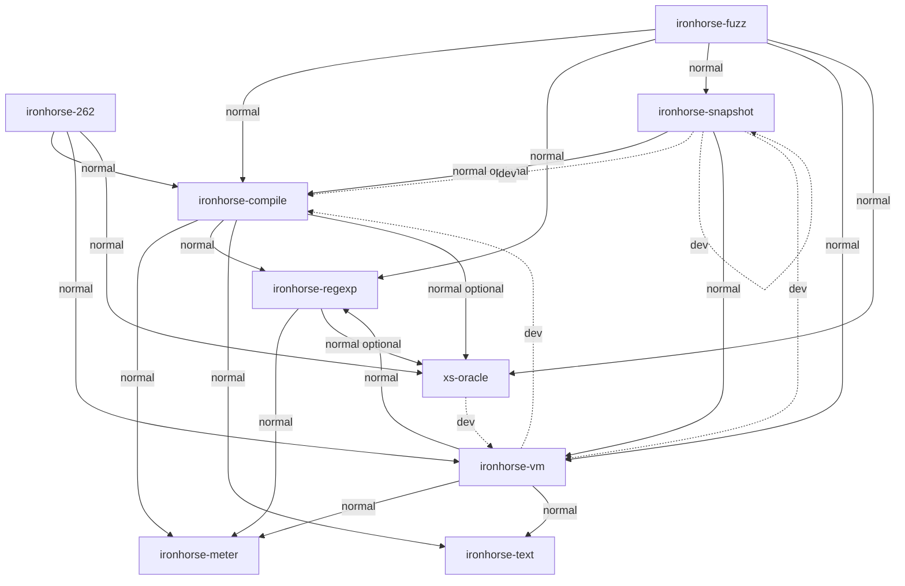

# Engine crate dependencies

Generated from Cargo metadata; do not edit this diagram by hand.
Regenerate: `python3 rust/engine/scripts/crate-graph.py` from the repository root.
CI checks drift with the same command plus `--check`.
Arrows point from dependent to dependency.
Solid edges are normal dependencies; dashed edges are development dependencies.
Optional dependencies are labeled: their presence does not mean the default build links them.

This graph includes optional oracle dependencies and the self development edge used
to enable snapshot tooling in tests.
External dependencies and outer-workspace consumers are described in
[ARCHITECTURE.md](ARCHITECTURE.md), not represented as workspace members.
